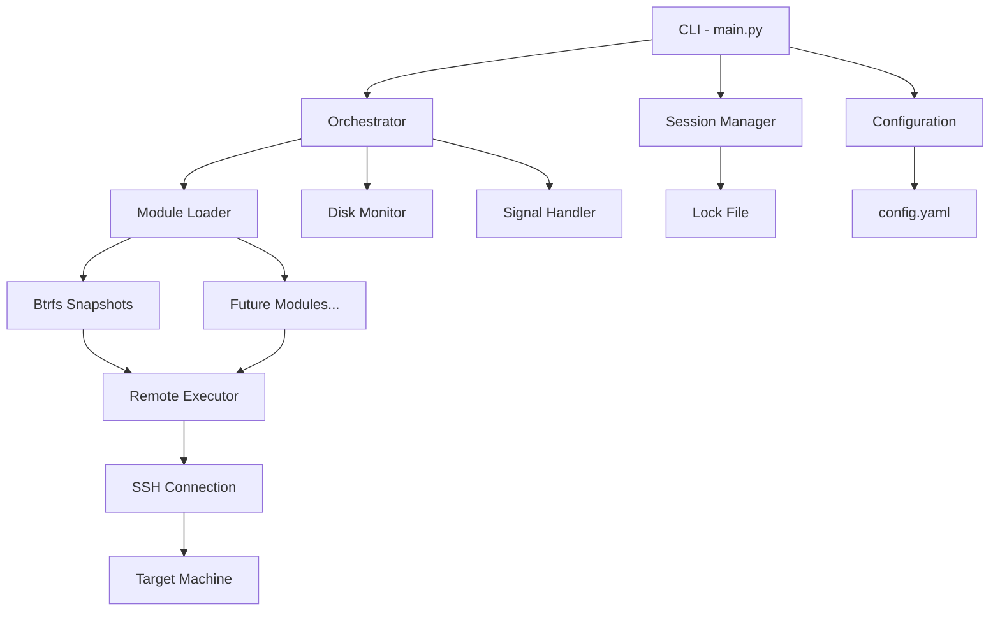
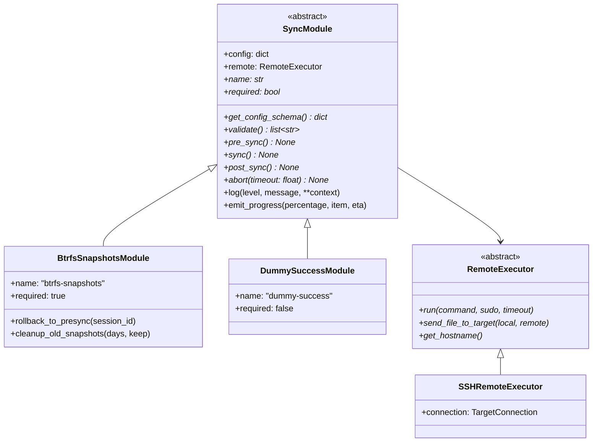
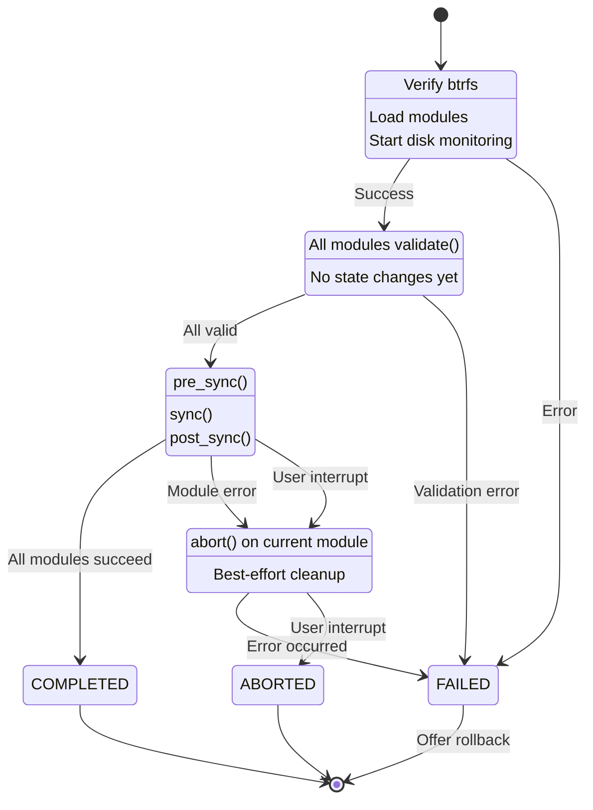
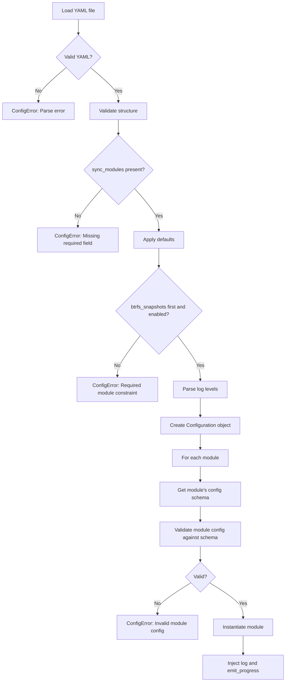
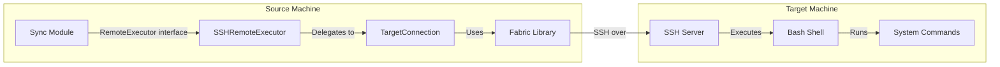
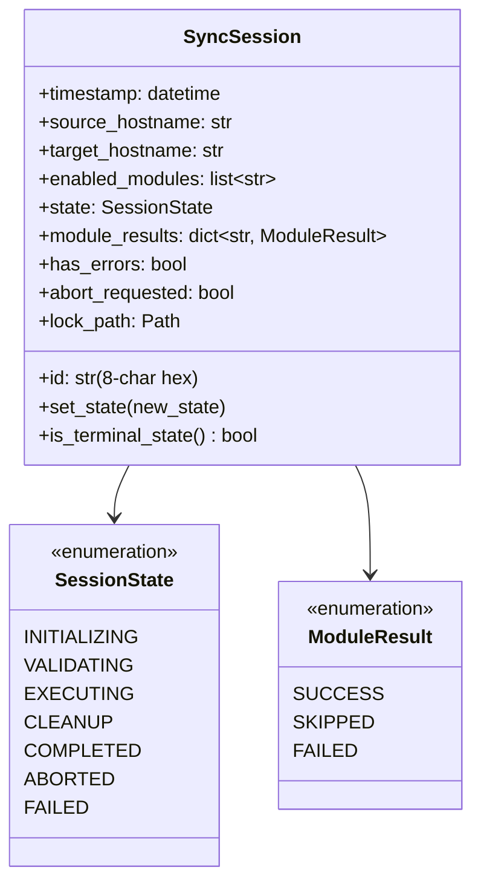
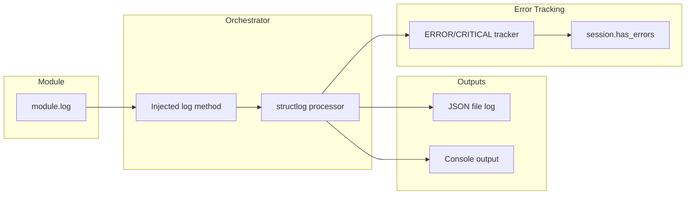
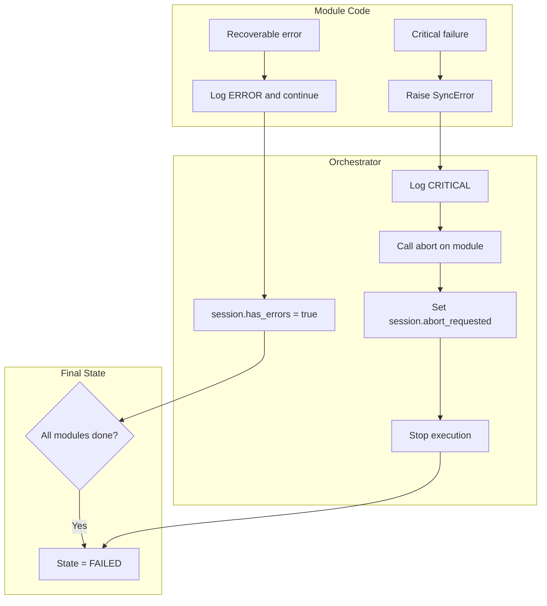

# PC-switcher Architecture

This document describes the high-level architecture of PC-switcher, including module interfaces, orchestrator workflow, and state transitions.

## System Overview

PC-switcher uses a modular architecture where each synchronization concern (snapshots, user data, packages, etc.) is implemented as a separate module. The orchestrator coordinates module execution and manages the sync lifecycle.



## Core Components

### Module Interface

All sync modules implement the `SyncModule` abstract base class defined in `src/pcswitcher/core/module.py`:



### Module Lifecycle

Each module progresses through a defined lifecycle managed by the orchestrator:


## Orchestrator Workflow

The orchestrator implements a state machine that coordinates the entire sync operation:



### State Descriptions

| State | Description | Entry Conditions |
|-------|-------------|------------------|
| INITIALIZING | Setup phase: verify prerequisites, load modules, start monitoring | CLI invokes sync command |
| VALIDATING | All modules run validate() without making changes | Initialization complete |
| EXECUTING | Execute modules: pre_sync -> sync -> post_sync | All validations pass |
| CLEANUP | Best-effort cleanup via abort() on current module | Error or interrupt |
| COMPLETED | All modules succeeded without errors | Execution finished |
| ABORTED | User interrupt (SIGINT/SIGTERM) | User pressed Ctrl+C |
| FAILED | Critical error occurred | Module raised SyncError |

## Configuration Flow

Configuration is loaded and validated before module instantiation:



## Remote Execution Architecture

SSH-based remote execution uses a layered approach:



### Connection Resilience


## Session Management

Each sync operation is tracked by a `SyncSession` object:



## Logging Architecture

Structured logging uses structlog with dual output:



### Log Level Flow


## Error Handling Strategy

PC-switcher uses exception-based error propagation with three categories:



## Snapshot Safety Model

Btrfs snapshots provide data safety through copy-on-write:


## Module Execution Order

Modules execute sequentially based on configuration order:

```mermaid
gantt
    title Module Execution Timeline
    dateFormat HH:mm
    axisFormat %H:%M

    section btrfs-snapshots
    validate       :v1, 00:00, 1m
    pre_sync       :p1, after v1, 2m
    sync           :s1, after p1, 1m
    post_sync      :o1, after s1, 2m

    section future-module-A
    validate       :v2, 00:00, 1m
    pre_sync       :p2, after o1, 3m
    sync           :s2, after p2, 10m
    post_sync      :o2, after s2, 2m

    section future-module-B
    validate       :v3, 00:00, 1m
    pre_sync       :p3, after o2, 1m
    sync           :s3, after p3, 5m
    post_sync      :o3, after s3, 1m
```



Key points:
- All `validate()` methods run during VALIDATING phase (no interleaving)
- Module lifecycle (pre_sync -> sync -> post_sync) runs completely before next module starts
- On failure, only current module's `abort()` is called
- Order defined in config file determines execution sequence

## Performance Considerations

### Startup Timing

The orchestrator measures startup performance (T125):

```plain
CLI invocation -> Config load -> Session create -> Orchestrator init -> run()
                   ~10ms           ~5ms              ~1ms              logged
```

### Minimal Disk Writes (T126)

- **Logging**: Buffered output, JSON file appends
- **Snapshots**: Btrfs COW means no data copying, only metadata
- **Progress**: In-memory tracking, UI updates only
- **State**: Session state tracked in memory, not persisted

### Memory Efficiency

- Modules execute sequentially (not parallel) to limit memory usage
- Progress reporting uses callbacks (no buffering large data)
- File transfers stream data (no in-memory storage)

## Future Extension Points

### Adding New Modules

1. Implement `SyncModule` interface
2. Define JSON Schema for configuration
3. Register in module loader (convention-based discovery)
4. Add to config schema documentation

### Adding New CLI Commands

1. Add Typer command in `cli/main.py`
2. Use existing orchestrator/session infrastructure
3. Follow established error handling patterns

### Adding New Remote Operations

1. Extend `RemoteExecutor` interface if needed
2. Implement in `SSHRemoteExecutor`
3. Ensure reconnection resilience
4. Handle timeout scenarios
