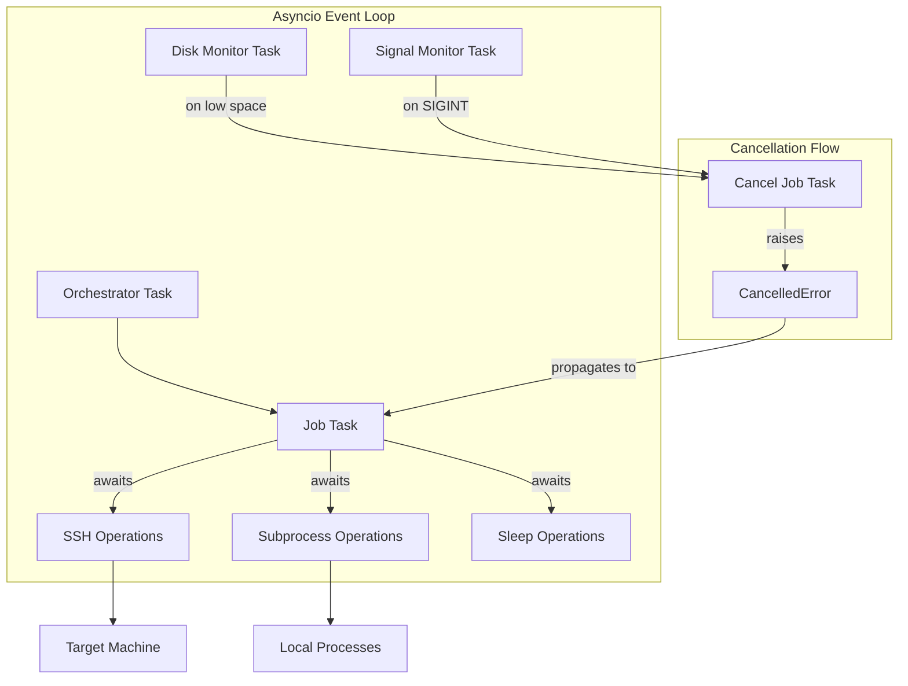
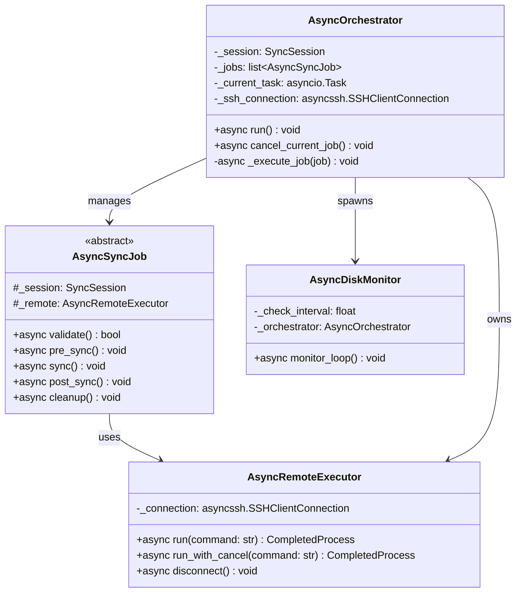
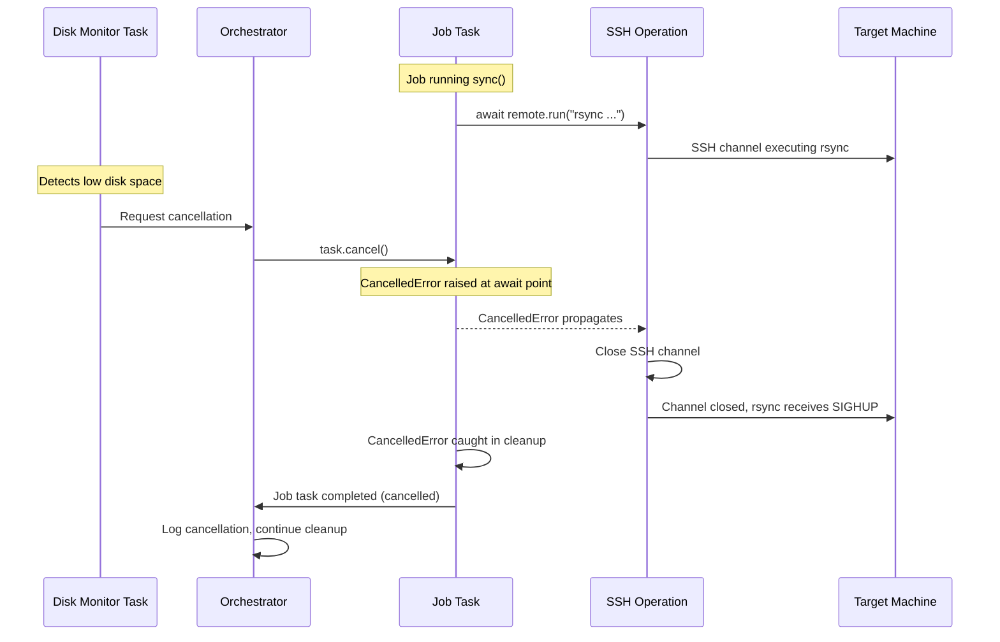
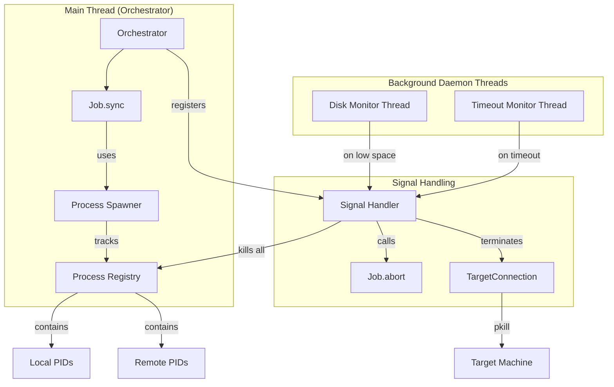
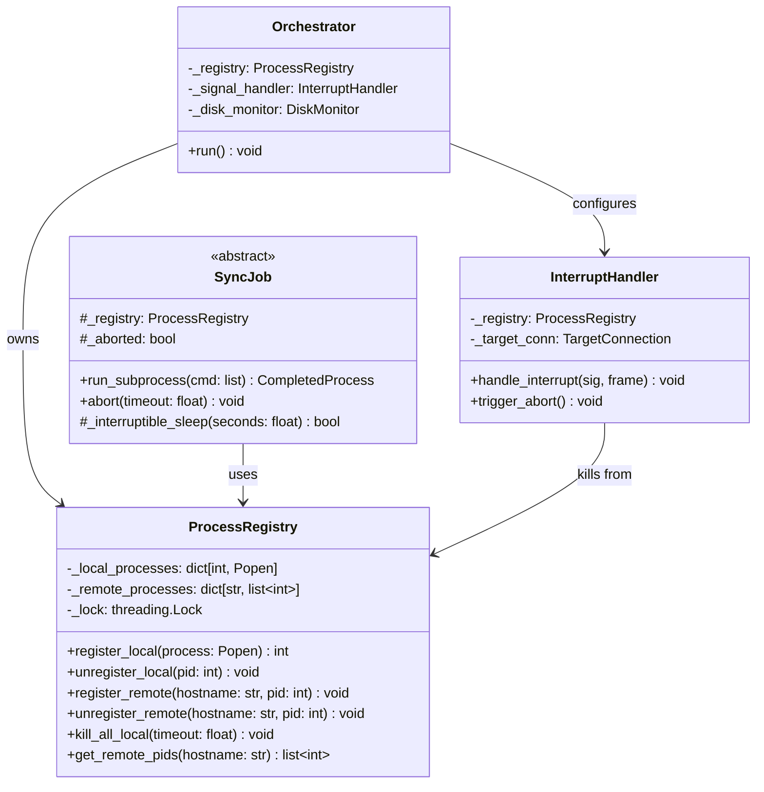
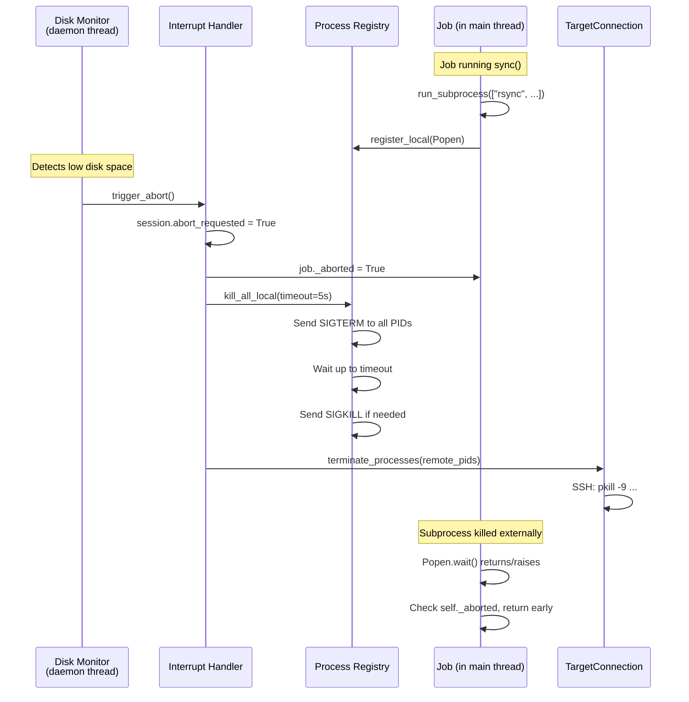
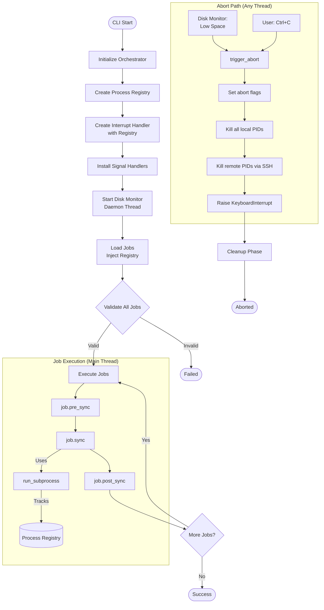

# Concurrency Architecture Analysis: Async vs Sync

## Problem Statement

The current implementation has **critical gaps** in abort/interrupt handling:

1. **Jobs run synchronously** in main thread - can't be interrupted mid-operation
2. **Subprocess calls block** until completion - `subprocess.run()` can't be killed externally
3. **No process tracking** - spawned processes aren't registered for cleanup
4. **Signal handler is toothless** - sets flag but can't kill running processes
5. **Disk monitor can't abort** - only warns, doesn't stop the sync

**Result**: Spec requirements FR-003, FR-025, FR-027 (abort within 5s, no orphaned processes) **cannot be met**.

---

## Current Architecture Reality Check

### Documented Design (ARCHITECTURE.md)

The architecture document describes:
- Sequential job execution with state machine
- Signal handling (SIGINT/SIGTERM) that calls `abort(timeout)` on current job
- Disk monitoring in background thread
- Job lifecycle: validate → pre_sync → sync → post_sync → abort (on error/interrupt)
- Clear abort semantics: "stop what you're doing NOW"

### Actual Implementation

**Orchestrator (`/home/janfr/dev/pc-switcher/src/pcswitcher/core/orchestrator.py`):**
- Uses Python's `signal.signal()` to catch SIGINT
- Handler sets `session.abort_requested = True` and raises `KeyboardInterrupt`
- `KeyboardInterrupt` caught in `run()` method which calls `cleanup_current_job()`
- Jobs run synchronously in main thread

**Job Interface (`/home/janfr/dev/pc-switcher/src/pcswitcher/core/job.py`):**
- `abort(timeout: float)` is a synchronous method
- No threading primitives in base interface
- Jobs track `_aborted` flag internally

**Dummy Success Job (`/home/janfr/dev/pc-switcher/src/pcswitcher/jobs/dummy_success.py`):**
- Uses `time.sleep(1)` in loops (blocking!)
- Checks `self._aborted` flag between sleep iterations
- Cooperative abort: only responds when loop iteration completes

### Discrepancies Between Documentation and Implementation

1. **Abort timing guarantee mismatch**:
   - **Docs**: "waiting up to the specified timeout duration" (FR-003), "Must respond within 5 seconds" (FR-025)
   - **Reality**: If job is in `time.sleep(1)`, it won't see the abort request for up to 1 second. If job calls `subprocess.run()` or `remote.run()` with 30-second timeout, it blocks until that completes.

2. **Force-kill mechanism absent**:
   - **Docs**: FR-003 says "orchestrator MUST force-kill the RemoteExecutor connections and job thread"
   - **Reality**: No thread-based execution. No force-kill mechanism. The `abort()` method just sets a flag.

3. **Signal handling raises exception, not cooperative**:
   - **Docs**: Implies gradual abort coordination
   - **Reality**: Signal handler raises `KeyboardInterrupt` which unwinds the call stack

4. **No orphan process prevention**:
   - **Docs**: FR-027 requires "no orphaned processes remain on source or target"
   - **Reality**: If `subprocess.run()` is in progress during Ctrl+C, the subprocess continues running. No tracking/killing mechanism exists.

---

## Job Execution Scenarios

### Operations Jobs Currently Perform

1. **`time.sleep()`** - Blocking, uninterruptible
2. **`subprocess.run()`** (local) - Blocks until process completes or timeout
3. **`self.remote.run()`** (SSH) - Fabric SSH call, blocks until complete or timeout
4. **File I/O** - Generally fast, not a concern
5. **Loops with flag checking** - Only responsive between iterations

### Real-World Sync Operations (Future Jobs)

Based on similar tools (rsync, borg backup, duplicity, lsyncd):

1. **Rsync operations**: Long-running subprocess (minutes to hours)
   - `subprocess.Popen(['rsync', '-avz', '--progress', source, target])`
   - Needs to track PID for kill capability

2. **Docker operations**:
   - `docker save` / `docker load` - Can run for many minutes
   - `docker pull` - Network-bound, potentially slow

3. **VM snapshot transfer**:
   - `virsh dumpxml` - Quick
   - `qemu-img convert` - Very slow (GBs of data)

4. **K3s state sync**:
   - Kubectl commands
   - PVC data transfer via rsync or similar

5. **Package operations**:
   - `apt-get install` - Network and disk bound
   - `dpkg --set-selections` - Quick
   - `apt-mark` - Quick

### Blocking Operations Requiring Interrupt Capability

| Operation | Typical Duration | Interrupt Requirement |
|-----------|------------------|----------------------|
| `time.sleep()` | 1-30 seconds | Must be interruptible |
| `subprocess.run()` local | Minutes to hours | Must track PID, kill on abort |
| `remote.run()` SSH | Seconds to minutes | Must timeout, kill remote process |
| Large file transfers | Minutes | Must be interruptible |
| Network operations | Unbounded | Must timeout |

---

## Abort/Interrupt Requirements

### Disk Monitor Low Space Detection

**Current Implementation** (`/home/janfr/dev/pc-switcher/src/pcswitcher/utils/disk.py`):
- Runs in daemon thread (`threading.Thread(daemon=True)`)
- Checks disk space at configurable interval (default 30s)
- Calls callback on low space
- **Problem**: Callback only logs a warning. Does NOT trigger abort.

**What Should Happen**:
- Callback should set `session.abort_requested = True`
- Should terminate currently running subprocess/SSH operation
- Job should see abort request within seconds (not 30s+)

### Ctrl+C (SIGINT) Requirements

**What Actually Happens Now**:
1. Signal handler catches SIGINT
2. Logs "Sync interrupted by user"
3. Sets `session.abort_requested = True`
4. Raises `KeyboardInterrupt`
5. Exception caught in `run()`, calls `cleanup_current_job()`
6. `cleanup_current_job()` calls `job.abort(timeout=5.0)`
7. Job's abort() sets flag but doesn't kill running processes

**What Should Happen (Per Spec)**:
- FR-024: Log "Sync interrupted by user" at WARNING (done)
- FR-025: Send termination signal to target-side processes (partially done via `TargetConnection.terminate_processes()`, but not called)
- FR-026: Second SIGINT force-terminates (implemented in `InterruptHandler._handle_interrupt()`)
- FR-027: No orphaned processes (NOT IMPLEMENTED)

### Abort Response Time

**Spec Requirement**: Within 5 seconds (SC-003, FR-003)

**Current Reality**: Could be unbounded. If job calls:
```python
self.remote.run("rsync ...", timeout=None)
```
The abort() method can't interrupt it. Python's signal handling can't interrupt blocking C code (like SSH/socket operations).

### Required Cleanup

1. Kill local subprocesses started by job
2. Kill remote processes on target machine
3. Close SSH connections gracefully
4. Log what was interrupted
5. NOT undo partial work (that's rollback's job)

---

## Concurrency Options Analysis

### Option A: Pure Synchronous + Cooperative Abort (Current Approach)

**How It Works**:
- Jobs run in main thread
- Check `self._aborted` flag periodically
- Signal handler raises exception to unwind stack

**Implementation Complexity**: LOW (already implemented)

**Abort Responsiveness**: POOR
- Only responsive between blocking calls
- `time.sleep(1)` means up to 1s delay
- `subprocess.run()` with timeout means full timeout delay
- No way to interrupt blocking SSH operations

**Resource Cleanup Guarantees**: POOR
- No mechanism to kill subprocesses
- No tracking of spawned processes
- Best-effort only

**Python Ecosystem Support**: EXCELLENT
- Standard Python, no additional dependencies
- Well-understood programming model

**Testing Complexity**: LOW
- Sequential execution easy to reason about
- No race conditions in job code

**Code Pattern**:
```python
def sync(self) -> None:
    for item in items:
        if self._aborted:
            return
        time.sleep(1)  # Can't interrupt this
        # work...
```

**Verdict**: Insufficient for production use. Can't meet FR-003, FR-025, FR-027.

---

### Option B: Jobs Run in Separate Threads

**How It Works**:
- Orchestrator spawns thread for each job execution
- Main thread monitors for abort signals
- Can forcefully kill thread via timeout/interrupt

**Implementation Complexity**: MODERATE

**Abort Responsiveness**: MODERATE
- Main thread can set abort flag immediately
- Thread still needs to notice flag (cooperative)
- Python's GIL limits true parallelism
- Can't actually kill a thread in Python (no `Thread.kill()`)

**Resource Cleanup Guarantees**: MODERATE
- Still need subprocess tracking
- Thread won't be force-killed (Python limitation)
- Must use `threading.Event` for interruptible sleeps

**Python Ecosystem Support**: GOOD
- `threading` is standard library
- But: Python doesn't support killing threads
- Can use `concurrent.futures.ThreadPoolExecutor`

**Testing Complexity**: MODERATE
- Race conditions possible
- Need to test thread cleanup
- Harder to debug

**Code Pattern**:
```python
# In Orchestrator
def _execute_job_with_timeout(self, job):
    with ThreadPoolExecutor(max_workers=1) as executor:
        future = executor.submit(job.sync)
        try:
            future.result(timeout=300)  # 5 minutes
        except TimeoutError:
            job.abort(5.0)
            # Can't force-kill thread
```

**Verdict**: Doesn't solve the core problem. Python threads can't be killed, so blocking operations still block.

---

### Option C: Async/Await Throughout

**How It Works**:
- Use `asyncio` for all I/O operations
- `await asyncio.sleep()` is interruptible
- `asyncio.subprocess` for local commands
- `asyncssh` for SSH operations

**Implementation Complexity**: HIGH
- Must rewrite entire job interface
- All jobs must be async
- Need async-compatible libraries

**Abort Responsiveness**: EXCELLENT
- Can cancel async tasks immediately
- `task.cancel()` raises `CancelledError`
- All I/O is non-blocking

**Resource Cleanup Guarantees**: EXCELLENT
- `asyncio.subprocess.Process.kill()` available
- SSH tasks can be cancelled
- Structured concurrency ensures cleanup
- `asyncio.TaskGroup` provides automatic cleanup on failure

**Python Ecosystem Support**: MODERATE
- `asyncio` is standard library (Python 3.11+)
- `asyncssh` replaces Fabric (Paramiko-based)
- `rich` supports async
- BUT: Breaks compatibility with synchronous code patterns

**Testing Complexity**: HIGH
- Must use `pytest-asyncio`
- Async debugging is harder
- Different mental model

**Code Pattern**:
```python
class SyncJob(ABC):
    @abstractmethod
    async def sync(self) -> None:
        ...

async def sync(self) -> None:
    for item in items:
        if self._aborted:
            return
        await asyncio.sleep(1)  # Cancellable!
        await self.remote.run("...")  # Cancellable!
```

**Verdict**: Solves the problem completely but requires major rewrite.

#### Key Principles of Option C

1. **Everything is async** - All job methods are coroutines
2. **Task-based cancellation** - Each job runs as an `asyncio.Task` that can be cancelled
3. **Structured concurrency** - Use `asyncio.TaskGroup` for automatic cleanup
4. **asyncssh for remote** - Replace Fabric/Paramiko with asyncssh
5. **Single event loop** - One event loop manages all concurrency

#### Async - Architecture Overview



#### Class Design for Option C



#### Abort Flow (Cancellation) for Option C



#### Job Implementation Pattern for Option C

```python
import asyncio
from abc import ABC, abstractmethod
from asyncssh import SSHClientConnection

class AsyncSyncJob(ABC):
    """Abstract base class for async sync jobs."""

    def __init__(
        self,
        config: dict[str, Any],
        remote: AsyncRemoteExecutor,
        session: SyncSession
    ):
        self._config = config
        self._remote = remote
        self._session = session

    @abstractmethod
    async def validate(self) -> bool:
        """Validate job can run. Returns True if valid."""
        ...

    @abstractmethod
    async def pre_sync(self) -> None:
        """Pre-sync operations (e.g., create snapshots)."""
        ...

    @abstractmethod
    async def sync(self) -> None:
        """Main sync operation."""
        ...

    @abstractmethod
    async def post_sync(self) -> None:
        """Post-sync operations (e.g., cleanup)."""
        ...

    async def cleanup(self) -> None:
        """Cleanup after cancellation. Override if needed."""
        pass


class DummySuccessJob(AsyncSyncJob):
    """Example async job implementation."""

    async def validate(self) -> bool:
        return True

    async def pre_sync(self) -> None:
        self._logger.info("Pre-sync starting")
        await asyncio.sleep(1)  # Cancellable!

    async def sync(self) -> None:
        duration = self._config.get("duration_seconds", 20)

        for i in range(duration):
            # No need to check _aborted flag - cancellation handles it
            self.emit_progress(i / duration, f"Progress: {i}/{duration}")
            await asyncio.sleep(1)  # Cancellable!

            # Run remote command - also cancellable
            await self._remote.run("echo 'heartbeat'")

        self.emit_progress(1.0, "Complete")

    async def post_sync(self) -> None:
        await asyncio.sleep(0.5)  # Cancellable!
```

#### Orchestrator Implementation for Option C

```python
import asyncio
import signal
from contextlib import asynccontextmanager

class AsyncOrchestrator:
    """Orchestrates async job execution with cancellation support."""

    def __init__(self, config: Config, session: SyncSession):
        self._config = config
        self._session = session
        self._jobs: list[AsyncSyncJob] = []
        self._current_task: asyncio.Task | None = None
        self._ssh_connection: asyncssh.SSHClientConnection | None = None

    async def run(self) -> None:
        """Main entry point."""
        # Install signal handlers
        loop = asyncio.get_running_loop()
        loop.add_signal_handler(signal.SIGINT, self._handle_sigint)
        loop.add_signal_handler(signal.SIGTERM, self._handle_sigint)

        try:
            async with asyncio.TaskGroup() as tg:
                # Start disk monitor as background task
                tg.create_task(self._disk_monitor_loop())

                # Execute jobs sequentially
                for job in self._jobs:
                    await self._execute_job(job)

        except* asyncio.CancelledError:
            self._logger.warning("Sync cancelled")
            await self._cleanup_all()
            raise

    async def _execute_job(self, job: AsyncSyncJob) -> None:
        """Execute a single job as a cancellable task."""
        self._current_task = asyncio.current_task()

        try:
            if not await job.validate():
                raise SyncError(f"Job {job.name} validation failed")

            await job.pre_sync()
            await job.sync()
            await job.post_sync()

        except asyncio.CancelledError:
            self._logger.info(f"Job {job.name} was cancelled")
            await job.cleanup()
            raise

        finally:
            self._current_task = None

    def _handle_sigint(self) -> None:
        """Handle SIGINT by cancelling current job."""
        self._logger.warning("Sync interrupted by user")
        if self._current_task:
            self._current_task.cancel()

    async def _disk_monitor_loop(self) -> None:
        """Background task monitoring disk space."""
        while True:
            await asyncio.sleep(self._config.disk.check_interval)

            if not self._check_disk_space():
                self._logger.critical("Disk space critically low, aborting")
                if self._current_task:
                    self._current_task.cancel()
                return

    async def cancel_current_job(self) -> None:
        """Cancel the currently executing job."""
        if self._current_task and not self._current_task.done():
            self._current_task.cancel()
            try:
                await self._current_task
            except asyncio.CancelledError:
                pass
```

#### Remote Executor for Option C

```python
import asyncssh
from dataclasses import dataclass

@dataclass
class CompletedProcess:
    returncode: int
    stdout: str
    stderr: str

class AsyncRemoteExecutor:
    """Async SSH command execution using asyncssh."""

    def __init__(self, connection: asyncssh.SSHClientConnection):
        self._connection = connection

    async def run(
        self,
        command: str,
        sudo: bool = False,
        timeout: float | None = None
    ) -> CompletedProcess:
        """Run command on remote host. Cancellable via task cancellation."""
        if sudo:
            command = f"sudo {command}"

        try:
            result = await asyncio.wait_for(
                self._connection.run(command),
                timeout=timeout
            )
            return CompletedProcess(
                returncode=result.exit_status or 0,
                stdout=result.stdout or "",
                stderr=result.stderr or ""
            )
        except asyncio.TimeoutError:
            raise TimeoutError(f"Command timed out: {command}")
        # CancelledError propagates naturally

    async def run_subprocess(
        self,
        cmd: list[str],
        timeout: float | None = None
    ) -> CompletedProcess:
        """Run local subprocess. Cancellable."""
        proc = await asyncio.create_subprocess_exec(
            *cmd,
            stdout=asyncio.subprocess.PIPE,
            stderr=asyncio.subprocess.PIPE
        )

        try:
            stdout, stderr = await asyncio.wait_for(
                proc.communicate(),
                timeout=timeout
            )
            return CompletedProcess(
                returncode=proc.returncode or 0,
                stdout=stdout.decode() if stdout else "",
                stderr=stderr.decode() if stderr else ""
            )
        except asyncio.CancelledError:
            proc.kill()
            await proc.wait()
            raise
        except asyncio.TimeoutError:
            proc.kill()
            await proc.wait()
            raise

    async def disconnect(self) -> None:
        """Close SSH connection."""
        self._connection.close()
        await self._connection.wait_closed()


async def connect_to_target(hostname: str, username: str) -> AsyncRemoteExecutor:
    """Establish async SSH connection."""
    connection = await asyncssh.connect(
        hostname,
        username=username,
        known_hosts=None  # Or path to known_hosts
    )
    return AsyncRemoteExecutor(connection)
```

#### Disk Monitor Integration for Option C

```python
class AsyncDiskMonitor:
    """Async disk space monitor."""

    def __init__(
        self,
        orchestrator: AsyncOrchestrator,
        paths: list[Path],
        check_interval: float,
        minimum_free: str
    ):
        self._orchestrator = orchestrator
        self._paths = paths
        self._check_interval = check_interval
        self._minimum_free = minimum_free

    async def monitor_loop(self) -> None:
        """Continuously monitor disk space."""
        while True:
            await asyncio.sleep(self._check_interval)

            for path in self._paths:
                if not self._has_sufficient_space(path):
                    self._logger.critical(
                        f"Disk space critically low on {path}"
                    )
                    await self._orchestrator.cancel_current_job()
                    return

    def _has_sufficient_space(self, path: Path) -> bool:
        """Check if path has sufficient free space."""
        stat = os.statvfs(path)
        free_bytes = stat.f_bavail * stat.f_frsize
        # Parse minimum_free and compare
        return free_bytes >= self._parse_threshold(self._minimum_free)
```

#### Overall Execution Flow for Option C

```mermaid
flowchart TD
    Start([CLI Start]) --> Init[Initialize AsyncOrchestrator]
    Init --> Connect[await asyncssh.connect]
    Connect --> InstallSig[Install async signal handlers]

    InstallSig --> TaskGroup[Create asyncio.TaskGroup]

    subgraph TaskGroup["TaskGroup Context"]
        TaskGroup --> StartDM[Start Disk Monitor Task]
        TaskGroup --> LoadMod[Load Async Jobs]

        LoadMod --> ExecLoop{For each job}

        ExecLoop --> |Next job| Validate[await job.validate]
        Validate --> |Valid| PreSync[await job.pre_sync]
        PreSync --> Sync[await job.sync]
        Sync --> PostSync[await job.post_sync]
        PostSync --> ExecLoop

        ExecLoop --> |All done| Complete([Success])
    end

    subgraph CancellationPath["Cancellation Path"]
        DiskLow[Disk Monitor:<br/>Low Space] --> Cancel[task.cancel]
        UserCtrlC[SIGINT Handler] --> Cancel
        Cancel --> CancelledError[CancelledError raised]
        CancelledError --> Cleanup[await job.cleanup]
        Cleanup --> CloseSSH[await connection.close]
    end

    CancelledError --> Abort([Aborted])

    Validate --> |Invalid| Fail([Failed])
```

#### Key Benefits of Option C

1. **True cancellation** - `task.cancel()` immediately raises `CancelledError` at the current await point
2. **No process tracking needed** - Asyncio manages all resources automatically
3. **Cleaner code** - No threading locks, no race conditions
4. **Better composability** - Async functions compose naturally
5. **Built-in timeouts** - `asyncio.wait_for()` handles timeouts elegantly

#### What Changes for Option C

| Component | Current | After (Async) |
|-----------|---------|---------------|
| `SyncJob` | Synchronous methods | All methods are `async def` |
| `Orchestrator` | Synchronous, main thread | Async, runs in event loop |
| `TargetConnection` | Fabric/Paramiko | asyncssh |
| `subprocess.run()` | Blocking | `asyncio.create_subprocess_exec()` |
| `time.sleep()` | Blocking | `await asyncio.sleep()` |
| Signal handler | Sets flag, raises exception | Calls `task.cancel()` |
| Disk monitor | Daemon thread with callback | Async task in TaskGroup |
| Abort mechanism | Flag + process kill | Task cancellation |

#### Testing Strategy for Option C

1. **Unit tests**: Use `pytest-asyncio`, mock asyncssh connection
2. **Cancellation tests**: Verify `CancelledError` propagates correctly
3. **Timeout tests**: Verify `asyncio.wait_for()` raises `TimeoutError`
4. **Integration tests**: Real asyncssh connection, verify cleanup
5. **Signal tests**: Send SIGINT, verify task cancelled

#### Implementation Steps for Option C

1. Add `asyncssh` dependency, remove Fabric
2. Create `AsyncRemoteExecutor` class
3. Convert `SyncJob` interface to async
4. Convert `Orchestrator` to async with TaskGroup
5. Implement async disk monitor
6. Convert all existing jobs to async
7. Update CLI entry point to use `asyncio.run()`
8. Update all tests to use `pytest-asyncio`
9. Update `ARCHITECTURE.md`

#### Dependencies for Option C

```toml
[project]
dependencies = [
    "asyncssh>=2.14.0",
    "rich>=13.0.0",  # Already supports async
    "structlog>=23.0.0",
]

[project.optional-dependencies]
dev = [
    "pytest>=7.0.0",
    "pytest-asyncio>=0.21.0",
]
```

---

### Option D: Hybrid - Sync Jobs with Subprocess Tracking/Killing

**How It Works**:
- Jobs remain synchronous (simple programming model)
- Add subprocess tracking to job base class
- Signal handler kills tracked processes directly
- Use `subprocess.Popen()` instead of `subprocess.run()`
- Use threading only for timeout enforcement

**Implementation Complexity**: MODERATE

**Abort Responsiveness**: MODERATE
- Signal handler can kill processes immediately (milliseconds)
- Disk monitor responsiveness depends on check interval (default 30s, should be ~1s)
- `Popen.kill()` is immediate once triggered

**Important Caveat**: The disk monitor runs in a daemon thread that can kill tracked processes, but responsiveness depends on check interval configuration.

**Resource Cleanup Guarantees**: GOOD
- Track all spawned processes in registry
- Kill all tracked processes on abort
- Remote process cleanup via SSH `pkill`

**Python Ecosystem Support**: EXCELLENT
- Standard library only
- No paradigm shift
- Incremental adoption

**Testing Complexity**: LOW-MODERATE
- Still mostly synchronous
- Need to test process cleanup
- Can mock subprocess calls

**Code Pattern**:
```python
class SyncJob(ABC):
    def __init__(self, ...):
        self._tracked_processes: list[Popen] = []

    def run_tracked_subprocess(self, cmd: list[str], **kwargs):
        """Run subprocess and track for abort cleanup."""
        proc = subprocess.Popen(cmd, ...)
        self._tracked_processes.append(proc)
        try:
            stdout, stderr = proc.communicate(timeout=kwargs.get('timeout'))
            return subprocess.CompletedProcess(cmd, proc.returncode, stdout, stderr)
        except subprocess.TimeoutExpired:
            proc.kill()
            raise
        finally:
            self._tracked_processes.remove(proc)

    def abort(self, timeout: float) -> None:
        """Kill all tracked processes."""
        for proc in self._tracked_processes:
            proc.terminate()
            try:
                proc.wait(timeout=timeout / len(self._tracked_processes))
            except subprocess.TimeoutExpired:
                proc.kill()
```

**Signal Handler Enhancement**:
```python
def _handle_interrupt(self, signum, frame):
    # ... existing logic ...

    # Kill all tracked processes immediately
    if self._current_job:
        for proc in self._current_job._tracked_processes:
            proc.kill()

    raise KeyboardInterrupt
```

**Verdict**: Good balance of simplicity and effectiveness. Incremental improvement that solves the core problems.

#### Key Principles of Option D

1. **Keep synchronous job execution** (simple mental model)
2. **Track all spawned processes** (local and remote PIDs)
3. **Signal handler actively kills processes** (not just sets flag)
4. **Interruptible blocking operations** (sleep, SSH waits with timeouts)
5. **Disk monitor triggers real abort** (same mechanism as Ctrl+C)

#### Threading Model

```plain
Main Thread (Orchestrator)
├── Job.sync() running
│   └── proc.communicate() BLOCKED waiting for rsync to finish
│
Disk Monitor Daemon Thread (concurrent)
└── Sleeping between checks
    └── When disk low: calls registry.kill_all_local()
        └── Calls proc.kill() on processes (thread-safe)

Signal Handler (async, runs when SIGINT received)
└── Calls registry.kill_all_local()
    └── Calls proc.kill() on processes
```

**Key insight**: `proc.kill()` can be called from any thread - it just sends a signal to the process. The `ProcessRegistry` uses locks to ensure thread-safe access to the process list.

#### Architecture Overview of Option D



#### Process Registry Design for Option D



#### Abort Flow for Option D



#### Job Implementation Pattern for Option D

```python
class SyncJob(ABC):
    """Abstract base class with process tracking."""

    def __init__(self, config, remote, registry: ProcessRegistry):
        self._registry = registry
        self._aborted = False
        self._remote_pids: list[int] = []

    def run_subprocess(
        self,
        cmd: list[str],
        timeout: float | None = None,
        **kwargs
    ) -> subprocess.CompletedProcess:
        """Run local subprocess with automatic tracking."""
        proc = subprocess.Popen(
            cmd,
            stdout=subprocess.PIPE,
            stderr=subprocess.PIPE,
            **kwargs
        )
        self._registry.register_local(proc)
        try:
            stdout, stderr = proc.communicate(timeout=timeout)
            return subprocess.CompletedProcess(
                cmd, proc.returncode, stdout, stderr
            )
        finally:
            self._registry.unregister_local(proc.pid)

    def run_remote_tracked(
        self,
        command: str,
        sudo: bool = False,
        timeout: float = 30.0
    ) -> CompletedProcess:
        """Run remote command and track the PID for cleanup."""
        # Start process and get its PID
        result = self.remote.run(
            f"bash -c '{command} & echo $!'",
            sudo=sudo,
            timeout=5.0
        )
        pid = int(result.stdout.strip())
        self._registry.register_remote(self.remote.get_hostname(), pid)
        self._remote_pids.append(pid)

        # Wait for completion
        try:
            return self.remote.run(f"wait {pid}", timeout=timeout)
        finally:
            self._registry.unregister_remote(
                self.remote.get_hostname(), pid
            )
            self._remote_pids.remove(pid)

    def _interruptible_sleep(self, seconds: float) -> bool:
        """Sleep in small increments, checking abort flag.

        Returns True if aborted, False if sleep completed.
        """
        chunks = int(seconds * 10)  # 100ms chunks
        for _ in range(chunks):
            if self._aborted:
                return True
            time.sleep(0.1)
        return False

    def abort(self, timeout: float) -> None:
        """Stop operations and cleanup. Called externally."""
        self._aborted = True
        # Note: Process killing is done by InterruptHandler,
        # not here (it has access to registry)
```

#### Signal Handler Enhancement for Option D

```python
class InterruptHandler:
    def __init__(
        self,
        session: SyncSession,
        registry: ProcessRegistry,
        target_conn: TargetConnection | None = None
    ):
        self._session = session
        self._registry = registry
        self._target_conn = target_conn
        self._current_job: SyncJob | None = None

    def trigger_abort(self) -> None:
        """Trigger abort from any source (signal, disk monitor, etc)."""
        self._session.abort_requested = True

        # Set job abort flag
        if self._current_job:
            self._current_job._aborted = True

        # Kill all local processes immediately
        self._registry.kill_all_local(timeout=5.0)

        # Kill remote processes
        if self._target_conn:
            remote_pids = self._registry.get_all_remote_pids()
            self._target_conn.terminate_processes(remote_pids)

    def _handle_signal(self, signum: int, frame) -> None:
        """SIGINT/SIGTERM handler."""
        self._logger.warning("Sync interrupted by user")
        self.trigger_abort()
        raise KeyboardInterrupt()
```

#### Disk Monitor Integration for Option D

```python
# In Orchestrator._start_runtime_monitoring()

def on_disk_low(free_bytes: float, required_bytes: float) -> None:
    """Callback when disk space is critically low."""
    self._logger.critical(
        "Disk space critically low, aborting sync",
        free_bytes=free_bytes,
        required_bytes=required_bytes
    )
    self._interrupt_handler.trigger_abort()

self._disk_monitor.monitor_continuously(
    path=Path("/"),
    interval=config.disk.check_interval,  # Should be 1s for good responsiveness
    reserve_minimum=config.disk.runtime_minimum,
    callback=on_disk_low
)
```

#### Overall Execution Flow for Option D



#### Key Benefits of Option D

1. **Immediate abort for signals** - SIGINT kills processes within milliseconds
2. **No orphaned processes** - All PIDs tracked and killed on abort
3. **Simple job code** - Authors use `run_subprocess()` helper, tracking is automatic
4. **Unified abort mechanism** - Same path for Ctrl+C, disk low, timeout, etc.
5. **Minimal refactoring** - Builds on existing synchronous architecture

#### What Changes for Option D

| Component | Current | After |
|-----------|---------|-------|
| `SyncJob` | No process tracking | `ProcessRegistry` injected, helper methods |
| `subprocess.run()` | Direct call, untracked | Use `self.run_subprocess()` (tracked) |
| `time.sleep()` | Blocking, uninterruptible | Use `self._interruptible_sleep()` |
| Signal handler | Sets flag only | Kills all tracked processes immediately |
| Disk monitor callback | Logs warning | Calls `interrupt_handler.trigger_abort()` |
| `Orchestrator` | No process awareness | Owns `ProcessRegistry`, passes to all jobs |

#### Testing Strategy for Option D

1. **Unit tests**: Mock `ProcessRegistry`, verify tracking/untracking
2. **Integration tests**: Spawn real subprocess, abort, verify it's dead
3. **Signal tests**: Send SIGINT, verify all processes killed
4. **Disk monitor tests**: Mock low space, verify abort triggered

#### Implementation Steps for Option D

1. Create `ProcessRegistry` class
2. Enhance `SyncJob` base with tracking helpers
3. Update `InterruptHandler` to use registry
4. Connect disk monitor callback to abort
5. Update existing jobs to use new helpers
6. Update `ARCHITECTURE.md` to match implementation
7. Add tests for abort behavior

---

## Spec Requirements Analysis (FR-024 through FR-029)

### FR-024: System MUST install SIGINT handler

**Requirement**: Call abort(timeout) on current job, log "Sync interrupted by user" at WARNING level, exit with code 130

**Current Status**: PARTIALLY COMPLIANT
- Signal handler installed
- Logs "Sync interrupted by user"
- Sets abort flag
- **Issue**: Doesn't wait for abort to complete before exiting

### FR-025: Send termination signal to target-side processes

**Requirement**: Wait up to 5 seconds for graceful shutdown

**Current Status**: NOT COMPLIANT
- `TargetConnection.terminate_processes()` exists but is never called
- No tracking of what processes to terminate
- Jobs don't report what they started on target

### FR-026: Second SIGINT force-terminates

**Requirement**: Immediately force-terminate without waiting

**Current Status**: COMPLIANT
- `InterruptHandler._handle_interrupt()` checks for second SIGINT within 2 seconds
- Calls `sys.exit(130)` immediately

### FR-027: No orphaned processes

**Requirement**: After interrupt, no orphaned processes on source or target

**Current Status**: NOT COMPLIANT
- Local subprocesses not tracked
- Remote processes not tracked
- No cleanup mechanism

### FR-028 & FR-029: Configuration system

**Status**: COMPLIANT (not abort-related)

---

## Comparison Summary

| Aspect | Option C (Async) | Option D (Hybrid) |
|--------|------------------|-------------------|
| **Abort responsiveness** | EXCELLENT (immediate at any await) | GOOD for signals, MODERATE for disk monitor |
| **Implementation effort** | HIGH (full rewrite) | MODERATE (incremental) |
| **Code complexity** | Simpler once done (no locks) | More complex (threading + locks) |
| **Mental model** | Different (async thinking) | Familiar (synchronous + helpers) |
| **Dependencies** | New (asyncssh) | Existing (Fabric) |
| **Testing** | Harder (pytest-asyncio) | Easier (mostly sync) |
| **Future-proof** | Yes (modern Python pattern) | Partial (may need async later) |
| **Risk** | Higher (paradigm shift) | Lower (incremental) |

---

## Recommendations

### If choosing Option D (Hybrid)

1. **Add subprocess tracking to SyncJob base class**
   - Track all `Popen` instances
   - Provide helper methods that track automatically
   - Kill tracked processes in `abort()`

2. **Enhance signal handler to force-kill processes**
   - After setting abort flag, immediately kill all tracked processes
   - Don't rely solely on cooperative abort

3. **Implement remote process tracking**
   - Jobs report PIDs of processes started on target
   - `abort()` calls `TargetConnection.terminate_processes()` with specific PIDs

4. **Add interruptible sleep utility**
   ```python
   def interruptible_sleep(self, seconds: float) -> bool:
       """Sleep that respects abort flag. Returns True if aborted."""
       for _ in range(int(seconds * 10)):  # 100ms increments
           if self._aborted:
               return True
           time.sleep(0.1)
       return False
   ```

5. **Connect disk monitor to abort mechanism**
   - Callback should trigger `session.abort_requested = True`
   - Should also kill tracked processes
   - **Configure check interval to 1 second** for good responsiveness

### If choosing Option C (Async)

1. **Add asyncssh dependency**
2. **Convert job interface to async**
3. **Convert orchestrator to use asyncio.TaskGroup**
4. **Implement async disk monitor as a task**
5. **Use task cancellation for all abort scenarios**
6. **Update all tests to pytest-asyncio**

---

## Conclusion

The current implementation has a significant gap between documented abort behavior and actual capability. Both **Option C (Async)** and **Option D (Hybrid)** can solve the spec compliance issues:

- **Option C** is cleaner long-term but requires a major rewrite
- **Option D** is pragmatic and can be implemented incrementally

The key insight is that Python's signal handling can't interrupt blocking C code (like socket operations or subprocess waits), so the solution must either:
- **Option C**: Use non-blocking I/O throughout (async)
- **Option D**: Actively manage and kill blocking operations from another thread
