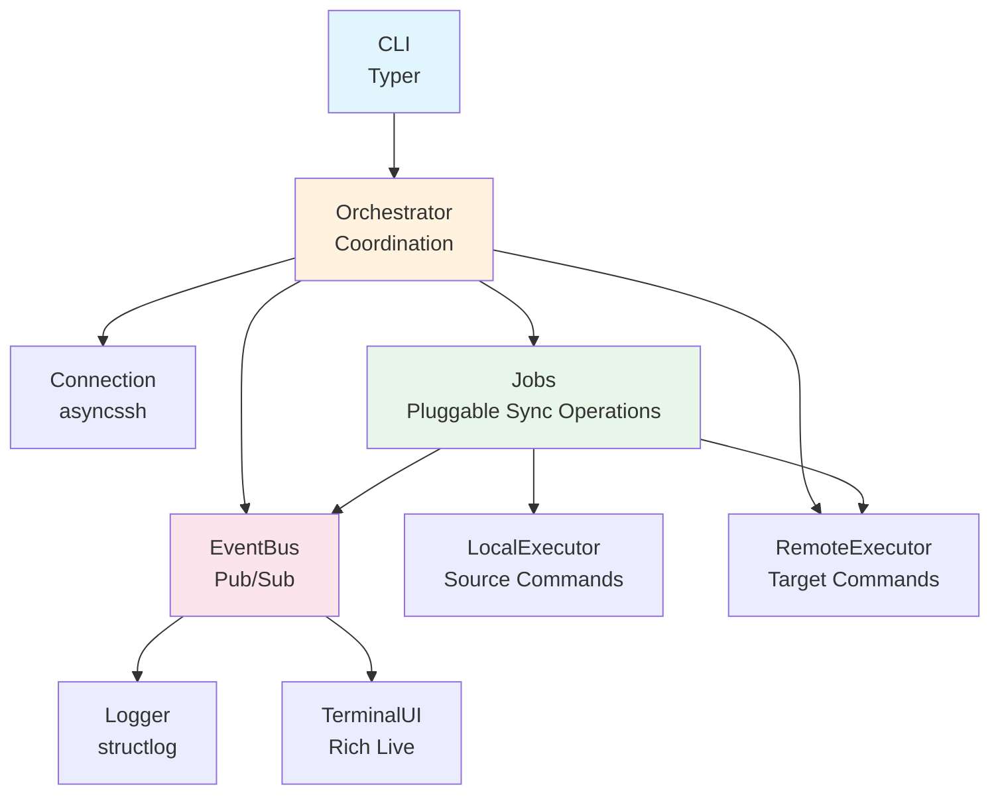
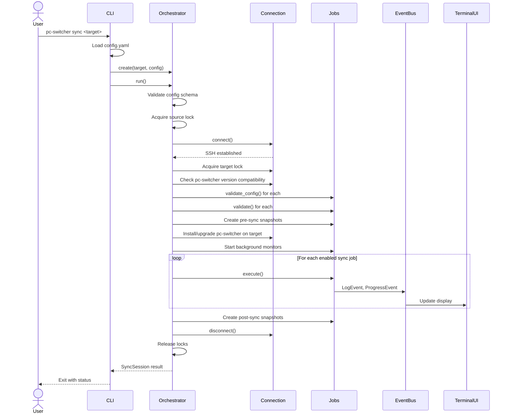
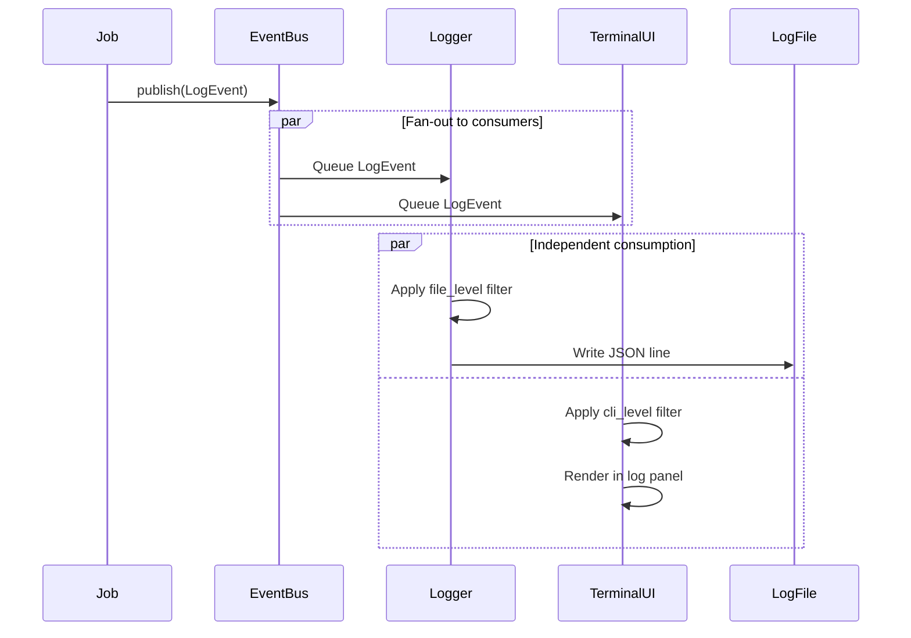

# PC-Switcher Architecture

This document provides a high-level overview of the pc-switcher architecture. For detailed technical specifications, see `specs/001-foundation/architecture.md`.

## Overview

PC-switcher is a synchronization system for seamless switching between Linux desktop machines. The architecture is built around a single-command sync orchestration model with pluggable jobs, event-driven logging, and robust safety mechanisms.

**Design Philosophy**: Sequential job execution with async I/O, fail-safe error handling, and clear separation between orchestration and sync operations.

## Component Diagram



## Core Components

### CLI
Entry point using Typer framework. Provides commands:
- `sync <target>`: Execute complete sync workflow
- `logs`: View log files and sync history
- `cleanup-snapshots`: Remove old snapshots based on retention policy

Loads configuration from `~/.config/pc-switcher/config.yaml` and creates the orchestrator.

### Orchestrator
Central coordinator managing the complete sync workflow:
1. **Pre-sync validation**: Schema, config, and system state checks
2. **Connection management**: SSH connection to target with keepalive
3. **Lock acquisition**: Prevents concurrent syncs (source and target locks)
4. **Job discovery and validation**: Load jobs, validate configs and system state (includes version compatibility check)
5. **Safety snapshots (pre-sync)**: Creates btrfs snapshots before modifications
6. **Install/Upgrade on Target**: Version validation and pc-switcher installation/upgrade if needed
7. **Job execution**: Sequential execution of enabled sync jobs
8. **Safety snapshots (post-sync)**: Creates btrfs snapshots after completion
9. **Background monitoring**: Disk space monitoring during sync
10. **Error handling**: SIGINT handling, graceful cleanup, abort on critical errors

### EventBus
Publish/subscribe event system with per-consumer queues:
- **Events**: LogEvent, ProgressEvent, ConnectionEvent
- **Producers**: Orchestrator, Jobs
- **Consumers**: Logger (file output), TerminalUI (live display)
- **Properties**: Non-blocking fan-out, graceful shutdown, independent consumption

Decouples event producers from consumers, ensuring UI operations never block job execution.

### Connection
SSH connection manager using asyncssh:
- Single persistent connection with session multiplexing
- Keepalive mechanism for health monitoring (15s interval, 3 missed max)
- Semaphore-based session limiting (default: 10 concurrent sessions)
- Automatic cleanup on disconnect

### Executors

**LocalExecutor**: Executes commands on source machine via async subprocess.

**RemoteExecutor**: Executes commands on target machine via SSH connection. Adds file transfer operations (`send_file`, `get_file`) and hostname detection.

Both implement common `Executor` interface:
- `run_command(cmd, timeout)`: Execute and wait for completion
- `start_process(cmd)`: Start process with streaming output
- `terminate_all_processes()`: Cleanup on cancellation

### Logger
Structured logging with dual outputs:
- **File**: JSON lines written to `~/.local/share/pc-switcher/logs/sync-<timestamp>.log`
- **Terminal**: Formatted output with Rich color-coding

Six log levels: DEBUG, FULL, INFO, WARNING, ERROR, CRITICAL

Resolves Host enum (SOURCE/TARGET) to actual hostnames internally.

### TerminalUI
Rich-based live terminal interface showing:
- Connection status and latency
- Overall sync progress (step N/M)
- Per-job progress bars
- Scrolling log panel (recent messages)

Updates at 10 Hz refresh rate for smooth visual feedback.

### Jobs
Pluggable sync operations implementing standard interface:

**Job Types**:
- **SystemJob**: Required infrastructure (snapshots, installation) - always runs
- **SyncJob**: Optional user-facing jobs - configurable via `sync_jobs` in config
- **BackgroundJob**: Concurrent monitoring tasks (disk space)

**Job Lifecycle**:
1. Orchestrator instantiates job with `Job(context)` - JobContext passed to constructor
2. `validate_config(config)`: Schema validation (static method)
3. `validate()`: System state validation (instance method, uses context from constructor)
4. `execute()`: Perform sync operation (instance method, uses context from constructor)

Jobs receive `JobContext` at instantiation time with executors, config, event bus, and session metadata.

## Data Flow

### Sync Operation Flow



### Event-Driven Logging Flow



## Configuration

Configuration loaded from `~/.config/pc-switcher/config.yaml`:

```yaml
log_file_level: FULL
log_cli_level: INFO

sync_jobs:
  dummy_success: true
  dummy_fail: false
  # Future: user_data, packages, docker, vms, k3s

disk_space_monitor:
  preflight_minimum: "20%"
  runtime_minimum: "15%"
  check_interval: 30

btrfs_snapshots:
  subvolumes: ["@", "@home"]
  keep_recent: 3
  max_age_days: null
```

**Validation Phases**:
1. **Schema**: YAML syntax, required fields, types (jsonschema)
2. **Job Config**: Job-specific value validation (Job.validate_config)
3. **System State**: Runtime checks before execution (Job.validate)

## Safety Mechanisms

### Btrfs Snapshots
Read-only snapshots created before and after sync operations:
- **Pre-sync**: Capture state before any modifications
- **Post-sync**: Capture successful state after completion
- **Location**: `/.snapshots/pc-switcher/<timestamp>-<session-id>/`
- **Naming**: `<phase>-<subvolume>-<timestamp>` (e.g., `pre-@home-20251129T143022`)

### Locking
Prevents concurrent sync operations:
- **Source lock**: `~/.local/share/pc-switcher/sync.lock` - prevents concurrent syncs from same source
- **Target lock**: `~/.local/share/pc-switcher/target.lock` - prevents A→B and C→B concurrent scenarios
- **Mechanism**: Target lock uses `flock` tied to SSH session (auto-release on disconnect)

### Disk Space Monitoring
Continuous monitoring during sync via `DiskSpaceMonitorJob`:
- **Preflight check**: Validate minimum free space before snapshots
- **Runtime monitoring**: Background task checks every 30s (configurable)
- **Critical abort**: Raises exception if space drops below runtime_minimum
- **Dual monitoring**: Separate instances for source and target

### Version Consistency
Ensures matching pc-switcher versions on source and target through integrated validation in InstallOnTargetJob:

**Version Compatibility Validation** (via InstallOnTargetJob.validate):
- Compare versions on source and target during job validation phase
- **Abort**: Return ValidationError if target version is newer than source (fail-fast)
- This validation occurs before any state modifications

**Installation/Upgrade** (via InstallOnTargetJob.execute):
- Auto-install/upgrade on target if missing or outdated
- Occurs AFTER pre-sync snapshots for rollback safety
- Installation modifies target system, so snapshots protect against failed upgrades
- **Verification**: Re-check version after installation to confirm success

This integration ensures that version incompatibilities are detected early (validation phase) before any modifications, and installation happens safely after snapshots are created for potential rollback.

### Interrupt Handling
Graceful shutdown on Ctrl+C (SIGINT):
- **First SIGINT**: Cancel all tasks, cleanup resources (jobs clean their own processes)
- **Second SIGINT**: Force terminate immediately (skip cleanup)
- **Timeout**: Cleanup deadline defined by `CLEANUP_TIMEOUT_SECONDS` in `src/pcswitcher/cli.py` (currently 30s), then force terminate
- **Process cleanup**: Jobs terminate their own remote processes; orchestrator does safety sweep

## Cross-References

### Detailed Documentation
- `specs/001-foundation/architecture.md`: Complete technical architecture with sequence diagrams
- `specs/001-foundation/data-model.md`: Entity definitions and relationships
- `specs/001-foundation/contracts/job-interface.md`: Job implementation contract
- `specs/001-foundation/plan.md`: Implementation plan and design decisions

### Architecture Decision Records
- `docs/adr/_index.md`: Summary of all architectural decisions
- `docs/adr/adr-002-ssh-communication-channel.md`: SSH as communication layer
- `docs/adr/adr-003-implementation-language.md`: Python 3.14 with asyncio
- `docs/adr/adr-004-dynamic-versioning-github-releases.md`: Version management strategy

### Requirements
- `docs/High level requirements.md`: Complete project vision, scope, and constraints

## Key Design Patterns

### Async/Await Throughout
All I/O operations use asyncio for efficient concurrency:
- SSH operations via asyncssh
- Local subprocess execution
- Event queue processing
- Background monitoring tasks

### Cancellation via CancelledError
Uses native asyncio cancellation:
- Jobs catch `CancelledError` in exception handlers
- Clean up own resources (terminate processes)
- Re-raise for propagation
- No manual flag polling

### Job Autonomy
Each job is self-contained:
- Owns configuration schema
- Validates system state
- Manages own resources
- Reports progress independently
- Handles cleanup on cancellation

### Event-Driven Architecture
Producers publish events without knowing consumers:
- Jobs don't call logger directly - publish events
- UI updates don't block job execution
- Easy to add new consumers (e.g., metrics, webhooks)
- Per-consumer queues prevent blocking

### Sequential Execution
Jobs run one at a time (no dependency graph):
- Simpler reasoning about state
- Easier error recovery
- Clear progress tracking
- Reduced complexity vs parallel execution

Background tasks (disk monitoring) run concurrently using asyncio TaskGroup.
