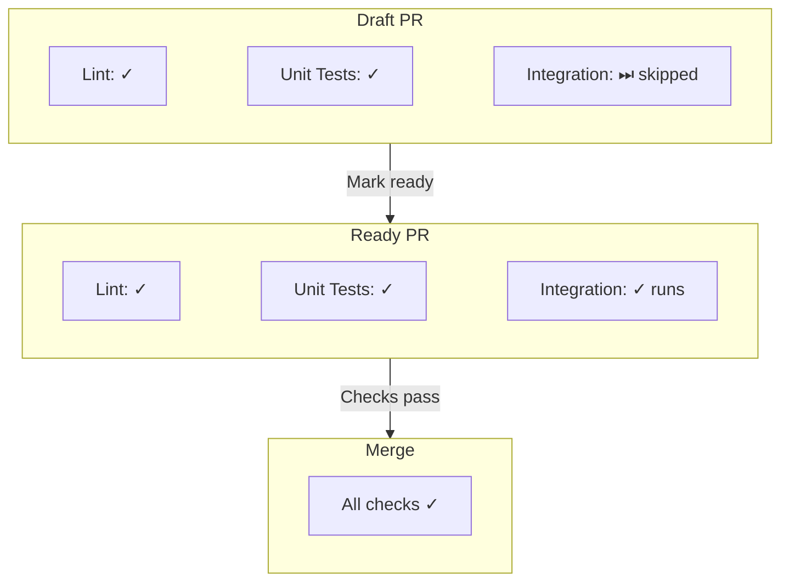

# CI/CD Configuration

This document describes the Continuous Integration setup for pc-switcher.

## Overview

The CI pipeline uses GitHub Actions with a tiered approach:
- **Fast checks** (Lint, Unit Tests) run on every push
- **Slow checks** (Integration Tests) run only on non-draft PRs to main

## Workflows

### CI Workflow (`ci.yml`)

**Trigger**: Every push to any branch

**Jobs**:

| Job | Checks | Duration |
| ----- | -------- | ---------- |
| Lint | basedpyright, ruff check, ruff format, codespell | ~30s |
| Unit Tests | pytest tests/unit tests/contract | ~30s |

### Integration Tests Workflow (`integration-tests.yml`)

**Trigger**: Pull requests to `main` (non-draft only)

**Conditions**:
- PR must not be a draft (`if: github.event.pull_request.draft == false`)
- Only runs when relevant files change:
  - `.github/workflows/integration-tests.yml`
  - `src/**`
  - `tests/integration/**`
  - `install.sh`
  - `pyproject.toml`
  - `uv.lock`

**Events**:
- `opened` - New PR created
- `synchronize` - New commits pushed
- `reopened` - PR reopened
- `ready_for_review` - Draft marked as ready

**Concurrency**: Only one integration test run at a time (`cancel-in-progress: false`)

**Duration**: 5-30 minutes depending on VM state

### Other Workflows

| Workflow | Trigger | Purpose |
| -------- | ------- | ------- |
| `claude.yml` | @claude mentions | AI assistant |
| `pr-requires-issue-closing.yml` | PR opened/edited/synchronized | Enforce that issues are closed via PR description/title |
| `vm-updates.yml` | Weekly (Monday 2 AM UTC) | Upgrade test VMs |

## Branch Protection Rules (main)

### Required Status Checks

All must pass before merge:
- `Lint`
- `Unit Tests`
- `Integration Tests`
- `Requires issue closing keyword`

### Settings

- **Require branches to be up to date**: Recommended (ensures tests run against latest main)
- **Merge queue**: Disabled (not needed with PR-triggered integration tests)

## Draft PR Workflow

The integration test strategy optimizes for developer experience:



**Benefits**:
- Iterate quickly on draft PRs without waiting for slow integration tests
- Integration tests run automatically when PR is ready for review
- No merge queue complexity

## Required Secrets

| Secret | Purpose |
| ------ | ------- |
| `HCLOUD_TOKEN` | Hetzner Cloud API for VM provisioning |
| `HETZNER_SSH_PRIVATE_KEY` | SSH access to test VMs |
| `SSH_AUTHORIZED_KEY_CI` | Public key for CI runner |
| `SSH_AUTHORIZED_KEY_*` | Developer SSH keys for VM access |
| `GITHUB_TOKEN` | Auto-provided, used for API rate limiting |

## Local Development

Run checks locally before pushing:

```bash
# Fast checks (same as CI)
uv run basedpyright
uv run ruff check && uv run ruff format --check
uv run codespell
uv run pytest tests/unit tests/contract -v

# Integration tests (requires VM access)
./tests/local-pytest.sh tests/integration
```

## Troubleshooting

### Integration Tests Not Running

1. **PR is draft** - Mark as ready for review
2. **No relevant file changes** - Only triggers on src/tests/config changes
3. **Targeting wrong branch** - Must target `main`

### Integration Tests Failing

1. Check test logs artifact for details
2. Verify VM state: `hcloud server list`
3. See [Testing Ops Guide](testing-ops-guide.md) for VM troubleshooting

### Merge Blocked

All three checks must pass:
- If Lint fails: Run `uv run ruff check --fix && uv run ruff format`
- If Unit Tests fail: Check test output, run locally to debug
- If Integration Tests fail: Check logs artifact, may need VM reset
