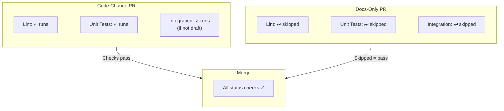

# CI/CD Configuration

This document describes the Continuous Integration setup for pc-switcher.

## Overview

The CI pipeline uses GitHub Actions with a tiered approach:
- **Fast checks** (Lint, Unit Tests) run on every push, but only when relevant files change
- **Slow checks** (Integration Tests) run only on non-draft PRs to main, when relevant files change

Both workflows use path filtering to skip checks when only unrelated files change (e.g., documentation-only changes skip all tests).

## Workflows

### CI Workflow (`ci.yml`)

**Trigger**: Every push to any branch

**Jobs**:

| Job | Purpose | Duration |
| ----- | -------- | ---------- |
| check-changes | Determines if lint/tests should run based on changed files | ~5s |
| Lint | basedpyright, ruff check, ruff format, codespell | ~30s |
| Unit Tests | pytest tests/unit tests/contract | ~30s |
| CI Status | Reports final status (pass/skip/fail) - this is the required check | ~5s |

**Conditions for running lint and unit tests**:

Relevant files must have changed:
- `.github/workflows/ci.yml`
- `src/**`
- `tests/unit/**`
- `tests/contract/**`
- `pyproject.toml`
- `uv.lock`
- `ruff.toml`

If no relevant files changed, the `CI Status` check reports success with "skipped" and the PR can still be merged.

### Integration Tests Workflow (`integration-tests.yml`)

**Trigger**: Pull requests to `main`

**Jobs**:
1. **check-changes**: Determines if integration tests should run based on changed files
2. **integration**: Runs actual tests (conditional on check-changes + non-draft PR)
3. **status**: Always runs and reports final status (this is the required check)

**Conditions for running tests**:
- PR must not be a draft (`if: github.event.pull_request.draft == false`)
- Relevant files must have changed:
  - `.github/workflows/integration-tests.yml`
  - `src/**`
  - `tests/integration/**`
  - `install.sh`
  - `pyproject.toml`
  - `uv.lock`

**Events**:
- `opened` - New PR created
- `synchronize` - New commits pushed
- `reopened` - PR reopened
- `ready_for_review` - Draft marked as ready

**Concurrency**: Only one integration test run at a time (`cancel-in-progress: false`)

**Duration**: 5-30 minutes depending on VM state (when tests run); <1 minute (when skipped)

### Other Workflows

| Workflow | Trigger | Purpose |
| -------- | ------- | ------- |
| `claude.yml` | @claude mentions | AI assistant |
| `pr-requires-issue-closing.yml` | PR opened/edited/synchronized | Enforce that issues are closed via PR description/title |
| `vm-updates.yml` | Daily (2 AM UTC) | Upgrade test VMs |

The VM Updates workflow runs daily to incorporate security updates into the baseline snapshots within a reasonable delay.

## Branch Protection Rules (main)

### Required Status Checks

All must pass before merge:
- `CI / CI Status` - Reports lint and unit test results (passes if tests pass OR are skipped due to no relevant changes)
- `Integration Tests / Integration Tests Status` - Reports integration test results (passes if tests pass OR are skipped)
- `PR metadata / Requires issue closing keyword (pull_request)`

### Settings

- **Require branches to be up to date**: Recommended (ensures tests run against latest main)
- **Merge queue**: Disabled (not needed with PR-triggered integration tests)

## Draft PR Workflow

The CI strategy optimizes for developer experience with conditional test execution:



**Benefits**:
- Documentation-only changes merge quickly without waiting for tests
- Code changes still get full test coverage
- Draft PRs skip integration tests (but run lint/unit tests if code changed)
- No merge queue complexity

## Required Secrets

| Secret | Purpose |
| ------ | ------- |
| `HCLOUD_TOKEN` | Hetzner Cloud API for VM provisioning |
| `HETZNER_SSH_PRIVATE_KEY` | SSH access to test VMs |
| `SSH_AUTHORIZED_KEY_CI` | Public key for CI runner |
| `SSH_AUTHORIZED_KEY_*` | Developer SSH keys for VM access |
| `GITHUB_TOKEN` | Auto-provided, used for API rate limiting |

## Local Development

Run checks locally before pushing:

```bash
# Fast checks (same as CI)
uv run basedpyright
uv run ruff check && uv run ruff format --check
uv run codespell
uv run pytest tests/unit tests/contract -v

# Integration tests (requires VM access)
./tests/local-pytest.sh tests/integration
```

## Troubleshooting

### Lint/Unit Tests Not Running

The `CI Status` check will always complete, but the actual lint and unit tests may be skipped:

1. **Tests skipped with ✓** - No relevant files changed (this is normal and expected)
2. Only files outside `src/`, `tests/unit/`, `tests/contract/`, `pyproject.toml`, `uv.lock`, `ruff.toml` were modified

To check if tests ran or were skipped, view the workflow run details.

### Integration Tests Not Running

The `Integration Tests Status` check will always complete, but the actual integration tests may be skipped:

1. **Tests skipped with ✓** - No relevant files changed (this is normal and expected)
2. **PR is draft** - Mark as ready for review to run tests
3. **Targeting wrong branch** - Must target `main`

To check if tests ran or were skipped, view the workflow run details.

### Integration Tests Failing

1. Check test logs artifact for details
2. Verify VM state: `hcloud server list`
3. See [Testing Ops Guide](testing-ops-guide.md) for VM troubleshooting

### Merge Blocked

All required checks must pass:
- If CI Status fails due to Lint: Run `uv run ruff check --fix && uv run ruff format`
- If CI Status fails due to Unit Tests: Check test output, run locally to debug
- If Integration Tests Status fails: Check logs artifact, may need VM reset
- If Issue closing keyword fails: Add "Fixes #123" or similar to PR description
