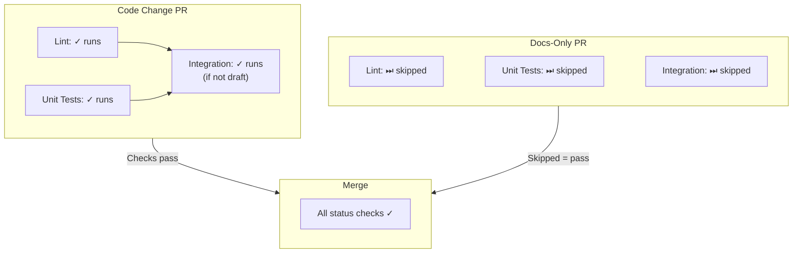

# CI/CD Configuration

This document describes the Continuous Integration setup for pc-switcher.

## Overview

The CI pipeline uses GitHub Actions with a tiered approach:
- **Fast checks** (Lint, Unit Tests) run on every push, but only when relevant files change
- **Slow checks** (Integration Tests) run only on non-draft PRs to main, when relevant files change, and only for the areas the PR touches

Both workflows use path filtering to skip checks when only unrelated files change (e.g., documentation-only changes skip all tests).

## Workflows

### CI Workflow (`ci.yml`)

**Trigger**: Every push to any branch

**Jobs**:

| Job | Purpose | Duration |
| ----- | -------- | ---------- |
| check-changes | Determines if lint/tests should run based on changed files | ~5s |
| Lint | `basedpyright`, `ruff check`, `ruff format --check`, `codespell` | ~30s |
| Unit Tests | `uv run pytest tests/unit tests/contract -v` | ~30s |
| CI Status | Reports final status (pass/skip/fail) - this is the required check | ~5s |

`tests/local_rsync/` and `tests/unit_jobs/` are outside both the path filter and the pytest selection, so CI never runs them.

**Conditions for running lint and unit tests**:

Relevant files must have changed:
- `.github/workflows/ci.yml`
- `src/**`
- `tests/unit/**`
- `tests/contract/**`
- `pyproject.toml`
- `uv.lock`
- `ruff.toml`

If no relevant files changed, the `CI Status` check reports success with "skipped" and the PR can still be merged.

### Integration Tests Workflow (`integration-tests.yml`)

**Triggers**:
- `pull_request` targeting `main`, on `opened`, `synchronize`, `reopened`, `ready_for_review` and `labeled`
- `workflow_dispatch`
- `schedule`, nightly at 02:30 UTC

PRs targeting any branch other than `main` never trigger this workflow — a stacked PR based on another branch gets no integration coverage.

**Jobs**:
1. **check-changes**: Decides whether the run is needed. On a PR, from the path filter; on a schedule, skipped when `main` is unchanged since the previous nightly; otherwise always true.
2. **wait-for-ci**: Blocks on CI's `CI Status` check (lint + unit tests) for the PR head commit, so integration never starts on a red build. Uses `lewagon/wait-on-check-action`; there is no native cross-workflow `needs:` because lint/unit run in `ci.yml` on `push`.
3. **integration**: Provisions if needed, then runs the tests. Needs `wait-for-ci`.
4. **status**: Always runs and reports final status (this is the required check)

**Conditions for running tests**:
- PR must not be a draft (`github.event.pull_request.draft == false`)
- If the event is `labeled`, the label must be `ci: full` — any other label is ignored, so labelling a PR never burns a CI cycle or the VM lock
- Relevant files must have changed:
  - `.github/workflows/integration-tests.yml`
  - `src/**`
  - `tests/run-integration-tests.sh`
  - `tests/integration/**` except `upgrade-vms.sh`
  - `install.sh`
  - `pyproject.toml`
  - `uv.lock`

**Test selection**: PR runs are topic-scoped — `select-ci-tests.sh` maps the PR's changed files to a pytest `-m` expression over the `smoke`/`area_*` markers, erring toward the full suite when a file matches no area. The full suite runs on the `ci: full` label, the nightly schedule, and `workflow_dispatch`. CI additionally deselects `ci_skip`. See [Testing Guide](../dev/testing-guide.md#ci-test-selection-topic-based).

**Concurrency**: Only one integration test run at a time (`cancel-in-progress: false`, on the `integration` job)

**Timeouts**: 50 minutes for provisioning, 60 for the test run.

### Other Workflows

| Workflow | Trigger | Purpose |
| -------- | ------- | ------- |
| `claude.yml` | @claude mentions in issues, comments and reviews | AI assistant |
| `pr-requires-issue-closing.yml` | PR opened/edited/synchronize/reopened/ready_for_review | Enforce that issues are closed via PR description/title |
| `vm-updates.yml` | Daily at 02:00 UTC, plus `workflow_dispatch` | Upgrade test VMs and retake the baseline snapshots |

The VM Updates workflow runs daily to incorporate security updates into the baseline snapshots within a reasonable delay.

## Branch Protection Rules (main)

### Required Status Checks

Both must pass before merge:
- `CI Status` — lint and unit test results (passes if tests pass OR are skipped due to no relevant changes)
- `Integration Tests Status` — integration test results (passes if tests pass OR are skipped, including on a draft PR)

The issue-closing check is not a required check; it reports but does not block.

### Settings

- **Require branches to be up to date**: enabled
- **Merge queue**: Disabled (not needed with PR-triggered integration tests)
- **Enforce for administrators**: disabled

## Draft PR Workflow

The CI strategy optimizes for developer experience with conditional test execution:



**Benefits**:
- Documentation-only changes merge quickly without waiting for tests
- Code changes still get full test coverage
- Draft PRs skip integration tests (but run lint/unit tests if code changed)
- No merge queue complexity

## Required Secrets

See [Testing Ops](testing-ops.md#required-secrets) for the full list, formats, and how to generate them.

## Local Development

Run checks locally before pushing:

```bash
# Fast checks (same as CI)
uv run basedpyright
uv run ruff check && uv run ruff format --check
uv run codespell
uv run pytest tests/unit tests/contract --verbose

# Integration tests (requires VM access)
./tests/run-integration-tests.sh

# Print the marker expression CI would use for this branch
tests/integration/scripts/select-ci-tests.sh origin/main
```

## Troubleshooting

### Lint/Unit Tests Not Running

The `CI Status` check will always complete, but the actual lint and unit tests may be skipped:

1. **Tests skipped with ✓** - No relevant files changed (this is normal and expected)
2. Only files outside `src/`, `tests/unit/`, `tests/contract/`, `pyproject.toml`, `uv.lock`, `ruff.toml` were modified

To check if tests ran or were skipped, view the workflow run details.

### Integration Tests Not Running

The `Integration Tests Status` check will always complete, but the actual integration tests may be skipped:

1. **Tests skipped with ✓** - No relevant files changed (this is normal and expected)
2. **PR is draft** - Mark as ready for review to run tests
3. **Targeting wrong branch** - Must target `main`; a PR stacked on another branch is never covered
4. **Only some areas ran** - Expected: PR runs are topic-scoped. Add the `ci: full` label for the whole suite.

To check if tests ran or were skipped, view the workflow run details.

### Integration Tests Failing

1. Check test logs artifact for details
2. Verify VM state: `hcloud server list`
3. See [Testing Ops Guide](testing-ops.md) for VM troubleshooting

### Merge Blocked

Both required checks must pass, and the branch must be up to date with `main`:
- If CI Status fails due to Lint: Run `uv run ruff check --fix && uv run ruff format`
- If CI Status fails due to Unit Tests: Check test output, run locally to debug
- If Integration Tests Status fails: Check logs artifact, may need VM reset
