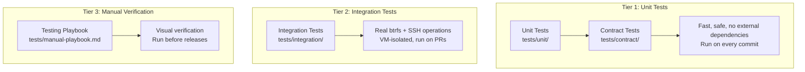
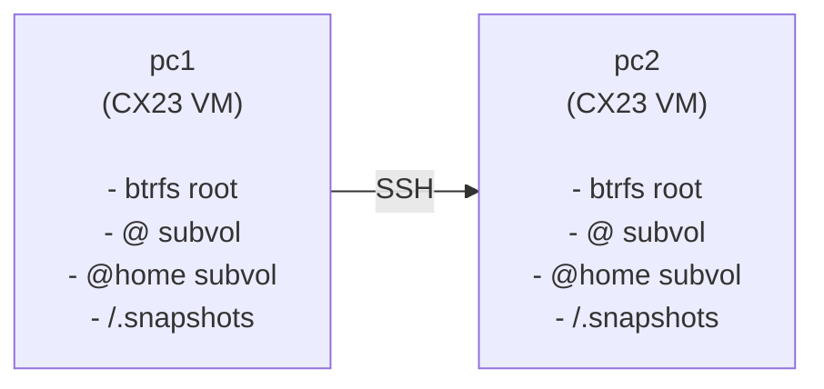
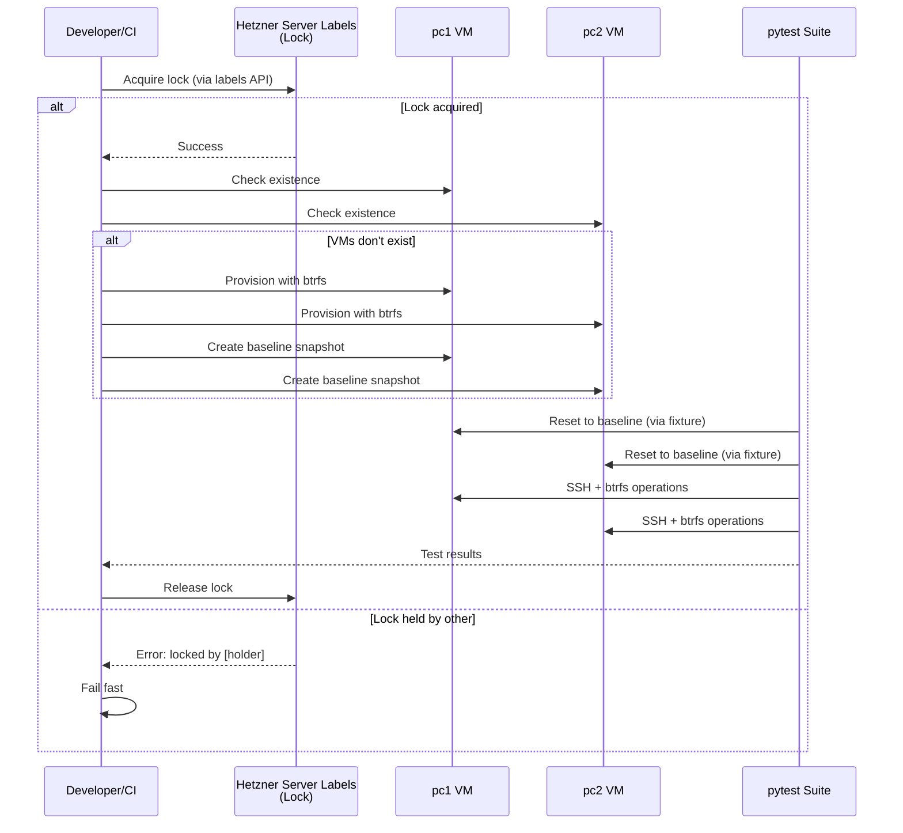
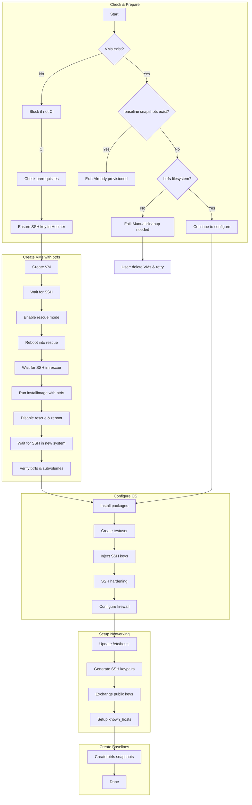

# Testing Architecture

This document describes the architecture and design of the pc-switcher testing infrastructure.

**Audience**: Developers, architects, anyone needing to understand how the test system works

**Related Documentation**:
- [Testing Developer Guide](../dev/testing-guide.md) - How to write tests
- [Testing Ops Guide](testing-ops.md) - Operational procedures
- [ADR-006: Testing Framework](../adr/adr-006-testing-framework.md) - Architectural decisions

## Three-Tier Test Structure

The testing framework uses a three-tier architecture designed to balance safety, speed, and thoroughness:



### Tier 1: Unit and Contract Tests

**Purpose**: Test pure logic, business rules, mocked I/O, and job interface compliance.

**Characteristics**:
- No external dependencies (SSH, real filesystem, network)
- Fast execution (< 30 seconds for full suite)
- Safe to run on any machine
- Use mocked executors for predictable responses

**Location**: `tests/unit/`, `tests/contract/`

**When run**: Every commit, if relevant files changed.

### Tier 2: Integration Tests

**Purpose**: Test real SSH connections, btrfs operations, and full workflows.

**Characteristics**:
- Require two Hetzner Cloud VMs (pc1 + pc2)
- Real btrfs filesystem with `@` and `@home` subvolumes
- Real SSH connections between VMs
- Slower execution (5-15 minutes)

**Location**: `tests/integration/`

**When run**: On-demand, PRs to main branch (when marked ready for review).

### Tier 3: Manual Playbook

**Purpose**: Verify visual elements that cannot be automated.

**Characteristics**:
- Progress bar rendering
- Terminal color output
- Rich formatting display
- Accessibility testing

**Location**: `tests/manual-playbook.md`

**When run**: Before releases.

## VM Infrastructure Design

### Architecture Overview



### VM Specifications

| Property | Value |
|----------|-------|
| Provider | Hetzner Cloud |
| Server Type | CX23 (2 vCPU, 4GB RAM) |
| OS | Ubuntu 24.04 LTS |
| Filesystem | btrfs (root) |
| Location | fsn1 (Falkenstein) |
| Cost | ~EUR 3.50/month per VM |

### Design Rationale

#### Why VM Isolation?

PC-switcher performs destructive operations that cannot be safely executed on developer machines:

- **Root btrfs operations**: Creating, deleting, and rolling back snapshots of system subvolumes
- **Filesystem modifications**: Writing to `/`, `/home`, and other system paths
- **SSH key manipulation**: Generating and exchanging keys between machines
- **System state changes**: Modifying `/etc`, user accounts, and systemd services

Running these operations locally would risk data loss or system corruption if bugs exist in either the implementation or the test code itself. Dedicated VMs provide complete isolation where failures affect only disposable test infrastructure.

#### Why Hetzner Server Labels for Locking?

The lock mechanism must survive VM reboots and resets to remain effective. Hetzner Server Labels provide:

- **Persistence**: Labels survive VM reboots, snapshots, and even VM recreation
- **Atomic operations**: Hetzner API ensures consistent read-modify-write semantics
- **No local state**: Lock state lives in cloud infrastructure, not on VMs
- **Simplicity**: No need for dedicated lock server or database

Alternative approaches (file-based locks on VM, external Redis/etcd) would either be lost during VM reset or require additional infrastructure.

#### Why Btrfs Snapshot Reset?

Resetting VMs to a clean baseline state before each test run ensures test isolation and reproducibility. Btrfs snapshot rollback provides:

- **Speed**: Reset completes in < 30 seconds (snapshot + reboot)
- **Completeness**: Entire filesystem tree returns to exact baseline state
- **Efficiency**: Copy-on-write means snapshots consume minimal space
- **Reliability**: Atomic operation - either fully succeeds or fully fails

Alternative approaches and their drawbacks:

- **Hetzner VM snapshots**: Slow (5-10 minutes), expensive (charged per snapshot)
- **VM recreation**: Very slow (10-15 minutes), complex orchestration
- **Manual cleanup scripts**: Fragile, incomplete, high maintenance burden

### Btrfs Layout

Each VM has the following btrfs subvolume layout (flat layout):

```text
/             -> @ subvolume
/home         -> @home subvolume
/.snapshots   -> @snapshots subvolume (mounted, for pc-switcher)
```

## Baseline Snapshots and Reset Mechanism

### Baseline State

The baseline snapshots capture the following VM state (as configured during provisioning):

| Component | State | Notes |
|-----------|-------|-------|
| **OS** | Ubuntu 24.04 LTS | Installed via Hetzner `installimage` |
| **Packages** | btrfs-progs, qemu-guest-agent, fail2ban, ufw, sudo | Basic system tools only |
| **Filesystem** | btrfs with flat subvolume layout (`@`, `@home`, `@snapshots`) | Root mounted as `@`, home as `@home` |
| **Users** | `testuser` with passwordless sudo | All developer SSH keys injected |
| **SSH** | Hardened (root login disabled, password auth disabled) | Only key-based auth allowed |
| **Firewall** | ufw enabled, SSH port 22 allowed | fail2ban monitors SSH |
| **pc-switcher** | **NOT installed** | Tests must install if needed |
| **Python tools** | `uv` installed in testuser's ~/.local/bin | For installing pc-switcher |

**Important**: The baseline does NOT include pc-switcher. Tests that need pc-switcher must install it explicitly or use fixtures that handle installation.

### Reset Process

Before each test run, VMs are reset to a clean baseline state using btrfs snapshot rollback (not Hetzner VM snapshots, which are slow):

1. Create read-only baseline snapshots of `@` and `@home` during initial provisioning
2. Before each test session (automatically via `integration_session` fixture which calls `reset-vm.sh`):
   a. Delete any test artifacts in `/.snapshots/pc-switcher/test-*`
   b. Mount the top-level filesystem as /mnt/btrfs
   c. mv /mnt/btrfs/@ /mnt/btrfs/@_old
   d. btrfs subvolume snapshot /mnt/btrfs/.snapshots/baseline/@ /mnt/btrfs/@
   e. mv /mnt/btrfs/@home /mnt/btrfs/@home_old
   f. btrfs subvolume snapshot /mnt/btrfs/.snapshots/baseline/@home /mnt/btrfs/@home
   g. Reboot VM (~10-20 seconds)
   h. Remove old subvolumes `/mnt/btrfs/@_old` and `/mnt/btrfs/@home_old`
3. Clean state ready for tests

This ensures test isolation without recreating VMs. The btrfs rollback is much faster than Hetzner's VM snapshot restore.

## Test Isolation and Lock Mechanism

### Test Isolation Design

**Reset frequency**: VMs are reset to baseline **once per pytest session** (not between test modules).

**Implications**:
1. Tests in the same session share VM state between modules
2. Each test MUST clean up all artifacts it creates (files, directories, snapshots, installed packages)
3. Fixtures that modify VM state MUST restore the initial state after the test

### Module-Scoped Fixtures

Integration test fixtures use module scope for performance:

| Fixture | Purpose |
|---------|---------|
| `pc1_connection` | SSH connection to pc1 |
| `pc2_connection` | SSH connection to pc2 |
| `pc1_executor` | Command executor for pc1 |
| `pc2_executor` | Command executor for pc2 |

**Behavior**:
- Each test MODULE gets its own instances of these fixtures
- Tests within a module share the same SSH connection (~1-2s saved per test)
- Different test files (modules) are completely isolated
- Fixtures are torn down when pytest moves to the next module

### Lock-Based Concurrency Control

To prevent conflicts between dev and CI test runs:

```bash
# Lock is acquired at start of test session
tests/integration/scripts/internal/lock.sh acquire $HOLDER

# Lock is released at end
tests/integration/scripts/internal/lock.sh release $HOLDER
```

The lock is stored as **Hetzner Server Labels** on the `pc1` server (not as a file on the VM). This approach survives VM reboots and snapshot rollbacks:

- **Lock labels**: `lock_holder` (identifier) and `lock_acquired` (ISO8601 timestamp)
- **Lock holder format**: `ci-<run_id>` for CI jobs, `local-<username>` for local runs
- **Maximum wait time**: 5 minutes with 10-second retry intervals
- **Atomic acquisition**: Uses Hetzner API with 1-second verification to detect race conditions
- If lock cannot be acquired, tests fail with clear error showing current holder

### Component Interaction Sequence



## CI/CD Integration

### GitHub Actions Workflow Structure

The repository uses three GitHub Actions workflows:

| Workflow | File | Triggers | Purpose |
|----------|------|----------|---------|
| CI | `ci.yml` | Every push | Lint (basedpyright, ruff, codespell) and unit tests |
| Integration Tests | `integration-tests.yml` | PR ready for review | Full integration tests on Hetzner VMs |
| VM Updates | `vm-updates.yml` | Daily (2am UTC) | Keep test VMs updated with OS patches |

### Path Filtering

Both CI and integration tests use path filtering (`dorny/paths-filter`) to skip checks when only unrelated files change:

**Integration tests run when**:
- `.github/workflows/integration-tests.yml`
- `src/**`
- `tests/integration/**`
- `install.sh`
- `pyproject.toml`
- `uv.lock`

Documentation-only changes skip integration tests, allowing quick merges.

### Integration Test Trigger Strategy

Integration tests are expensive (they use cloud VMs), so they don't run on every commit:

| PR State | Integration Tests |
|----------|-------------------|
| Draft PR | **Skipped** |
| Marked "Ready for review" | **Runs** |
| New commits to ready PR | **Runs** |
| Manual trigger | **Runs** (via `workflow_dispatch`) |

### Concurrency Control

Integration tests use GitHub Actions `concurrency.group` to prevent parallel runs:

```yaml
concurrency:
  group: pc-switcher-integration
  cancel-in-progress: false
```

### Required Secrets

| Secret | Description |
|--------|-------------|
| `HCLOUD_TOKEN` | Hetzner Cloud API token |
| `HETZNER_SSH_PRIVATE_KEY` | SSH private key for CI VM access |
| `SSH_AUTHORIZED_KEY_CI` | CI public key for VM access |
| `SSH_AUTHORIZED_KEY_*` | Developer public keys (one per developer/machine) |

## Environment Variables and Configuration

### Test Configuration

| Variable | Description | Default |
|----------|-------------|---------|
| `PC_SWITCHER_TEST_PC1_HOST` | PC1 VM hostname/IP | `pc1` |
| `PC_SWITCHER_TEST_PC2_HOST` | PC2 VM hostname/IP | `pc2` |
| `PC_SWITCHER_TEST_USER` | SSH user on VMs | `testuser` |
| `CI_JOB_ID` | CI job ID for lock identification | `$USER` |

### pytest Configuration

From `pyproject.toml`:

```toml
[tool.pytest.ini_options]
asyncio_mode = "auto"
asyncio_default_fixture_loop_scope = "module"
asyncio_default_test_loop_scope = "module"
markers = [
    "integration: Integration tests (require VM infrastructure)",
    "slow: Tests that take >5 seconds",
    "benchmark: Performance benchmarks (not run by default)",
]
```

**Event loop configuration**: Both fixtures and tests must share the same event loop scope. If fixtures use `loop_scope="module"` but tests default to `loop_scope="function"`, async objects (like SSH connections) created on the module loop cannot be used from the function loop.

## Provisioning Flow



### Provisioning Scripts

| Script | Description |
|--------|-------------|
| **provision-test-infra.sh** | Main orchestrator that coordinates all provisioning steps |
| **create-vm.sh** | Creates VM with btrfs via Hetzner rescue mode and installimage |
| **configure-vm.sh** | Configures OS with testuser account, packages, SSH hardening, firewall |
| **configure-hosts.sh** | Sets up inter-VM networking, generates SSH keypairs, establishes SSH trust |
| **create-baseline-snapshots.sh** | Creates btrfs snapshots at clean baseline state |
| **reset-vm.sh** | Restores VM to baseline state via btrfs snapshot rollback |

### SSH Host Key Management

The infrastructure scripts use proper SSH host key verification. For each host, in each phase:

1. **Phase transition** (key changes): Remove old key + `accept-new`
2. **First connection** (key might not exist): `accept-new` only
3. **Subsequent connections**: Normal SSH (verify stored key)

| Script | SSH Pattern | Notes |
|--------|-------------|-------|
| `create-vm.sh` | `wait_for_ssh` (phase) | 3 phase transitions |
| `provision-test-infra.sh` | `ssh_first` (phase) | Parallel checks for both VMs |
| `configure-vm.sh` | `ssh_run` only | Key established by create-vm.sh |
| `configure-hosts.sh` | `ssh_run` only | Key established |
| `reset-vm.sh` | `ssh_accept_new` | First from test runner |

## Session-Scoped Fixtures

| Fixture | Purpose |
|---------|---------|
| `integration_lock` | Prevents concurrent test runs via Hetzner labels |
| `integration_session` | VM provisioning and parallel reset to baseline |

The `integration_session` fixture resets both VMs in parallel using `ThreadPoolExecutor` for faster setup (~20s instead of ~37s sequential).

## Isolation Guarantees Summary

| Isolation Level | Shared | Isolated |
|-----------------|--------|----------|
| Within same test file | SSH connection, executor, event loop | Test function state |
| Between test files | Nothing | Everything (new event loop, new connections) |
| Between test runs | Nothing | Everything (VMs reset to baseline) |
