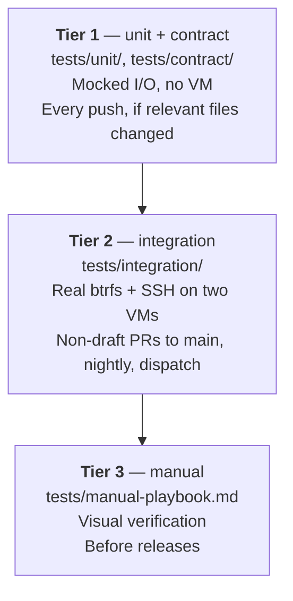
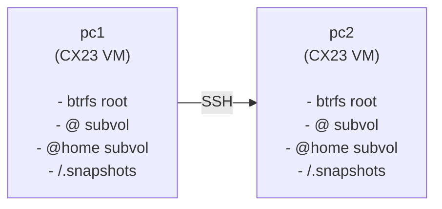
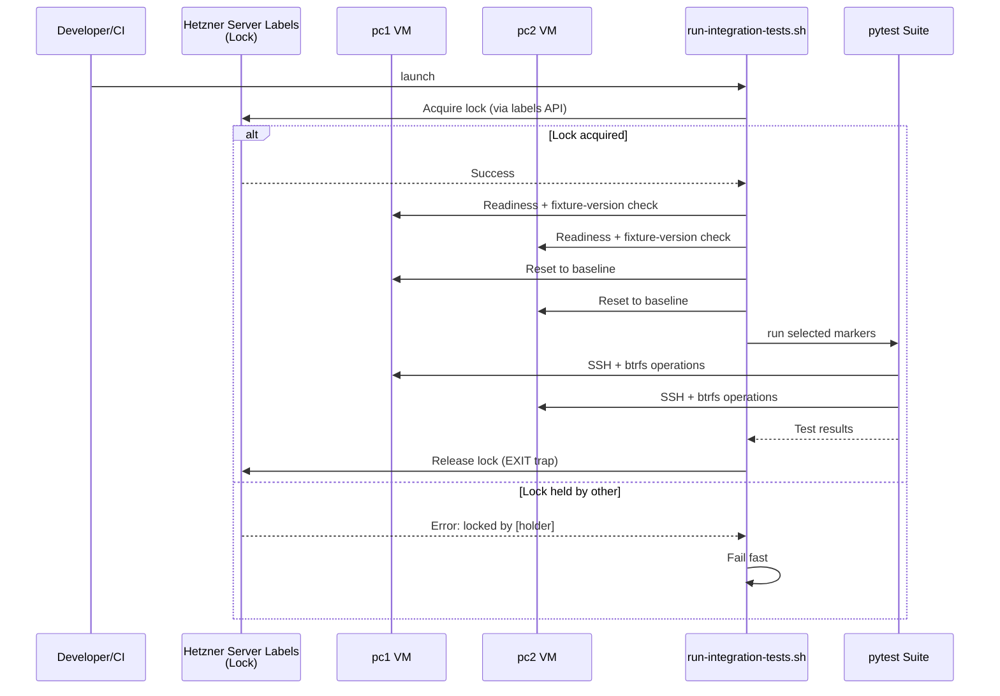
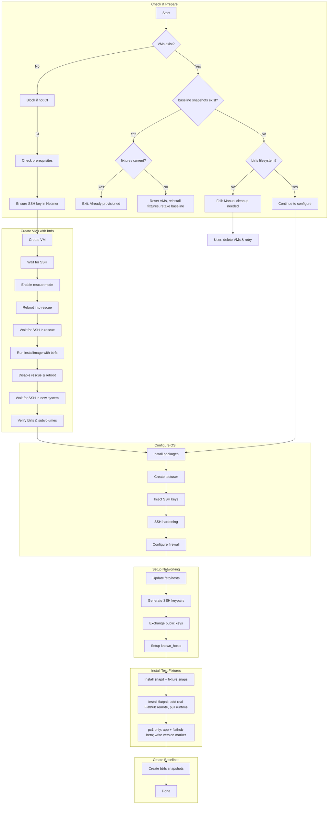

# Testing Architecture

This document describes the architecture and design of the pc-switcher testing infrastructure.

**Audience**: Developers, architects, anyone needing to understand how the test system works

**Related Documentation**:
- [Testing Developer Guide](../dev/testing-guide.md) - How to write tests
- [Testing Ops Guide](testing-ops.md) - Operational procedures, secrets, environment variables
- [CI/CD Configuration](ci-setup.md) - Workflows, triggers, required checks
- [ADR-006: Testing Framework](../adr/adr-006-testing-framework.md) - Architectural decisions

## Three-Tier Test Structure

The testing framework uses a three-tier architecture designed to balance safety, speed, and thoroughness:


```mermaid
flowchart TB
    UT["<b>Tier 1</b> — unit + contract<br/>tests/unit/, tests/contract/<br/>Mocked I/O, no VM<br/>Every push, if relevant files changed"]
    IT["<b>Tier 2</b> — integration<br/>tests/integration/<br/>Real btrfs + SSH on two VMs<br/>Non-draft PRs to main, nightly, dispatch"]
    MV["<b>Tier 3</b> — manual<br/>tests/manual-playbook.md<br/>Visual verification<br/>Before releases"]

    UT --> IT --> MV
```

### Tier 1: Unit and Contract Tests

**Purpose**: Test pure logic, business rules, mocked I/O, and interface compliance (jobs, executors, logging).

**Characteristics**:
- No external dependencies (SSH, real filesystem, network)
- Fast: the whole selection runs in about ten seconds
- Safe to run on any machine
- Use mocked executors for predictable responses

**Location**: `tests/unit/`, `tests/contract/`

**When run**: Every push, if relevant files changed (see [CI/CD Configuration](ci-setup.md)).

`tests/local_rsync/` is a fourth, small selection: it shells out to a real local `rsync` binary against `tmp_path` trees (no VM, no SSH), carries the `local_rsync` marker and skips when `rsync` is absent. It is not part of the `tests/unit tests/contract` selection CI runs — run it explicitly with `uv run pytest tests/local_rsync`.

### Tier 2: Integration Tests

**Purpose**: Test real SSH connections, btrfs operations, and full workflows.

**Characteristics**:
- Require two Hetzner Cloud VMs (pc1 + pc2)
- Real btrfs filesystem with `@` and `@home` subvolumes
- Real SSH connections between VMs
- Slow: about 30 minutes for the full suite; topic-scoped PR runs are shorter

**Location**: `tests/integration/`, launched by `tests/run-integration-tests.sh`

**When run**: Non-draft PRs to `main` (topic-scoped), nightly on `main`, `workflow_dispatch`, and the `ci: full` PR label.

### Tier 3: Manual Playbook

**Purpose**: Verify what cannot be automated — progress bar rendering, terminal colours, Rich formatting.

**Location**: `tests/manual-playbook.md` and `tests/self-update-test-playbook.md`. `tests/manual/review_harness.py` (`uv run python tests/manual/review_harness.py`) drives the real batched package review without contacting a machine.

**When run**: Before releases.

## VM Infrastructure Design

### Architecture Overview


```mermaid
graph LR
    A["pc1<br/>(CX23 VM)<br/><br/>- btrfs root<br/>- @ subvol<br/>- @home subvol<br/>- /.snapshots"]
    B["pc2<br/>(CX23 VM)<br/><br/>- btrfs root<br/>- @ subvol<br/>- @home subvol<br/>- /.snapshots"]

    A -->|SSH| B
```

### VM Specifications

| Property | Value |
| -------- | ----- |
| Provider | Hetzner Cloud |
| Server Type | CX23 (2 vCPU, 4GB RAM) |
| OS | Ubuntu 24.04 LTS |
| Filesystem | btrfs (root) |
| Location | fsn1 (Falkenstein) |
| Cost | ~EUR 3.50/month per VM |

### Design Rationale

#### Why VM Isolation?

PC-switcher performs destructive operations that cannot be safely executed on developer machines:

- **Root btrfs operations**: Creating, deleting, and rolling back snapshots of system subvolumes
- **Filesystem modifications**: Writing to `/`, `/home`, and other system paths
- **SSH key manipulation**: Generating and exchanging keys between machines
- **System state changes**: Modifying `/etc`, user accounts, and systemd services

Running these operations locally would risk data loss or system corruption if bugs exist in either the implementation or the test code itself. Dedicated VMs provide complete isolation where failures affect only disposable test infrastructure.

#### Why Hetzner Server Labels for Locking?

The lock mechanism must survive VM reboots and resets to remain effective. Hetzner Server Labels provide:

- **Persistence**: Labels survive VM reboots, snapshots, and even VM recreation
- **Atomic operations**: Hetzner API ensures consistent read-modify-write semantics
- **No local state**: Lock state lives in cloud infrastructure, not on VMs
- **Simplicity**: No need for dedicated lock server or database

Alternative approaches (file-based locks on VM, external Redis/etcd) would either be lost during VM reset or require additional infrastructure.

#### Why Btrfs Snapshot Reset?

Resetting VMs to a clean baseline state before each test run ensures test isolation and reproducibility. Btrfs snapshot rollback provides:

- **Speed**: Reset completes in 25-60 seconds (snapshot + reboot)
- **Completeness**: Entire filesystem tree returns to exact baseline state
- **Efficiency**: Copy-on-write means snapshots consume minimal space
- **Reliability**: Atomic operation - either fully succeeds or fully fails

Alternative approaches and their drawbacks:

- **Hetzner VM snapshots**: Slow (5-10 minutes), expensive (charged per snapshot)
- **VM recreation**: Very slow (10-15 minutes), complex orchestration
- **Manual cleanup scripts**: Fragile, incomplete, high maintenance burden

### Btrfs Layout

Each VM has the following btrfs subvolume layout (flat layout):

```text
/             -> @ subvolume
/home         -> @home subvolume
/.snapshots   -> @snapshots subvolume (mounted, for pc-switcher)
```

## Baseline Snapshots and Reset Mechanism

### Baseline State

The baseline snapshots capture the following VM state (as configured during provisioning):

| Component | State | Notes |
| --------- | ----- | ----- |
| **OS** | Ubuntu 24.04 LTS | Installed via Hetzner `installimage` |
| **Packages** | btrfs-progs, qemu-guest-agent, fail2ban, ufw, sudo (`configure-vm.sh`); snapd and flatpak (`vm-test-fixtures.sh`) | Basic system tools plus what the package-sync tests need |
| **Test fixtures** | `hello` and `hello-world` snaps; the real Flathub remote plus `org.freedesktop.Platform/x86_64/25.08` in user scope on **both** VMs; `io.github.fragglet.sdl_sopwith` and the `flathub-beta` remote in user scope on **pc1 only** | Created by `vm-test-fixtures.sh`; the subjects the package-sync integration tests hold, diverge, remove and reinstall |
| **Automatic updates** | None: `unattended-upgrades` purged, `apt-daily`/`apt-daily-upgrade` timers and services masked (`vm-test-fixtures.sh`) | The suite must not compete with the machine for the dpkg lock; `upgrade-vms.sh` patches the VMs explicitly instead |
| **Filesystem** | btrfs with flat subvolume layout (`@`, `@home`, `@snapshots`) | Root mounted as `@`, home as `@home` |
| **Users** | `testuser` with passwordless sudo | All developer SSH keys injected |
| **SSH** | Hardened (root login disabled, password auth disabled) | Only key-based auth allowed |
| **Firewall** | ufw enabled, SSH port 22 allowed | fail2ban monitors SSH |
| **pc-switcher** | **NOT installed** | Tests must install if needed |
| **Python tools** | none | `install.sh` installs `uv` itself when it is absent |

**Important**: The baseline does NOT include pc-switcher. Tests that need pc-switcher must install it explicitly or use fixtures that handle installation.

### Test Fixtures in the Baseline

The package-sync integration tests need packages they may hold, diverge, remove and reinstall. A stock Ubuntu 24.04 VM offers none: `snap list` shows only `snapd`, `core*` and `bare` — every other snap depends on those, so none is a safe subject — and flatpak is not installed at all. `internal/vm-test-fixtures.sh` creates the subjects, and provisioning runs it before the baseline snapshot so every test run inherits them at no cost.

The same script also removes what would otherwise compete with the tests for the package managers. Ubuntu patches itself in the background, and `apt_sync`'s validation probes the target's dpkg frontend lock once and ends the whole run when it is held — so an updater firing in the minutes after `reset-vm.sh` reboots into the baseline fails whichever test `pytest-randomly`'s seed happened to schedule there, on package state that never had a chance to change. `unattended-upgrades` is therefore purged and the `apt-daily` timers masked. The VMs are still patched: `upgrade-vms.sh` upgrades them explicitly and rebuilds the baseline, daily, from the `VM Updates` workflow.

That masking also means the sync-window timer suspension (`PKG-FR-APT-TIMER-PAUSE`) is a **no-op on the VMs**, and deliberately so rather than by an exemption in the code: the orchestrator stops only timers it reads back as loaded and active, and a masked unit is neither — it could not be started again if it were stopped. The fixture is left as it is, because a VM that unmasked the timers would reintroduce the very race the masking exists to remove, and would race the suspension's own six-hour restart against a test run. The suspension's branches are therefore proven by unit tests (`tests/unit/orchestrator/test_apt_timer_suspension.py`), including the crash case, which asserts the deferred restart is in place with cleanup never run.

The flatpak subject is **the real Flathub**, not a locally built stand-in. A synthetic repository is far cheaper, but it only ever tests pc-switcher's model of a remote: our own repo layout, our own key, our own `gpg-verify` state. The GPG-trust replication `flatpak_sync` performs (issue #215) is a claim about a real remote's real trust configuration, so the remote under test carries Flathub's.

The fixture is asymmetric on purpose:

- **Both VMs** get the `flathub` remote (added from Flathub's own `.flatpakrepo`, so the URL, `gpg-verify=true` and signing key are the real ones) and the app's runtime, `org.freedesktop.Platform/x86_64/25.08` — pulled with its related refs (GL, VAAPI, codecs, Locale), which is 95 s and ~2.8 GB deployed, paid once when the baseline is built and never per test run.
- **pc1 only** gets the application, `io.github.fragglet.sdl_sopwith` (146 kB download, 448 kB installed, single `stable` branch). That asymmetry *is* the source→target ref divergence the convergence test needs, so no test has to manufacture one; and because pc2 already holds the runtime, the install the sync performs takes about a second.
- **pc1 only** also gets a second real remote, `flathub-beta`, that feeds no installed ref. It is what makes the derivation claim falsifiable: with a single remote in the baseline, "the target ends up with the source's remotes" and "the target ends up with the remotes its refs need" are indistinguishable. It costs one `.flatpakrepo` fetch and no download.

That keeps the convergence test falsifiable: the test deletes the `flathub` remote on the target, which takes `flathub.trustedkeys.gpg` with it, and Ubuntu ships no machine-level anchor for Flathub — so the ref installs afterwards only if pc-switcher carried the remote's real signing key across.

Flathub decides which runtime it builds the app against and moves apps to a new runtime major roughly yearly. The fixture script therefore asks Flathub which runtime the app declares and **fails with the two-line fix** (update `FLATPAK_RUNTIME_REF`, bump the fixture version) if it no longer matches what the baseline seeds — a loud, actionable failure instead of a sync that silently has to download a runtime.

The script writes its version to `/etc/pcswitcher-test-fixtures`. `provision-test-infra.sh` compares that marker against `PCSWITCHER_TEST_FIXTURES_VERSION` in `internal/common.sh`: on a mismatch — including a baseline that predates the fixtures entirely — it resets both VMs, reinstalls the fixtures and retakes the baseline, so no VM has to be deleted and rebuilt. `run-integration-tests.sh` checks the same marker and refuses to run against a stale baseline. Bumping the version in both places is how a fixture change reaches the fleet.

### Reset Process

Read-only baseline snapshots of `@` and `@home` are created once, during provisioning. `tests/run-integration-tests.sh` then rolls both VMs back to them — in parallel, as background shell jobs — before it launches pytest. There is no pytest fixture involved; by the time collection starts, the VMs are already clean.

`reset-vm.sh` does this per VM:

1. Verify `/.snapshots/baseline/@` and `/.snapshots/baseline/@home` exist (fail with a pointer to `provision-test-infra.sh` if not)
2. Delete every subvolume under `@snapshots/` except `baseline/*` and `old/*` — recursively, refusing any path outside `/.snapshots`
3. Mount the top-level filesystem (`subvolid=5`) at `/mnt/btrfs` and recover from an interrupted previous reset
4. Snapshot **both** baselines to `@_new` and `@home_new`, then swap back-to-back: the live `@` and `@home` move into `/.snapshots/old/` under a timestamp, the `_new` pair takes their place, and `set-default` follows
5. Reboot, and wait up to 300 s for SSH
6. Rotate `/.snapshots/old/`, keeping the 3 most recent for post-mortems

Typical wall time is 25-60 seconds per VM — far below a Hetzner VM snapshot restore, and the reason the VMs are never recreated between runs.

## Test Isolation and Lock Mechanism

### Test Isolation Design

**Reset frequency**: VMs are reset to baseline **once per run, before pytest starts** — not between test modules, and not at all under `--skip-reset`.

**Implications**:
1. Tests in the same run share VM state, across modules
2. Each test MUST clean up all artifacts it creates (files, directories, snapshots, installed packages)
3. Fixtures that modify VM state MUST restore the initial state after the test

### Module-Scoped Fixtures

Integration test fixtures use module scope for performance (`tests/integration/conftest.py`):

| Fixture | Purpose |
| ------- | ------- |
| `_pc1_connection`, `_pc2_connection` | asyncssh connections; private, consumed through the executors |
| `pc1_executor`, `pc2_executor` | `BashLoginRemoteExecutor` for each VM |
| `pc1_with_pcswitcher_mod` | pc1 executor, with pc-switcher installed from the current branch tip |
| `vm_test_fixtures` | Both VMs carry the current package-manager subjects |

**Behavior**:
- Each test MODULE gets its own instances of these fixtures
- Tests within a module share the same SSH connection (~1-2s saved per test)
- Different test files (modules) are completely isolated
- Fixtures are torn down when pytest moves to the next module

Function-scoped fixtures that mutate a VM — `pc2_with_pcswitcher`, `pc2_without_pcswitcher_fn`, `pc2_with_old_pcswitcher_fn`, `reset_pcswitcher_state` — must not be combined with direct use of `pc2_executor` in the same test.

### Lock-Based Concurrency Control

To prevent conflicts between dev and CI test runs:

```bash
tests/integration/scripts/internal/lock.sh status
tests/integration/scripts/internal/lock.sh acquire <holder>
tests/integration/scripts/internal/lock.sh release <holder>
```

Scripts do not call these directly: `acquire_lock <name>` in `internal/common.sh` generates the holder id, acquires, and registers an EXIT/INT/TERM trap that releases. A child process inherits the parent's lock through `PCSWITCHER_LOCK_HOLDER`.

The lock is stored as **Hetzner Server Labels** on the `pc1` server (not as a file on the VM), so it survives VM reboots and snapshot rollbacks:

- **Lock labels**: `lock_holder` (identifier) and `lock_acquired` (`YYYYmmdd-HHMMSSZ`; Hetzner labels reject colons)
- **Holder format**: `ci-<job_id>-<name>` in CI (`CI_JOB_ID` or `GITHUB_RUN_ID`), otherwise `<user>-<hostname>-<name>-<random>` — with `user` forced to `claude` under `CLAUDECODE=1`
- **No waiting**: acquisition fails immediately if another holder owns the lock, naming it. There is no retry loop and no timeout.
- **Bootstrap**: if the `pc1` server does not exist yet, `acquire` returns success and defers the label; `provision-test-infra.sh` re-acquires once the VMs exist. CI runs are serialized by the Actions concurrency group meanwhile.

Stuck locks are cleared by hand — see [Testing Ops](testing-ops.md).

### Component Interaction Sequence


```mermaid
sequenceDiagram
    participant Dev as Developer/CI
    participant Lock as Hetzner Server Labels<br/>(Lock)
    participant VM1 as pc1 VM
    participant VM2 as pc2 VM
    participant Runner as run-integration-tests.sh
    participant Pytest as pytest Suite

    Dev->>Runner: launch
    Runner->>Lock: Acquire lock (via labels API)
    alt Lock acquired
        Lock-->>Runner: Success
        Runner->>VM1: Readiness + fixture-version check
        Runner->>VM2: Readiness + fixture-version check
        Runner->>VM1: Reset to baseline
        Runner->>VM2: Reset to baseline
        Runner->>Pytest: run selected markers
        Pytest->>VM1: SSH + btrfs operations
        Pytest->>VM2: SSH + btrfs operations
        Pytest-->>Runner: Test results
        Runner->>Lock: Release lock (EXIT trap)
    else Lock held by other
        Lock-->>Runner: Error: locked by [holder]
        Runner->>Runner: Fail fast
    end
```

Provisioning (`provision-test-infra.sh`, CI only) runs before this, and takes the lock itself.

## CI/CD Integration

Workflow files, triggers, jobs and required checks are documented once, in [CI/CD Configuration](ci-setup.md). This section covers only why integration tests are wired the way they are.

### Integration Test Trigger Strategy

Integration tests are expensive (they use cloud VMs), so they don't run on every commit:

| Situation | Integration Tests |
| --------- | ----------------- |
| Draft PR | **Skipped** |
| Non-draft PR to `main`, relevant files changed | **Runs**, topic-scoped to the areas the PR touches |
| Any other label added to a PR | **Skipped** (the `labeled` trigger exists only for `ci: full`) |
| `ci: full` label present | **Runs the full suite**, and adding the label triggers a run |
| Nightly schedule on `main` | **Runs the full suite**, unless `main` is unchanged since the previous nightly |
| `workflow_dispatch` | **Runs the full suite** |

Documentation-only changes are filtered out by path before any of this.

### Gating on Lint and Unit Tests

Integration tests are the most expensive checks, so they must not start until the fast checks pass. Lint and unit tests run in `ci.yml` on the `push` event, while integration tests run in `integration-tests.yml` on `pull_request`; GitHub Actions has no cross-workflow `needs:`, so on a PR push both workflows would otherwise start in parallel.

To gate them, `integration-tests.yml` has a `wait-for-ci` job that blocks on CI's aggregate `CI Status` check for the PR head commit (using [`lewagon/wait-on-check-action`](https://github.com/lewagon/wait-on-check-action)), and the `integration` job depends on it. If `CI Status` fails, `wait-for-ci` fails and the integration job is skipped — no VM infrastructure is provisioned on a red build.

Notes:
- It waits on the PR head SHA, not `github.sha` (the merge commit) — `ci.yml`'s checks attach to the head commit.
- It waits on `CI Status` (the aggregate job) rather than `Lint`/`Unit Tests` individually, because those are skipped by path filtering on some changes and would not exist as checks to wait on, whereas `CI Status` always reports.

### Concurrency Control

The `integration` job carries a `concurrency` group to prevent parallel runs:

```yaml
concurrency:
  group: pc-switcher-integration
  cancel-in-progress: false
```

This is the *only* protection during a from-scratch provision, when the `pc1` server the lock label lives on does not yet exist.

Secrets are listed in [CI/CD Configuration](ci-setup.md); environment variables in [Testing Ops](testing-ops.md).

## pytest Configuration

`[tool.pytest]` in `pyproject.toml` registers every marker (`--strict-markers` rejects unknown ones), sets `testpaths = ["tests"]` and defaults `addopts` to `-m "not integration"` — so a bare `uv run pytest` never touches a VM.

**Event loop configuration**: `asyncio_default_fixture_loop_scope` and `asyncio_default_test_loop_scope` are both `module`, and must stay equal. If fixtures use `loop_scope="module"` but tests default to `loop_scope="function"`, async objects (like SSH connections) created on the module loop cannot be used from the function loop.

`pytest-randomly` shuffles test order on every run, so tests must not depend on execution order.

## Provisioning Flow


```mermaid
flowchart TD
    subgraph prov["Check & Prepare"]
        A[Start] --> B{VMs exist?}
        B -->|No| C[Block if not CI]
        B -->|Yes| D{baseline snapshots exist?}
        D -->|Yes| DF{fixtures current?}
        DF -->|Yes| E[Exit: Already provisioned]
        DF -->|No| DR[Reset VMs, reinstall fixtures, retake baseline]
        D -->|No| F{btrfs filesystem?}
        F -->|No| G[Fail: Manual cleanup needed]
        F -->|Yes| H[Continue to configure]
        C -->|CI| I[Check prerequisites]
        I --> J[Ensure SSH key in Hetzner]
    end

    subgraph createvm["Create VMs with btrfs"]
        J --> K[Create VM]
        K --> L[Wait for SSH]
        L --> M[Enable rescue mode]
        M --> N[Reboot into rescue]
        N --> O[Wait for SSH in rescue]
        O --> P[Run installimage with btrfs]
        P --> Q[Disable rescue & reboot]
        Q --> R[Wait for SSH in new system]
        R --> S[Verify btrfs & subvolumes]
    end

    subgraph configvm["Configure OS"]
        S --> T[Install packages]
        T --> U[Create testuser]
        U --> V[Inject SSH keys]
        V --> W[SSH hardening]
        W --> X[Configure firewall]
    end

    subgraph confighosts["Setup Networking"]
        X --> Y[Update /etc/hosts]
        Y --> Z[Generate SSH keypairs]
        Z --> AA[Exchange public keys]
        AA --> AB[Setup known_hosts]
    end

    subgraph fixtures["Install Test Fixtures"]
        AB --> ABA[Install snapd + fixture snaps]
        ABA --> ABB[Install flatpak, add real Flathub remote, pull runtime]
        ABB --> ABC[pc1 only: app + flathub-beta; write version marker]
    end

    subgraph snapshots["Create Baselines"]
        ABC --> AC[Create btrfs snapshots]
        AC --> AD[Done]
    end

    H --> T
    G --> AE[User: delete VMs & retry]
```

### Script Inventory

`tests/run-integration-tests.sh` is the entry point: it resolves VM IPs, takes the lock, checks readiness, resets both VMs, and runs pytest.

`tests/integration/scripts/`:

| Script | Description |
| ------ | ----------- |
| **provision-test-infra.sh** | Orchestrator; CI only. Exits early when the VMs already carry a current baseline; refreshes fixtures into the baseline in place when only the fixture version is stale |
| **reset-vm.sh** | Restores one VM to baseline via btrfs snapshot rollback |
| **upgrade-vms.sh** | Applies OS updates and retakes the baseline snapshots (`vm-updates.yml`) |
| **select-ci-tests.sh** | Maps a PR's changed files to a pytest `-m` expression, or `full` |

`tests/integration/scripts/internal/`:

| Script | Description |
| ------ | ----------- |
| **common.sh** | Shared logging, SSH helpers, `acquire_lock`, fixture-version constant |
| **create-vm.sh** | Creates a VM with btrfs via Hetzner rescue mode and `installimage` |
| **configure-vm.sh** | Installs packages, creates `testuser`, injects SSH keys, hardens SSH, configures ufw/fail2ban |
| **configure-hosts.sh** | Sets up inter-VM networking, generates SSH keypairs, establishes SSH trust |
| **vm-test-fixtures.sh** | Creates the package-manager subjects the integration suite operates on (snaps; the real Flathub remote and its runtime; with `--with-app`, for pc1 only, the test application and `flathub-beta`), then writes `/etc/pcswitcher-test-fixtures` with its version |
| **create-baseline-snapshots.sh** | Creates btrfs snapshots at clean baseline state |
| **lock.sh** | `acquire` / `release` / `status` / `clear` against the Hetzner label lock |

### SSH Host Key Management

The infrastructure scripts use proper SSH host key verification. For each host, in each phase:

1. **Phase transition** (key changes): Remove old key + `accept-new`
2. **First connection** (key might not exist): `accept-new` only
3. **Subsequent connections**: Normal SSH (verify stored key)

| Script | SSH Pattern | Notes |
| ------ | ----------- | ----- |
| `create-vm.sh` | `wait_for_ssh` (phase) | 3 phase transitions |
| `provision-test-infra.sh` | `ssh_first` (phase) | Parallel checks for both VMs |
| `configure-vm.sh` | `ssh_run` only | Key established by create-vm.sh |
| `configure-hosts.sh` | `ssh_run` only | Key established |
| `create-baseline-snapshots.sh` | `ssh_run` only | Key established |
| `reset-vm.sh` | `ssh_accept_new` | First from test runner |
| `run-integration-tests.sh` | `ssh_verified` (strict) | Readiness check; VMs already provisioned |

The provisioning scripts above may legitimately encounter new or changed host keys (fresh VMs, reprovisioning), so they use `accept-new`. By the time `run-integration-tests.sh` runs its VM-readiness check, the VMs are already provisioned and their keys should already be trusted — so `check_vm_ready` uses `ssh_verified`, which **never** auto-accepts a new key. Its host-key policy depends on the execution context (`ssh_exec_context` in `common.sh`):

| Context | Detection | Host-key policy |
| ------- | --------- | --------------- |
| CI | `CI_JOB_ID` / `GITHUB_RUN_ID` set | `StrictHostKeyChecking=yes` + `BatchMode=yes`. known_hosts is pre-populated by the workflow (`ssh-keyscan`); a new or changed key is a hard failure. |
| Non-interactive agent | `CLAUDECODE=1` | Same strict + batch policy. No TTY to prompt on, so an unknown key fails fast with an explicit, actionable error. |
| Interactive developer | neither of the above | Default ssh (`StrictHostKeyChecking=ask`); prompts to accept an unknown key. |

## Session-Scoped Fixtures

Locking, readiness checking and VM reset are **not** fixtures — `tests/run-integration-tests.sh` does all three before pytest starts. The session-scoped fixtures that do exist are cheap:

| Fixture | Purpose |
| ------- | ------- |
| `_check_integration_env_vars` | Autouse; `pytest.exit`s if `HCLOUD_TOKEN` or a `PC_SWITCHER_TEST_*` variable is missing |
| `current_git_branch`, `branch_head_commit` | The branch and commit install fixtures install from; the branch must be pushed to origin |
| `github_releases_desc`, `highest_release`, `next_highest_release`, `this_release_floor` | GitHub releases, fetched once, for the self-update and install tests |

## Isolation Guarantees Summary

| Isolation Level | Shared | Isolated |
| --------------- | ------ | -------- |
| Within same test file | SSH connection, executor, event loop | Test function state |
| Between test files | Nothing | Everything (new event loop, new connections) |
| Between test runs | Nothing | Everything (VMs reset to baseline) |
