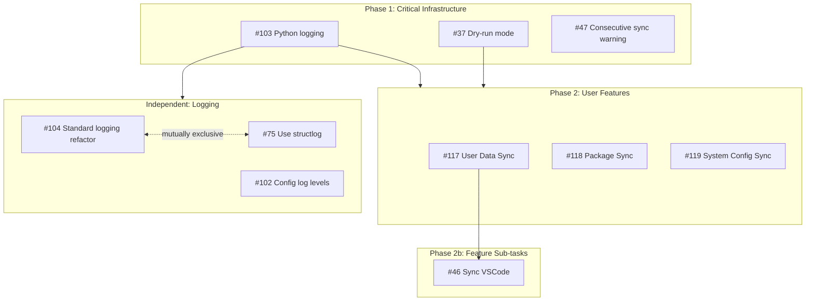
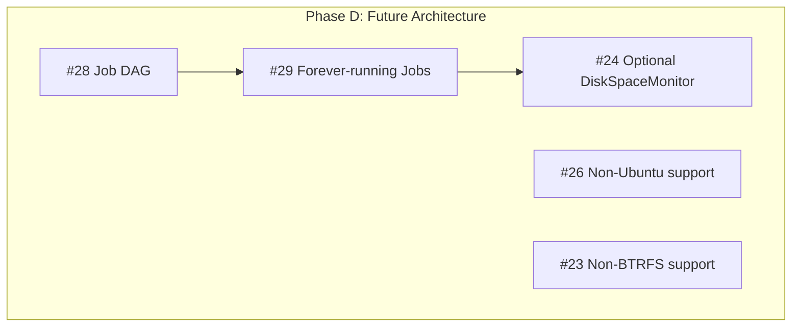

# Issue Triage 2025-12-31

**Objective:** Identify which open GitHub issues must be resolved before implementing user features (sync jobs: items 5-10 from Feature breakdown.md).

**Scope:** All open issues excluding those in "Done" or "In Review" status in:

- PC-switcher Kanban (Project #3)
- PC-switcher: Testing framework beta (Project #1)

**Date:** December 31, 2025

## Executive Summary

**Total open issues analyzed:** 33

**Critical issues blocking user features:** 3

- #103 - Integrate standard Python logging
- #37 - Implement --dry-run flag
- #47 - Warning on consecutive syncs from same source

**Non-critical issues that can be deferred:** 30

## Critical Issues (MUST Resolve Before User Features)

### #103 - Ensure pc-switcher log cli/tui handling shows messages from python "logging" as well

**Labels:** comp:core:logging
**Critical before user features:** YES
**Work started:** NO

**Reasoning:** PC-switcher currently uses a custom EventBus-based logging system, but Python's standard `logging` module is not integrated with it—messages from third-party libraries or jobs using standard logging won't appear in pc-switcher's log files or TUI. Since user feature jobs (Docker sync, package sync, etc.) will likely use third-party libraries that emit standard logging, this integration is foundational infrastructure needed before building features, otherwise critical diagnostics will be missing during development and troubleshooting.

### #37 - Add --dry-run to sync

**Labels:** comp:core
**Critical before user features:** YES
**Work started:** NO

**Reasoning:** Dry-run is critical for reliability (priority #1 in project requirements) and preventing data loss. The issue specifically notes "each Job should have a dry-run mode," indicating this is an architectural requirement that must be built into the Job base class infrastructure BEFORE implementing user feature sync jobs (items 5-10 in Feature breakdown.md). Currently, the `sync` command has no `--dry-run` flag, and the Job interface has no dry-run support.

### #47 - Warning on consecutive syncs from same source

**Labels:** prio:medium, comp:core
**Critical before user features:** YES
**Work started:** NO

**Reasoning:** Without this warning, users could accidentally sync from the same machine twice in a row, potentially overwriting changes made on the target. This is a safety-critical feature that must be in place before users start relying on the sync functionality for their daily workflow.

## Non-Critical Issues (Can Be Deferred)

### Logging Infrastructure (Can proceed with current system)

| Issue | Title | Labels | Work Started |
| ----- | ----- | ------ | ------------ |
| #104 | Use standard python logging | comp:core:logging | NO |
| #102 | Ability to configure the log levels in config file | comp:core:logging | NO |
| #75 | Refactoring: Use structlog | prio:low, comp:core | NO |

**Notes:**

- #104: Project already has functional custom logging; this is a refactoring to build it on top of Python's standard logging
- #102: Internal logging levels are already configurable; this is about making third-party library log levels configurable
- #75: structlog is listed as dependency but not used; existing JSON logging works correctly

### CI/CD Infrastructure (Already functional)

| Issue | Title | Labels | Work Started |
| ----- | ----- | ------ | ------------ |
| #116 | Run lint and unit tests only if relevant files changes | none | NO |

**Notes:**

- CI/CD workflows are functional; this is a performance optimization to skip tests when only docs change

### Testing Framework Enhancements (DX improvements, not blockers)

| Issue | Title | Labels | Work Started |
| ----- | ----- | ------ | ------------ |
| #87 | More strict ssh host checking in run-integration-tests.sh | prio:medium, comp:testing-framework | NO |
| #86 | Command-line flag to skip reset of VM on running integration tests | prio:medium, comp:testing-framework | NO |
| #85 | Extend DummyJobs to test cleanup on source and target when interrupted | prio:medium, comp:testing-framework | NO |
| #80 | Implement network failure simulation test for mid-sync target unreachability | comp:core, tests | NO |
| #78 | When Integration Test workflow run is cancelled, the lock is not cleared | prio:medium, comp:testing-framework | NO |
| #76 | When running integration tests, skip VM reset if not necessary | prio:low, comp:testing-framework | PARTIAL |
| #69 | Split integration tests into tests that need VMs and other integration tests | prio:low, comp:testing-framework | NO |
| #68 | Don't re-establish initial state in fixtures | comp:testing-framework | YES |
| #65 | Faster integration tests | comp:testing-framework | YES |
| #64 | Use ipv6 only for test-VMs | prio:low, comp:testing-framework | NO |
| #40 | Automatic deletion of test-VMs when not in use for x time | comp:testing-framework | NO |

**Notes:**

- All testing infrastructure is functional
- These are developer experience improvements and test optimizations
- #62 (real integration tests) was critical but is now COMPLETE (PR #90, #99 merged)
- #79 (GitHub API rate limits) is also COMPLETE (commit 155d7d1)

### Documentation (Organizational improvements)

| Issue | Title | Labels | Work Started |
| ----- | ----- | ------ | ------------ |
| #89 | Add ADR with python tool and conventions instead of having it in the user CLAUDE.md/AGENTS.md | documentation, prio:medium | NO |
| #88 | Follow official MADR instead of our own ADR .md template | documentation, prio:low | NO |
| #84 | Rename "Foundations" to "Core" | prio:low | NO |

**Notes:**

- Documentation exists and is usable
- These are organizational/standardization improvements

### Core Refactoring (Enhancements, not blockers)

| Issue | Title | Labels | Work Started |
| ----- | ----- | ------ | ------------ |
| #82 | Remove the dependency on GitHub API from core | prio:low, comp:core | NO |
| #48 | Command line options/flags for all interactive questions/confirmations | prio:low, comp:core | YES |
| #30 | Remove the strict 1 job_module = 1 Job class constraint | enhancement, comp:core | NO |
| #24 | Make DiskSpaceMonitor optional and a config-controlled Job | comp:core | NO |

**Notes:**

- #82: GitHub API only used in InstallOnTargetJob fallback path
- #48: --yes flag already implemented; issue remains open for additional prompts
- #30: Organizational constraint, not functional blocker
- #24: DiskSpaceMonitor works correctly as-is

### User Features (Deferred to Phase C per triage)

| Issue | Title | Labels | Work Started |
| ----- | ----- | ------ | ------------ |
| #46 | Sync VSCode | none | NO |
| #31 | Rollback cli command | comp:core | NO |

**Notes:**

- #46: Sub-task of Feature 5 (User Data Sync) per Issue triage 2025-12-11.md
- #31: Deferred to Feature 4 (Rollback) per Issue triage 2025-12-11.md

### Future Architectural Enhancements (Phase D)

| Issue | Title | Labels | Work Started |
| ----- | ----- | ------ | ------------ |
| #29 | "Forever running" Jobs | comp:core | NO |
| #28 | DAG for Jobs | comp:core | NO |
| #26 | Remove constraint to be on Ubuntu 24.04 | comp:core | NO |
| #23 | Don't require BTRFS | comp:core | NO |

**Notes:**

- All classified as "Phase D: Future architectural enhancements" per Issue triage 2025-12-11.md
- #29: Low priority, not needed for basic sync
- #28: Parallel execution optimization (sequential execution already works)
- #26, #23: Future requirement relaxations

## Issues Excluded (In Done/In Review Status)

The following issues were excluded from analysis as they are in "Done" or "In Review" status in GitHub Projects:

**From PC-switcher: Testing framework beta (Project #1):**

- #81, #83, #91, #93, #94, #105, #109, #110, #114

**From PC-switcher Kanban (Project #3):**

- #92, #93, #94, #98, #100, #101, #105, #106, #108, #109, #110, #114

**Additional:**

- #66 (labeled "status:done")

## Recommendations

### Immediate Action Required (Before User Feature Implementation)

1. **#103 - Standard Python logging integration**
   - Priority: HIGH
   - Action: Bridge Python's standard logging with pc-switcher's EventBus-based logging
   - Impact: Essential for debugging user feature jobs that use third-party libraries

2. **#37 - Dry-run mode**
   - Priority: HIGH
   - Action: Add --dry-run flag to sync command and implement Job base class dry-run infrastructure
   - Impact: Critical for reliability and preventing data loss during development and testing

3. **#47 - Consecutive sync warning**
   - Priority: HIGH
   - Action: Implement warning when syncing from the same source consecutively
   - Impact: Prevents accidental data loss from overwriting target changes

### Can Proceed in Parallel

All other 30 issues can be addressed in parallel with or after user feature implementation:

- Testing framework improvements enhance DX but don't block development
- Documentation improvements support maintainability
- CI/CD optimizations improve efficiency
- Architectural enhancements are explicitly deferred to future phases

## Conclusion

Only 3 critical issues block user feature implementation. The foundation infrastructure is solid and complete, with integration tests validated (PR #90, #99). Once #103, #37, and #47 are resolved, the project is ready to proceed with implementing sync jobs (Features 5-10).


## Implementation DAG





### Phase 3: Rollback

- #31 Rollback CLI

### Independent: Testing DX

- #116 CI path filtering
- #87 SSH host checking
- #86 Skip VM reset flag
- #85 DummyJob cleanup tests
- #80 Network failure test
- #78 Lock on workflow cancel
- #76 Smart VM reset skip
- #69 Split VM/non-VM tests
- #68 Fixture state
- #65 Faster tests
- #64 IPv6 only VMs
- #40 Auto-delete VMs

### Independent: Documentation

- #89 Python ADR
- #88 MADR template
- #84 Rename to Core

### Independent: Core Refactoring

- #82 Remove GitHub API
- #48 CLI flags
- #30 Multi-job modules

### Parallel Execution Groups

Issues that can be worked on simultaneously:

| Group | Issues | Notes |
| ----- | ------ | ----- |
| **Critical (do first)** | #103, #37, #47 | Can run in parallel, all must complete before Phase 2 |
| **User Features** | #117, #118, #119 | Can run in parallel after Critical complete |
| **Testing DX** | #116, #87, #86, #85, #80, #78, #76, #69, #68, #65, #64, #40 | All independent, any time |
| **Documentation** | #89, #88, #84 | All independent, any time |
| **Core Refactoring** | #82, #48, #30 | All independent, any time |
| **Logging Follow-up** | #104, #102 | After #103; #75 is alternative to #104 |
| **Phase D** | #28 first, then #29, then #24 | Sequential chain; #26, #23 independent |

### Recommended Execution Order

```text
1: #103 ──┬── #37 ──┬── #47
          │         │
2: #117 ──┼── #118 ─┼── #119
          │         │
    (parallel: any testing/docs/refactoring issues)
          │         │
3:  #46 ──┴─────────┴── #31
```
