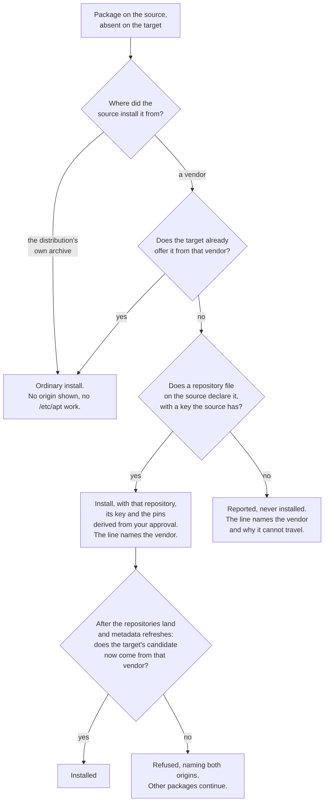

# Package sync requirements

What pc-switcher promises about installed software, from the point of view of the person whose machines it changes. It states the principles, then every case that can arise and what happens in it, then what it deliberately will not do.

## Navigation

- [High level requirements](High%20level%20requirements.md) — project vision and scope; this document elaborates one area of it
- [Package sync job behaviour](../jobs/package-sync.md) — the same ground as a how-it-works guide
- [Package sync specification](../system/package-sync.md) — the implementation-facing spec
- [ADR-021](../adr/adr-021-origin-replicating-package-convergence.md) — the decision this document is the user-facing statement of

Where this document and any other disagree, this one and ADR-021 are the intent; the other is stale. Section [Where the tool does not yet meet these requirements](#where-the-tool-does-not-yet-meet-these-requirements) lists the places the shipped code is knowingly behind.

## Principles

These are the rules everything below follows from. If you remember nothing else, remember these.

### 1. The source machine is the intent; the target is changed to match it

Every capture and every decision happens on the machine you sync *from*. The target answers read-only questions during planning and runs commands during applying. It never decides anything, and a sync never changes the source.

### 2. Software is replicated by asking each package manager, never by copying its files

Nothing copies `/var/lib/dpkg`, snapd's state or the flatpak store between machines. The target's own `apt`, `snap` and `flatpak` do the work, resolve their own dependencies and download from their own servers. What travels is the *decision* — install this, remove that — plus the small amount of configuration a package manager needs to be able to obey it.

### 3. An apt package is replicated as name *and* origin, not name alone

`gh` from `cli.github.com` and `gh` from Ubuntu's archive are the same name and two different pieces of software. pc-switcher will not satisfy "install `gh`" from a vendor your source machine does not use. If it cannot give the target the same origin, it reports the package and installs nothing.

Two machines on different Ubuntu mirrors are not two vendors: origins declared by the distribution's own source files count as one origin, computed per machine.

### 4. You are asked about packages; the machinery packages need follows from your answer

You decide what software should exist. You are not separately asked about the repository it comes from, the signing key that makes the repository trusted, or the pin that makes that vendor's build win. Those travel because a package you approved needs them. The one exception is `/etc/apt/apt.conf.d`, which governs apt's own behaviour rather than serving any package, so nothing about an approved package implies whether it should travel — you are asked, in all three directions.

### 5. Every change is reviewed before anything is written, once per job

Each enabled job shows you its whole diff, takes your answers, and only then starts changing the target. There is no second question part-way through. Nothing is applied that you did not tick.

### 6. Removals are never bulk-approved by accident

Installs and removals never share a checkbox list. Removal lists start unticked. A group that deletes something says so in its title.

### 7. Versions float; deliberate blocks replicate

apt and flatpak install by name and take whatever the target's own repositories currently offer. A version difference is reported, never forced or downgraded. snap is the exception and converges the exact revision, because snap keeps per-user data in revision-numbered directories and the data sync depends on both machines being on the same one. The blocks you set by hand — apt holds, snap refresh holds, flatpak masks — replicate as items of their own.

### 8. A machine can keep things to itself, permanently

Any reviewed item can be marked "never offer again on this machine". That mark lives in a file on that machine, is never synced, and makes the item invisible to every future sync in both directions.

### 9. Nothing is done that cannot be reported

A failed item fails alone and is named. A job that decided nothing says so rather than reporting success. A rehearsal changes nothing.

### 10. All four jobs ship disabled

Enabling one lets pc-switcher install and remove software on the target. That is opt-in, per job, in `sync_jobs`.

## What each job covers

Four independent jobs, four enable flags, four separate reviews. Enabling one never drags in another, and no job reads another's flag.

```yaml
sync_jobs:
  apt_sync: false             # apt packages, and the /etc/apt configuration they need
  snap_sync: false            # installed snaps, at the source's revision and channel
  flatpak_sync: false         # installed flatpak apps and their remotes, per scope
  manual_installs_sync: false # what no package manager can reproduce, plus the snippet registry
```

The three package-manager jobs must be listed before `folder_sync`. pc-switcher refuses to start otherwise. Software has to exist before your data lands on top of it, or the installer's stock defaults overwrite your synced config.

### `apt_sync`

The manually-installed apt set — what `apt-mark showmanual` reports, not every package on disk. Dependencies apt pulled in on its own are apt's business and are never items; the target resolves its own.

Also in scope, but as machinery rather than as questions: repository files under `/etc/apt/sources.list.d` and `/etc/apt/sources.list`, their signing keys, and pin files under `/etc/apt/preferences.d`. Reviewed as items: `/etc/apt/apt.conf.d` files, apt holds, and the deletion of a repository or pin file the source no longer has.

Out of scope: packages installed from a hand-downloaded `.deb`.

### `snap_sync`

Installed snaps, converged to the source's exact revision and tracking channel, with their confinement mode and their per-snap refresh holds. Sideloaded snaps are excluded.

### `flatpak_sync`

Installed flatpak applications and the remotes they come from, per installation scope. User-scope `flathub` and system-scope `flathub` are two separate things, because flatpak configures them separately. Masks are included.

### `manual_installs_sync`

Everything no package manager can reproduce: apt packages whose installed version comes from no repository the machine has configured (a `.deb` you installed by hand), and files under `/usr/local` and `/opt` that no package owns. It also owns the install-snippet registry, the only way such an item can be reproduced on the other machine.

### The boundaries between them

A hand-installed `.deb` belongs to `manual_installs_sync` alone. `apt_sync` detects the same packages with the same test and drops them before it diffs anything — they produce no apt item, no review line and no install. There is nothing apt could do with them: the target's apt has never heard the name.

On this machine, `code` is exactly that case. `apt-cache policy code` names only `/var/lib/dpkg/status` as a source, so it is `manual_installs_sync`'s to reproduce, and it is invisible to `apt_sync` no matter how `apt_sync` is configured.

The consequence to know: enable `apt_sync` and disable `manual_installs_sync`, and your hand-installed `.deb` packages are synced by nobody. They are silently absent from the review rather than offered as installs that would fail.

Application *data* is never any of these jobs' business. `~/.var/app`, `~/snap/<app>/`, dotfiles and everything else under your home belong to `folder_sync`.

## How you are asked

Three shapes of question exist. Which one an item gets is a property of the item, not a setting.

The ordinary three-way decision, for packages, holds, masks, flatpak remotes and apt config: tick to apply. Whatever you leave unticked is offered once more as "never offer again on this machine"; ticking it there is the permanent machine-specific mark, and ticking nothing means skip this run and ask again next time. If you ticked everything, the second list is not shown.

A two-way decision — act, or leave it for now — for deleting an apt repository file, deleting an apt pin file, and overwriting a repository file the two machines disagree about. There is no permanent mark for these and nothing is recorded. A permanent machine-local mark on a file whose whole job is to feed packages would silently and permanently change where those packages come from; if the two machines' files genuinely differ on purpose, the remedy is to consolidate them yourself.

A per-item resolution, for the two cases where "should this apply" is the wrong question: apt collateral damage takes install-anyway, skip, or abort the sync; an unreproducible manual install takes add a snippet, mark machine-specific, or skip for now.

Ctrl-C at any screen aborts the whole sync. It is never read as a per-item skip.

`pc-switcher sync <target> --confirm-each-command` inserts a prompt before every individual command, showing it verbatim, with proceed or abort and no per-command skip — one reviewed item can span several commands, so skipping one would leave it half-applied. It covers every write the jobs make, including the decision files, the snippet registry and the snapd refresh pause. It needs a real terminal.

## apt: every case

### A package on the source that the target does not have



Same origin already available on the target. An ordinary install line, ticked by default, no origin named, and nothing under `/etc/apt` changes for it.

A different vendor would satisfy the name on the target. Still an install line, but the line names where it will come from — `install gh (from cli.github.com/packages)` — and approving it carries the source's repository file, its signing key and the source's pin files with it. You are not asked about any of those. This is the case that would otherwise replicate the name and invert the provenance: on this machine `gh` is installed from `cli.github.com` at pin priority 1001, while Ubuntu's archive and Ubuntu ESM both offer a `gh` of their own.

The target has no candidate at all, but the source's repository can be replicated. Identical treatment to the previous case: install, with the repository derived. You are not asked twice and there is no second review after the repository lands.

The origin cannot be replicated. No repository file on the source declares it — a repository you deleted while its packages stayed, a `cdrom:` origin — or every file that does declare it names a signing key the source machine does not actually have. The package is reported, naming the origin and the reason, and nothing is installed. pc-switcher will not substitute another vendor's build.

The last-moment check. After the run's single metadata refresh and before its first install, the target's real candidate origins are read back for every approved install that has a vendor origin. If the vendor's build is still not what the target would install — the repository failed to write, a pin did not land, an epoch still outranks it — the install is refused as its own item naming both origins, and the rest of the run continues. This check is the guarantee; everything before it is preparation.

The epoch case, measured on this machine, is why pins must travel and why the check exists: Ubuntu's `firefox` is version `1:1snap1-0ubuntu5` at priority 500. That epoch 1 outranks every epoch-free Mozilla version at equal priority, so adding Mozilla's repository alone still installs Ubuntu's transitional package. Only Mozilla's pin file changes the outcome.

### A package on the target that the source does not have

Offered for removal, in an unticked removal group. Approving it runs `apt-get remove`, never `purge`. Marking it "never offer again" makes it this machine's own and it is not offered again.

### A package on both machines

Same version, same vendor: no item at all.

Different versions: reported, both versions named, never acted on. apt versions float by design.

Different vendors: reported as a provenance divergence, both origins named, and nothing is done. Converging it would mean a cross-vendor reinstall, which is neither a version float nor something you asked for. This check runs before the version comparison, because two vendors' copies of one name have no common version scale. It never fires for a mirror difference.

Held on the target: the package's own install or version action is suppressed entirely — a held package is never proposed for install or upgrade — and no package-level line appears. The hold travels as its own item.

### Holds

An apt hold is a separate item from the package it applies to, with its own review line and the ordinary three-way decision. Held on the source and not the target: a hold line, ticked by default, applied after the package install so the package exists before it is pinned in place. Held on the target and not the source: an unhold line, in the unticked removal group. Held on both or neither: nothing.

A hold approved for a package whose install you skipped fails as its own item and nothing else is affected. Replicating a hold never changes the package's version.

### Collateral damage from dependency resolution

Approving one package can make apt remove or downgrade others. Every approved change is simulated before anything is applied, and the collateral is classified.

Collateral that only touches automatically-installed packages proceeds silently — that is apt resolving its own dependencies, and it is not your decision to make.

Collateral that would remove or downgrade a package that is *manually installed on the target* becomes its own review item: install anyway, skip, or abort the sync. Skipping leaves the triggering install unapproved rather than failing it later.

The classification happens during the review, never mid-apply. If the real transaction has drifted by the time it runs, the guard refuses it there rather than proceeding.

One case is given up on purpose: a package you installed by hand on the *source*, which arrived on the target as an automatic dependency, is not protected. If the target's apt installed it automatically, the target's apt owns it, and that is the same set apt itself consults.

### Repositories

You are never asked to add or change one. A repository file lands on the target because a package you approved comes from it, and only then. A repository on the source that feeds no package this run syncs does not travel at all — the two machines' `/etc/apt` are converged for what packages need, not made identical.

Missing on the target and needed by an approved package: written, silently, with its signing key first.

Present on both with different content: overwritten with the source's version, silently — unless it feeds a package the target has marked machine-specific. In that case you are shown the file's two versions side by side, whole, never as a diff, and asked to overwrite or leave it for now. Leaving it means every approved package whose origin depended on that file fails, named, rather than being installed from somewhere else.

Present on the target and not the source: offered for deletion, unticked, with two answers. The line names the machine-specific packages on the target that the deletion would strand — those packages are invisible in the review by design, so nothing else in the run would tell you. It is disclosure, not refusal; deleting a repository whose packages are also going is normal cleanup.

The distribution's own files — `ubuntu.sources`, `/etc/apt/sources.list`, `ubuntu-esm-apps.sources` and `ubuntu-esm-infra.sources` — are written when the target lacks them and overwritten when they differ. They are never removed and never offered for removal. They are what defines "the distribution's own origin" on each machine, which is what keeps two machines on different mirrors from disagreeing about every package.

Files apt does not read are ignored. `sources.list.d` on this machine also holds `ubuntu.sources.save`, `ubuntu.sources.curtin.orig`, `ubuntu-esm-apps.sources.save` and `ubuntu-esm-infra.sources.save`; apt reads only `.list` and `.sources`, so neither does pc-switcher.

### Signing keys

Never an item, in any direction. You think in repositories and packages; a key is only how a repository is made to work.

A key the target lacks is copied, byte-for-byte from the source machine, before the repository that names it is written — whatever package owns it on the source, because vendors like Microsoft and Tailscale ship a `.deb` carrying both the repository entry and its key, and refusing to copy a package-owned key would make that repository permanently untrustable.

A key the target already has with different bytes is refreshed, which is what makes a vendor's key rotation follow you even though the rotation changes no repository file. The one exception: if the target's own dpkg owns that path, it is left alone. Replacing a distribution keyring is not a sync's job.

A key that already matches byte-for-byte is left entirely alone — no transfer, no command.

Keys are never fetched from a vendor. A key travels with its repository or not at all.

Keys are looked for in `/etc/apt/keyrings`, `/etc/apt/trusted.gpg.d` and `/usr/share/keyrings`. The last matters more than its name suggests: it is where `add-apt-repository`, Ubuntu's own files and most vendor `.deb`s put the key their `Signed-By:` points at.

A repository whose key is written inline in the file itself — what `add-apt-repository` does for a PPA — needs no keyring, and none is copied.

When you approve deleting a repository, a key in `/etc/apt/keyrings` that nothing else references any more goes with it. The count is taken against the target's real state after the deletion, so a repository you left unticked still counts as a user, one you marked machine-specific still counts, and `/etc/apt/sources.list` counts too. Nothing is deleted if the source machine still has that key. If you removed no repository, no collection happens at all. Only `/etc/apt/keyrings` is ever cleaned up: `trusted.gpg.d` keys are ambient trust nothing names, and `/usr/share/keyrings` is package territory. Both are copied from and neither is deleted from.

### Pins and priorities

Every `/etc/apt/preferences.d` file the source has is written to the target when missing and overwritten when different. Always, silently, with no review line. A pin is what makes a vendor's build win, in the same sense a key is what makes a repository trusted, and a pin naming an origin the target does not have does nothing at all — so always sending them costs nothing and cannot get a per-package derivation wrong.

The cost of that rule, stated plainly: a pin file you wanted on one machine only comes back on every sync. The only way to keep it machine-local is to delete it on the source.

Deleting one is different and is reviewed, unticked, with two answers. A pin the target has and the source does not is holding some vendor above another on a machine the source knows nothing about, and removing it can flip which vendor supplies a package at the target's next upgrade.

A pin is never read as a statement about the packages it names. On this machine `ubuntu-pro-esm-apps` pins `Package: *` at priority 510; a rule that echoed a pin onto every package it named would report every package on the machine, and would make a target-only package impossible to remove and impossible to silence.

Pins that push a version *down* work the same way. This machine's `no-esm-docker` pins the ESM origin to −1 for `docker.io` and friends, and `apt-cache policy docker.io` reports `Candidate: (none)` for that installed package. That file travels like any other pin, and a target that received the pin without the ESM repository is simply unaffected by it.

### apt configuration

`/etc/apt/apt.conf.d` is the one thing under `/etc/apt` reviewed in all three directions — add, change and remove — each with the ordinary three-way decision and the ordinary permanent machine-specific mark. A proxy setting or a `no-install-recommends` policy governs apt's behaviour, and no approved package implies whether it should travel, so the only honest source of that answer is you. It is also the kind of standing preference someone genuinely holds per machine, which is why it keeps the permanent mark that repository and pin deletions do not.

### Ubuntu Pro and ESM

`ubuntu-esm-apps.sources` and `ubuntu-esm-infra.sources` are part of the distribution set, so they are written to a target that lacks them. If the target has no Ubuntu Pro attachment, that is a problem, and the required behaviour is that pc-switcher asks before writing anything.

The hazard, measured: `esm.ubuntu.com` serves its repository *index* publicly, so an unattached target's `apt-get update` succeeds and the ESM suites enter candidate selection above the ordinary archive. Only the package pool is 401. The failure therefore lands later, at install time, on a package the user will not connect to the sync.

pc-switcher cannot fix this itself. Attaching needs a subscription token from your Pro dashboard or an interactive browser flow, the source machine's own credentials are root-only and not reusable for another machine, and holding a token would put a secret on a command line.

The required behaviour: before its first write, `apt_sync` asks, with exactly two answers. "I have attached the target — re-check and continue" re-probes the target and carries on, as many times as you want. "Skip `apt_sync` this run" leaves `/etc/apt` exactly as it was and lets every other job run. A run with nobody to ask skips `apt_sync` too. A dry run never asks; it warns.

This is not implemented yet. See [Where the tool does not yet meet these requirements](#where-the-tool-does-not-yet-meet-these-requirements).

### The `/etc/apt` group is all-or-nothing

Everything under `/etc/apt` that a run writes or deletes is backed up first, applied, and followed by exactly one `apt-get update`. If that refresh fails, every file the group touched is restored and the target's `/etc/apt` is left as it was found. Every approved package whose origin depended on one of those files then fails, named, and the run continues with the packages that did not.

A single derived file that fails to write does the same, on a smaller scale: it has no review line of its own to fail, so the failure is charged to every package that needed it, naming the file. That is deliberate — you decided about a package, not about a file.

## snap: every case

Snaps have not had the origin treatment apt has. There is one store, and where a snap came from is not modelled.

On the source only: installed at the source's exact revision, then switched to the source's channel.

On the target only: offered for removal, unticked. snapd keeps its own pre-removal snapshot; pc-switcher does not disable that.

Different revision, or the same revision on a different channel: converged to the source's, as a change item. Both are one line naming the two revisions or the two channels.

Identical revision and channel: nothing.

Confinement — classic or devmode — is captured on the source and replicated with the install.

Sideloaded snaps (`snap install --dangerous`, `snap try`) are the one thing snap sync leaves alone. Their revision has an `x` prefix and no store can serve it, and pc-switcher has no way to carry the file. Sideloaded snaps on the source are named in a warning and skipped entirely, and so is any hold set on one. A sideloaded snap that exists only on the *target* is unaffected: it is still offered for removal like any other.

A snap whose revision the target's snapd cannot fetch fails as its own item; the rest of the run continues.

Holds are separate items with the ordinary three-way decision: held on the source only means hold, held on the target only means unhold in the unticked group, held on both or neither means nothing. A hold recorded for a snap the source no longer has produces no item. No command this job runs ever sets a standing hold as a side effect.

For the duration of the run, snapd's *automatic* refresh is paused on both machines, because snapd refreshes several times a day and would otherwise move a revision mid-sync. Only automatic refreshes are blocked; the job's own revision convergence still works. Each machine's prior refresh policy is read first and written back at the end, so a hold you set yourself, including an indefinite one, survives. If the prior value cannot be read on a machine, that machine's policy is left untouched and the pause pc-switcher set expires on its own.

Revision convergence is what makes snap application data syncable at all. With both machines on the same revision, `folder_sync` mirrors the current revision's data directory and the revision-independent `common` directory. Retained older revisions — ones the target's snapd never installed — stay excluded rather than leaving orphan data behind.

## flatpak: every case

Flatpak has not had the origin treatment either. A remote is reviewed as an item in every direction, which is the opposite of how apt now treats a repository. The asymmetry is real and is flagged in the non-goals.

Scope is identity. The same application in the user installation on one machine and the system installation on the other is two items: one install and one removal, never a change. pc-switcher reports the split as found and does not normalise it.

So is the branch. An app is identified, installed and uninstalled by its full `<application>/<arch>/<branch>` reference, never by the bare application id, because two branches of one id can be installed side by side and a remote can offer several — flatpak refuses to guess between them, so the bare id fails on every run for such an app. The same app on `stable` on one machine and `beta` on the other is two items, an install and a removal, and the review line names the branch. Where the app comes from is deliberately *not* identity: see the origin paragraphs below.

An app on the source only: installed, after its remote. On the target only: offered for removal, unticked. Same app, same branch, same scope, different version: reported only. Identical: nothing.

A remote missing on the target is its own review item, ticked by default, and every remote converges before any app that depends on it — `flatpak install` refuses outright when its remote is not configured in that scope.

A remote travels with its trust, not only its name and URL. pc-switcher captures whether the source verifies the remote's signatures and, when it does, the remote's own signing key, and re-adds it on the target with that key imported. The key is copied byte-for-byte and never fetched from a vendor. Without it a replicated remote is configured but unusable and every install from it fails with a missing-public-key error. A remote the source itself does not verify is replicated unverified and says so in the review; a verified remote is never turned into an unverified one. A verified remote with no key of its own — trusted through a machine-level anchor — is added plainly.

A remote present on both machines whose URL, verification setting or key differs is a change item that converges the target in place, keeping the apps that name it as their origin intact. A target that already trusted a different key ends up trusting both, because flatpak merges imported keys rather than replacing them — so the difference is reported again next run rather than the target's own trust being deleted.

A remote present only on the target is offered for removal, unticked, and its line names the apps on the target that still have it as their origin in that scope. Deleting a remote also drops its key.

An app whose origin remote exists neither on the target nor in this run's own additions is refused as its own item naming the missing remote, rather than issuing an install flatpak would reject.

A third named installation, neither user nor system, is skipped.

Masks are patterns, not references to installed apps, and replicate whether or not anything matches. Present on the source only means mask; on the target only means unmask, unticked. Editing a pattern reads as remove-old plus add-new, and moving one between scopes reads as add plus remove — reported as found, never normalised. A system-scope mask needs sudo on the target; a user-scope one does not, and a user-scope-only run never asks for root.

## Manual installs: every case

This job detects two things on the source: apt packages whose installed version comes from no configured repository, and paths directly under `/usr/local` and `/opt` (plus the immediate children of `/usr/local/bin` and `/usr/local/lib`) that no package owns.

Each detected item ends the run resolved in one of three ways, and there is no fourth: it has an install snippet, it is marked machine-specific, or you skipped it once. Skip-once is a real resolution, not an unresolved state.

An item with a snippet in the source's registry is an install line and is reproduced by replaying the snippet. An item with a snippet only on the *target* is still unresolved: whether something is reproducible is decided by what the source holds. An item with no snippet anywhere is a report line in its own group, asking for a resolution.

A snippet authored during the review is persisted, pushed and replayed in the same run — you do not have to sync twice.

A snippet is a shell command that reproduces the item. pc-switcher never parses, interprets or reasons about it. It is stored verbatim, whitespace included, and replayed verbatim as the target user with no `sudo` wrapped around it — any privilege it needs must be written inside it. It runs with no stdin, so a command that prompts fails rather than hanging the sync. Submitting an empty body re-prompts the three-way choice rather than falling through.

The registry lives at `~/.config/pc-switcher/package-snippets.yaml` and, unlike the decision files, it *does* travel: how to install something is knowledge about the package, not about the machine. It is pushed as a whole-file overwrite. A purely additive push proceeds silently. A push that would lose an entry the target holds, or change one, shows you exactly which entries and asks. Declining aborts the run, and a run that cannot ask aborts too — so you can consolidate the two registries by hand rather than silently dropping the target's snippets.

A snippet that has vanished between planning and replay, or whose replay fails, is a per-item failure naming the item; the rest of the run continues.

This job is install-only. It has no record of what it installed on the target, so it never proposes a removal. Removing a hand-installed item on the target is manual work.

## What you are never asked about, and why

The test is derivability: if an approved package implies the answer, asking you would be asking a question you cannot answer independently of the package.

Adding or changing an apt repository. It is where an approved package comes from. Ticking a repository without its package does nothing; ticking a package without its repository cannot be installed. The pairing was never expressible, so the repository has no tick.

Signing keys, in every direction. A key is only how a repository is made to work.

Adding or updating an apt pin. A pin is what makes an origin win, and origin is part of what is being replicated. One naming an origin the target lacks is inert.

The distribution's own source files. They define what "the distribution" means on each machine.

The single `apt-get update` a run issues, and the cleanup of a keyring nothing references any more.

Automatically-installed apt dependencies, and collateral that touches only them. The target's apt owns its own dependency graph.

Files apt does not read, like the `.save` copies its own tooling leaves behind.

The snapd auto-refresh pause, and flatpak's remote-before-app ordering.

None of this is hidden — every derived write is logged as it lands and previewed under `--dry-run`. It is simply not a question.

The counter-case, so the rule is legible: `/etc/apt/apt.conf.d` is reviewed in all three directions precisely because no approved package implies anything about it.

## Failure and partial outcomes

A job reports one of three outcomes.

SUCCESS means the job did what its review approved. A job whose review was empty — the target already matches — is also a success: that is the goal, met.

SKIPPED means the job deliberately did nothing and says so, rather than reporting a success it did not earn. A package job whose review had something to offer but ran without a terminal is skipped. So is a `folder_sync` with no enabled folders, a VS Code state sync with nothing to sync, and an enabled job name that resolves to nothing. A skipped job records no decision, pushes no registry and leaves the target untouched. The run continues and the exit code is unchanged.

FAILED means at least one approved item could not be applied. Every approved item is attempted; failures are collected and reported together at the end, naming each item. One bad package never blocks the rest of the same job, and one failed job never stops the others.

A run without a terminal prompts for nothing, so every reviewable item comes back skip-once and every package job with a non-empty review reports SKIPPED. Nothing is recorded, no snippet is written, no registry is pushed. Re-run interactively to decide anything.

A dry run produces the same plan and the same review as a real run, and issues no command that changes either machine. The review *is* the preview: it lists every item, and the derived `/etc/apt` writes that have no review line of their own are previewed alongside it, so a run whose entire repository work is derived does not show a bare metadata refresh with no reason for it.

Aborting — Ctrl-C at any review screen, an unanswerable prompt, or choosing abort at a collateral item — stops the whole sync. It is never a per-item skip.

## Known limitations and deliberate non-goals

These are given up knowingly. Each one is a real cost.

`/etc/apt` on the target is no longer under your line-by-line control. Repositories, keys and pins appear because a package was approved, and the only way to decline one is to decline the package.

The two machines' `/etc/apt` are converged for what packages need, not made identical. A repository on the source that feeds nothing this run syncs does not travel.

Pin files always travel. One you wanted on a single machine comes back every run, and deleting it on the source is the only way to stop that.

A package you installed by hand on the source but which arrived on the target as an automatic dependency is not protected from collateral removal. The target's apt owns what the target's apt installed.

Machine-specific marks are not consulted when protecting against collateral. A package you marked skip-always can still be removed as collateral of an approved install.

snap and flatpak have no origin model. apt now replicates provenance; snap has one store and flatpak reviews remotes as ordinary items in all three directions. Two machines whose `flathub` points at different URLs converge to the source's URL as a change item, which is the old model, not the apt one. Whether flatpak remotes should become derived-from-approved-apps is undecided.

Deleting a flatpak remote or an apt config file can be marked machine-specific; deleting an apt repository or pin cannot. The two are answered differently on purpose, but the inconsistency is visible.

Sideloaded snaps cannot be reproduced. Nothing carries the `.snap` bytes between machines.

Manual installs cannot be removed. The job keeps no record of what it put on the target.

Version drift is reported, never resolved, for apt and flatpak. Aligning two machines' versions is your job, not the sync's.

Cross-vendor divergence is reported, never resolved. When both machines have the same package from different vendors, pc-switcher will not pick one.

A package job's review cannot be answered without a terminal. There is no config file of standing answers and no `--yes`.

Machine-specific marks are per manager and per machine, in files that are deliberately never synced. Moving to a new machine means re-deciding.

## Where the tool does not yet meet these requirements

Verified against the code on the current branch, not against the older documents.

The Ubuntu Pro / ESM gate is not implemented. The two ESM source files are today written to the target whenever they are missing or differ, with no attachment probe and no question. On a target with no Pro attachment that is the exact failure the gate exists to prevent: the ESM suites win candidate selection and a later install fails with a 401 nobody will trace back to the sync. This is the single largest gap between the requirement and the code.

`docs/jobs/package-sync.md` and `docs/system/package-sync.md` still describe repositories and pins as reviewed items with three-way answers, and still say a repository offered for install names the keys it would copy. Those review lines no longer exist. Both documents predate the derived-repository change in part and are stale in exactly those passages.

A non-interactive dry run reports SKIPPED for every package job with a non-empty plan, because the skip is raised on the non-interactive path with no dry-run exemption. The intent recorded elsewhere is that a rehearsal that completes reports SUCCESS. One of the two is wrong; see the open questions.

## Open questions

Genuinely undecided. An answer invented here would be worse than the question.

Should `flatpak_sync` adopt the apt model — remotes derived from approved apps rather than reviewed as items? Today it does not, and the asymmetry is not the result of a decision, only of ordering. The same question applies, more weakly, to whether snap should model where a snap came from at all.

What should a non-interactive dry run report? Raising the skip on the non-interactive path is defensible (nothing was decided), and so is exempting dry runs (a rehearsal that completes did what a rehearsal does). The code says SKIPPED; the design note says SUCCESS.

Is the three-way decision right for `/etc/apt/apt.conf.d`? The ruling says it is reviewed in all three directions but does not say with how many answers. It currently gets the full three-way decision and the permanent mark, reasoned from the fact that the two-answer screens were justified by consequences an apt config file does not have. That reasoning is sound but was never ruled on.

Should a repository deletion ever be markable machine-specific? The current answer is no, with the remedy being to consolidate the two machines' files. That remedy is real work the user may not want to do, and the alternative — a permanent mark that silently fixes where packages come from — was rejected rather than tested against use.

How much does the ESM hazard actually cost on a real desktop? Measured in a container, zero of thirteen upgradable packages had an ESM candidate. That a desktop with a large `universe` set has many more follows from the priority ordering but has not been measured. The gate does not depend on the count, but the size of the problem is unknown.

How often is a package manual on the source and automatic on the target — the collateral case knowingly given up? Nobody has counted. "Rare" is not a claim this document makes.
