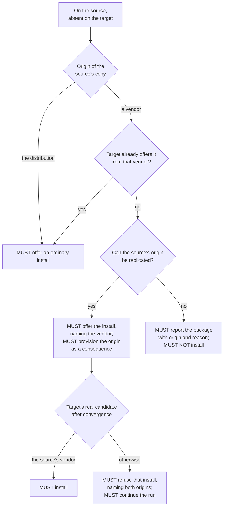

# Package sync requirements

Requirements on the four package-sync jobs, stated from the point of view of the person whose machines are changed: what the system must do to their software, what it must ask them, what it must never do to them without consent, and what it must tell them afterwards.

Requirement ids are `PKG-FR-*` for obligations and `PKG-NG-*` for non-goals — outcomes the system is required not to attempt. MUST, MUST NOT, SHOULD and MAY carry their usual normative force. How an obligation is met — which command reads what, which file holds it, what a screen says — is not specified here; that is the specification's job.

## Navigation

- [High level requirements](High%20level%20requirements.md) — project vision and scope; this document elaborates "installed packages must sync"
- [Package sync job behaviour](../jobs/package-sync.md) — user guide to the same jobs
- [Package sync specification](../system/package-sync.md) — how these requirements are implemented
- [ADR-020](../adr/adr-020-declarative-package-convergence.md) — the decision these requirements follow from

Precedence: where this document and any other disagree, this document and ADR-020 state the intent. Section [Where the tool does not yet meet these requirements](#where-the-tool-does-not-yet-meet-these-requirements) records requirements the shipped code knowingly does not meet.

## Scope

Four jobs — `apt_sync`, `snap_sync`, `flatpak_sync`, `manual_installs_sync` — replicate what software is installed. Application data is not theirs.

- **PKG-FR-OPT-IN**: All four jobs MUST ship disabled and MUST be enabled individually in configuration.
  Why: enabling one authorises the system to install and remove software on the target.
- **PKG-FR-JOB-INDEPENDENCE**: Each job MUST be enableable, reviewable and failable on its own. Enabling one MUST NOT enable another, and no job's behaviour may depend on whether another is enabled.
- **PKG-FR-JOB-ORDER**: The three package-manager jobs MUST run before the user-data sync, and the system MUST refuse to start when they are ordered otherwise.
  Why: software must exist before data lands on top of it, or an installer's stock defaults overwrite synced configuration.
- **PKG-FR-APT-SCOPE**: `apt_sync` MUST cover the manually-installed apt package set, the repositories and pins that govern where those packages come from, apt's own behavioural configuration, and apt holds. Packages apt installed automatically to satisfy dependencies MUST NOT be items.
- **PKG-FR-SNAP-SCOPE**: `snap_sync` MUST cover installed snaps with their revision, tracking channel, confinement mode and per-snap refresh holds.
- **PKG-FR-FLATPAK-SCOPE**: `flatpak_sync` MUST cover installed flatpak applications per installation scope, the remotes those applications need, and mask patterns per scope.
- **PKG-FR-MANUAL-SCOPE**: `manual_installs_sync` MUST cover what no package manager can reproduce — apt packages whose installed version comes from no repository the machine has configured, and software under `/usr/local` and `/opt` that no package owns — together with the registry of install snippets that is the only way such software can be reproduced on the other machine.
- **PKG-FR-DEB-OWNERSHIP**: Software installed from a hand-downloaded `.deb` MUST belong to `manual_installs_sync` alone. `apt_sync` MUST NOT produce an item, a review line or an install for it in any configuration.
  Why: the target's apt has never heard the name; an apt item for it could only fail.
- **PKG-FR-DATA-BOUNDARY**: No package job may sync application data. Data belongs to the user-data sync.

## Convergence model

- **PKG-FR-SOURCE-INTENT**: The source machine's state MUST be the only statement of intent. A sync MUST NOT modify the source, and the target MUST NOT decide anything: it answers read-only questions while the change is planned and carries out what was approved.
- **PKG-FR-MANAGER-CONVERGES**: Software MUST be replicated by having the target's own package managers install and remove it. The system MUST NOT copy a package manager's database, store or unpacked files between machines. What travels is the decision, plus the configuration a manager needs in order to obey it.
- **PKG-FR-APT-IDENTITY**: An apt package MUST be identified by name and origin together. The system MUST NOT satisfy an approved install from a vendor the source does not use.
  Why: `gh` from a vendor's repository and `gh` from the distribution archive are one name and two different pieces of software.
- **PKG-FR-DISTRO-ORIGIN**: All origins a machine's distribution source files declare MUST count as one origin, computed per machine.
  Why: two machines on different mirrors are not two vendors and must not disagree about every package.
- **PKG-FR-SNAP-IDENTITY**: A snap MUST be identified by name alone, and the system MUST NOT ask the user anything about snap provenance.
  Why: one store, and a name resolves to one publisher through an assertion snapd validates itself, so no second build of a name exists to install by mistake.
- **PKG-FR-FLATPAK-IDENTITY**: A flatpak application MUST be identified by its installation scope and its full reference including branch. The same application in two scopes, or on two branches, MUST be treated as two independent items — one install and one removal — and the system MUST NOT normalise the difference away.
  Why: two branches of one application can be installed side by side, and the two scopes are configured separately.
- **PKG-FR-FLATPAK-ORIGIN-NOT-IDENTITY**: A flatpak application's origin remote MUST NOT be part of its identity.
- **PKG-FR-VERSION-FLOAT**: For apt and flatpak the system MUST install by name and accept whatever the target's own repositories offer. A version difference MUST be reported and MUST NOT be forced, upgraded or downgraded.
- **PKG-FR-SNAP-REVISION**: For snap the system MUST converge the target to the source's exact revision and tracking channel.
  Why: snap keeps per-user data in revision-numbered directories, so the data sync is only correct when both machines are on the same revision.
- **PKG-FR-BLOCKS-REPLICATE**: Blocks the user set by hand — apt holds, snap refresh holds, flatpak masks — MUST replicate, each as an item decided separately from the software it applies to.

## Consent

- **PKG-FR-REVIEW-FIRST**: A job MUST NOT modify the target before the user has approved that job's diff.
- **PKG-FR-ONLY-APPROVED**: A job MUST apply only what the user approved.
- **PKG-FR-BATCHED**: A job's questions SHOULD be batched — one screen per manager per action — and a job MUST NOT ask item by item where one screen would do.
  Why: a question per package is the interruption the review exists to replace.
- **PKG-FR-ASK-AGAIN**: A job MAY ask again, including after it has begun changing the target, where the answer it needs rests on facts this run's own changes invalidated or that could not be established before the first change.
  Why: correctness outranks batching, and some things are knowable only once an action has landed. What this permits is a second question, never a queue of them.
- **PKG-FR-CONSENT-BEFORE-CHANGE**: Every consent a job needs for a change MUST be obtained before that change is made.
- **PKG-FR-ASK-ABOUT-SOFTWARE**: The user MUST be asked about software, and MUST NOT be asked separately about machinery whose necessity follows from an approved package: the repository a package comes from, the key that makes that repository trusted, the pin that makes that vendor's build win, the remote a flatpak application is installed from.
  Why: the test is derivability. Approving the package answers the question; asking it separately would ask for an answer the user cannot give independently of the package, and the pairing was never expressible — a repository approved without its package does nothing, a package approved without its repository cannot be installed.
- **PKG-FR-ASK-WHEN-NOT-DERIVABLE**: Where the answer does not follow from any approved package, the system MUST ask. Four such questions exist and are required, each specified below: apt's own behavioural configuration (`PKG-FR-APTCONF`), an unattached Ubuntu Pro target (`PKG-FR-ESM-GATE`), collateral damage to software the user installed by hand on the target (`PKG-FR-COLLATERAL-MANUAL`), and repointing an origin that machine-specific software depends on (`PKG-FR-REPO-CONFLICT`, `PKG-FR-FLATPAK-REPOINT`).
- **PKG-FR-NAME-THE-MACHINES**: Everything the user reads while deciding — screen titles, item details, warnings, prompts and their answers — MUST identify each machine by its hostname. "Source" and "target" MUST NOT appear in any of it.
  Why: source and target are roles this run assigns, not names of the user's computers. A line saying "the target loses this package" makes the reader work out which machine that is before they can answer, and the whole point of the question is which of their two machines is affected.
- **PKG-FR-EFFECT-NOT-MECHANISM**: Every answer offered MUST state its own effect on a named machine rather than the mechanism that produces it, and every question MUST state what the change would do before it is answered.
  Why: the user is deciding about their machines, not operating the tool's internals. An answer labelled with the name of an internal concept asks them to translate before they can choose.
- **PKG-FR-REMOVAL-DISTINCT**: Approving the removal of software MUST require a gesture distinct from approving installs, MUST NOT be the default, and MUST be presented so that the user is told the approval deletes something.
- **PKG-FR-SKIP-ONCE**: The user MUST be able to decline any reviewed item for the current run only. Nothing MUST be recorded, and the item MUST be offered again on the next sync.
- **PKG-FR-MACHINE-SPECIFIC**: The user MUST be able to mark a reviewed item as never to be offered again on that machine. The mark MUST be local to that machine, MUST NOT be synced, and MUST suppress the item in every later sync in both directions.
- **PKG-FR-NO-MARK-ON-ORIGIN**: Deleting an apt repository, deleting an apt pin, resolving a repository conflict, and deleting or repointing a flatpak remote MUST NOT be markable machine-specific. Declining them MUST record nothing.
  Why: a permanent machine-local mark on configuration whose whole purpose is to feed software would silently and permanently change where that software comes from. Where the two machines' configurations genuinely differ on purpose, the remedy is consolidating them.
- **PKG-FR-ABORT**: The user MUST be able to abort the whole sync at any question, and an abort MUST NOT be read as declining a single item.
- **PKG-FR-CONFIRM-EACH**: The system MUST offer a mode in which every individual modification a package job makes is shown verbatim and applied only after explicit consent, covering every write including decision records, the snippet registry and the refresh pause. That mode MUST offer proceed or abort only, and MUST require an interactive terminal.
  Why: one reviewed item can span several commands, so skipping one would leave the item half-applied.

## apt

### Installing

- **PKG-FR-APT-VENDOR-DISCLOSURE**: When an approved install would come from anything other than the distribution, the user MUST be told which vendor it comes from before approving it.
- **PKG-FR-APT-ORIGIN-DERIVED**: Approving a package MUST carry the repository, key and pins its origin needs, without a separate question and without a further question once they land.
  Why: they are derived from the approval itself, so nothing they change can invalidate the answer that produced them.
- **PKG-FR-APT-ORIGIN-UNREPLICABLE**: Where no repository the source has declares the package's origin, or every repository that declares it names a key the source does not hold, the system MUST report the package with its origin and the reason, MUST NOT install it, and MUST NOT substitute another vendor's build.
- **PKG-FR-APT-ORIGIN-VERIFY**: After repository convergence and before the first install, the system MUST verify against the target's own real state that each approved install will come from the source's origin. An install that would not MUST be refused as its own failure naming both origins, and the rest of the run MUST continue.
  Why: this check is the guarantee that `PKG-FR-APT-IDENTITY` holds; everything before it is preparation. It is not redundant with planning — a repository can fail to write, a pin can fail to win, and a distribution epoch can outrank every version a vendor publishes.

### Removing and diverging

- **PKG-FR-APT-REMOVE**: A package on the target that the source does not have MUST be offered for removal. Approval MUST remove the package without purging its configuration.
- **PKG-FR-APT-SAME**: A package present on both machines at the same version from the same vendor MUST produce no item.
- **PKG-FR-APT-VERSION-DIFF**: A version difference MUST be reported with both versions named and MUST NOT be acted on.
- **PKG-FR-APT-VENDOR-DIFF**: The same package installed from different vendors on the two machines MUST be reported as a provenance divergence naming both origins, MUST NOT be converged, and MUST take precedence over any version difference on that package. It MUST NOT be raised for a mirror difference.
  Why: converging it would mean a cross-vendor reinstall the user did not ask for, and two vendors' builds share no version scale.
- **PKG-FR-APT-HELD-TARGET**: A package held on the target MUST NOT be proposed for install or upgrade, and MUST produce no package-level item. Its hold MUST still be an item.

### Holds

- **PKG-FR-APT-HOLD-ITEM**: An apt hold MUST be an item separate from the package it applies to, decided separately, in both directions.
- **PKG-FR-APT-HOLD-ORDER**: An approved hold MUST be applied after the package it names exists.
- **PKG-FR-APT-HOLD-INERT**: Replicating a hold MUST NOT change the package's version, and a hold whose package install was not approved or failed MUST fail alone.

### Collateral damage

- **PKG-FR-COLLATERAL-AUTO**: Collateral removals and downgrades that touch only automatically-installed packages MUST proceed without asking.
  Why: that is the target's apt resolving its own dependency graph.
- **PKG-FR-COLLATERAL-MANUAL**: An approved change MUST NOT remove or downgrade a package that is manually installed on the target unless the user has consented to that consequence specifically. The request MUST name the affected package, say why it is protected, and say what the approved change would do to it. The user MUST be able to accept it, to keep the package — leaving the changes that cause the loss unapplied rather than failing later — or to stop the sync, and each of those three MUST state its own effect. The stopping answer MUST say how far it reaches.
  Why: "abort" alone reads as abandoning the question. Stopping here ends the entire sync, not just the package job, and a user who cannot tell those apart cannot choose between them. The protection is also not the machine-specific mark: nobody recorded a preference, the target's own package manager reports that a person asked for the package, and saying otherwise would describe a decision the user never made.
- **PKG-FR-COLLATERAL-ATTRIBUTION**: Declining collateral MUST cancel only the approved changes whose own transaction causes it, and MUST NOT cancel any other change under review. Where the collateral is caused by a combination of changes and by no single one of them, the whole set MUST be cancelled, and the question MUST say so.
  Why: the review's other answers are the user's and were given about other software. A decline that reaches them is a decision the user did not make.
- **PKG-FR-COLLATERAL-KEEPS-MARKS**: Cancelling a change on account of declined collateral MUST NOT alter a decision the user gave for that change. A change marked never-offer-again MUST still be recorded as such, and a change already declined MUST NOT be re-decided.
- **PKG-FR-COLLATERAL-TIMING**: Collateral MUST be classified, and consented to, before anything is applied. If the real transaction has drifted by the time it runs, the system MUST refuse it rather than proceed.
  Why: the package manager states the transaction in advance when asked, so the consequence is knowable while the user is deciding about the change that causes it.
- **PKG-FR-COLLATERAL-NEW-ORIGIN**: For an install whose origin this run must itself provision, the protection of `PKG-FR-COLLATERAL-MANUAL` MUST still hold, but consent MUST NOT be sought in advance: unapproved collateral MUST fail that one item, and the run MUST continue.
  Why: the facts that question needs do not exist while the review is being built — until the repository lands, the target's apt cannot resolve the name, and including it would strip the protection from every other package in the run rather than weaken it for one. The cost is that for those packages the user is told afterwards instead of asked beforehand.

### Repositories, keys and pins

- **PKG-FR-REPO-DERIVED**: The user MUST NOT be asked to add or change a repository. A repository MUST be written to the target only because an approved package comes from it. A repository on the source that feeds no package this run syncs MUST NOT travel.
- **PKG-FR-REPO-OVERWRITE**: A repository present on both machines with differing content MUST be overwritten with the source's version, except as required by `PKG-FR-REPO-CONFLICT`.
- **PKG-FR-REPO-CONFLICT**: Where overwriting would repoint a repository that software the target marked machine-specific depends on, the system MUST obtain consent first, MUST show both machines' versions of the configuration in full, and MUST NOT record the answer. Declining MUST fail every approved package whose origin depended on it, naming them, rather than installing them from elsewhere.
  Why: machine-specific software produces no review line in any run, so nothing else would tell the user its origin was about to move. Ordinary target-only software already has a removal line of its own.
- **PKG-FR-REPO-DELETE**: A repository present on the target and not on the source MUST NOT be deleted without explicit approval. The request MUST name the repository URLs the file declares, and MUST name the machine-specific packages on the target the deletion would strand.
  Why: disclosure, not refusal — deleting a repository whose packages are also going is ordinary cleanup, and the stranded packages are invisible in the review by design. The filename alone is not the decision: it is whatever created the file happened to call it, and two machines routinely name the same vendor differently, while the URL is what the deletion actually takes away.
- **PKG-FR-DISTRO-FILES**: The distribution's own source files MUST be written when the target lacks them and overwritten when they differ. They MUST NEVER be removed and MUST NEVER be offered for removal.
  Why: they are what defines "the distribution's own origin" on each machine, which is what makes `PKG-FR-DISTRO-ORIGIN` computable.
- **PKG-FR-APT-IGNORES**: Files apt itself does not read MUST NOT be treated as repository configuration in any direction.
- **PKG-FR-KEY-NOT-ITEM**: A signing key MUST NOT be a review item in any direction.
- **PKG-FR-KEY-COPY**: A key the target lacks MUST be copied byte-for-byte from the source before the repository that names it is written, whatever owns it on the source. Keys MUST NEVER be fetched from a vendor.
  Why: vendors ship packages carrying both the repository entry and its key; refusing to copy a package-owned key would make such a repository permanently untrustable.
- **PKG-FR-KEY-REFRESH**: A key the target holds with different content MUST be refreshed, except where the target's own distribution packaging owns it, which MUST be left alone. A key that already matches MUST NOT be touched.
  Why: refreshing is what makes a vendor's key rotation follow the user even though rotation changes no repository file. Replacing a distribution keyring is not a sync's job.
- **PKG-FR-KEY-CLEANUP**: When the user approves deleting a repository, a repository-specific key that nothing on the target references any more MAY be deleted with it. A key the source still holds MUST NOT be deleted, and keys in the locations that hold ambient or distribution-owned trust MUST NEVER be deleted.
- **PKG-FR-PIN-ALWAYS**: Every pin the source has MUST be replicated to the target, always and without review.
  Why: a pin is what makes a vendor's build win, in the same sense a key is what makes a repository trusted, and a pin naming an origin the target does not have does nothing at all — so replicating them all costs nothing and cannot get a per-package derivation wrong.
- **PKG-FR-PIN-DELETE**: A pin present on the target and not the source MUST NOT be deleted without explicit approval, and the request MUST show the file's content in full.
  Why: it is holding some vendor above another on a machine the source knows nothing about, and removing it can flip which vendor supplies a package at the target's next upgrade. A pin filename names neither the vendor it favours nor the priority it gives it, so the file itself is the only thing the decision can rest on — and `PKG-FR-PIN-NOT-INVENTORY` rules out summarising it.
- **PKG-FR-PIN-NOT-INVENTORY**: A pin MUST NOT be read as a statement about the packages it names.
  Why: a machine-wide pin would otherwise report every package on the machine, and would make a target-only package impossible to remove and impossible to silence.
- **PKG-FR-APTCONF**: apt's own behavioural configuration — the settings that govern how apt behaves rather than where packages come from — MUST be reviewed in all three directions, with the ordinary decision and the permanent machine-specific mark.
  Why: no approved package implies whether such a setting should travel, so the only honest source of that answer is the user, and it is the kind of standing preference someone genuinely holds per machine.

### Ubuntu Pro and ESM

- **PKG-FR-ESM-GATE**: Where the source carries ESM repositories that would be written to a target reporting no Ubuntu Pro attachment, the system MUST obtain the user's decision before writing anything and before asking that job's other questions, with exactly two outcomes: attach the target, or skip the apt job for this run while the other jobs proceed. The user MUST be told what to do on the target to attach it.
  Why: an unattached target's metadata refresh succeeds because the ESM indexes are public, so the ESM suites enter candidate selection above the ordinary archive and the failure lands later, at install time, on a package the user will not connect to the sync. The system cannot fix this itself: attaching needs a subscription token or an interactive browser flow, the source's own credentials are root-only and not reusable, and carrying a token would put a secret on a command line.
- **PKG-FR-ESM-VERIFY**: An answer claiming the target is attached MUST be verified against the target rather than believed, and the user MAY answer it any number of times.
- **PKG-FR-ESM-SKIP-WHOLE-JOB**: Skipping MUST leave the target's apt configuration exactly as it was found, and MUST skip the whole apt job rather than only the ESM repositories.
  Why: pins always travel (`PKG-FR-PIN-ALWAYS`), so the source's ESM pins would reach a target without the sources they name, leaving a candidate selection matching neither machine. An untouched configuration is a state the user can reason about.
- **PKG-FR-ESM-NO-ASK**: A run with nobody to ask MUST take the skip and MUST say why. A dry run MUST NOT ask, and MUST warn that a real run would skip the apt job.
  Why: a rehearsal must not send the user off to attach a machine.
- **PKG-FR-ESM-PRIVACY**: Only whether the target is attached may be logged or shown. Nothing else the attachment check learns, including the subscriber's identity, may leave it.

### Applying

- **PKG-FR-APT-CONFIG-ATOMIC**: All repository-configuration changes a run makes MUST be applied as one unit, backed up beforehand, and followed by a single metadata refresh. If that refresh fails, every file the unit touched MUST be restored. Every approved package whose origin depended on the unit MUST then fail, named, and the run MUST continue with the packages that did not.
- **PKG-FR-DERIVED-FAILURE**: A derived write has no item of its own to fail; its failure MUST be charged to every approved package that needed it, naming what failed.
  Why: the user decided about a package, not about a file.
- **PKG-FR-DERIVED-VISIBLE**: Every derived write MUST be logged as it lands and MUST appear in a dry run's preview.
  Why: not asking is not the same as hiding.

## snap

- **PKG-FR-SNAP-CASES**: A snap on the source only MUST be offered for install at the source's revision and channel; a snap on the target only MUST be offered for removal; a difference of revision or channel MUST be offered as a single change naming both values; identical revision and channel MUST produce no item.
- **PKG-FR-SNAP-CONFINEMENT**: A snap's confinement mode MUST be captured on the source and replicated with the install.
- **PKG-FR-SNAP-REMOVE-SNAPSHOT**: Removing a snap MUST leave snapd's own pre-removal snapshot in place.
- **PKG-FR-SNAP-SIDELOAD**: Sideloaded snaps MUST NOT be replicated. Those on the source MUST be reported and skipped, along with any hold set on them. A sideloaded snap on the target MUST still be offered for removal like any other.
  Why: no store can serve such a revision and nothing carries the file between machines.
- **PKG-FR-SNAP-FAIL-ITEM**: A snap whose revision the target cannot fetch MUST fail as its own item, and the rest of the run MUST continue.
- **PKG-FR-SNAP-HOLD**: A snap refresh hold MUST be an item of its own in both directions. A hold recorded for a snap the source no longer has MUST produce no item, and no command a sync issues may set a standing hold as a side effect.
- **PKG-FR-SNAP-REFRESH-PAUSE**: Automatic snap refreshes MUST be suspended on both machines for the duration of a run and MUST NOT interfere with the run's own revision convergence. Each machine's prior refresh policy MUST be restored afterwards, including an indefinite hold the user set. Where the prior policy cannot be read on a machine, that machine's policy MUST be left untouched.
  Why: snapd refreshes several times a day and would otherwise move a revision mid-sync.
- **PKG-FR-SNAP-DATA-BOUNDARY**: Data directories of revisions the target's snapd never installed MUST NOT be synced.
  Why: they would leave orphan data behind on the target.

## flatpak

- **PKG-FR-FLATPAK-CASES**: An application on the source only MUST be offered for install; on the target only, for removal; the same application, scope and branch at different versions MUST be reported only; identical MUST produce no item.
- **PKG-FR-FLATPAK-REMOTE-DERIVED**: A remote MUST NOT be a review item when it is added or changed. It MUST travel because an application approved this run comes from it, including the remote that supplies an approved application's runtime, and declining the application MUST be the only way to decline the remote. A remote that feeds no application approved this run MUST NOT travel, and no remote is exempt from this rule.
  Why: a fresh flatpak installation configures zero remotes, so there is no "distribution" remote the way apt has a distribution archive.
- **PKG-FR-FLATPAK-REMOTE-FIRST**: Every derived remote MUST be provisioned before the first application installs.
- **PKG-FR-FLATPAK-REMOTE-TRUST**: A remote MUST replicate with its trust, not only its name and URL: whether the source verifies its signatures and, where it does, its signing key, copied byte-for-byte and never fetched from a vendor. A verified remote MUST NOT be replicated as an unverified one; a remote the source itself does not verify MUST be replicated unverified and the user MUST be told.
  Why: without the key a replicated remote is configured but unusable and every install from it fails.
- **PKG-FR-FLATPAK-REPOINT**: A remote present on both machines whose URL, verification setting or key differs MUST be repointed in place without a review line and without disturbing the applications that name it as their origin — except where the repoint would move the origin of an application the target marked machine-specific, in which case the system MUST obtain consent first, MUST show both configurations, MUST name the applications that are the reason, and MUST NOT record the answer. Declining MUST fail every approved application that needed the source's URL, citing the decision. A difference of key alone MUST NOT raise the question.
  Why: importing a key can neither move an application's origin nor withdraw trust, since flatpak merges imported keys rather than replacing them.
- **PKG-FR-FLATPAK-REMOTE-DELETE**: A remote present only on the target MUST NOT be deleted without explicit approval, and the request MUST name the applications on the target that still have it as their origin in that scope.
- **PKG-FR-FLATPAK-INSTALL-ORIGIN**: An application MUST be installed from the source's remote or not at all, and the source's remote MUST be identified by its URL and verification setting rather than its name. The system MUST verify this against the target's own state before the install and MUST verify the landed origin after it; either failure MUST fail that application alone, naming both URLs.
  Why: two remotes can share a name and serve different vendors' builds of the same application, with success reported either way, and re-adding an existing remote name succeeds without changing where it points — so neither a matching name nor a successful add is evidence.
- **PKG-FR-FLATPAK-MISSING-REMOTE**: An application whose origin remote exists neither on the target nor among this run's own additions MUST be refused as its own item naming the missing remote.
- **PKG-FR-FLATPAK-ORIGIN-DIFF**: The same application, scope and branch installed from different remotes on the two machines MUST be reported as a provenance divergence naming both remotes and both URLs, MUST NOT be converged, and MUST take precedence over a version difference on that application. Origins MUST be compared by URL, never by remote name.
  Why: flatpak refuses to install a reference already installed from another remote, so the only mechanical convergence would be uninstalling what the user has and reinstalling it from the other vendor.
- **PKG-FR-FLATPAK-REMOTE-FAILURE**: A remote that cannot be provisioned has no item of its own to fail; the failure MUST land on every application that needed it, naming the remote and quoting flatpak's own error.
- **PKG-FR-FLATPAK-FILTER**: A remote the source restricts with a filter MUST be replicated unfiltered, and the run MUST warn once per such remote and tell the user how to re-apply the filter on the target.
  Why: flatpak stores the filter's path rather than its content and validates neither, so it is not repository-or-key material that can travel; a silent successful add would read as full replication.
- **PKG-FR-FLATPAK-THIRD-SCOPE**: An installation that is neither the user nor the system one MUST be skipped.
- **PKG-FR-FLATPAK-MASK**: Mask patterns MUST replicate per scope whether or not anything currently matches them, in both directions. Editing or moving a pattern MUST be reported as found and MUST NOT be normalised.
- **PKG-FR-FLATPAK-PRIVILEGE**: A run that touches only the user scope MUST NOT require root on the target.

## Manual installs

- **PKG-FR-MANUAL-RESOLUTION**: Every detected item MUST end the run in one of exactly three states: reproducible by an install snippet, marked machine-specific, or skipped for this run. Skip-once MUST count as a resolution, not as an unresolved state.
- **PKG-FR-MANUAL-SOURCE-DECIDES**: Whether an item is reproducible MUST be decided by what the source holds. An item with a snippet only on the target MUST still be treated as unresolved.
- **PKG-FR-MANUAL-SAME-RUN**: A snippet authored during a review MUST be persisted, transferred and replayed in the same run.
- **PKG-FR-SNIPPET-VERBATIM**: A snippet MUST be stored and replayed exactly as written. The system MUST NOT parse, interpret or reason about it. It MUST run as the target user with no privilege added around it, and MUST run without standing input so that a command expecting input fails rather than hanging the sync. An empty snippet MUST NOT be accepted as a resolution.
- **PKG-FR-REGISTRY-TRAVELS**: The snippet registry MUST sync between machines.
  Why: how to install something is knowledge about the software, not about the machine — unlike the machine-specific marks of `PKG-FR-MACHINE-SPECIFIC`, which must never travel.
- **PKG-FR-REGISTRY-CONSENT**: A registry transfer that would lose or change an entry the target holds MUST NOT proceed without consent, and MUST name the affected entries. Declining MUST abort the run, and a run that cannot ask MUST abort.
  Why: aborting lets the user consolidate the two registries by hand; the alternative silently drops the target's snippets.
- **PKG-FR-MANUAL-FAIL-ITEM**: A snippet that has vanished between planning and replay, or whose replay fails, MUST fail as its own item naming the item, and the run MUST continue.

## Reporting, failure and rehearsal

- **PKG-FR-OUTCOME-SUCCESS**: A job MUST report success when it did what its review approved, including when its review was empty because the target already matches.
- **PKG-FR-OUTCOME-SKIPPED**: A job that deliberately did nothing MUST report skipped rather than success, MUST say why, MUST record no decision, MUST transfer no registry and MUST leave the target untouched. The run MUST continue and the exit code MUST be unaffected.
- **PKG-FR-OUTCOME-FAILED**: A job MUST report failure when at least one approved item could not be applied. Every approved item MUST be attempted, failures MUST be collected and reported together naming each item, one failed item MUST NOT block the rest of its job, and one failed job MUST NOT stop the others.
- **PKG-FR-NO-TERMINAL**: A run with no interactive terminal MUST ask nothing, MUST treat every reviewable item as declined for this run, and MUST report every package job with a non-empty review as skipped. Nothing may be recorded, no snippet written and no registry transferred.
- **PKG-FR-DRY-RUN**: A rehearsal MUST produce the same plan and the same review as a real run and MUST issue no command that changes either machine. The preview MUST include the derived changes that have no review line of their own. A rehearsal on a terminal MUST report success; without one it MUST report skipped, for the same reason a real run does.
- **PKG-FR-FAIL-NAMED**: Every failure MUST name the item, package or file it concerns.

## Non-goals and accepted costs

Each of these is a real cost, given up knowingly.

- **PKG-NG-APT-LINE-CONTROL**: The target's apt configuration is not under the user's line-by-line control. Repositories, keys and pins appear because a package was approved, and declining the package is the only way to decline them.
- **PKG-NG-APT-IDENTICAL**: The two machines' apt configurations are converged for what packages need, not made identical.
- **PKG-NG-PIN-LOCAL**: A pin cannot be kept on one machine only. It returns on every sync until it is deleted on the source.
- **PKG-NG-COLLATERAL-SOURCE-MANUAL**: A package installed by hand on the source but present on the target as an automatic dependency is not protected from collateral removal. The target's apt owns what the target's apt installed.
- **PKG-NG-COLLATERAL-MARKS**: Machine-specific marks are not consulted when protecting against collateral. Software marked never-offer-again can still be removed as collateral of an approved install.
- **PKG-NG-DEB-ORPHANED**: Enabling `apt_sync` without `manual_installs_sync` leaves hand-installed `.deb` packages replicated by nobody. They are absent from the review rather than offered as installs that would fail.
- **PKG-NG-SNAP-ORIGIN**: snap has no origin model and needs none.
- **PKG-NG-ESM-PARTIAL**: A target with no Ubuntu Pro attachment costs the whole apt job for that run, not only the ESM repositories.
- **PKG-NG-MARK-ORIGIN**: Deleting an apt configuration file can be marked machine-specific; deleting an apt repository, an apt pin or a flatpak remote cannot.
- **PKG-NG-SIDELOAD**: Sideloaded snaps cannot be reproduced. Nothing carries the file between machines.
- **PKG-NG-MANUAL-REMOVE**: Manual installs cannot be removed. The job keeps no record of what it put on the target.
- **PKG-NG-VERSION-CONVERGE**: Version drift is reported, never resolved, for apt and flatpak. Aligning two machines' versions is the user's job.
- **PKG-NG-VENDOR-CONVERGE**: Cross-vendor divergence is reported, never resolved, for apt packages and flatpak applications alike. Where both machines have the same software from different vendors, the system will not pick one.
- **PKG-NG-UNATTENDED**: A package job's review cannot be answered without a terminal. There is no file of standing answers and no assume-yes option.
- **PKG-NG-MARK-PORTABILITY**: Machine-specific marks are per manager and per machine and are deliberately never synced. A new machine means deciding again.

## Where the tool does not yet meet these requirements

Requirements the shipped code knowingly does not satisfy are recorded here, verified against the code on the current branch rather than against older documents. None are currently recorded.

## Open questions

Genuinely undecided. An answer invented here would be worse than the question.

How many answers should `PKG-FR-APTCONF` offer? It is required to be reviewed in all three directions, and it currently carries the full decision including the permanent mark, reasoned from the fact that the restricted screens were justified by consequences an apt configuration file does not have. That reasoning is sound but was never ruled on.

Should `PKG-FR-REPO-DELETE` ever be markable machine-specific? `PKG-FR-NO-MARK-ON-ORIGIN` says no, with consolidation as the remedy. That remedy is real work the user may not want to do, and the alternative was rejected rather than tested against use.

How much does the ESM hazard behind `PKG-FR-ESM-GATE` cost on a real desktop? Measured in a container, zero of thirteen upgradable packages had an ESM candidate. That a desktop with a large `universe` set has many more follows from the priority ordering but has not been measured. The gate does not depend on the count, but the size of the problem is unknown.

How often is a package manual on the source and automatic on the target — the case `PKG-NG-COLLATERAL-SOURCE-MANUAL` gives up? Nobody has counted. "Rare" is not a claim this document makes.
