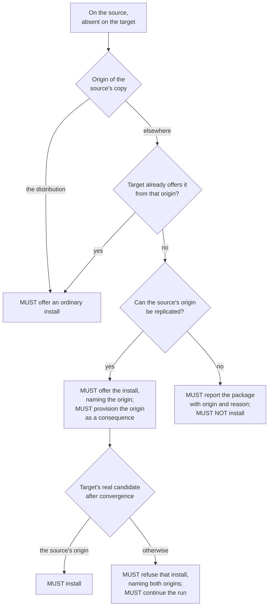

# Package sync conformance criteria

The intent stated in [Package sync — user requirements](package-sync-user-requirements.md), decomposed into individually checkable obligations so an implementation, its tests and its documentation can be verified against them one at a time.

Read that document first. It says what package sync is for and why it behaves as it does, which is what makes these articles cohere; this one is a checklist and is not meant to be read end to end.

Requirement ids are `PKG-FR-*` for obligations and `PKG-NG-*` for non-goals — outcomes the system is required not to attempt. MUST, MUST NOT, SHOULD and MAY carry their usual normative force. How an obligation is met — which command reads what, which file holds it, how a question is worded — is not specified here; that is the specification's job.

## Navigation

- [Package sync — user requirements](package-sync-user-requirements.md) — the intent these articles decompose
- [High level requirements](high-level-requirements.md) — project vision and scope
- [Package sync job behaviour](../jobs/package-sync.md) — operator's guide to the same jobs
- [Package sync specification](../system/package-sync.md) — how these requirements are implemented
- [ADR-020](../adr/adr-020-declarative-package-convergence.md) — the decision record behind the model

Precedence: the user requirements state the intent. Where an article here and that document disagree, the article is wrong and is what gets fixed. Where this document and anything downstream of it — the specification, the job guide, the code, the tests — disagree, this document wins. Section [Where the tool does not yet meet these requirements](#where-the-tool-does-not-yet-meet-these-requirements) records requirements the shipped code knowingly does not meet.

Every article decomposes exactly one section of the user requirements. Each section below names the section it comes from, and [Traceability](#traceability) lists the whole mapping.

## Scope

Decomposes [What package sync is for](package-sync-user-requirements.md#what-package-sync-is-for).

The package jobs — `apt_sync`, `snap_sync`, `flatpak_sync`, `manual_deb_sync`, `manual_installs_sync` — replicate what software is installed. Application data is not theirs.

- **PKG-FR-OPT-IN**: Every package job MUST ship disabled and MUST be enabled individually in configuration.
  Why: enabling one authorises the system to install and remove software on the target.
- **PKG-FR-JOB-INDEPENDENCE**: Each package sync job MUST be enableable, reviewable and failable on its own. Enabling one MUST NOT enable another, and no package sync job's behaviour may depend on whether another package sync job is enabled. What jobs outside package sync do with that information is not this article's business.
- **PKG-FR-JOB-ORDER**: Every package job — the three package managers and the jobs for software none of them can reproduce — MUST run before `folder_sync`, and the system MUST refuse to start when they are ordered otherwise.
  Why: software must exist before data lands on top of it, or an installer's stock defaults overwrite the synced configuration. Software installed by a snippet writes those defaults exactly as a package does.
- **PKG-FR-APT-SCOPE**: `apt_sync` MUST cover the manually-installed apt package set, the repositories and pins that govern where those packages come from, apt's own behavioural configuration, and apt holds. Packages apt installed automatically to satisfy dependencies MUST NOT be items.
- **PKG-FR-SNAP-SCOPE**: `snap_sync` MUST cover installed snaps with their revision, tracking channel, confinement mode and per-snap refresh holds.
- **PKG-FR-FLATPAK-SCOPE**: `flatpak_sync` MUST cover installed flatpak applications per flatpak installation scope, the remotes those applications need, and mask patterns per scope. An application no remote can reproduce (`PKG-FR-FLATPAK-UNREPRODUCIBLE`) is outside that cover.
- **PKG-FR-MANUAL-SCOPE**: What no package manager can reproduce MUST be covered, by one job per kind of finding: `manual_deb_sync` covers apt packages whose installed version comes from no repository the machine has configured, `manual_flatpak_sync` covers flatpak applications whose origin names no remote configured in that application's installation scope, and `manual_installs_sync` covers software under `/usr/local` and `/opt` that no package owns. All three MUST resolve a finding through the one shared registry of install snippets that is the only way such software can be reproduced on the other machine. The filesystem scan MUST cover `/opt`, every entry directly under `/usr/local`, and the entries of `/usr/local`'s `bin`, `sbin`, `lib`, `games` and `src`; it MUST NOT cover `/usr/local`'s `etc`, `include`, `man` or `share`. A finding may be a file, a directory or a symlink; it MUST be named at the path where it was found and MUST NOT be descended into. It is NOT a finding if a package owns it, if it is one of the entries `base-files` creates directly under `/usr/local`, or if it is a directory with no file anywhere beneath it.
  Why the four exclusions: what a hand install puts in `etc`, `include`, `man` or `share` arrives with an application the scan finds elsewhere, so scanning them adds a second finding for software already named once.
  Why a finding is not opened: one application under `/opt` or `/usr/local` is a whole tree, and walking it would ask the user about thousands of files that are one decision.
  Why the `base-files` entries: the distribution creates `/usr/local`'s own subdirectories and no package need own them, so presenting one would ask every user, on every machine, on every run, to write an install snippet for a stock directory whose contents the scan already names one level deeper. Every directory this scan descends into is one of them, so a scanned directory is never a finding of its own scan.
  Why the empty directory: a directory holding no file anywhere beneath it is a leftover shape rather than software, and there is nothing a snippet could reproduce.
- **PKG-FR-DEB-OWNERSHIP**: Software installed from a hand-downloaded `.deb` MUST belong to `manual_deb_sync` alone. `apt_sync` MUST NOT produce an item, a review line or an install for it in any configuration.
  Why: the target's apt has never heard the name; an apt item for it could only fail.
- **PKG-FR-DATA-BOUNDARY**: No package job may sync application data. Data belongs to `folder_sync`.

## Convergence model

Decomposes [The model](package-sync-user-requirements.md#the-model).

- **PKG-FR-SOURCE-INTENT**: The source machine's state MUST be the only statement of intent, and the target MUST NOT decide anything: it answers read-only questions while the change is planned and carries out what was approved. A sync MUST NOT change what software the source has, nor where it gets it from. The writes a sync does make on the source are exactly three, each required by an article of its own: a machine-specific mark, where the source is the holding machine — written, and dropped once the source no longer has the item it names (`PKG-FR-MACHINE-SPECIFIC`, `PKG-FR-MARK-LIFETIME`); a snippet the review authored (`PKG-FR-MANUAL-SAME-RUN`); and the snap refresh pause, which both machines take (`PKG-FR-SNAP-REFRESH-PAUSE`). All three are covered by `PKG-FR-CONFIRM-EACH`.
  Why: the guarantee is about software and its origins, not about the tool's own records — so the three exceptions are named here rather than left to be inferred from the articles that require them.
- **PKG-FR-MANAGER-CONVERGES**: Software MUST be replicated by having the target's own package managers install and remove it. The system MUST NOT copy a package manager's database, store or unpacked files between machines. What is synced is the decision, plus the configuration a manager needs in order to obey it.
- **PKG-FR-APT-IDENTITY**: An apt package MUST be identified by name and origin together. The system MUST NOT satisfy an approved install from an origin the source does not use.
  Why: `gh` from a project's own repository and `gh` from the distribution archive are one name and two different pieces of software.
- **PKG-FR-DISTRO-ORIGIN**: All origins a machine's distribution source files declare MUST count as one origin, computed per machine.
  Why: two machines on different mirrors are not two different origins and must not disagree about every package.
- **PKG-FR-SNAP-IDENTITY**: A snap MUST be identified by name alone, and the system MUST NOT ask the user anything about where a snap comes from.
  Why: one store, and a name resolves to one publisher through an assertion snapd validates itself, so no second build of a name exists to install by mistake.
- **PKG-FR-FLATPAK-IDENTITY**: A flatpak application MUST be identified by its installation scope and its full reference including branch. The same application in two scopes, or on two branches, MUST be treated as two independent items — one install and one removal — and the system MUST NOT normalise the difference away. This identity MUST hold for an application no remote can reproduce as well, so `manual_flatpak_sync` MUST identify one by scope and full reference exactly as `flatpak_sync` does.
  Why the last sentence: user and system are separate installations that can hold the same application from different origins at different versions, so a job that dropped scope would fold two distinct applications into one item.
  Why: two branches of one application can be installed side by side, and the two scopes are configured separately.
- **PKG-FR-FLATPAK-ORIGIN-NOT-IDENTITY**: A flatpak application's origin remote MUST NOT be part of its identity.
- **PKG-FR-VERSION-FLOAT**: For apt and flatpak the system MUST install by name and accept whatever the target's own repositories offer. A version difference MUST be reported and MUST NOT be forced, upgraded or downgraded.
- **PKG-FR-SNAP-REVISION**: For snap the system MUST converge the target to the source's exact revision and tracking channel.
  Why: snap keeps per-user data in revision-numbered directories, so `folder_sync` is only correct when both machines are on the same revision.
- **PKG-FR-BLOCKS-DERIVED**: An apt hold, a snap refresh hold and a flatpak mask MUST each replicate from the source to the target without review, added and removed alike. None of them may be a review item in any direction, and none may be markable machine-specific. Where the software a block applies to is itself an item this run, the block MUST follow that item's own outcome: a block that freezes an installed copy — an apt hold or a snap refresh hold — MUST NOT be registered where that software's install was declined or failed, and MUST be reported as declined rather than as a failure where the user is the one who declined it. A flatpak mask is not such a freeze and MUST land regardless. A machine-specific mark on the software MUST make its blocks inert with it.
  Why: this is `PKG-FR-PIN-ALWAYS`'s treatment of a pin, for `PKG-FR-PIN-ALWAYS`'s reason. A block changes nothing about what software exists, only about what may move, so replicating every one of them costs nothing and cannot get a per-item derivation wrong — while asking about one separately puts a question to the user whose two answers can contradict the answer they gave about the software itself.
  Why no mark: a block is not something anyone holds as a preference about one machine, and a mark on one left the two machines' records disagreeing about software neither would raise again. The mark that does reach it is the one given about the software, which is the thing the user was actually asked about.

## Consent

Decomposes [The model](package-sync-user-requirements.md#the-model); the review mechanics it constrains are in [What happens during a sync](package-sync-user-requirements.md#what-happens-during-a-sync) and [Decisions and their memory](package-sync-user-requirements.md#decisions-and-their-memory-machine-specific).

- **PKG-FR-REVIEW-FIRST**: A job MUST NOT modify the target before the user has approved the changes that job proposes.
- **PKG-FR-ONLY-APPROVED**: A job MUST apply only what the user approved.
- **PKG-FR-BATCHED**: A job's questions MUST come one after another with no work between them. Where the same kind of decision recurs, the items MUST be presented together and be settleable in a single pass; a question that must show the user something before it can be answered MAY be asked on its own. Where `PKG-FR-ASK-AGAIN` permits a job to ask again, that round MUST be batched the same way: the rule binds within a round, not across a run.
  Why: what interrupts the user is work resuming between questions, not their number. Batching constrains when a question is asked, not what shape it takes.
- **PKG-FR-ASK-AGAIN**: A job MAY ask again, including after it has begun changing the target, where the answer it needs rests on facts this run's own changes invalidated or that could not be established before the first change.
  Why: correctness outranks batching, and some things are knowable only once an action has landed. What this permits is a second question, never a queue of them.
- **PKG-FR-CONSENT-BEFORE-CHANGE**: Every consent a job needs for a change MUST be obtained before that change is made.
- **PKG-FR-ASK-ABOUT-SOFTWARE**: The user MUST be asked about software, and MUST NOT be asked separately about machinery whose necessity follows from an approved package: the repository a package comes from, the key that makes that repository trusted, the pin that makes that origin's build win, the remote a flatpak application is installed from.
  Why: the test is derivability. Approving the package answers the question; asking it separately would ask for an answer the user cannot give independently of the package, and the pairing was never expressible — a repository approved without its package does nothing, a package approved without its repository cannot be installed.
- **PKG-FR-ASK-WHEN-NOT-DERIVABLE**: Where the answer does not follow from any approved package, the system MUST ask. Every question this requires is specified below: apt's own behavioural configuration (`PKG-FR-APTCONF`), an unattached Ubuntu Pro target (`PKG-FR-ESM-GATE`), collateral damage to software installed by hand on the target (`PKG-FR-COLLATERAL-MANUAL`), repointing an origin that machine-specific software depends on (`PKG-FR-REPO-CONFLICT`, `PKG-FR-FLATPAK-REPOINT`), deleting a repository or a pin the source does not have (`PKG-FR-REPO-DELETE`, `PKG-FR-PIN-DELETE`), a snippet registry transfer that would lose an entry (`PKG-FR-REGISTRY-CONSENT`), the shape of an unowned `/opt` directory that could be either one application or a publisher's shelf (`PKG-FR-MANUAL-OPT-SHAPE`), and how to reproduce software no manager can (`PKG-FR-MANUAL-RESOLUTION`).
- **PKG-FR-NAME-THE-MACHINES**: Everything the user reads at a question — its title, the item details and warnings shown with it, the question itself and its answers — MUST identify each machine by its hostname, and "source" and "target" MUST NOT appear in any of it. The per-command confirmation is such a question: it MUST name the machine in its heading, which is why the phrase describing the change need not repeat it. Two things are outside this rule: the log, where every record already carries the machine it concerns as a field of its own, and a validation failure, which ends the run before there is anything to decide.
  Why: source and target are roles this run assigns, not names of the user's computers. A line saying "the target loses this package" makes the reader work out which machine that is before they can answer, and the whole point of the question is which of their two machines is affected.
- **PKG-FR-EFFECT-NOT-MECHANISM**: Every answer offered MUST state its own effect on a named machine rather than the mechanism that produces it, and every question MUST state what the change would do before it is answered. The decisions' own names — apply, skip once, skip always — MUST NOT be the words the user reads: an answer MUST be offered as the act it performs, and MUST carry a sentence of its own naming the machine that act happens to and how long the answer lasts, a permanent one saying it will not be asked again.
- **PKG-FR-ANSWERS-AS-A-SET**: The answers to one question MUST read as a set: one grammar across all of them, and the machine named in every answer's sentence or in none.
  Why: a machine named inside one answer, beside answers that name none, reads as though those answers were about something else.
  Why: the user is deciding about their machines, not operating the tool's internals. An answer labelled with the name of an internal concept asks them to translate before they can choose.
- **PKG-FR-REMOVAL-DISTINCT**: Approving the removal of software MUST require a gesture distinct from approving installs, MUST NOT be the default, and MUST be presented so that the user is told the approval deletes something.
- **PKG-FR-SKIP-ONCE**: The user MUST be able to decline any reviewed item for the current run only. Nothing MUST be recorded, and the item MUST be offered again on the next sync.
- **PKG-FR-MACHINE-SPECIFIC**: The user MUST be able to mark a reviewed item as specific to one machine. A marked item MUST NOT be synced to any other machine, MUST NOT be removed or overwritten by a sync from any other machine, and MUST NOT be proposed in any later review: it is protected from every action the tool takes of its own accord. Where an approved change would touch it regardless, the user MUST be asked (`PKG-FR-COLLATERAL-MARKED`). The mark MUST be recorded on the HOLDING MACHINE and MUST NOT be synced. The holding machine is the one whose copy of the item the mark keeps: for an item only one machine has, that machine; for an item both machines have and differ over, the machine that would otherwise have been overwritten. Where either machine could be the holder, a later run MUST read both machines' records before deciding an item is unmarked.
  Why: the holding machine is the one whose state the mark describes, and it is frequently not the machine the sync was launched from. Recording it anywhere else would leave the mark on a machine the item is not on.
  Why both records: an item both machines have has no holder the direction of a run can name, because the machine that recorded the mark takes the other role as soon as the next sync is launched from the other end. Read from one end alone the mark holds in the direction it was given and evaporates in the other.
- **PKG-FR-MARK-LIFETIME**: A machine-specific mark MUST last exactly as long as the item it names is on its holding machine. Once that machine no longer has the item, the mark MUST be dropped, and the run MUST say which marks it dropped. The check MUST be a positive statement that the machine does not have the item, never absence from a narrower inventory the sync derived for its own purposes, and a check that does not answer MUST drop nothing. An item that reappears on that machine afterwards is a new item and MUST be reviewed again.
  Why: a mark keeps the holding machine's own copy of something, so an entry naming something that machine no longer has is keeping nothing. It is not inert either — a mark silences its item in both roles, so a dead one goes on refusing to install that same software on that machine, which is not what the answer that wrote it chose.
  Why the positive check: the inventories a sync builds are narrower than "what the machine has" on purpose — apt's is `apt-mark showmanual` — so a package that is still installed can be missing from one. Dropping a mark on that basis deletes the user's answer about software they still have.
- **PKG-FR-NO-MARK-ON-ORIGIN**: An apt repository and an apt pin MUST NOT be markable machine-specific, whether they are being deleted or overwritten. Declining either MUST record nothing. A flatpak remote is never a review item (`PKG-FR-FLATPAK-REMOTE-DELETE`), so there is nothing to mark.
  Why: a mark would silence a real disagreement between the two machines about where software comes from, permanently and without further mention. Leaving them unmarkable makes that disagreement surface on every run until the user aligns the two machines.
- **PKG-FR-NO-MARK-ON-REPORT**: A report-only finding MUST NOT be markable machine-specific.
  Why: no machine holds a version difference, so there is no holding machine to record it on, and a mark would stop the package syncing rather than stop the report.
- **PKG-FR-NO-MARK-ON-SNAP-REVISION**: A snap's difference of revision or channel MUST NOT be markable machine-specific. It MUST be offered with exactly two answers — converge it, or skip it for this run — and MUST be worded as the effect it has on the named target: the revision or channel its copy is overwritten with. Declining MUST record nothing.
  Why: nobody holds a revision as a standing preference about one machine, so the permanent answer names a decision the user did not make — and the mark left the two machines' records disagreeing about a snap neither would raise again. Skipping for the run says exactly what the user means, and the difference surfaces on the next sync.
- **PKG-FR-ABORT**: The user MUST be able to abort the whole sync at any question, and an abort MUST NOT be read as declining a single item.
- **PKG-FR-CONFIRM-EACH**: Every operation that is not purely read-only MUST be covered by pc-switcher's per-command confirmation, including the decision records, the snippet registry and the snap refresh pause. An operation may bypass it only when it can change no state on the machine — no file content, no process state, no lock or other advisory state, no package-manager database. Running a read under `sudo` does not make it a write: `sudo <read-only command>` is read-only and MUST NOT prompt.
  Why: those three are writes the review never showed as items, so without this they would be the only changes a run makes that the user cannot see coming. Scoping the confirmation to what changes CONTENT is too narrow, and let the `flock` seizing the target's sync lock through ungated: the user approved the holder record written beside it and not the command that took exclusive control of the machine.

## Preconditions and defaults

Decomposes the validation and review paragraphs of [What happens during a sync](package-sync-user-requirements.md#what-happens-during-a-sync).

- **PKG-FR-SUDO-PRECONDITION**: Each package job MUST establish in the validation step that it has passwordless sudo wherever it needs it, and MUST fail validation naming the machine that lacks it rather than degrading. What each needs:

  | | source | target |
  | - | - | - |
  | `apt_sync` | required | required |
  | `snap_sync` | required | required |
  | `flatpak_sync` | none | only where a system-scope item exists on either machine |
  | `manual_deb_sync` | none | none |
  | `manual_installs_sync` | none | none |

  Why: it decides whether the job can run at all, so the user must learn it before the run starts changing things. Degrading is not an option for the source side of apt: without it the `/etc/apt` capture returns empty digests and the run reports success having replicated no repository configuration.
- **PKG-FR-APT-DPKG-LOCK**: `apt_sync` MUST refuse to start while the target's dpkg lock is held, and MUST NOT wait on it silently.
  Why: another package operation is already changing the machine this run is about to change, so a review answered against that machine's state would be answered against state something else is moving.
- **PKG-FR-HARMLESS-DEFAULT**: Every reviewed item's default answer MUST be the action that does no harm — apply for an install, skip for anything that removes or overwrites.
  Why: `PKG-FR-REMOVAL-DISTINCT` covers removals only. Overwriting a configuration file the target holds is equally irreversible and equally must not be the answer a user gets by not choosing.

## apt

### Installing

Decomposes [apt / Installing](package-sync-user-requirements.md#installing).

- **PKG-FR-APT-ORIGIN-DISCLOSURE**: When an approved install would come from anything other than the distribution, the user MUST be told which origin it comes from before approving it.
- **PKG-FR-APT-ORIGIN-DERIVED**: Approving a package MUST carry the repository, key and pins its origin needs, without a separate question and without a further question once they land.
  Why: they are derived from the approval itself, so nothing they change can invalidate the answer that produced them.
- **PKG-FR-APT-ORIGIN-UNREPLICABLE**: Where no repository the source has declares the package's origin, or every repository that declares it names a key the source does not hold, the system MUST report the package with its origin and the reason, MUST NOT install it, and MUST NOT substitute another origin's build.
- **PKG-FR-APT-ORIGIN-VERIFY**: After repository convergence and before the first install, the system MUST verify against the target's own real state that each approved install whose origin on the source is not the distribution's own will come from the source's origin. An install that would not MUST be refused as its own failure naming both origins, and the rest of the run MUST continue.
  Why: this check is the guarantee that `PKG-FR-APT-IDENTITY` holds; everything before it is preparation. It is not redundant with planning — a repository can fail to write, a pin can fail to win, and a distribution epoch can outrank every version an external repository publishes. The distribution is exempt because `PKG-FR-DISTRO-ORIGIN` computes it per machine: without the exemption two machines on different mirrors would fail every package.

### Removing and diverging

Decomposes [apt / Removing a package](package-sync-user-requirements.md#removing-a-package) and [apt / Reporting without acting](package-sync-user-requirements.md#reporting-without-acting).

- **PKG-FR-APT-REMOVE**: A package on the target that the source does not have MUST be offered for removal. Approval MUST remove the package without purging its configuration.
- **PKG-FR-APT-SAME**: A package present on both machines at the same version from the same origin MUST produce no item.
- **PKG-FR-APT-VERSION-DIFF**: A version difference MUST be reported with both versions named and MUST NOT be acted on.
- **PKG-FR-APT-ORIGIN-DIFF**: The same package installed from different origins on the two machines MUST be reported as an origin divergence naming both origins, MUST NOT be converged, and MUST take precedence over any version difference on that package. It MUST NOT be raised for a mirror difference.
  Why: converging it would mean a reinstall from the other origin that the user did not ask for, and builds from two different origins share no version scale.

### Holds

Decomposes [apt / Holds](package-sync-user-requirements.md#holds).

- **PKG-FR-HOLD-WITHOUT-PACKAGE**: An apt hold naming a package that machine does not have MUST end the run, on either machine, before anything is written. The message MUST name every such hold on BOTH machines, MUST attribute each to its machine, and MUST give that machine's own `apt-mark unhold` command; it MUST say the holds have to be cleared before syncing again.
  Why: such a hold freezes nothing while refusing every later attempt to install that name, so it is a bookkeeping failure rather than a state to replicate or protect. It should not exist, it is rare, and carrying logic for it cost more than it was worth. Reporting only the first machine found would make the user clear it, sync again, and only then learn of the second; the commands stay separate because each runs on its own machine. A snap refresh hold cannot reach this state — snapd records one only against an installed snap — and a flatpak mask is a rule about what may be installed rather than a freeze on an installed copy, so neither needs the same treatment.
- **PKG-FR-APT-HELD-TARGET**: A package the target has and holds MUST NOT be proposed for install or upgrade, and MUST produce no package-level item.
  Why: apt refuses to move a held package, so an item proposing it could only fail. The hold itself replicates without a question of its own (`PKG-FR-BLOCKS-DERIVED`), and a hold naming a package the machine does not have ends the run (`PKG-FR-HOLD-WITHOUT-PACKAGE`) rather than being read as state to protect.
- **PKG-FR-APT-HOLD-VERSION**: Where the source holds a package the target lacks, the target MUST be given the source's exact version, not whatever its repositories currently offer. Where that version cannot be obtained on the target, the install MUST fail as its own item naming both versions, and MUST NOT fall back to another version. When the job is done, the package MUST be installed at the source's version and its hold MUST be registered.
  Why: a hold blocks install, upgrade and removal alike (measured on Ubuntu 24.04), so it carries the intent "do not move this off the version that works" as well as "do not lose this", and apt cannot distinguish them. Everywhere else a version floats because the user expressed no preference; a hold is that preference. Installing a different version and then freezing it there is worse than ordinary drift, because nothing will move it again.
- **PKG-FR-APT-HOLD-INERT**: Replicating a hold MUST NOT change the package's version. A hold whose install the user declined — at the review, at a collateral question asked while planning, or at one asked after the run's first change — MUST be reported as declined, not as a failure. A hold MUST fail alone only where its package's install was approved and then failed, or where the run cannot reproduce the repository that package needs.
  Why: a hold carries no version — it freezes whatever is installed on that machine — so what replicates is the intent to freeze. Since versions float, the two machines may end up held at different versions. And a user who declined the package declined its hold with it; calling that a failure asks them to act on their own decision.

### Collateral damage

Decomposes [apt / Collateral damage](package-sync-user-requirements.md#collateral-damage).

- **PKG-FR-COLLATERAL-AUTO**: Collateral removals, downgrades and upgrades that touch only automatically-installed packages MUST proceed without asking, and MUST be named in the run's log.
  Why: that is the target's apt resolving its own dependency graph. Logging it is what keeps a change nobody is asked about from being a change nobody can see.
- **PKG-FR-COLLATERAL-MANUAL**: An approved change MUST NOT remove, downgrade or upgrade a package that is manually installed on the target unless the user has consented to that consequence specifically. Being offered for removal is not that consent: only a removal the user APPROVED may exempt a package from this protection, and one skipped for this run, or marked machine-specific, MUST keep it. The request MUST name the affected package, say why it is protected, and say what the approved change would do to it. The user MUST be able to accept it, to keep the package — leaving the changes that cause the loss unapplied rather than failing later — or to stop the sync, and each of those three MUST state its own effect. The stopping answer MUST say how far it reaches.
  Why: "abort" alone reads as abandoning the question. Stopping here ends the entire sync, not just the package job, and a user who cannot tell those apart cannot choose between them. The protection is also not the machine-specific mark: nobody recorded a preference, the target's own package manager reports that a person asked for the package, and saying otherwise would describe a decision the user never made.
- **PKG-FR-COLLATERAL-MARKED**: Where the collateral package is marked machine-specific, the question MUST say so explicitly. A mark recorded earlier in the same run MUST count.
  Why: nothing else in any review mentions a marked package, which makes this the only line the user ever gets about it, and the mark is why the job would otherwise not be touching it at all.
- **PKG-FR-COLLATERAL-ATTRIBUTION**: Declining collateral MUST cancel only the approved changes whose own transaction causes it, and MUST NOT cancel any other change under review. Where the collateral is caused by a combination of changes and by no single one of them, the whole set MUST be cancelled, and the question MUST say so. A consent MUST be keyed to the consequence it was given for — the change that causes it, what that change does, and the package it happens to — so consenting to one consequence for a package MUST NOT exempt it from another.
  Why: the review's other answers are the user's and were given about other software. A decline that reaches them is a decision the user did not make. One protected package can be the casualty of two different approved changes in one run, and agreeing to lose it once is not agreeing to lose it twice.
- **PKG-FR-COLLATERAL-KEEPS-MARKS**: Cancelling a change on account of declined collateral MUST NOT alter a decision the user gave for that change. A change marked machine-specific MUST still be recorded as such, and a change already declined MUST NOT be re-decided.

### Repositories, keys and pins

Decomposes [apt / Repositories, keys and pins](package-sync-user-requirements.md#repositories-keys-and-pins).

- **PKG-FR-REPO-DERIVED**: The user MUST NOT be asked to add or change a repository. A repository MUST be written to the target only because an approved package comes from it. A repository on the source that feeds no package this run syncs MUST NOT be synced.
- **PKG-FR-REPO-STRANDED**: A repository this run wrote for an install the user then declined MUST NOT be removed. Where no surviving approved install needs it, the run MUST name it by URL as well as by filename and say that nothing on the target installs from it. That MUST NOT be reported as a failure or a warning, and a repository still feeding a surviving approved install MUST NOT be named.
  Why: the write has landed, and undoing it is a change nobody approved — while saying nothing leaves configuration the run added for a package that never arrived. It is not a failure: every item the user decided about ended as they decided.
- **PKG-FR-REPO-OVERWRITE**: A repository present on both machines with differing content MUST be overwritten with the source's version, except as required by `PKG-FR-REPO-CONFLICT`.
- **PKG-FR-REPO-CONFLICT**: Where overwriting would repoint a repository that software the target marked machine-specific depends on, the system MUST obtain consent first, MUST show both machines' versions of the configuration in full, and MUST NOT record the answer. Declining MUST fail every approved package whose origin depended on it, naming them, rather than installing them from elsewhere. The question MUST be raised only for a repository this run writes because an approved package comes from it.
  Why: machine-specific software produces no review line in any run, so nothing else would tell the user its origin was about to move. Ordinary target-only software already has a removal line of its own. A differing file no approved package needs is not written at all (`PKG-FR-REPO-DERIVED`), so there is nothing to consent to — which is what makes this symmetric with `PKG-FR-FLATPAK-REPOINT`.
- **PKG-FR-REPO-DELETE**: A repository present on the target and not on the source MUST NOT be deleted while anything on the target still uses it — counted after this run's approved removals and counting packages the target marked machine-specific — and while that holds it MUST NOT be raised as an item at all. Once nothing uses it, its deletion MUST NOT proceed without explicit approval, and the request MUST name the repository URLs the file declares.
  Why: the packages are the software and the repository is plumbing, so removing the packages is the decision and the repository follows. Machine-specific packages are invisible in the review by design, so a repository feeding one must never become deletable out from under it. The filename alone is not the decision: it is whatever created the file happened to call it, and two machines routinely name the same repository differently, while the URL is what the deletion actually takes away.
- **PKG-FR-DISTRO-FILES**: The distribution's own source files MUST be written when the target lacks them and overwritten when they differ. They MUST NEVER be removed and MUST NEVER be offered for removal.
  Why: they are what defines "the distribution's own origin" on each machine, which is what makes `PKG-FR-DISTRO-ORIGIN` computable.
- **PKG-FR-APT-IGNORES**: Files apt itself does not read MUST NOT be treated as repository configuration, in any of add, change or remove.
- **PKG-FR-KEY-NOT-ITEM**: A signing key MUST NOT be a review item, whether it is being added, refreshed or deleted.
- **PKG-FR-KEY-COPY**: A key the target lacks MUST be copied byte-for-byte from the source before the repository that names it is written, whatever owns it on the source. Keys MUST NEVER be fetched over the network; they are only ever synced from the source machine.
  Why: some projects ship packages carrying both the repository entry and its key; refusing to copy a package-owned key would make such a repository permanently untrustable.
- **PKG-FR-KEY-REFRESH**: A key the target holds with different content MUST be refreshed, except where the target's own distribution packaging owns it, which MUST be left alone. A key that already matches MUST NOT be touched.
  Why: refreshing is what makes a key rotation follow the user even though rotation changes no repository file. Replacing a distribution keyring is not a sync's job.
- **PKG-FR-KEY-CLEANUP**: When the user approves deleting a repository, a repository-specific key that nothing on the target references any more MAY be deleted with it. A key the source still holds MUST NOT be deleted, and keys in the locations that hold ambient or distribution-owned trust MUST NEVER be deleted.
- **PKG-FR-PIN-ALWAYS**: Every pin the source has MUST be replicated to the target, always and without review.
  Why: a pin is what makes an origin's build win, in the same sense a key is what makes a repository trusted, and a pin naming an origin the target does not have does nothing at all — so replicating them all costs nothing and cannot get a per-package derivation wrong.
- **PKG-FR-PIN-DELETE**: A pin present on the target and not the source MUST NOT be deleted without explicit approval, and the request MUST show the file's content in full.
  Why: it is holding one origin above another on a machine the source knows nothing about, and removing it can flip which origin supplies a package at the target's next upgrade. A pin filename names neither the origin it favours nor the priority it gives it, so the file itself is the only thing the decision can rest on — and `PKG-FR-PIN-NOT-INVENTORY` rules out summarising it.
- **PKG-FR-PIN-NOT-INVENTORY**: A pin MUST NOT be read as a statement about the packages it names.
  Why: a machine-wide pin would otherwise report every package on the machine, and would make a target-only package impossible to remove and impossible to silence.
- **PKG-FR-APTCONF**: apt's own behavioural configuration — the settings that govern how apt behaves rather than where packages come from — MUST be reviewed whether it is being added, changed or removed, with the ordinary decision and the permanent machine-specific mark.
  Why: no approved package implies whether such a setting should be synced, so the only honest source of that answer is the user, and it is the kind of standing preference someone genuinely holds per machine.

### Ubuntu Pro and ESM

Decomposes [apt / Ubuntu Pro](package-sync-user-requirements.md#esm-repositories--ubuntu-pro).

- **PKG-FR-ESM-GATE**: Where the source carries ESM repositories that would be written to a target reporting no Ubuntu Pro attachment, the system MUST obtain the user's decision before writing anything and before asking that job's other questions, with exactly two outcomes: attach the target, or skip the apt job for this run while the other jobs proceed. The user MUST be told what to do on the target to attach it.
  Why: an unattached target's metadata refresh succeeds because the ESM indexes are public, so the ESM suites enter candidate selection above the ordinary archive and the failure lands later, at install time, on a package the user will not connect to the sync. The system cannot fix this itself: attaching needs a subscription token or an interactive browser flow, the source's own credentials are root-only and not reusable, and carrying a token would put a secret on a command line.
  Measured, on an attached Ubuntu 24.04 desktop with `esm-apps` and `esm-infra` enabled: 60 of 2297 installed packages resolve their candidate to `esm.ubuntu.com`, among them `ffmpeg`, `gimp`, `imagemagick` and the `libav*` set. The earlier container measurement of zero was an artefact of a container's package set.
- **PKG-FR-ESM-VERIFY**: An answer claiming the target is attached MUST be verified against the target rather than believed, and the user MAY answer it any number of times.
- **PKG-FR-ESM-SKIP-WHOLE-JOB**: Skipping MUST leave the target's apt configuration exactly as it was found, and MUST skip the whole apt job rather than only the ESM repositories.
  Why: pins are always synced (`PKG-FR-PIN-ALWAYS`), so the source's ESM pins would reach a target without the sources they name, leaving a candidate selection matching neither machine. An untouched configuration is a state the user can reason about.
- **PKG-FR-ESM-NO-ASK**: A non-interactive run MUST take the skip and MUST say why. A dry run MUST NOT ask, and MUST warn that a real run would skip the apt job.
  Why: a dry run must not send the user off to attach a machine.
- **PKG-FR-ESM-PRIVACY**: Only whether the target is attached may be logged or shown. Nothing else the attachment check learns, including the subscriber's identity, may leave it.

### Applying

Decomposes [apt / Applying apt's changes](package-sync-user-requirements.md#applying-apts-changes).

- **PKG-FR-APT-CONFIG-ATOMIC**: All repository-configuration changes a run makes MUST be applied as one unit, backed up beforehand, and followed by a single metadata refresh. If that refresh fails, every file the unit touched MUST be restored. Every approved package whose origin depended on the unit MUST then fail, named, and the run MUST continue with the packages that did not.
- **PKG-FR-DERIVED-FAILURE**: A derived write has no item of its own to fail; its failure MUST be charged to every approved package that needed it, naming what failed. Every such package MUST fail, including ones that would otherwise have installed. A package's own failure MUST NOT be charged back to the derived write, nor to the other packages that needed the same one.
  Why: the user decided about a package, not about a file.
- **PKG-FR-DERIVED-VISIBLE**: Every derived write MUST be logged as it lands and MUST appear in a dry run's preview.
  Why: not asking is not the same as hiding.

## snap

Decomposes [snap](package-sync-user-requirements.md#snap).

- **PKG-FR-SNAP-CASES**: A snap on the source only MUST be offered for install at the source's revision and channel; a snap on the target only MUST be offered for removal; a difference of revision or channel MUST be offered as a single change naming both values; identical revision and channel MUST produce no item.
- **PKG-FR-SNAP-CONFINEMENT**: A snap's confinement mode MUST be captured on the source and replicated with the install.
- **PKG-FR-SNAP-REMOVE-SNAPSHOT**: Removing a snap MUST leave snapd's own pre-removal snapshot in place.
- **PKG-FR-SNAP-SIDELOAD**: Sideloaded snaps are out of scope (#221) and MUST be ignored on both machines: never installed, never removed, never offered as an item, and never the subject of a hold item. A run MUST do nothing else about them — it need neither search for them nor name the ones it saw.
  Why: no store can serve such a revision and nothing carries the file between machines, so a snap the tool cannot reinstall must not be one it offers to delete. Handling half of the case, and later handling the other half from a different job, is worse than leaving it alone until the whole case is designed.
- **PKG-FR-SNAP-FAIL-ITEM**: A snap whose revision the target cannot fetch MUST fail as its own item, and the rest of the run MUST continue.
- **PKG-FR-SNAP-HOLD**: A snap refresh hold MUST replicate from the source without review, both when it is added and when it is removed (`PKG-FR-BLOCKS-DERIVED`). A hold recorded for a snap the source no longer has MUST produce nothing, and no command a sync issues may set a standing hold as a side effect.
- **PKG-FR-SNAP-REFRESH-PAUSE**: Automatic snap refreshes MUST be suspended on both machines for the duration of a run and MUST NOT interfere with the run's own revision convergence. Each machine's prior refresh policy MUST be restored afterwards, including an indefinite hold the user set. Where the prior policy cannot be read on a machine, that machine's policy MUST be left untouched. Where the suspension cannot be set or cannot be confirmed, the run MUST say so and MUST continue with that machine unsuspended rather than failing. The suspension MUST expire by itself, so a run that dies without cleaning up MUST NOT leave a machine's automatic refreshes suspended.
  Why: snapd refreshes several times a day and would otherwise move a revision mid-sync. It is a guard against a race, not a precondition: refusing to sync because the guard could not be set costs the user more than the race it prevents.
- **PKG-FR-SNAP-DATA-BOUNDARY**: Data directories of revisions the target's snapd never installed MUST NOT be synced.
  Why: they would leave orphan data behind on the target.

## flatpak

Decomposes [flatpak](package-sync-user-requirements.md#flatpak).

- **PKG-FR-FLATPAK-CASES**: An application on the source only MUST be offered for install; on the target only, for removal; the same application, scope and branch at different versions MUST be reported only; identical MUST produce no item.
- **PKG-FR-FLATPAK-REMOTE-DERIVED**: A remote MUST NOT be a review item when it is added or changed. It MUST be synced because an application approved this run comes from it, including the remote that supplies an approved application's runtime, and declining the application MUST be the only way to decline the remote. A remote that feeds no application approved this run MUST NOT be synced, and no remote is exempt from this rule.
  Why: a fresh flatpak installation configures zero remotes, so there is no "distribution" remote the way apt has a distribution archive.
- **PKG-FR-FLATPAK-REMOTE-FIRST**: Every derived remote MUST be provisioned before the first application installs.
- **PKG-FR-FLATPAK-REMOTE-TRUST**: A remote MUST replicate with its trust, not only its name and URL: whether the source verifies its signatures and, where it does, its signing key, copied byte-for-byte and never fetched over the network. Where the source's trust rests on a machine-level anchor rather than a key of the remote's own, that anchor MUST be copied the same way. A verified remote MUST NOT be replicated as an unverified one; a remote the source itself does not verify MUST be replicated unverified and the user MUST be told. Where the source verifies a remote and holds no key material for it anywhere, the remote MUST be replicated as the source has it, with a warning, and MUST NOT fail the applications that need it.
  Why: without the key a replicated remote is configured but unusable and every install from it fails. The last case is not that: installs from such a remote already fail on the source, so refusing them on the target would report a target failure for a source condition.
- **PKG-FR-FLATPAK-REPOINT**: A remote present on both machines whose URL, verification setting or key differs MUST be repointed in place without a review line and without disturbing the applications that name it as their origin — except where the repoint would move the origin of an application the target marked machine-specific, in which case the system MUST obtain consent first, MUST show both configurations, MUST name the applications that are the reason, and MUST NOT record the answer. Declining MUST fail every approved application that needed the source's URL, citing the decision. A difference of key alone MUST NOT raise the question.
  Why: importing a key can neither move an application's origin nor withdraw trust, since flatpak merges imported keys rather than replacing them.
- **PKG-FR-FLATPAK-REMOTE-DELETE**: A remote MUST NOT be a review item, whether it is being added, changed or deleted. A remote the source does not have MUST be deleted once nothing on the target still uses it, counted after this run's approved removals against what the machine actually has — including applications the target marked machine-specific and applications reported as an origin divergence. While anything still uses it, it MUST NOT be deleted. Deleting a remote MUST take its signing key with it.
  Why: the applications are the software and the remote is plumbing, so removing the applications is the decision and the remote follows. Asking separately let the user delete a remote whose applications are invisible to the review — a machine-specific one, or one reported as an origin divergence — and strand them.
- **PKG-FR-FLATPAK-INSTALL-ORIGIN**: An application MUST be installed from the source's remote or not at all, and the source's remote MUST be identified by its URL and verification setting rather than its name. The system MUST verify this against the target's own state before the install and MUST verify the landed origin after it; either failure MUST fail that application alone, naming both URLs.
  Why: two remotes can share a name and serve different builds of the same application, with success reported either way, and re-adding an existing remote name succeeds without changing where it points — so neither a matching name nor a successful add is evidence.
- **PKG-FR-FLATPAK-MISSING-REMOTE**: An application whose origin remote exists neither on the target nor among this run's own additions MUST be refused as its own item naming the missing remote.
- **PKG-FR-FLATPAK-ORIGIN-DIFF**: The same application, scope and branch installed from different remotes on the two machines MUST be reported as an origin divergence naming both remotes and both URLs, MUST NOT be converged, and MUST take precedence over a version difference on that application. Origins MUST be compared by URL, never by remote name.
  Why: flatpak refuses to install a reference already installed from another remote, so the only mechanical convergence would be uninstalling what the user has and reinstalling it from the other origin.
- **PKG-FR-FLATPAK-REMOTE-FAILURE**: A remote that cannot be provisioned has no item of its own to fail; the failure MUST land on every application that needed it, naming the remote and quoting flatpak's own error.
- **PKG-FR-FLATPAK-FILTER**: A remote the source restricts with a filter MUST be replicated with that filter. The filter file MUST be copied byte-for-byte from the source to the same absolute path on the target and applied to the replicated remote. It is derived like a signing key and MUST NOT be a review item. The filter MUST be in force before the first approved application from that remote installs — the remote is added or repointed, its filter brought to the source's, and only then does anything install from it — and a remote the source does not restrict MUST NOT stay restricted on the target, its filter coming off in that same step. Both clauses reach only the remotes an approved application (or its dependency) needs: a remote no such application needs this run MUST keep whatever filter the target had, since `PKG-FR-FLATPAK-REMOTE-DERIVED` forbids syncing it at all. A filter that cannot be copied, written or applied MUST warn naming the remote and the path, and MUST fail every approved application from that remote. A filtered source remote that does not offer an application the source itself has installed from it MUST end the run, before anything is written; the message MUST name every such application on every filtered remote in both scopes, MUST name each application's remote and filter, and MUST say that either the filter or the application has to be corrected before syncing again. Ending on the first would have the user correct one filter, sync again, and only then learn of the next. What such a remote offers MUST be flatpak's own answer about that remote, never this tool's own reading of a filter file. A remote that will not answer MUST end no run.
  Why: flatpak stores the filter's path rather than its content, so the content is an ordinary file the run can carry byte-for-byte exactly as it carries a signing key; replicating the remote without it silently widens what the target offers.
  Why "does not offer" rather than "denies": the filter's matching rules belong to flatpak, and reimplementing them here would drift from them unannounced the moment flatpak changed one. Flatpak's own listing of a remote applies that remote's filter, but names no cause for a missing application and has no unfiltered counterpart to be compared against, so "the filter denies it" is not a fact this tool can establish while "the remote does not offer it under that filter" is — and it is equally fatal to replicating the two together.
  Why the ordering: a filter taken off for the installs and put back afterwards leaves the remote unfiltered on every run whose re-apply fails, and nothing about replicating the applications requires that window.
  Why the run ends: a filter narrower than the set being replicated does block the installs — measured on Flatpak 1.14.6, installing a reference its remote's filter denies exits 1 with `Nothing matches <id> in remote <remote>` and lands nothing, while the same install of an allowed reference succeeds ([measurements](../adr/considerations/adr-020-flatpak-filter-and-trust-measurements.md)). But that is one machine saying both "install this from there" and "nothing from there may be installed", which is a bookkeeping failure of the same kind as `PKG-FR-HOLD-WITHOUT-PACKAGE`'s: it should not exist, and carrying logic for it costs more than it is worth.
- **PKG-FR-FLATPAK-THIRD-SCOPE**: An installation that is neither the user nor the system one MUST be skipped. Each installation keeps its own remotes, so an application in a skipped installation names only that installation's remotes: a run MUST NOT read or write them, and a same-named remote in the user or system installation is a different remote that such an application never keeps alive.
- **PKG-FR-FLATPAK-MASK**: Mask patterns MUST replicate per scope, added and removed alike, whether or not anything currently matches them, and MUST land after the applications. Editing or moving a pattern MUST be reported as found and MUST NOT be normalised. A mask MUST NOT be a review item in any direction (`PKG-FR-BLOCKS-DERIVED`), and a mask whose application this run removes MUST still be applied.
  Why a mask survives its application's removal: a mask is a rule about what may be installed rather than a freeze on an installed copy, so masking software the machine no longer has is what it is for — which is what separates it from the two holds.
- **PKG-FR-FLATPAK-PRIVILEGE**: A run that touches only the user scope MUST NOT require root on the target.
- **PKG-FR-FLATPAK-UNREPRODUCIBLE**: An installed application whose origin names no remote configured in that application's own installation scope MUST belong to `manual_flatpak_sync` alone. `flatpak_sync` MUST NOT produce an install, a removal or a derived remote for one, on either machine, and MUST NOT report one — except where both machines have the application and only the target's origin is unresolvable, which stays an origin divergence (`PKG-FR-FLATPAK-ORIGIN-DIFF`). The two jobs MUST decide this by one predicate, so that no application can be excluded by one and unclaimed by the other.
  Why: such an application came from a local bundle or from a remote since deleted, so its origin carries nothing the target can fetch from — a derived remote for it can only fail, and a removal would destroy a copy nothing can put back.
  Why the exception: two installed copies produce no install and no removal, so there is nothing for the exclusion to protect, and an origin the target can no longer resolve is exactly the divergence that report exists to name.

## Manual installs

Decomposes [Software no manager can reproduce](package-sync-user-requirements.md#software-no-manager-can-reproduce).

- **PKG-FR-MANUAL-RESOLUTION**: Every detected item MUST end the run in one of exactly three states: reproducible by an install snippet, marked machine-specific, or skipped for this run. Skipping for this run MUST count as a resolution, not as an unresolved state.
- **PKG-FR-MANUAL-DIFF**: Detection MUST run on both machines, and a finding the target already holds MUST NOT be presented. What the target holds is read from the target itself: a package by whether dpkg reports it installed there, whatever origin it came from; a flatpak application by whether flatpak reports it installed there in the same scope, whatever remote it came from; a path by the same scan finding it there. A finding only the target has MUST produce nothing (`PKG-NG-MANUAL-REMOVE`).
  Why: one snippet installs one application and leaves several traces — the tree it unpacks and the symlink that starts it — and each trace is a finding of its own. Presenting the source's findings without asking the target puts every one of them in front of the user again on every later run, however many snippets have already done their work.
- **PKG-FR-MANUAL-OPT-SHAPE**: An unowned entry directly under `/opt` MUST be judged by what it holds. Holding a file of its own, it is the finding. Holding no file and exactly one directory, that directory is the finding. Holding no file and several directories, the system MUST ask the user which of the two shapes it is and MUST NOT decide for them. Holding nothing, it is not a finding. The question MUST be put while the run is planning, since its answer decides what the review lists, and a run with nobody to ask MUST take the entry itself as the finding. Where the same shape is read on the target to decide only whether a finding is already there (`PKG-FR-MANUAL-DIFF`), both readings MUST count as held and nothing MUST be asked.
  Why: `/opt/<application>` and `/opt/<publisher>/<application>` are indistinguishable from outside, and only the user knows whether that directory is one product or a shelf of them. Asking on the target as well would put the same question twice for one fact that changes no item.
- **PKG-FR-MANUAL-SOURCE-DECIDES**: Whether a presented item is reproducible MUST be decided by the source's snippet registry alone. An item with a snippet only on the target MUST still be treated as unresolved. This binds resolution, not detection: which findings exist at all is `PKG-FR-MANUAL-DIFF`'s question.
  Why: the source is the machine in charge of the run, and its registry reaches the target in that same run or the run ends (`PKG-FR-REGISTRY-CONSENT`) — so a snippet the target holds and the source does not exists only in the window before that transfer, and reading it would resolve an item by a recipe the machine being replicated never had.
- **PKG-FR-MANUAL-SAME-RUN**: A snippet authored during a review MUST be persisted, transferred and replayed in the same run.
- **PKG-FR-SNIPPET-VERBATIM**: A snippet MUST be stored and replayed exactly as captured; the only edit permitted anywhere is stripping the whitespace surrounding the body, and it MUST happen at capture, so the stored bytes and the replayed bytes are one string. The system MUST NOT parse, interpret or reason about it. It MUST run as the target user with no privilege added around it, and MUST run without standing input so that a command expecting input fails rather than hanging the sync. An empty snippet MUST NOT be accepted as a resolution.
- **PKG-FR-REGISTRY-SYNCS**: The snippet registry MUST sync between machines.
  Why: how to install something is knowledge about the software, not about the machine — unlike the machine-specific marks of `PKG-FR-MACHINE-SPECIFIC`, which are never synced.
- **PKG-FR-REGISTRY-CONSENT**: A registry transfer that would lose or change an entry the target holds MUST NOT proceed without consent, and MUST name the affected entries. Declining MUST abort the run, and a non-interactive run MUST abort. A registry file that cannot be parsed, on either machine, MUST abort the run in the same way, naming the file and saying that it must be repaired before the next sync; it MUST NOT be read as holding no snippets. That abort MUST name every entry of the file it could not read, and where both machines' copies are unparsable it MUST name both — the repair is a hand edit, and one instance at a time makes it take one sync each. An absent or empty registry is ordinary data and does mean no snippets.
  Why: aborting lets the user consolidate the two registries by hand; the alternative silently drops the target's snippets. An unreadable file says nothing about which entries exist, so the comparison this article rests on cannot be made at all — and the reading that costs least to implement, "no snippets", is exactly the one that makes a wholesale push discard every entry nobody could see. Ending the run rather than failing the job is what puts the repair in front of the user before anything else in the sync depends on it.
- **PKG-FR-MANUAL-FAIL-ITEM**: A snippet that has vanished between planning and replay, or whose replay fails, MUST fail as its own item naming the item, and the run MUST continue.

## Reporting, failure and the dry run

Decomposes [When something goes wrong](package-sync-user-requirements.md#when-something-goes-wrong) and the dry-run and no-terminal paragraphs of [What happens during a sync](package-sync-user-requirements.md#what-happens-during-a-sync).

- **PKG-FR-OUTCOME-SUCCESS**: A job MUST report success when every item it presented received an answer and the job did what those answers said — including when it presented nothing because the target already matches, and including when every answer was to decline.
  Why: declining is an answer. A job whose review was put to the user and settled did its work, whatever the settlement was.
- **PKG-FR-OUTCOME-SKIPPED**: A job that could not put its review to the user, or that ended before it had one, MUST report skipped rather than success, MUST say why, MUST record no decision, MUST transfer no registry and MUST leave the target untouched. The run MUST continue and the exit code MUST be unaffected.
  Why: skipped means nobody decided, which is what separates a run the user answered "no" to from one where the question was never put. The two cases are a run with no terminal whose review held something to decide (`PKG-FR-NO-TERMINAL`) and the apt job an unattached target ends (`PKG-FR-ESM-SKIP-WHOLE-JOB`). A review holding nothing to decide is neither: there was no question to put.
- **PKG-FR-OUTCOME-FAILED**: A job MUST report failure when at least one approved item could not be applied. Every approved item MUST be attempted, failures MUST be collected and reported together naming each item, one failed item MUST NOT block the rest of its job, and one failed job MUST NOT stop the others.
- **PKG-FR-NO-TERMINAL**: A non-interactive run — one with no interactive terminal — MUST ask nothing and MUST leave every item that needed a decision skipped for this run. What counts is whether the user had something to decide, not whether they were shown something: a finding that is reported rather than asked about is not an item that needed a decision. A package job whose review held at least one item that did MUST report skipped; a job whose review held none reports success (`PKG-FR-OUTCOME-SUCCESS`), whether it presented nothing at all or nothing but report-only findings. Nothing may be recorded and no snippet written. No registry may be transferred either, on the success outcome as much as the skipped one.
  Why the registry: the file on disk holds the snippets of every earlier run, so pushing it over the target's copy is a change of the target, and this run has nobody's answer for it. Without the clause the success outcome would be the one case where a run with nobody present still changed the other machine.
- **PKG-FR-DRY-RUN**: A dry run MUST produce the same plan and the same review as a real run and MUST issue no command that changes either machine. The preview MUST include the derived changes that have no review line of their own. A dry run on a terminal MUST report success; without one it MUST report skipped, for the same reason a real run does.
- **PKG-FR-READ-FAILS-JOB**: A read a job's findings rest on that cannot be answered at all MUST fail its own job, naming the command that did not answer, and MUST NOT stop the run's other jobs. This covers the scans a job runs itself as well as the package managers it queries. Silence MUST NOT be read as an empty installed set or an empty scan. An empty answer is ordinary data.
  Why: reading silence as "this machine has nothing installed" would propose removing everything the other machine has, and reading a dead scan as "everything here is unowned" would ask the user to write an install snippet for every entry under it.
- **PKG-FR-LOG-DECISIONS**: A run's log MUST name every item a job presented together with the decision it received, and every change a package manager made on its own behalf that no review showed.
  Why: the report says what a job did; the log is where the user reconstructs why, including the changes that were never theirs to approve.
- **PKG-FR-LOG-ACTIONS**: A run's log MUST name every item a job applied, one line per item, saying what was done, to what, by which manager and on which machine. This holds for every package job and is in addition to the counts the job reports.
  Why: the decision line says what was answered, the counts say how many changes landed, and the verbatim trace is the package manager's own words — none of them says that this item was converged. Without the line, software that appeared on the other machine is findable only by recognising the command that put it there.
- **PKG-FR-LOG-VERBATIM**: A package manager's own output MUST be kept verbatim in the debug log, subject to `PKG-FR-ESM-PRIVACY` and `PKG-FR-CREDENTIAL-PRIVACY`.
- **PKG-FR-CREDENTIAL-PRIVACY**: A credential embedded in a URL MUST be withheld wherever the system logs that URL or puts it in front of the user — a log line, a command trace, a package manager's output, a review item, a configuration file displayed in full for a decision, and an install snippet's body displayed for one. What is withheld is the URL's `userinfo` as RFC 3986 defines it, so no character that grammar permits may end the withholding early. This binds the display alone: what is stored and replayed stays exactly as written (`PKG-FR-SNIPPET-VERBATIM`).
  Why: a private or commercial repository carries its credential in its own address, so the URL is the secret. A log file is readable by anyone with an account on the machine that wrote it. Redacting what is stored or replayed would instead break the install the snippet exists to reproduce.
- **PKG-FR-FAIL-NAMED**: Every failure MUST name the item, package or file it concerns.

## Non-goals and accepted costs

Decomposes [What this deliberately does not do](package-sync-user-requirements.md#what-this-deliberately-does-not-do).

Each of these is a real cost, given up knowingly.

- **PKG-NG-APT-LINE-CONTROL**: The target's apt configuration is not under the user's line-by-line control. Repositories, keys and pins appear because a package was approved, and declining the package is the only way to decline them.
- **PKG-NG-APT-IDENTICAL**: The two machines' apt configurations are converged for what packages need, not made identical.
- **PKG-NG-PIN-LOCAL**: A pin cannot be kept on one machine only. It returns on every sync until it is deleted on the source.
- **PKG-NG-BLOCK-LOCAL**: A hold or a mask cannot be kept on one machine only. Like a pin, it replicates from the source until the source drops it.
- **PKG-NG-SNAP-REVISION-LOCAL**: A snap's revision cannot be kept on one machine only. The difference is offered on every sync until the two machines agree.
- **PKG-NG-SNAP-ORIGIN**: snap has no origin model and needs none.
- **PKG-NG-ESM-PARTIAL**: A target with no Ubuntu Pro attachment costs the whole apt job for that run, not only the ESM repositories.
- **PKG-NG-MARK-ORIGIN**: Deleting an apt configuration file can be marked machine-specific; deleting an apt repository, an apt pin or a flatpak remote cannot.
- **PKG-NG-MANUAL-REMOVE**: Manual installs cannot be removed. The target is read only to tell what it already holds (`PKG-FR-MANUAL-DIFF`), and software only the target holds produces no item, no removal and no report; nothing records what a snippet put there.
- **PKG-NG-VERSION-CONVERGE**: Version drift is reported, never resolved, for apt and flatpak. Aligning two machines' versions is the user's job.
- **PKG-NG-ORIGIN-CONVERGE**: A divergence of origin is reported, never resolved, for apt packages and flatpak applications alike. Where both machines have the same software from different origins, the system will not pick one.
- **PKG-NG-UNATTENDED**: A package job's review cannot be answered by a non-interactive run. There is no file of standing answers and no assume-yes option.
- **PKG-NG-MARK-PORTABILITY**: Machine-specific marks are per manager and per machine and are deliberately never synced. A new machine means deciding again.
- **PKG-NG-AUTOMATION-ENV**: The environment variable `PCSWITCHER_PACKAGE_REVIEW_AUTOMATION` answers a package review from a JSON map of item id to decision, and its answers count as the user's own — a permanent one writes a machine-specific mark. It cannot write an install snippet: authoring one takes an editor, so the map has no way to express it and an unreproducible item answered permanently through the variable is marked, never made reproducible. It exists for the integration tests, which have no terminal to answer at, and MUST stay out of `--help` and the configuration schema so nothing offers it as a way of running the tool. Anything able to set it in the environment of a real run therefore gets silent, unreviewed, permanent decisions. This is the accepted cost of testing the review at all; `PKG-NG-UNATTENDED` still holds for every documented path.

## Where the tool does not yet meet these requirements

Read against the code at `c6e4bf33`; articles untouched since `502321ec` were last read there. Below is every article not met in full, and every cost knowingly accepted in meeting one; every other article was found satisfied. Evidence is symbol names, because the code moves.

### flatpak

- **PKG-FR-FLATPAK-REMOTE-TRUST** is met except where the source verifies a remote and holds no key material for it anywhere — neither a keyring of the remote's own, nor an ostree `gpgkeypath` naming one, nor a machine-level anchor `FlatpakSyncJob._stage_source_keys` can find. `_warn_about_trust` provisions the remote as the source has it and warns; installs from it will fail the signature check on the target as they already do on the source. Accepted, and stated by the article.

## Traceability

Every article above decomposes exactly one section of [Package sync — user requirements](package-sync-user-requirements.md). 138 articles: every one has a section, and every section that imposes obligations has articles. A new article needs a home here; a narrative section with no articles is either intentionally non-normative or a coverage gap.

| User-requirements section | Articles | |
| - | - | - |
| [What package sync is for](package-sync-user-requirements.md#what-package-sync-is-for) | 8 | `PKG-FR-OPT-IN` `PKG-FR-JOB-INDEPENDENCE` `PKG-FR-JOB-ORDER` `PKG-FR-APT-SCOPE` `PKG-FR-SNAP-SCOPE` `PKG-FR-FLATPAK-SCOPE` `PKG-FR-MANUAL-SCOPE` `PKG-FR-DATA-BOUNDARY` |
| [The model](package-sync-user-requirements.md#the-model) | 18 | `PKG-FR-SOURCE-INTENT` `PKG-FR-MANAGER-CONVERGES` `PKG-FR-APT-IDENTITY` `PKG-FR-DISTRO-ORIGIN` `PKG-FR-SNAP-IDENTITY` `PKG-FR-FLATPAK-IDENTITY` `PKG-FR-FLATPAK-ORIGIN-NOT-IDENTITY` `PKG-FR-VERSION-FLOAT` `PKG-FR-SNAP-REVISION` `PKG-FR-BLOCKS-DERIVED` `PKG-FR-REVIEW-FIRST` `PKG-FR-ONLY-APPROVED` `PKG-FR-BATCHED` `PKG-FR-ASK-AGAIN` `PKG-FR-CONSENT-BEFORE-CHANGE` `PKG-FR-ASK-ABOUT-SOFTWARE` `PKG-FR-ASK-WHEN-NOT-DERIVABLE` `PKG-FR-REMOVAL-DISTINCT` |
| [What happens during a sync](package-sync-user-requirements.md#what-happens-during-a-sync) | 14 | `PKG-FR-NAME-THE-MACHINES` `PKG-FR-EFFECT-NOT-MECHANISM` `PKG-FR-ANSWERS-AS-A-SET` `PKG-FR-ABORT` `PKG-FR-CONFIRM-EACH` `PKG-FR-NO-TERMINAL` `PKG-FR-DRY-RUN` `PKG-FR-LOG-DECISIONS` `PKG-FR-LOG-ACTIONS` `PKG-FR-LOG-VERBATIM` `PKG-FR-CREDENTIAL-PRIVACY` `PKG-FR-SUDO-PRECONDITION` `PKG-FR-APT-DPKG-LOCK` `PKG-FR-HARMLESS-DEFAULT` |
| [Decisions and their memory](package-sync-user-requirements.md#decisions-and-their-memory-machine-specific) | 6 | `PKG-FR-SKIP-ONCE` `PKG-FR-MACHINE-SPECIFIC` `PKG-FR-MARK-LIFETIME` `PKG-FR-NO-MARK-ON-ORIGIN` `PKG-FR-NO-MARK-ON-REPORT` `PKG-FR-NO-MARK-ON-SNAP-REVISION` |
| [apt / Installing](package-sync-user-requirements.md#installing) | 5 | `PKG-FR-DEB-OWNERSHIP` `PKG-FR-APT-ORIGIN-DISCLOSURE` `PKG-FR-APT-ORIGIN-DERIVED` `PKG-FR-APT-ORIGIN-UNREPLICABLE` `PKG-FR-APT-ORIGIN-VERIFY` |
| [apt / Removing a package](package-sync-user-requirements.md#removing-a-package) | 1 | `PKG-FR-APT-REMOVE` |
| [apt / Reporting without acting](package-sync-user-requirements.md#reporting-without-acting) | 3 | `PKG-FR-APT-SAME` `PKG-FR-APT-VERSION-DIFF` `PKG-FR-APT-ORIGIN-DIFF` |
| [apt / Holds](package-sync-user-requirements.md#holds) | 4 | `PKG-FR-HOLD-WITHOUT-PACKAGE` `PKG-FR-APT-HELD-TARGET` `PKG-FR-APT-HOLD-VERSION` `PKG-FR-APT-HOLD-INERT` |
| [apt / Collateral damage](package-sync-user-requirements.md#collateral-damage) | 5 | `PKG-FR-COLLATERAL-AUTO` `PKG-FR-COLLATERAL-MANUAL` `PKG-FR-COLLATERAL-MARKED` `PKG-FR-COLLATERAL-ATTRIBUTION` `PKG-FR-COLLATERAL-KEEPS-MARKS` |
| [apt / Repositories, keys and pins](package-sync-user-requirements.md#repositories-keys-and-pins) | 15 | `PKG-FR-REPO-DERIVED` `PKG-FR-REPO-STRANDED` `PKG-FR-REPO-OVERWRITE` `PKG-FR-REPO-CONFLICT` `PKG-FR-REPO-DELETE` `PKG-FR-DISTRO-FILES` `PKG-FR-APT-IGNORES` `PKG-FR-KEY-NOT-ITEM` `PKG-FR-KEY-COPY` `PKG-FR-KEY-REFRESH` `PKG-FR-KEY-CLEANUP` `PKG-FR-PIN-ALWAYS` `PKG-FR-PIN-DELETE` `PKG-FR-PIN-NOT-INVENTORY` `PKG-FR-APTCONF` |
| [apt / Ubuntu Pro](package-sync-user-requirements.md#esm-repositories--ubuntu-pro) | 5 | `PKG-FR-ESM-GATE` `PKG-FR-ESM-VERIFY` `PKG-FR-ESM-SKIP-WHOLE-JOB` `PKG-FR-ESM-NO-ASK` `PKG-FR-ESM-PRIVACY` |
| [apt / Applying apt's changes](package-sync-user-requirements.md#applying-apts-changes) | 3 | `PKG-FR-APT-CONFIG-ATOMIC` `PKG-FR-DERIVED-FAILURE` `PKG-FR-DERIVED-VISIBLE` |
| [snap](package-sync-user-requirements.md#snap) | 8 | `PKG-FR-SNAP-CASES` `PKG-FR-SNAP-CONFINEMENT` `PKG-FR-SNAP-REMOVE-SNAPSHOT` `PKG-FR-SNAP-SIDELOAD` `PKG-FR-SNAP-FAIL-ITEM` `PKG-FR-SNAP-HOLD` `PKG-FR-SNAP-REFRESH-PAUSE` `PKG-FR-SNAP-DATA-BOUNDARY` |
| [flatpak](package-sync-user-requirements.md#flatpak) | 15 | `PKG-FR-FLATPAK-CASES` `PKG-FR-FLATPAK-REMOTE-DERIVED` `PKG-FR-FLATPAK-REMOTE-FIRST` `PKG-FR-FLATPAK-REMOTE-TRUST` `PKG-FR-FLATPAK-REPOINT` `PKG-FR-FLATPAK-REMOTE-DELETE` `PKG-FR-FLATPAK-INSTALL-ORIGIN` `PKG-FR-FLATPAK-MISSING-REMOTE` `PKG-FR-FLATPAK-ORIGIN-DIFF` `PKG-FR-FLATPAK-REMOTE-FAILURE` `PKG-FR-FLATPAK-FILTER` `PKG-FR-FLATPAK-THIRD-SCOPE` `PKG-FR-FLATPAK-MASK` `PKG-FR-FLATPAK-PRIVILEGE` `PKG-FR-FLATPAK-UNREPRODUCIBLE` |
| [Software no manager can reproduce](package-sync-user-requirements.md#software-no-manager-can-reproduce) | 9 | `PKG-FR-MANUAL-RESOLUTION` `PKG-FR-MANUAL-DIFF` `PKG-FR-MANUAL-OPT-SHAPE` `PKG-FR-MANUAL-SOURCE-DECIDES` `PKG-FR-MANUAL-SAME-RUN` `PKG-FR-SNIPPET-VERBATIM` `PKG-FR-REGISTRY-SYNCS` `PKG-FR-REGISTRY-CONSENT` `PKG-FR-MANUAL-FAIL-ITEM` |
| [When something goes wrong](package-sync-user-requirements.md#when-something-goes-wrong) | 5 | `PKG-FR-OUTCOME-SUCCESS` `PKG-FR-OUTCOME-SKIPPED` `PKG-FR-OUTCOME-FAILED` `PKG-FR-READ-FAILS-JOB` `PKG-FR-FAIL-NAMED` |
| [What this deliberately does not do](package-sync-user-requirements.md#what-this-deliberately-does-not-do) | 14 | `PKG-NG-APT-LINE-CONTROL` `PKG-NG-APT-IDENTICAL` `PKG-NG-PIN-LOCAL` `PKG-NG-BLOCK-LOCAL` `PKG-NG-SNAP-REVISION-LOCAL` `PKG-NG-SNAP-ORIGIN` `PKG-NG-ESM-PARTIAL` `PKG-NG-MARK-ORIGIN` `PKG-NG-MANUAL-REMOVE` `PKG-NG-VERSION-CONVERGE` `PKG-NG-ORIGIN-CONVERGE` `PKG-NG-UNATTENDED` `PKG-NG-MARK-PORTABILITY` `PKG-NG-AUTOMATION-ENV` |

It also runs the other way: an article can state an obligation its section deliberately does not spell out. Such an article is not an orphan, and the remedy is never to add the sentence back. Each one below makes explicit something the narrative implies rather than adding a rule of its own:

- `PKG-FR-OPT-IN` shipping disabled — the narrative says enabling a job is what authorises it to install and remove software, which is only true of one that ships disabled.
- `PKG-FR-JOB-ORDER`'s refusal to start — the narrative makes the ordering a must; refusing is the only thing that holds it.
- `PKG-FR-SNAP-SCOPE` and `PKG-FR-SNAP-CONFINEMENT` — a classic snap cannot be installed without saying so, so replicating the install replicates the confinement.
- `PKG-FR-SNAP-DATA-BOUNDARY` — the narrative gives "folder sync can only mirror that data correctly when both machines are on the same revision" as the reason for converging revisions; this is that condition stated as an obligation.
- `PKG-FR-FLATPAK-MASK`'s report-as-found rule — "added and removed alike" is exhaustive, so an edited pattern is a removal and an addition, and there is no third thing to normalise.
- `PKG-FR-SNIPPET-VERBATIM` refusing an empty snippet — a real requirement, and too obvious to spend the narrative reader's attention on.
- `PKG-FR-DRY-RUN`'s outcome — without it the outcome articles leave a dry run undefined, and "skipped" would be a defensible reading of a run that did exactly what was asked.
- `PKG-FR-SUDO-PRECONDITION`'s table — the narrative states the precondition; which machine each job needs it on is the checkable form.

One narrative section carries no articles, deliberately. [Vocabulary](package-sync-user-requirements.md#vocabulary) defines terms rather than imposing obligations — but it is what makes the articles unambiguous, so an article that cannot be stated in its vocabulary is an article to rewrite.
