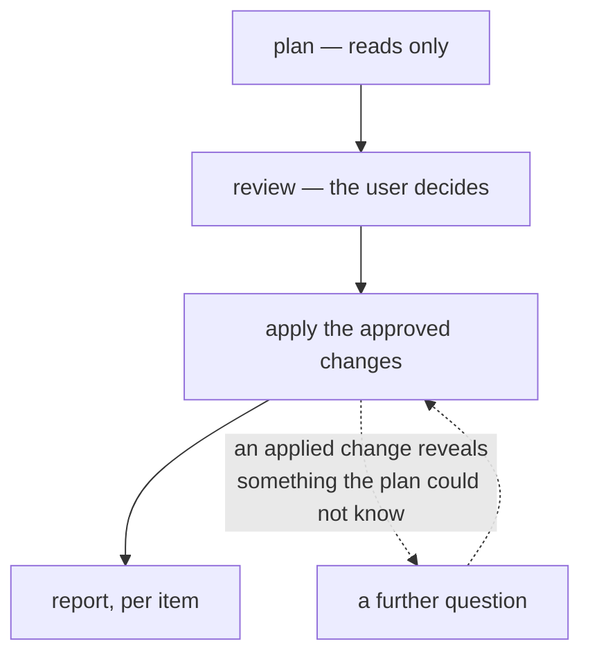

# Package sync — user requirements

What package synchronisation is for, and the non-goals it accepts. This document states intent at a level a product owner reads end to end. The checkable behaviour lives in [`docs/system/package-sync.md`](../system/package-sync.md); the user-facing walkthrough lives in [`docs/jobs/package-sync.md`](../jobs/package-sync.md).

Where this document and either of those disagree, the specification is authoritative and this document is what gets fixed.

## What package sync is for

Work on one machine, sync, resume on the other. That only works if the software is there: a synced home directory on a machine without the applications gives configuration for programs that will not start.

Package sync replicates *what software is installed*. Application data belongs to folder sync, which must run after it: installing writes stock defaults that must land before the user's synced settings go on top.

It replicates by **convergence, not by copying**. Both machines' package managers are asked what they have; the difference is what the sync acts on. No package database, store or installed file is copied between machines.

Seven jobs total: three per package manager (apt, snap, flatpak), plus four for software no manager can reproduce (hand-installed `.deb` packages, sideloaded snaps, flatpak applications no remote can supply, and unowned software under `/usr/local` and `/opt`). Each is enabled, reviewed and can fail on its own. Enabling one authorises pc-switcher to install and remove software on the target.

## Vocabulary

**Source** and **target** are per-run roles. The sync is launched on the source; the target is the machine being changed. The next run may swap them.

**The holding machine** is the machine that has the item being decided about — the source for something it has and the target lacks, the target for something only the target has.

An **item** is one thing the user can be asked about: a package, a snap, a flatpak application, a configuration file. Its identity is stable across runs, so a decision about it can be remembered.

A **decision** is the user's answer about an item: apply it, skip it this run, or always skip it in future runs.

**Machine-specific** describes an item marked "always skip". The job never touches that item again on that machine of its own accord, whichever machine the sync runs from — it is neither sent to the other machine nor changed by it. Where an approved change would touch it anyway, the user is asked first.

**Derived** describes plumbing that is synced because approved software needs it — a repository, its signing key, a pin, a flatpak remote, a block. Never a question of its own.

A **block** is a standing refusal to let software move: an apt hold, a snap refresh hold, a flatpak mask.

An **origin** is where software actually comes from — a repository or remote URL. Not its name: two remotes can share a name and serve different builds.

A **snippet** is a shell recipe, written once, for software no package manager can install.

## The model

**A sync goes one way, from source to target.** The source's installed state is what will be replicated on the target.

**Identity includes the origin.** `gh` from GitHub's repository and `gh` from Ubuntu's archive share a name and are different software. A package is installed on the target from the same origin it has on the source.

**The user is asked about software; the plumbing is derived.** Approving a package also approves the repository it comes from — a repository without its package does nothing, and a package without its repository cannot be installed. A block is plumbing too: it changes nothing about what software exists, only about what may move, so it follows the software it applies to rather than being asked about.

**Consent precedes every change.** Nothing is written to the target before the user has approved the changes that job proposes.

Where an answer follows from something already approved, it is not asked again. Where it does not, it is asked.

Questions are **batched**: repeated decisions of one kind come as one list, settled in a single pass with no work between them. Batching is about when the questions come, not one shape for every item.

Applying an approved change can reveal something the plan could not know. A further question is then correct.

Approving a removal takes a gesture distinct from approving an install, and is never the default.

**A failure lands on the package it concerns**, or on the configuration item itself where no package is involved. Every approved item is attempted and every failure is named. If a pin, repository or key fails to land, the packages that needed it fail with it, rather than being installed from whatever origin the machine would otherwise use.

## Decisions and their memory

The three-way decision — apply, skip once, always skip — carries different weight. "Always skip" writes a mark that outlives the run, on the machine whose copy the mark keeps. Marks are per-manager and per-machine and are deliberately never synced.

Where a markable item is on both machines with copies that differ, either copy can be the one worth keeping. The user is asked whose own version this is — one machine, the other, or each machine's own. Naming both records one on each.

A mark lasts as long as the software it protects. Once the holding machine no longer has that software, the mark is dropped: leaving it would refuse to install that software there ever again.

Not every item is markable. Repositories, pins and flatpak remotes cannot be marked — a mark would silence a real disagreement about where software comes from. A snap's revision cannot be marked either — nobody holds a revision as a standing preference per machine.

## What this deliberately does not do

Each of these is a real cost, given up knowingly.

- **The target's apt configuration is not under line-by-line control.** Repositories, keys and pins appear because a package was approved.
- **A pin, hold or mask cannot be kept on one machine only.** They replicate from the source every run until the source drops them.
- **A snap's revision cannot be kept on one machine only.** The difference is offered every run until the two machines agree.
- **Version drift and origin divergence are reported, never resolved**, for apt and flatpak. Aligning the two machines is the user's job.
- **What a hand-installed item actually contains is never compared.** Convergence is the version string, so a copy that is corrupt or half-applied at an unchanged version is invisible.
- **Removing a hand-installed item reaches only what was named.** Nothing records where else its recipe wrote, so a launcher or a symlink it left elsewhere stays.
- **A target with no Ubuntu Pro attachment costs the whole apt job for that run**, not just the ESM files.
- **A non-interactive run can answer no ordinary review.** There is no file of standing answers and no assume-yes option; the only unattended path is the two apply flags on the command line, per direction, for that one run.
- **Machine-specific marks are per job, per machine, and never synced.** A new machine means deciding on what's specific for that machine.
- **An environment variable can answer a review, and its answers count as the user's own.** `PCSWITCHER_PACKAGE_REVIEW_AUTOMATION` exists so the integration tests can answer one; it appears in no help text and no configuration key. Anything able to set it on a real run gets silent, unreviewed, permanent decisions.
