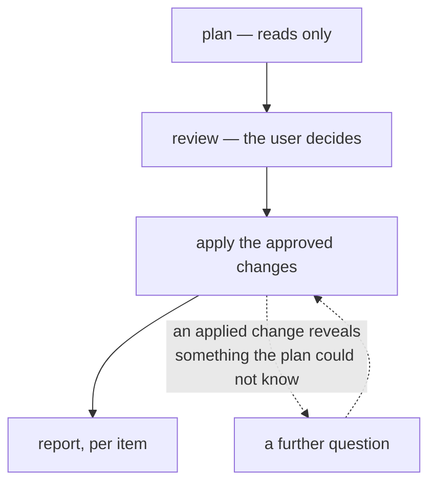
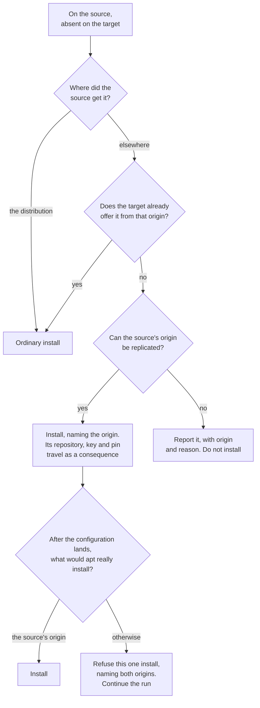

# Package sync — user requirements

What package synchronisation is for, how it decides what to do, and what it asks the user. Written to be read end to end: someone who finishes it should be able to predict what the tool does in a situation this document never mentions.

## Navigation

- [High level requirements](high-level-requirements.md) — project vision and scope; this document elaborates "installed packages must sync"
- [Package sync conformance criteria](package-sync-conformance-criteria.md) — the same requirements of this document, decomposed into individually checkable obligations, for reviewing an implementation against
- [Package sync job behaviour](../jobs/package-sync.md) — user guide
- [ADR-020](../adr/adr-020-declarative-package-convergence.md) — the decision record behind the model

This document states the intent. Where it and any other document disagree, this one is right and the other needs fixing.

## What package sync is for

The user works on one machine, syncs, and resumes on the other. That only works if the software is there. Syncing a home directory onto a machine that lacks the applications gives configuration files for programs that will not start, dotfiles for shells that are not installed, and project directories that cannot be built.

So package sync replicates *what software is installed*. It does not replicate application data — that is folder sync's job. Folder sync must run after package sync: installing software writes that software's own stock defaults, and those defaults must land before the user's synced settings go on top of them. Get that order wrong and every package synced silently overwrites the user's configuration with the packaged one.

It replicates by **convergence, not by copying**. Nothing reads or writes another machine's package database or installed software. What travels between the machines is a decision — "install this", "remove that" — plus the minimum configuration the target's own `apt`, `snap` or `flatpak` needs in order to carry it out. The target's package managers stay in charge of their own state, which is what keeps the target a working machine rather than one carrying another machine's bookkeeping.

Package sync is opt-in per job. Nothing here runs unless the user enables it, because enabling it authorises pc-switcher to install and remove software on the other machine. apt packages can be synced without snaps, or flatpaks and nothing else. Each job is independently enableable, independently reviewed, and independently able to fail without taking the others down.

## Vocabulary

These words are used precisely throughout. Most of the ambiguity in earlier drafts came from not having them.

**Source** and **target** are per-run roles, not machines. The sync is launched on the source; the target is the machine being changed. The next run may swap them.

**The holding machine** is the machine that *has* the thing being decided about. For something the source has and the target lacks, the source holds it. For something only the target has, the target holds it. This is not the same as "the machine the user is sitting at" — the user is always at the source, but the holding machine is frequently the target. It matters because permanent decisions are stored on the holding machine.

An **item** is one thing the user can be asked about: a package, a snap, a flatpak application, an apt hold, a flatpak mask, a configuration file. Every item has a stable identity that survives across runs, which is what lets a decision about it be remembered.

A **diff** is one item's difference between the two machines, together with what would be done about it — install, remove, change, or merely report.

A **decision** is the user's answer to a diff: apply it, skip it this once, or always skip it on the holding machine.

**Derived mechanism** is plumbing that travels because something the user approved needs it, and is therefore never a question of its own: the repository a package comes from, the signing key that makes that repository trusted, the pin that makes one origin's build win, the remote a flatpak application installs from.

An **origin** is where a piece of software actually comes from — a repository URL, a flatpak remote's URL. Not its name: two remotes can share a name and serve builds from different projects.

**Machine-specific** describes an item the user has marked as belonging to one machine only: it is not synced to other machines, and it is not removed or overwritten by syncs from other machines. It is protected from any action by pc-switcher.

A **snippet** is a shell recipe written once for software no package manager can install, stored and replayed verbatim.

**Flatpak scope** is the user or system flatpak installation. **Snap revision** and **snap channel** are the exact build and the update track. The `flatpak` and `snap` prefixes are dropped where the surrounding text is unambiguously about that one ecosystem.

## The model

Five ideas. Everything else in this document follows from them, and most of the tool's behaviour is predictable from them alone.

**A sync goes one way, from source to target.** The source machine's installed state is the only statement of what should exist. The target is read while the change is planned, and changed once the user has approved; it contributes no decisions of its own, and its software is never the reason something is added to or removed from the source. This is pc-switcher's premise rather than anything specific to packages, and it is restated here because everything below depends on it.

**Identity includes the origin, wherever software of one name can come from more than one place.** `gh` from GitHub's repository and `gh` from Ubuntu's archive share a name and are different software. So for apt and flatpak a package is identified by name *and* origin, and an approved install is never satisfied from an origin the source does not use. Snap needs none of this: there is one store, and a name resolves to one publisher through an assertion snapd validates itself, so there is no second `firefox` to install by mistake. Snap channels are a different question and are not about provenance — a channel selects which of that same publisher's builds a machine tracks, and it is replicated along with the revision.

**The user is asked about software; the plumbing is derived.** Approving a package answers the question of whether its repository should exist — a repository approved without its package does nothing, and a package approved without its repository cannot be installed, so the pair was never separately expressible. The test is derivability: if the answer follows from something already approved, it is not asked again. Where it does not follow, it is asked, and each such question is described where it arises.

**Consent precedes every change.** Nothing is written to the target before the user has approved that job's diff.

Asking about each package or item separately would interrupt the user constantly. So questions are gathered into reviews as much as possible, and where the same kind of decision recurs, the items are bundled into a single list the user can settle in one action — for example approving some or all of the packages proposed for installation on the target. The package ecosystems are distinct jobs, so each has its own review or reviews.

That is a preference, not a prohibition. The execution of an approved action can establish facts that were unknowable before it landed, and asking a further question then is correct. What this permits is a further question, not a queue of them.

Approving a removal always takes a gesture distinct from approving an install, and is never the default.

**A failure lands on the package it concerns.** The package is the smallest thing a failure can be attributed to; for apt items not tied to any package — a general apt configuration setting, say — the item itself is that thing. Every approved item is attempted, each failure is reported by name, and one failure does not stop the rest.

Configuration is the exception that proves the rule, and it must not be treated as a package's equal. If a pin, a repository or a key fails to land, the packages that depended on it must **not** be installed anyway: the machine would take them from whatever origin it happened to offer, which is precisely the outcome origin replication exists to prevent. Such a failure is therefore charged to every package that needed it, and those packages fail with it.

## What happens during a sync

The shape of a run with the package jobs enabled. The job sections that follow add detail without changing it.

Before any job executes, pc-switcher validates every enabled job and only starts making changes if all of them pass. That is core pc-switcher behaviour and is not specific to package sync: each job checks its own preconditions — that the tools it needs are present and usable, and that it can act with the privileges it requires — and reports what the user must fix. The package jobs simply take part in it. One package-specific check is worth knowing because it is the common one: apt refuses to start while the target's dpkg lock is held, usually by unattended-upgrades, because there is no useful way to proceed.

Snap auto-refresh is then paused on both machines for the duration of the run. snapd refreshes several times a day and would otherwise move a revision out from under the sync. The pause is timed, so it expires on its own if the run crashes, and each machine's previous setting is captured and restored afterwards — including an indefinite hold the user set themselves. If a machine's previous setting cannot be read, that machine's policy is left alone rather than cleared.

Each job then runs in turn, and each does the same four things.

It **plans**, issuing read commands only. It asks both machines what they have, applies the standing machine-specific marks, and works out the differences. For apt this starts by reading `/etc/apt` on both machines, because a package's classification depends on which repository file declares its origin.

It **asks** anything that cannot be derived. apt's Ubuntu Pro question is asked here, before any other planning, because one of its answers ends the job and there is no sense making the user answer a review that would then be thrown away.

It **reviews**. One screen per group of same-kind, same-direction items — one screen of installs, a separate screen of removals, and so on. Every item is a row, and every row carries its own decision in a column beside it. Arrows move between rows, one key sets the focused row's answer, and Enter confirms the screen. Nothing is echoed back afterwards: the answered list stays on screen, and that is the record.

Rows start where confirming the screen unread would do no harm — installs start at *apply*, and anything that removes, deletes, or overwrites something the machine already has starts at *skip*. Three answers are offered where a permanent decision is meaningful and two where it is not, and the difference the user sees is a shorter legend rather than a different kind of screen.

Every screen names the two machines by hostname rather than calling them "the source" and "the target" — those are roles this run happens to assign, and making the reader work out which of their two computers a line means before answering it defeats the question. For the same reason each answer states its own effect on a named machine rather than the mechanism behind it: on a removal screen the skip answer reads *keep it on XPS13*, and on a conflict screen *keep XPS13's version*, because that is the half of the decision actually being weighed.

Ctrl-C at any screen aborts the whole sync. It is never read as declining one item.

It **applies**, one item at a time, in the order that job requires — for apt, the repository configuration lands before the packages that need it, and holds land last, after the packages they name exist. Every write is announced. Nothing that was not approved is written.

When every job has run, the snap refresh policy is restored and each job reports: success if it did what its review approved, including doing nothing because the machines already matched; skipped if it deliberately did nothing, with the reason; failed if at least one approved item could not be applied, with each failure naming its item.

A dry run rehearses all of this. It plans and reviews exactly as a real run does, including asking the questions, and then issues no command that changes either machine. It also previews the derived changes, which have no review line of their own — a rehearsal that showed an `apt-get update` and no reason for it would be worse than useless. Nothing is recorded, no snippet is written, no registry is transferred.

`--confirm-each-command` shows every individual modification verbatim and applies it only after explicit consent. It offers proceed or abort and no third answer, because one reviewed item spans several commands and skipping one would leave the item half-applied. It covers every write, including the files that record the user's own decisions.

A run with no terminal asks nothing. Every reviewable item is treated as declined for that run, nothing is recorded, and any job with a non-empty review reports skipped rather than claiming success for work it did not do.

## Decisions and their memory

Three answers, and where the third one lives.

**Apply** does the thing. **Skip** declines it for this run and records nothing, so it is offered again next sync. **Always skip** marks the item machine-specific, and that is where the interesting question is: *which* machine.

All three are answers to one question on one screen, not a first pass and a second pass over the leftovers. That matters because "apply" and "always skip" are opposite answers to the same question, and splitting them across two screens made them look like answers to two different ones.

The mark is stored on the **holding machine** — the machine that has the item. Not the machine the sync was launched from, and not the machine the question was answered on.

Worked example. The sync runs from P17. XPS13 has `steam` installed; P17 does not. The sync offers to remove `steam` from XPS13, and the user answers "always skip". The mark is written **on XPS13**, because XPS13 is the machine that holds `steam`. The decision was made at P17, about software that only exists on XPS13 — and the record of it lands on XPS13. The next sync, in either direction, finds it there and says nothing about `steam` at all.

The other direction works the same way. P17 has `wireshark`; XPS13 does not. The sync offers to install it on XPS13, the user answers "always skip", and the mark is written on **P17**, the holding machine, because the thing being decided about is P17's copy.

Once marked, an item is protected on that machine in both roles: never pushed out when it is the source, never installed, removed or overwritten when it is the target. It is filtered out before any difference is computed, so it produces no review line in any later run — it becomes structurally invisible. That invisibility is deliberate and it has a cost, which shows up twice below: because a machine-specific package never appears in a review, something else has to disclose when a change would strand it or move where it comes from. Those are the repository-deletion and repository-conflict disclosures.

Marks never travel between machines. A new machine means deciding again — which is the point, since the whole meaning of the mark is "this machine is different".

Snippets go the other way and **do** travel, because how to install something is knowledge about the software, not about the machine.

Two things cannot be marked, and the reason is the same for both. Deleting a repository, deleting a pin, resolving a repository conflict, and deleting or repointing a flatpak remote all take two answers — do it, or leave it for now — and record nothing. A permanent machine-local mark on configuration whose whole purpose is to feed software would silently and permanently change where that software comes from. Where two machines' configurations genuinely differ on purpose, the remedy is to consolidate them, not to record a preference that quietly diverges them further.

Report-only findings — a version difference, a divergence of origin, a package whose origin cannot be replicated — cannot be marked either. No machine holds a version difference. A permanent mark there would stop the package syncing altogether rather than stop reporting the drift, which is not what the user would be asking for. These are resolved by fixing the underlying condition.

## apt

apt carries every hard problem, so it gets the most space. The other jobs are largely apt with pieces removed.

apt sync covers the **manually installed** package set — what the user asked for, not what apt pulled in to satisfy it. Dependencies are the target apt's business to resolve for itself. Along with the packages come the repositories and pins that govern where they come from, apt's own behavioural configuration, and apt holds.

### Installing

A package the source has and the target lacks is offered for install. What it takes to make that install faithful depends on where the source got it.

Two things about that diagram carry most of the weight.

When an install would come from anything other than the distribution, the review says where — `gh` should not be approved without it being clear that it is arriving from GitHub rather than from Ubuntu.

And the last step is a real check, not a formality. Everything before it is preparation; only that step looks at what the target's apt would *actually* do after this run's configuration has landed and its package lists have been refreshed. A repository can fail to write, a pin can fail to win, and Ubuntu's own epoch can outrank every version an external repository publishes. So the guarantee is verified against the target's real state rather than inferred from the plan, and an install that would come from the wrong place fails as its own item naming both origins, while everything else in the run proceeds.

Two machines pointed at different Ubuntu mirrors are not two different origins. Each machine's own distribution source files define what "the distribution" means for that machine, so mirror differences never read as provenance differences.

Software installed from a hand-downloaded `.deb` is not apt's business at all — apt on the target has never heard the name, so an apt item for it could only fail. It belongs to the section on software no manager can reproduce, below.

### Removing, and reporting without acting

A package on the target that the source does not have is offered for removal, on its own screen with the rows starting at skip. Approving it removes the package without purging its configuration.

A package present on both machines at the same version from the same origin produces nothing at all — no line, no question.

Three situations are reported and never acted on.

Same package, same origin, different version: both versions are named and nothing is done. Versions float — the package is installed by name and the target takes whatever its repositories offer. Deliberate pinning still replicates, through the pin files, which is the honest way to hold a version.

Same package, two different origins: reported as a provenance divergence naming both, and it takes precedence over any version difference on that package, because builds from two different origins share no version scale. Converging it would mean a reinstall from the other origin that nobody asked for, and neither machine is wrong — only the user can say which one is the odd one out.

A package whose origin cannot be replicated at all — no repository file on the source declares it, or the one that does names a key the source does not have — is reported with the origin and the reason, and never installed from somewhere else.

A package held on the target is never proposed for install or upgrade and produces no package-level line. Its hold is still an item of its own.

### Holds

An apt hold replicates as its own item, decided separately from the package it applies to, in both directions. The user may want a package synced and its hold not, or the reverse.

An approved hold is applied after the package it names exists. Replicating a hold never changes the package's version, and a hold whose package failed to install fails alone.

### Collateral damage

Approving an install can make apt remove something else. Whether the user is asked depends on what that something else is.

If it was installed automatically — apt pulled it in to satisfy some other package — the removal proceeds silently. That is the target's apt resolving its own dependency graph, and it is not a decision the user has information to make.

If it was **manually installed on the target**, the user chose to have it, and is asked before anything happens. The question names the package, says why it is protected — that machine's own apt has it marked manually installed, which is not the same as anyone having marked it machine-specific — and says what the approved change would do to it. Three answers, each stating its own effect: install anyway and accept the loss, skip and leave the triggering install unapproved, or stop. The stop answer says how far it reaches, because it ends the whole sync rather than this one job.

The question is asked during the review, from apt's own simulation of the transaction, not as an interruption while packages are being installed.

Declining cancels only the changes whose own transaction causes the collateral. This matters more than it sounds: the other answers in that review were given about other software, and a decline that reached them would be a decision the user did not make. So when a batch turns up manual collateral, each candidate is rehearsed on its own to find out which ones are actually responsible. Where the collateral is caused by a combination and by no single change, the whole set is cancelled and the question says so.

Cancelling a change this way never alters a decision the user gave for it. A package marked machine-specific keeps that mark even though the collateral cancelled it for this run.

There is one case where the user is told afterwards rather than asked beforehand: an install whose repository this very run must provision. Until that repository lands, the target's apt cannot resolve the name, and asking apt to rehearse a batch containing an unknown name makes it refuse the entire batch — which would strip the protection from every other package in the run rather than weaken it for one. Those packages are rehearsed individually after the repository configuration has converged, and unapproved manual collateral fails that one install.

### Repositories, keys and pins

Adding or changing a repository is never a question. A repository is written to the target because an approved package comes from it, and a repository on the source that feeds no package this run syncs does not travel at all.

Deleting one is different, because nothing derives a deletion. A repository the target has and the source does not is offered for removal with two answers. The request names the repository URLs the file declares, not just its filename — a filename is whatever created the file chose to call it, and the URL is what the deletion actually takes away — and it names the machine-specific packages on that machine that the deletion would strand. That second disclosure exists precisely because those packages are invisible in the review by design; without it the user would see a bare file deletion and nothing else. It is disclosure, not refusal: deleting a repository whose packages are going too is ordinary cleanup.

A repository present on both machines with different content is normally overwritten with the source's version, silently — the user asked for the two machines to match. There is one exception. If that file feeds a package the target marked machine-specific, overwriting it would move the origin of software the user explicitly protected, and nothing else in the run would mention it. So the question is asked first, showing **both versions of the file in full** — target's first, source's second, never a computed diff, because a diff of two repository definitions is not readable — with two answers and nothing recorded either way. Declining is not a no-op: every approved package whose origin depended on that file fails by name, rather than being installed from somewhere else.

The distribution's own source files are written when the target lacks them, overwritten when they differ, and never removed or offered for removal. They are what defines "the distribution's own origin" on each machine, which is what stops two machines on different mirrors disagreeing about every package.

Files apt itself does not read — the `.save` and `.orig` copies Ubuntu's tooling leaves behind — are not treated as repository configuration in any direction.

**Signing keys are never a review item, in any direction.** The user thinks in repositories and packages; a key is only how a repository is made to work. A key the target lacks is copied byte-for-byte from the source before the repository naming it is written, whatever owns it on the source — some projects ship `.deb` packages carrying both a repository entry and its key, so refusing to copy a package-owned key would make such a repository permanently untrustable. A key the target has with different bytes is refreshed, which is what makes a key rotation follow the user even though rotation changes no repository file; the exception is a key the target's own distribution packaging owns, which is left alone. A key that already matches is untouched. Keys are never fetched over the network; they only ever travel from the source machine.

When a repository deletion is approved, a key that nothing on the target references any more may be deleted with it. That count is taken against the target's real files after the run's writes, so a repository the user declined, one marked machine-specific, and one this tool never syncs all keep their keys alive. Only the directory that exists purely for this purpose is ever cleaned up; ambient and distribution-owned trust is left to accumulate rather than deleted on a guess.

Pins are the one exception to derivation. **Every** pin file the source has is written to the target, always, without review. A pin decides which origin wins, which is exactly what origin replication turns on, and a pin naming an origin the target does not have does nothing at all — so replicating them all costs nothing and cannot get a per-package derivation wrong. The price is that a pin wanted on one machine only comes back every run; deleting it on the source is the only cure. Deleting a pin the target has and the source does not *is* reviewed, because removing it can flip which origin supplies a package at that machine's next upgrade. The screen prints each offered pin file whole, one block per file, for the same reason the repository deletion names URLs: a name like `99-mozilla.pref` says neither which origin it favours nor at what priority, and those are the whole content of the decision.

A pin is never read as a statement about the packages it names. A machine-wide pin would otherwise report every package on the machine, and would make a target-only package impossible to remove and impossible to silence.

apt's own behavioural configuration — proxy settings, recommends policy, the things that govern how apt behaves rather than where packages come from — is reviewed in all three directions with the full decision including the permanent mark. No approved package implies whether such a setting should travel, and it is exactly the kind of standing preference someone genuinely holds per machine.

### Ubuntu Pro

If the source carries ESM repositories and the target reports no Ubuntu Pro attachment, the user is asked before anything is written and before any other apt question, with two answers: attach the target now, or skip apt entirely for this run while everything else proceeds. The screen gives the commands to run on the target to attach it.

This is asked rather than handled because it cannot be handled: attaching needs a subscription token or an interactive browser flow, the source's own credentials are root-only and not reusable, and carrying a token would put a secret on a command line.

It is asked rather than ignored because ignoring it fails in a way nobody would trace back to a sync. The ESM repository indexes are public, so an unattached target's `apt-get update` succeeds and the ESM versions win candidate selection — and the failure surfaces much later, as a 401 when apt fetches the actual package for some unrelated install.

Answering "I have attached it" re-probes the target rather than taking the answer on trust, and may be answered any number of times. Skipping skips the whole apt job rather than only the ESM files, because pins always travel, so the source's ESM pins would otherwise land on a target without the sources they name — leaving a candidate selection that matches neither machine. An untouched configuration is a state the user can reason about.

A run with nobody to ask takes the skip and says why. A dry run does not ask; it warns that a real run would skip apt, because a rehearsal must not send the user off to attach a machine.

Only whether the target is attached is ever logged or shown. The attachment check also learns the subscriber's identity, and that never leaves it.

### Applying apt's changes

All of the repository-configuration work a run does is applied as one unit: everything is backed up first, written in apt's own required order, and followed by a single refresh of the package lists. If that refresh fails, every file the unit touched is restored and `/etc/apt` is left exactly as it was found — a half-written configuration nobody reviewed is worse than either end state. Every approved package whose origin depended on that unit then fails, by name, and the run continues with the packages that did not.

If a restore itself fails, the backup is kept and its path is named, because it holds the only remaining copy of that file.

A derived change has no item of its own, so it cannot fail as one. Its failure is charged to every approved package that needed it, naming what failed — the user decided about a package, not about a file. Every derived change is logged as it lands and appears in a dry run's preview: not asking is not the same as hiding.

## snap

snap is the simple job with one sharp exception.

There is one store, and a name resolves to one publisher through an assertion snapd validates itself. So there is no origin question, no repository, no key, and no screen for any of them. Nothing about snap provenance is ever put to the user.

The exception is that snap converges the source's **exact revision and tracking channel**, where apt and flatpak let versions float. The reason is that snap is the only ecosystem that puts the version number in the data path: per-user application data lives in `~/snap/<app>/<revision>/`. If the two machines are on different revisions, folder sync has no correct thing to do — it would either skip the data or plant directories for revisions the target's snapd never installed. Converging the revision is what makes folder sync correct.

A snap on the source only is offered for install at the source's revision and channel; one on the target only is offered for removal; a difference of revision or channel is offered as a single change naming both values; identical produces nothing. Confinement travels with the install, because snapd requires it as explicit confirmation before it will install a classic or devmode revision at all.

Removing a snap leaves snapd's own pre-removal snapshot in place. That snapshot is the only recovery path if the removal was a mistake.

A snap whose revision the target cannot fetch fails as its own item and the run continues.

Refresh holds replicate as their own items in both directions, decided separately from the snap. A hold recorded for a snap the source no longer has produces no item — the source is authoritative for the user's current intent. No command this tool issues ever sets a standing hold as a side effect.

Sideloaded snaps — installed from a local `.snap` file rather than the store — cannot be reproduced by any snap command, because no store can serve their revision. Today they are named in a warning and dropped: no install is offered, and the target's matching entry is withheld too, so "cannot reproduce this" does not turn into "propose deleting it there". A sideloaded snap the source does *not* have is still an ordinary removal candidate. **This is a current gap rather than a settled outcome** — a snippet could reproduce one, and the intended fix is to hand them to the path for software no manager can reproduce. See the open questions.

## flatpak

flatpak repeats apt's origin problem with different mechanics and one structural difference: there is no distribution remote. A fresh flatpak installation has zero remotes configured, and a machine with none is perfectly ordinary. So there is no equivalent of apt's never-removed distribution sources — even Flathub travels only because something needs it.

An application is identified by its **flatpak scope** and its **full reference including branch**. The same application in the user and system installations is two independent items; so are two branches of one application. That is not a normalisation failure, it is what branches and scopes are for: two branches coexist side by side, and the two installations are configured separately. A scope or branch difference therefore reads as one install and one removal, and the tool reports it exactly as found.

Origin is deliberately *not* part of identity, because flatpak leaves no way to converge it: installing a reference already present from a different remote is simply refused. So a difference of origin is reported rather than acted on, and it takes precedence over a version difference on the same application.

Remotes are derived from the applications approved from them, and declining the application is the only way to decline the remote. Derivation covers the runtime too: an approved application pulls the runtime it is built against, and that runtime may come from a remote no directly-approved application uses. Every derived remote is provisioned before the first application installs.

**A remote replicates with its trust, not just its name and URL.** Whether the source verifies the remote's signatures travels, and where it does, its signing key travels too — copied byte-for-byte from the source, never fetched over the network. Without the key a replicated remote is configured but unusable, and every install from it fails. A remote the source verifies is never replicated as unverified. A remote the source itself does not verify is replicated unverified, and the user is told.

A remote present on both machines whose URL or verification setting differs is repointed in place, silently, without disturbing the applications that name it — with the same exception apt has for repository files. If the repoint would move the origin of an application the target marked machine-specific, the question is asked first, showing both configurations, naming the applications that are the reason, with two answers and nothing recorded. The question is only raised about a remote this run would touch anyway — one no approved application needs is not repointed and so is not a question — which is narrower than apt's equivalent, where every differing repository file feeding machine-specific software is put to the user and approving forces the write. Declining fails every approved application that needed the source's URL, citing that decision. A difference of key alone never raises the question, because importing a key merges into the remote's existing trust rather than replacing it — it can neither move an origin nor withdraw trust.

A remote present only on the target is offered for deletion, and the request names the applications on the target that still have it as their origin in that scope. Deleting a remote takes its signing key with it.

An application is installed from the source's remote or not at all, and that remote is identified by **URL and verification setting, never by name**. Two remotes can share a name and serve different builds, with success reported either way, and re-adding an existing remote name succeeds without changing where it points — so neither a matching name nor a successful add is evidence of anything. The check is therefore made against the target's own state before the install, and the landed origin is read back and resolved to a URL again afterwards. Either failure fails that one application, naming both URLs.

An application whose origin remote exists neither on the target nor among this run's own additions is refused as its own item naming the missing remote.

A remote the source restricts with a filter is replicated **unfiltered**, and the run warns once per such remote and gives the command to re-apply the filter on the target. A filter's content lives in an arbitrary local file outside flatpak's own store, and flatpak validates neither its path nor its existence — so it is not repository-or-key material that can travel, and a silent successful add would read as full replication when it is not.

Mask patterns replicate per scope, in both directions, whether or not anything currently matches them. A mask is a pure pattern, so editing one reads as remove-old plus add-new and a scope split reads as add plus remove — reported as found, not normalised. Masks land after the applications, so a mask can never suppress a dependency an approved install needs to pull in.

A flatpak installation that is neither the user nor the system one is skipped rather than guessed at.

## Software no manager can reproduce

Everything above assumes a package manager on the target can be told to install the thing. This section is the complement: software that arrived on the source by some route nothing can replay automatically.

It is not one kind of thing. The kinds have genuinely different detection, and what they share is the **install snippet** — a shell recipe written once, which then travels with the software rather than staying on the machine.

**A hand-downloaded `.deb`.** apt knows the package name, but no configured repository offers that version, because it was put there with `dpkg --install`. Detected on the source by asking apt where each manually-installed package's installed version came from and finding no repository at all.

**Unowned software under `/usr/local` or `/opt`.** An install script or an unpacked tarball dropped files there, bypassing apt entirely. Detected by listing the top-level entries of those directories plus the immediate contents of `/usr/local/bin` and `/usr/local/lib`, and asking dpkg which of them no package owns. The scan is deliberately shallow: it exists to *name* a finding so the user can decide about it, not to walk and replicate a tree.

**A sideloaded snap**, and **a flatpak installed from a local bundle or from a remote that no longer exists.** Neither is handled today. Sideloaded snaps are detected, excluded, and replicated by nobody; the flatpak case has not been confirmed to exist. Both are deferred work — see the open questions.

Detection runs on the **source** only, because these are facts about what the source machine has. There is consequently no record of what was installed this way on the target, and so **nothing here is ever removed**. Removing hand-installed software on the target is manual work.

Every detected item ends the run in one of exactly three states: it has a snippet, it is marked machine-specific, or the user skipped it for this run. Skipping for now is a real resolution, not an unresolved state — the tool does not nag anyone into writing a recipe. An empty snippet is not accepted as a resolution; the question is asked again. Ctrl-C aborts the sync.

A snippet is **opaque**. It is stored and replayed exactly as written, and never parsed, interpreted, versioned or reasoned about. It runs as the target user with no privilege added around it — anything it needs must be written inside it — and it runs with no standing input, so a command that expects an answer fails rather than hanging the sync. The prompt where it is written says so, with a worked shape, because discovering that as a stuck sync is expensive.

Whether something is reproducible is judged by what the **source** holds. A snippet that exists only on the target leaves the item unresolved, because the source is the machine being replicated.

The snippet registry **travels**, unlike the machine-specific marks. That transfer is a whole-file overwrite, and it is gated: if the target holds an entry that the overwrite would lose or change, the user is shown exactly which entries and asked. Declining aborts the run, and so does a run that cannot ask — the alternative is silently discarding snippets only the target has, and aborting lets the user consolidate the two registries by hand.

A snippet written during a review is persisted, transferred and replayed in that same run. Nobody writes a recipe and then waits a sync for it to take effect.

A snippet that has vanished between planning and replay, or whose replay fails, fails as its own item naming it, and the run continues.

## When something goes wrong

Failures are attributed as narrowly as they honestly can be, and the run gets as far as it can.

Every approved item is attempted. A failure is collected with its own error, and all of them are reported together at the end, each naming its item. One failed item does not block the rest of its job, and one failed job does not stop the others.

A change that has no item of its own — a repository file, a signing key, a pin, a flatpak remote — fails against every approved package or application that needed it, naming what failed and why, and those packages fail with it rather than being installed from wherever the machine would now serve them.

A read that does not answer is different in kind and is treated differently. If a package manager cannot be queried at all — a lock is held, a daemon is down, a status file is unreadable — the tool refuses to read that silence as "this machine has nothing installed", which would propose removing everything on the other machine. It fails once, naming the command that failed. An *empty* answer is not the same thing: a machine with no snaps is an ordinary machine and is handled as data.

**Today a failed read ends the whole run**, not just the job it belongs to. Whether that is right is an open question below.

A job reports success when it did what its review approved, including when the review was empty because the machines already match. It reports skipped when it deliberately did nothing — a run with nobody to answer, or the Ubuntu Pro gate — in which case it says why, records nothing, transfers nothing, leaves the target untouched, and does not affect the run's exit code.

## What this deliberately does not do

Each of these is a real cost, accepted knowingly.

**The target's apt configuration is not under line-by-line control.** Repositories, keys and pins appear because a package was approved, and declining the package is the only way to decline them. The two machines' apt configurations are converged for what packages need, not made identical.

**A pin cannot be kept on one machine only.** It returns on every sync until it is deleted on the source.

**A package installed by hand on the source, but which arrived on the target as an automatic dependency, is not protected from collateral removal.** If the target's apt installed it, the target's apt owns it, and reclaiming it as a user choice on the strength of the other machine's bookkeeping would be a guess.

**Machine-specific marks are not consulted when protecting against collateral.** Software marked machine-specific can still be removed as collateral of an approved install.

**Enabling apt sync without the job that covers irreproducible software leaves hand-installed `.deb` packages replicated by nobody.** They are silently absent from the review rather than offered as installs that would fail.

**Version drift is reported and never resolved**, for apt and flatpak. Aligning two machines' versions is the user's job.

**A divergence of origin is reported and never resolved.** Where both machines have the same software from different origins, the tool will not pick one.

**Hand-installed software is never removed from the target.** No record is kept of what was put there.

**Sideloaded snaps are replicated by nobody today.** Not because they cannot be — they can, with a snippet — but because the handoff is not built.

**A target with no Ubuntu Pro attachment costs the whole apt job for that run**, not only the ESM repositories.

**A review cannot be answered without a terminal.** There is no file of standing answers and no assume-yes option.

**Machine-specific marks are per job, per machine, and never synced.** A new machine means deciding again.

## Open questions

Genuinely undecided. An answer invented here would be worse than the question.

Should a failed package-manager read fail only its own job, or stop the whole sync? Today it stops the sync, which is inconsistent with the rule that one job's failure does not stop the others. The argument for stopping is that a dead package manager means the machine or the tool is broken, which is not a finding about any item and may well invalidate the rest of the run. The argument against is that a broken `snap` says nothing about whether apt can be synced.

Should the ordering rule — software before folder sync — cover snippet-installed software as well? It covers the three package managers today. Snippet-installed software writes its own stock defaults exactly as an apt package does, which is the entire reason for the rule; the shipped configuration has it in the right place, but nothing catches a hand-edited configuration that moves it.

Should apt's and flatpak's repository-conflict questions cover the same set? apt asks about every differing repository file that feeds machine-specific software, and approving forces the write. flatpak asks only about remotes something approved this run would touch anyway, so answering "overwrite" cannot by itself make a remote travel. The asymmetry follows from flatpak having no always-sync bucket, but it has never been ruled on.

How many answers should apt's own behavioural configuration offer? It currently carries the full three-way decision including the permanent mark, reasoned from the fact that the restricted screens were justified by consequences a configuration file does not have. That reasoning is sound but was never ruled on.

Should deleting a repository ever be markable machine-specific? Today it is not, with consolidating the two machines' configurations as the stated remedy. That remedy is real work the user may not want to do, and the alternative was rejected rather than tested against use.

How much does the Ubuntu Pro hazard actually cost on a real desktop? Measured in a container, zero of thirteen upgradable packages had an ESM candidate. That a desktop with a large `universe` set has many more follows from how apt ranks candidates, but has not been measured. The gate does not depend on the count; the size of the problem is unknown.

How often is a package manually installed on the source and automatic on the target — the case the collateral protection gives up? Nobody has counted. "Rare" is not a claim this document makes.
