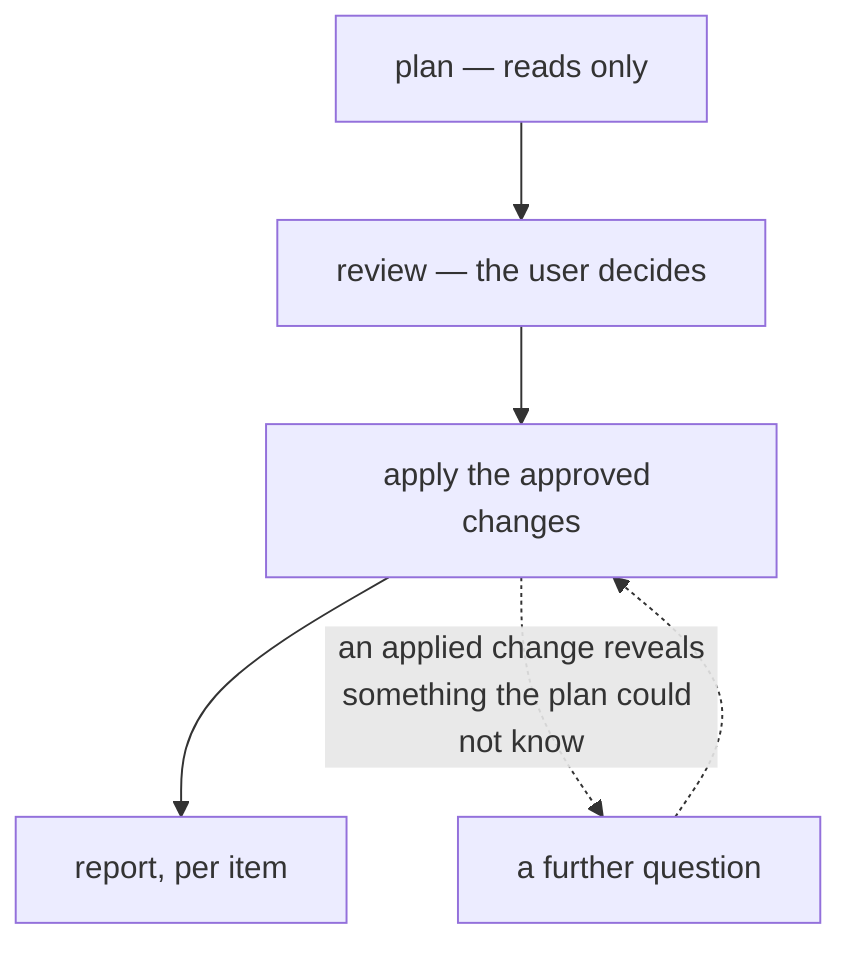
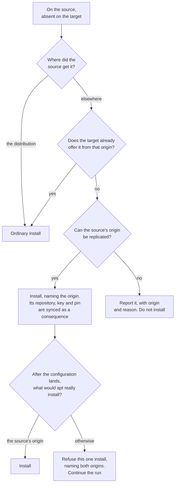

# Package sync — user requirements

What package synchronisation does, what it asks the user, and what it will not do.

## Navigation

- [High level requirements](high-level-requirements.md) — project vision and scope
- [Package sync conformance criteria](package-sync-conformance-criteria.md) — these requirements as individually checkable obligations
- [Package sync job behaviour](../jobs/package-sync.md) — user guide
- [ADR-020](../adr/adr-020-declarative-package-convergence.md) — the decision record and the reasoning behind it

This document states the intent. Where it and any other document disagree, this one is right.

## What package sync is for

Work on one machine, sync, resume on the other. That only works if the software is there: a synced home directory on a machine without the applications gives configuration for programs that will not start.

Package sync replicates *what software is installed*. Application data belongs to folder sync, which must run after it — installing software writes its own stock defaults, and those have to land before the user's synced settings go on top of them.

It replicates by **convergence, not by copying**. Both machines' package managers are asked what they have, and the difference is what the sync acts on; no package database, store or installed file is copied between machines. What is synced is a decision — install this, remove that — plus the configuration the target's own package manager needs to carry it out.

Package sync is one job per package manager — apt, snap, flatpak — plus a job for software no package manager can reproduce. Each is enabled separately, reviewed separately, and can fail without stopping the others. Enabling one authorises pc-switcher to install and remove software on the target.

## Vocabulary

**Source** and **target** are per-run roles. The sync is launched on the source; the target is the machine being changed. The next run may swap them.

**The holding machine** is the machine that has the item being decided about — the source for something it has and the target lacks, the target for something only the target has.

An **item** is one thing the user can be asked about: a package, a snap, a flatpak application, an apt hold, a flatpak mask, a configuration file. Its identity is stable across runs, so a decision about it can be remembered.

A **decision** is the user's answer about an item: apply it, skip it this run, or always skip it in future runs.

**Machine-specific** describes an item marked "always skip". The job that marked it never touches that item again on that machine, whichever machine the sync runs from — it is neither sent to the other machine nor changed by it.

**Derived** describes plumbing that is synced because approved software needs it — the repository a package comes from, its signing key, a pin, a flatpak remote. It is never a question of its own.

An **origin** is where software actually comes from — a repository or remote URL. Not its name: two remotes can share a name and serve different builds.

A **snippet** is a shell recipe, written once, for software no package manager can install.

**Flatpak scope** is the user or system flatpak installation. **Snap revision** and **snap channel** are the exact build and the update track.

## The model

**A sync goes one way, from source to target.** The source's installed state is what will be replicated on the target.

**Identity includes the origin.** `gh` from GitHub's repository and `gh` from Ubuntu's archive share a name and are different software. A package is installed on the target from the same origin it has on the source.

**The user is asked about software; the plumbing is derived.** Approving a package also approves the repository it comes from — a repository without its package does nothing, and a package without its repository cannot be installed.

**Consent precedes every change.** Nothing is written to the target before the user has approved the changes that job proposes.

Where an answer follows from something already approved, it is not asked again. Where it does not, it is asked.

Asking about every package separately would interrupt the user constantly, so questions are gathered into reviews, and repeated decisions of one kind are presented as a single list settled in one pass. That is a preference, not a rule: applying an approved change can reveal something the plan could not know, and a further question is then correct.

Approving a removal takes a gesture distinct from approving an install, and is never the default.

**A failure lands on the package it concerns**, or on the configuration item itself where no package is involved. Every approved item is attempted and every failure is named. If a pin, repository or key fails to land, the packages that needed it fail with it, rather than being installed from whatever origin the machine would otherwise use.

## What happens during a sync

In its validation step, pc-switcher checks every enabled job's prerequisites before any of them changes anything — core behaviour, not specific to package sync. apt additionally refuses to start while the target's dpkg lock is held.

Snap auto-refresh is paused on both machines for the run and restored afterwards. The pause is timed, so it expires by itself if the run dies.

Each job then plans, reviews, applies and reports.

**Plan** issues read commands only: what each machine has, filtered by the standing machine-specific marks, and the difference between them. A question that cannot be derived is asked here rather than in the review — [apt's Ubuntu Pro question (see below)](#esm-repositories--ubuntu-pro) is one, because one of its answers ends the job before there is anything to review.

**Review** presents one group at a time: items of one kind, all doing the same thing, each carrying its own decision and all settled in a single pass. The default choice for each item is the action that does no harm: *apply* for an install, *skip* for anything that removes or overwrites. Three answers are offered, or two where a permanent decision is not meaningful.

The two machines are named by hostname wherever the user reads them, and every answer states its effect on a named machine — the skip answer on a removal reads *keep it on MyMachine*, not "skip". The user can abort the whole sync at any question, and aborting is never read as declining one item.

**Apply** converges one item at a time, in the order the job requires, and announces every write. Nothing unapproved is written, and no write escapes pc-switcher's per-command confirmation — including the decision records, the snippet registry and the snap refresh pause.

**Report** gives the job's outcome: success, skipped with the reason, or failed naming each failed item.

A **dry run** plans and reviews exactly as a real run does — the questions are still asked — then changes nothing and records nothing. A **non-interactive run** — one with no terminal to answer at, such as from cron or a script — asks nothing, treats every item as declined, and reports any job with a non-empty review as skipped.

## Decisions and their memory

**Apply** does the thing. **Skip** declines it for this run only. **Always skip** marks the item machine-specific. The mark is recorded on the **holding machine** — not necessarily the machine the sync was launched from.

Example: two machines Atlas and Vega, sync launched from Atlas. Vega has `steam`; Atlas does not, so the sync offers to remove it from Vega. Answering "always skip" writes the mark **on Vega**, because Vega holds `steam`. The reverse case: Atlas has `wireshark`, the sync offers to install it on Vega, and "always skip" writes the mark on **Atlas**.

A marked item is filtered out before the difference is computed, so it never appears in a later review. Because of that, two questions have to disclose it explicitly: repository deletion and repository conflict, both below.

Marks never sync between machines. Snippets do, because how to install something is knowledge about the software rather than the machine.

Repositories and pins cannot be marked machine-specific, whether they are being added, changed or deleted; a flatpak remote is never asked about at all, so there is nothing to mark. Where the two machines disagree about where software comes from, that disagreement keeps surfacing every run instead of being silenced once, and the remedy is to align the two machines. apt's own configuration files *can* be marked, because they say how apt behaves rather than where software comes from.

Report-only findings cannot be marked either — no machine holds a version difference, and a mark would stop the package syncing rather than stop the report.

## apt

apt sync covers the **manually installed** package set — what the user asked for, not what apt pulled in to satisfy it. With it are synced the repositories and pins that decide where those packages come from, apt's own configuration, and apt holds.

### Installing

The review names the origin whenever an install would come from anything other than the distribution.

The last step is a real check against the target's own state after the configuration has landed, not a prediction. An install that would come from the wrong origin fails alone, naming both, and the run continues.

Two machines on different Ubuntu mirrors are not two origins: each machine's own distribution source files define what "the distribution" means for it.

A package from a hand-downloaded `.deb` is not apt's business — see [*Software no manager can reproduce*](#software-no-manager-can-reproduce).

### Removing, and reporting without acting

A package on the target that the source lacks is offered for removal, with skip selected by default. Removal does not purge the package's configuration.

Same package, same origin, same version produces nothing at all.

Three situations are reported and never acted on:

- **different versions** — both named; versions float — package managers handle updates, not pc-switcher
- **different origins** — both named; takes precedence over a version difference, and is never raised for a mirror difference
- **an origin that cannot be replicated** — reported with the reason, never installed from somewhere else

A package held on the target is never proposed for install or upgrade. Its hold is still an item.

### Holds

An apt hold is its own item, decided separately from its package, both when it is added and when it is removed.

A hold blocks everything: apt will not install, upgrade or remove a held package, not even as an unused dependency. So it serves two intents at once — "never lose this" and "never move this off the version that works" — and apt gives no way to tell them apart.

That second intent decides how a held package is installed. Everywhere else a version floats, because the user expressed no preference; a hold *is* that preference. So when the source holds a package the target lacks, the target gets the **source's exact version**, not whatever its repositories currently offer. If that version is no longer available on the target, the install fails as its own item naming both versions — better than silently freezing the target on a version the user never chose, which nothing would ever move again.

The hold is applied after the package is installed, never before: apt refuses to install a held package, so holding first would block the very install the hold is meant to protect.

### Collateral damage

Approving an install can make apt remove something else.

If apt installed that something automatically, the removal proceeds silently — apt is resolving its own dependencies.

If it is **manually installed on the target**, the user is asked first. The question names the package, says why it is protected — that machine's apt has it marked manually installed — and says what would happen to it. Three answers, each stating its effect: install anyway, skip and leave the triggering install unapplied, or stop the whole apt sync.

It is asked during the review, from apt's own simulation, never mid-install.

Declining cancels only the changes that actually cause the collateral. Where several cause it together, all are cancelled and the question says so. It never overwrites a decision the user already gave.

One exception: where this run must itself provision the repository, apt cannot simulate until it lands. Those are checked afterwards, and unapproved collateral fails that one install.

### Repositories, keys and pins

Adding or changing a repository is never a question: it is written because an approved package comes from it, and one that feeds nothing this run syncs is not synced at all.

Deleting one is a question. The question names the URLs the file declares — not just its filename — and the machine-specific packages the deletion would strand.

A repository both machines have with different content is overwritten with the source's version silently — unless it feeds a package the target marked machine-specific. Then the user is asked, and shown both versions of the file in full. Declining fails every approved package whose origin depended on that file.

The distribution's own source files are written and updated, never removed or offered for removal. Files apt itself does not read are not treated as repository configuration.

**Signing keys are never a review item.** A key the target lacks is copied byte-for-byte from the source before the repository naming it is written; one that differs is refreshed, unless the target's own distribution packaging owns it. Keys are synced from the source machine, not fetched from the internet. An approved repository deletion may take an unreferenced key with it.

**Every** pin the source has is written to the target, always, without review: a pin decides which origin wins, and one naming an absent origin does nothing. Deleting a pin only the target has *is* reviewed, and the file is shown whole.

A pin is never read as a statement about the packages it names.

apt's own configuration — proxy settings, recommends policy — is reviewed whether it is being added, changed or removed, with the full decision, because no approved package implies whether such a setting should be synced.

### ESM repositories — Ubuntu Pro

If the source carries ESM repositories and the target reports no Ubuntu Pro attachment, the user is asked before anything is written and before any other apt question. Two answers: attach the target now, or skip apt for this run while everything else proceeds. The user is told what to run on the target to attach it.

Writing them to an unattached target fails invisibly: `apt-get update` succeeds and the failure surfaces later, as a 401 during some unrelated install. pc-switcher cannot attach the target itself.

"I have attached it" re-probes rather than taking the answer on trust, and may be answered any number of times. Skipping skips the whole apt job, not just the ESM files, leaving apt's configuration untouched. A non-interactive run takes the skip; a dry run warns instead.

Only whether the target is attached is ever logged or shown.

### Applying apt's changes

All repository-configuration work is applied as one unit: backed up, written in apt's required order, then one refresh of the package lists. If the refresh fails, everything is restored and every approved package that depended on the unit fails by name. If a restore itself fails, the backup is kept and its path named.

Every derived change is logged as it lands and appears in a dry run's preview.

## snap

snap follows the shape every job has: what the source has is offered for install, what only the target has for removal, what cannot be converged is reported. What is particular to snap:

### Revision and channel

snap converges the source's **exact revision and channel**, where apt and flatpak let versions float: snap keeps per-user data in `~/snap/<app>/<revision>/`, which folder sync can only mirror correctly when both machines are on the same revision.

So a difference of revision or channel is a change to apply, naming both values, rather than something reported; an install lands the source's revision and channel on the target; and the same revision and channel on both machines produces nothing.

### Removing

Removing a snap leaves snapd's own pre-removal snapshot in place — the only recovery path if the removal was a mistake.

### Refresh holds

Refresh holds replicate as their own items, both when added and when removed. A hold recorded for a snap the source no longer has produces no item.

### Sideloaded snaps

Snaps installed from a local `.snap` file are out of scope (#221). They are ignored on both machines: never installed, never removed, never an item. A run names the ones it found so the user knows they are unmanaged, and does nothing else about them.

## flatpak

flatpak follows the shape every job has: what the source has is offered for install, what only the target has for removal, what cannot be converged is reported. What is particular to flatpak:

### Identity

A flatpak application is identified by its **scope** and its **full reference including branch**. The same application in both scopes, or on two branches, is two independent items — one install and one removal — reported as found.

Origin is not part of that identity: flatpak refuses to install a reference already present from a different remote, so a difference of origin is reported rather than converged, and takes precedence over a version difference.

### Installing an application

An application is installed from the source's remote or not at all, and that remote is identified by **URL and verification setting, never by name** — checked before the install and read back after it. Either failure fails that one application.

### Remotes

A remote is never a review item, whether it is being added, changed or deleted. It is plumbing, derived from the applications the user approved.

There is no distribution remote to start from: a remote is synced only because an approved application needs it — including the remote supplying that application's runtime — and is provisioned before the first install.

**A remote replicates with its trust**, not just its name and URL: its signing key is synced byte-for-byte from the source, a verified remote is never replicated as unverified, and an unverified one is replicated as such with a warning.

A remote both machines have whose URL or verification differs is repointed silently — unless that would move the origin of a machine-specific application, in which case the user is asked, shown both configurations, and declining fails every approved application that needed the source's URL.

One the source does not have is deleted once nothing on the target still uses it — after this run's approved removals, counted against what the machine actually has, including applications marked machine-specific. While anything still uses it, it stays. Deleting a remote takes its signing key with it.

A remote the source restricts with a filter is replicated **with its filter**. The filter is a separate file at a path of the user's choosing — flatpak records the path, not the content — so it is copied byte-for-byte to the same path on the target and re-applied there. Like a signing key, it is derived and never a review item. It is applied after the approved applications from that remote have landed, because a filter can be narrower than what the source has installed and must not block replicating it. If it cannot land, every approved application from that remote fails.

### Masks and scopes

Mask patterns replicate per scope, added and removed alike, whether or not anything currently matches them, and land after the applications.

A flatpak installation that is neither the user nor the system one is skipped.

## Software no manager can reproduce

Software that arrived on the source by a route nothing can replay automatically. Several kinds, one mechanism: the **install snippet**, a shell recipe written once that is synced with the software.

- **A hand-downloaded `.deb`** — apt knows the name, but no configured repository offers that version.
- **Unowned software under `/usr/local` or `/opt`** — dropped there by an install script or a tarball. The scan is deliberately shallow: it names a finding so the user can decide, it does not walk a tree.
- **A sideloaded snap**, and **a flatpak from a local bundle or a dead remote** — out of scope for now (#221).

Detection runs on the **source** only, so there is no record of what was installed this way on the target and **nothing here is ever removed**.

Every detected item ends the run with a snippet, marked machine-specific, or skipped for this run.

A snippet is **opaque** — stored and replayed exactly as written, never parsed. It runs as the target user with no privilege added around it and no standing input, so a command expecting an answer fails rather than hanging the sync.

Reproducibility is judged by what the **source** holds. The snippet registry is synced; if that would lose or change an entry only the target has, the user is asked and declining aborts the run. A snippet written during a review is replayed in that same run.

## When something goes wrong

Every approved item is attempted, and all failures are reported together, each naming its item. One failed item does not block the rest of its job; one failed job does not stop the others.

A repository, key, pin or remote has no item of its own to fail on. When one of them fails to land, that failure is charged to every approved package that needed it, and all of those packages fail — including ones that would otherwise have installed, because the origin they were approved for is not there.

It does not work the other way round. A package that fails to install leaves the repository it came from in place, and leaves the other packages that share it untouched.

A read that does not answer is different. If a package manager cannot be queried at all, its silence is never read as "this machine has nothing installed", which would propose removing everything on the other machine. It fails once, naming the command. An *empty* answer is ordinary data.

## What this deliberately does not do

- **The target's apt configuration is not under line-by-line control.** Repositories, keys and pins appear because a package was approved; declining the package is the only way to decline them.
- **A pin cannot be kept on one machine only.** It returns every run until it is deleted on the source.
- **A package installed by hand on the source but automatic on the target is not protected from collateral removal.** The target's apt owns what it installed.
- **Machine-specific marks are not consulted when protecting against collateral.**
- **Enabling apt sync without the job for irreproducible software** leaves hand-installed `.deb` packages replicated by nobody.
- **Version drift and origin divergence are reported, never resolved**, for apt and flatpak.
- **Hand-installed software is never removed from the target.**
- **A target with no Ubuntu Pro attachment costs the whole apt job for that run.**
- **A non-interactive run can answer no review.** There is no file of standing answers and no assume-yes option.
- **Machine-specific marks are per job, per machine, and never synced.**

## Open questions

Should a failed package-manager read fail only its own job, or stop the whole sync? Today it stops the sync, which contradicts the rule that one job's failure does not stop the others.

Should the ordering rule — software before folder sync — cover snippet-installed software too? It covers the three package managers today.

Should apt's and flatpak's repository-conflict questions cover the same set? apt asks about every differing repository file feeding machine-specific software; flatpak asks only about remotes something approved this run would touch anyway.

How many answers should apt's own configuration offer? It currently carries the full three-way decision, which was reasoned but never ruled on.

Should deleting a repository ever be markable machine-specific? Today it is not, with consolidating the two machines' configurations as the remedy.

How much does the Ubuntu Pro hazard cost on a real desktop? Measured in a container, zero of thirteen upgradable packages had an ESM candidate. A real desktop has not been measured.

How often is a package manually installed on the source and automatic on the target — the case the collateral protection gives up? Nobody has counted.
