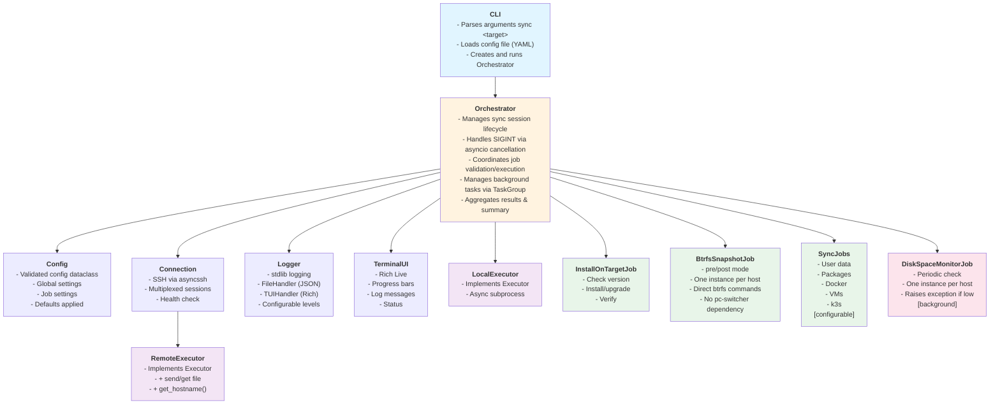
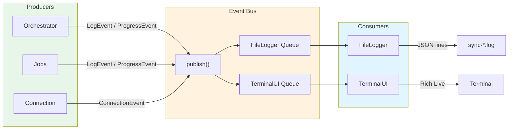
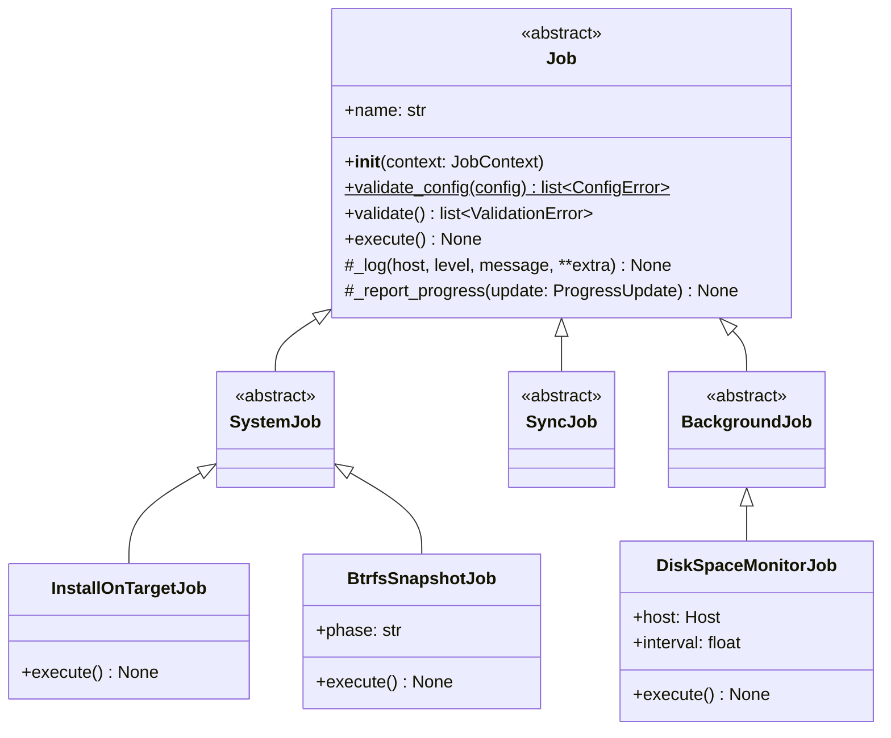
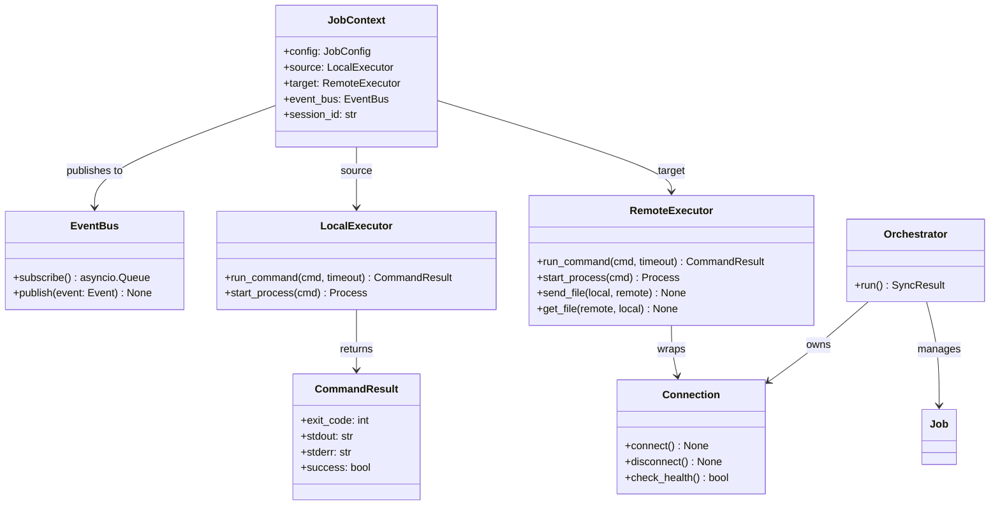
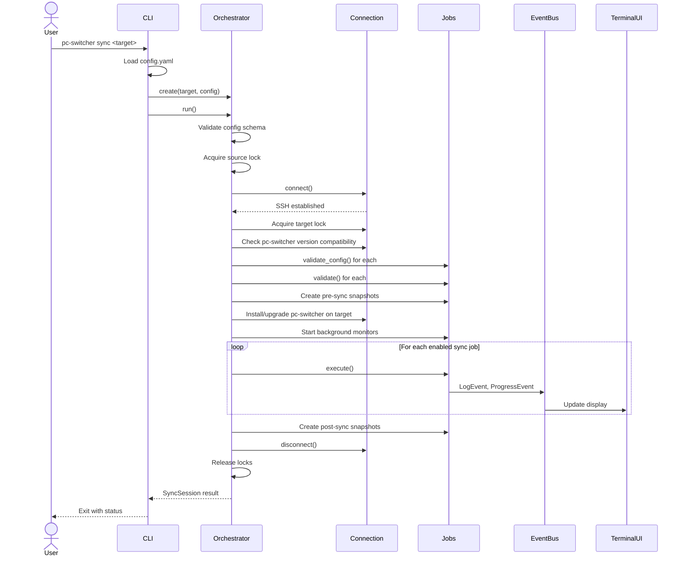
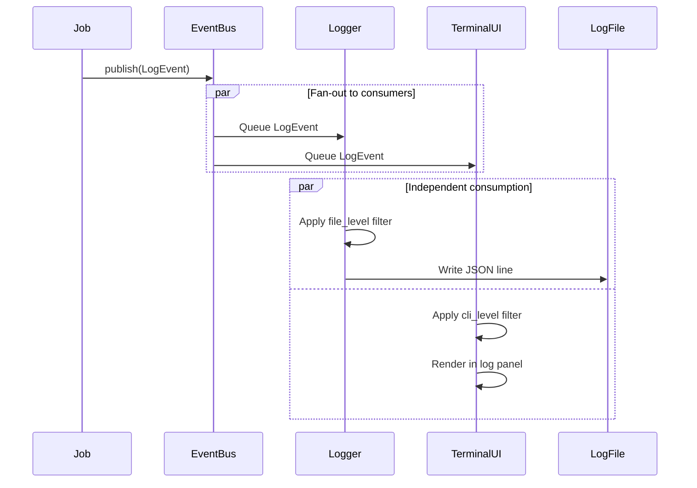

# System Architecture

This document describes the architecture for the pc-switcher system, covering the core components, their relationships, and key interaction patterns.

## Navigation

- [System Documentation](_index.md)
- [Data Model](data-model.md)
- [Core Spec](core.md)
- [Logging Spec](logging.md)

## Design Principles

- **Asyncio-native**: All I/O operations are async; cancellation uses native `asyncio.CancelledError`
- **Single SSH connection**: Multiplexed sessions over one connection for efficiency
- **Job autonomy**: Jobs own their resources and are responsible for cleanup on cancellation
- **Clear separation**: Jobs are isolated units; orchestrator handles coordination
- **Fail-safe**: Graceful degradation and proper cleanup on errors/interrupts

---

## Terminology: Host vs Hostname

| Term | Type | Values | Description |
|------|------|--------|-------------|
| **host** | `Host` (enum) | `SOURCE`, `TARGET` | The logical role of a machine in the sync operation |
| **hostname** | `str` | e.g., `"laptop-work"` | The actual machine name |

**Resolution:**
- Source hostname: obtained from local machine (e.g., `socket.gethostname()`)
- Target hostname: provided via CLI argument `sync <target>`, resolved from SSH config if alias

---

## Component Architecture

### Component Responsibilities

| Component | Responsibility |
|-----------|----------------|
| **CLI** | Entry point. Parses commands, loads config, runs Orchestrator. |
| **Orchestrator** | Central coordinator. Validates config, manages job lifecycle, handles SIGINT. |
| **Config** | Validated configuration dataclass. |
| **Connection** | Manages SSH connection via asyncssh. |
| **LocalExecutor** | Implements `Executor` interface for local async subprocess execution. |
| **RemoteExecutor** | Implements `Executor` interface via Connection. |
| **Logger** | Unified logging using Python stdlib `logging`. Routes to file (JSON) and terminal (formatted). |
| **TerminalUI** | Rich-based live display. Shows progress bars, log messages, status. |
| **Jobs** | Encapsulated sync operations. |

---

## Event Bus Architecture

All logging and progress events flow through an event bus with per-consumer queues. This decouples producers from consumers and ensures the UI never blocks job execution.

*Note: With the migration to stdlib logging, log events are captured via a custom Handler that publishes to the Event Bus.*

### Event Types

| Event | Fields | Description |
|-------|--------|-------------|
| `LogEvent` | level, job, host, message, context, timestamp | Log message from any component |
| `ProgressEvent` | job, update (ProgressUpdate), timestamp | Job progress update |
| `ConnectionEvent` | status, latency | SSH connection status change |

---

## Class Diagram

### Job Classes

### Supporting Classes

---

## Data Flow

### Sync Operation Flow

### Event-Driven Logging Flow

---

## Key Design Patterns

### Async/Await Throughout
All I/O operations use asyncio for efficient concurrency:
- SSH operations via asyncssh
- Local subprocess execution
- Event queue processing
- Background monitoring tasks

### Cancellation via CancelledError
Uses native asyncio cancellation:
- Jobs catch `CancelledError` in exception handlers
- Clean up own resources (terminate processes)
- Re-raise for propagation
- No manual flag polling

### Job Autonomy
Each job is self-contained:
- Owns configuration schema
- Validates system state
- Manages own resources
- Reports progress independently
- Handles cleanup on cancellation

### Event-Driven Architecture
Producers publish events without knowing consumers:
- Jobs don't call logger directly - publish events
- UI updates don't block job execution
- Easy to add new consumers (e.g., metrics, webhooks)
- Per-consumer queues prevent blocking

### Sequential Execution
Jobs run one at a time (no dependency graph):
- Simpler reasoning about state
- Easier error recovery
- Clear progress tracking
- Reduced complexity vs parallel execution

Background tasks (disk monitoring) run concurrently using asyncio TaskGroup.

---

## Validation Phases

Configuration and system validation happen in distinct phases:

1. **Schema Validation**: Orchestrator checks YAML syntax and types.
2. **Job Config Validation**: `Job.validate_config()` checks values and paths.
3. **System State Validation**: `Job.validate()` checks system readiness (e.g., subvolumes exist).

---

## Lock Mechanism

A single lock file `~/.local/share/pc-switcher/pc-switcher.lock` is used on every machine. This ensures a machine can only participate in one sync at a time, regardless of role (source or target).

- **Source (local)**: `fcntl.flock()`
- **Target (remote)**: `flock` via SSH

---

## Self-Installation Flow

The orchestrator ensures version consistency before any sync operations.

1. Check target version.
2. If missing or outdated, install/upgrade using `uv tool install git+...`.
3. Verify installation.

---

## Disk Space Preflight Check

The orchestrator checks free disk space on both source and target before creating snapshots.
Thresholds are configurable (e.g., "20%" or "50GiB").
