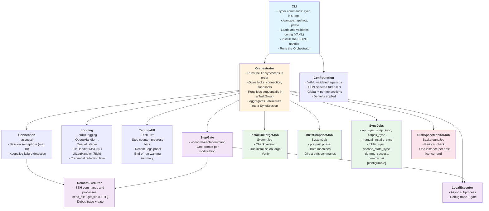
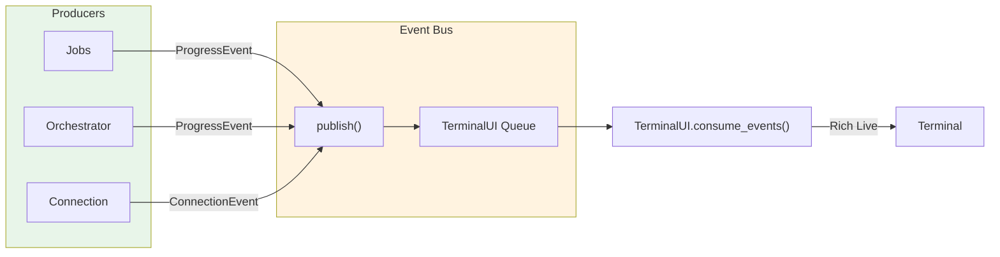
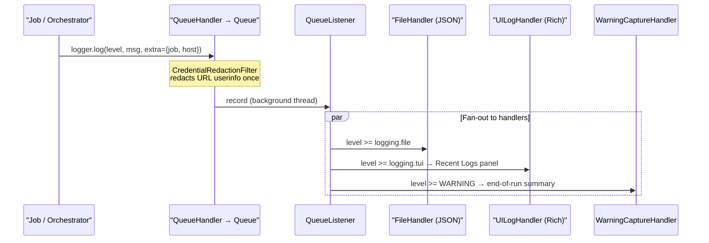
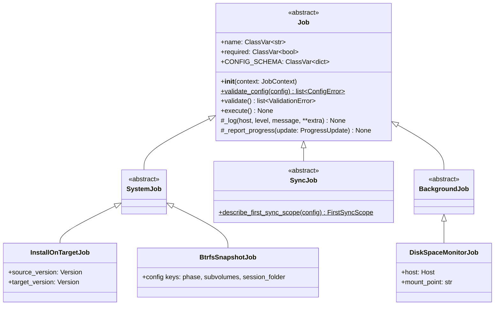
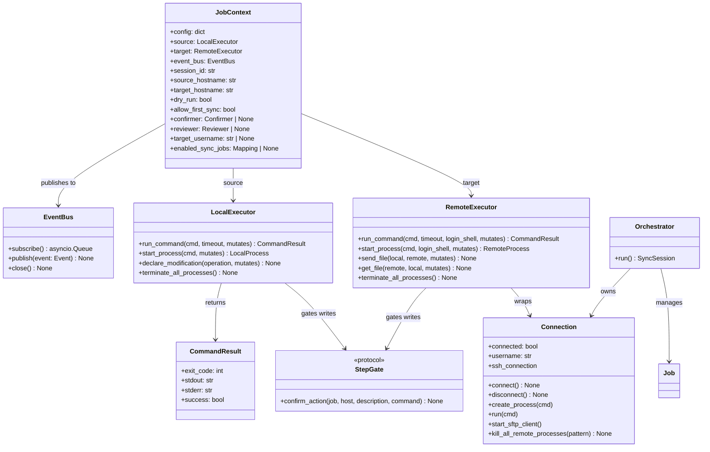
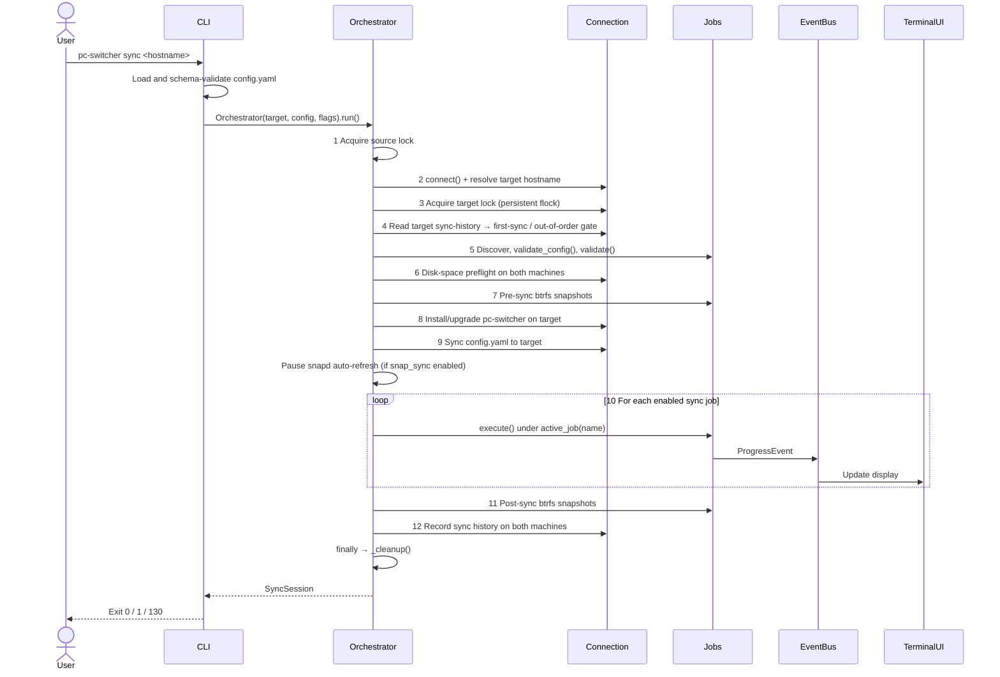

# System Architecture

The core components of pc-switcher, their relationships, and the interaction patterns between them.

## Navigation

- [System Documentation](_index.md)
- [Data Model](data-model.md)
- [Core Spec](core.md)
- [Package Sync Spec](package-sync.md)
- [Logging Spec](logging.md)

## Design Principles

- **Asyncio-native**: all I/O is async; cancellation uses native `asyncio.CancelledError`
- **Single SSH connection**: every remote session is multiplexed over one asyncssh connection, bounded by a semaphore
- **One funnel to the machines**: every command, transfer and background process goes through an `Executor`, which is where the debug trace, credential redaction and the per-action confirmation gate live
- **Job autonomy**: jobs own their config schema, their validation and their resources
- **Fail-safe**: cleanup runs in a `finally` block on every exit path, including interrupts

## Terminology: Host vs Hostname

| Term | Type | Values | Description |
| ---- | ---- | ------ | ----------- |
| **host** | `Host` (enum) | `SOURCE`, `TARGET` | The logical role of a machine in the sync operation |
| **hostname** | `str` | e.g., `"laptop-work"` | The actual machine name |

Resolution:

- Source hostname: `socket.gethostname()` on the local machine (`lock.get_local_hostname`)
- Target connection address: the CLI argument `sync <target>` (hostname, SSH alias, or IP), used as the SSH/rsync destination and never overwritten
- Target hostname for sync-history and the topology check: the target's own `socket.gethostname()`, queried over SSH (`lock.get_hostname_command`) so both ends are acquired the same way. Peers are compared case-insensitively (`sync_history.hostnames_equal`), so a differently-cased or aliased target still matches a clean back-sync (ADR-015)

## Component Architecture

```mermaid
graph TD
    CLI["<b>CLI</b><br/>- Typer commands: sync, init, logs,<br/>  cleanup-snapshots, update<br/>- Loads and validates config (YAML)<br/>- Installs the SIGINT handler<br/>- Runs the Orchestrator"]

    Orchestrator["<b>Orchestrator</b><br/>- Runs the 12 SyncSteps in order<br/>- Owns locks, connection, snapshots<br/>- Runs jobs sequentially in a TaskGroup<br/>- Aggregates JobResults into a SyncSession"]

    Config["<b>Configuration</b><br/>- YAML validated against a<br/>  JSON Schema (draft-07)<br/>- Global + per-job sections<br/>- Defaults applied"]

    Connection["<b>Connection</b><br/>- asyncssh<br/>- Session semaphore (max 10)<br/>- Keepalive failure detection"]

    Logging["<b>Logging</b><br/>- stdlib logging<br/>- QueueHandler → QueueListener<br/>- FileHandler (JSON) + UILogHandler (Rich)<br/>- Credential redaction filter"]

    TerminalUI["<b>TerminalUI</b><br/>- Rich Live<br/>- Step counter, progress bars<br/>- Recent Logs panel<br/>- End-of-run warning summary"]

    StepGate["<b>StepGate</b><br/>- --confirm-each-command<br/>- One prompt per modification"]

    LocalExecutor["<b>LocalExecutor</b><br/>- Async subprocess<br/>- Debug trace + gate"]

    RemoteExecutor["<b>RemoteExecutor</b><br/>- SSH commands and processes<br/>- send_file / get_file (SFTP)<br/>- Debug trace + gate"]

    InstallOnTargetJob["<b>InstallOnTargetJob</b><br/>SystemJob<br/>- Check version<br/>- Run install.sh on target<br/>- Verify"]

    BtrfsSnapshotJob["<b>BtrfsSnapshotJob</b><br/>SystemJob<br/>- pre/post phase<br/>- Both machines<br/>- Direct btrfs commands"]

    SyncJobs["<b>SyncJobs</b><br/>- apt_sync, snap_sync, flatpak_sync<br/>- manual_installs_sync<br/>- folder_sync, vscode_state_sync<br/>- dummy_success, dummy_fail<br/>[configurable]"]

    DiskSpaceMonitorJob["<b>DiskSpaceMonitorJob</b><br/>BackgroundJob<br/>- Periodic check<br/>- One instance per host<br/>[concurrent]"]

    CLI --> Config
    CLI --> Orchestrator
    Orchestrator --> Connection
    Orchestrator --> Logging
    Orchestrator --> TerminalUI
    Orchestrator --> StepGate
    Orchestrator --> LocalExecutor
    Connection --> RemoteExecutor
    StepGate --> LocalExecutor
    StepGate --> RemoteExecutor
    Orchestrator --> InstallOnTargetJob
    Orchestrator --> BtrfsSnapshotJob
    Orchestrator --> SyncJobs
    Orchestrator --> DiskSpaceMonitorJob

    style CLI fill:#e1f5ff
    style Orchestrator fill:#fff3e0
    style LocalExecutor fill:#f3e5f5
    style RemoteExecutor fill:#f3e5f5
    style StepGate fill:#f3e5f5
    style InstallOnTargetJob fill:#e8f5e9
    style BtrfsSnapshotJob fill:#e8f5e9
    style SyncJobs fill:#e8f5e9
    style DiskSpaceMonitorJob fill:#fce4ec
```

### Component Responsibilities

| Component | Responsibility |
| --------- | -------------- |
| **CLI** (`cli.py`) | Typer entry point. Parses commands, loads config, installs the SIGINT handler, runs the orchestrator, maps the outcome to an exit code. |
| **Orchestrator** (`orchestrator.py`) | Runs the fixed `SyncStep` sequence, owns locks and the connection, executes jobs, cleans up in a `finally`. |
| **Configuration** (`config.py`) | Loads and schema-validates `config.yaml`; exposes global settings and per-job sections. |
| **Connection** (`connection.py`) | The asyncssh connection: connect, disconnect, run, create_process, SFTP, and remote process cleanup. |
| **LocalExecutor / RemoteExecutor** (`executor.py`) | The only route to either machine. Also the seam for the verbatim DEBUG trace and the `mutates=` confirmation gate. |
| **StepGate** (`step_gate.py`) | The `--confirm-each-command` prompt; `None` unless the flag was passed. |
| **Confirmer** (`confirmer.py`) | The coarse one-per-run confirmations (first sync, out-of-order topology); the matching `--allow-*` flag answers the gate instead of prompting. |
| **Logging** (`logger.py`) | stdlib logging through a `QueueHandler`/`QueueListener` pair onto a JSON file handler and a Rich UI handler. |
| **TerminalUI** (`ui.py`) | Rich `Live` display: step counter, per-job progress bars, recent logs, connection status, warning summary. |
| **Jobs** (`jobs/`) | Encapsulated sync operations. |

## Event Bus

The event bus (`events.py`) carries `ProgressEvent` and `ConnectionEvent` from producers to the terminal UI over a per-consumer queue, so the UI never blocks job execution.

Logging does **not** use the bus. Since ADR-010 every log record travels through stdlib logging; `LogEvent` still exists but is deprecated and no consumer handles it.

```mermaid
graph LR
    subgraph Producers
        Orch["Orchestrator"]
        Jobs["Jobs"]
        Conn["Connection"]
    end

    subgraph EventBus ["Event Bus"]
        Publish["publish()"]
        UIQ["TerminalUI Queue"]
    end

    Jobs -->|ProgressEvent| Publish
    Orch -->|ProgressEvent| Publish
    Conn -->|ConnectionEvent| Publish

    Publish --> UIQ
    UIQ --> UI["TerminalUI.consume_events()"]
    UI -->|Rich Live| Terminal["Terminal"]

    style EventBus fill:#fff3e0
    style Producers fill:#e8f5e9
```

### Event Types

| Event | Fields | Consumed by |
| ----- | ------ | ----------- |
| `ProgressEvent` | job, update (`ProgressUpdate`), timestamp | `TerminalUI.update_job_progress` |
| `ConnectionEvent` | status, latency | `TerminalUI.set_connection_status` |
| `LogEvent` | level, job, host, message, context, timestamp | Deprecated (ADR-010); nothing consumes it |

## Logging Pipeline

```mermaid
sequenceDiagram
    participant Caller as "Job / Orchestrator"
    participant Queue as "QueueHandler → Queue"
    participant Listener as QueueListener
    participant File as "FileHandler (JSON)"
    participant UIH as "UILogHandler (Rich)"
    participant Warn as WarningCaptureHandler

    Caller->>Queue: logger.log(level, msg, extra={job, host})
    Note over Queue: CredentialRedactionFilter<br/>redacts URL userinfo once
    Queue->>Listener: record (background thread)
    par Fan-out to handlers
        Listener->>File: level >= logging.file
        Listener->>UIH: level >= logging.tui → Recent Logs panel
        Listener->>Warn: level >= WARNING → end-of-run summary
    end
```

Non-`pcswitcher` loggers must additionally clear the `logging.external` floor. Details in the [Logging Spec](logging.md).

## Class Diagram

### Job Classes

```mermaid
classDiagram
    class Job {
        <<abstract>>
        +name: ClassVar~str~
        +required: ClassVar~bool~
        +CONFIG_SCHEMA: ClassVar~dict~
        +__init__(context: JobContext)
        +validate_config(config)$ list~ConfigError~
        +validate() list~ValidationError~
        +execute() None
        #_log(host, level, message, **extra) None
        #_report_progress(update: ProgressUpdate) None
    }

    class SystemJob {
        <<abstract>>
    }

    class SyncJob {
        <<abstract>>
        +describe_first_sync_scope(config)$ FirstSyncScope
    }

    class BackgroundJob {
        <<abstract>>
    }

    class InstallOnTargetJob {
        +source_version: Version
        +target_version: Version
    }

    class BtrfsSnapshotJob {
        +config keys: phase, subvolumes, session_folder
    }

    class DiskSpaceMonitorJob {
        +host: Host
        +mount_point: str
    }

    Job <|-- SystemJob
    Job <|-- SyncJob
    Job <|-- BackgroundJob
    SystemJob <|-- InstallOnTargetJob
    SystemJob <|-- BtrfsSnapshotJob
    BackgroundJob <|-- DiskSpaceMonitorJob
```

`SystemJob` and `BackgroundJob` set `required = True` (the orchestrator constructs them directly); `SyncJob` sets `required = False` and is discovered from `sync_jobs`.

### Supporting Classes

```mermaid
classDiagram
    class JobContext {
        +config: dict
        +source: LocalExecutor
        +target: RemoteExecutor
        +event_bus: EventBus
        +session_id: str
        +source_hostname: str
        +target_hostname: str
        +dry_run: bool
        +allow_first_sync: bool
        +confirmer: Confirmer | None
        +reviewer: Reviewer | None
        +target_username: str | None
        +enabled_sync_jobs: Mapping | None
    }

    class CommandResult {
        +exit_code: int
        +stdout: str
        +stderr: str
        +success: bool
    }

    class EventBus {
        +subscribe() asyncio.Queue
        +publish(event: Event) None
        +close() None
    }

    class LocalExecutor {
        +run_command(cmd, timeout, mutates) CommandResult
        +start_process(cmd, mutates) LocalProcess
        +declare_modification(operation, mutates) None
        +terminate_all_processes() None
    }

    class RemoteExecutor {
        +run_command(cmd, timeout, login_shell, mutates) CommandResult
        +start_process(cmd, login_shell, mutates) RemoteProcess
        +send_file(local, remote, mutates) None
        +get_file(remote, local, mutates) None
        +terminate_all_processes() None
    }

    class StepGate {
        <<protocol>>
        +confirm_action(job, host, description, command) None
    }

    class Connection {
        +connected: bool
        +username: str
        +ssh_connection
        +connect() None
        +disconnect() None
        +create_process(cmd)
        +run(cmd)
        +start_sftp_client()
        +kill_all_remote_processes(pattern) None
    }

    class Orchestrator {
        +run() SyncSession
    }

    JobContext --> LocalExecutor : source
    JobContext --> RemoteExecutor : target
    JobContext --> EventBus : publishes to
    LocalExecutor --> CommandResult : returns
    LocalExecutor --> StepGate : gates writes
    RemoteExecutor --> StepGate : gates writes
    RemoteExecutor --> Connection : wraps
    Orchestrator --> Connection : owns
    Orchestrator --> Job : manages
```

## Data Flow

### Sync Operation Flow

```mermaid
sequenceDiagram
    actor User
    participant CLI
    participant Orchestrator
    participant Connection
    participant Jobs
    participant EventBus
    participant TerminalUI

    User->>CLI: pc-switcher sync <hostname>
    CLI->>CLI: Load and schema-validate config.yaml
    CLI->>Orchestrator: Orchestrator(target, config, flags).run()

    Orchestrator->>Orchestrator: 1 Acquire source lock
    Orchestrator->>Connection: 2 connect() + resolve target hostname
    Orchestrator->>Connection: 3 Acquire target lock (persistent flock)
    Orchestrator->>Connection: 4 Read target sync-history → first-sync / out-of-order gate
    Orchestrator->>Jobs: 5 Discover, validate_config(), validate()
    Orchestrator->>Connection: 6 Disk-space preflight on both machines
    Orchestrator->>Jobs: 7 Pre-sync btrfs snapshots
    Orchestrator->>Connection: 8 Install/upgrade pc-switcher on target
    Orchestrator->>Connection: 9 Sync config.yaml to target

    Orchestrator->>Orchestrator: Pause snapd auto-refresh (if snap_sync enabled)
    loop 10 For each enabled sync job
        Orchestrator->>Jobs: execute() under active_job(name)
        Jobs->>EventBus: ProgressEvent
        EventBus->>TerminalUI: Update display
    end

    Orchestrator->>Jobs: 11 Post-sync btrfs snapshots
    Orchestrator->>Connection: 12 Record sync history on both machines
    Orchestrator->>Orchestrator: finally → _cleanup()
    Orchestrator-->>CLI: SyncSession
    CLI-->>User: Exit 0 / 1 / 130
```

### Sync Lifecycle Steps

`Orchestrator.run()` executes a fixed, ordered sequence. The names and numbers are the `SyncStep` enum in `orchestrator.py`, which also supplies the TUI's `Step N/12` denominator — the numbering matches the `# SyncStep N:` markers in `run()`.

1. **SOURCE_LOCK** — take the local unified lock. Fail-fast, no wait or retry: if this machine is already a source or target of another sync, abort.
2. **CONNECT** — establish the asyncssh connection, create both executors, and resolve the target's own hostname over SSH.
3. **TARGET_LOCK** — take the target's unified lock over SSH, held by a persistent remote `flock` process for the whole session. Fail-fast if the target is busy.
4. **OUT_OF_ORDER_CHECK** — read the target's sync-history (now that the lock is held) and run the first-sync gate (bypass: `--allow-first-sync`) and the out-of-order gate (bypass: `--allow-out-of-order`) per ADR-015. `--dry-run` rehearses both without aborting (ADR-014).
5. **DISCOVER_JOBS** — import the enabled jobs, validate their config sections, enforce the package-jobs-before-`folder_sync` ordering rule, then run every job's `validate()`.
6. **DISK_CHECK** — verify free space on `/` on both machines against `preflight_minimum`.
7. **PRE_SNAPSHOT** — btrfs pre-snapshots on both machines (the rollback point).
8. **INSTALL_ON_TARGET** — install the matching pc-switcher version on the target, after the snapshots so a bad install is recoverable.
9. **SYNC_CONFIG** — reconcile `config.yaml` with the target.
10. **RUN_JOBS** — run each enabled sync job sequentially inside a `TaskGroup` that also holds the two disk-space monitors. Each package job plans, reviews and applies inside its own `execute()` — see the [Package Sync Spec](package-sync.md). Displayed as sub-steps `10a`, `10b`, ….
11. **POST_SNAPSHOT** — btrfs post-snapshots on both machines.
12. **RECORD_HISTORY** — record source/target roles and peers in each machine's sync-history, the state the step-4 gate reads next run. Skipped under `--dry-run`.

Reaching step 12 is not the same as success: per-item package failures are recorded as FAILED `JobResult`s rather than raised, so `_summarize_job_outcomes` derives the session status from the results.

A `finally` block always runs `_cleanup()`: restore the snapd hold, release the target lock, terminate tracked processes on both machines, disconnect, release the source lock, drain the event bus and logging queues, stop the Live display, and print the job outcome block and the warning summary. Locks are fcntl advisory locks released automatically when a process exits or the SSH connection drops, so a leftover lock *file* never blocks a future sync.

## Key Design Patterns

### Async/Await Throughout

SSH operations, local subprocesses, event-queue processing and background monitors are all asyncio.

### Cancellation via CancelledError

Native asyncio cancellation, no flag polling: the CLI's SIGINT handler cancels the sync task, jobs catch `CancelledError` to release their own resources and re-raise, and the orchestrator's `finally` performs teardown. A second SIGINT cancels every task in the loop.

### Job Autonomy

Each job owns its config schema, validates its own system prerequisites, manages its resources, and reports its own progress.

### One Executor Funnel

Every executor call that is not purely read-only passes `mutates="<phrase>"`, which is what makes the verbatim DEBUG trace, credential redaction and the `--confirm-each-command` gate uniform without per-job wiring. Omitting it is allowed only when the call can change no state on the machine — content, process, lock or package database; running a read under `sudo` does not make it a write. `tests/unit/test_mutates_audit.py` fails when anything else is added without it.

### Sequential Execution

Sync jobs run one at a time, in config order, with no dependency graph. The one ordering rule is validated rather than resolved: the four package jobs must be listed before `folder_sync` (D-17), otherwise config validation fails.

The two `DiskSpaceMonitorJob`s run concurrently in the same `TaskGroup` and are cancelled when the job loop ends.

### Failure Isolation

A job raising `PackageItemFailures` or `ProbeFailed` records a FAILED result and the loop continues; `JobSkipped` records SKIPPED and continues; `SyncAborted` (and its `SyncAbortedByUser` subclass) and `SyncLockedError` propagate as WARNING-level control flow; every other exception aborts the run. See [Job outcomes](core.md#job-outcomes).

## Validation Phases

1. **Schema validation** — `Configuration.from_yaml` checks YAML syntax, rejects duplicate keys, and validates the document against `schemas/config-schema.yaml`. Runs in the CLI, before the orchestrator exists.
2. **Job config validation** — `Job.validate_config()` validates the job's own section against its `CONFIG_SCHEMA` (SyncStep 5).
3. **System state validation** — `Job.validate()` checks system readiness on both machines: binaries, passwordless sudo, subvolumes, reachable paths (SyncStep 5).

All three run before any state modification.

## Lock Mechanism

One lock file per machine, `~/.local/share/pc-switcher/pc-switcher.lock`, so a machine can only take part in one sync at a time in either role.

- **Source (local)**: `fcntl.flock()` held by the running process
- **Target (remote)**: `flock --nonblock … --command "read"` started over SSH and held for the session

Both are advisory locks on an open descriptor, so they release when the holder exits or the SSH connection closes.

## Self-Installation Flow

1. Read `pc-switcher --version` on the target. A newer version than the source's aborts the sync.
2. If missing or different, pipe the source version's `install.sh` into bash on the target; the script bootstraps `uv` if needed and runs `uv tool install`. The exact-version tag is tried first, falling back to the highest release at or below the source version.
3. Re-read `pc-switcher --version` and compare; a mismatch aborts.

## Disk Space Preflight Check

Free space on `/` is checked on both machines before snapshots are created. The threshold (`disk_space_monitor.preflight_minimum`) is a percentage (`"20%"`) or an absolute value with a `GiB`/`MiB`/`GB`/`MB` unit; unitless values are rejected by the schema.
