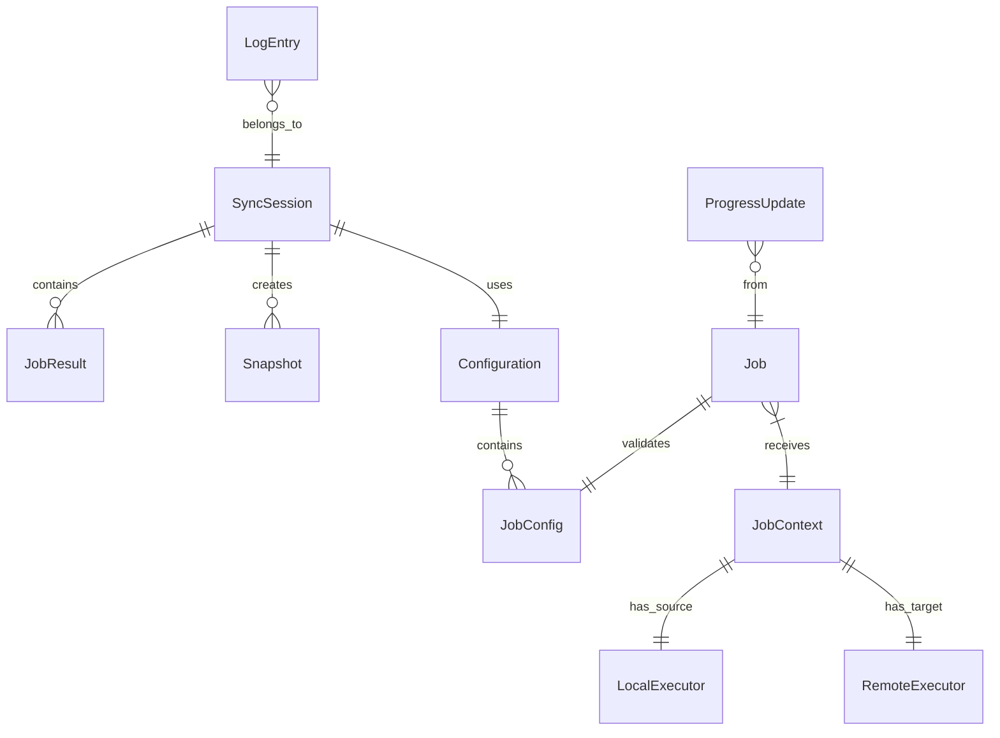

# System Data Model

This document defines the core entities, their relationships, and validation rules for the pc-switcher system.

## Navigation

- [System Documentation](_index.md)
- [Architecture](architecture.md)
- [Foundation Spec](foundation.md)
- [Logging Spec](logging.md)

## Entity Overview



## Core Entities

### Host (Enum)

Represents the logical role of a machine in the sync operation.

```python
from enum import StrEnum

class Host(StrEnum):
    SOURCE = "source"
    TARGET = "target"
```

**Usage**: All internal code uses `Host` enum. Logger resolves to actual hostname for display.

---

### LogLevel (Enum)

Aligned with Python's standard `logging` module.

```python
from enum import IntEnum
import logging

class LogLevel(IntEnum):
    DEBUG = 10    # Internal diagnostics
    FULL = 15     # Operational details (file-level) - Custom level
    INFO = 20     # High-level operations
    WARNING = 30  # Unexpected but non-fatal
    ERROR = 40    # Recoverable errors
    CRITICAL = 50 # Unrecoverable, sync must abort
```

**Note**: `FULL` (15) is a custom level registered with `logging.addLevelName()`.

---

### LogConfig

Configuration entity holding log level settings.

| Field | Type | Default | Description |
|-------|------|---------|-------------|
| `file` | `int` | `10` (DEBUG) | Floor log level for file output. |
| `tui` | `int` | `20` (INFO) | Floor log level for TUI output. |
| `external` | `int` | `30` (WARNING) | Additional floor for non-pcswitcher loggers. |

---

### LogContext

Structured context added to log records via `extra` dict.

| Field | Type | Description |
|-------|------|-------------|
| `job` | `str` | Job name (e.g., `"btrfs"`). |
| `host` | `str` | Logical role (`"source"` or `"target"`). |
| `**context` | `dict` | Additional key=value pairs. |

---

### CommandResult

Result of executing a command via LocalExecutor or RemoteExecutor.

```python
from dataclasses import dataclass

@dataclass(frozen=True)
class CommandResult:
    exit_code: int
    stdout: str
    stderr: str

    @property
    def success(self) -> bool:
        return self.exit_code == 0
```

---

### ProgressUpdate

Progress information emitted by jobs.

```python
from dataclasses import dataclass

@dataclass(frozen=True)
class ProgressUpdate:
    percent: int | None = None
    current: int | None = None
    total: int | None = None
    item: str | None = None
    heartbeat: bool = False
```

---

### JobContext

Context passed to every job upon instantiation.

```python
@dataclass(frozen=True)
class JobContext:
    config: JobConfig
    source: LocalExecutor
    target: RemoteExecutor
    event_bus: EventBus
    session_id: str
    source_hostname: str
    target_hostname: str
```

---

### Snapshot

Represents a btrfs snapshot created during the sync.

```python
@dataclass(frozen=True)
class Snapshot:
    path: Path
    timestamp: datetime
    session_id: str
    phase: str      # "pre" or "post"
    subvolume: str  # "@" or "@home"
```
