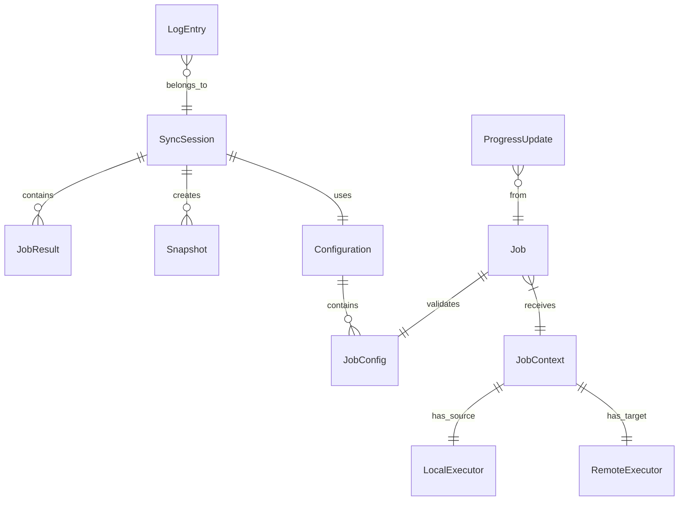

# System Data Model

This document defines the core entities, their relationships, and validation rules for the pc-switcher system.

## Navigation

- [System Documentation](_index.md)
- [Architecture](architecture.md)
- [Core Spec](core.md)
- [Logging Spec](logging.md)

## Entity Overview


```mermaid
erDiagram
    SyncSession ||--o{ JobResult : contains
    SyncSession ||--o{ Snapshot : creates
    SyncSession ||--|| Configuration : uses
    Configuration ||--o{ JobConfig : contains
    Job ||--|| JobConfig : validates
    Job }|--|| JobContext : receives
    JobContext ||--|| LocalExecutor : has_source
    JobContext ||--|| RemoteExecutor : has_target
    LogEntry }o--|| SyncSession : belongs_to
    ProgressUpdate }o--|| Job : from
```

## Core Entities

### Host (Enum)

Represents the logical role of a machine in the sync operation.

```python
from enum import StrEnum

class Host(StrEnum):
    SOURCE = "source"
    TARGET = "target"
```

**Usage**: All internal code uses `Host` enum. Logger resolves to actual hostname for display.

---

### LogLevel (Enum)

Aligned with Python's standard `logging` module.

```python
from enum import IntEnum
import logging

class LogLevel(IntEnum):
    DEBUG = 10    # Internal diagnostics
    FULL = 15     # Operational details (file-level) - Custom level
    INFO = 20     # High-level operations
    WARNING = 30  # Unexpected but non-fatal
    ERROR = 40    # Recoverable errors
    CRITICAL = 50 # Unrecoverable, sync must abort
```

**Note**: `FULL` (15) is a custom level registered with `logging.addLevelName()`.

---

### LogConfig

Configuration entity holding log level settings.

| Field | Type | Default | Description |
| ----- | ---- | ------- | ----------- |
| `file` | `int` | `10` (DEBUG) | Floor log level for file output. |
| `tui` | `int` | `20` (INFO) | Floor log level for TUI output. |
| `external` | `int` | `30` (WARNING) | Additional floor for non-pcswitcher loggers. |

---

### LogContext

Structured context added to log records via `extra` dict.

| Field | Type | Description |
| ----- | ---- | ----------- |
| `job` | `str` | Job name (e.g., `"btrfs"`). |
| `host` | `str` | Logical role (`"source"` or `"target"`). |
| `**context` | `dict` | Additional key=value pairs. |

---

### CommandResult

Result of executing a command via LocalExecutor or RemoteExecutor.

```python
from dataclasses import dataclass

@dataclass(frozen=True)
class CommandResult:
    exit_code: int
    stdout: str
    stderr: str

    @property
    def success(self) -> bool:
        return self.exit_code == 0
```

---

### ProgressUpdate

Progress information emitted by jobs.

```python
from dataclasses import dataclass

@dataclass(frozen=True)
class ProgressUpdate:
    percent: int | None = None
    current: int | None = None
    total: int | None = None
    item: str | None = None
    heartbeat: bool = False
```

---

### JobContext

Context passed to every job upon instantiation.

```python
@dataclass(frozen=True)
class JobContext:
    config: JobConfig
    source: LocalExecutor
    target: RemoteExecutor
    event_bus: EventBus
    session_id: str
    source_hostname: str
    target_hostname: str
```

---

### Snapshot

Represents a btrfs snapshot created during the sync.

```python
@dataclass(frozen=True)
class Snapshot:
    path: Path
    timestamp: datetime
    session_id: str
    phase: str      # "pre" or "post"
    subvolume: str  # "@" or "@home"
```

---

## Package Sync Entities

Phase 2's package-sync subsystem (`apt_sync`, `snap_sync`, `flatpak_sync`) adds its own item model and two on-disk data shapes. See [Package Sync Subsystem](architecture.md#package-sync-subsystem) for the pipeline these flow through.

### Item identity

Every item class computes a stable `item_id` string rather than reusing the manager's own name for identity. This matters because a manager-native name is not always unique on its own — the same apt package name can legitimately mean "install" on one machine and "remove" on another only if there's exactly one identity to diff against, and a flatpak application id or a snap name can exist independently in two different scopes/channels that must NOT collapse into one entity. Folding the disambiguating fact (scope, origin, manager) into the identity string itself — rather than leaving it as a sibling field the diff engine would have to special-case — is what lets one generic source-vs-target diff work unmodified across every item class:

| Item class | `item_id` format | Disambiguating fact folded into identity |
| - | - | - |
| `AptPackageItem` | `apt:package:<name>` | — |
| `AptSourceItem` | `apt:source:<filename>` | filename (a legacy `.list` and a deb822 `.sources` file for the same repo stay two entries) |
| `AptKeyItem` | `apt:key:<scope>:<filename>` | `scope`: `per-repo` or `global-trust` |
| `AptPinItem` | `apt:pin:<filename>` | — |
| `AptConfigItem` | `apt:config:<filename>` | — |
| `SnapItem` | `snap:<name>` | — (channel and revision are fields, not part of identity) |
| `FlatpakItem` (ref) | `flatpak:ref:<scope>:<application>` | `scope`: `user` or `system` — the same application installed in both scopes is two distinct items |
| `FlatpakRemoteItem` | `flatpak:remote:<scope>:<name>` | `scope` — `flathub` commonly exists in both scopes with an identical URL but needs independent provisioning |
| `UnreproducibleItem` | `unreproducible:<origin>:<identifier>` | `origin`: `apt-no-candidate` or `unowned-path` — the same identifier string can coincidentally collide across origins |

Every item class also exposes a `label()` (or, for `UnreproducibleItem`, a plain `label` field) — the human-readable text the review and logs show; `item_id` is never shown to a user directly.

All item classes flow through one shared diff result shape:

```python
@dataclass(frozen=True)
class ItemDiff:
    item_class: ItemClass
    diff_class: DiffClass     # MISSING_ON_TARGET, EXTRA_ON_TARGET, VERSION_MISMATCH,
                               # HELD_OR_PINNED, REPO_UNAVAILABLE, UNREPRODUCIBLE
    action: DiffAction        # INSTALL, REMOVE, CHANGE, REPORT_ONLY
    item_id: str
    label: str
    detail: str | None = None
```

### Machine-local decision file (never synced)

One YAML file per package manager, at `~/.config/pc-switcher/<manager>.decisions.yaml` (e.g. `apt.decisions.yaml`). Records every "skip always" (machine-specific) choice made in a review. **Never synced** — excluded from `folder_sync` unconditionally and outside `config_sync`'s file set, since an entry describes what belongs to *this* machine, not a fact to propagate.

```python
@dataclass(frozen=True)
class DecisionEntry:
    item_id: str
    item_class: ItemClass
    label: str
    reason: str | None
    recorded_at: str  # ISO-8601 UTC
```

On disk, entries are keyed by `item_id` under a `machine_specific:` mapping.

### Install-snippet registry (synced)

One shared YAML file at `~/.config/pc-switcher/package-snippets.yaml`, holding an opaque, replayable shell command for each item no package manager can reproduce (a bare `.deb`, a manual install). **Synced** — it travels alongside `config.yaml` via `config_sync`'s `SYNCED_CONFIG_FILENAMES`, since how to install something is knowledge about the package, not the machine (contrast with the decision file above).

```python
@dataclass(frozen=True)
class Snippet:
    item_id: str
    label: str
    body: str          # opaque; replayed verbatim, never parsed or interpreted
    authored_at: str   # ISO-8601 UTC
    authored_on: str   # hostname the snippet was authored on
```

On disk, entries are keyed by `item_id` under a `snippets:` mapping. `body` replays as `bash -c <body>` with no stdin available — a snippet expecting a prompt fails rather than hanging the sync.
