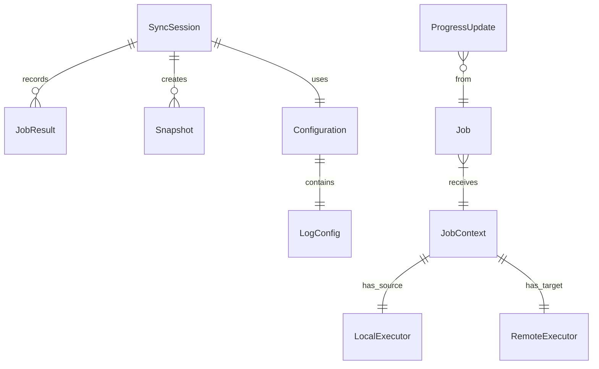

# System Data Model

This document defines the core entities, their relationships, and validation rules for the pc-switcher system.

## Navigation

- [System Documentation](_index.md)
- [Architecture](architecture.md)
- [Core Spec](core.md)
- [Logging Spec](logging.md)

## Entity Overview


```mermaid
erDiagram
    SyncSession ||--o{ JobResult : records
    SyncSession ||--o{ Snapshot : creates
    SyncSession ||--|| Configuration : uses
    Configuration ||--|| LogConfig : contains
    Job }|--|| JobContext : receives
    JobContext ||--|| LocalExecutor : has_source
    JobContext ||--|| RemoteExecutor : has_target
    ProgressUpdate }o--|| Job : from
```

Every entity below lives in `src/pcswitcher/models.py` unless another module is named.

## Core Entities

### Host (Enum)

Represents the logical role of a machine in the sync operation.

```python
from enum import StrEnum

class Host(StrEnum):
    SOURCE = "source"
    TARGET = "target"
```

**Usage**: All internal code uses `Host` enum. The hostname each role resolves to is logged once at session start.

### LogLevel (Enum)

Aligned with Python's standard `logging` module.

```python
from enum import IntEnum
import logging

class LogLevel(IntEnum):
    DEBUG = 10    # Internal diagnostics
    FULL = 15     # Operational details (file-level) - Custom level
    INFO = 20     # High-level operations
    WARNING = 30  # Unexpected but non-fatal
    ERROR = 40    # Recoverable errors
    CRITICAL = 50 # Unrecoverable, sync must abort
```

**Note**: `FULL` (15) is a custom level registered with `logging.addLevelName()` in `logger.py`.

### LogConfig

Log level settings, in `config.py`. Parsed from the config file's `logging:` section into `Configuration.logging`.

| Field | Type | Default | Description |
| ----- | ---- | ------- | ----------- |
| `file` | `int` | `10` (DEBUG) | Floor log level for file output. |
| `tui` | `int` | `20` (INFO) | Floor log level for TUI output. |
| `external` | `int` | `30` (WARNING) | Additional floor for non-pcswitcher loggers. |

### Log record context

Not a class: the structured context each call passes as stdlib logging's `extra` dict. `job` and `host` are pulled out by name by both formatters and omitted from output when absent; every other key is emitted as-is.

| Key | Type | Description |
| --- | ---- | ----------- |
| `job` | `str` | Job name (e.g., `"btrfs"`). |
| `host` | `str` | Logical role (`"source"` or `"target"`). |
| any other | `Any` | Emitted as a top-level JSON field, and as `key=value` in the TUI line. |

### CommandResult

Result of executing a command through an `Executor`.

```python
@dataclass(frozen=True)
class CommandResult:
    exit_code: int
    stdout: str
    stderr: str

    @property
    def success(self) -> bool:
        return self.exit_code == 0
```

### ProgressUpdate

Progress information emitted by jobs. `__post_init__` rejects a `percent` outside 0-100.

```python
@dataclass(frozen=True)
class ProgressUpdate:
    percent: int | None = None    # 0-100 if known
    current: int | None = None
    total: int | None = None
    item: str | None = None
    heartbeat: bool = False       # activity indication only
    track: str | None = None      # sub-bar id within the job; None = one bar per job
```

`track` splits a job's single progress bar into one bar per distinct value, all staying on screen — so a job with sequential units of work (folder_sync's per-folder rsync runs) leaves the finished ones visible at 100%.

### JobContext

Context passed to every job upon instantiation, in `jobs/context.py`. Everything after `target_hostname` is optional so lightweight test contexts can omit it; a job that needs one asserts it is set.

```python
@dataclass(frozen=True)
class JobContext:
    config: dict[str, Any]        # this job's validated config section
    source: LocalExecutor
    target: RemoteExecutor
    event_bus: EventBus
    session_id: str
    source_hostname: str
    target_hostname: str
    dry_run: bool = False
    allow_first_sync: bool = False        # auto-approve the first-sync overwrite (ADR-015)
    confirmer: Confirmer | None = None    # interactive gate for destructive actions
    reviewer: Reviewer | None = None      # per-manager batched review (package jobs)
    target_username: str | None = None    # SSH user on the target, from the live connection
    enabled_sync_jobs: Mapping[str, bool] | None = None  # every sync job's enable flag
```

### Snapshot

Metadata for a btrfs snapshot created during the sync. `name` is computed per CORE-FR-SNAP-NAME (`pre-@home-20251129T143022`); `from_path()` parses one back out of its filesystem path.

```python
@dataclass(frozen=True)
class Snapshot:
    subvolume: str          # e.g. "@home"
    phase: SnapshotPhase    # PRE or POST
    timestamp: datetime     # UTC, parsed from the name
    session_id: str         # 8-char hex
    host: Host              # SOURCE or TARGET
    path: str               # full filesystem path
```

### SyncSession and JobResult

One session per `pc-switcher sync` run, holding one `JobResult` per job that ran.

```python
class SessionStatus(StrEnum):
    RUNNING = "running"
    COMPLETED = "completed"
    FAILED = "failed"
    INTERRUPTED = "interrupted"
    ABORTED = "aborted"

class JobStatus(StrEnum):
    SUCCESS = "success"
    SKIPPED = "skipped"
    FAILED = "failed"

@dataclass(frozen=True)
class JobResult:
    job_name: str
    status: JobStatus
    started_at: datetime          # UTC
    ended_at: datetime            # UTC
    error_message: str | None = None

@dataclass
class SyncSession:
    session_id: str
    started_at: datetime          # UTC
    source_hostname: str
    target_hostname: str
    config: dict[str, Any]        # configuration snapshot
    status: SessionStatus
    ended_at: datetime | None = None
    job_results: list[JobResult] | None = None
    error_message: str | None = None
    log_file: str | None = None
```

`SKIPPED` means the job did nothing because nobody could decide or nothing was applicable — never because the target already matched the source, which is the goal met and therefore `SUCCESS`. Jobs signal it by raising `JobSkipped`.

### Validation and control-flow types

| Name | Kind | Meaning |
| ---- | ---- | ------- |
| `ConfigError` | dataclass (`job`, `path`, `message`) | Schema or job-config validation failure; `job` is `None` for global config. |
| `ValidationError` | dataclass (`job`, `host`, `message`) | System-state validation failure on one machine. |
| `FirstSyncScope` | dataclass (`job_name`, `scope_items`, `mechanism`) | A `SyncJob`'s self-described first-sync overwrite scope (ADR-015). |
| `DiskSpaceCriticalError` | exception | Free space fell below the critical threshold during the run. |
| `SyncAborted` | exception | pc-switcher ended the run on its own, or the site cannot tell whether a human answered. Reported once at WARNING, never CRITICAL. |
| `SyncAbortedByUser` | exception (`SyncAborted`) | A human chose to stop. The only kind anything may report as the user's doing. |
| `SyncLockedError` | exception | This or the target machine is already in a sync. Reported at WARNING with unblock guidance. |
| `JobSkipped` | exception | The job did nothing and said so before its first mutating command. |

## Package Sync Entities

Phase 2's package-sync subsystem (`apt_sync`, `snap_sync`, `flatpak_sync`, `manual_installs_sync`) adds its own item model and two on-disk data shapes. See the [Package Sync Spec](package-sync.md) for the pipeline these flow through.

Only what more than one manager uses lives in the shared `jobs/packages/items.py`: the `ItemClass`/`DiffClass`/`DiffAction` taxonomy, `ItemDiff` and `Machines`. Each item class below lives in the job that constructs it (`jobs/apt_sync/items.py`, `jobs/snap_sync.py`, `jobs/flatpak_sync.py`, `jobs/manual_installs_sync.py`) — the four jobs are deliberately independent, and a registry of everyone's private shapes would couple them for nothing.

### Item identity

Every item class computes a stable `item_id` string rather than reusing the manager's own name for identity. This matters because a manager-native name is not always unique on its own — the same apt package name can legitimately mean "install" on one machine and "remove" on another only if there's exactly one identity to diff against, and a flatpak application id or a snap name can exist independently in two different scopes/channels that must NOT collapse into one entity. Folding the disambiguating fact (scope, origin, manager) into the identity string itself — rather than leaving it as a sibling field the diff engine would have to special-case — is what lets one generic source-vs-target diff work unmodified across every item class:

| Item class | `item_id` format | Disambiguating fact folded into identity |
| - | - | - |
| `AptPackageItem` | `apt:package:<name>` | — (origin is compared, never folded into identity: two vendors' copies of one name are one item reporting a divergence, not an install plus a removal) |
| `AptSourceItem` | `apt:source:<filename>` | filename (a legacy `.list` and a deb822 `.sources` file for the same repo stay two entries). Reviewed in the REMOVAL direction only, and only once nothing on the target still installs from the file |
| `AptPinItem` | `apt:pin:<filename>` | — . Reviewed in the REMOVAL direction only |
| `AptConfigItem` | `apt:config:<filename>` | — |
| `AptHoldItem` | `apt:hold:<name>` | — . Distinct from `apt:package:<name>` so a package and its hold are two review items; converge dispatches on this prefix BEFORE the action-based package dispatch |
| apt manual collateral | `apt:collateral:<cause>:<effect>:<package>` | the causing change and what it does, both folded in: one protected package can be the casualty of two approved changes in one run, and consenting to one consequence is not consenting to the other. Not a captured item — a diff for a protected package an approved change would remove, downgrade or upgrade. Its answer governs the change that causes it, never itself |
| apt repository conflict | `apt:conflict:<filename>` | not an item at all — a two-answer review entry asking which of two versions of a file both machines have should win. Reaches no diff and no decision file |
| apt metadata refresh | `apt:metadata-refresh` | not an item at all — the one synthetic `apt-get update` diff a run inserts when any repository-group item was approved. Carries `ItemClass.APT_SOURCE` so it sorts with that group, and is excluded from group membership by item_id, never by class |
| `SnapItem` | `snap:<name>` | — (channel, revision, hold state and confinement are fields, not part of identity) |
| snap hold | `snap:hold:<name>` | — . The identity first exists on the `ItemDiff`, not on a captured item |
| `FlatpakItem` (ref) | `flatpak:ref:<scope>:<application>/<arch>/<branch>` | `scope`: `user` or `system`, and the ref's own arch and branch — the same application in both scopes, or on two branches in one scope, is two distinct items. Origin is deliberately excluded: `flatpak install <other remote> <ref>` on an already-installed ref refuses, so the install half of an origin "move" could never run |
| `FlatpakRemoteItem` | `flatpak:remote:<scope>:<name>` | `scope` — `flathub` commonly exists in both scopes with an identical URL but needs independent provisioning. Never reviewed: captured state only, derived in every direction |
| flatpak remote conflict | `flatpak:conflict:<scope>:<name>` | not an item at all — a two-answer review entry for a derived repoint that would move a machine-specific ref's origin |
| `FlatpakMaskItem` | `flatpak:mask:<scope>:<pattern>` | `scope`, and the pattern itself: masks are patterns, not references to installed refs |
| `UnreproducibleItem` | `unreproducible:<origin>:<identifier>` | `origin`: `apt-no-candidate` or `unowned-path` — the same identifier string can coincidentally collide across origins |

A signing key, an apt repository or pin the run WRITES, and a flatpak remote the run adds, repoints, filters or deletes have no `item_id` in any form: they are derived from the packages and refs approved from them, so there is nothing for the review or a decision file to key on.

Every item class also exposes a `label()` (or, for `UnreproducibleItem`, a plain `label` field) — the human-readable text the review and logs show; `item_id` is never shown to a user directly.

All item classes flow through one shared diff result shape:

```python
@dataclass(frozen=True)
class ItemDiff:
    item_class: ItemClass     # APT_PACKAGE, APT_SOURCE, APT_PIN, APT_CONFIG, APT_HOLD,
                              # SNAP, SNAP_CHANNEL, SNAP_HOLD, FLATPAK_REF,
                              # FLATPAK_REMOTE, FLATPAK_MASK, UNREPRODUCIBLE
    diff_class: DiffClass     # MISSING_ON_TARGET, EXTRA_ON_TARGET, VERSION_MISMATCH,
                              # REPO_UNAVAILABLE, ORIGIN_MISMATCH, UNREPRODUCIBLE
    action: DiffAction        # INSTALL, REMOVE, CHANGE, REPORT_ONLY
    item_id: str
    label: str
    detail: str | None = None
    answer_hints: tuple[str, str] | None = None  # (act, skip now) for a one-item screen
    act_word: str | None = None                  # that screen's own verb
```

`answer_hints` and `act_word` exist for a screen that asks about one item alone, where a screen-wide legend cannot say what the answers cost: a group's items can be removals and downgrades at once, so the group's verb would be wrong for half of them.

`__post_init__` runs `redaction.redact_credentials` over `label`, `detail` and `answer_hints`, so a URL a job composes into its own text is redacted once at construction rather than at each of the dozen places that build a detail string, and the label a recorded decision keeps on disk carries no credential. `item_id` is left alone — it is what a recorded decision is keyed on, and rewriting it would make that decision unfindable. What a review PRINTS is redacted at `packages.review.ReviewEntry`, which is the shape every review line and every whole file body a question shows is built from (ADR-021).

### Machine-local decision file (never synced)

One YAML file per package manager, at `~/.config/pc-switcher/<manager>.decisions.yaml` (e.g. `apt.decisions.yaml`). Records every "skip always" (machine-specific) choice made in a review. **Never synced** — excluded from `folder_sync` unconditionally and outside `config_sync`'s file set, since an entry describes what belongs to *this* machine, not a fact to propagate.

An entry means "inert on this machine in both roles", so which file gets it follows which machine HOLDS the item: an install is recorded on the source, a removal and an overwrite on the target — the machine whose copy the answer keeps. An overwrite is the one direction whose holder the run's own direction cannot name, since both machines have the item and the recording machine takes the other role when the next sync is launched from the other end; a run therefore reads both machines' files before calling such an item unmarked. `PackageSyncJob._mark_holders` is where the write side and the read side of that are stated together.

```python
@dataclass(frozen=True)
class DecisionEntry:
    item_id: str
    item_class: ItemClass
    label: str
    reason: str | None
    recorded_at: str  # ISO-8601 UTC
```

On disk, entries are keyed by `item_id` under a `machine_specific:` mapping:

```yaml
machine_specific:
  apt:package:brscan3:
    item_class: apt_package
    label: brscan3 (0.4.11-2.amd64)
    reason: Brother scanner driver for the printer wired to this desk only
    recorded_at: "2026-07-22T09:14:03Z"
```

### Install-snippet registry (synced)

One shared YAML file at `~/.config/pc-switcher/package-snippets.yaml`, holding an opaque, replayable shell command for each item no package manager can reproduce (a bare `.deb`, a manual install). **Reaches the target** — `manual_installs_sync` pushes it to the target itself with `send_file()` immediately after its own review, so a snippet authored on the fly during that review is included in the same run. It does **not** travel via `config_sync`, which carries `config.yaml` only and runs before any review, so it could not carry a snippet the user has not authored yet. How to install something is knowledge about the package, not the machine, so unlike the machine-local decision file above the registry does reach the target — but by the job's own push, never as a synced config file and never in `folder_sync`'s mirror, which excludes this path unconditionally so the push's consent question cannot be bypassed. Absent or empty means no snippets; a file that is there and cannot be parsed ends the run naming it, on either machine, rather than degrading to no snippets the way a decision file does — that degrade would make a wholesale push look additive and overwrite entries nobody could see.

```python
@dataclass(frozen=True)
class Snippet:
    item_id: str
    label: str
    body: str          # opaque; replayed verbatim, never parsed or interpreted
    authored_at: str   # ISO-8601 UTC
    authored_on: str   # hostname the snippet was authored on
```

On disk, entries are keyed by `item_id` under a `snippets:` mapping. `body` replays as `bash -c <body>` with no stdin available — a snippet expecting a prompt fails rather than hanging the sync.
