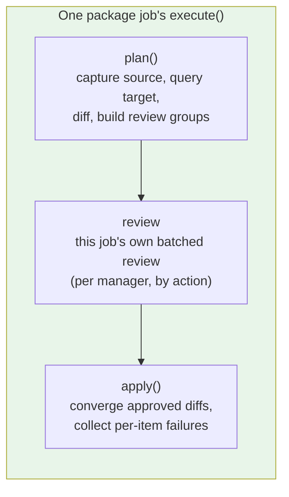

# Package Sync Specification

**Domain Code**: `PKG` (Package Management Sync, Phase 2)

## Navigation

- [System Documentation](_index.md)
- [Architecture](architecture.md)
- [Data Model](data-model.md) — item identity, the machine-local decision file and the install-snippet registry
- [Core Spec](core.md)
- [Package sync (user guide)](../jobs/package-sync.md)
- [Package sync requirements](../planning/Package%20sync%20requirements.md) — the user-viewpoint requirements this spec implements

Four `SyncJob`s — `apt_sync`, `snap_sync`, `flatpak_sync`, `manual_installs_sync` — replicate *what is installed* (apt packages plus the `/etc/apt` repository state they depend on, snaps, flatpaks, and the things no package manager can reproduce) rather than user data. The convergence model they implement is ADR-020: the source captures a manifest, the target diffs its own state against it, and each ecosystem's own tooling does the converging.

The three package-manager jobs sit in the orchestrator's job-execution phase **ahead of `folder_sync`**, and the ordering is load-bearing: apps must exist before their data lands on top of them. It is decisive for `flatpak_sync`, where `flatpak install` must create `~/.local/share/flatpak` before `folder_sync` would otherwise place `~/.var/app` content there, and it keeps package postinst defaults from overwriting real synced config for every package job.

## Shared core contract (`PackageSyncJob`)

`PackageSyncJob` is an abstract `SyncJob` every package-manager job subclasses. It declares two abstract hooks a concrete job implements:

- `plan(diff)` — capture the source's manifest, query the target, diff the two, and build this job's review groups. Read-only. Each manager writes its own: what a diff even IS differs per ecosystem, so there is no base implementation to inherit — only the pieces every implementation uses (`filter_inert` on the way in, `_drop_inert_diffs` on the way out, `_build_review_groups` at the end).
- `converge(diff)` — apply one approved diff on the target. May raise `ConvergeItemFailed` to refuse an item without attempting its mutating command (e.g. a transaction-safety guard), or return a `CommandResult` whose non-zero exit code is treated as a per-item failure the same way.

What the base class holds is what all four managers genuinely share: the plan/review/apply order, the machine-local decision-file rules, the review grouping and the converge loop. A manager's own item shapes, its own diff and the facts only it can collect live in that manager's module — a base class holding one manager's logic makes the other three inherit a surface they never use.

In return, the base class guarantees:

- **Planning is read-only.** `plan()` issues only read commands on both machines; nothing may mutate either machine until a review has been accepted.
- **Each job's review precedes its own changes.** A job's `execute()` runs its own plan, review and apply in order and applies nothing before its own review returns — a structural property of the single `execute()`, not a convention, and not owned by any outside component. For `apt_sync` this is also exactly one review per run (ADR-020 D-24): a package's classification depends on the source's origins, which no run mutates, and the one fact that does depend on what the run wrote is checked by D-35's origin verification and reported as a per-item failure rather than re-asked.
- **Per-item continue-on-failure.** `apply()` attempts every approved diff, collects failures rather than stopping at the first one, and raises once at the end (`PackageItemFailures`) naming every item that failed, so one bad item never blocks the rest of the same job's approved work.
- **A read that did not answer fails the job; an answer of "nothing" is data** (ADR-022). `require_answer` (`packages/probes.py`) raises `ProbeFailed` for a read whose result would otherwise be parsed as machine state — an empty manifest reads as "that machine has nothing" and proposes removing everything on the other one. `ProbeFailed` is deliberately not a `ConvergeItemFailed`: it escapes the per-item loop above and fails once, naming the host, the command and the tool's own stderr. The discriminator is per command and measured, not assumed — most reads use the exit code, `sha256sum` over an empty keyring glob and `dpkg --search` over deliberately-unowned paths exit non-zero in their normal case and are left unguarded, and the two `find` commands whose exit code cannot separate "absent" from "unreadable" are shaped so it can. Until GitHub issue #220 lands, a job-level failure aborts the whole run.
- **Dry-run.** `--dry-run` produces the same plan and review as a real run but issues zero mutating commands (ADR-014).
- **Per-action confirmation.** With `--confirm-each-command`, every modification a job makes is shown verbatim and requires an explicit proceed or abort before it runs. See [Per-action confirmation](core.md#per-action-confirmation).
- **FULL/INFO logging split.** Per-item convergence detail logs at `FULL`; per-job summaries (counts, overall result) log at `INFO` — the same split `folder_sync` already follows.

## Plan, review and apply inside each job's own execute()

Each package job runs plan then review then apply inside its own `execute()`, and applies nothing until its own review returns:

- **plan** — capture the source's manifest, query the target's own state, diff the two, build this job's own review groups. Read-only: nothing here may mutate either machine. Each manager implements this itself.
- **review** — present this job's own batched review, grouped by action, batched per manager and never across managers. Installs and removals show as separate groups with removals labelled as removals, and every row of a removal group starts at skip-once, so a bulk confirm can never silently delete.
- **apply** — converge only the diffs the user approved, one item at a time, collecting per-item failures rather than stopping at the first one.

There is no cross-manager review owner and no coordinator between the jobs. The jobs are deliberately independent — separate enable flags, config, validation, failure isolation and progress — so a single owner reviewing every enabled manager at once would contradict that independence, and the intended UX is one batched review per manager rather than one review for the whole fleet of managers. The orchestrator's job loop runs the jobs sequentially, so `apt_sync` reviewing and converging before `snap_sync` even starts is correct behaviour, not a violation: each job's own review still precedes every change that job makes.

## Source/target split

Capture and every decision (what to install, what to mark machine-specific, how to resolve an unreproducible item) happen on the **source**. The target only answers read-only state queries during plan and executes converge commands during apply — it never decides anything on its own. This matches ADR-002's stateless-target model: the target exposes discrete, stateless operations that the source orchestrates over SSH, never a persistent daemon holding its own decision state.

## `apt_sync`

- **Covers**: the manually-installed apt package set (`apt-mark showmanual`, not the full dpkg selection — apt resolves dependencies on the target), plus the repository state that governs where packages come from: sources, pins and apt config under `/etc/apt`. Signing keys are kept correct alongside the repositories that reference them, but are not items and are never reviewed. Unreproducible-item detection is NOT here: D-18 moved both the detection and the `UNREPRODUCIBLE` item class to `manual_installs_sync`.
- **Excludes**: packages whose installed version comes from no configured repository — a bare `.deb` installed with `dpkg --install`. `capture_source_items` runs the same `packages_installed_from_no_repository` test `manual_installs_sync` runs (the shared `packages/apt_policy.py` parser, never a shared *result* — D-15/D-16 keep the jobs independent) and drops those names from the manifest. Excluding at capture rather than at diff or review time is what makes them structurally invisible to this job in one place: no `ItemDiff`, no review group, no `apt-get --dry-run` collateral simulation, no origin classification. Since `manual_installs_sync` carries its own enable flag and `apt_sync` may not consult it (D-15), enabling `apt_sync` alone leaves these packages replicated by nobody — a known consequence of the ownership split, not a defect in either job.
- **Item classes**: `APT_PACKAGE`, `APT_HOLD` and `APT_CONFIG` in every direction; `APT_SOURCE` and `APT_PIN` in the REMOVAL direction only, on the two-answer screen (`REPO_REMOVAL_REVIEW_ACTION`) that is never recordable. Repository adds, repository overwrites, pin adds and pin updates are not items at all: they are derived from the packages approved from them, plus the always-synced `preferences.d` and distribution buckets (ADR-020 D-34/D-36/D-38). Signing keys have no `ItemClass` at all.
- **Preconditions**: `apt-mark` on both machines; passwordless sudo on the source (reading `/etc/apt` state needs root even though the source is read-only) and on the target; a free dpkg frontend lock on the target — a lock held by e.g. `unattended-upgrades` is reported rather than raced against.
- **Converges by**: derived `/etc/apt` writes first (keyrings, then pins and approved apt config, then the distribution files, then the derived repository adds and overwrites, then the approved removals, then unused-keyring collection), then exactly one `apt-get update`, then `apt-get install`/`apt-get remove` per approved package (never `purge`), each preceded by a transaction simulation that refuses the real command if it would touch an unapproved package. The `/etc/apt` group is transactional — a failed metadata refresh restores every file the group touched. A derived write has no item of its own, so a failure is recorded against its destination path and charged to every approved package whose origin depended on it (D-39).
- **Origin enforcement** (ADR-020 D-35): after the run's single `apt-get update` and before its first install, one batched `apt-cache policy` re-reads the target's candidate origins for the approved install set. An install apt would satisfy from none of the source's origins fails as its own item (D-27), naming both origins. Plan-time classification only decides what repository work to derive; this is what decides what may be installed, so a repository that failed to land or a pin that never won cannot ship a different vendor's package. Packages the source has only from its own distribution files are exempt — two machines on different Ubuntu mirrors are one vendor.
- **Ubuntu Pro / ESM gate** (ADR-020 D-38): `ubuntu-esm-apps.sources` and `ubuntu-esm-infra.sources` are in the always-synced distribution bucket, and writing them to an unattached target leaves an apt whose next install of an ESM-covered package fails with a 401 on the `.deb` — the indexes are public, so the refresh succeeds and the ESM suites win candidate selection. When the always-sync bucket would write either file (present on the source, absent or different on the target), `plan()` probes the target with `pro status --format json` and, if it reports unattached, asks through `Reviewer.ask_gate` with exactly two answers: attach now, which re-probes rather than trusting the answer and may be given any number of times, or skip `apt_sync` for this run, which raises `JobSkipped`. A run with no TTY takes the skip. The gate sits in `plan()`, immediately after the origin-state capture that supplies its trigger digests and before any review group is built, so one answer ends the job before the user is asked to decide anything else, and the whole question precedes the job's first mutating command. Every probe failure mode — no `pro` binary, a non-zero exit, output that will not parse — answers "unattached", because that is the recoverable one. The probe payload also names the subscriber's account, so nothing but the parsed boolean may be logged, shown in the prompt, or put in the `JobSkipped` reason. `--dry-run` never prompts: it logs one WARNING naming both files, the unattached target, and that a real run would skip `apt_sync` entirely.
- **Collateral rehearsal admission** (ADR-020 D-40, ADR-022 D-01): the plan-time `apt-get --dry-run` batch names only packages the target's own `apt-cache policy` gave a candidate for. A D-34 class-3 install — the repository that supplies it is derived from the package's own approval and written during converge — is excluded on that evidence, never on the simulation's exit code, because apt refuses the whole batch on one unlocatable name and would take every other package's protection down with it. Those packages are covered by the apply-time per-item rehearsal instead, after `/etc/apt` has converged: unapproved manual collateral fails that one item rather than raising a plan-time install-anyway/skip/abort question the facts do not yet exist for.
- **Collateral attribution** (ADR-020 D-40): the batched rehearsal states a transaction, not its causes, so a collateral item found in it is narrowed by rehearsing each candidate on its own and recording the candidates whose own transaction reproduces it. Only a batch that found manual collateral pays that — one extra `apt-get --dry-run` per candidate in that direction, and none on the clean runs. `skip` on a collateral item downgrades exactly those candidates to `SKIP_ONCE`, and only where they were approved: the same decision map is what `_record_permanent_skips` reads, so overwriting a `SKIP_ALWAYS` would silently drop the machine-local mark the user asked for. Collateral no single candidate reproduces is attributed to the whole batch.
- **A read that did not answer is not a finding about a package** (ADR-022). Every read this job's decisions rest on fails the job once, naming the command and the tool's own stderr, rather than letting an empty result be parsed as machine state: both manifests, the version lookup, the hold sets, the source and target `apt-cache policy` reads, the target's manual set behind collateral protection, the three `/etc/apt` directory digest captures, the source-file scan, the single-file content reads behind the conflict and removal reviews, the removal-impact probe and the post-refresh origin verification. Two reads are deliberately left unguarded and say so at the call site: the single-file `sha256sum` for `/etc/apt/sources.list`, whose non-zero exit on an absent path IS the answer the caller wants, and the Pro probe, whose every failure mode is defined to mean "unattached". An empty *answer* is still data: no held packages, no pins and no third-party keyrings are ordinary. Only apt's answer decides a package, so a name an *answered* `apt-cache policy` printed no block for is still refused as its own item. Two of this job's `apt-cache policy` reads additionally fail when they print no block at all — the source's own installed set, and the post-refresh verification over names this run has already established the target has a candidate for — which is the one place emptiness is treated as silence.
- **First-sync scope** (ADR-015): "apt packages (manually-installed set)", via `apt-get install/remove per item, after review`.

## `snap_sync`

- **Covers**: installed snaps, converged to the source's exact revision and tracking channel. There is no origin model and there will not be one (ADR-020 D-42): snap has one store, and a name resolves to one snap-id resolves to one publisher through a canonical-signed `snap-declaration` snapd validates itself, so there is no second `firefox` for the target to install by accident and nothing for D-34's derivation to reach. The provenance variable that remains is which revision of that one snap is installed and which channel it tracks, and D-06 converges both. No store-identity or store-proxy check exists or is planned — a brand store and a store proxy are device-provisioning facts, not per-snap facts, and neither is replicable.
- **Item classes**: `SNAP` and `SNAP_HOLD` (`SNAP_CHANNEL` exists in the enum but a channel-only retrack still diffs as `SNAP`, so a review group derives one unambiguous action verb).
- **Preconditions**: `snap` on both machines; passwordless sudo on both, since the target installs snaps and both ends get the sync-window auto-refresh pause.
- **Converges by**: install or refresh at an explicit revision, a channel switch after every install and whenever the channel differs, and removal that preserves snapd's own pre-removal snapshot. No command in this job ever sets a hold.
- **First-sync scope**: "installed snaps (name, channel, revision)", via `snap install/refresh/remove per item, after review`.

## `flatpak_sync`

- **Covers**: installed flatpak refs and their remotes, per user/system installation scope. Scope and the ref's `<arch>/<branch>` are both folded into item identity, so the same application installed in two scopes — or on two branches — produces independent installs and removals, never a single "change". Origin deliberately stays out of identity: `flatpak install <other remote> <ref>` on an already-installed ref refuses, so the install half of an origin "move" could never run — which is exactly why a ref present on both machines from different remotes is `ORIGIN_MISMATCH`/`REPORT_ONLY` (D-41), a diff CLASS over the single item both machines share rather than two items. It outranks a version difference on the same ref, as apt's does on the same package: two vendors' builds share no version scale, so reporting the numbers would state a difference of degree where the real difference is of provenance. The comparison runs on the remotes' URLs, never their names — the same rule the install-time checks below follow — so a target `flathub` pointing at the beta repo is caught and a remote the two machines merely named differently is not; when a machine's ref names a remote it no longer configures there is no URL to compare and the names decide, which reports two differing names and stays quiet on agreeing ones.
- **Item classes**: `FLATPAK_REF` and `FLATPAK_MASK` in every direction; `FLATPAK_REMOTE` in the REMOVAL direction only, on its own two-answer screen (`REPO_REMOVAL_REVIEW_ACTION`) that is never recordable. Remote adds and URL/trust changes are not items at all — they are derived from the refs approved from them (ADR-020 D-41), including the remote an approved app's runtime comes from. A remote feeding no approved ref does not travel, and there is no distribution-remote exemption: a fresh flatpak install configures zero remotes, so even Flathub travels only as a consequence.
- **The one derived change that is put to the user** (D-41, D-37's rule in a second ecosystem): a derived repoint whose URL or verification setting differs is silent unless a ref the TARGET recorded skip-always takes that remote as its origin in that scope. Then it becomes a `flatpak:conflict:<scope>:<name>` entry on the two-answer conflict screen (`REPO_CONFLICT_REVIEW_ACTION`) carrying both configurations, target first, one differing facet per line rather than a computed diff — a remote is a handful of named values, not a file body. Machine-specific is the trigger, not target-only: a skip-always ref produces no diff in any run, so nothing else in the review would mention it, while an ordinary target-only ref already has a removal line. A key-only difference is never a trigger, because `--gpg-import` merges into the remote's keyring rather than replacing it and so can neither move a ref's origin nor withdraw trust. Skip-once keeps the remote out of the write set but not out of the D-39 attribution map, so every approved ref that needed the source's URL fails quoting the decision rather than the symptom. Neither the conflict id nor a `flatpak:remote:` id can reach a decision file in any direction.
- **Preconditions**: `flatpak` on both machines (a missing binary is a clean validation error, not an exception — flatpak ships in no default Ubuntu 24.04 install); passwordless sudo on the target, but **only** when a system-scope ref or remote is actually in play on either machine, so a user-scope-only sync never has to ask for root.
- **Converges by**: `apply()` writes the derived remotes before the base converge loop reaches its first ref (a derived write is not a diff, so nothing in that loop would reach it, and this is the whole of D-14's ordering guarantee); a derived write that fails has no item of its own and fails every approved ref that named it, quoting flatpak's own stderr (D-39); every `flatpak install`/`flatpak uninstall` names the full ref, since the bare application id is unresolvable on a remote or a machine holding two branches of it; each ref and remote operation privileged if and only if its own scope is `system`. A ref's origin is checked against the target's real state rather than inferred, twice: before the install the target's remote list is re-read and the origin remote must carry the source remote's URL and verification setting (a same-named remote pointing elsewhere serves another vendor's build at exit 0, and `remote-add --if-not-exists` exits 0 without changing an existing URL, so neither the plan-time query nor this run's own exit codes are admissible), and after the install the ref's landed origin is read back off `flatpak list` and resolved to a URL again. Either refusal is a per-item failure naming both URLs. A remote offered for deletion is not refused that way — its review entry names the target refs that still have it as their origin, so the consequence is stated before approval. A derived remote whose SOURCE carries a ref filter is provisioned unfiltered and warns once, in a dry run too: measured on Flatpak 1.14.6, `remote-modify --filter=<path>` stores the path verbatim as `xa.filter` and reports a `filtered` token in `options`, so the filter's content is an unvalidated local file outside the ostree store and is not repository-or-key material this job can carry. `is_filtered` is deliberately excluded from `FlatpakRemoteItem`'s equality, since no command could converge it and a differing value would otherwise provoke a `remote-modify` that changes nothing on every run.
- **First-sync scope**: "installed flatpak refs (per user/system scope)", "flatpak mask patterns (per scope)" and — as a stated consequence rather than a reviewed item — "the flatpak remotes those refs come from (per scope, added or repointed without a review line)".

## `manual_installs_sync`

- **Covers**: everything no package manager can reproduce — apt packages whose installed version comes from no configured repository (only dpkg's own status file accounts for them) and unowned installs under `/usr/local`/`/opt` — plus the install-snippet registry. It carries its own `sync_jobs` enable flag, so disabling `apt_sync` never silently disables manual-install detection. The bare-`.deb` half is this job's EXCLUSIVE territory: `apt_sync` excludes the same packages at capture, so disabling this job leaves them replicated by nobody.
- **Item classes**: `UNREPRODUCIBLE`.
- **Resolution**: an unreproducible item ends a run resolved by a snippet, a machine-specific mark, or a deliberate skip-once — skip-once is a valid resolution, not an unresolved state. A non-interactive run records nothing and does not fail on undecided items alone (D-21/D-26).
- **Snippet transport**: after its own review, the job pushes the registry to the target itself, so a snippet authored on the fly during that review reaches the target and is replayed in the same run. The registry never travels via `config_sync` (which runs before any review) or `folder_sync` (a user-controlled job).
