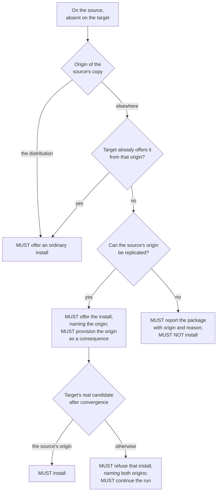

# Package Sync Specification

**Domain Code**: `PKG` (Package Management Sync)

Seven `SyncJob`s — `apt_sync`, `snap_sync`, `flatpak_sync`, `manual_deb_sync`, `manual_snap_sync`, `manual_flatpak_sync`, `manual_installs_sync` — replicate *what is installed*: apt packages plus the `/etc/apt` state they depend on, snaps, flatpaks, and the software no package manager can reproduce. Application data is `folder_sync`'s.

Every article below is checkable independently. IDs are `PKG-FR-*` for obligations and `PKG-NG-*` for non-goals; MUST/MUST NOT/SHOULD/MAY carry RFC 2119 force. Where this document and any downstream (job guide, code, tests, ADR) disagree, this document wins.

Each article carries `Lineage:` (its origin — a user-requirements section or a GitHub issue) and, where a specific class or module implements it, `Impl:`. Rationale for counter-intuitive articles is in [package-sync-rationale.md](../adr/considerations/package-sync-rationale.md), keyed by article ID.

## Navigation

- [Package sync — user requirements](../planning/package-sync-user-requirements.md) — intent
- [Package sync (user guide)](../jobs/package-sync.md) — what a user turns on and gets asked
- [ADR-020](../adr/adr-020-declarative-package-convergence.md) — the decisions
- [ADR-021](../adr/adr-021-what-the-log-records-and-withholds.md) — logging content rules
- [ADR-022](../adr/adr-022-broken-tool-fails-fast-bad-data-is-handled.md) — read-failure attribution
- [Rationale](../adr/considerations/package-sync-rationale.md) — the counter-intuitive articles

## Shared core

`PackageSyncJob` is the abstract base. Every concrete package job implements two hooks:

- `plan()` — read-only. Capture the source's manifest, query the target, diff, build review groups.
- `converge(diff)` — apply one approved diff on the target. Raises `ConvergeItemFailed` (per-item failure), `ConvergeItemDeclined` (user withdrew after review), or returns a `CommandResult` whose non-zero exit is treated as a per-item failure.

The base guarantees: planning is read-only; each job's review precedes its own changes; per-item continue-on-failure via `PackageItemFailures`; ADR-022 `ProbeFailed` propagation; dry-run parity; per-command confirmation; the FULL/INFO logging split.

`UnreproducibleSyncJob` sits between the base and the four snippet jobs. It holds the `UnreproducibleItem` shape, the plan pipeline (detect on both machines → filter through both machines' marks → diff on presence, then version → classify against the source's registry), the review grouping, the converge loop, and the shared registry with its push and consent question. A subclass supplies `capture_source_items()`, `query_target_items()`, `installed_versions()`, `removal_command()`, plus its own `validate()` and `describe_first_sync_scope()`.

## Scope

Decomposes [What package sync is for](../planning/package-sync-user-requirements.md#what-package-sync-is-for).

- **PKG-FR-OPT-IN**: Every package job MUST ship disabled and MUST be enabled individually in configuration.  
  Lineage: 002-package-sync  
  Impl: `sync_jobs` defaults in `config/schema.py`
- **PKG-FR-JOB-INDEPENDENCE**: Each package sync job MUST be enableable, reviewable and failable on its own. Enabling one MUST NOT enable another, and no package sync job's behaviour may depend on whether another package sync job is enabled.  
  Lineage: 002-package-sync, ADR-020-D-SEVEN-JOBS
- **PKG-FR-JOB-ORDER**: Every package job MUST run before `folder_sync`, and the system MUST refuse to start when they are ordered otherwise.  
  Lineage: 002-package-sync, ADR-020-D-SEVEN-JOBS  
  Impl: `Orchestrator._check_package_jobs_precede_folder_sync`
- **PKG-FR-APT-SCOPE**: `apt_sync` MUST cover the manually-installed apt package set, the repositories and pins that govern where those packages come from, apt's own behavioural configuration, and apt holds. Packages apt installed automatically to satisfy dependencies MUST NOT be items.  
  Lineage: 002-package-sync, ADR-020-D-VERSION-POLICY  
  Impl: `apt_sync/` (base scope in `_covers`)
- **PKG-FR-SNAP-SCOPE**: `snap_sync` MUST cover installed snaps with their revision, tracking channel, confinement mode and per-snap refresh holds.  
  Lineage: 002-package-sync  
  Impl: `snap_sync/`
- **PKG-FR-FLATPAK-SCOPE**: `flatpak_sync` MUST cover installed flatpak applications per flatpak installation scope, the remotes those applications need, and mask patterns per scope. An application no remote can reproduce (`PKG-FR-FLATPAK-UNREPRODUCIBLE`) is outside that cover.  
  Lineage: 002-package-sync  
  Impl: `flatpak_sync/`
- **PKG-FR-MANUAL-SCOPE**: What no package manager can reproduce MUST be covered, by one job per kind of finding: `manual_deb_sync` covers apt packages whose installed version comes from no repository the machine has configured; `manual_snap_sync` covers sideloaded snaps; `manual_flatpak_sync` covers flatpak applications whose origin names no remote configured in that application's installation scope; `manual_installs_sync` covers software under `/usr/local` and `/opt` that no package owns. Each MUST resolve a finding through the one shared install-snippet registry. The filesystem scan MUST cover `/opt`, every entry directly under `/usr/local`, and the entries of `/usr/local`'s `bin`, `sbin`, `lib`, `games` and `src`; it MUST NOT cover `/usr/local`'s `etc`, `include`, `man` or `share`. A finding may be a file, a directory or a symlink; it MUST be named at the path where it was found and MUST NOT be descended into. It is NOT a finding if a package owns it, if it is one of the entries `base-files` creates directly under `/usr/local`, or if it is a directory with no file anywhere beneath it.  
  Lineage: 002-package-sync, GitHub #185, #221  
  Impl: `manual_deb_sync/`, `manual_snap_sync/`, `manual_flatpak_sync/`, `manual_installs_sync/`; skeleton hardcoded as `_USR_LOCAL_SKELETON`
- **PKG-FR-DEB-OWNERSHIP**: Software installed from a hand-downloaded `.deb` MUST belong to `manual_deb_sync` alone. `apt_sync` MUST NOT produce an item, a review line or an install for it in any configuration.  
  Lineage: 002-package-sync, GitHub #185  
  Impl: `apt_sync.capture_source_items` and `capture_target_items` drop names matching `packages/apt_policy.packages_installed_from_no_repository`
- **PKG-FR-DATA-BOUNDARY**: No package job may sync application data. Data belongs to `folder_sync`.  
  Lineage: 002-package-sync

## Convergence model

Decomposes [The model](../planning/package-sync-user-requirements.md#the-model).

- **PKG-FR-SOURCE-INTENT**: The source machine's state MUST be the only statement of intent, and the target MUST NOT decide anything. A sync MUST NOT change what software the source has, nor where it gets it from. The writes a sync does make on the source are exactly four, each required by an article of its own: a machine-specific mark (`PKG-FR-MACHINE-SPECIFIC`), a snippet the review authored (`PKG-FR-MANUAL-SAME-RUN`), the snap refresh pause (`PKG-FR-SNAP-REFRESH-PAUSE`), and the apt update-timer pause (`PKG-FR-APT-TIMER-PAUSE`). All four are covered by `PKG-FR-CONFIRM-EACH`.  
  Lineage: 002-package-sync
- **PKG-FR-MANAGER-CONVERGES**: Software MUST be replicated by having the target's own package managers install and remove it. The system MUST NOT copy a package manager's database, store or unpacked files between machines.  
  Lineage: 002-package-sync, ADR-020-D-CONVERGE-MODEL
- **PKG-FR-APT-IDENTITY**: An apt package MUST be identified by name and origin together. The system MUST NOT satisfy an approved install from an origin the source does not use.  
  Lineage: 002-package-sync, ADR-020-D-ORIGIN-VERIFY  
  Impl: `apt_sync.origins.OriginClassifier`
- **PKG-FR-DISTRO-ORIGIN**: All origins a machine's distribution source files declare MUST count as one origin, computed per machine.  
  Lineage: 002-package-sync, ADR-020-D-ORIGIN-VERIFY  
  Impl: `OriginPlan.distribution_origins`
- **PKG-FR-SNAP-IDENTITY**: A snap MUST be identified by name alone, and the system MUST NOT ask the user anything about where a snap comes from.  
  Lineage: 002-package-sync, ADR-020-D-SNAP-NO-DERIVATION
- **PKG-FR-FLATPAK-IDENTITY**: A flatpak application MUST be identified by its installation scope and its full reference including branch. The same application in two scopes, or on two branches, MUST be treated as two independent items. This identity MUST hold for `manual_flatpak_sync` too.  
  Lineage: 002-package-sync, ADR-020-D-FLATPAK-REMOTES  
  Impl: `FlatpakRefItem.item_id`
- **PKG-FR-FLATPAK-ORIGIN-NOT-IDENTITY**: A flatpak application's origin remote MUST NOT be part of its identity.  
  Lineage: 002-package-sync
- **PKG-FR-VERSION-FLOAT**: For apt and flatpak the system MUST install by name and accept whatever the target's own repositories offer. A version difference MUST be reported and MUST NOT be forced, upgraded or downgraded.  
  Lineage: 002-package-sync, ADR-020-D-VERSION-POLICY
- **PKG-FR-SNAP-REVISION**: For snap the system MUST converge the target to the source's exact revision and tracking channel.  
  Lineage: 002-package-sync, ADR-020-D-SNAP-REVISION
- **PKG-FR-BLOCKS-DERIVED**: An apt hold, a snap refresh hold and a flatpak mask MUST each replicate from source to target without review, added and removed alike. None may be a review item, and none may be markable machine-specific. Where the software a block applies to is itself an item this run, the block MUST follow that item's own outcome: a freeze block (apt hold, snap refresh hold) MUST NOT be registered where its install was declined or failed, and MUST be reported as declined rather than as a failure where the user was the one to decline. A flatpak mask is not such a freeze and MUST land regardless. A machine-specific mark on the software MUST make its blocks inert with it.  
  Lineage: 002-package-sync, ADR-020-D-ITEM-MODEL  
  Impl: `BLOCK_ITEM_CLASSES`; `PackageConverger._hold_refusal`; `SnapSyncJob._install_was_declined`  
  Rationale: see [package-sync-rationale.md#pkg-fr-blocks-derived](../adr/considerations/package-sync-rationale.md#pkg-fr-blocks-derived)

## Consent

Decomposes [The model](../planning/package-sync-user-requirements.md#the-model) and [Decisions and their memory](../planning/package-sync-user-requirements.md#decisions-and-their-memory-machine-specific).

- **PKG-FR-REVIEW-FIRST**: A job MUST NOT modify the target before the user has approved the changes that job proposes.  
  Lineage: 002-package-sync  
  Impl: `PackageSyncJob.execute` runs plan → review → apply
- **PKG-FR-ONLY-APPROVED**: A job MUST apply only what the user approved.  
  Lineage: 002-package-sync
- **PKG-FR-BATCHED**: A job SHOULD batch its questions: recurring decisions SHOULD be presented together and settleable in a single pass, with no work between them. Batching is a preference — a job MUST NOT make its logic more complicated or wrong, and MUST NOT omit anything, to spare the user a round of questions. Correctness outranks batching. A question that must show the user something before it can be answered — a repository or pin file being deleted, a repository or remote conflict, a collateral package, an unreproducible item — does not fit a batch and is asked on its own.  
  Lineage: 002-package-sync, ADR-020-D-BATCHED-REVIEW  
  Impl: `_build_review_groups` groups by `(action, item_class)` per manager
- **PKG-FR-ASK-AGAIN**: A job MAY ask again, including after it has begun changing the target, where the answer rests on facts this run's own changes invalidated or that could not be established before the first change.  
  Lineage: 002-package-sync, ADR-020-D-BATCHED-REVIEW  
  Impl: `plan_second_round()`; `LateCollateral.ask_about_drift`
- **PKG-FR-CONSENT-BEFORE-CHANGE**: Every consent a job needs for a change MUST be obtained before that change is made.  
  Lineage: 002-package-sync
- **PKG-FR-ASK-ABOUT-SOFTWARE**: The user MUST be asked about software, and MUST NOT be asked separately about machinery whose necessity follows from an approved package.  
  Lineage: 002-package-sync, ADR-020-D-APT-CONFIG-DERIVED
- **PKG-FR-ASK-WHEN-NOT-DERIVABLE**: Where an answer does not follow from any approved package, the system MUST ask. Every such question is: `PKG-FR-APTCONF`, `PKG-FR-ESM-GATE`, `PKG-FR-COLLATERAL-MANUAL`, `PKG-FR-REPO-CONFLICT`, `PKG-FR-FLATPAK-REPOINT`, `PKG-FR-REPO-DELETE`, `PKG-FR-PIN-DELETE`, `PKG-FR-REGISTRY-CONSENT`, `PKG-FR-MANUAL-OPT-SHAPE`, `PKG-FR-MANUAL-RESOLUTION`, `PKG-FR-MANUAL-VERSION`, `PKG-FR-MANUAL-CONVERGE-LOOP`, `PKG-FR-MANUAL-REMOVE`.  
  Lineage: 002-package-sync
- **PKG-FR-NAME-THE-MACHINES**: Everything the user reads at a question — its title, item details, warnings, the question, its answers — MUST identify each machine by its hostname. "source" and "target" MUST NOT appear. The per-command confirmation names the machine in its heading. Log records already carry the machine as a field of their own.  
  Lineage: 002-package-sync  
  Impl: `PackageSyncJob.machines` (`packages.items.Machines`), enforced by `review_items`, `TerminalUIReviewer`, `TerminalUIStepGate`
- **PKG-FR-EFFECT-NOT-MECHANISM**: Every answer offered MUST state its own effect on a named machine rather than the mechanism that produces it. Every question MUST state what the change would do before it is answered. The decisions' internal names (apply, skip once, skip always) MUST NOT be the words the user reads: an answer MUST be offered as the act it performs, and MUST carry a sentence naming the machine and duration; a permanent answer states that the user will not be asked again.  
  Lineage: 002-package-sync  
  Impl: `_hints` composes answer sentences from `_ACTION_VOCABULARY`
- **PKG-FR-ANSWERS-AS-A-SET**: The answers to one question MUST read as a set: one grammar across all of them, and the machine named in every answer's sentence or in none.  
  Lineage: 002-package-sync
- **PKG-FR-REMOVAL-DISTINCT**: Approving the removal of software MUST require a gesture distinct from approving installs, MUST NOT be the default, and MUST be presented so that the user is told the approval deletes something.  
  Lineage: 002-package-sync  
  Impl: removal groups start at skip-once; `_build_review_groups`
- **PKG-FR-SKIP-ONCE**: The user MUST be able to decline any reviewed item for the current run only. Nothing MUST be recorded, and the item MUST be offered again on the next sync.  
  Lineage: 002-package-sync, ADR-020-D-DECISION-SHAPE
- **PKG-FR-MACHINE-SPECIFIC**: The user MUST be able to mark a reviewed item as specific to one machine. A marked item MUST NOT be synced to any other machine, MUST NOT be removed or overwritten by a sync from any other machine, and MUST NOT be proposed in any later review. Where an approved change would touch it regardless, the user MUST be asked (`PKG-FR-COLLATERAL-MARKED`). The mark MUST be recorded on the HOLDING MACHINE and MUST NOT be synced. The holding machine is the one whose copy of the item the mark keeps: for an item only one machine has, that machine; for an item both machines have and differ over, whichever the user named (`PKG-FR-MARK-SIDE`). Where either machine could be the holder, a later run MUST read both machines' records before deciding an item is unmarked.  
  Lineage: 002-package-sync, ADR-020-D-DECISION-SHAPE, ADR-020-D-DECISION-FILE  
  Impl: `~/.config/pc-switcher/<manager>.decisions.yaml`; `state.marks_on_either`
- **PKG-FR-MARK-LIFETIME**: A machine-specific mark MUST last exactly as long as the item it names is on its holding machine. Once that machine no longer has the item, the mark MUST be dropped, and the run MUST say which marks it dropped. The check MUST be a positive statement that the machine does not have the item, never absence from a narrower inventory the sync derived; a check that does not answer MUST drop nothing.  
  Lineage: 002-package-sync, ADR-020-D-DECISION-FILE  
  Impl: `PackageSyncJob._prune_dead_marks` calls each manager's `observe_absent_marks`; `_load_live_decisions` filters in memory at plan time
- **PKG-FR-NO-MARK-ON-ORIGIN**: An apt repository and an apt pin MUST NOT be markable machine-specific, whether they are being deleted or overwritten. Declining either MUST record nothing. A flatpak remote is never a review item.  
  Lineage: 002-package-sync
- **PKG-FR-NO-MARK-ON-REPORT**: A report-only finding MUST NOT be markable machine-specific.  
  Lineage: 002-package-sync
- **PKG-FR-NO-MARK-ON-SNAP-REVISION**: A snap's difference of revision or channel MUST NOT be markable machine-specific. It MUST be offered with exactly two answers — converge it, or skip for this run — and MUST be worded as the effect it has on the named target. Declining MUST record nothing.  
  Lineage: 002-package-sync, ADR-020-D-DECISION-SHAPE
- **PKG-FR-ABORT**: The user MUST be able to abort the whole sync at any question, and an abort MUST NOT be read as declining a single item.  
  Lineage: 002-package-sync
- **PKG-FR-APPLY-FLAGS**: The command line MUST offer two options that answer a package review in advance, one per direction. `--apply-package-installs` applies every item that ADDS software (installs, adds, enables, converges to source content). `--apply-package-removals` applies every item that TAKES software away (removes, deletes, disables, deletes repositories and pins, loses a protected package). Each MUST answer as the source dictates, whatever answer the item's own screen would have started at. They MUST bind every package job and nothing else, including reviews put after the run has begun changing the target.  
  Lineage: 002-package-sync, GitHub #245  
  Impl: `review.ReviewPolicy`; `policy_decision`; `review.policy_answers_any`
- **PKG-FR-APPLY-FLAGS-SCOPE**: Neither option may answer a question the source's state cannot settle: `PKG-FR-REPO-CONFLICT`, `PKG-FR-APTCONF`, `PKG-FR-MANUAL-SCOPE` (`PKG-FR-SNIPPET-VERBATIM`), `PKG-FR-ESM-GATE`, `PKG-FR-REGISTRY-CONSENT`, and anything a package job asks that is not a review item. Each MUST be left where a run with nobody to ask leaves it — declined for this run and named — except the registry transfer, which MUST still abort the run. A report-only finding is unaffected.  
  Lineage: 002-package-sync
- **PKG-FR-APPLY-FLAGS-NO-MARK**: Neither option may record a machine-specific mark, and neither may author a snippet.  
  Lineage: 002-package-sync  
  Impl: `Decision.APPLY` only, no permanent decisions; `_record_permanent_skips` gates on `was_interactive`
- **PKG-FR-APPLY-FLAGS-OUTCOME**: A job whose review these options answered MUST report its outcome on what it did — success where answers were carried out — rather than skipped. A job they answered NOTHING of MUST still report skipped. Where an item they answered depends on work a review normally gates, that work MUST still happen: a manual install applied this way MUST have its snippet registry transferred before the replay reads it.  
  Lineage: 002-package-sync
- **PKG-FR-CONFIRM-EACH**: Every operation that is not purely read-only MUST be covered by pc-switcher's per-command confirmation, including the decision records, the snippet registry and the snap refresh pause. An operation may bypass it only when it can change no state on the machine. Running a read under `sudo` does not make it a write.  
  Lineage: 002-package-sync  
  Impl: `executor.run_command`/`start_process`/`send_file`/`get_file` require `mutates=` unless purely read-only; enforced by `tests/unit/test_mutates_audit.py`
- **PKG-FR-MARK-SIDE**: Where an item both machines have with differing copies is marked machine-specific, the user MUST be asked which machine's own copy the mark is about, and MUST be able to answer either machine or both. Both machines MUST be offered by hostname. Naming one machine MUST record the mark there and nowhere else; naming both MUST record one on each. The question MUST be asked once for every such item of a review together, after the answers that raise it exist, and MUST NOT be asked where no human answered.  
  Lineage: 002-package-sync  
  Impl: `review._ask_mark_sides`; `ReviewOutcome.mark_sides` carries `MarkSide`  
  Rationale: see [package-sync-rationale.md#pkg-fr-mark-side-both-answer](../adr/considerations/package-sync-rationale.md#pkg-fr-mark-side-both-answer)

## Preconditions and defaults

Decomposes the validation and review paragraphs of [What happens during a sync](../planning/package-sync-user-requirements.md#what-happens-during-a-sync).

- **PKG-FR-SUDO-PRECONDITION**: Each package job MUST establish in the validation step that it has passwordless sudo wherever it needs it, and MUST fail validation naming the machine that lacks it rather than degrading.

  | Job | Source | Target |
  | --- | --- | --- |
  | `apt_sync` | required | required |
  | `snap_sync` | required | required |
  | `flatpak_sync` | none | only when a system-scope item exists on either machine |
  | `manual_deb_sync` | none | none |
  | `manual_snap_sync` | none | none |
  | `manual_flatpak_sync` | none | none |
  | `manual_installs_sync` | none | none |

  Lineage: 002-package-sync  
  Impl: each job's `validate()`
- **PKG-FR-APT-DPKG-LOCK**: `apt_sync` MUST refuse to start while the target's dpkg lock is held, and MUST NOT wait on it silently. The refusal MUST name both operations that could be holding it (a user's own package command and the system's automatic updates), MUST NOT assert which of them it is, and MUST give the remedy: wait for it to finish and run the sync again.  
  Lineage: 002-package-sync
- **PKG-FR-APT-TIMER-PAUSE**: The system's own apt update timers MUST be suspended on both machines for the duration of a run where `apt_sync` is enabled. Each machine's timers MUST be restarted afterwards, and only the timers that were running MUST be stopped and restarted. Where a machine's timer state cannot be read, that machine MUST be left untouched. Where the suspension cannot be applied, the run MUST say so and MUST continue with that machine unsuspended rather than failing. The suspension MUST undo itself, so a run that dies without cleaning up MUST NOT leave a machine's automatic updates off. Where a run finds such an undo still pending on a machine, it MUST push it past the end of its own run rather than let it fire inside one, MUST NOT carry it out while the run is starting, and MUST carry it out and clear it once the run is over. Where it cannot be carried out, it MUST be left pending.  
  Lineage: 002-package-sync  
  Impl: orchestrator `_suspend_apt_timers`, `_defer_pending_apt_timer_restore`, `_settle_outstanding_apt_timer_restore`; transient unit via `systemd-run --on-active`  
  Rationale: see [package-sync-rationale.md#pkg-fr-apt-timer-pause](../adr/considerations/package-sync-rationale.md#pkg-fr-apt-timer-pause)
- **PKG-FR-HARMLESS-DEFAULT**: Every reviewed item's default answer MUST be the action that does no harm — apply for an install, skip for anything that removes or overwrites.  
  Lineage: 002-package-sync  
  Impl: `_default_decision`; `ReviewGroup.overwrites_authored_content` set for `APT_CONFIG` CHANGE

## apt

### Installing

Decomposes [apt / Installing](../planning/package-sync-user-requirements.md#installing).

- **PKG-FR-APT-ORIGIN-DISCLOSURE**: When an approved install would come from anything other than the distribution, the user MUST be told which origin it comes from before approving it.  
  Lineage: 002-package-sync
- **PKG-FR-APT-ORIGIN-DERIVED**: Approving a package MUST carry the repository, key and pins its origin needs, without a separate question and without a further question once they land.  
  Lineage: 002-package-sync  
  Impl: `AptSyncJob.apply` writes derived `/etc/apt` state ahead of the first `apt-get install`
- **PKG-FR-APT-ORIGIN-UNREPLICABLE**: Where no repository the source has declares the package's origin, or every repository that declares it names a key the source does not hold, the system MUST report the package with its origin and the reason, MUST NOT install it, and MUST NOT substitute another origin's build.  
  Lineage: 002-package-sync
- **PKG-FR-APT-ORIGIN-VERIFY**: After repository convergence and before the first install, the system MUST verify against the target's own real state that each approved install whose origin on the source is not the distribution's own will come from the source's origin. An install that would not MUST be refused as its own failure naming both origins, and the rest of the run MUST continue.  
  Lineage: 002-package-sync, ADR-020-D-ORIGIN-VERIFY  
  Impl: batched `apt-cache policy` re-read; `OriginClassifier._verify`

### Removing and diverging

Decomposes [apt / Removing a package](../planning/package-sync-user-requirements.md#removing-a-package) and [apt / Reporting without acting](../planning/package-sync-user-requirements.md#reporting-without-acting).

- **PKG-FR-APT-REMOVE**: A package on the target that the source does not have MUST be offered for removal. Approval MUST remove the package without purging its configuration.  
  Lineage: 002-package-sync  
  Impl: `apt-get remove --assume-yes`, never `purge`
- **PKG-FR-APT-SAME**: A package present on both machines at the same version from the same origin MUST produce no item.  
  Lineage: 002-package-sync
- **PKG-FR-APT-VERSION-DIFF**: A version difference MUST be reported with both versions named and MUST NOT be acted on.  
  Lineage: 002-package-sync
- **PKG-FR-APT-ORIGIN-DIFF**: The same package installed from different origins on the two machines MUST be reported as an origin divergence naming both origins, MUST NOT be converged, and MUST take precedence over any version difference on that package. It MUST NOT be raised for a mirror difference.  
  Lineage: 002-package-sync

### Holds

Decomposes [apt / Holds](../planning/package-sync-user-requirements.md#holds).

- **PKG-FR-HOLD-WITHOUT-PACKAGE**: An apt hold naming a package that machine does not have MUST end the run, on either machine, before anything is written. The message MUST name every such hold on BOTH machines, MUST attribute each to its machine, and MUST give that machine's own `apt-mark unhold` command; it MUST say the holds have to be cleared before syncing again.  
  Lineage: 002-package-sync  
  Impl: `AptSyncJob._refuse_holds_without_their_package` raises `SyncAborted`  
  Rationale: see [package-sync-rationale.md#pkg-fr-hold-without-package](../adr/considerations/package-sync-rationale.md#pkg-fr-hold-without-package)
- **PKG-FR-APT-HELD-TARGET**: A package the target has and holds MUST NOT be proposed for install or upgrade, and MUST produce no package-level item.  
  Lineage: 002-package-sync
- **PKG-FR-APT-HOLD-VERSION**: Where the source holds a package the target lacks, the target MUST be given the source's exact version, not whatever its repositories currently offer. Where that version cannot be obtained on the target, the install MUST fail as its own item naming both versions, and MUST NOT fall back to another version. When the job is done, the package MUST be installed at the source's version and its hold MUST be registered.  
  Lineage: 002-package-sync, ADR-020-D-VERSION-POLICY  
  Impl: `AptSyncJob._held_versions`; `PackageConverger._held_version_refusal`
- **PKG-FR-APT-HOLD-INERT**: Replicating a hold MUST NOT change the package's version. A hold whose install the user declined MUST be reported as declined, not as a failure. A hold MUST fail alone only where its package's install was approved and then failed, or where the run cannot reproduce the repository that package needs.  
  Lineage: 002-package-sync  
  Impl: `PackageConverger._hold_refusal`

### Collateral

Decomposes [apt / Collateral damage](../planning/package-sync-user-requirements.md#collateral-damage).

- **PKG-FR-COLLATERAL-AUTO**: Collateral removals, downgrades and upgrades that touch only automatically-installed packages MUST proceed without asking, and MUST be named in the run's log.  
  Lineage: 002-package-sync
- **PKG-FR-COLLATERAL-MANUAL**: An approved change MUST NOT remove, downgrade or upgrade a package that is manually installed on the target unless the user has consented to that consequence specifically. Only a removal the user APPROVED may exempt a package from this protection; one skipped for this run, or marked machine-specific, MUST keep it. The request MUST name the affected package, say why it is protected, and say what the approved change would do to it. The user MUST be able to accept it, to keep the package — leaving the changes that cause the loss unapplied rather than failing later — or to stop the sync, and each of those three MUST state its own effect. The stopping answer MUST say how far it reaches.  
  Lineage: 002-package-sync, ADR-020-D-COLLATERAL  
  Impl: `Collateral.protected`, `Collateral.resolve`, `Collateral.unapproved`; `SyncAbortedByUser` ends the whole sync  
  Rationale: see [package-sync-rationale.md#pkg-fr-collateral-manual-stop-scope](../adr/considerations/package-sync-rationale.md#pkg-fr-collateral-manual-stop-scope)
- **PKG-FR-COLLATERAL-MARKED**: Where the collateral package is marked machine-specific, the question MUST say so explicitly. A mark recorded earlier in the same run MUST count.  
  Lineage: 002-package-sync, ADR-020-D-COLLATERAL  
  Impl: `Collateral.note_run_marks`; `Collateral._reason`
- **PKG-FR-COLLATERAL-ATTRIBUTION**: Declining collateral MUST cancel only the approved changes whose own transaction causes it, and MUST NOT cancel any other change under review. Where the collateral is caused by a combination of changes and by no single one of them, the whole set MUST be cancelled, and the question MUST say so. A consent MUST be keyed to the consequence it was given for (the change that causes it, what that change does, and the package it happens to), so consenting to one consequence for a package MUST NOT exempt it from another.  
  Lineage: 002-package-sync, ADR-020-D-COLLATERAL  
  Impl: `items.collateral_item_id` = `apt:collateral:<cause>:<effect>:<package>`; `Collateral.triggers_of`
- **PKG-FR-COLLATERAL-KEEPS-MARKS**: Cancelling a change on account of declined collateral MUST NOT alter a decision the user gave for that change. A change marked machine-specific MUST still be recorded as such, and a change already declined MUST NOT be re-decided.  
  Lineage: 002-package-sync

### Repositories, keys and pins

Decomposes [apt / Repositories, keys and pins](../planning/package-sync-user-requirements.md#repositories-keys-and-pins).

- **PKG-FR-REPO-DERIVED**: The user MUST NOT be asked to add or change a repository. A repository MUST be written to the target only because an approved package comes from it. A repository on the source that feeds no package this run syncs MUST NOT be synced.  
  Lineage: 002-package-sync, ADR-020-D-APT-CONFIG-DERIVED
- **PKG-FR-REPO-STRANDED**: A repository this run wrote for an install the user then declined MUST NOT be removed. Where no surviving approved install needs it, the run MUST name it by URL as well as by filename and say that nothing on the target installs from it. That MUST NOT be reported as a failure or a warning.  
  Lineage: 002-package-sync  
  Impl: `DerivedWrites.stranded`; `LateCollateral._report_stranded`; `build_stranded_repository_line`
- **PKG-FR-REPO-OVERWRITE**: A repository present on both machines with differing content MUST be overwritten with the source's version, except as required by `PKG-FR-REPO-CONFLICT`.  
  Lineage: 002-package-sync
- **PKG-FR-REPO-CONFLICT**: Where overwriting would repoint a repository that software the target marked machine-specific depends on, the system MUST obtain consent first, MUST show both machines' versions of the configuration in full, and MUST NOT record the answer. The prompt MUST offer exactly two answers — overwrite, or skip for this run. Declining MUST fail every approved package whose origin depended on it, naming them.  
  Lineage: 002-package-sync
- **PKG-FR-REPO-DELETE**: A repository present on the target and not on the source MUST NOT be deleted while anything on the target still uses it — counted after this run's approved removals and counting packages the target marked machine-specific — and while that holds it MUST NOT be raised as an item at all. Once nothing uses it, its deletion MUST NOT proceed without explicit approval, and the request MUST name the repository URLs the file declares.  
  Lineage: 002-package-sync  
  Impl: `AptProbe.packages_by_source_file`; `_withhold_repositories_still_in_use`; `AptSyncJob.plan_second_round` recounts
- **PKG-FR-DISTRO-FILES**: The distribution's own source files MUST be written when the target lacks them and overwritten when they differ. They MUST NEVER be removed and MUST NEVER be offered for removal.  
  Lineage: 002-package-sync, ADR-020-D-APT-CONFIG-DERIVED, ADR-020-D-DISTRO-AND-ESM
- **PKG-FR-APT-IGNORES**: Files apt itself does not read — decided by apt's own per-directory extension and filename rules, not by a guess — MUST NOT be treated as repository configuration, in any of add, change or remove.  
  Lineage: 002-package-sync, ADR-020-D-APT-CONFIG-DERIVED
- **PKG-FR-KEY-NOT-ITEM**: A signing key MUST NOT be a review item, whether it is being added, refreshed or deleted.  
  Lineage: 002-package-sync
- **PKG-FR-KEY-COPY**: A key the target lacks MUST be copied byte-for-byte from the source before the repository that names it is written, whatever owns it on the source. Keys MUST NEVER be fetched over the network.  
  Lineage: 002-package-sync, ADR-020-D-APT-CONFIG-DERIVED
- **PKG-FR-KEY-REFRESH**: A key the target holds with different content MUST be refreshed, except where the target's own distribution packaging owns it, which MUST be left alone. A key that already matches MUST NOT be touched.  
  Lineage: 002-package-sync  
  Impl: `AptProbe.capture_distribution_owned_keys`
- **PKG-FR-KEY-CLEANUP**: When the user approves deleting a repository, a repository-specific key that nothing on the target references any more MAY be deleted with it. A key the source still holds MUST NOT be deleted, and keys in the locations that hold ambient or distribution-owned trust MUST NEVER be deleted.  
  Lineage: 002-package-sync
- **PKG-FR-PIN-ALWAYS**: Every pin the source has MUST be replicated to the target, always and without review.  
  Lineage: 002-package-sync, ADR-020-D-PINS-ALWAYS-SYNC
- **PKG-FR-PIN-DELETE**: A pin present on the target and not the source MUST NOT be deleted without explicit approval, and the request MUST show the file's content in full.  
  Lineage: 002-package-sync  
  Impl: `read_file_content` guarded per ADR-022
- **PKG-FR-PIN-NOT-INVENTORY**: A pin MUST NOT be read as a statement about the packages it names.  
  Lineage: 002-package-sync
- **PKG-FR-APTCONF**: apt's own behavioural configuration — the settings that govern how apt behaves rather than where packages come from — MUST be reviewed whether it is being added, changed or removed, with the ordinary decision and the permanent machine-specific mark.  
  Lineage: 002-package-sync

### Ubuntu Pro and ESM

Decomposes [apt / Ubuntu Pro](../planning/package-sync-user-requirements.md#esm-repositories--ubuntu-pro).

- **PKG-FR-ESM-GATE**: Where the source carries ESM repositories that would be written to a target reporting no Ubuntu Pro attachment, the system MUST obtain the user's decision before writing anything and before asking that job's other questions, with exactly two outcomes: attach the target, or skip the apt job for this run while the other jobs proceed. The user MUST be told what to do on the target to attach it.  
  Lineage: 002-package-sync, ADR-020-D-DISTRO-AND-ESM  
  Impl: `apt_sync/esm_gate.py`; `EsmGate.pending`; `Reviewer.ask_gate`  
  Rationale: see [package-sync-rationale.md#pkg-fr-esm-gate](../adr/considerations/package-sync-rationale.md#pkg-fr-esm-gate)
- **PKG-FR-ESM-VERIFY**: An answer claiming the target is attached MUST be verified against the target rather than believed, and the user MAY answer it any number of times.  
  Lineage: 002-package-sync, ADR-020-D-DISTRO-AND-ESM
- **PKG-FR-ESM-SKIP-WHOLE-JOB**: Skipping MUST leave the target's apt configuration exactly as it was found, and MUST skip the whole apt job rather than only the ESM repositories.  
  Lineage: 002-package-sync, ADR-020-D-DISTRO-AND-ESM
- **PKG-FR-ESM-NO-ASK**: A non-interactive run MUST take the skip and MUST say why. A dry run MUST NOT ask, and MUST warn that a real run would skip the apt job.  
  Lineage: 002-package-sync, ADR-020-D-DISTRO-AND-ESM  
  Impl: `EsmGate.withhold`
- **PKG-FR-ESM-PRIVACY**: Only whether the target is attached may be logged or shown. Nothing else the attachment check learns, including the subscriber's identity, may leave it.  
  Lineage: 002-package-sync  
  Impl: `AptProbe.target_pro_attached` uses `withhold_output=`; `Executor._trace_output`

### Applying

Decomposes [apt / Applying apt's changes](../planning/package-sync-user-requirements.md#applying-apts-changes).

- **PKG-FR-APT-CONFIG-ATOMIC**: All repository-configuration changes a run makes MUST be applied as one unit, backed up beforehand, and followed by a single metadata refresh. If that refresh fails, every file the unit touched MUST be restored. Every approved package whose origin depended on the unit MUST then fail, named, and the run MUST continue with the packages that did not.  
  Lineage: 002-package-sync, ADR-020-D-APT-CONFIG-DERIVED
- **PKG-FR-DERIVED-FAILURE**: A derived write has no item of its own to fail; its failure MUST be charged to every approved package that needed it, naming what failed. Every such package MUST fail, including ones that would otherwise have installed. A package's own failure MUST NOT be charged back to the derived write, nor to the other packages that needed the same one.  
  Lineage: 002-package-sync, ADR-020-D-APT-CONFIG-DERIVED
- **PKG-FR-DERIVED-VISIBLE**: Every derived write MUST be logged as it lands and MUST appear in a dry run's preview.  
  Lineage: 002-package-sync  
  Impl: `DerivedWrites.all_writes`; `Keyrings.writes`; `Keyrings.unreferenced`

## snap

Decomposes [snap](../planning/package-sync-user-requirements.md#snap).

`snap_sync` uses item classes `SNAP` and `SNAP_HOLD`. A channel-only retrack diffs as `SNAP` so one snap's convergence stays one item.

- **PKG-FR-SNAP-CASES**: A snap on the source only MUST be offered for install at the source's revision and channel; a snap on the target only MUST be offered for removal; a difference of revision or channel MUST be offered as a single change naming both values; identical revision and channel MUST produce no item.  
  Lineage: 002-package-sync
- **PKG-FR-SNAP-CONFINEMENT**: A snap's confinement mode MUST be captured on the source and replicated with the install.  
  Lineage: 002-package-sync
- **PKG-FR-SNAP-REMOVE-SNAPSHOT**: Removing a snap MUST leave snapd's own pre-removal snapshot in place.  
  Lineage: 002-package-sync  
  Impl: `sudo snap remove <name>`, plain
- **PKG-FR-SNAP-SIDELOAD**: A sideloaded snap MUST belong to `manual_snap_sync` alone. `snap_sync` MUST ignore it on both machines: never installed, never removed, never offered as an item, never the subject of a hold item, and never reported. `manual_snap_sync` MUST offer the source's sideloads as findings resolvable by an install snippet, MUST identify one by the snap's name alone, and MUST NOT offer one for installation where the target already has a snap of that name. The version comparison MUST be on the snap's declared version, never its revision. Only a snap the target itself sideloaded may become a removal there. The two jobs MUST decide what a sideload is by applying one shared rule.  
  Lineage: 002-package-sync, GitHub #221  
  Impl: `partition_sideloaded`; both jobs read `packages/snap_listing.py::is_sideloaded`
- **PKG-FR-SNAP-FAIL-ITEM**: A snap whose revision the target cannot fetch MUST fail as its own item, and the rest of the run MUST continue.  
  Lineage: 002-package-sync
- **PKG-FR-SNAP-HOLD**: A snap refresh hold MUST replicate from the source without review, both when it is added and when it is removed. A hold recorded for a snap the source no longer has MUST produce nothing, and no command a sync issues may set a standing hold as a side effect.  
  Lineage: 002-package-sync
- **PKG-FR-SNAP-REFRESH-PAUSE**: Automatic snap refreshes MUST be suspended on both machines for the duration of a run and MUST NOT interfere with the run's own revision convergence. Each machine's prior refresh policy MUST be restored afterwards, including an indefinite hold the user set. Where the prior policy cannot be read on a machine, that machine's policy MUST be left untouched. Where the suspension cannot be set, the run MUST say so and MUST continue with that machine unsuspended. The suspension MUST expire by itself, so a run that dies without cleaning up MUST NOT leave a machine's automatic refreshes suspended.  
  Lineage: 002-package-sync, ADR-020-D-SNAP-REVISION
- **PKG-FR-SNAP-DATA-BOUNDARY**: Data directories of revisions the target's snapd never installed MUST NOT be synced.  
  Lineage: 002-package-sync  
  Impl: `snap_sync.target_snap_revisions()`; `snap_sync_exclude_paths()`; `folder_sync` calls both once per run

## flatpak

Decomposes [flatpak](../planning/package-sync-user-requirements.md#flatpak).

`flatpak_sync` uses item classes `FLATPAK_REF` and `FLATPAK_MASK`. A remote is never an item — added, repointed and deleted alike, it is derived from the refs approved from it.

- **PKG-FR-FLATPAK-CASES**: An application on the source only MUST be offered for install; on the target only, for removal; the same application, scope and branch at different versions MUST be reported only; identical MUST produce no item.  
  Lineage: 002-package-sync
- **PKG-FR-FLATPAK-REMOTE-DERIVED**: A remote MUST NOT be a review item when it is added or changed. It MUST be synced because an application approved this run comes from it, including the remote that supplies an approved application's runtime, and declining the application MUST be the only way to decline the remote. A remote that feeds no application approved this run MUST NOT be synced, and no remote is exempt from this rule.  
  Lineage: 002-package-sync, ADR-020-D-FLATPAK-REMOTES
- **PKG-FR-FLATPAK-REMOTE-FIRST**: Every derived remote MUST be provisioned before the first application installs.  
  Lineage: 002-package-sync  
  Impl: `FlatpakSyncJob.apply` writes derived remotes before the base converge loop
- **PKG-FR-FLATPAK-REMOTE-TRUST**: A remote MUST replicate with its trust, not only its name and URL: whether the source verifies its signatures and, where it does, its signing key, copied byte-for-byte and never fetched over the network. Where the source's trust rests on a machine-level anchor rather than a key of the remote's own, that anchor MUST be copied the same way. A verified remote MUST NOT be replicated as an unverified one; a remote the source itself does not verify MUST be replicated unverified and the user MUST be told. Where the source verifies a remote and holds no key material for it anywhere, the remote MUST be replicated as the source has it, with a warning, and MUST NOT fail the applications that need it.  
  Lineage: 002-package-sync  
  Impl: `_capture_trust_anchors` reads `/usr/share/ostree/trusted.gpg.d`; `_anchors_to_import`; `_stage_source_keys` passes `--gpg-import`; `_warn_about_trust`  
  Rationale: see [package-sync-rationale.md#pkg-fr-flatpak-remote-trust](../adr/considerations/package-sync-rationale.md#pkg-fr-flatpak-remote-trust)
- **PKG-FR-FLATPAK-REPOINT**: A remote present on both machines whose URL, verification setting or key differs MUST be repointed in place without a review line and without disturbing the applications that name it as their origin — except where the repoint would move the origin of an application the target marked machine-specific, in which case the system MUST obtain consent first, MUST show both configurations, MUST name the applications that are the reason, and MUST NOT record the answer. The prompt MUST offer exactly two answers. Declining MUST fail every approved application that needed the source's URL. A difference of key alone MUST NOT raise the question.  
  Lineage: 002-package-sync
- **PKG-FR-FLATPAK-REMOTE-DELETE**: A remote MUST NOT be a review item, whether it is being added, changed or deleted. A remote the source does not have MUST be deleted once nothing on the target still uses it, counted after this run's approved removals against what the machine actually has — including applications the target marked machine-specific and applications reported as an origin divergence. While anything still uses it, it MUST NOT be deleted. Deleting a remote MUST take its signing key with it.  
  Lineage: 002-package-sync  
  Impl: `_delete_unused_remotes` re-reads target after the loop
- **PKG-FR-FLATPAK-INSTALL-ORIGIN**: An application MUST be installed from the source's remote or not at all, and the source's remote MUST be identified by its URL and verification setting rather than its name. The system MUST verify this against the target's own state before the install and MUST verify the landed origin after it; either failure MUST fail that application alone, naming both URLs.  
  Lineage: 002-package-sync, ADR-020-D-FLATPAK-REMOTES  
  Impl: pre-install re-read; `_target_remotes_now` cache discarded on write
- **PKG-FR-FLATPAK-MISSING-REMOTE**: An application whose origin remote exists neither on the target nor among this run's own additions MUST be refused as its own item naming the missing remote.  
  Lineage: 002-package-sync
- **PKG-FR-FLATPAK-ORIGIN-DIFF**: The same application, scope and branch installed from different remotes on the two machines MUST be reported as an origin divergence naming both remotes and both URLs, MUST NOT be converged, and MUST take precedence over a version difference on that application. Origins MUST be compared by URL, never by remote name.  
  Lineage: 002-package-sync, ADR-020-D-FLATPAK-REMOTES  
  Impl: `_origin_display` says which side's URL is missing when a name resolves nowhere
- **PKG-FR-FLATPAK-REMOTE-FAILURE**: A remote that cannot be provisioned has no item of its own to fail; the failure MUST land on every application that needed it, naming the remote and quoting flatpak's own error.  
  Lineage: 002-package-sync
- **PKG-FR-FLATPAK-FILTER**: A remote the source restricts with a filter MUST be replicated with that filter. The filter file MUST be copied byte-for-byte from the source to the same absolute path on the target and applied to the replicated remote. It is derived and MUST NOT be a review item. The filter MUST be in force before the first approved application from that remote installs. A remote the source does not restrict MUST NOT stay restricted on the target. A filter that cannot be copied, written or applied MUST warn and fail every approved application from that remote. A filtered source remote that does not offer an application the source itself has installed from it MUST end the run, naming every such application on every filtered remote in both scopes and both repairs. What such a remote offers MUST be flatpak's own answer, never this tool's reading of the filter file. A remote that will not answer MUST end no run.  
  Lineage: 002-package-sync  
  Impl: `_converge_remote_filters`; `_apply_source_filter`; `_clear_target_filter`; `_abort_on_a_source_filter_that_denies_its_own_apps`; `flatpak remote-ls --arch='*' --columns=ref`  
  Rationale: see [package-sync-rationale.md#pkg-fr-flatpak-filter-run-end](../adr/considerations/package-sync-rationale.md#pkg-fr-flatpak-filter-run-end)
- **PKG-FR-FLATPAK-THIRD-SCOPE**: An installation that is neither the user nor the system one MUST be skipped. A same-named remote in the user or system installation is a different remote that such an application never keeps alive.  
  Lineage: 002-package-sync  
  Impl: `_parse_flatpak_list` drops non-`user`/`system` rows
- **PKG-FR-FLATPAK-MASK**: Mask patterns MUST replicate per scope, added and removed alike, whether or not anything currently matches them, and MUST land after the applications. Editing or moving a pattern MUST be reported as found and MUST NOT be normalised. A mask MUST NOT be a review item, and a mask whose application this run removes MUST still be applied.  
  Lineage: 002-package-sync
- **PKG-FR-FLATPAK-PRIVILEGE**: A run that touches only the user scope MUST NOT require root on the target.  
  Lineage: 002-package-sync
- **PKG-FR-FLATPAK-UNREPRODUCIBLE**: An installed application whose origin names no remote configured in that application's own installation scope MUST belong to `manual_flatpak_sync` alone. `flatpak_sync` MUST NOT produce an install, a removal or a derived remote for one, on either machine, and MUST NOT report one — except where both machines have the application and only the target's origin is unresolvable, which stays an origin divergence (`PKG-FR-FLATPAK-ORIGIN-DIFF`). The two jobs MUST decide this by one predicate.  
  Lineage: 002-package-sync  
  Impl: both jobs read `packages/flatpak_policy.py`

## Manual installs

Decomposes [Software no manager can reproduce](../planning/package-sync-user-requirements.md#software-no-manager-can-reproduce) and its two subsections.

Four jobs share one core: `manual_deb_sync` (origin `apt-no-candidate`), `manual_snap_sync` (origin `snap-sideload`), `manual_flatpak_sync` (origin `flatpak-no-remote`), `manual_installs_sync` (origin `unowned-path`). All produce `UnreproducibleItem`s with `item_id` = `unreproducible:<origin>:<identifier>`. All four subclass `UnreproducibleSyncJob`.

- **PKG-FR-MANUAL-RESOLUTION**: Every detected item MUST end the run in one of exactly three states: reproducible by an install snippet, marked machine-specific, or skipped for this run. Skipping for this run MUST count as a resolution, not as an unresolved state.  
  Lineage: 002-package-sync
- **PKG-FR-MANUAL-DIFF**: Detection MUST run on both machines, and a finding the target already holds MUST NOT be offered for installation. What the target holds is read from the target itself: a package by whether dpkg reports it installed there, whatever origin it came from; a snap by whether snapd reports that name installed there, at whatever revision and from either route; a flatpak application by whether flatpak reports it installed there in the same scope, whatever remote it came from; a path by the same scan finding it there. What such a finding produces instead is `PKG-FR-MANUAL-VERSION`'s question, and what only the target has is `PKG-FR-MANUAL-REMOVE`'s.  
  Lineage: 002-package-sync  
  Impl: `UnreproducibleItem.own_finding`; `state.marks_on_either`
- **PKG-FR-MANUAL-VERSION**: An item both machines have MUST be compared on its INSTALLED VERSION, and only a difference may produce an item. Equal versions MUST produce nothing, and a version either machine cannot be asked for MUST produce nothing rather than a claimed difference. The version MUST come from the machine being asked: a package's from `dpkg-query`, a snap's from `snap list` (its declared version, never its revision), a flatpak application's from `flatpak list`, and an unowned path's from that entry's own installed-version snippet. A difference MUST be offered as a change converged by replaying the SOURCE's install-or-update snippet, whichever machine holds the higher version, and MUST NOT be markable machine-specific. The comparison MUST be made before the snippets are looked at, and no other evidence of drift may be sought.  
  Lineage: 002-package-sync, ADR-020-D-UNREPRODUCIBLE-ITEMS  
  Impl: `installed_versions(item_ids, on_source=…)` reads fresh  
  Rationale: see [package-sync-rationale.md#pkg-fr-manual-version](../adr/considerations/package-sync-rationale.md#pkg-fr-manual-version)
- **PKG-FR-VERSION-SNIPPET**: A registry entry MUST carry two bodies, both mandatory: the install-or-update snippet replayed on the target, and the installed-version snippet that prints the version installed on whichever machine runs it. An entry carrying only one MUST be treated exactly as an unparsable registry is — the run ends naming the file — and MUST NOT be completed by a default of any kind. Authoring MUST capture both, and MUST offer the existing content of each where there is one. The installed-version snippet MUST run on BOTH machines while the run is planning, MUST be treated as read-only without that being verified, and MUST NOT be gated behind the per-command confirmation. Its output MUST be withheld on the same terms as any other, and MUST NOT be parsed or interpreted as anything but a string.  
  Lineage: 002-package-sync, ADR-020-D-UNREPRODUCIBLE-ITEMS  
  Impl: `_capture_bodies`  
  Rationale: see [package-sync-rationale.md#pkg-fr-version-snippet](../adr/considerations/package-sync-rationale.md#pkg-fr-version-snippet)
- **PKG-FR-MANUAL-CONVERGE-LOOP**: Convergence MUST mean the target reporting the source's version, not the install-or-update snippet exiting zero. After each replay the target's version MUST be read again, and the item MUST NOT be reported as applied while it differs. Where it differs, the user MUST be asked again with the recorded snippet no longer offered; the remaining answers are writing a new snippet, which MUST then be replayed, or skipping the item for this run. There MUST be no answer that purges or deletes the item's existing content on the system's own initiative. A run with nobody to ask MUST make exactly one attempt with the recorded snippet and MUST then leave the item unapplied with a warning, counted as neither applied nor failed.  
  Lineage: 002-package-sync, ADR-020-D-UNREPRODUCIBLE-ITEMS  
  Impl: `_converge_by_snippet`; `_author_replacement`; `UNREPRODUCIBLE_RETRY_REVIEW_ACTION`
- **PKG-FR-MANUAL-REMOVE**: An item the source no longer has, that the TARGET's own detector claims on the target, MUST be offered for removal, with the approval gesture every removal takes. Removal MUST use the ecosystem's own — `apt-get remove` without purging, `snap remove` preserving snapd's snapshot, `flatpak uninstall` in that reference's own scope — or, for an unowned path, the deletion of that path alone. An item on the target that this job's own detector does NOT claim there MUST NOT be offered for removal. There MUST be no uninstall snippet. Where a removal reaches less than the item it names, the request MUST say so.  
  Lineage: 002-package-sync, ADR-020-D-UNREPRODUCIBLE-ITEMS  
  Impl: each subclass's `removal_command()`  
  Rationale: see [package-sync-rationale.md#pkg-fr-manual-remove-no-uninstall](../adr/considerations/package-sync-rationale.md#pkg-fr-manual-remove-no-uninstall)
- **PKG-FR-MANUAL-OPT-SHAPE**: An unowned entry directly under `/opt` MUST be judged by what it holds. Holding a file of its own, it is the finding. Holding no file and exactly one directory, that directory is the finding. Holding no file and several directories, the system MUST ask the user which of the two shapes it is and MUST NOT decide for them. Holding nothing, it is not a finding. The question MUST be put while the run is planning. A run with nobody to ask MUST take the entry itself as the finding. Where the same shape is read on the target only to decide whether a finding is already there, both readings MUST count as held.  
  Lineage: 002-package-sync  
  Impl: `_ask_whether_one_application` via `Reviewer.ask_gate`
- **PKG-FR-MANUAL-SOURCE-DECIDES**: Whether a presented item is reproducible MUST be decided by the source's snippet registry alone. An item with a snippet only on the target MUST still be treated as unresolved. This binds resolution, not detection.  
  Lineage: 002-package-sync
- **PKG-FR-MANUAL-SAME-RUN**: A snippet authored during a review MUST be persisted, transferred and replayed in the same run.  
  Lineage: 002-package-sync  
  Impl: `after_review()` pushes the registry; `converge()` replays from the target's copy
- **PKG-FR-SNIPPET-VERBATIM**: A snippet MUST be stored and replayed exactly as captured; the only edit permitted is stripping the whitespace surrounding the body at capture. The system MUST NOT parse, interpret or reason about it. It MUST run as the target user with no privilege added around it, and MUST run without standing input so that a command expecting input fails rather than hanging the sync. An empty snippet MUST NOT be accepted as a resolution. This binds BOTH bodies.  
  Lineage: 002-package-sync
- **PKG-FR-REGISTRY-SYNCS**: The snippet registry MUST sync between machines.  
  Lineage: 002-package-sync
- **PKG-FR-REGISTRY-CONSENT**: A registry transfer that would lose or change an entry the target holds MUST NOT proceed without consent, and MUST name the affected entries. Declining MUST abort the run, and a non-interactive run MUST abort. A registry file that cannot be parsed, on either machine, MUST abort the run in the same way, naming the file and saying that it must be repaired before the next sync; it MUST NOT be read as holding no snippets. That abort MUST name every entry of the file it could not read; where both machines' copies are unparsable it MUST name both. An absent or empty registry is ordinary data and does mean no snippets.  
  Lineage: 002-package-sync, ADR-022-D-SUBSYSTEM-CAP  
  Impl: `state._unreadable_registry`; `_confirm_registry_overwrite`; `_deserialize_snippets`  
  Rationale: see [package-sync-rationale.md#pkg-fr-registry-consent](../adr/considerations/package-sync-rationale.md#pkg-fr-registry-consent)
- **PKG-FR-MANUAL-FAIL-ITEM**: A snippet that has vanished between planning and replay, or whose replay fails, MUST fail as its own item naming the item, and the run MUST continue.  
  Lineage: 002-package-sync

## Reporting, failure and the dry run

Decomposes [When something goes wrong](../planning/package-sync-user-requirements.md#when-something-goes-wrong) and the dry-run and no-terminal paragraphs of [What happens during a sync](../planning/package-sync-user-requirements.md#what-happens-during-a-sync).

- **PKG-FR-OUTCOME-SUCCESS**: A job MUST report success when every item it presented received an answer and the job did what those answers said — including when it presented nothing because the target already matches, and including when every answer was to decline.  
  Lineage: 002-package-sync
- **PKG-FR-OUTCOME-SKIPPED**: A job that could not put its review to the user, or that ended before it had one, MUST report skipped rather than success, MUST say why, MUST record no decision, MUST transfer no registry and MUST leave the target untouched. The run MUST continue and the exit code MUST be unaffected.  
  Lineage: 002-package-sync
- **PKG-FR-OUTCOME-FAILED**: A job MUST report failure when at least one approved item could not be applied. Every approved item MUST be attempted, failures MUST be collected and reported together naming each item, one failed item MUST NOT block the rest of its job, and one failed job MUST NOT stop the others.  
  Lineage: 002-package-sync, ADR-020-D-BATCHED-REVIEW  
  Impl: `PackageItemFailures`
- **PKG-FR-NO-TERMINAL**: A non-interactive run — one with no interactive terminal — MUST ask nothing and MUST leave every item that needed a decision skipped for this run, unless the command line answered that item in advance. What counts is whether the user had something to decide, not whether they were shown something: a finding that is reported rather than asked about is not an item that needed a decision. A package job whose review held at least one item that did, and that nothing answered, MUST report skipped; a job whose review held none reports success. Nothing may be recorded and no snippet written. No registry may be transferred either, on the success outcome as much as the skipped one — except where the command line approved an item whose own replay reads that registry.  
  Lineage: 002-package-sync
- **PKG-FR-DRY-RUN**: A dry run MUST produce the same plan and the same review as a real run and MUST issue no command that changes either machine. The preview MUST include the derived changes that have no review line of their own. A dry run on a terminal MUST report success; without one it MUST report skipped.  
  Lineage: 002-package-sync, ADR-014
- **PKG-FR-READ-FAILS-JOB**: A read a job's findings rest on that cannot be answered at all MUST fail its own job, naming the command that did not answer, and MUST NOT stop the run's other jobs. This covers the scans a job runs itself as well as the package managers it queries. Silence MUST NOT be read as an empty installed set or an empty scan. An empty answer is ordinary data.  
  Lineage: 002-package-sync, ADR-022-D-TWO-CATEGORIES, ADR-022-D-FAIL-FAST-SHAPE, ADR-022-D-RESHAPE, ADR-022-D-EMPTY-IS-DATA, ADR-022-D-SUBSYSTEM-CAP  
  Impl: `require_answer` (`packages/probes.py`) raises `ProbeFailed`
- **PKG-FR-LOG-DECISIONS**: A run's log MUST name every item a job presented together with the decision it received, and every change a package manager made on its own behalf that no review showed.  
  Lineage: 002-package-sync, ADR-021
- **PKG-FR-LOG-ACTIONS**: A run's log MUST name every item a job applied, one line per item, saying what was done, to what, by which manager and on which machine.  
  Lineage: 002-package-sync  
  Impl: `PackageSyncJob._converge_one`
- **PKG-FR-LOG-VERBATIM**: A package manager's own output MUST be kept verbatim in the debug log, subject to `PKG-FR-ESM-PRIVACY` and `PKG-FR-CREDENTIAL-PRIVACY`.  
  Lineage: 002-package-sync, ADR-021
- **PKG-FR-CREDENTIAL-PRIVACY**: A credential embedded in a URL MUST be withheld wherever the system logs that URL or puts it in front of the user — a log line, a command trace, a package manager's output, a review item, a configuration file displayed in full for a decision, and an install snippet's body displayed for one. What is withheld is the URL's `userinfo` as RFC 3986 defines it. This binds the display alone: what is stored and replayed stays exactly as written.  
  Lineage: 002-package-sync, ADR-021  
  Impl: logging filter on queue handlers; `Executor` confirmation; `ReviewEntry`; `ItemDiff` label writes; `Confirmer` for jobs that compose their own questions
- **PKG-FR-FAIL-NAMED**: Every failure MUST name the item, package or file it concerns.  
  Lineage: 002-package-sync

## Non-goals and accepted costs

Decomposes [What this deliberately does not do](../planning/package-sync-user-requirements.md#what-this-deliberately-does-not-do).

Each is a real cost, given up knowingly.

- **PKG-NG-APT-LINE-CONTROL**: The target's apt configuration is not under the user's line-by-line control. Repositories, keys and pins appear because a package was approved, and declining the package is the only way to decline them.  
  Lineage: 002-package-sync
- **PKG-NG-APT-IDENTICAL**: The two machines' apt configurations are converged for what packages need, not made identical.  
  Lineage: 002-package-sync
- **PKG-NG-PIN-LOCAL**: A pin cannot be kept on one machine only. It returns on every sync until it is deleted on the source.  
  Lineage: 002-package-sync
- **PKG-NG-BLOCK-LOCAL**: A hold or a mask cannot be kept on one machine only. Like a pin, it replicates from the source until the source drops it.  
  Lineage: 002-package-sync
- **PKG-NG-SNAP-REVISION-LOCAL**: A snap's revision cannot be kept on one machine only. The difference is offered on every sync until the two machines agree.  
  Lineage: 002-package-sync
- **PKG-NG-SNAP-ORIGIN**: snap has no origin model and needs none.  
  Lineage: 002-package-sync, ADR-020-D-SNAP-NO-DERIVATION
- **PKG-NG-ESM-PARTIAL**: A target with no Ubuntu Pro attachment costs the whole apt job for that run, not only the ESM repositories.  
  Lineage: 002-package-sync
- **PKG-NG-MARK-ORIGIN**: Deleting an apt configuration file can be marked machine-specific; deleting an apt repository, an apt pin or a flatpak remote cannot.  
  Lineage: 002-package-sync
- **PKG-NG-MANUAL-CONTENT**: What a manual install actually contains is never compared. Convergence is the version string and nothing else, so an item corrupted, truncated or half-applied at an unchanged version is invisible to every run.  
  Lineage: 002-package-sync  
  Rationale: see [package-sync-rationale.md#pkg-ng-manual-content](../adr/considerations/package-sync-rationale.md#pkg-ng-manual-content)
- **PKG-NG-MANUAL-REMOVE-REACH**: A removal reaches only the item the detector named. Nothing records what a replayed snippet put where, so a launcher, a symlink or a service unit the same snippet dropped outside the scanned path stays on the machine, and the user is told so rather than protected from it.  
  Lineage: 002-package-sync
- **PKG-NG-VERSION-CONVERGE**: Version drift is reported, never resolved, for apt and flatpak. Aligning two machines' versions is the user's job.  
  Lineage: 002-package-sync
- **PKG-NG-ORIGIN-CONVERGE**: A divergence of origin is reported, never resolved, for apt packages and flatpak applications alike.  
  Lineage: 002-package-sync
- **PKG-NG-UNATTENDED**: There is no file of standing answers, no configuration key that pre-answers a review, and no blanket assume-yes. The only way to answer a package review without a terminal is `--apply-package-installs`/`--apply-package-removals` — and even then the questions about the machine being synced to are left unanswered and nothing permanent is recorded. `--yes` is not one of those options and answers no package review.  
  Lineage: 002-package-sync  
  Rationale: see [package-sync-rationale.md#pkg-ng-unattended](../adr/considerations/package-sync-rationale.md#pkg-ng-unattended)
- **PKG-NG-MARK-PORTABILITY**: Machine-specific marks are per manager and per machine and are deliberately never synced. A new machine means deciding again.  
  Lineage: 002-package-sync
- **PKG-NG-AUTOMATION-ENV**: The environment variable `PCSWITCHER_PACKAGE_REVIEW_AUTOMATION` answers a package review from a JSON map of item id to decision, and its answers count as the user's own. It cannot write an install snippet, since authoring one takes an editor. It exists for the integration tests, and MUST stay out of `--help` and the configuration schema. Anything able to set it in the environment of a real run gets silent, unreviewed, permanent decisions. This is the accepted cost of testing the review at all; `PKG-NG-UNATTENDED` still holds for every documented path.  
  Lineage: 002-package-sync
- **PKG-NG-ESM-SELF-ATTACH**: pc-switcher MUST NOT attach the target to Ubuntu Pro on the user's behalf. When the target reports no attachment it asks, waits and re-probes; it never performs the attach itself.  
  Lineage: 002-package-sync, ADR-020-D-DISTRO-AND-ESM

## Where the tool does not yet meet these requirements

Read against the code at `c6e4bf33`. Every article not on this list was found satisfied.

- **PKG-FR-FLATPAK-REMOTE-TRUST** is met except where the source verifies a remote and holds no key material for it anywhere — neither a keyring of the remote's own, nor an ostree `gpgkeypath` naming one, nor a machine-level anchor `FlatpakSyncJob._stage_source_keys` can find. `_warn_about_trust` provisions the remote as the source has it and warns; installs from it will fail the signature check on the target as they already do on the source. Accepted, and stated by the article.

## Traceability

| User-requirements section | Articles |
| --- | --- |
| [What package sync is for](../planning/package-sync-user-requirements.md#what-package-sync-is-for) | `PKG-FR-OPT-IN` `PKG-FR-JOB-INDEPENDENCE` `PKG-FR-JOB-ORDER` `PKG-FR-APT-SCOPE` `PKG-FR-SNAP-SCOPE` `PKG-FR-FLATPAK-SCOPE` `PKG-FR-MANUAL-SCOPE` `PKG-FR-DEB-OWNERSHIP` `PKG-FR-DATA-BOUNDARY` |
| [The model](../planning/package-sync-user-requirements.md#the-model) | `PKG-FR-SOURCE-INTENT` `PKG-FR-MANAGER-CONVERGES` `PKG-FR-APT-IDENTITY` `PKG-FR-DISTRO-ORIGIN` `PKG-FR-SNAP-IDENTITY` `PKG-FR-FLATPAK-IDENTITY` `PKG-FR-FLATPAK-ORIGIN-NOT-IDENTITY` `PKG-FR-VERSION-FLOAT` `PKG-FR-SNAP-REVISION` `PKG-FR-BLOCKS-DERIVED` `PKG-FR-REVIEW-FIRST` `PKG-FR-ONLY-APPROVED` `PKG-FR-BATCHED` `PKG-FR-ASK-AGAIN` `PKG-FR-CONSENT-BEFORE-CHANGE` `PKG-FR-ASK-ABOUT-SOFTWARE` `PKG-FR-ASK-WHEN-NOT-DERIVABLE` `PKG-FR-REMOVAL-DISTINCT` |
| [What happens during a sync](../planning/package-sync-user-requirements.md#what-happens-during-a-sync) | `PKG-FR-NAME-THE-MACHINES` `PKG-FR-EFFECT-NOT-MECHANISM` `PKG-FR-ANSWERS-AS-A-SET` `PKG-FR-ABORT` `PKG-FR-APPLY-FLAGS` `PKG-FR-APPLY-FLAGS-SCOPE` `PKG-FR-APPLY-FLAGS-NO-MARK` `PKG-FR-APPLY-FLAGS-OUTCOME` `PKG-FR-CONFIRM-EACH` `PKG-FR-NO-TERMINAL` `PKG-FR-DRY-RUN` `PKG-FR-LOG-DECISIONS` `PKG-FR-LOG-ACTIONS` `PKG-FR-LOG-VERBATIM` `PKG-FR-CREDENTIAL-PRIVACY` `PKG-FR-SUDO-PRECONDITION` `PKG-FR-APT-DPKG-LOCK` `PKG-FR-APT-TIMER-PAUSE` `PKG-FR-HARMLESS-DEFAULT` |
| [Decisions and their memory](../planning/package-sync-user-requirements.md#decisions-and-their-memory-machine-specific) | `PKG-FR-SKIP-ONCE` `PKG-FR-MACHINE-SPECIFIC` `PKG-FR-MARK-SIDE` `PKG-FR-MARK-LIFETIME` `PKG-FR-NO-MARK-ON-ORIGIN` `PKG-FR-NO-MARK-ON-REPORT` `PKG-FR-NO-MARK-ON-SNAP-REVISION` |
| [apt / Installing](../planning/package-sync-user-requirements.md#installing) | `PKG-FR-APT-ORIGIN-DISCLOSURE` `PKG-FR-APT-ORIGIN-DERIVED` `PKG-FR-APT-ORIGIN-UNREPLICABLE` `PKG-FR-APT-ORIGIN-VERIFY` |
| [apt / Removing a package](../planning/package-sync-user-requirements.md#removing-a-package) | `PKG-FR-APT-REMOVE` |
| [apt / Reporting without acting](../planning/package-sync-user-requirements.md#reporting-without-acting) | `PKG-FR-APT-SAME` `PKG-FR-APT-VERSION-DIFF` `PKG-FR-APT-ORIGIN-DIFF` |
| [apt / Holds](../planning/package-sync-user-requirements.md#holds) | `PKG-FR-HOLD-WITHOUT-PACKAGE` `PKG-FR-APT-HELD-TARGET` `PKG-FR-APT-HOLD-VERSION` `PKG-FR-APT-HOLD-INERT` |
| [apt / Collateral damage](../planning/package-sync-user-requirements.md#collateral-damage) | `PKG-FR-COLLATERAL-AUTO` `PKG-FR-COLLATERAL-MANUAL` `PKG-FR-COLLATERAL-MARKED` `PKG-FR-COLLATERAL-ATTRIBUTION` `PKG-FR-COLLATERAL-KEEPS-MARKS` |
| [apt / Repositories, keys and pins](../planning/package-sync-user-requirements.md#repositories-keys-and-pins) | `PKG-FR-REPO-DERIVED` `PKG-FR-REPO-STRANDED` `PKG-FR-REPO-OVERWRITE` `PKG-FR-REPO-CONFLICT` `PKG-FR-REPO-DELETE` `PKG-FR-DISTRO-FILES` `PKG-FR-APT-IGNORES` `PKG-FR-KEY-NOT-ITEM` `PKG-FR-KEY-COPY` `PKG-FR-KEY-REFRESH` `PKG-FR-KEY-CLEANUP` `PKG-FR-PIN-ALWAYS` `PKG-FR-PIN-DELETE` `PKG-FR-PIN-NOT-INVENTORY` `PKG-FR-APTCONF` |
| [apt / Ubuntu Pro](../planning/package-sync-user-requirements.md#esm-repositories--ubuntu-pro) | `PKG-FR-ESM-GATE` `PKG-FR-ESM-VERIFY` `PKG-FR-ESM-SKIP-WHOLE-JOB` `PKG-FR-ESM-NO-ASK` `PKG-FR-ESM-PRIVACY` |
| [apt / Applying apt's changes](../planning/package-sync-user-requirements.md#applying-apts-changes) | `PKG-FR-APT-CONFIG-ATOMIC` `PKG-FR-DERIVED-FAILURE` `PKG-FR-DERIVED-VISIBLE` |
| [snap](../planning/package-sync-user-requirements.md#snap) | `PKG-FR-SNAP-CASES` `PKG-FR-SNAP-CONFINEMENT` `PKG-FR-SNAP-REMOVE-SNAPSHOT` `PKG-FR-SNAP-SIDELOAD` `PKG-FR-SNAP-FAIL-ITEM` `PKG-FR-SNAP-HOLD` `PKG-FR-SNAP-REFRESH-PAUSE` `PKG-FR-SNAP-DATA-BOUNDARY` |
| [flatpak](../planning/package-sync-user-requirements.md#flatpak) | `PKG-FR-FLATPAK-CASES` `PKG-FR-FLATPAK-REMOTE-DERIVED` `PKG-FR-FLATPAK-REMOTE-FIRST` `PKG-FR-FLATPAK-REMOTE-TRUST` `PKG-FR-FLATPAK-REPOINT` `PKG-FR-FLATPAK-REMOTE-DELETE` `PKG-FR-FLATPAK-INSTALL-ORIGIN` `PKG-FR-FLATPAK-MISSING-REMOTE` `PKG-FR-FLATPAK-ORIGIN-DIFF` `PKG-FR-FLATPAK-REMOTE-FAILURE` `PKG-FR-FLATPAK-FILTER` `PKG-FR-FLATPAK-THIRD-SCOPE` `PKG-FR-FLATPAK-MASK` `PKG-FR-FLATPAK-PRIVILEGE` `PKG-FR-FLATPAK-UNREPRODUCIBLE` |
| [Software no manager can reproduce](../planning/package-sync-user-requirements.md#software-no-manager-can-reproduce) | `PKG-FR-MANUAL-RESOLUTION` `PKG-FR-MANUAL-DIFF` `PKG-FR-MANUAL-OPT-SHAPE` `PKG-FR-MANUAL-SOURCE-DECIDES` `PKG-FR-MANUAL-SAME-RUN` `PKG-FR-SNIPPET-VERBATIM` `PKG-FR-REGISTRY-SYNCS` `PKG-FR-REGISTRY-CONSENT` `PKG-FR-MANUAL-FAIL-ITEM` |
| [Software no manager can reproduce / Keeping it up to date](../planning/package-sync-user-requirements.md#keeping-it-up-to-date) | `PKG-FR-MANUAL-VERSION` `PKG-FR-VERSION-SNIPPET` `PKG-FR-MANUAL-CONVERGE-LOOP` |
| [Software no manager can reproduce / Removing what the source dropped](../planning/package-sync-user-requirements.md#removing-what-the-source-dropped) | `PKG-FR-MANUAL-REMOVE` |
| [When something goes wrong](../planning/package-sync-user-requirements.md#when-something-goes-wrong) | `PKG-FR-OUTCOME-SUCCESS` `PKG-FR-OUTCOME-SKIPPED` `PKG-FR-OUTCOME-FAILED` `PKG-FR-READ-FAILS-JOB` `PKG-FR-FAIL-NAMED` |
| [What this deliberately does not do](../planning/package-sync-user-requirements.md#what-this-deliberately-does-not-do) | `PKG-NG-APT-LINE-CONTROL` `PKG-NG-APT-IDENTICAL` `PKG-NG-PIN-LOCAL` `PKG-NG-BLOCK-LOCAL` `PKG-NG-SNAP-REVISION-LOCAL` `PKG-NG-SNAP-ORIGIN` `PKG-NG-ESM-PARTIAL` `PKG-NG-MARK-ORIGIN` `PKG-NG-MANUAL-CONTENT` `PKG-NG-MANUAL-REMOVE-REACH` `PKG-NG-VERSION-CONVERGE` `PKG-NG-ORIGIN-CONVERGE` `PKG-NG-UNATTENDED` `PKG-NG-MARK-PORTABILITY` `PKG-NG-AUTOMATION-ENV` `PKG-NG-ESM-SELF-ATTACH` |
