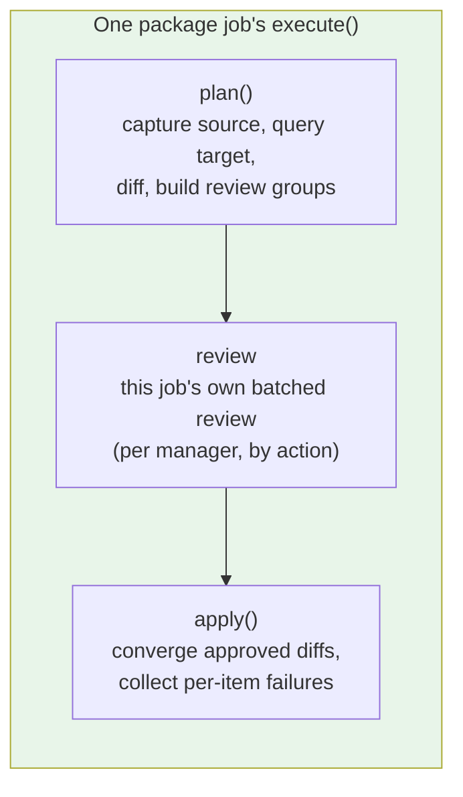

# Package Sync Specification

**Domain Code**: `PKG` (Package Management Sync, Phase 2)

## Navigation

- [System Documentation](_index.md)
- [Architecture](architecture.md)
- [Data Model](data-model.md) — item identity, the machine-local decision file and the install-snippet registry
- [Core Spec](core.md)
- [Package sync (user guide)](../jobs/package-sync.md)

Four `SyncJob`s — `apt_sync`, `snap_sync`, `flatpak_sync`, `manual_installs_sync` — replicate *what is installed* (apt packages plus the `/etc/apt` repository state they depend on, snaps, flatpaks, and the things no package manager can reproduce) rather than user data. The convergence model they implement is ADR-020: the source captures a manifest, the target diffs its own state against it, and each ecosystem's own tooling does the converging.

The three package-manager jobs sit in the orchestrator's job-execution phase **ahead of `folder_sync`**, and the ordering is load-bearing: apps must exist before their data lands on top of them. It is decisive for `flatpak_sync`, where `flatpak install` must create `~/.local/share/flatpak` before `folder_sync` would otherwise place `~/.var/app` content there, and it keeps package postinst defaults from overwriting real synced config for every package job.

## Shared core contract (`PackageSyncJob`)

`PackageSyncJob` is an abstract `SyncJob` every package-manager job subclasses. It declares two abstract hooks a concrete job implements:

- `plan(diff)` — capture the source's manifest, query the target, diff the two, and build this job's review groups. Read-only. Each manager writes its own: what a diff even IS differs per ecosystem, so there is no base implementation to inherit — only the pieces every implementation uses (`filter_inert` on the way in, `_drop_inert_diffs` on the way out, `_build_review_groups` at the end).
- `converge(diff)` — apply one approved diff on the target. May raise `ConvergeItemFailed` to refuse an item without attempting its mutating command (e.g. a transaction-safety guard), or return a `CommandResult` whose non-zero exit code is treated as a per-item failure the same way.

What the base class holds is what all four managers genuinely share: the plan/review/apply order, the machine-local decision-file rules, the review grouping and the converge loop. A manager's own item shapes, its own diff and the facts only it can collect live in that manager's module — a base class holding one manager's logic makes the other three inherit a surface they never use.

In return, the base class guarantees:

- **Planning is read-only.** `plan()` issues only read commands on both machines; nothing may mutate either machine until a review has been accepted.
- **Each job's review precedes its own changes.** A job's `execute()` runs its own plan, review and apply in order and applies nothing before its own review returns — a structural property of the single `execute()`, not a convention, and not owned by any outside component.
- **Per-item continue-on-failure.** `apply()` attempts every approved diff, collects failures rather than stopping at the first one, and raises once at the end (`PackageItemFailures`) naming every item that failed, so one bad item never blocks the rest of the same job's approved work.
- **Dry-run.** `--dry-run` produces the same plan and review as a real run but issues zero mutating commands (ADR-014).
- **Per-action confirmation.** With `--confirm-each-command`, every modification a job makes is shown verbatim and requires an explicit proceed or abort before it runs. See [Per-action confirmation](core.md#per-action-confirmation).
- **FULL/INFO logging split.** Per-item convergence detail logs at `FULL`; per-job summaries (counts, overall result) log at `INFO` — the same split `folder_sync` already follows.

## Plan, review and apply inside each job's own execute()

Each package job runs plan then review then apply inside its own `execute()`, and applies nothing until its own review returns:

- **plan** — capture the source's manifest, query the target's own state, diff the two, build this job's own review groups. Read-only: nothing here may mutate either machine. Each manager implements this itself.
- **review** — present this job's own batched review, grouped by action, batched per manager and never across managers. Installs and removals show as separate groups with removals labelled as removals, so a bulk tick can never silently delete.
- **apply** — converge only the diffs the user approved, one item at a time, collecting per-item failures rather than stopping at the first one.

There is no cross-manager review owner and no coordinator between the jobs. The jobs are deliberately independent — separate enable flags, config, validation, failure isolation and progress — so a single owner reviewing every enabled manager at once would contradict that independence, and the intended UX is one batched review per manager rather than one review for the whole fleet of managers. The orchestrator's job loop runs the jobs sequentially, so `apt_sync` reviewing and converging before `snap_sync` even starts is correct behaviour, not a violation: each job's own review still precedes every change that job makes.

## Source/target split

Capture and every decision (what to install, what to mark machine-specific, how to resolve an unreproducible item) happen on the **source**. The target only answers read-only state queries during plan and executes converge commands during apply — it never decides anything on its own. This matches ADR-002's stateless-target model: the target exposes discrete, stateless operations that the source orchestrates over SSH, never a persistent daemon holding its own decision state.

## `apt_sync`

- **Covers**: the manually-installed apt package set (`apt-mark showmanual`, not the full dpkg selection — apt resolves dependencies on the target), plus the repository state that governs where packages come from: sources, pins and apt config under `/etc/apt`. Signing keys are kept correct alongside the repositories that reference them, but are not items and are never reviewed. Unreproducible-item detection is NOT here: D-18 moved both the detection and the `UNREPRODUCIBLE` item class to `manual_installs_sync`.
- **Excludes**: packages whose installed version comes from no configured repository — a bare `.deb` installed with `dpkg --install`. `capture_source_items` runs the same `packages_installed_from_no_repository` test `manual_installs_sync` runs (the shared `packages/apt_policy.py` parser, never a shared *result* — D-15/D-16 keep the jobs independent) and drops those names from the manifest. Excluding at capture rather than at diff or review time is what makes them structurally invisible to this job in one place: no `ItemDiff`, no review group, no `apt-get --dry-run` collateral simulation, no origin classification. Since `manual_installs_sync` carries its own enable flag and `apt_sync` may not consult it (D-15), enabling `apt_sync` alone leaves these packages replicated by nobody — a known consequence of the ownership split, not a defect in either job.
- **Item classes**: `APT_PACKAGE`, `APT_SOURCE`, `APT_PIN`, `APT_CONFIG`, `APT_HOLD`.
- **Preconditions**: `apt-mark` on both machines; passwordless sudo on the source (reading `/etc/apt` state needs root even though the source is read-only) and on the target; a free dpkg frontend lock on the target — a lock held by e.g. `unattended-upgrades` is reported rather than raced against.
- **Converges by**: `apt-get install`/`apt-get remove` per approved package (never `purge`), each preceded by a transaction simulation that refuses the real command if it would touch an unapproved package; file writes for the `/etc/apt` group, which is transactional — a failed metadata refresh restores every file the group touched.
- **Origin enforcement** (ADR-021 D-35): after the run's single `apt-get update` and before its first install, one batched `apt-cache policy` re-reads the target's candidate origins for the approved install set. An install apt would satisfy from none of the source's origins fails as its own item (D-27), naming both origins. Plan-time classification only decides what repository work to derive; this is what decides what may be installed, so a repository that failed to land or a pin that never won cannot ship a different vendor's package. Packages the source has only from its own distribution files are exempt — two machines on different Ubuntu mirrors are one vendor.
- **First-sync scope** (ADR-015): "apt packages (manually-installed set)", via `apt-get install/remove per item, after review`.

## `snap_sync`

- **Covers**: installed snaps, converged to the source's exact revision and tracking channel.
- **Item classes**: `SNAP` (`SNAP_CHANNEL` exists in the enum but a channel-only retrack still diffs as `SNAP`, so a review group derives one unambiguous action verb).
- **Preconditions**: `snap` on both machines; passwordless sudo on both, since the target installs snaps and both ends get the sync-window auto-refresh pause.
- **Converges by**: install or refresh at an explicit revision, a channel switch after every install and whenever the channel differs, and removal that preserves snapd's own pre-removal snapshot. No command in this job ever sets a hold.
- **First-sync scope**: "installed snaps (name, channel, revision)", via `snap install/refresh/remove per item, after review`.

## `flatpak_sync`

- **Covers**: installed flatpak refs and their remotes, per user/system installation scope. Scope is folded into item identity, so the same application installed in both scopes on different machines produces an independent install plus an independent removal, never a single "change".
- **Item classes**: `FLATPAK_REF`, `FLATPAK_REMOTE`.
- **Preconditions**: `flatpak` on both machines (a missing binary is a clean validation error, not an exception — flatpak ships in no default Ubuntu 24.04 install); passwordless sudo on the target, but **only** when a system-scope ref or remote is actually in play on either machine, so a user-scope-only sync never has to ask for root.
- **Converges by**: remotes before the refs that depend on them, each ref and remote operation privileged if and only if its own scope is `system`. A ref whose origin remote is neither already on the target nor added by this run is refused with a per-item failure naming the missing remote, rather than issuing an install flatpak would reject. A remote offered for deletion is not refused that way — its review entry names the target refs that still have it as their origin, so the consequence is stated before approval.
- **First-sync scope**: "installed flatpak refs (per user/system scope)" and "configured flatpak remotes (per scope)", via `flatpak install/uninstall/remote-add per item, after review`.

## `manual_installs_sync`

- **Covers**: everything no package manager can reproduce — apt packages whose installed version comes from no configured repository (only dpkg's own status file accounts for them) and unowned installs under `/usr/local`/`/opt` — plus the install-snippet registry. It carries its own `sync_jobs` enable flag, so disabling `apt_sync` never silently disables manual-install detection. The bare-`.deb` half is this job's EXCLUSIVE territory: `apt_sync` excludes the same packages at capture, so disabling this job leaves them replicated by nobody.
- **Item classes**: `UNREPRODUCIBLE`.
- **Resolution**: an unreproducible item ends a run resolved by a snippet, a machine-specific mark, or a deliberate skip-once — skip-once is a valid resolution, not an unresolved state. A non-interactive run records nothing and does not fail on undecided items alone (D-21/D-26).
- **Snippet transport**: after its own review, the job pushes the registry to the target itself, so a snippet authored on the fly during that review reaches the target and is replayed in the same run. The registry never travels via `config_sync` (which runs before any review) or `folder_sync` (a user-controlled job).
