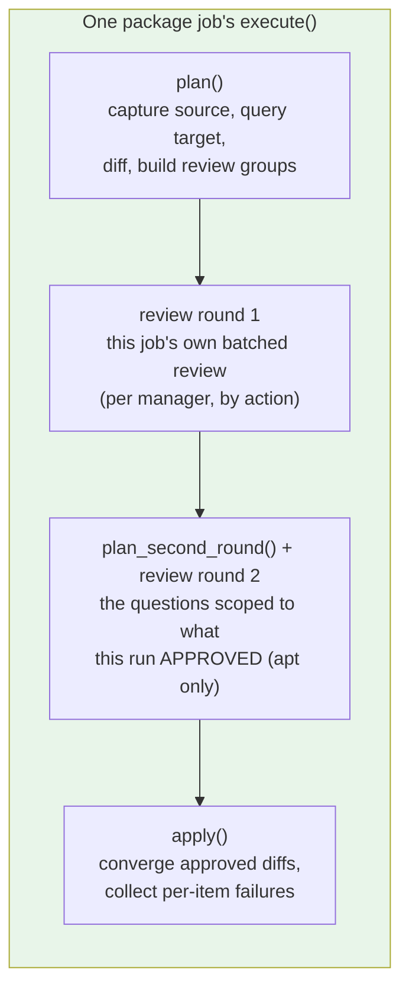

# Package Sync Specification

**Domain Code**: `PKG` (Package Management Sync, Phase 2)

## Navigation

- [System Documentation](_index.md)
- [Architecture](architecture.md)
- [Data Model](data-model.md) — item identity, the machine-local decision file and the install-snippet registry
- [Core Spec](core.md)
- [Package sync (user guide)](../jobs/package-sync.md)
- [Package sync — user requirements](../planning/package-sync-user-requirements.md) — the intent this spec implements
- [Package sync conformance criteria](../planning/package-sync-conformance-criteria.md) — the checkable articles this spec is verified against

Four `SyncJob`s — `apt_sync`, `snap_sync`, `flatpak_sync`, `manual_installs_sync` — replicate *what is installed* (apt packages plus the `/etc/apt` repository state they depend on, snaps, flatpaks, and the things no package manager can reproduce) rather than user data. The convergence model they implement is ADR-020: the source captures a manifest, the target diffs its own state against it, and each ecosystem's own tooling does the converging.

All four sit in the orchestrator's job-execution phase **ahead of `folder_sync`**: apps must exist before their data lands on top of them, `manual_installs_sync` included, since a replayed snippet installs software that writes its own defaults exactly as a package's postinst does. `Orchestrator._check_package_jobs_precede_folder_sync` validates the resolved, enabled order and refuses to start a run ordered otherwise.

## Shared core contract (`PackageSyncJob`)

`PackageSyncJob` is an abstract `SyncJob` every package-manager job subclasses. It declares two abstract hooks a concrete job implements:

- `plan()` — capture the source's manifest, query the target, diff the two, and build this job's review groups. Read-only. Each manager writes its own: what a diff even IS differs per ecosystem, so there is no base implementation to inherit — only the pieces every implementation uses (`filter_inert` on the way in, `_drop_inert_diffs` on the way out, `_build_review_groups` at the end).
- `converge(diff)` — apply one approved diff on the target. May raise `ConvergeItemFailed` to refuse an item without attempting its mutating command (e.g. a transaction-safety guard), or return a `CommandResult` whose non-zero exit code is treated as a per-item failure the same way. It may also raise `ConvergeItemDeclined` for an item the user withdrew after the review: neither applied nor failed, named in its own summary line, and never part of `PackageItemFailures`.

What the base class holds is what all four managers genuinely share: the plan/review/apply order, the machine-local decision-file rules, the review grouping and the converge loop. A manager's own item shapes, its own diff and the facts only it can collect live in that manager's module — a base class holding one manager's logic makes the other three inherit a surface they never use.

In return, the base class guarantees:

- **Planning is read-only.** `plan()` issues only read commands on both machines; nothing may mutate either machine until a review has been accepted.
- **Each job's review precedes its own changes.** A job's `execute()` runs its own plan, review and apply in order and applies nothing before its own review returns — a structural property of the single `execute()`, not a convention, and not owned by any outside component. The review can take two rounds, and both precede every change: `plan_second_round()` is where a question an article scopes to the work this run APPROVES is built, out of the first round's answers (`PKG-FR-BATCHED` — the rounds come one after another with no work between them, and each recurring kind of decision is still settled in one pass). `apt_sync` has three such questions and no other job has any. A third round, after the target has already been changed, is a different permission (`PKG-FR-ASK-AGAIN`) and an obligation rather than a convenience: an install whose repository the same run writes cannot be simulated before that write lands, so its collateral question is put once `/etc/apt` has converged. Everything else stays in the first round — a package's classification depends on the source's origins, which no run mutates, and D-35's origin verification is a per-item failure rather than a second question.
- **Per-item continue-on-failure.** `apply()` attempts every approved diff, collects failures rather than stopping at the first one, and raises once at the end (`PackageItemFailures`) naming every item that failed, so one bad item never blocks the rest of the same job's approved work.
- **A read that did not answer fails the job; an answer of "nothing" is data** (ADR-022). `require_answer` (`packages/probes.py`) raises `ProbeFailed` for a read whose result would otherwise be parsed as machine state — an empty manifest reads as "that machine has nothing" and proposes removing everything on the other one. `ProbeFailed` is deliberately not a `ConvergeItemFailed`: it escapes the per-item loop above and fails once, naming the machine by hostname, the command and the tool's own stderr. The discriminator is per command and measured, not assumed — most reads use the exit code; `sha256sum` over an empty keyring glob exits non-zero in its normal case and is left unguarded; `dpkg --search` does the same as soon as one queried path is genuinely unowned, so the unowned-install scan sends a path dpkg must own along in the same batch and reads that path's answer as the proof the rest of the reply is one; and the `find` commands whose exit code cannot separate "absent" from "unreadable" are shaped so it can. The orchestrator records that job FAILED and runs the remaining jobs, on the same arm as `PackageItemFailures`.
- **Dry-run.** `--dry-run` produces the same plan and review as a real run but issues zero mutating commands (ADR-014).
- **Per-action confirmation.** With `--confirm-each-command`, every modification a job makes is shown verbatim and requires an explicit proceed or abort before it runs. See [Per-action confirmation](core.md#per-action-confirmation).
- **FULL/INFO logging split.** Per-item convergence detail logs at `FULL`; per-job summaries (counts, overall result) log at `INFO` — the same split `folder_sync` already follows. Every applied item's line names the act, the item, the manager and the machine it happened on (`PKG-FR-LOG-ACTIONS`), which `PackageSyncJob._converge_one` emits for all four managers.

## Plan, review and apply inside each job's own execute()

Each package job runs plan then review then apply inside its own `execute()`, and applies nothing until its own review returns:

- **plan** — capture the source's manifest, query the target's own state, diff the two, build this job's own review groups. Read-only: nothing here may mutate either machine. Each manager implements this itself.
- **review** — present this job's own batched review, grouped by `(action, item_class)`, batched per manager and never across managers. Then `plan_second_round()`, which returns the run's final item set plus the groups of a second round: the questions whose article is written in terms of approvals rather than candidates, which is a fact only the first round's answers hold. It issues reads only, `execute()` puts its groups to the same reviewer, and the two answer sets are merged before `accept_review`; a run with nobody to ask is skipped if EITHER round holds something to decide. Installs and removals land in separate groups, and every row of a removal group starts at skip-once, so a bulk confirm can never silently delete. So does every row of a group carrying `ReviewGroup.overwrites_authored_content`, which `_build_review_groups` sets for an `APT_CONFIG` CHANGE alone (`PKG-FR-HARMLESS-DEFAULT`). Group titles and row verbs come from `_ACTION_VOCABULARY`, `_ITEM_CLASS_NOUN`, `_MANAGER_NOUN` and — for the three report groups — `_REPORT_TITLES` and `_MANAGER_ORIGIN_NOUN`, so a hold never reads as an install and a flatpak group never names a repository. Every string the user reads names the two machines by hostname — item details, questions, answers, per-item failures, warnings and `mutates=` phrases alike: `review_items`, `TerminalUIReviewer` and `TerminalUIStepGate` require both names (no default, no fallback), the orchestrator supplies them from the same pair `JobContext` carries, and each job and its collaborators build their own strings through `PackageSyncJob.machines` (`packages.items.Machines`). The per-command confirmation names the machine once, in its heading, which is why a `mutates=` phrase need not repeat it. Source and target survive as role names in code, docstrings and logs only. `_hints` composes the answer sentences: a permanent answer states that the user will not be asked again rather than what the mark stops pc-switcher doing (`PKG-FR-EFFECT-NOT-MECHANISM`), and the two skips differ only in that duration clause (`PKG-FR-ANSWERS-AS-A-SET`).
- **apply** — converge only the diffs the user approved, one item at a time, collecting per-item failures rather than stopping at the first one.

**The command line's own answers** (`PKG-FR-APPLY-FLAGS`, issue #245): `--apply-package-installs` and `--apply-package-removals` become one `review.ReviewPolicy` the orchestrator builds and hands to two places — `TerminalUIReviewer`, which answers with it, and every `JobContext.review_policy`, which is how a job reasons about it. Answering happens inside `review_items`, before the automation-environment hook and before the interactivity test, so ONE seam covers every review any package job puts, including the collateral question `apt_sync` puts mid-apply through the same reviewer (`PKG-FR-ASK-AGAIN`). `policy_decision` classifies a whole group on its `action` and `overwrites_authored_content` alone — the same two fields `_default_decision` reads — and returns `None` for the four out-of-scope kinds, which then take the ordinary path untouched: prompted on a terminal, named by `_warn_every_item_unasked` and declined for this run without one. A group the policy answers is removed from what reaches the prompt, so an emptied group list falls through the existing branches exactly as an empty plan does.

Two facts about a review that `ReviewOutcome.was_interactive` alone cannot carry, which is why `execute()` asks a second question. `was_interactive` keeps meaning "a human could be asked", and it is what `_record_permanent_skips` and `_finalize_unreproducible` gate on, so no flag can ever write a machine-specific mark or a snippet (`PKG-FR-APPLY-FLAGS-NO-MARK`) — the policy emits nothing but `Decision.APPLY` in any case. Whether the COMMAND LINE answered is `review.policy_answers_any` over this job's groups from both rounds, and it drives the two sites that must not treat a flag-answered run as unanswered: the `JobSkipped` raise, so a converging run is not reported skipped, and the `after_review()` call, so `manual_installs_sync` still pushes the registry that an approved replay reads off the target (`PKG-FR-APPLY-FLAGS-OUTCOME`). A run whose flags answer none of its groups fails both tests and skips, exactly as it would with no flags.

One coupling is worth stating because it surprises: the collateral question belongs to the removal flag, and a declined collateral leaves the changes causing it unapproved (`Collateral.resolve`), so `--apply-package-installs` alone does NOT converge an install whose transaction would remove a protected package. Both flags together do.

**Where a machine-specific mark lands, and where a later run looks for it** (`PKG-FR-MACHINE-SPECIFIC`, D-08a): `PackageSyncJob._mark_holders` states both halves at once, as the machines a mark on a diff of one action can sit on, the recording machine first — so `_record_permanent_skips` takes the first entry to pick the executor whose file gets the write, and `_drop_inert_diffs` reads every file the tuple names, which always includes the one the write used. An `INSTALL` is source-held and a `REMOVE` target-held because the item is on that machine and no other. A `CHANGE` is neither: both machines have it, the answer keeps the TARGET's copy — the overwrite is what it permanently refused, and `review._hints` says so in those words — but the machine that recorded it is the SOURCE as soon as the next sync is launched from the other end, so a change is read back from either machine's file. The two `CHANGE` classes are `apt:config:` and a snap's revision/channel.

**How long a mark lasts** (`PKG-FR-MARK-LIFETIME`, D-43): as long as its item is on the machine holding it. `PackageSyncJob._prune_dead_marks` runs at the end of every `apply()` — after the converge loop, so an approved collateral removal that took a marked package is already reflected in what the machine reports — and asks each manager's own `observe_absent_marks` which of that machine's entries name something it no longer has, then `DecisionFile.drop`s them and logs each one. `_load_live_decisions` asks the same question at plan time and filters the answer out in memory rather than writing, so a dead mark stops silencing its item in the run that notices it while `plan()` stays read-only. Two rules bind every implementation and both failure directions delete an answer the user still wants: the check is a positive statement of absence off the machine's own state (dpkg's installed set, the manager's listing, the path itself) and never absence from the narrower inventory the diff was built from — apt's is `apt-mark showmanual`, which a still-installed package leaves the moment apt reclassifies it as automatic — and a probe that does not answer drops nothing (`_absent_marks` swallows `ProbeFailed`, which is the one place ADR-022's fail-fast rule is deliberately not applied: the question is bookkeeping, and at the `apply()` call site the run's work has already landed). An entry of a class no answer can produce — `apt:hold:`, `apt:source:`, `flatpak:remote:` — is recognised by its ID rather than the `item_class` beside it, since the file is hand-editable, and is left exactly where it was found.

Reading the holder off the action is only sound while the action truthfully says which machines have the item, which is what `state.marks_on_either` protects: a job capturing an inventory from both machines filters BOTH through BOTH files, never each through its own. Filtering each side alone drops the marked copy and leaves the other machine's, and one surviving copy is a one-sided item — an install of software the target already has, or a removal of software the source still has. Measured before the fix: a marked snap revision change came back the very next run as a removal of the copy the mark was given to protect. `manual_installs_sync` is exempt because only the source's marks filter its findings: what it reads from the target is a set of identities to subtract (`PKG-FR-MANUAL-DIFF`), never a manifest that could produce an item of its own, so there is no second copy to leave behind.

**A block is derived, never reviewed** (`PKG-FR-BLOCKS-DERIVED`): an apt hold, a snap refresh hold and a flatpak mask replicate because the software they apply to does, exactly as a pin does. `BLOCK_ITEM_CLASSES` names the three, and three passes act on it. `_build_review_groups` drops every block before it builds a group, so none reaches a screen in any direction. `accept_review` gives every block diff `Decision.APPLY`, because the reviewer returned no answer for a row it never saw and the default for a missing answer is skip-once — which would silently drop the replication. `_record_permanent_skips` refuses to record one, and `_drop_inert_diffs` refuses to read one back, so an entry naming a block — left by an older version of the tool, or written by hand — can neither be created nor silence a replication nobody declined; `flatpak_sync` leaves its masks out of `filter_inert` for the same reason, since a mask carries its own id into that filter and would otherwise be dropped on the way in. `_log_decisions` skips blocks too: nobody was asked, so "reviewed" would name a question the run never put, and `apply()`'s own converge line is what a derived write gets (`PKG-FR-DERIVED-VISIBLE`).

Whether a block LANDS is then its own manager's business, because only the manager knows whether the software arrived. `PackageConverger._hold_refusal` and `SnapSyncJob._install_was_declined` refuse a freeze block whose install this run did not run — declined where the user's own answer withdrew it, failed where the install broke (`PKG-FR-APT-HOLD-INERT`). A flatpak mask has no such guard and needs none: it is a rule about what may be installed, so it lands whether or not the application is still there.

There is no cross-manager review owner and no coordinator between the jobs. The jobs are deliberately independent — separate enable flags, config, validation, failure isolation and progress — so a single owner reviewing every enabled manager at once would contradict that independence, and the intended UX is one batched review per manager rather than one review for the whole fleet of managers. The orchestrator's job loop runs the jobs sequentially, so `apt_sync` reviewing and converging before `snap_sync` even starts is correct behaviour, not a violation: each job's own review still precedes every change that job makes.

## Source/target split

Every decision (what to install, what to mark machine-specific, how to resolve an unreproducible item) is taken about the **source**'s state. The target only answers read-only state queries during plan and executes converge commands during apply — it never decides anything on its own. This matches ADR-002's stateless-target model: the target exposes discrete, stateless operations that the source orchestrates over SSH, never a persistent daemon holding its own decision state.

## `apt_sync`

- **Covers**: the manually-installed apt package set (`apt-mark showmanual`, not the full dpkg selection — apt resolves dependencies on the target), plus the repository state that governs where packages come from: sources, pins and apt config under `/etc/apt`. Signing keys are kept correct alongside the repositories that reference them, but are not items and are never reviewed. Unreproducible-item detection is NOT here: D-18 moved both the detection and the `UNREPRODUCIBLE` item class to `manual_installs_sync`.
- **Excludes**: packages whose installed version comes from no configured repository — a bare `.deb` installed with `dpkg --install`. `capture_source_items` and `capture_target_items` both run the same `packages_installed_from_no_repository` test `manual_installs_sync` runs (the shared `packages/apt_policy.py` parser, never a shared *result* — D-15/D-16 keep the jobs independent) and drop those names from their machine's manifest. BOTH manifests, because `PKG-FR-DEB-OWNERSHIP` binds this job "in any configuration": a hand-`.deb` only the target holds is absent from the source's manifest and present in the target's, which diffs as an offer to `apt-get remove` software apt never installed and cannot reinstall. The target's exclusion costs no command of its own — its names ride in the same batched `apt-cache policy` that answers this run's origin questions there. Excluding at capture rather than at diff or review time is what makes them structurally invisible to this job in one place: no `ItemDiff`, no review group, no `apt-get --dry-run` collateral simulation, no origin classification. Since `manual_installs_sync` carries its own enable flag and `apt_sync` may not consult it (D-15), enabling `apt_sync` alone leaves these packages replicated by nobody — a known consequence of the ownership split, not a defect in either job.
- **Item classes**: `APT_PACKAGE`, `APT_HOLD` and `APT_CONFIG` in every direction; `APT_SOURCE` and `APT_PIN` in the REMOVAL direction only, on the two-answer screen (`REPO_REMOVAL_REVIEW_ACTION`) that is never recordable. An `APT_SOURCE` removal is withheld entirely while the target still installs something from the file (`PKG-FR-REPO-DELETE`): `AptProbe.packages_by_source_file` counts everything `AptProbe.capture_target_installed` reports plus its machine-specific marks, minus this run's own removal candidates, and `diff_apt_sources` never builds an item for a file that count reaches. The count is taken TWICE, because the article counts after the run's APPROVED removals and no answer exists while the plan is being built: the plan-time count decides which files are candidates at all, and `AptSyncJob.plan_second_round` re-counts against the first round's real answers and drops the item — logging what keeps the file — when a package that installs from it survived, so the deletion screen is a second-round question and the user is never offered a deletion the run then withholds. `_withhold_repositories_still_in_use` stays behind it as the backstop for the one thing that round cannot see: a collateral question answered on those same screens can withdraw a removal the count depended on. Recounting against the decisions rather than re-reading the machine is apt's own ordering: the `/etc/apt` group converges before the package removals do, so a read taken at deletion time would still see every package the run is about to remove (`flatpak_sync` reads the machine because its remote deletion runs after the loop). Automatically-installed packages count because `remove_args` runs `apt-get remove` and never `autoremove`, so nothing here takes one away when its reason goes, and a kept manual package can require it; the wider name set costs about a second of `apt-cache policy` on a run that found a target-only repository and nothing on one that did not. What survives carries only the URLs the file declares (already parsed by `parse_source_file` for the same read that gives its format); a pin entry carries the file's whole content in `ReviewEntry.content`, printed as one block per file above the screen, since a pin filename conveys neither the origin it favours nor its priority. That content costs one guarded `sudo cat` per pin file OFFERED for deletion (`read_file_content`, ADR-022) — silence there fails the job rather than showing an empty file the user would approve deleting. Repository adds, repository overwrites, pin adds and pin updates are not items at all: they are derived from the packages approved from them, plus the always-synced `preferences.d` and distribution buckets (ADR-020 D-34/D-36/D-38). Signing keys have no `ItemClass` at all. A key the target already has with different bytes is refreshed from the source unless the target's own DISTRIBUTION packaging owns that path (`PKG-FR-KEY-REFRESH`): `AptProbe.capture_distribution_owned_keys` reads `dpkg --search` over every key the target has, then one batched `apt-cache policy` over the packages owning the keys that DIFFER, and calls an owner the distribution's when its installed version's origins all lie inside the target's own distribution origins (D-35). Every owner must pass, and a run whose keys match the source pays no policy call at all. Ownership by a vendor's own `.deb` — `tailscale-archive-keyring`, measured — is not an exemption, since that is exactly how a vendor rotates a key.
- **Preconditions**: `apt-mark` on both machines; passwordless sudo on the source (reading `/etc/apt` state needs root even though the source's packages are never changed) and on the target; a free dpkg frontend lock on the target — a held lock is reported rather than raced against, naming both a package command of the user's own and the system's automatic updates as possible holders, because `fuser` says the lock is held and not by whom.
- **Converges by**: derived `/etc/apt` writes first (keyrings, then pins and approved apt config, then the distribution files, then the derived repository adds and overwrites, then the approved removals, then unused-keyring collection), then exactly one `apt-get update`, then `apt-get install`/`apt-get remove` per approved package (never `purge`), each preceded by a transaction simulation that refuses the real command if it would touch an unapproved package. The `/etc/apt` group is transactional — a failed metadata refresh restores every file the group touched. A derived write has no item of its own, so a failure is recorded against its destination path and charged to every approved package whose origin depended on it (D-39). Every derived write — `/etc/apt` files and signing keys alike — is logged at FULL as it lands and previewed under `--dry-run` (`PKG-FR-DERIVED-VISIBLE`); `AptSyncJob.apply` previews `DerivedWrites.all_writes`, `Keyrings.writes` and `Keyrings.unreferenced`, and `Keyrings.provision`/`remove_unused` log each key on the real path.
- **Holds** (`PKG-FR-APT-HOLD-VERSION`, `PKG-FR-APT-HOLD-INERT`, `PKG-FR-HOLD-WITHOUT-PACKAGE`): a package the source holds and the target lacks is installed as `<name>=<version>`, from `AptSyncJob._held_versions`; `PackageConverger._held_version_refusal` turns a simulation apt refuses into a failure naming the source's version and the target's candidate, and never falls back. A held candidate enters `_held_versions` whatever `dpkg-query` answered, empty version included, and `_install` refuses that entry rather than issuing an unpinned install: the capture guards make an empty version unreachable, and the refusal is what keeps it so. `PackageConverger._hold_refusal` refuses the hold itself when the package's own item was not approved, failed, or only reported the package missing, and returns the exception rather than a message because those grounds do not all mean the same thing: an install declined in the review, one a plan-time collateral answer rewrote to `SKIP_ONCE`, and one a late collateral answer withdrew are a single case and decline the hold (`ConvergeItemDeclined`), while an install that was approved and broke, or a package whose repository this run cannot reproduce, fails it (`ConvergeItemFailed`) — measured on `ubuntu:24.04`, `apt-mark hold` exits 0 and records the hold for a package that is not installed, refusing only a name apt has never heard of, so nothing about apt's exit code enforces this. That same measurement is why a hold naming a package its own machine does not have ends the run: `AptSyncJob._refuse_holds_without_their_package` compares each machine's `apt-mark showhold` against its own `dpkg-query` installed set (`AptProbe.capture_source_installed` / `capture_target_installed`) and raises one `SyncAborted` naming every stray hold on both machines, each attributed to its machine with that machine's own `apt-mark unhold`. That is the whole treatment of the case: no clear-then-reinstall, no `--allow-change-held-packages` in any rehearsal, and no branch anywhere downstream. Each installed-set read costs one `dpkg-query` and is issued only where that machine holds something, or — on the target — where a target-only repository was found. A hold is inert where its PACKAGE is marked machine-specific on the machine that direction holds: `diff_apt_holds` takes each machine's marked package names from the decision file `_plan_packages` has just read (`AptSyncJob._marked_packages`), because the mark is the user's own answer about the software and a block follows the software it applies to. Read per direction rather than subtracted from the hold sets, since a name dropped from the source set would read as "the source does not hold it" and propose an unhold.
- **Origin identity** (`PKG-FR-APT-IDENTITY`, `PKG-FR-DISTRO-ORIGIN`, `PKG-FR-APT-ORIGIN-DIFF`): a package present on both machines is compared over each machine's origin IDENTITY set — every vendor origin on its own, plus that machine's whole distribution collapsed into one member, computed from its own distribution source files. Two disjoint non-empty sets are an `ORIGIN_MISMATCH`/`REPORT_ONLY` naming both, checked before the version comparison because two origins' builds share no version scale. The collapse is what makes the comparison usable: two machines on different Ubuntu mirrors are one origin and report nothing, while `gh` from `cli.github.com` against `gh` from the archive is one name and two pieces of software and reports. A machine whose copy apt named no origin for at all has an empty set and is never half of a finding. `OriginPlan.vendor_source_origins` stays the vendor list alone, since that is what the install line names and what D-35's exemption turns on.
- **Origin enforcement** (ADR-020 D-35): after the run's single `apt-get update` and before its first install, one batched `apt-cache policy` re-reads the target's candidate origins for the approved install set. An install apt would satisfy from none of the source's origins fails as its own item (D-27), naming both origins. Plan-time classification only decides what repository work to derive; this is what decides what may be installed, so a repository that failed to land or a pin that never won cannot ship another repository's package. Packages the source has only from its own distribution files are exempt — two machines on different Ubuntu mirrors share one origin.
- **Ubuntu Pro / ESM gate** (ADR-020 D-38, `apt_sync/esm_gate.py`): `EsmGate.pending` applies the always-sync bucket's own predicate to `ubuntu-esm-apps.sources` and `ubuntu-esm-infra.sources`, so the gate can never ask about a file the run would not have written. When either is pending, `plan()` probes the target with `pro status --format json` and, if it reports unattached, asks through `Reviewer.ask_gate` with exactly two answers: attach now, which re-probes rather than trusting the answer and may be given any number of times, or skip `apt_sync` for this run, which raises `JobSkipped`. A run with no TTY takes the skip. The gate sits in `plan()`, immediately after the origin-state capture that supplies its trigger digests and before any review group is built, so one answer ends the job before the user is asked to decide anything else, and the whole question precedes the job's first mutating command. Every probe failure mode — no `pro` binary, a non-zero exit, output that will not parse — answers "unattached", because that is the recoverable one. The probe payload also names the subscriber's account, so nothing but the parsed boolean may be logged, shown in the prompt, or put in the `JobSkipped` reason (`PKG-FR-ESM-PRIVACY`). That includes the executor's own verbatim trace of every command's stdout: `AptProbe.target_pro_attached` is the one read that passes `withhold_output=`, which makes `Executor._trace_output` log the reason in place of the streams — the one exception `PKG-FR-LOG-VERBATIM` names, taken at the read because a filter downstream would see the payload only once it was already written. `--dry-run` never prompts: `EsmGate.withhold` records what it did not write and one WARNING names both files, the unattached target, and that a real run would skip `apt_sync` entirely.
- **Collateral protection** (`PKG-FR-COLLATERAL-MANUAL`, `PKG-FR-COLLATERAL-MARKED`, `PKG-FR-COLLATERAL-AUTO`): `Collateral.protected` is the target's `apt-mark showmanual` set plus the packages that machine marked machine-specific, this run's own `SKIP_ALWAYS` answers included — `Collateral.note_run_marks` records them from the first round's answers, before the second round is built and before any apply-time guard reads the set. A protected package's collateral removal, downgrade or upgrade becomes a review item, identified by `apt:collateral:<cause>:<effect>:<package>` (`items.collateral_item_id`) rather than by the package alone — one protected package can be the casualty of the install batch AND of the removal batch in the same run, and consenting to one of those is not consenting to the other. `Collateral.resolve` records the approved item ids and `Collateral.unapproved` looks the current transaction's cause and effect up among them, so the guard enforces the consequence the user was asked about; anything outside the set proceeds and is logged at FULL naming the change and the machine. That item's detail states the finding and then the ground that holds — manually installed, marked as that machine's own, or both — composed in `Collateral._reason` because `protected` is a union: a fixed "manually installed" sentence in `review` would be false about a package a mark alone protects. A batch may exempt from its own simulation exactly what that simulation is about: the removal batch exempts its own candidates, and the install batch exempts nothing, so a removal the user may yet skip cannot silently license an install to take the package. That exemption then hides the one question the article requires about a candidate — the cascade of ANOTHER candidate's removal — which is why `Collateral.after_answers` puts it in the second round, where the answers finally divide the candidates: it re-rehearses the removals the run APPROVED, keeps every candidate it did not (skipped, marked as the target's own, or unanswered), and `Collateral._reason` names the ground that applies — a mark given earlier in this review, or a removal offered and not approved. It costs one `apt-get --dry-run` on a run that approved a removal and left another candidate standing, one more per approved removal when that rehearsal finds something to attribute, and nothing on any other run. Nothing that reaches the apply-time guard is older than that round, so a protected casualty there is a transaction that has drifted since it, and `PackageConverger.remove` asks about it rather than refusing (`PKG-FR-ASK-AGAIN`).
- **Collateral simulation admission** (ADR-020 D-40, ADR-022 D-01): the plan-time `apt-get --dry-run` batch names only packages the target's own `apt-cache policy` gave a candidate for. A D-34 class-3 install — the repository that supplies it is derived from the package's own approval and written during converge — is excluded on that evidence, never on the simulation's exit code, because apt refuses the whole batch on one unlocatable name and would take every other package's protection down with it. Those packages get their question once `/etc/apt` has converged and the run's `apt-get update` has run, which is the first moment apt can answer it (`LateCollateral`, `PKG-FR-ASK-AGAIN`): one batched simulation over the whole excluded set, then the same `COLLATERAL_REVIEW_ACTION` group with the same three answers, put before the first of those installs runs rather than between two of them (`PKG-FR-BATCHED`, `PKG-FR-CONSENT-BEFORE-CHANGE`). An apply reaches the apply-time guard through `Collateral.allow`; keeping the package withdraws the installs `Collateral.triggers_of` attributes it to, which end the run as `ConvergeItemDeclined` — not applied and not failed, which is what `PKG-FR-COLLATERAL-MANUAL` requires of that answer, and their holds decline with them. The `/etc/apt` files those installs needed landed before the question could be put and are not rolled back: `LateCollateral._report_stranded` asks `DerivedWrites.stranded` for the repository destinations attributed to withdrawn installs alone and logs one INFO line each, naming the destination and the URLs the source's own file declares (`build_stranded_repository_line`). A file a surviving approved install still needs, a file that failed to write, and a pin or distribution file are never named — the first is doing its job, the second never landed, and the last two travel from the source rather than from an approval (`PKG-FR-REPO-DERIVED`). A consequence the plan-time question already approved is not put twice; a declined one is, because those were different changes. The apply-time per-item simulation behind all of it puts the same question over the same three answers where the real transaction has DRIFTED onto a protected package nobody saw (`LateCollateral.ask_about_drift`, from `PackageConverger._install` and `.remove`): the fact is younger than the review, so `PKG-FR-ASK-AGAIN` licenses the round, and keeping the package leaves that one change `ConvergeItemDeclined`. The one casualty it refuses instead is a package that is itself a removal candidate this run — that was in the plan-time batch and merely exempt from it, so its question belonged before any change and asking it mid-apply would put a round in the middle of the work (`PKG-FR-BATCHED`).
- **Collateral attribution** (ADR-020 D-40): the batched simulation states a transaction, not its causes, so a collateral item found in it is narrowed by simulating each candidate on its own and recording the candidates whose own transaction reproduces it. Only a batch that found protected collateral pays that — one extra `apt-get --dry-run` per candidate in that direction, and none on the clean runs. Keeping the collateral package downgrades exactly those candidates to `SKIP_ONCE`, and only where they were approved: the same decision map is what `_record_permanent_skips` reads, so overwriting a `SKIP_ALWAYS` would silently drop the machine-local mark the user asked for. Collateral no single candidate reproduces is attributed to the whole batch, and the detail says so ("the packages listed earlier") so the sentence stays true of what a decline actually cancels in both cases. The prompt's three answers are apply / keep the package / stop, and the stop answer states its true scope: `SyncAbortedByUser` propagates untouched through the orchestrator's per-job handler, so it ends the whole sync and the session is recorded ABORTED, not just `apt_sync`.
- **A read that did not answer is not a finding about a package** (ADR-022). Every read this job's decisions rest on fails the job once, naming the command and the tool's own stderr, rather than letting an empty result be parsed as machine state: both manifests, the version lookup, the hold sets, the source and target `apt-cache policy` reads, the target's manual set behind collateral protection, the three `/etc/apt` directory digest captures, the source-file scan, the single-file content reads behind the conflict, repository-removal and pin-removal reviews, the removal-impact probe and the post-refresh origin verification. Two reads are deliberately left unguarded and say so at the call site: the single-file `sha256sum` for `/etc/apt/sources.list`, whose non-zero exit on an absent path IS the answer the caller wants, and the Pro probe, whose every failure mode is defined to mean "unattached". An empty *answer* is still data: no held packages, no pins and no third-party keyrings are ordinary. Only apt's answer decides a package, so a name an *answered* `apt-cache policy` printed no block for is still refused as its own item. Two of this job's `apt-cache policy` reads additionally fail when they print no block at all — the source's own installed set, and the post-refresh verification over names this run has already established the target has a candidate for — which is the one place emptiness is treated as silence.
- **The sync-window timer suspension** (`PKG-FR-APT-TIMER-PAUSE`, orchestrator `_suspend_apt_timers`): `apt-daily.timer` and `apt-daily-upgrade.timer` are stopped on BOTH machines across the whole job window, because Ubuntu's own updater takes the dpkg frontend lock this job converges under and the precondition above can only refuse a lock that is ALREADY held. Each machine's timer state is read first with one `systemctl show`, and only timers that are loaded and active are stopped — a machine that masked, disabled or stopped them keeps that policy, and a machine whose state could not be read is left alone entirely. It gates the system updater only: a person's own `apt install` and PackageKit are untouched, which is why the dpkg-lock precondition stays. Unlike snapd's `refresh.hold`, `systemctl stop` has no expiry, so the stop is paired with a transient systemd timer — `systemd-run --on-active`, scheduled BEFORE the stop and owned by that machine's own service manager — that starts the same timers again after six hours. A run that is killed therefore cannot leave a machine's security updates off; the normal path starts the timers in `_cleanup` and cancels the unit it no longer needs. A later run handles what a dead one left, in two halves. At suspend, `_defer_pending_apt_timer_restore` issues one `systemctl restart` on the pending unit, which re-arms its `OnActiveSec` from now and so pushes it past this sync; it starts no apt timer and changes no timer state, so the capture that follows is unaffected and a host the dead run left stopped is correctly skipped. It is deliberately not carried out there: both apt timers ship `Persistent=true`, and a `Persistent` timer whose window elapsed while it was inactive fires **immediately** on activation, so starting them at the head of a sync would provoke `apt-daily-upgrade` into the very run the suspension protects. At cleanup, after this run has restored and cancelled its own unit, `_settle_outstanding_apt_timer_restore` starts any unit still loaded — a dead run's promise that nothing else will keep — and then stops its `.timer`. There the immediate fire is harmless and wanted: the sync is over and an overdue upgrade is what the machine needed. Without that step, a successful run following a crashed one would leave the machine's automatic updates off for the rest of the window for no reason. A trigger that fails leaves the unit scheduled, since it is then the machine's only remaining way back.
- **First-sync scope** (ADR-015): "apt packages (manually-installed set)", via `apt-get install/remove per item, after review`.

## `snap_sync`

- **Covers**: installed snaps, converged to the source's exact revision and tracking channel. There is no origin model and there will not be one (ADR-020 D-42): snap has one store, and a name resolves to one snap-id resolves to one publisher through a canonical-signed `snap-declaration` snapd validates itself, so there is no second `firefox` for the target to install by accident and nothing for D-34's derivation to reach. What remains variable is which revision of that one snap is installed and which channel it tracks, and D-06 converges both. No store-identity or store-proxy check exists or is planned — a brand store and a store proxy are device-provisioning facts, not per-snap facts, and neither is replicable.
- **Item classes**: `SNAP` and `SNAP_HOLD` (`SNAP_CHANNEL` exists in the enum but a channel-only retrack still diffs as `SNAP`, so one snap's convergence stays one item and one decision even when revision and channel move together).
- **Sideloads** (`PKG-FR-SNAP-SIDELOAD`): `_partition_sideloaded` splits `x`-prefixed revisions off both machines' raw captures before `filter_inert`, so a machine-specific mark cannot hide a sideload from the withholding below and leave the other machine's copy of that name unmatched. A name sideloaded on either machine is withheld from both manifests, which takes its install, its revision/channel change, its removal and the `snap:hold:` item `_diff_snap_holds` would derive from it with one filter. Nothing is reported: the run says nothing about a sideload it saw.
- **Preconditions**: `snap` on both machines; passwordless sudo on both, since the target installs snaps and both ends get the sync-window auto-refresh pause.
- **Converges by**: install or refresh at an explicit revision, a channel switch after every install and whenever the channel differs, and removal that preserves snapd's own pre-removal snapshot. No command in this job ever sets a hold.
- **The `~/snap` data boundary** (`PKG-FR-SNAP-DATA-BOUNDARY`): `snap_sync` exports which `~/snap/<app>/<revision>` directories `folder_sync` must not mirror, but the question it answers is about the TARGET — a revision the target's snapd never installed must not receive data — so the evidence is read from the target rather than inferred from this job's own plan. `folder_sync` calls `target_snap_revisions()` once per run, which is one `snap list --all` on the target, and passes the resulting name-to-revision map to `snap_sync_exclude_paths()`; an app's active-revision directory (what its `current` symlink resolves to on the source) is kept out of the exclusion set only where the target reports that same revision, and every other revision directory is excluded. `PKG-FR-JOB-ORDER` is what makes that read meaningful: every package job runs before `folder_sync`, so the listing already carries what this run converged and equally shows the old revision where a change was declined or failed, no revision at all where an install was, and whatever the machine happens to hold when `snap_sync` is disabled. A target whose snapd cannot be asked, and an app whose `current` is missing or dangling, both fall back to excluding every revision directory. `~/snap/<app>/common` and the `current` symlink are never excluded.
- **First-sync scope**: "installed snaps (name, channel, revision)", via `snap install/refresh/remove per item, after review`.

## `flatpak_sync`

- **Covers**: installed flatpak refs and their remotes, per user/system installation scope. Scope and the ref's `<arch>/<branch>` are both folded into item identity, so the same application installed in two scopes — or on two branches — produces independent installs and removals, never a single "change". Origin deliberately stays out of identity: `flatpak install <other remote> <ref>` on an already-installed ref refuses, so the install half of an origin "move" could never run — which is exactly why a ref present on both machines from different remotes is `ORIGIN_MISMATCH`/`REPORT_ONLY` (D-41), a diff CLASS over the single item both machines share rather than two items. It outranks a version difference on the same ref, as apt's does on the same package: two remotes' builds share no version scale, so reporting the numbers would state a difference of degree where the real difference is of origin. The comparison runs on the remotes' URLs, never their names — the same rule the install-time checks below follow — so a target `flathub` pointing at the beta repo is caught and a remote the two machines merely named differently is not; when a machine's ref names a remote it no longer configures there is no URL at all, and an absent URL matches nothing — not even another absent one — so that pair is reported as two origins and `_origin_display` says which side's URL is missing, since printing the bare names would state a difference and show two identical strings.
- **Item classes**: `FLATPAK_REF` and `FLATPAK_MASK` in every direction, and nothing else. A remote is not an item in any direction — added, repointed and deleted alike, it is derived from the refs approved from it (ADR-020 D-41), including the remote an approved app's runtime comes from. A remote feeding no approved ref is not provisioned, and there is no distribution-remote exemption: a fresh flatpak install configures zero remotes, so even Flathub arrives only as a consequence. `FlatpakRemoteItem` therefore reaches the diff engine only as captured state, and no `flatpak:remote:` id can reach a decision file.
- **The one derived change that is put to the user** (D-41, D-37's rule in a second ecosystem): a derived repoint whose URL or verification setting differs is silent unless a ref the TARGET recorded skip-always takes that remote as its origin in that scope. Then it becomes a `flatpak:conflict:<scope>:<name>` entry on the two-answer conflict screen (`REPO_CONFLICT_REVIEW_ACTION`) carrying both configurations, target first, one differing facet per line rather than a computed diff — a remote is a handful of named values, not a file body. Machine-specific is the trigger, not target-only: a skip-always ref produces no diff in any run, so nothing else in the review would mention it, while an ordinary target-only ref already has a removal line. A key-only difference is never a trigger, because `--gpg-import` merges into the remote's keyring rather than replacing it and so can neither move a ref's origin nor withdraw trust. Skip-once keeps the remote out of the write set but not out of the D-39 attribution map, so every approved ref that needed the source's URL fails quoting the decision rather than the symptom. Neither the conflict id nor a `flatpak:remote:` id can reach a decision file in any direction.
- **Preconditions**: `flatpak` on both machines (a missing binary is a clean validation error, not an exception — flatpak ships in no default Ubuntu 24.04 install); passwordless sudo on the target, but **only** when a system-scope ref, remote or mask is actually in play on either machine, so a user-scope-only sync never has to ask for root.
- **Converges by**: `apply()` writes the derived remotes before the base converge loop reaches its first ref (a derived write is not a diff, so nothing in that loop would reach it, and this is the whole of D-14's ordering guarantee); a derived write that fails has no item of its own and fails every approved ref that named it, quoting flatpak's own stderr (D-39); every `flatpak install`/`flatpak uninstall` names the full ref, since the bare application id is unresolvable on a remote or a machine holding two branches of it; each ref and remote operation privileged if and only if its own scope is `system`. A ref's origin is checked against the target's real state rather than inferred, twice: before the install the target's remote list is re-read and the origin remote must carry the source remote's URL and verification setting (a same-named remote pointing elsewhere serves another repository's build at exit 0, and `remote-add --if-not-exists` exits 0 without changing an existing URL, so neither the plan-time query nor this run's own exit codes are admissible), and after the install the ref's landed origin is read back off `flatpak list` and resolved against a FRESHLY read remote listing, on those same two facets — `_target_remotes_now`'s cache is discarded by a remote WRITE and the install issues none, so reusing it would make the read-back a second reading of the evidence the pre-install check already judged, blind to a remote reconfigured while the install ran. Either refusal is a per-item failure naming both URLs. Between those writes and the loop, `_converge_remote_filters` brings each derived remote's ref filter to the source's, which is the whole of the ordering `PKG-FR-FLATPAK-FILTER` fixes — remote, filter, install: `_apply_source_filter` copies the source's filter file to the same absolute path on the target (staged under the target's own cache and promoted with `install`, privileged by the remote's own scope) and applies it with `remote-modify --filter`, while `_clear_target_filter` takes the target's own off a remote the source does not restrict with `remote-modify --no-filter`, reading `_target_remotes_now` rather than the plan-time query. Nothing is ever taken off to make an install possible, so no run can end with a remote unfiltered because pc-switcher cleared it; a filter that cannot land warns and is recorded in `_failed_remote_filters`, which `_converge_ref` reads exactly as it reads a failed derived write, failing every approved ref whose OWN origin is that remote before any install is attempted. The case clearing used to exist for is refused at plan time instead: `_abort_on_a_source_filter_that_denies_its_own_apps` asks flatpak what each filtered source remote offers — `flatpak remote-ls {--user|--system} --arch='*' --columns=ref <name>`, one listing per filtered remote, which carries that remote's own filter (measured on 1.14.6, over `file://` and `http://` alike) — and raises one `SyncAborted` listing, grouped by remote across both scopes, every app the source installed from a filtered remote that the remote does not offer, with that remote's own filter. A source that has installed what its own filter withholds is contradicting itself, and nothing here reimplements flatpak's glob matching, which could only drift from it with nothing to notice; asking also settles a filter file edited since it was applied, which reading the file could not. The listing names no cause and there is nothing to compare it against — the `remote-ls <uri>` form is refused for an `http(s)` URL, `remote-info` is filtered too, and only reconfiguring the source's own remote would answer unfiltered — so a delisted ref and a ref `remote-ls` will not list for its architecture read exactly as a denied one does, and the abort claims only what it measured while naming both repairs. A listing flatpak declines to produce (an unparsable filter file, an unreachable remote) ends no run, since an abort needs certainty. After the loop, `_delete_unused_remotes` re-reads the target's remotes and its full ref listing (runtimes included) and deletes every remote the source lacks that nothing names as its origin, warning rather than failing an item when a deletion is refused; it is the one pass that needs the loop finished, because "nothing uses it" is only a measurement once this run's approved removals have actually run. The filter's path is all flatpak records — measured on Flatpak 1.14.6, `remote-modify --filter=<path>` stores it verbatim as `xa.filter` and reports it in a `filter` column that prints `-` when absent, so the capture asks for four columns. `filter_path` is excluded from `FlatpakRemoteItem`'s equality, since the filter has a converge pass of its own and a differing value would otherwise provoke a `remote-modify --url` that changes nothing on every run; `key_paths` is excluded for a different reason — it is a source-side path the target never reports, so comparing the two sides would be a permanent inequality by construction. A derived remote the SOURCE does not verify is provisioned unverified and warns once, in a dry run too (`PKG-FR-FLATPAK-REMOTE-TRUST`) — the `mutates=` phrase says so too, but reaches only `--confirm-each-command`.
- **A third installation** (`PKG-FR-FLATPAK-THIRD-SCOPE`): `_parse_flatpak_list` drops a row whose `installation` column is neither `user` nor `system`, and every remote and mask read carries `--user` or `--system`, so a named installation from `/etc/flatpak/installations.d/` is invisible to the whole job. That is safe rather than merely cheap because remotes belong to an installation: each keeps its own `repo/config` with its own `[remote "<name>"]` sections (verified on Flatpak 1.14.6 — the user and system installations here each declare their own `flathub`). An application in a third installation can therefore only name a third-installation remote, which no listing this job parses contains, so `_delete_unused_remotes` can never delete a remote such an application still uses.
- **Trust that is the machine's rather than the remote's** (`PKG-FR-FLATPAK-REMOTE-TRUST`): libostree verifies against `_OSTREE_TRUSTED_ANCHOR_DIR` (`/usr/share/ostree/trusted.gpg.d`, the only such directory the installed libostree 2024.5 binary names) as well as against `<installation>/repo/<remote>.trustedkeys.gpg`, so a remote can be verified while carrying no keyring of its own and `key_digest` is `None` for it. Replicating name, URL and `gpg-verify` alone then hands the target a remote refusing every install. `_capture_trust_anchors` reads both machines' anchor digests once per run — machine-level, so not per scope and not per remote — and `_anchors_to_import` stages the source anchor files whose digests the target lacks, which `_stage_source_keys` passes as repeated `--gpg-import` flags on the derived write. EVERY such anchor travels rather than one picked as the remote's own: libostree merges the whole directory into a single verifier and accepts a signature any key in it validates, and records nowhere which key verified what, so the trust a keyless verified remote rests on is that merged set. The one narrowing that is decidable is libostree's own file filter, and the read applies it — the glob is `*.gpg` and `trustdb.gpg`/`secring.gpg` are dropped, since a file libostree never loads is not trust the source's remote rests on and would give `--gpg-import` something it cannot parse. They land in the replicated remote's OWN keyring rather than machine-wide: the target's remote then trusts exactly what the source's remote trusted, and no other remote on the target gains anything. The anchor deliberately stays off `FlatpakRemoteItem`, since folding one machine-wide fact into every remote would make two machines with different anchors compare unequal on every remote and rewrite them all each run; `_write_derived_remote`'s whole-item equality check consults `_anchors_to_import` separately for the same reason, because two anchor-trusted remotes compare equal whether or not the target holds the key. The third place the key can be is the ostree per-remote option `gpgkeypath`, which no flatpak command reports or writes: `_capture_source_remotes` reads the source installation's own `repo/config` for it (one `cat` per scope, unguarded like the digest read), `_gpgkeypath_files` expands each listed path — `;`/`,`-separated, a directory meaning every regular file in it, as libostree loads them — and those files travel alongside whatever anchors apply, because a per-remote keyring suppresses the anchor directory and a `gpgkeypath` does not (`_ostree_repo_gpg_prepare_verifier`, libostree v2024.5). A verified remote with no key material anywhere on the source is provisioned as it is and warns once (`_warn_about_trust`) — it refuses installs on the source too, so replicating that state is the same rule an unverified remote follows.
- **First-sync scope**: "installed flatpak refs (per user/system scope)", "flatpak mask patterns (per scope)" and — as a stated consequence rather than a reviewed item — "the flatpak remotes those refs come from, and unused remotes this sync deletes (per scope, without a review line)", via `flatpak install/uninstall/mask per item after review, with each ref's remote provisioned first`.

## `manual_installs_sync`

- **Covers**: everything no package manager can reproduce — apt packages whose installed version comes from no configured repository (only dpkg's own status file accounts for them) and unowned installs under `/opt` and `/usr/local` — plus the install-snippet registry. The first half is scanned over the source's whole INSTALLED set, not its `apt-mark showmanual` set: `PKG-FR-MANUAL-SCOPE` draws the boundary at what no repository supplies, and apt's manual/automatic mark answers a different question, so a `.deb` marked automatic was visible to neither this job nor `apt_sync`. Measured on the development machine (Ubuntu 24.04): 2282 installed against 153 manual, one `apt-cache policy` either way, 3.1s and 718KB of output against 0.4s and 96KB. It carries its own `sync_jobs` enable flag, so disabling `apt_sync` never silently disables manual-install detection. The bare-`.deb` half is this job's EXCLUSIVE territory: `apt_sync` excludes the same packages at capture, so disabling this job leaves them replicated by nobody.
- **Item classes**: `UNREPRODUCIBLE`.
- **Detection reads**: both run on BOTH machines (`PKG-FR-MANUAL-DIFF`) and all are guarded. The unowned scan lists each root from a shell loop that skips a root that is not there, so what remains in the exit code is a real failure and `require_answer` can trust it; its `dpkg --search` carries `/usr/bin/dpkg` as a witness, since a dead one prints nothing and would make every entry under `/opt` and `/usr/local` look unowned. The no-candidate scan guards `apt-cache policy` on the block count as well as the exit code. `find` is asked for each entry's type in the same listing (`-printf '%y\t%p\n'`), because every rule after it — the `/opt` shape, the empty-directory drop — turns on that type and asking again would cost one command per candidate.
- **Scan scope** (`PKG-FR-MANUAL-SCOPE`): `/opt`, every entry directly under `/usr/local`, and the entries of `/usr/local`'s `bin`, `sbin`, `lib`, `games` and `src`, one level deep each in one command. `etc`, `include`, `man` and `share` are never looked into: what a hand install puts there arrives with an application the scan finds elsewhere, and `man` is a symlink to `share/man` that following would walk twice. A finding — file, directory or symlink — is named where it is found and never opened.
- **What is not a finding**: a path dpkg owns; one of `_USR_LOCAL_SKELETON`, the nine entries `base-files.postinst` creates directly under `/usr/local`; or a directory with no file anywhere beneath it. The skeleton is hardcoded rather than read off the machine — what a run presents must not change with whatever a postinst says on the day — with an integration test asserting the machine's own `base-files.postinst` still declares exactly those nine. It is also what keeps a scanned directory out of its own scan: all five `/usr/local` roots are skeleton entries, and ownership cannot settle it, since dpkg owns no `/usr/local` directory on a stock Ubuntu 24.04 machine (`dpkg --search /usr/local/lib` answers "no path found"). The empty-directory look is one `find … ! -type d -print -quit` per directory, bounded whatever the tree holds; a look that FAILED keeps the directory, because an unreadable subtree says nothing about what is under it.
- **The `/opt` shape** (`PKG-FR-MANUAL-OPT-SHAPE`): an unowned entry directly under `/opt` holding a file of its own is the finding; holding no file and one directory, that directory is; holding no file and several, only the user can say which, and `_ask_whether_one_application` puts it through `Reviewer.ask_gate` while the run is still planning, since the answer decides what the review lists. Nobody to ask takes the entry itself. On the target the same shape is not asked about at all and BOTH readings count as held, so whichever one the source's answer produced is subtracted.
- **Only what the target lacks** (`PKG-FR-MANUAL-DIFF`): `query_target_items` reads the target with the same scan plus its installed set, and `plan()` drops every finding whose `item_id` it returns. This is what stops one snippet's several traces — the tree under `/opt` and the symlink that starts it — from being asked about on every later run. The two halves are deliberately asymmetric: a path is held when the same scan finds it there unowned, a package when dpkg reports the name installed at all, whatever origin put it there. The target is not read at all when nothing survives the source's own detection and marks. Nothing the target alone holds is ever an item (`PKG-NG-MANUAL-REMOVE`).

- **Resolution**: an unreproducible item ends a run resolved by a snippet, a machine-specific mark, or a deliberate skip-once — skip-once is a valid resolution, not an unresolved state. A non-interactive run records nothing and does not fail on undecided items alone (D-21/D-26).
- **Snippet transport**: `after_review()` pushes the registry to the target, so a snippet authored on the fly during that review reaches the target and is replayed in the same run. `PackageSyncJob.execute` calls the hook only when a human answered the review or the command line did, so a run nobody answered pushes nothing — including the one that reports success because its review held nothing to decide, since the registry on disk carries entries from earlier runs (`PKG-FR-NO-TERMINAL`). A run `--apply-package-installs` answered DOES push: `converge()` replays from the TARGET's copy of the registry, so an approved manual install would otherwise be replayed from a stale file or none at all (`PKG-FR-APPLY-FLAGS-OUTCOME`). Nothing permanent rides along with it — `_finalize_unreproducible` has its own `was_interactive` guard, so that run stamps no snippet and records no mark — and the non-additive guard below still ends the run whatever flags were passed. The registry never travels via `config_sync` (which runs before any review) or `folder_sync` (a user-controlled job): `folder_sync` excludes `~/.config/pc-switcher/package-snippets.yaml` from the mirror unconditionally, through a rule of its own, since the `*.decisions.yaml` glob beside it does not match that name. That exclusion holds whether or not this job is enabled — with the job off nothing gates the transfer at all, so a mirror of the file would be the one consent (`PKG-FR-REGISTRY-CONSENT`) exists to require, without the question. The push is a whole-file overwrite, so a target entry the source lacks or contradicts is named and confirmed first — contradicts meaning the whole entry, since the label and the authoring record are as much a part of what the target holds as the body, and a question that showed the unchanged body twice would say the opposite of what it meant; declining, or having nobody to ask, raises `SyncAborted` — the confirmer answers False for both, so the site cannot tell them apart and the abort claims neither. So does either machine's registry failing to parse: `state._unreadable_registry` ends the run naming the file rather than letting `SnippetRegistry.load` report "no snippets" for a file it could not read, which would make the wholesale push look additive (`PKG-FR-REGISTRY-CONSENT`). One ending covers every repair the user has to make: `_deserialize_snippets` tries every entry and names all it could not read, and `_confirm_registry_overwrite` reads both machines' copies before raising, so two broken files are two lines of one abort rather than two syncs. Absent and empty stay "no snippets".
- **First-sync scope** (ADR-015): "unreproducible/manual installs (via recorded install snippets)", via `replay install snippet per item, after review`.
