# Integration Test Suite Audit Report

**Date**: 2026-01-04
**Issue**: #125 - Cleanup tests
**Purpose**: Identify redundant, overlapping, or misclassified integration tests

## Definition: What Is an Integration Test?

In this project, "integration tests" = **tests that require test-VMs to operate**.

- Any `pc-switcher` command that "does something" **must run on VMs**
- Only commands that do nothing (like `pc-switcher --help`) could theoretically run outside VMs
- Tests using VM fixtures (pc1_executor, pc2_executor) are integration tests even if they're benchmarks

## Executive Summary

This audit analyzed 13 integration test files containing ~87 test methods. Key findings:

| Category | Count | Action |
| -------- | ----- | ------ |
| Tests to **remove** entirely | 5-8 | Delete - no unique value |
| Tests to **move to unit tests** | 3-6 | Don't need VMs at all |
| Tests to **consolidate** | 10-15 | Merge overlapping tests |
| Tests with **implementation issues** | 2-4 | Not doing what they claim |
| Tests to **keep as-is** | ~45 | Provide unique integration value |

**Estimated time savings**: 1-2 minutes per CI run (current run: ~8.5 min).

### Key Principle

**One expensive scenario → multiple assertions**: Don't run the same sync 3 times to test 3 things. Run it once, assert all 3. The main E2E test demonstrates this pattern.

## Test File Overview

```mermaid
graph TD
    subgraph "High Value - Keep"
        E2E[test_end_to_end_sync.py<br/>9 tests]
        INSTALL_SCRIPT[test_installation_script.py<br/>3 tests]
        INSTALL_JOB[jobs/test_install_on_target_job.py<br/>2 tests]
        CONFIG_SYNC[test_config_sync.py<br/>12 tests - real SSH]
    end

    subgraph "Medium Value - Consolidate"
        SELF_UPDATE[test_self_update.py<br/>13 tests]
        INIT[test_init_command.py<br/>5 tests]
        SNAPSHOT[test_snapshot_infrastructure.py<br/>6 tests]
        BTRFS[test_btrfs_operations.py<br/>10 tests]
        VM_CONN[test_vm_connectivity.py<br/>13 tests]
        INTERRUPT[test_interrupt_integration.py<br/>6 tests]
    end

    subgraph "Move/Organize"
        TERMINAL[test_terminal_ui.py<br/>3 tests → unit tests]
        EXECUTOR[test_executor_overhead.py<br/>4 benchmarks → subfolder]
        LOGGING[test_logging_integration.py<br/>1 placeholder]
    end
```



## Detailed Test Evaluations

### 1. test_end_to_end_sync.py (9 tests)

| Test | Verdict | Rationale |
|------|---------|-----------|
| `test_core_us_job_arch_as1_job_integration_via_interface` | ✅ KEEP | Core sync workflow validation |
| `test_core_us_job_arch_as7_interrupt_terminates_job` | ⚠️ FIX | Doesn't verify exit code 130 as claimed |
| `test_core_edge_target_unreachable_mid_sync` | ⚠️ OPTIMIZE | Takes ~90s waiting for timeout - see **#150** |
| `test_install_on_target_fresh_machine` | ✅ KEEP | Tests install via sync (unique path) |
| `test_install_on_target_upgrade_older_version` | ✅ KEEP | Tests upgrade via sync (unique path) |
| `test_sync_updates_history_on_both_machines` | 🔄 MERGE | Could combine with consecutive sync tests |
| `test_consecutive_sync_blocked_without_flag` | 🔄 MERGE | Combine tests 6, 7, 8 |
| `test_consecutive_sync_allowed_with_flag` | 🔄 MERGE | Combine tests 6, 7, 8 |
| `test_back_sync_clears_warning` | ✅ KEEP | Unique workflow test |

**Recommendation**: Optimize timeout test (#150), merge consecutive sync tests (5 syncs → 3 syncs).

### 2. test_installation_script.py (3 tests)

| Test | Verdict | Rationale |
|------|---------|-----------|
| `test_core_fr_install_script` | ✅ KEEP | Tests raw install.sh user experience |
| `test_core_install_release_version_on_clean_target` | ✅ KEEP | Tests VERSION parameter |
| `test_core_upgrade_from_older_version` | ⚠️ REVIEW | Overlaps with E2E upgrade test |

**Recommendation**: Keep all - tests the shell script path (different from sync-triggered install).

### 3. jobs/test_install_on_target_job.py (2 tests)

| Test | Verdict | Rationale |
|------|---------|-----------|
| `test_core_us_self_install_as1_install_missing_pcswitcher` | ✅ KEEP | Tests Job API installation |
| `test_core_us_self_install_as2_upgrade_outdated_target` | ✅ KEEP | Tests Job API upgrade |

**Recommendation**: Keep both - they test the programmatic API used by the orchestrator.

### 4. test_self_update.py (13 tests)

| Test | Verdict | Rationale |
|------|---------|-----------|
| `test_old_version_has_self_update` | ✅ KEEP | Backward compatibility |
| `test_has_self_update` | 🔄 MERGE | Combine 3 CLI help tests |
| `test_self_command_group_help` | 🔄 MERGE | Trivial - combine |
| `test_self_update_help_shows_prerelease_flag` | 🔄 MERGE | Trivial - combine |
| `test_upgrade_to_specific_version` | ✅ KEEP | Core functionality |
| `test_upgrade_with_prerelease_flag` | ✅ KEEP | Unique flag behavior |
| `test_downgrade_to_specific_version` | ✅ KEEP | Unique scenario |
| `test_already_at_version` | ✅ KEEP | Edge case |
| `test_semver_format` | 🔄 PARAMETERIZE | Combine with PEP440 |
| `test_pep440_format` | 🔄 PARAMETERIZE | Combine with SemVer |
| `test_invalid_version_format` | ✅ KEEP | Error handling |
| `test_nonexistent_version` | ⚠️ FIX | Weak assertion |
| `test_no_stable_release_error` | ⚠️ REVIEW | Rarely executes |

**Recommendation**: Merge 3 help tests into 1; parameterize 2 format tests.

### 5. test_init_command.py (5 tests)

| Test | Verdict | Rationale |
|------|---------|-----------|
| `test_core_fr_default_config` | 🔄 MERGE | ~90% identical to AS1 test |
| `test_core_us_install_as1_init_after_install` | 🔄 MERGE | ~90% identical to FR test |
| `test_core_us_install_as3_init_preserves_existing_config` | 🔄 MERGE | Combine with --force test |
| `test_core_us_install_as3_init_force_overwrites` | 🔄 MERGE | Combine with preserve test |
| `test_core_init_creates_parent_directory` | 📦 UNIT | Could be unit test |

**Recommendation**: Consolidate 5 tests → 2 tests. Move "creates parent directory" to unit tests.

### 6. test_btrfs_operations.py (10 tests)

| Test | Verdict | Rationale |
|------|---------|-----------|
| `test_btrfs_filesystem_present` | ❌ REMOVE | Trivial smoke test |
| `test_create_readonly_snapshot` | ⚠️ OVERLAP | Overlaps with snapshot infra tests |
| `test_create_writable_snapshot` | ❌ REMOVE | Tests unused capability |
| `test_list_snapshots` | ⚠️ OVERLAP | Overlaps with cleanup test |
| `test_delete_snapshot` | ⚠️ OVERLAP | Already tested in cleanup |
| `test_snapshot_creation_failure_invalid_source` | 🔄 MERGE | Combine failure tests |
| `test_snapshot_creation_failure_invalid_destination` | 🔄 MERGE | Combine failure tests |
| `test_delete_snapshot_failure_nonexistent` | 🔄 MERGE | Combine failure tests |
| `test_snapshot_preserves_content` | ✅ KEEP | **Unique** data integrity test |
| `test_multiple_snapshots_isolation` | ✅ KEEP | Important isolation test |

**Recommendation**: Keep 2-3 unique tests; remove/merge the rest.

### 7. test_snapshot_infrastructure.py (6 tests)

| Test | Verdict | Rationale |
|------|---------|-----------|
| `test_core_us_btrfs_as2_create_presync_snapshots` | 🔄 MERGE | Combine pre/post tests |
| `test_core_us_btrfs_as3_create_postsync_snapshots` | 🔄 MERGE | Nearly identical to pre-sync |
| `test_core_us_btrfs_as4_create_snapshots_subvolume` | ⚠️ OVERLAP | Tested implicitly elsewhere |
| `test_core_us_btrfs_as7_cleanup_snapshots_with_retention` | ✅ KEEP | **Unique** retention logic |
| `test_core_us_btrfs_as9_runtime_disk_space_monitoring` | ❌ REMOVE | Tests `df` command, not app |
| `test_core_edge_btrfs_not_available` | ⚠️ OVERLAP | Overlaps with btrfs failure tests |

**Recommendation**: Keep cleanup retention test; merge snapshot creation tests.

### 8. test_vm_connectivity.py (13 tests)

| Test | Verdict | Rationale |
|------|---------|-----------|
| `test_basic_command_execution_pc1` | ❌ REMOVE | Implicitly tested by every other test |
| `test_basic_command_execution_pc2` | ❌ REMOVE | Implicitly tested by every other test |
| `test_command_with_stdout_and_stderr` | 📦 UNIT | Executor unit test |
| `test_command_failure_nonzero_exit` | 📦 UNIT | Executor unit test |
| `test_command_failure_invalid_command` | 📦 UNIT | Executor unit test |
| `test_command_timeout` | ✅ KEEP | Important edge case |
| `test_hostname_verification_pc1` | ✅ KEEP | Test infrastructure validation |
| `test_hostname_verification_pc2` | ✅ KEEP | Test infrastructure validation |
| `test_inter_vm_connectivity_pc1_to_pc2` | ⚠️ OVERLAP | Tested by E2E sync |
| `test_inter_vm_connectivity_pc2_to_pc1` | ✅ KEEP | Back-sync direction |
| `test_working_directory_isolation` | 📦 UNIT | Executor unit test |
| `test_environment_variables` | 📦 UNIT | Executor unit test |
| `test_multiline_output` | 📦 UNIT | Executor unit test |

**Recommendation**: Move 6 tests to unit tests; remove 2 trivial tests; keep 5.

### 9. test_config_sync.py (12 tests)

These tests **DO require VMs** - they run actual SSH/SFTP commands (rm, mkdir, cat, test -f).
The mocks are only for interactive prompts (can't prompt in automated tests), but file operations are real.

| Test | Verdict | Rationale |
| ---- | ------- | --------- |
| `test_get_target_config_returns_none_when_missing` | ✅ KEEP | Real SSH file operations |
| `test_get_target_config_returns_content` | ✅ KEEP | Real SSH file operations |
| `test_copy_config_to_target_creates_file` | ✅ KEEP | Tests real SFTP |
| `test_copy_config_to_target_creates_directory` | ⚠️ OVERLAP | E2E tests cover this |
| `test_sync_config_when_configs_match` | ✅ KEEP | Real file comparison on VM |
| `test_sync_config_no_target_config_accepts` | ✅ KEEP | Real SFTP copy |
| `test_sync_config_no_target_config_declines` | ✅ KEEP | Real file verification |
| `test_sync_config_differs_accepts_source` | ✅ KEEP | Real file overwrite |
| `test_sync_config_differs_keeps_target` | ✅ KEEP | Real file verification |
| `test_sync_config_differs_aborts` | ✅ KEEP | Real file verification |
| `test_ui_lifecycle_during_sync` | ✅ KEEP | Tests UI + real file ops |
| `test_core_us_install_as2_shared_install_logic` | ⚠️ REVIEW | Misplaced - belongs in install tests |

**Recommendation**: Keep most tests (they test real SSH/SFTP). Consider moving misplaced install test.

### 10. test_interrupt_integration.py (6 tests)

| Test | Verdict | Rationale |
| ---- | ------- | --------- |
| `test_core_fr_target_term` | 🔄 MERGE | Consolidate process tests |
| `test_core_fr_force_term` | ⚠️ **BROKEN** | Takes VM fixtures but **never uses them** - see below |
| `test_core_fr_no_orphan` | 🔄 MERGE | Consolidate process tests |
| `test_core_us_interrupt_as1_interrupt_requests_job_termination` | 🔄 MERGE | Nearly identical to FR test |
| `test_core_us_interrupt_as3_second_interrupt_forces_termination` | ✅ KEEP | Uses VMs unlike FR test |
| `test_core_edge_source_crash_timeout` | ⚠️ OVERLAP | Same pattern as others |

**Issue with `test_core_fr_force_term`**: This test claims to verify "CORE-FR-FORCE-TERM: Force-terminate on second SIGINT"
but the implementation only tests asyncio task cancellation locally. It:
- Takes `pc1_executor` and `pc2_executor` fixtures but **never uses them**
- Only creates local asyncio events/tasks
- Does NOT test actual SIGINT handling
- Does NOT test real process termination on VMs

**Resolution**:
- **GH Issue #132** created: Implement proper CORE-FR-FORCE-TERM integration test with real SIGINT handling
- **Current test**: Leave as-is for now. It's a no-op (doesn't use VMs) but also doesn't cost time. Not worth the effort to move it.

### 11. test_terminal_ui.py (3 tests)

These tests **do NOT run pc-switcher commands** - they only test TerminalUI/EventBus/Console
component interaction. The file's own docstring explicitly states they don't need VMs.

| Test | Verdict | Rationale |
| ---- | ------- | --------- |
| `test_core_us_tui_as1_progress_display` | 📦 UNIT | Only tests Console + TerminalUI objects |
| `test_core_us_tui_as2_multi_job_progress` | 📦 UNIT | Only tests Console + TerminalUI objects |
| `test_core_us_tui_as3_progress_and_connection_events` | 📦 UNIT | Only tests EventBus + TerminalUI |

**Recommendation**: Move all to unit tests - they test component integration without VMs.

### 12. test_executor_overhead.py (4 tests)

Already marked `@pytest.mark.benchmark` - not run in normal test suite. Uses VM fixtures for real measurements.

| Test | Verdict | Rationale |
| ---- | ------- | --------- |
| `test_no_op_command_overhead` | 📊 BENCHMARK | Keep - measures real SSH overhead |
| `test_true_command_overhead` | 📊 BENCHMARK | Keep - alternative measurement |
| `test_master_connection_reuse` | 📊 BENCHMARK | Keep - connection multiplexing |
| `test_direct_vs_wrapped_command_overhead` | 📊 BENCHMARK | Keep - login shell overhead |

**Recommendation**: Keep as integration tests (use VM fixtures). Consider moving to `tests/integration/benchmarks/` subfolder for clarity.

### 13. test_logging_integration.py (1 test)

Placeholder test for future implementation - there is a GitHub issue to implement this.

| Test | Verdict | Rationale |
| ---- | ------- | --------- |
| `test_log_fr_aggregate` | 🔜 PLACEHOLDER | Keep - awaiting implementation |

**Recommendation**: Keep as placeholder for tracked feature work.

## Overlap Diagrams

### Installation Testing Overlap


**Legend**: 🟢 Keep | 🟡 Review overlap

### Btrfs/Snapshot Testing Overlap


**Legend**: 🟢 Unique value | 🟡 Overlapping | 🔴 Remove

### Unit vs Integration Duplicate Coverage


## Recommended Test Structure


## Action Items

### Immediate Actions (Remove/Delete)

| Test to Remove | Unique Assertion | Covered By |
| -------------- | ---------------- | ---------- |
| `test_btrfs_filesystem_present` | btrfs mounted | Every snapshot test fails fast if btrfs missing |
| `test_create_writable_snapshot` | ro=false works | Unused capability - no coverage needed |
| `test_basic_command_execution_pc1/pc2` | SSH works | Every other test; asyncssh errors are already clear |
| `test_core_us_btrfs_as9_runtime_disk_space_monitoring` | `df` output | Tests shell command, not app logic |

### Fix/Investigate

| Test | Issue |
| ---- | ----- |
| `test_core_edge_target_unreachable_mid_sync` | Takes ~90s (~12% of total runtime) waiting for timeout. See **#150**. |
| `test_core_fr_force_term` | No-op (never uses VMs). Proper test tracked in **#132**. Leave as-is. |
| `test_core_us_job_arch_as7_interrupt_terminates_job` | Claims to verify exit code 130 but doesn't |
| `test_nonexistent_version` | Weak assertion |

### Move to Unit Tests

| Integration Test | Reason |
| ---------------- | ------ |
| `test_terminal_ui.py` (all 3 tests) | Docstring says "do not require VM" - tests component integration |
| `test_core_init_creates_parent_directory` | Tests mkdir -p behavior, not VM-specific |
| `test_logging_contract.py` (all) | Merge into `test_logging.py` |

### Organize/Move

| Item | Action |
| ---- | ------ |
| `test_executor_overhead.py` | Move to `tests/integration/benchmarks/` subfolder |
| `test_core_us_install_as2_shared_install_logic` | Move from config_sync to install tests |

### Consolidate

| Tests to Merge | Into |
|----------------|------|
| `test_core_fr_default_config` + `test_core_us_install_as1_*` | Single init test |
| `test_core_us_install_as3_*` (preserve + force) | Single existing config test |
| `test_sync_updates_history` + `consecutive_blocked` + `consecutive_allowed` | Single consecutive sync test |
| `test_core_us_btrfs_as2_*` + `test_core_us_btrfs_as3_*` | Single snapshot naming test |
| `test_has_self_update` + `self_command_group_help` + `shows_prerelease_flag` | Single CLI help test |
| `test_semver_format` + `test_pep440_format` | Parameterized format test |
| Interrupt tests (4 of 6) | 1-2 process termination tests |
| Btrfs failure tests (3) | Single parameterized failure test |

## Summary Statistics

| Metric | Current | After Cleanup | With Optimizations |
| ------ | ------- | ------------- | ------------------ |
| Integration test files | 13 | 12 | 12 |
| Integration test methods | ~87 | ~67 | ~67 |
| Estimated CI time | ~8-12 min | ~7-10 min | ~6-9 min |
| Unit test methods | ~100 | ~107 | ~107 |

**Key insight**: Based on measured timings, the total optimization potential is ~80-120 seconds (~10-15% improvement). The biggest wins come from avoiding redundant sync operations (Strategies 3 and 6).

## Appendix: Test Time Optimization Strategies

Total integration test run: **~8-12 minutes** currently. As sync jobs are added, this must not grow to hours.

### Measured Operation Timings (Benchmarked 2026-01-04)

| Operation | Measured Time | Notes |
| --------- | ------------- | ----- |
| Delete config dir | ~3ms | `rm -rf ~/.config/pc-switcher` |
| Delete data dir | ~3ms | `rm -rf ~/.local/share/pc-switcher` |
| Delete btrfs subvolume | ~20ms each | `btrfs subvolume delete` |
| **Full reset** (config+data+4 subvolumes) | **<1 second** | Typical reset_pcswitcher_state |
| Uninstall pc-switcher | ~100ms | `uv tool uninstall` |
| **Install pc-switcher** (cached deps) | **~4 seconds** | Typical case during CI |
| Install pc-switcher (cold cache) | ~7 seconds | First install or after cache clear |
| Upgrade/reinstall pc-switcher | ~2 seconds | When already installed |
| Create btrfs snapshot of /home | ~30ms | COW metadata only |
| Delete btrfs snapshot | ~16ms | Fast cleanup |
| **Typical sync operation** | **15-25 seconds** | Measured from CI logs |

### Key Insight: Installation is Fast

The measured install time (~4s cached) is **6-10x faster** than originally estimated (30-60s). This significantly changes the cost-benefit analysis of optimization strategies.

### ⚠️ Risks of Fixture Optimization

1. **State leakage**: Session-scoped installs and shared state can increase flakiness if cleanup isn't precise.
2. **Complexity vs savings tradeoff**: Some strategies add test infrastructure complexity for marginal gains.

### Strategy 1: Session-Scoped Installation (Medium Impact)

**Problem**: `pc1_with_pcswitcher_mod` is module-scoped, reinstalling per test file.

**Solution**: Make it session-scoped. Install once at session start. Most tests need pc-switcher installed anyway.

```python
@pytest.fixture(scope="session")
async def pc1_with_pcswitcher_session(pc1_executor, current_git_branch):
    await install_pcswitcher_with_script(pc1_executor, branch)
    return pc1_executor
```

**Savings**: ~4s per avoided reinstall × ~4-5 reinstalls = **~16-20 seconds**.

### Strategy 2: Ordered Test Execution (Medium Impact)

**Problem**: Tests requiring "without pc-switcher" or "old version" trigger uninstall/reinstall cycles.

**Solution**: Use `pytest-order` or custom collection hook to run tests in optimal order:

```
Phase 1: Tests needing clean target (no pc-switcher) → run FIRST
Phase 2: Tests needing old version → install old, run all
Phase 3: All other tests → upgrade to current, run all
```

**Savings**: Avoid ~2-3 extra install cycles = **~8-12 seconds**.

### Strategy 3: Class-Scoped Shared Sync State (High Impact)

**Problem**: `TestConsecutiveSyncWarning` has 4 tests, each starting fresh. Tests 6, 7, 8 all need a first sync completed before testing their specific behavior.

**Solution**: Class-scoped fixture that runs the first sync once:

```python
@pytest.fixture(scope="class")
async def post_first_sync_state(sync_ready_source, pc2_executor):
    # Run first sync once for the class
    await run_sync(sync_ready_source, "--allow-consecutive")
    yield
```

**Savings**: 2 avoided syncs × ~20s = **~40 seconds**. This is the highest-impact strategy.

### Strategy 4: Targeted Cleanup (Low Impact)

**Problem**: `reset_pcswitcher_state` cleans EVERYTHING on BOTH VMs every test.

**Solution**: Lighter cleanup fixtures for tests that only need partial cleanup:

```python
@pytest.fixture
async def clean_config_only(pc1_executor):
    # Only delete config, keep snapshots
    await pc1_executor.run_command("rm -rf ~/.config/pc-switcher")
    yield
```

**Savings**: Reset already takes <1 second. Partial cleanup saves **<0.5 seconds per test**. Not worth the added complexity.

### Strategy 5: VM State Snapshots (Low Priority)

**Problem**: Reinstalling pc-switcher after uninstall.

**Original idea**: Use btrfs snapshots to restore VM state instantly.

**Constraints discovered**:
1. Restoring `/` (root subvolume) requires reboot - not practical for tests
2. Can only snapshot `/home` which contains pc-switcher install (`~/.local/`), config, and data
3. Future sync-jobs for `/etc` and system packages would NOT benefit (they modify `/`)

**Measured impact**:
- Current approach: Uninstall (100ms) + Install (~4s) + Reset (<1s) = **~4-5 seconds**
- Snapshot approach: Delete + Restore snapshot = **~50ms**
- **Savings per fresh-install test: ~4 seconds**

**Assessment**: With install taking only ~4s (not 30-60s as originally estimated), this strategy's ROI is questionable:
- Saves ~4s per test needing fresh install (maybe 5-10 tests)
- Total savings: ~20-40 seconds
- Adds significant infrastructure complexity
- Only works for `/home`-scoped operations

**Verdict**: **Low priority**. The complexity outweighs the modest savings. Consider only if test suite grows significantly and install/reset becomes a bottleneck.

### Strategy 6: Combine Assertions in Fewer Syncs (High Impact)

**Current pattern** (bad):
```python
def test_sync_creates_history(): ...  # runs sync
def test_sync_creates_snapshots(): ...  # runs sync again
def test_sync_copies_config(): ...  # runs sync AGAIN
```

**Better pattern**:
```python
def test_sync_full_workflow():
    # One sync, multiple assertions
    run_sync()
    assert history_exists()
    assert snapshots_exist()
    assert config_copied()
```

The main E2E test already does this. Apply same pattern to other test groups.

**How to merge well**: Use small assertion helpers with crisp names (`assert_history_recorded()`, `assert_snapshots_created()`). This keeps tests readable while getting the runtime benefit.

**Savings**: Each avoided sync saves ~20 seconds. Merging 3 tests into 1 saves **~40 seconds**.

### Strategy 7: Parameterize Similar Tests (Low Impact)

**Problem**: Separate tests for SemVer vs PEP440 format run identical setup.

**Solution**:
```python
@pytest.mark.parametrize("version_format", ["0.1.0-alpha.1", "0.1.0a1"])
def test_version_format_accepted(version_format):
    # One test, multiple formats
```

**Savings**: Minimal - these tests run quickly anyway. Main benefit is code cleanliness, not speed.

### Recommended Priority (Updated with Measured Data)

| Priority | Strategy | Measured Savings | Effort | Verdict |
| -------- | -------- | ---------------- | ------ | ------- |
| 1 | Class-scoped shared sync | ~40 seconds | Low | **Do first** |
| 2 | Combine assertions in fewer syncs | ~40 seconds | Low | **Do second** |
| 3 | Session-scoped installation | ~16-20 seconds | Low | Worth doing |
| 4 | Ordered test execution | ~8-12 seconds | Medium | Worth doing |
| 5 | Parameterize tests | ~5 seconds | Low | Nice to have |
| 6 | Targeted cleanup | <5 seconds | Low | Skip - not worth complexity |
| 7 | VM state snapshots | ~20-40 seconds | High | Skip - complexity vs ROI |

**Total potential savings**: ~80-120 seconds (from ~8-12 min baseline = ~10-15% improvement).

### Scaling Consideration

When adding new sync jobs:
- Each new job should add **seconds** to test time, not **minutes**
- New job tests should use existing sync infrastructure, not run separate syncs
- One comprehensive sync (with all jobs enabled) validates job integration
- The VM test infrastructure exists for real integration tests - use it

## Before Implementing

1. **Re-measure** CI timing if significant changes are made to test structure
2. **Verify** removed tests have their unique assertion covered elsewhere (see table in Action Items)
3. Focus on **avoiding redundant sync operations** - that's where the time goes
