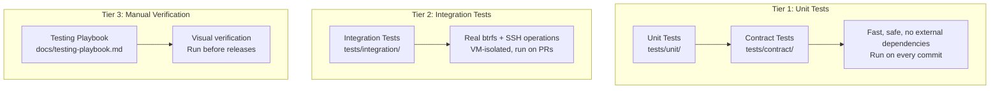
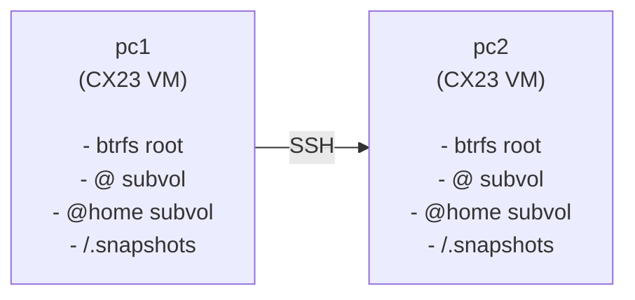
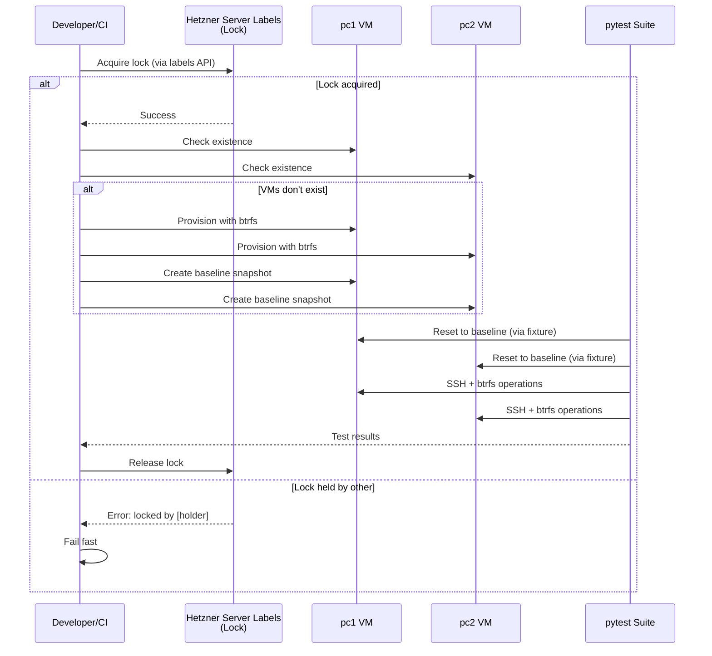

# PC-Switcher Testing Framework

This document describes the testing framework for pc-switcher, including test categories, infrastructure setup, and how to run tests.

## Overview

The testing framework uses a three-tier architecture designed to balance safety, speed, and thoroughness. See [ADR-006: Testing Framework](adr/adr-006-testing-framework.md) for the architectural decision rationale.

### Three-Tier Test Structure



## Test Categories

### A) Unit Tests (Fast, No VMs)

**Purpose:** Test pure logic, business rules, and mocked I/O operations.

**Characteristics:**
- No external dependencies (SSH, real filesystem, network)
- Fast execution (< 30 seconds for full suite)
- Safe to run on any machine
- Use mocked executors for predictable responses

**When to run:** Every commit, every PR.

**Location:** `tests/unit/`, `tests/contract/`

### B) Integration Tests (Require VMs)

**Purpose:** Test real SSH connections, btrfs operations, and full workflows.

**Characteristics:**
- Require 2 Hetzner Cloud VMs (pc1 + pc2)
- Real btrfs filesystem with `@` and `@home` subvolumes
- Real SSH connections between VMs
- Slower execution (5-15 minutes)

**When to run:** On-demand, PRs to main branch.

**Location:** `tests/integration/`

### C) Manual Playbook (Visual Verification)

**Purpose:** Verify visual elements that cannot be automated.

**Characteristics:**
- Progress bar rendering
- Terminal color output
- Rich formatting display

**When to run:** Before releases.

**Location:** `docs/testing-playbook.md`

## VM Infrastructure

### Architecture



### Component Interaction



### VM Specifications

| Property | Value |
|----------|-------|
| Provider | Hetzner Cloud |
| Server Type | CX23 (2 vCPU, 4GB RAM) |
| OS | Ubuntu 24.04 LTS |
| Filesystem | btrfs (root) |
| Location | fsn1 (Falkenstein) |
| Cost | ~€3.50/month per VM |

### Design Rationale

#### Why VM Isolation?

PC-switcher performs destructive operations that cannot be safely executed on developer machines:

- **Root btrfs operations**: Creating, deleting, and rolling back snapshots of system subvolumes
- **Filesystem modifications**: Writing to `/`, `/home`, and other system paths
- **SSH key manipulation**: Generating and exchanging keys between machines
- **System state changes**: Modifying `/etc`, user accounts, and systemd services

Running these operations locally would risk data loss or system corruption if bugs exist in either the implementation or the test code itself. Dedicated VMs provide complete isolation where failures affect only disposable test infrastructure.

#### Why Hetzner Server Labels for Locking?

The lock mechanism must survive VM reboots and resets to remain effective. Hetzner Server Labels provide:

- **Persistence**: Labels survive VM reboots, snapshots, and even VM recreation
- **Atomic operations**: Hetzner API ensures consistent read-modify-write semantics
- **No local state**: Lock state lives in cloud infrastructure, not on VMs
- **Simplicity**: No need for dedicated lock server or database

Alternative approaches (file-based locks on VM, external Redis/etcd) would either be lost during VM reset or require additional infrastructure.

#### Why Btrfs Snapshot Reset?

Resetting VMs to a clean baseline state before each test run ensures test isolation and reproducibility. Btrfs snapshot rollback provides:

- **Speed**: Reset completes in < 30 seconds (snapshot + reboot)
- **Completeness**: Entire filesystem tree returns to exact baseline state
- **Efficiency**: Copy-on-write means snapshots consume minimal space
- **Reliability**: Atomic operation - either fully succeeds or fully fails

Alternative approaches and their drawbacks:

- **Hetzner VM snapshots**: Slow (5-10 minutes), expensive (charged per snapshot)
- **VM recreation**: Very slow (10-15 minutes), complex orchestration
- **Manual cleanup scripts**: Fragile, incomplete, high maintenance burden

### Provisioning

VMs are provisioned exclusively by GitHub CI (no local provisioning). This ensures all authorized SSH keys are properly configured from secrets.

**Triggering Provisioning:**
```bash
# Trigger CI workflow (VMs are created automatically if they don't exist)
gh workflow run test.yml
```

The `provision-test-infra.sh` script (run by CI):
1. Creates pc1 and pc2 VMs (if they don't exist)
2. Installs Ubuntu with btrfs using Hetzner's `installimage`
3. Injects all `SSH_AUTHORIZED_KEY_*` secrets into VMs
4. Runs `configure-hosts.sh` to setup inter-VM networking
5. Creates baseline snapshots

This is a one-time operation; after provisioning, VMs persist and are reset using btrfs snapshot rollback.

### Btrfs Layout

Each VM has the following btrfs subvolume layout (flat layout):

```text
/             → @ subvolume
/home         → @home subvolume
/.snapshots   → @snapshots subvolume (mounted, for pc-switcher)
```

### Snapshot-Based Reset

Before each test run, VMs are reset to a clean baseline state using btrfs snapshot rollback (not Hetzner VM snapshots, which are slow):

1. Create read-only baseline snapshots of `@` and `@home` during initial provisioning
2. Before each test session (automatically via `integration_session` fixture which calls `reset-vm.sh`):
   a. Delete any test artifacts in `/.snapshots/pc-switcher/test-*`
   b. Mount the top-level filesystem as /mnt/btrfs
   c. mv /mnt/btrfs/@ /mnt/btrfs/@_old
   d. btrfs subvolume snapshot /mnt/btrfs/.snapshots/baseline/@ /mnt/btrfs/@
   e. mv /mnt/btrfs/@home /mnt/btrfs/@home_old
   f. btrfs subvolume snapshot /mnt/btrfs/.snapshots/baseline/@home /mnt/btrfs/@home
   g. Reboot VM (~10-20 seconds)
   h. Remove old subvolumes `/mnt/btrfs/@_old` and `/mnt/btrfs/@home_old`
3. Clean state ready for tests

This ensures test isolation without recreating VMs. The btrfs rollback is much faster than Hetzner's VM snapshot restore.

### Baseline State

The baseline snapshots capture the following VM state (as configured by `configure-vm.sh`):

| Component | State | Notes |
|-----------|-------|-------|
| **OS** | Ubuntu 24.04 LTS | Installed via Hetzner `installimage` |
| **Packages** | btrfs-progs, qemu-guest-agent, fail2ban, ufw, sudo | Basic system tools only |
| **Filesystem** | btrfs with flat subvolume layout (`@`, `@home`, `@snapshots`) | Root mounted as `@`, home as `@home` |
| **Users** | `testuser` with passwordless sudo | All developer SSH keys injected |
| **SSH** | Hardened (root login disabled, password auth disabled) | Only key-based auth allowed |
| **Firewall** | ufw enabled, SSH port 22 allowed | fail2ban monitors SSH |
| **pc-switcher** | **NOT installed** | Tests must install if needed |
| **Python tools** | `uv` installed in testuser's ~/.local/bin | For installing pc-switcher |

**IMPORTANT**: The baseline does NOT include pc-switcher. Tests that need pc-switcher must:
- Install it via `curl -sSL https://raw.githubusercontent.com/flaksit/pc-switcher/refs/heads/main/install.sh | bash`
- OR use fixtures like `pc2_executor_without_pcswitcher_tool` or `pc2_executor_with_old_pcswitcher_tool` that handle installation/cleanup

### Test Isolation

**Reset frequency**: VMs are reset to baseline **once per pytest session** (not between test modules).

**Implications for test writers**:
1. Tests in the same session share VM state between modules
2. Each test MUST clean up all artifacts it creates (files, directories, snapshots, installed packages)
3. Fixtures that modify VM state MUST restore the initial state after the test

See [Testing Developer Guide](testing-developer-guide.md#test-isolation-requirements) for detailed requirements and examples.

## Lock-Based Isolation

To prevent conflicts between dev and CI test runs:

```bash
# Lock is acquired at start of test session
tests/integration/scripts/internal/lock.sh $HOLDER acquire

# Lock is released at end
tests/integration/scripts/internal/lock.sh $HOLDER release
```

The lock is stored as **Hetzner Server Labels** on the `pc1` server (not as a file on the VM). This approach survives VM reboots and snapshot rollbacks:

- **Lock labels**: `lock_holder` (identifier) and `lock_acquired` (ISO8601 timestamp)
- **Lock holder format**: `ci-<run_id>` for CI jobs, `local-<username>` for local runs
- **Maximum wait time**: 5 minutes with 10-second retry intervals
- **Atomic acquisition**: Uses Hetzner API with 1-second verification to detect race conditions
- If lock cannot be acquired, tests fail with clear error showing current holder

## Running Tests

### Prerequisites

No manual setup required. Running `uv run pytest ...` automatically:
- Installs the correct Python version if needed
- Syncs dependencies (dev dependencies are included by default)
- Runs the specified command

### Unit Tests (Local)

```bash
# Run all unit tests
uv run pytest tests/unit tests/contract -v

# Run with coverage
uv run pytest tests/unit tests/contract --cov=src/pcswitcher --cov-report=html

# Run specific test file
uv run pytest tests/unit/test_config.py -v
```

### Integration Tests (Require VMs)

```bash
# Set environment variables
export PC_SWITCHER_TEST_PC1_HOST="<pc1-vm-ip>"
export PC_SWITCHER_TEST_PC2_HOST="<pc2-vm-ip>"
export PC_SWITCHER_TEST_USER="testuser"

# Run integration tests
uv run pytest tests/integration -v -m integration
```

### All Tests

```bash
uv run pytest -v
```

## CI/CD Integration

### GitHub Actions Workflow

The CI pipeline runs:

1. **On every push:** Lint + unit tests
2. **On PRs to main:** Lint + unit tests + integration tests
3. **On-demand:** Integration tests via `workflow_dispatch`

### Required Secrets

| Secret | Description |
|--------|-------------|
| `HCLOUD_TOKEN` | Hetzner Cloud API token |
| `HETZNER_SSH_PRIVATE_KEY` | SSH private key for CI VM access |
| `SSH_AUTHORIZED_KEY_CI` | CI public key for VM access |
| `SSH_AUTHORIZED_KEY_*` | Developer public keys (one per developer/machine) |

### Concurrency Control

Integration tests use GitHub Actions `concurrency.group` to prevent parallel runs:

```yaml
concurrency:
  group: pc-switcher-integration
  cancel-in-progress: false
```

## Test Configuration

### pytest.ini

```ini
[pytest]
asyncio_mode = auto
markers =
    integration: marks tests requiring VM infrastructure
testpaths = tests
```

### Environment Variables

| Variable | Description | Default |
|----------|-------------|---------|
| `PC_SWITCHER_TEST_PC1_HOST` | PC1 VM hostname/IP | `pc1` |
| `PC_SWITCHER_TEST_PC2_HOST` | PC2 VM hostname/IP | `pc2` |
| `PC_SWITCHER_TEST_USER` | SSH user on VMs | `testuser` |
| `CI_JOB_ID` | CI job ID for lock identification | `$USER` |

## Developer Workflow

### For Local Development

1. Write code changes
2. Run unit tests locally: `uv run pytest tests/unit -v`
3. Push to branch
4. Integration tests run automatically on PR to main

### For Integration Test Development

1. Ensure your SSH public key is registered as a `SSH_AUTHORIZED_KEY_*` secret
2. Ensure VMs exist (trigger CI if needed: `gh workflow run test.yml`)
3. Run integration tests with env vars set (VMs are automatically reset by the pytest fixture)
4. Tests clean up after themselves

### For Testing install.sh

Since `install.sh` downloads from GitHub, you must:

1. Commit and push your changes
2. Set the test to use your branch/commit URL
3. Run integration tests

The CI workflow automatically handles this by using the PR branch.

## Related Documentation

### Architecture Decision Records

- [ADR-006: Testing Framework](adr/adr-006-testing-framework.md) - Core architectural decisions for the testing framework
- [ADR-005: Asyncio Concurrency](adr/adr-005-asyncio-concurrency.md) - Async execution patterns used in tests
- [ADR-002: SSH Communication Channel](adr/adr-002-ssh-communication-channel.md) - SSH protocol used in integration tests

### Additional Guides

- [Testing Infrastructure](testing-infrastructure.md) - VM provisioning flow and scripts
- [Testing Developer Guide](testing-developer-guide.md) - Guide for writing integration tests
- [Testing Ops Guide](testing-ops-guide.md) - Operational guide for test infrastructure
- [Testing Playbook](testing-playbook.md) - Manual verification playbook
