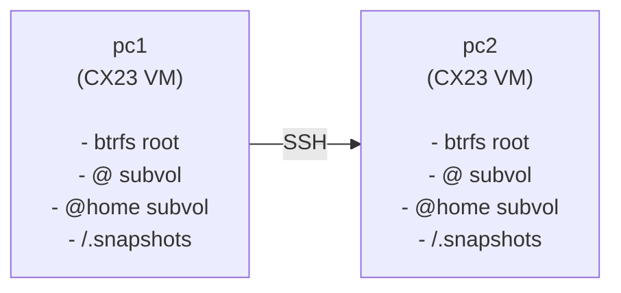

# PC-Switcher Testing Framework

This document describes the testing framework for pc-switcher, including test categories, infrastructure setup, and how to run tests.

## Test Categories

### A) Unit Tests (Fast, No VMs)

**Purpose:** Test pure logic, business rules, and mocked I/O operations.

**Characteristics:**
- No external dependencies (SSH, real filesystem, network)
- Fast execution (< 30 seconds for full suite)
- Safe to run on any machine
- Use mocked executors for predictable responses

**When to run:** Every commit, every PR.

**Location:** `tests/unit/`, `tests/contract/`

### B) Integration Tests (Require VMs)

**Purpose:** Test real SSH connections, btrfs operations, and full workflows.

**Characteristics:**
- Require 2 Hetzner Cloud VMs (pc1 + pc2)
- Real btrfs filesystem with `@` and `@home` subvolumes
- Real SSH connections between VMs
- Slower execution (5-15 minutes)

**When to run:** On-demand, PRs to main branch.

**Location:** `tests/integration/`

### C) Manual Playbook (Visual Verification)

**Purpose:** Verify visual elements that cannot be automated.

**Characteristics:**
- Progress bar rendering
- Terminal color output
- Rich formatting display

**When to run:** Before releases.

**Location:** `specs/001-foundation/testing-playbook.md`

## VM Infrastructure

### Architecture



### VM Specifications

| Property | Value |
|----------|-------|
| Provider | Hetzner Cloud |
| Server Type | CX23 (2 vCPU, 4GB RAM) |
| OS | Ubuntu 24.04 LTS |
| Filesystem | btrfs (root) |
| Location | fsn1 (Falkenstein) |
| Cost | ~€3.50/month per VM |

### Provisioning

VMs are provisioned using OpenTofu (Terraform-compatible) with the Hetzner Cloud provider.

**Initial Setup (one-time):**
```bash
cd tests/infrastructure

# 1. Create VMs with standard Ubuntu image
tofu init
tofu apply

# 2. Convert to btrfs using Hetzner's installimage (runs in rescue mode)
./scripts/provision.sh pc-switcher-pc1
./scripts/provision.sh pc-switcher-pc2

# 3. Configure /etc/hosts so VMs can reach each other
./scripts/configure-hosts.sh
```

The provision script boots each VM into rescue mode and uses Hetzner's `installimage` tool to install Ubuntu with a btrfs root filesystem and the required subvolume layout. This is a one-time operation; after provisioning, VMs persist and are reset using btrfs snapshot rollback.

### Btrfs Layout

Each VM has the following btrfs subvolume layout (flat layout):

```text
/             → @ subvolume
/home         → @home subvolume
/.snapshots   → @snapshots subvolume (mounted, for pc-switcher)
```

### Snapshot-Based Reset

Before each test run, VMs are reset to a clean baseline state using btrfs snapshot rollback (not Hetzner VM snapshots, which are slow):

1. Create read-only baseline snapshots of `@` and `@home` during initial provisioning
2. Before each test run:
   a. Delete any test artifacts in `/.snapshots/pc-switcher/` (preserving baseline snapshots)
   b. Create read-write snapshots from the baseline snapshots for both `@` and `@home`
   c. Set the new `@` snapshot as default using `btrfs set-default`
   d. Update `/home` mount to use the new `@home` snapshot
   e. Reboot VM (~10-20 seconds)
3. Clean state ready for tests

This ensures test isolation without recreating VMs. The btrfs rollback is much faster than Hetzner's VM snapshot restore.

## Lock-Based Isolation

To prevent conflicts between dev and CI test runs:

```bash
# Lock is acquired at start of test session
tests/infrastructure/scripts/lock.sh $HOLDER acquire

# Lock is released at end
tests/infrastructure/scripts/lock.sh $HOLDER release
```

The lock file is stored on pc1 VM at `/tmp/pc-switcher-integration-test.lock`.

- Lock holder info includes: CI job ID or username
- Maximum wait time: 5 minutes
- If lock cannot be acquired, tests fail with clear error

## Running Tests

### Prerequisites

No manual setup required. Running `uv run pytest ...` automatically:
- Installs the correct Python version if needed
- Syncs dependencies (dev dependencies are included by default)
- Runs the specified command

### Unit Tests (Local)

```bash
# Run all unit tests
uv run pytest tests/unit tests/contract -v

# Run with coverage
uv run pytest tests/unit tests/contract --cov=src/pcswitcher --cov-report=html

# Run specific test file
uv run pytest tests/unit/test_config.py -v
```

### Integration Tests (Require VMs)

```bash
# Set environment variables
export PC_SWITCHER_TEST_PC1_HOST="<pc1-vm-ip>"
export PC_SWITCHER_TEST_PC2_HOST="<pc2-vm-ip>"
export PC_SWITCHER_TEST_USER="testuser"

# Run integration tests
uv run pytest tests/integration -v -m integration
```

### All Tests

```bash
uv run pytest -v
```

## CI/CD Integration

### GitHub Actions Workflow

The CI pipeline runs:

1. **On every push:** Lint + unit tests
2. **On PRs to main:** Lint + unit tests + integration tests
3. **On-demand:** Integration tests via `workflow_dispatch`

### Required Secrets

| Secret | Description |
|--------|-------------|
| `HCLOUD_TOKEN` | Hetzner Cloud API token |
| `HETZNER_SSH_PRIVATE_KEY` | SSH private key for VM access |

### Concurrency Control

Integration tests use GitHub Actions `concurrency.group` to prevent parallel runs:

```yaml
concurrency:
  group: pc-switcher-integration
  cancel-in-progress: false
```

## Test Configuration

### pytest.ini

```ini
[pytest]
asyncio_mode = auto
markers =
    integration: marks tests requiring VM infrastructure
testpaths = tests
```

### Environment Variables

| Variable | Description | Default |
|----------|-------------|---------|
| `PC_SWITCHER_TEST_PC1_HOST` | PC1 VM hostname/IP | `pc1` |
| `PC_SWITCHER_TEST_PC2_HOST` | PC2 VM hostname/IP | `pc2` |
| `PC_SWITCHER_TEST_USER` | SSH user on VMs | `testuser` |
| `CI_JOB_ID` | CI job ID for lock identification | `$USER` |

## Developer Workflow

### For Local Development

1. Write code changes
2. Run unit tests locally: `uv run pytest tests/unit -v`
3. Push to branch
4. Integration tests run automatically on PR to main

### For Integration Test Development

1. Ensure VMs are provisioned: `cd tests/infrastructure && tofu apply`
2. Reset VMs to baseline: `./scripts/reset-vm.sh`
3. Run integration tests with env vars set
4. Tests clean up after themselves

### For Testing install.sh

Since `install.sh` downloads from GitHub, you must:

1. Commit and push your changes
2. Set the test to use your branch/commit URL
3. Run integration tests

The CI workflow automatically handles this by using the PR branch.
