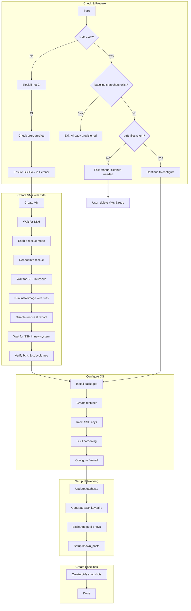

# Testing Infrastructure

This document describes the provisioning process for the pc-switcher integration test infrastructure on Hetzner Cloud.

## Overview

The test infrastructure consists of two VMs (`pc1` and `pc2`) that simulate the source and target machines for pc-switcher sync operations. Both VMs are configured with:

- Ubuntu 24.04 LTS
- btrfs filesystem with subvolumes (`@`, `@home`, `@snapshots`)
- A `testuser` account with sudo access
- SSH key authentication
- Inter-VM SSH connectivity

## Provisioning Flow



### Provisioning Stage Descriptions

| Script | Description |
|--------|-------------|
| **provision-test-infra.sh** | Main orchestrator that coordinates all provisioning steps. Checks VM existence, baseline snapshot existence, and btrfs filesystem state before deciding next action. |
| **create-vm.sh** | Creates VM with btrfs via Hetzner rescue mode and installimage. Handles VM creation, rescue mode boot, filesystem installation, and btrfs subvolume verification. |
| **configure-vm.sh** | Configures OS with testuser account, required packages, SSH hardening, and firewall rules. Runs after VM is fully booted. |
| **configure-hosts.sh** | Sets up inter-VM networking by configuring `/etc/hosts`, generating SSH keypairs, and establishing SSH trust between pc1 and pc2. |
| **create-baseline-snapshots.sh** | Creates btrfs snapshots of both VMs at a clean baseline state. Used by test framework to reset VMs to this state between test runs. |

## Scripts Reference

| Script | Purpose | Called By |
|--------|---------|-----------|
| `provision-test-infra.sh` | Main orchestrator | GitHub Actions workflow |
| `create-vm.sh` | Creates single VM with btrfs | provision-test-infra.sh |
| `configure-vm.sh` | Configures users, packages, SSH | provision-test-infra.sh |
| `configure-hosts.sh` | Sets up inter-VM networking | provision-test-infra.sh |
| `create-baseline-snapshots.sh` | Creates btrfs snapshots | provision-test-infra.sh |
| `reset-vm.sh` | Restores VM to baseline state | Test framework |
| `lock.sh` | Prevents concurrent test runs | Test framework |

## VM States and Recovery

### State 1: VM Does Not Exist

**Detection:** `hcloud server ip <vm>` fails

**Action:** Create VM from scratch (only allowed in CI)

### State 2: VM Exists, No btrfs Filesystem

**Detection:** SSH as root succeeds, but `df -T / | grep btrfs` fails

**Cause:** VM creation started but failed during or after rescue mode before installimage completed

**Action:** Cannot recover automatically. User must:
```bash
hcloud server delete pc1
hcloud server delete pc2
# Then re-trigger the workflow
```

### State 3: VM Exists, Has btrfs, Not Configured

**Detection:** SSH as root succeeds, btrfs check passes, but SSH as testuser fails

**Cause:** create-vm.sh completed but configure-vm.sh failed

**Action:** Re-run configure-vm.sh (automatic)

### State 4: VM Fully Configured

**Detection:** SSH as testuser succeeds

**Action:** Skip provisioning, VMs ready for tests

## Error Handling

### create-vm.sh Errors

| Step | Error | Recovery |
|------|-------|----------|
| VM creation | API error | Fails immediately, no cleanup needed |
| Initial SSH wait | Timeout | VM may be stuck; delete and retry |
| Rescue mode SSH | Timeout | Reboot manually or delete VM |
| installimage | "Cancelled." | Config validation failed - see notes below |
| installimage | Failure | Delete VM and retry |
| Post-install SSH | Timeout | VM may be in bad state; delete and retry |
| btrfs verification | Wrong FS | installimage failed silently; delete and retry |

**installimage "Cancelled." error**: This occurs when config validation fails in automatic mode. Common causes:
- ESP partition < 256MB (Hetzner requires minimum 256MB for UEFI)
- Invalid IMAGE path
- Invalid DRIVE specification
- Missing required btrfs subvolumes

The installimage config is in `create-vm.sh`. Key requirements:
- `PART /boot/efi esp 256M` - ESP must be at least 256MB
- `IMAGE` path must point to a valid image in `/root/.oldroot/nfs/install/../images/`

### configure-vm.sh Errors

| Step | Error | Recovery |
|------|-------|----------|
| Package install | apt failure | Re-run configure-vm.sh |
| User creation | Already exists | Idempotent, continues |
| SSH hardening | Service restart | Re-run configure-vm.sh |

### configure-hosts.sh Errors

| Step | Error | Recovery |
|------|-------|----------|
| /etc/hosts update | SSH failure | Re-run script |
| Key exchange | SSH failure | Re-run script |
| Connectivity test | Connection refused | Check firewall, re-run script |

**Note**: `configure-hosts.sh` connects as `testuser` (not root) because it runs after `configure-vm.sh` which disables root SSH login.

## Manual Operations

### Delete VMs and Start Fresh

```bash
hcloud server delete pc1
hcloud server delete pc2
# Then trigger the workflow again
```

### Check VM State

```bash
# Get VM IPs
hcloud server ip pc1
hcloud server ip pc2

# Check if configured (as testuser)
ssh testuser@<IP> "echo configured"

# Check if btrfs (requires testuser with sudo - root login is disabled after configuration)
ssh testuser@<IP> "df -T / | grep btrfs"

# Check subvolumes
ssh testuser@<IP> "sudo btrfs subvolume list /"
```

**Note**: After `configure-vm.sh` runs, root SSH login is disabled (`PermitRootLogin no`). All SSH access must use `testuser` with sudo for privileged commands.

### Manual VM Configuration

If you need to manually complete configuration:

```bash
# Run configuration (from repo root, in CI)
tests/infrastructure/scripts/configure-vm.sh <IP> "$SSH_AUTHORIZED_KEYS"
tests/infrastructure/scripts/configure-hosts.sh
tests/infrastructure/scripts/create-baseline-snapshots.sh
```

## GitHub Actions Integration

The workflow in `.github/workflows/test.yml`:

1. Sets up SSH keys from secrets
2. Runs `provision-test-infra.sh` with `SECRETS_JSON` containing all secrets
3. Gets VM IPs for pytest
4. Runs integration tests
5. Uploads logs as artifacts

### Required Secrets

| Secret | Purpose |
|--------|---------|
| `HCLOUD_TOKEN` | Hetzner Cloud API access |
| `HETZNER_SSH_PRIVATE_KEY` | SSH private key for VM access |
| `SSH_AUTHORIZED_KEY_CI` | Public key for CI runner |
| `SSH_AUTHORIZED_KEY_*` | Additional authorized keys for manual access |

## SSH Host Key Management

The infrastructure scripts use proper SSH host key verification instead of disabling host key checking entirely. This provides better security while handling the legitimate key changes that occur during VM provisioning.

### Principle

For each host, in each phase:
1. **Phase transition** (key changes): Remove old key + `accept-new`
2. **First connection** (key might not exist): `accept-new` only
3. **Subsequent connections**: Normal SSH (verify stored key)

### SSH Helper Functions

All scripts source `ssh-common.sh` which provides these helpers:

| Function | When to use | Actions |
|----------|-------------|---------|
| `wait_for_ssh` | Phase transition with polling | `ssh-keygen -R` + poll with `accept-new` |
| `ssh_first` | Phase transition (single call) | `ssh-keygen -R` + `accept-new` |
| `ssh_accept_new` | First connection (key might not exist) | `accept-new` only |
| `ssh_run` | Subsequent connections | Normal SSH (verify key) |

### Flow Analysis

#### Flow A: Fresh Provisioning (VMs don't exist)

```
provision-test-infra.sh
  └─ create-vm.sh (×2 parallel)
       └─ wait_for_ssh ← PHASE TRANSITION (created) - remove + accept-new
       └─ wait_for_ssh ← PHASE TRANSITION (rescue) - remove + accept-new
       └─ verify_system()
            └─ wait_for_ssh ← PHASE TRANSITION (installed) - remove + accept-new
            └─ ssh (verify) ← subsequent - ssh_run
  └─ configure-vm.sh (×2 parallel) ← subsequent - ssh_run
  └─ configure-hosts.sh ← subsequent - ssh_run
  └─ create-baseline-snapshots.sh ← subsequent - ssh_run
```

#### Flow B: VMs Exist, Not Configured

```
provision-test-infra.sh
  └─ check_vm_configured(PC1, PC2) ← FIRST (parallel) - ssh_first
  └─ check_vm_has_btrfs(PC1, PC2) ← FIRST (parallel) - ssh_first
  └─ configure-vm.sh ← subsequent - ssh_run
  └─ configure-hosts.sh ← subsequent - ssh_run
  └─ create-baseline-snapshots.sh ← subsequent - ssh_run
```

#### Flow C: Integration Tests (potentially different runner)

```
conftest.py (test runner - may have empty known_hosts)
  └─ reset-vm.sh (×2 parallel) ← FIRST - ssh_accept_new (no remove)
  └─ asyncssh.connect ← subsequent (key from reset-vm.sh)
```

**Why reset-vm.sh doesn't need ssh-keygen -R:**
- Same runner as provisioning → key already correct
- Different runner → known_hosts is empty, nothing to remove
- Key for "installed" phase is stable (never changes after provisioning)

### Script SSH Patterns

| Script | SSH Pattern | Notes |
|--------|-------------|-------|
| `ssh-common.sh` | - | Defines 4 helper functions |
| `create-vm.sh` | `wait_for_ssh` (phase) | 3 phase transitions |
| `provision-test-infra.sh` | `ssh_first` (phase) | Parallel checks for both VMs |
| `configure-vm.sh` | `ssh_run` only | Key established by create-vm.sh |
| `configure-hosts.sh` | `ssh_run` only | Key established |
| `create-baseline-snapshots.sh` | `ssh_run` only | Key established |
| `reset-vm.sh` | `ssh_accept_new` | First from test runner |
| `conftest.py` | Default known_hosts | Key from reset-vm.sh |
| `test_vm_connectivity.py` | No SSH options | VMs have known_hosts from configure-hosts.sh |

## Cost

- Server type: CX22 (2 vCPU, 4GB RAM, 40GB SSD)
- Location: fsn1 (Falkenstein, Germany)
- Cost: ~€4/month per VM when running
- VMs are kept running between workflow runs to avoid reprovisioning

## Integration Test Fixtures

### Event Loop Configuration

pytest-asyncio is configured in `pyproject.toml` with module-scoped event loops:

```toml
[tool.pytest.ini_options]
asyncio_mode = "auto"
asyncio_default_fixture_loop_scope = "module"
asyncio_default_test_loop_scope = "module"
```

**Why both settings?** Fixtures and tests must share the same event loop scope. If fixtures use `loop_scope="module"` but tests default to `loop_scope="function"`, async objects (like SSH connections) created on the module loop cannot be used from the function loop, causing `RuntimeError: Task got Future attached to a different loop`.

**Reference**: [pytest-asyncio concepts](https://pytest-asyncio.readthedocs.io/en/latest/concepts.html) recommends neighboring tests use the same event loop scope.

### Session-Scoped Setup

| Fixture | Purpose |
|---------|---------|
| `integration_lock` | Prevents concurrent test runs via Hetzner labels |
| `integration_session` | VM provisioning and parallel reset to baseline |

The `integration_session` fixture resets both VMs in parallel using `ThreadPoolExecutor` for faster setup (~20s instead of ~37s sequential).

### Module-Scoped Test Fixtures

These fixtures use `scope="module"` for performance (loop_scope defaults to "module" via pyproject.toml):

| Fixture | File | Purpose |
|---------|------|---------|
| `pc1_connection` | `conftest.py` | SSH connection to pc1 |
| `pc2_connection` | `conftest.py` | SSH connection to pc2 |
| `pc1_executor` | `conftest.py` | Command executor for pc1 |
| `pc2_executor` | `conftest.py` | Command executor for pc2 |
| `test_volume` | `test_btrfs_operations.py` | btrfs test subvolume |

**Behavior**:
- Each test MODULE gets its own instances of these fixtures
- Tests within a module share the same SSH connection (~1-2s saved per test)
- Different test files (modules) are completely isolated
- Fixtures are torn down when pytest moves to the next module

**Test requirements**: Tests must clean up their own artifacts (snapshots, files) in try/finally blocks since they share the module's resources.
