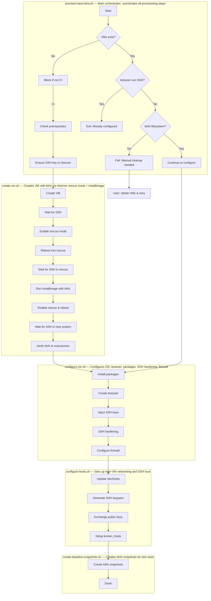

# Testing Infrastructure

This document describes the provisioning process for the pc-switcher integration test infrastructure on Hetzner Cloud.

## Overview

The test infrastructure consists of two VMs (`pc1` and `pc2`) that simulate the source and target machines for pc-switcher sync operations. Both VMs are configured with:

- Ubuntu 24.04 LTS
- btrfs filesystem with subvolumes (`@`, `@home`, `@snapshots`)
- A `testuser` account with sudo access
- SSH key authentication
- Inter-VM SSH connectivity

## Provisioning Flow



## Scripts Reference

| Script | Purpose | Called By |
|--------|---------|-----------|
| `provision-test-infra.sh` | Main orchestrator | GitHub Actions workflow |
| `create-vm.sh` | Creates single VM with btrfs | provision-test-infra.sh |
| `configure-vm.sh` | Configures users, packages, SSH | provision-test-infra.sh |
| `configure-hosts.sh` | Sets up inter-VM networking | provision-test-infra.sh |
| `create-baseline-snapshots.sh` | Creates btrfs snapshots | provision-test-infra.sh |
| `reset-vm.sh` | Restores VM to baseline state | Test framework |
| `lock.sh` | Prevents concurrent test runs | Test framework |

## VM States and Recovery

### State 1: VM Does Not Exist

**Detection:** `hcloud server ip <vm>` fails

**Action:** Create VM from scratch (only allowed in CI)

### State 2: VM Exists, No btrfs Filesystem

**Detection:** SSH as root succeeds, but `df -T / | grep btrfs` fails

**Cause:** VM creation started but failed during or after rescue mode before installimage completed

**Action:** Cannot recover automatically. User must:
```bash
hcloud server delete pc1
hcloud server delete pc2
# Then re-trigger the workflow
```

### State 3: VM Exists, Has btrfs, Not Configured

**Detection:** SSH as root succeeds, btrfs check passes, but SSH as testuser fails

**Cause:** create-vm.sh completed but configure-vm.sh failed

**Action:** Re-run configure-vm.sh (automatic)

### State 4: VM Fully Configured

**Detection:** SSH as testuser succeeds

**Action:** Skip provisioning, VMs ready for tests

## Error Handling

### create-vm.sh Errors

| Step | Error | Recovery |
|------|-------|----------|
| VM creation | API error | Fails immediately, no cleanup needed |
| Initial SSH wait | Timeout | VM may be stuck; delete and retry |
| Rescue mode SSH | Timeout | Reboot manually or delete VM |
| installimage | "Cancelled." | Config validation failed - see notes below |
| installimage | Failure | Delete VM and retry |
| Post-install SSH | Timeout | VM may be in bad state; delete and retry |
| btrfs verification | Wrong FS | installimage failed silently; delete and retry |

**installimage "Cancelled." error**: This occurs when config validation fails in automatic mode. Common causes:
- ESP partition < 256MB (Hetzner requires minimum 256MB for UEFI)
- Invalid IMAGE path
- Invalid DRIVE specification
- Missing required btrfs subvolumes

The installimage config is in `create-vm.sh`. Key requirements:
- `PART /boot/efi esp 256M` - ESP must be at least 256MB
- `IMAGE` path must point to a valid image in `/root/.oldroot/nfs/install/../images/`

### configure-vm.sh Errors

| Step | Error | Recovery |
|------|-------|----------|
| Package install | apt failure | Re-run configure-vm.sh |
| User creation | Already exists | Idempotent, continues |
| SSH hardening | Service restart | Re-run configure-vm.sh |

### configure-hosts.sh Errors

| Step | Error | Recovery |
|------|-------|----------|
| /etc/hosts update | SSH failure | Re-run script |
| Key exchange | SSH failure | Re-run script |
| Connectivity test | Connection refused | Check firewall, re-run script |

**Note**: `configure-hosts.sh` connects as `testuser` (not root) because it runs after `configure-vm.sh` which disables root SSH login.

## Manual Operations

### Delete VMs and Start Fresh

```bash
hcloud server delete pc1
hcloud server delete pc2
# Then trigger the workflow again
```

### Check VM State

```bash
# Get VM IPs
hcloud server ip pc1
hcloud server ip pc2

# Check if configured (as testuser)
ssh testuser@<IP> "echo configured"

# Check if btrfs (requires testuser with sudo - root login is disabled after configuration)
ssh testuser@<IP> "df -T / | grep btrfs"

# Check subvolumes
ssh testuser@<IP> "sudo btrfs subvolume list /"
```

**Note**: After `configure-vm.sh` runs, root SSH login is disabled (`PermitRootLogin no`). All SSH access must use `testuser` with sudo for privileged commands.

### Manual VM Configuration

If you need to manually complete configuration:

```bash
# Run configuration (from repo root, in CI)
tests/infrastructure/scripts/configure-vm.sh <IP> "$SSH_AUTHORIZED_KEYS"
tests/infrastructure/scripts/configure-hosts.sh
tests/infrastructure/scripts/create-baseline-snapshots.sh
```

## GitHub Actions Integration

The workflow in `.github/workflows/test.yml`:

1. Sets up SSH keys from secrets
2. Runs `provision-test-infra.sh` with `SECRETS_JSON` containing all secrets
3. Gets VM IPs for pytest
4. Runs integration tests
5. Uploads logs as artifacts

### Required Secrets

| Secret | Purpose |
|--------|---------|
| `HCLOUD_TOKEN` | Hetzner Cloud API access |
| `HETZNER_SSH_PRIVATE_KEY` | SSH private key for VM access |
| `SSH_AUTHORIZED_KEY_CI` | Public key for CI runner |
| `SSH_AUTHORIZED_KEY_*` | Additional authorized keys for manual access |

## Cost

- Server type: CX22 (2 vCPU, 4GB RAM, 40GB SSD)
- Location: fsn1 (Falkenstein, Germany)
- Cost: ~€4/month per VM when running
- VMs are kept running between workflow runs to avoid reprovisioning
