# Foundation Architecture

This document describes the architecture for the pc-switcher foundation infrastructure, covering the core components, their relationships, and key interaction patterns.

## Design Principles

- **Asyncio-native**: All I/O operations are async; cancellation uses native `asyncio.CancelledError`
- **Single SSH connection**: Multiplexed sessions over one connection for efficiency
- **Job autonomy**: Jobs own their resources and are responsible for cleanup on cancellation
- **Clear separation**: Jobs are isolated units; orchestrator handles coordination
- **Fail-safe**: Graceful degradation and proper cleanup on errors/interrupts

---

## Terminology: Host vs Hostname

Throughout this document, two related but distinct concepts are used:

| Term | Type | Values | Description |
|------|------|--------|-------------|
| **host** | `Host` (enum) | `SOURCE`, `TARGET` | The logical role of a machine in the sync operation |
| **hostname** | `str` | e.g., `"laptop-work"`, `"desktop-home"` | The actual machine name |

**Resolution:**
- Source hostname: obtained from local machine (e.g., `socket.gethostname()`)
- Target hostname: provided via CLI argument `sync <target>`, resolved from config if alias

**Usage:**
- All internal code uses `host` (role enum) exclusively
- Logger resolves `host` → `hostname` internally for output (UI and log files)
- Only `DiskSpaceCriticalError` contains both (for error display without Logger access)

---

## Component Architecture

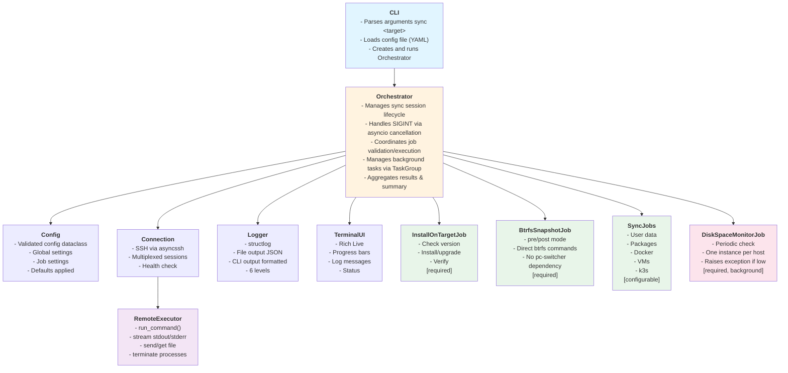

### Component Responsibilities

| Component | Responsibility |
|-----------|----------------|
| **CLI** | Entry point. Parses commands (`sync`, `logs`, `cleanup-snapshots`), loads config file (YAML), instantiates and runs Orchestrator |
| **Orchestrator** | Central coordinator. Validates config (schema + general config + (delegated) job configs), manages job lifecycle via TaskGroup, handles SIGINT via asyncio cancellation, produces final sync summary |
| **Config** | Validated configuration dataclass. Holds global settings, job enable/disable flags, and per-job settings after validation |
| **Connection** | Manages SSH connection via asyncssh. Provides multiplexed sessions (multiple concurrent commands over single connection) |
| **RemoteExecutor** | Job-facing interface to Connection. Runs commands returning `(exit_code, stdout, stderr)`, transfers files, can terminate running processes |
| **Logger** | Unified logging with 6 levels. Routes to file (JSON) and terminal (formatted). Resolves host→hostname internally |
| **TerminalUI** | Rich-based live display. Shows progress bars, log messages (filtered by cli_level), overall status |
| **Jobs** | Encapsulated sync operations. Each job validates their specific config, validates the system state, executes operations, reports progress, cleans up own resources on cancellation |

---

## Class Diagram

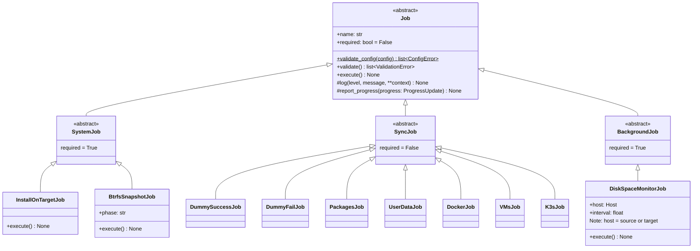

### Supporting Classes

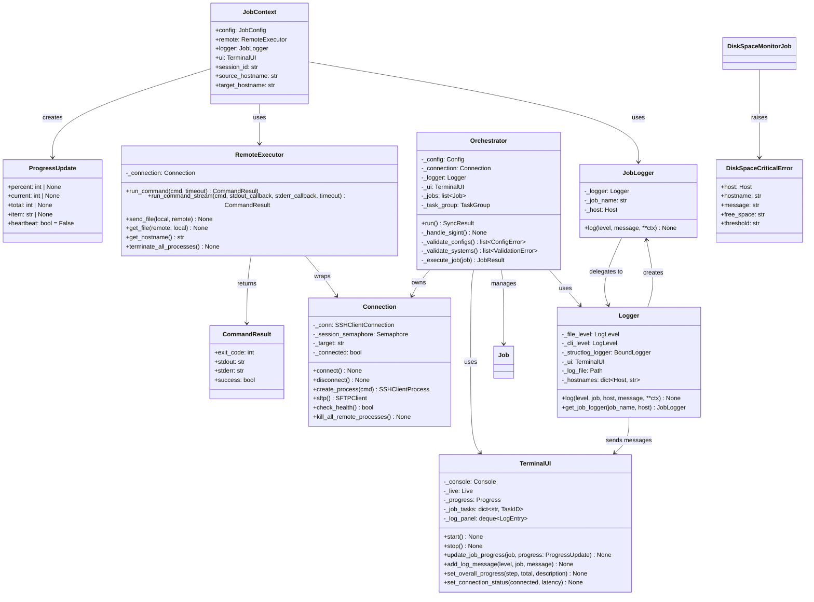

### Class Relationships

| Relationship | Description |
|--------------|-------------|
| Orchestrator → Connection | Owns and manages the SSH connection lifecycle |
| Orchestrator → Job[] | Creates, validates, and executes jobs; uses TaskGroup for background jobs |
| Job → JobContext | Receives context at execution time (config, remote, logger, ui, session_id) |
| JobContext → RemoteExecutor | Jobs use this to run commands on target |
| JobContext → JobLogger | Jobs use this to log messages with pre-bound job name and host (role) |
| RemoteExecutor → Connection | Wraps Connection with job-friendly interface |
| RemoteExecutor → CommandResult | Returns structured result; Job interprets and logs |
| Logger → JobLogger | Creates bound logger instances for each job |
| Logger → TerminalUI | Sends log messages for display (if level >= cli_level) |
| DiskSpaceMonitorJob → DiskSpaceCriticalError | Raises exception (with host and hostname) when space low; TaskGroup propagates |

---

## Validation Phases

Configuration and system validation happen in distinct phases with different error semantics:

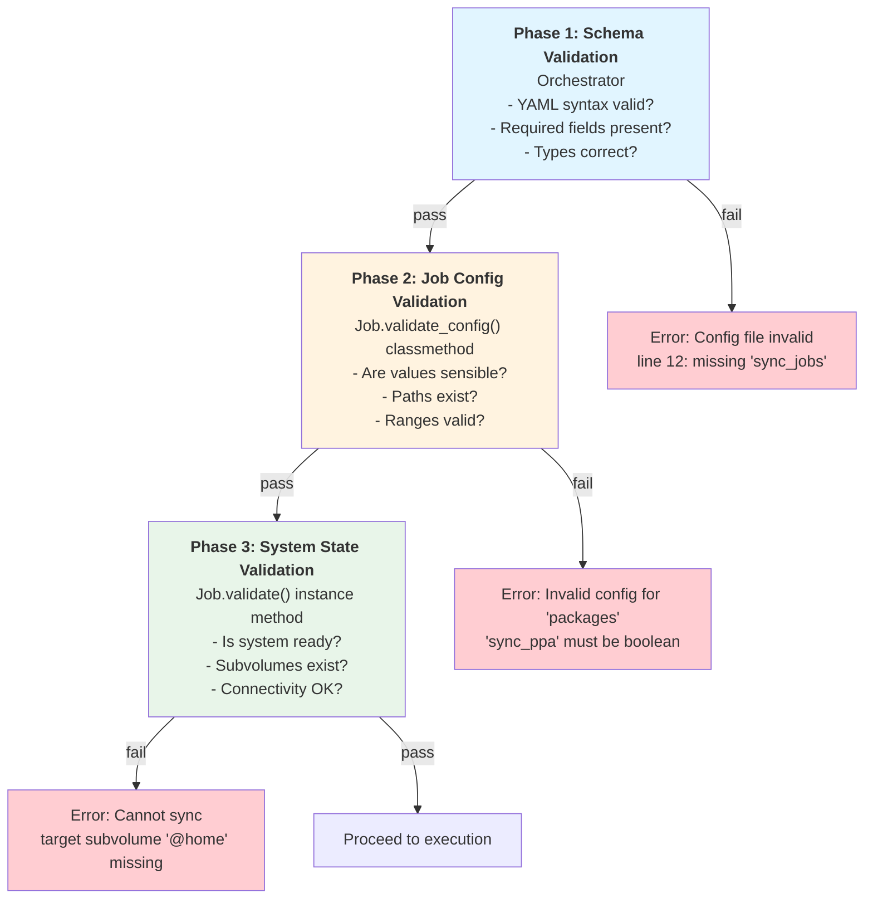

| Phase | Responsibility | Method | Error Message Style |
|-------|----------------|--------|---------------------|
| 1. Schema | Orchestrator | JSON Schema | Config file invalid: ... |
| 2. Job Config | Orchestrator | Job.validate_config() | Invalid config for 'job': ... |
| 3. System State | Jobs | Job.validate() | Cannot sync: ... |

---

## Sequence Diagrams

### 1. User Aborts with Ctrl+C

When the user presses Ctrl+C, asyncio's signal handler cancels the current task. The Job catches `CancelledError`, cleans up its own resources (including remote processes), and re-raises. After timeout, Orchestrator does a final safety sweep.

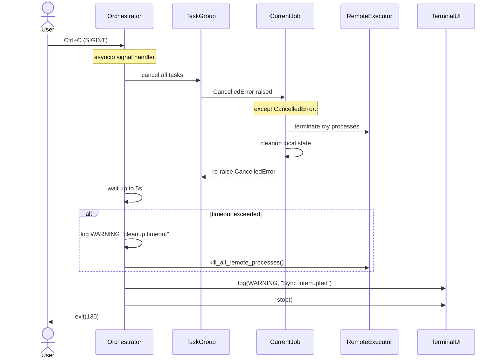

**Key points:**
- Uses native `asyncio.CancelledError` - no polling of flags
- Job owns cleanup of its own remote processes in its `except CancelledError` handler
- Orchestrator only does final safety sweep after timeout (belt-and-suspenders)
- Exit code 130 indicates SIGINT termination (128 + signal number 2)

---

### 2. Job Raises Exception (Critical Failure)

When a job raises an unhandled exception, the TaskGroup catches it and cancels other tasks. The Orchestrator logs at CRITICAL level and offers rollback.

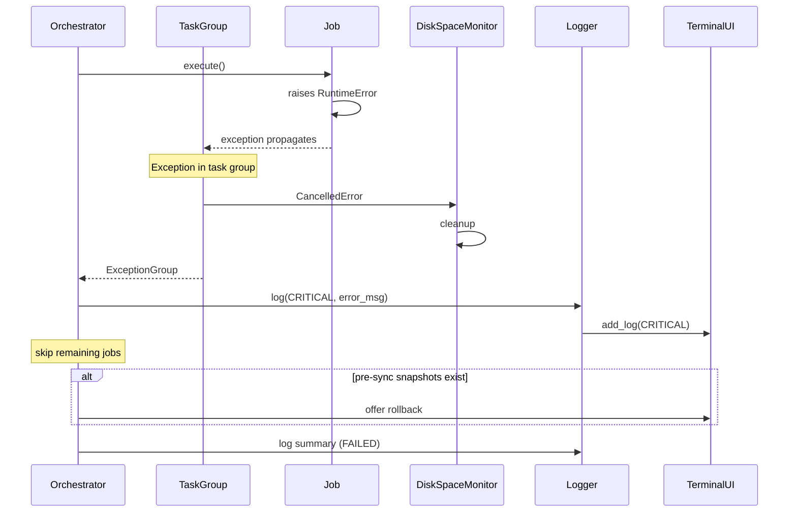

**Key points:**
- TaskGroup automatically cancels sibling tasks when one fails
- No manual `request_termination()` needed
- CRITICAL log entry written with full exception details
- Rollback offered if pre-sync snapshots exist

---

### 3. Remote Command Fails

When a command executed on the target machine fails, RemoteExecutor returns a `CommandResult`. The Job interprets the result and decides how to handle it, including what to log.

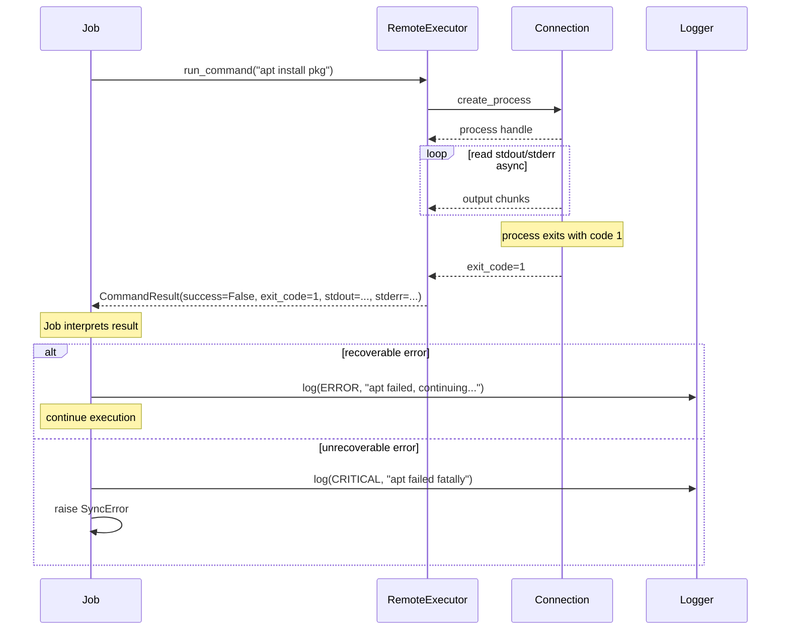

**Key points:**
- `CommandResult` contains: `success`, `exit_code`, `stdout`, `stderr`
- Job has full control over interpretation and logging
- Job decides log level based on context (same failure might be ERROR or CRITICAL)
- No mandatory output protocol - Job parses stdout/stderr as needed

---

### 4. Job Logs a Message

Jobs call the logger directly. The Logger routes to file (JSON) and terminal (if level >= cli_level).

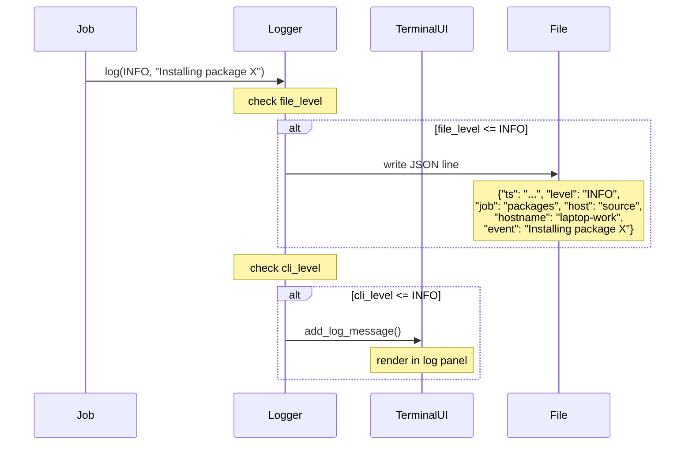

**Key points:**
- Jobs call `self.log(level, message, **context)` directly
- Logger applies two independent filters: `file_level` and `cli_level`
- File output uses structlog JSONRenderer (one JSON object per line)
- Terminal output uses Rich formatting with color-coded levels
- Job decides appropriate log level based on context

---

### 5. Job Reports Progress

Progress updates support multiple formats: percentage, count-based, or heartbeat.

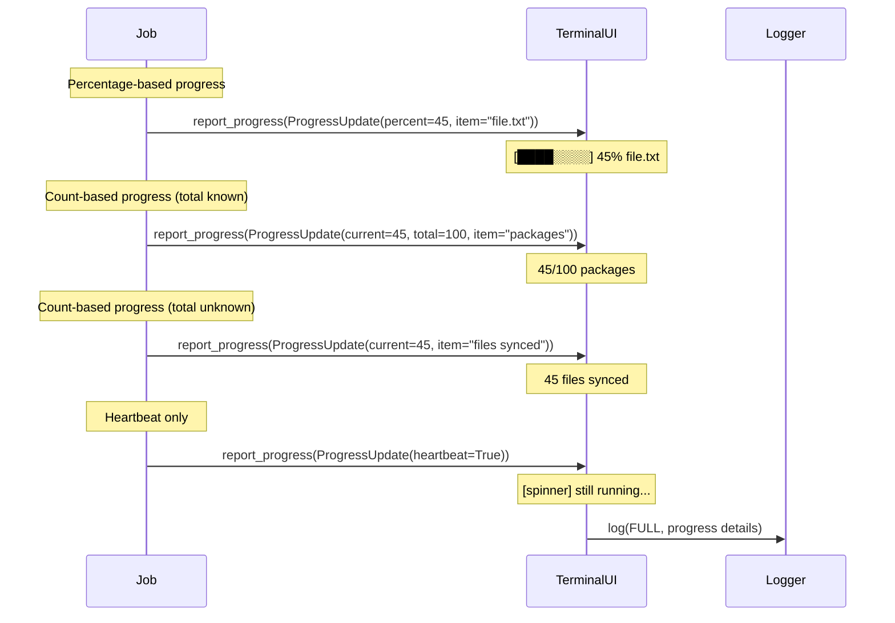

**Key points:**
- `ProgressUpdate` supports: `percent`, `current`, `total`, `item`, `heartbeat`
- UI renders appropriately based on which fields are set
- Progress logged at FULL level for audit trail
- UI updates are batched/throttled to prevent excessive redraws

---

### 6. DiskSpaceMonitor Detects Low Space

Two `DiskSpaceMonitorJob` instances run as background tasks: one for source (local), one for target (remote). When space falls below threshold on either host, the job raises `DiskSpaceCriticalError` with both `host` (role) and `hostname` (actual name). The TaskGroup catches this and cancels other tasks.

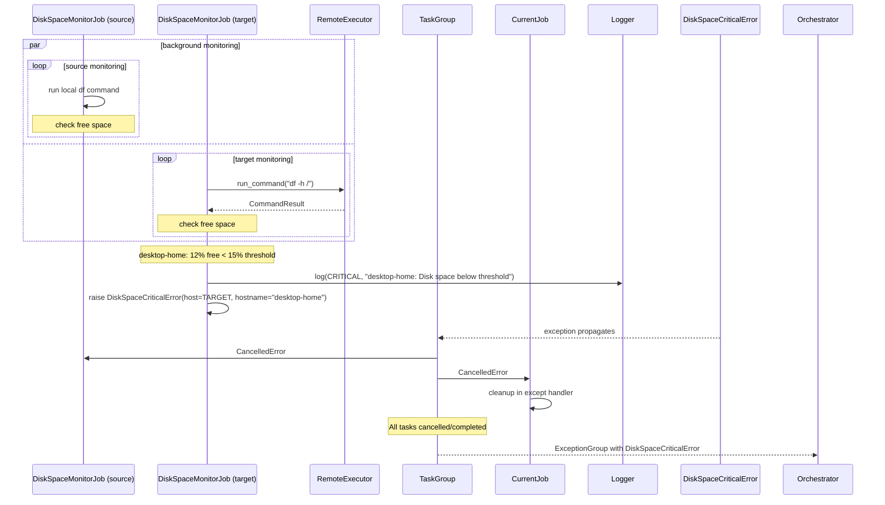

**Key points:**
- Two instances: source monitor runs local commands, target monitor uses `RemoteExecutor`
- `DiskSpaceCriticalError` includes both `host` (role) and `hostname` (actual name)
- Either monitor can trigger sync abort - TaskGroup cancels all other tasks
- Orchestrator receives `ExceptionGroup` and can inspect cause, host, and hostname

---

## Streaming Output Architecture

Multiple concurrent sources produce output that must be displayed coherently in the terminal.

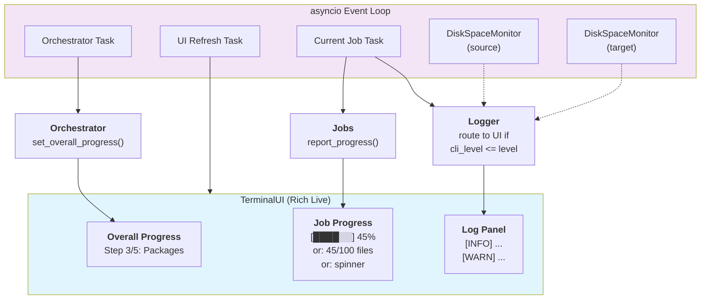

### Data Flow

| Source | Data Type | Destination |
|--------|-----------|-------------|
| Orchestrator | Overall progress (step N/M) | TerminalUI.set_overall_progress() |
| Jobs | ProgressUpdate (%, count, heartbeat) | TerminalUI.update_job_progress() |
| Logger | Log messages (level >= cli_level) | TerminalUI.add_log_message() |
| Connection | Health status | TerminalUI.set_connection_status() |

### Concurrency Model

- **UI Refresh Task**: Runs at fixed interval (e.g., 100ms), renders current state
- **No locks needed**: Each component updates its own state; UI reads atomically during render
- **Backpressure**: Progress updates can be dropped if UI can't keep up (latest value wins)

---

## Remote Command Execution

Jobs run commands on the target via RemoteExecutor. There is **no mandatory output protocol** - Jobs interpret stdout/stderr as needed.

### RemoteExecutor Interface

```python
class RemoteExecutor:
    async def run_command(self, cmd: str, timeout: float | None = None) -> CommandResult:
        """Run command, wait for completion, return result."""

    async def run_command_stream(
        self,
        cmd: str,
        stdout_callback: Callable[[str], None] | None = None,
        stderr_callback: Callable[[str], None] | None = None,
        timeout: float | None = None,
    ) -> CommandResult:
        """Run command, invoke callbacks for each line, return result.

        Args:
            cmd: Command to execute.
            stdout_callback: Optional callback invoked per stdout line.
            stderr_callback: Optional callback invoked per stderr line.
            timeout: Optional timeout in seconds. Omitted = no hard timeout (use asyncio cancellation).

        Returns:
            CommandResult with exit_code, stdout, stderr captured during execution.
        """

    async def send_file(self, local: Path, remote: Path) -> None:
        """Upload file to target."""

    async def get_file(self, remote: Path, local: Path) -> None:
        """Download file from target."""

    def get_hostname(self) -> str:
        """Return target hostname."""

    async def terminate_all_processes(self) -> None:
        """Kill all processes started by this executor."""
```

### Job Approaches for Remote Commands

Jobs choose their approach based on complexity:

**(a) Simple commands**: Run bare command, parse output directly
```python
result = await self.remote.run_command("apt list --installed")
for line in result.stdout.splitlines():
    self.log(DEBUG, f"Installed: {line}")
if not result.success:
    raise SyncError(f"apt list failed: {result.stderr}")
```

**(b) Streaming with callbacks**: Process output as it arrives
```python
lines = []
def collect_stdout(line: str) -> None:
    lines.append(line)
    self.report_progress(ProgressUpdate(current=len(lines), item=line))

result = await self.remote.run_command_stream(
    "rsync -av /home /backup",
    stdout_callback=collect_stdout,
    timeout=3600,
)
if not result.success:
    raise SyncError(f"rsync failed: {result.stderr}")
```

**(c) Complex operations**: Write helper script, deploy and execute
```python
await self.remote.send_file(local_script, "/tmp/sync-helper.py")
result = await self.remote.run_command("python3 /tmp/sync-helper.py")
# Parse structured output if helper produces it
if not result.success:
    raise SyncError(f"Helper failed: {result.stderr}")
```

Jobs are responsible for:
- Interpreting command output and exit code
- Deciding appropriate log levels and error handling
- Reporting progress based on overall job state (not per-command)
- Checking `result.success` to determine next action

---

## Execution Flow Summary

```mermaid
graph TD
    Start["pc-switcher sync &lt;target&gt;"]

    CLI["<b>CLI</b><br/>- Parse arguments<br/>- Load config file (YAML)"]

    SchemaVal["<b>Schema Validation</b><br/>Orchestrator validates:<br/>- Required fields<br/>- Types"]

    JobConfigVal["<b>Job Config Validation</b><br/>Job.validate_config() for each job"]

    Connect["<b>Establish SSH Connection</b>"]

    SystemVal["<b>System State Validation</b><br/>Job.validate() for each job<br/>- Check subvolumes exist<br/>- Check connectivity"]

    SnapPre["<b>BtrfsSnapshotJob pre</b><br/>Direct btrfs commands<br/>No pc-switcher needed"]

    InstallTarget["<b>InstallOnTargetJob</b><br/>Check/install/upgrade<br/>pc-switcher on target"]

    StartDiskMon["<b>Start background</b><br/>DiskSpaceMonitorJob x2<br/>(source + target)"]

    SyncJobs["<b>Sequential job execution</b><br/>- SyncJob1.execute<br/>- SyncJob2.execute<br/>- ..."]

    SnapPost["<b>BtrfsSnapshotJob post</b><br/>Create post-sync snapshots"]

    CancelMon["<b>Cancel DiskSpaceMonitor</b>"]

    Disconnect["<b>Disconnect SSH</b>"]

    Result["<b>Return SyncResult</b><br/>success/failure,<br/>job summaries"]

    Start --> CLI
    CLI --> SchemaVal
    SchemaVal --> JobConfigVal
    JobConfigVal --> Connect
    Connect --> SystemVal
    SystemVal --> SnapPre
    SnapPre --> InstallTarget
    InstallTarget --> StartDiskMon
    StartDiskMon --> SyncJobs
    SyncJobs --> SnapPost
    SnapPost --> CancelMon
    CancelMon --> Disconnect
    Disconnect --> Result

    style Start fill:#fff3e0
    style CLI fill:#e1f5ff
    style SchemaVal fill:#fff3e0
    style JobConfigVal fill:#fff3e0
    style Connect fill:#f3e5f5
    style SystemVal fill:#e8f5e9
    style SnapPre fill:#e8f5e9
    style InstallTarget fill:#e8f5e9
    style StartDiskMon fill:#fce4ec
    style SyncJobs fill:#e8f5e9
    style SnapPost fill:#e8f5e9
    style CancelMon fill:#fce4ec
    style Disconnect fill:#f3e5f5
    style Result fill:#fff3e0
```

**Key ordering notes:**
1. **Snapshots BEFORE InstallOnTargetJob**: BtrfsSnapshotJob runs direct `btrfs` commands via SSH, no pc-switcher dependency. This ensures we have a rollback point before ANY system modifications.
2. **Three validation phases**: Schema → Job config → System state, with distinct error messages.
3. **DiskSpaceMonitor as background tasks**: Two instances run throughout sync - one monitors source (local commands), one monitors target (via `RemoteExecutor`). Either can abort sync on low space.
