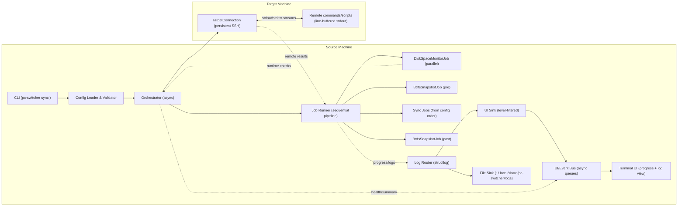
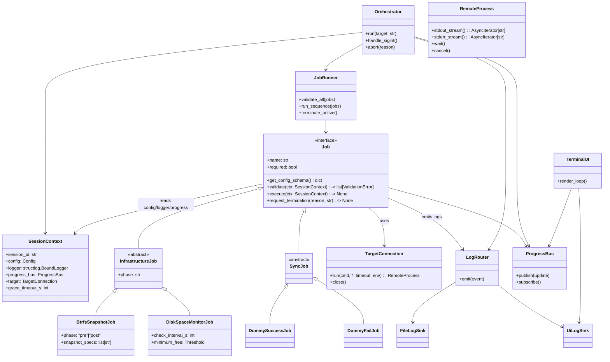
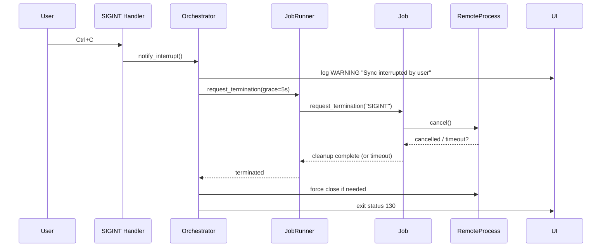
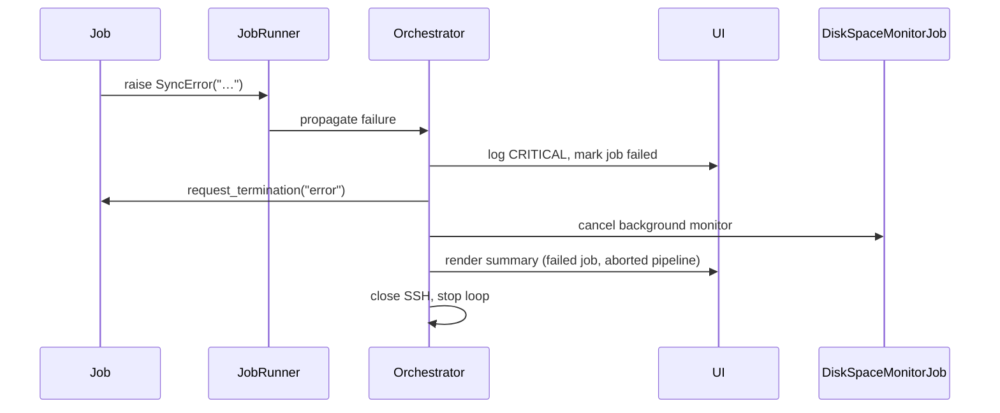
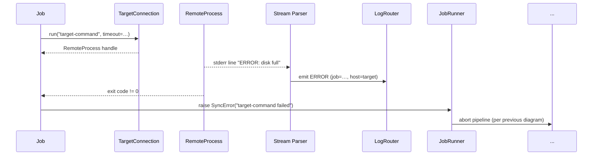
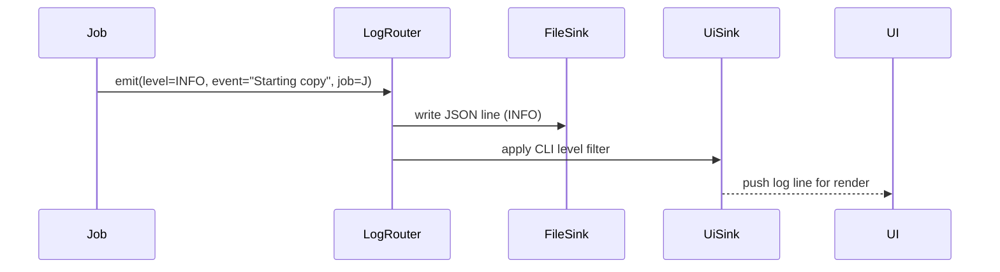
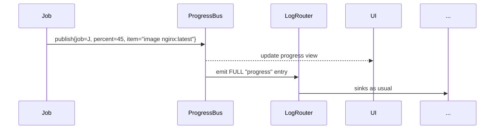
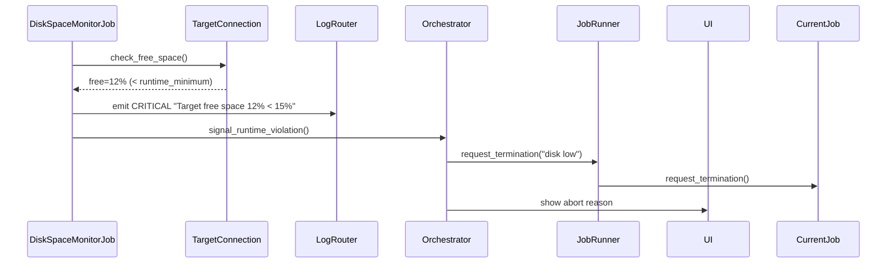
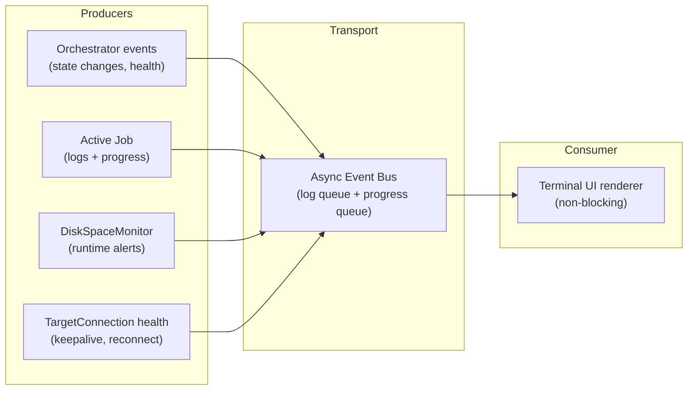

# Architecture (001-foundation)

Scope: foundational orchestration, job contract, logging/progress plumbing, safety jobs (disk space monitor, btrfs snapshots), and SSH-based remote execution for sync. Optimized for reliability first, with explicit interrupt handling and clear job lifecycle.

## Component architecture

**Responsibilities & relationships**
- **CLI**: parses commands/flags, resolves target host, starts `Orchestrator`.
- **Config Loader**: reads `~/.config/pc-switcher/config.yaml`, applies defaults, validates against job-declared schemas.
- **Orchestrator**: owns session lifecycle, installs SIGINT handler, holds `TargetConnection`, wires log/progress buses, builds ordered job list (disk monitor parallel, snapshots fixed, sync jobs from config).
- **Job Runner**: validates all jobs first, then executes flow: start `DiskSpaceMonitorJob` (background), run pre-snapshot, sync jobs sequentially, post-snapshot, stop disk monitor. Handles abort/failure/cleanup.
- **TargetConnection**: single multiplexed SSH channel per ADR-002; runs remote commands, streams stdout/stderr line-buffered to log/progress parser, supports cancellation/timeout.
- **Log Router**: structlog core; routes structured events from orchestrator/jobs/remote streams to file sink (JSON) and UI sink (level-filtered human-readable).
- **Event Bus**: asyncio queues delivering logs/progress/health to UI renderer without blocking job execution.
- **DiskSpaceMonitorJob & BtrfsSnapshotJob**: infrastructure jobs (non-disableable, fixed order). Sync jobs are user-configurable and strictly sequential.

## Class model

**Notes**
- `Job` interface is the contract from the spec; `required` prevents disablement.
- `InfrastructureJob` captures hardcoded jobs; `SyncJob` covers user-configurable jobs.
- `SessionContext` is passed to every job for dependency injection (config, logger, progress bus, target connection, timeouts).
- `TargetConnection` / `RemoteProcess` provide cancellation and streaming control required for remote command management.
- `LogRouter` centralizes the six log levels and dual sinks; UI sink filters per `log_cli_level`.

## Execution flow (high level)
1. Load config, build `SessionContext`, set up structlog sinks and UI/event bus.
2. Validate all jobs (disk monitor, snapshots, sync jobs). Abort on any validation error before state changes.
3. Start disk-space monitor as background task (runs until orchestrator shutdown).
4. Run pre-snapshot job (phase="pre").
5. Run sync jobs sequentially in declared config order.
6. Run post-snapshot job (phase="post").
7. Cancel disk monitor task, flush logs/progress, emit summary, close SSH.

## Sequence diagrams

### User aborts (Ctrl+C)

**Explanation**: SIGINT is trapped; orchestrator signals current job for graceful stop with 5s budget, then force-closes remote process/SSH if the job stalls. UI reflects interruption and exit code 130.

### Job raises a critical exception

**Explanation**: Any `SyncError` short-circuits the pipeline; queued jobs do not start. Disk monitor is stopped, summary emitted, SSH closed cleanly.

### Remote command fails on target

**Explanation**: Remote stdout/stderr are streamed line-by-line; parser tags host/job and feeds LogRouter. Non-zero exit causes the job to raise `SyncError`, triggering orchestrator abort.

### Job logs a message

**Explanation**: Single emission fan-outs to both sinks. File sink always respects configured file level; UI sink filters via `log_cli_level`.

### Job logs progress

**Explanation**: Progress updates are UI-first, but also logged at FULL for audit, satisfying logging requirements.

### DiskSpaceMonitor detects low space

**Explanation**: Monitor runs continuously; on threshold breach it logs CRITICAL and triggers orchestrator-driven abort to prevent further writes.

### Streaming output fan-in to UI (parallel sources)

**Explanation**: Multiple async producers push structured events into shared queues; the UI renderer consumes and paints in a single loop, ensuring streaming output remains responsive even with parallel sources.

