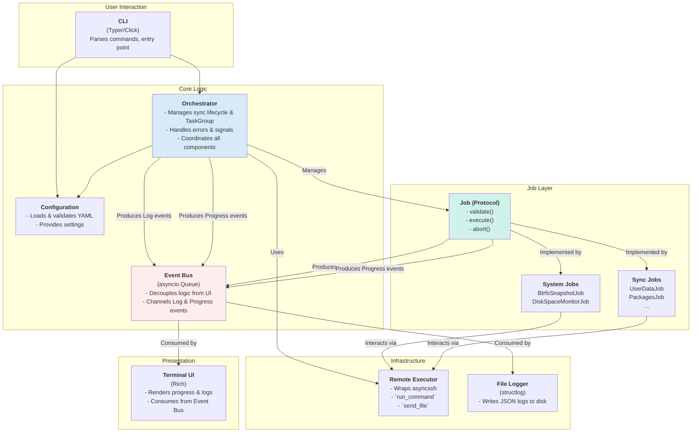
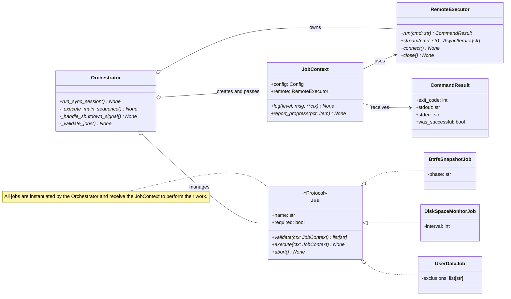
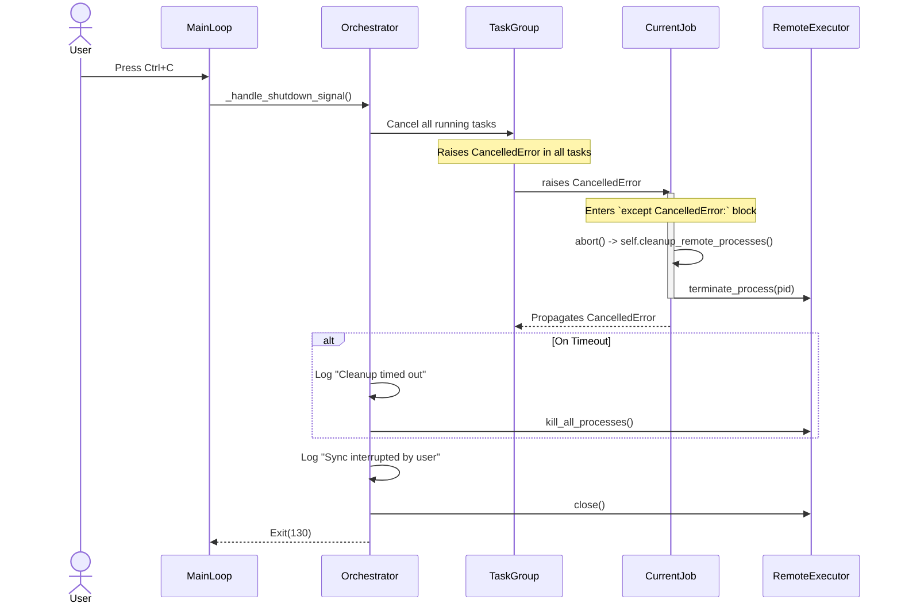
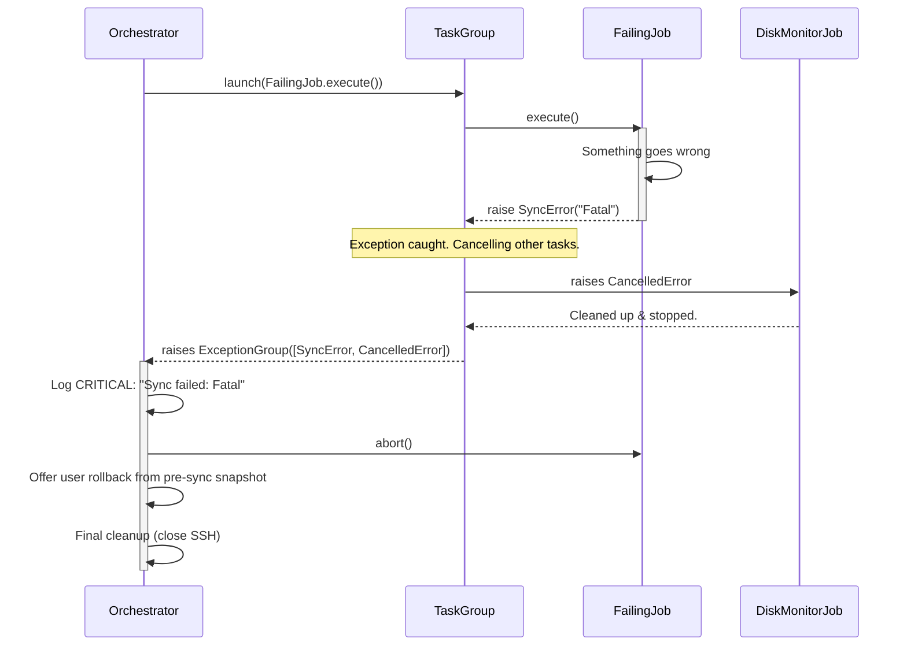
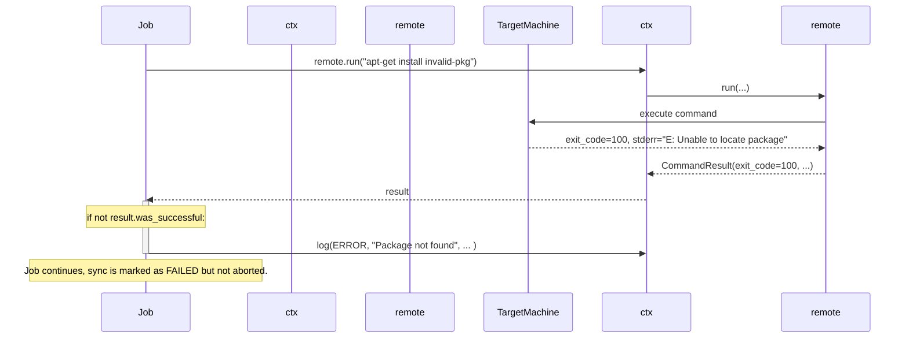
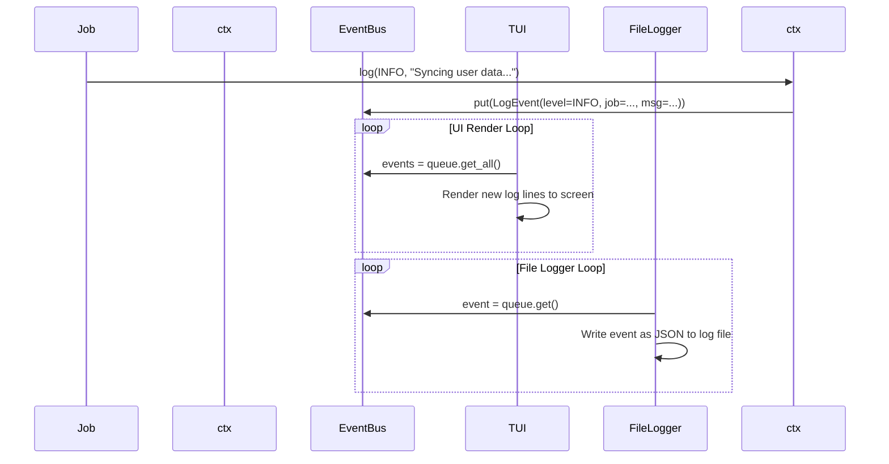
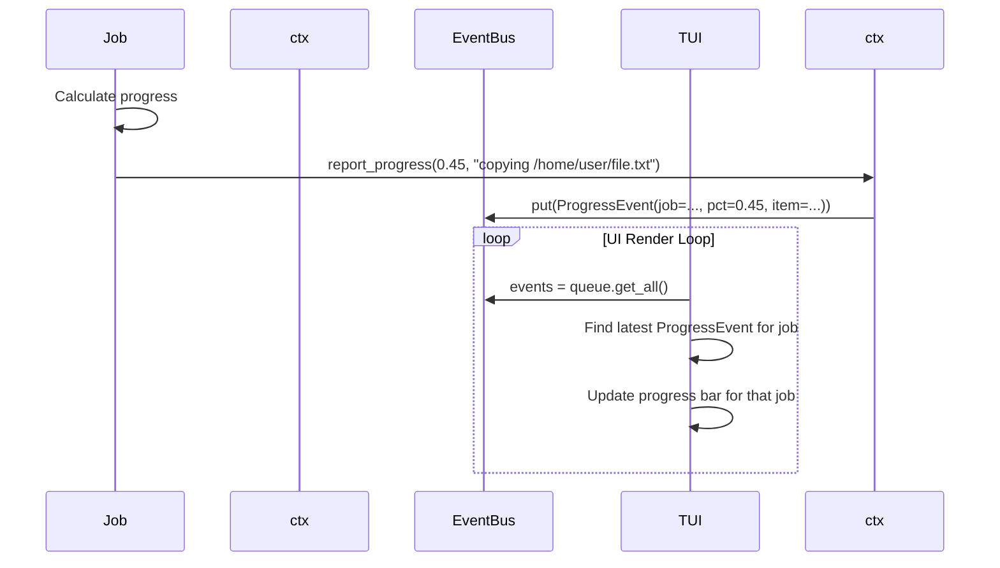
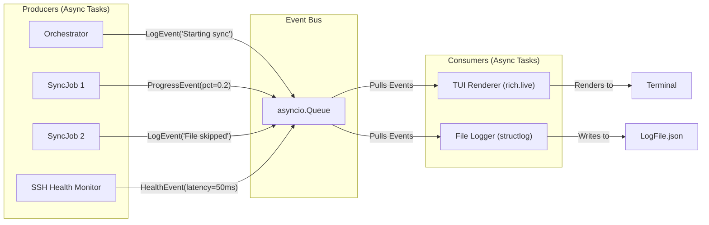

# PC-Switcher Architecture & Design (Gemini 2.5)

This document outlines the software architecture for the `pc-switcher` foundation. It is designed from a clean slate, adhering to the project's core principles of reliability and deliberate simplicity, and leveraging modern Python 3.13+ with `asyncio`.

## 1. Guiding Principles

*   **Asynchronous-First**: The entire I/O-bound workflow is built on `asyncio` to handle concurrent operations (UI, SSH, background monitoring) efficiently without blocking.
*   **Protocol-Oriented**: Jobs are self-contained units adhering to a strict `Job` protocol. The orchestrator interacts with jobs only through this protocol, ensuring loose coupling and modularity.
*   **Dependency Injection**: Components receive their dependencies (like the `RemoteExecutor` or `Logger`) upon creation, promoting testability and separation of concerns.
*   **Event-Driven UI**: The Terminal UI is decoupled from the core logic. It consumes a stream of events (logs, progress) from an `asyncio.Queue`, ensuring the UI remains responsive even if the backend hangs.
*   **Explicit Lifecycle**: The sync process follows a clear, predictable lifecycle managed by the Orchestrator, with distinct phases for validation, execution, and cleanup.

---

## 2. Component Diagram

This diagram shows the high-level components and their relationships.



### Component Responsibilities

*   **CLI**: The main entry point. Parses command-line arguments, instantiates the `Orchestrator`, and starts the `asyncio` event loop.
*   **Orchestrator**: The central nervous system. It loads the configuration, establishes the SSH connection, validates and executes jobs in the correct sequence, manages the `asyncio.TaskGroup` for concurrent tasks, and handles global exceptions and shutdown signals.
*   **Configuration**: A component responsible for loading `config.yaml`, validating it against a schema, applying defaults, and providing typed access to settings.
*   **Event Bus (`asyncio.Queue`)**: A crucial component for decoupling. All parts of the system (Orchestrator, Jobs) publish `LogEvent` or `ProgressEvent` objects to this queue. The `TUI` and `FileLogger` are independent consumers, preventing a slow UI from blocking the sync logic.
*   **Job (Protocol)**: A formal interface (`typing.Protocol`) that all jobs must implement. It defines the lifecycle methods (`validate`, `execute`, `abort`) and properties (`name`, `required`) that the Orchestrator relies on.
*   **System/Sync Jobs**: Concrete implementations of the `Job` protocol. They contain the business logic for a specific task (e.g., creating snapshots, syncing packages).
*   **Remote Executor**: An abstraction over `asyncssh`. It provides a clean, job-friendly API (`run_command`, `stream_output`, `send_file`) for interacting with the target machine, hiding the complexities of the underlying SSH library.
*   **File Logger**: A consumer that pulls events from the Event Bus and writes them to a structured JSON log file on disk.
*   **Terminal UI**: A consumer that pulls events from the Event Bus and renders them in a `rich`-based terminal interface, showing progress bars, status indicators, and filtered log messages.

---

## 3. Class Diagram

This diagram details the key classes and their relationships, centered around the `Job` protocol.



### Class Explanations

*   **Orchestrator**: Manages the entire operational flow. It creates the `JobContext` and injects it into each job. It uses an `asyncio.TaskGroup` to run the `DiskSpaceMonitorJob` concurrently with the main sequential job execution.
*   **JobContext**: A container for all the services a job needs to perform its function. This object is passed to `validate()` and `execute()`, decoupling jobs from the `Orchestrator` itself. The `log` and `report_progress` methods on the context are partial functions that automatically add job-specific context and publish events to the central Event Bus.
*   **RemoteExecutor**: A wrapper around the `asyncssh` library. Its primary purpose is to provide a simplified, robust API for running commands and handling I/O, and to manage the lifecycle of the single SSH connection.
*   **CommandResult**: A simple data class to return the outcome of a remote command, ensuring jobs have structured data to decide on success or failure.
*   **Job (Protocol)**: The key contract. By defining it as a `Protocol`, we ensure any class that "ducks-types" this interface is a valid job, without forcing inheritance from a specific base class. This promotes flexibility. `BtrfsSnapshotJob`, `DiskSpaceMonitorJob`, and `UserDataJob` are examples of concrete implementations.

---

## 4. Sequence Diagrams

### 1. User Aborts (Ctrl+C)

This shows the graceful shutdown process when the user sends a `SIGINT`.



**Explanation**: The `asyncio` signal handler in `MainLoop` triggers the shutdown. The `TaskGroup` is cancelled, which propagates `CancelledError` to all running jobs. Each job is responsible for catching this error and cleaning up its own remote processes via its `abort()` method. The Orchestrator provides a final safety net to kill any remaining processes if cleanup hangs.

### 2. Job Raises a Critical Exception

This shows how the system handles an unrecoverable error within a job.



**Explanation**: When `FailingJob` raises an exception, the `TaskGroup` automatically cancels all other running tasks (like `DiskMonitorJob`). The exception is then propagated to the `Orchestrator`, which logs it, performs cleanup by calling `abort()` on the failed job, and initiates the final shutdown sequence, including offering a rollback.

### 3. Remote Command Fails

This shows a non-fatal error where a job handles a failed remote command.



**Explanation**: The `RemoteExecutor` does not raise an exception on a non-zero exit code. Instead, it returns a `CommandResult` object. The `Job` is responsible for inspecting this result and deciding how to proceed. It can log an `ERROR` and continue (marking the sync as partially failed) or raise a `SyncError` to abort completely.

### 4. Job Logs a Message

This shows the decoupled logging flow.



**Explanation**: The job's `log()` call (via its context) is a non-blocking operation that simply places a `LogEvent` onto the `EventBus` queue. Two independent consumer tasks, the `TUI` and the `FileLogger`, pull from this queue at their own pace to process the event. This prevents a slow file write or UI redraw from blocking the core sync logic.

### 5. Job Logs Progress

Progress reporting follows the same event-driven pattern as logging.



**Explanation**: Just like logging, reporting progress is a non-blocking `put` to the `EventBus`. The TUI renderer consumes these events and updates the appropriate `rich.progress` bar.

### 6. DiskSpaceMonitor Detects Full Disk

This shows a parallel task triggering a system-wide abort.

```mermaid
sequenceDiagram
    participant Orchestrator
    participant TaskGroup
    participant DiskMonitorJob
    participant CurrentSyncJob

    Note over TaskGroup: DiskMonitorJob and CurrentSyncJob running concurrently

    loop Every 30 seconds
        DiskMonitorJob->>DiskMonitorJob: Check remote disk space
        opt Space is below threshold
            DiskMonitorJob->>DiskMonitorJob: log(CRITICAL, "Disk space low!")
            DiskMonitorJob-->>TaskGroup: raise DiskSpaceError
            break
        end
    end

    Note over TaskGroup: DiskSpaceError caught. Cancelling other tasks.
    TaskGroup->>CurrentSyncJob: raises CancelledError
    CurrentSyncJob-->>TaskGroup: Cleans up and stops.

    TaskGroup-->>Orchestrator: raises ExceptionGroup([DiskSpaceError, CancelledError])

    Orchestrator->>Orchestrator: Handle critical failure (logs, cleanup, offers rollback).
```

**Explanation**: The `DiskSpaceMonitorJob` runs in a continuous loop. When it detects a critical condition, it raises a custom `DiskSpaceError`. The `TaskGroup` catches this, immediately cancels the `CurrentSyncJob`, and propagates the error up to the `Orchestrator` for handling.

---

## 5. UI Streaming Architecture

The UI is a passive observer of an event stream, ensuring it remains responsive and decoupled from the execution logic.



**Explanation**:
1.  **Producers**: Multiple asynchronous tasks (the main orchestrator logic, running jobs, a potential SSH health checker) can produce events.
2.  **Event Bus**: All events are placed on a single `asyncio.Queue`. This is the central, thread-safe communication channel.
3.  **Consumers**: The `TUI` and `FileLogger` are two independent tasks that consume from the queue. The TUI can read events in batches to update the screen, while the logger can process them one-by-one. This model ensures that a slow consumer (e.g., disk I/O for the logger) does not impact other parts of the system.

---

## 6. Clarifying Questions

1.  **SSH Library**: ADR-003 mentions monitoring Paramiko, which has a traditionally blocking API. This architecture assumes the use of a modern, `asyncio`-native library like `asyncssh` to align with the async-first principle. Is the use of `asyncssh` approved, or is there a strict requirement to wrap a blocking library like Paramiko?
2.  **UI Library**: This design assumes `rich` for the Terminal UI, which is excellent for static layouts and progress bars. If more complex interactivity is needed in the future (e.g., scrolling back through logs *during* a sync, clickable buttons), a full-fledged TUI framework like `textual` would be a better choice. Is the simpler `rich`-based approach sufficient for the foundation?
3.  **Dependency Injection**: The design uses simple constructor injection (passing dependencies like `RemoteExecutor` into a job's constructor). This is clean and simple. Is this approach preferred over a more formal DI container library like `dependency-injector`?
