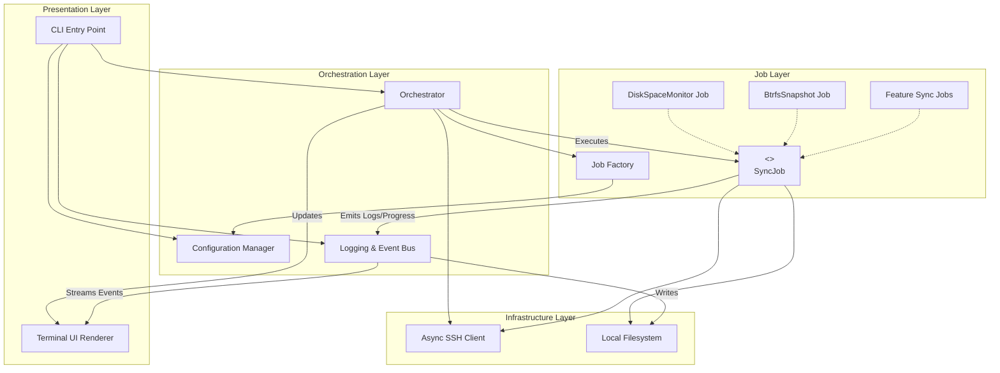
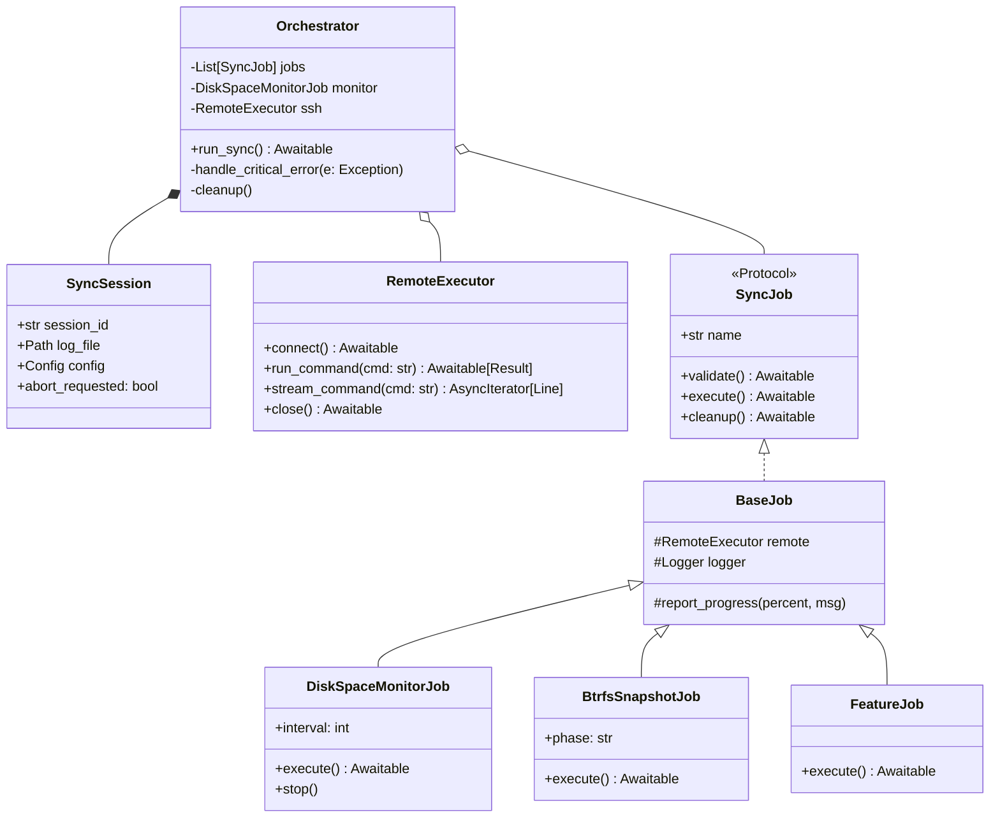
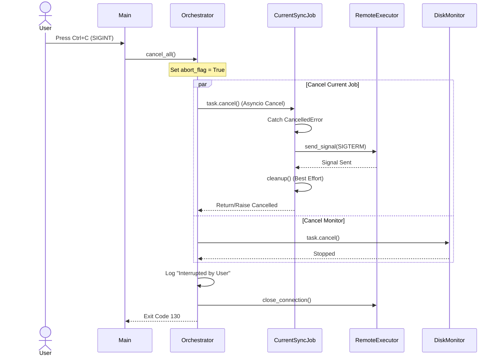
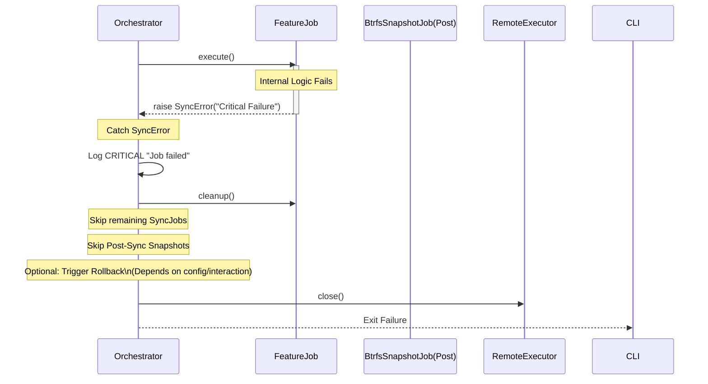
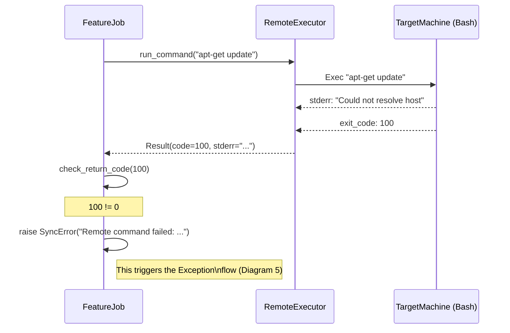
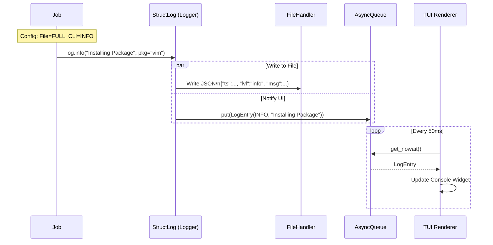
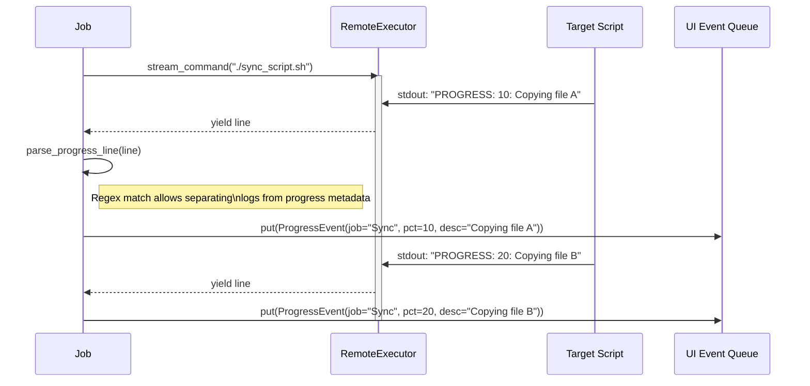
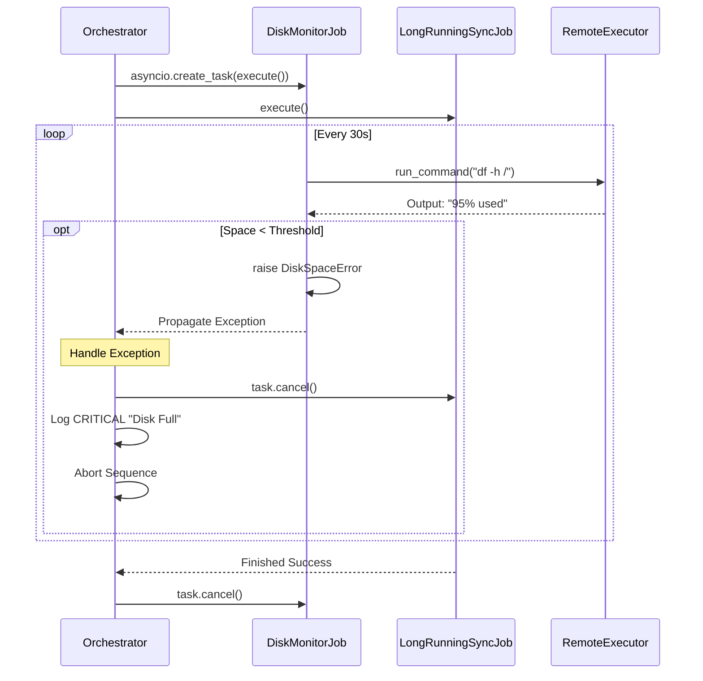
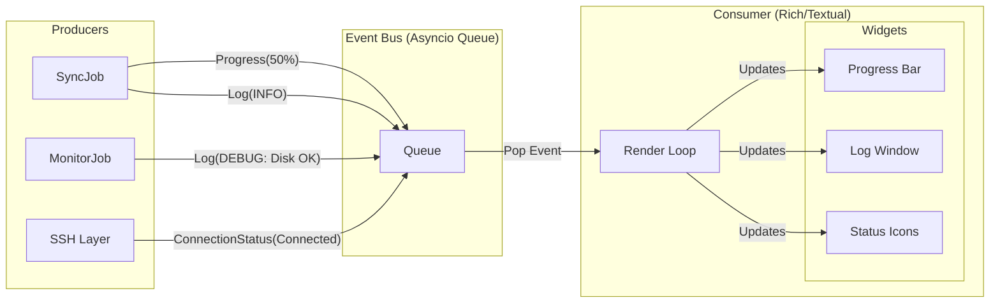

Here is the architectural design document for **pc-switcher**.

This design leverages **Python 3.13**, **asyncio**, and **uv**, adhering to the principles of Deliberate Simplicity and Reliability. It decouples the UI from the execution logic using an event-driven approach for logging and progress, ensuring the UI remains responsive even during heavy I/O.

-----

# PC-Switcher Architecture & Design

## 1\. Architecture Overview

The system follows a **Layered Architecture** with a strong emphasis on **Dependency Injection** and **Asynchronous Control Flow**.

### Core Layers

1.  **Presentation Layer (UI):** Handles user input (CLI args) and rendering (TUI). It observes state changes but does not drive logic.
2.  **Orchestration Layer:** The "Brain." Manages the lifecycle of the sync session, error handling, and the sequential/parallel execution flow.
3.  **Job Layer:** Contains the specific business logic (User Data, BTRFS Snapshots, Disk Monitor). All units here adhere to a strict `SyncJob` protocol.
4.  **Infrastructure Layer:** Handles low-level I/O—SSH connections, file system operations, and raw process execution.

### Concurrency Model

We use `asyncio`.

  * **Main Event Loop:** driven by the CLI entry point.
  * **Orchestrator:** runs the sequential flow.
  * **DiskMonitor:** runs as a concurrent `asyncio.Task`.
  * **UI Updates:** Consumes a `Queue` of log/progress events to update the screen without blocking execution.

-----

## 2\. Component Diagram

### Component Responsibilities

  * **CLI Entry Point:** Uses `typer` or `click`. Bootstraps the `uvloop`, loads config, and instantiates the Orchestrator.
  * **Logging & Event Bus:** A wrapper around `structlog`. It acts as a multiplexer: it writes JSON logs to the file system and pushes `LogEntry` objects into an `asyncio.Queue` for the TUI to consume.
  * **Orchestrator:** Maintains the `SyncSession` state. It handles the `try/except` blocks for the whole process, manages the "Pre" and "Post" phases, and controls the cancellation of the parallel DiskMonitor.
  * **Job Factory:** Reads the `config.yaml`, determines which jobs are enabled, and instantiates classes ensuring dependencies (SSH, Config) are injected.
  * **SyncJob (Protocol):** The standard interface. Ensures every component (monitor, snapshot, sync) looks the same to the Orchestrator.
  * **Async SSH Client:** A wrapper (likely around `asyncssh` or `asyncio.subprocess` with OpenSSH) that provides a simplified API (`run_command`, `stream_command`) and connection persistence.

-----

## 3\. Class Diagram

### Class Explanations

  * **SyncSession:** A data class (Context Object) passed around to maintain state and configuration.
  * **RemoteExecutor:** Encapsulates the SSH complexity. It ensures that if we switch from `asyncssh` to wrapping `paramiko` later (or standard `ssh` binary via subprocess), the jobs don't change.
  * **Orchestrator:** Contains the high-level logic defined in your prompt (Validate -\> Start Monitor -\> Seq Jobs -\> Stop Monitor).
  * **BaseJob:** An abstract base class that provides helper methods for logging and parsing progress output from shell commands, adhering to DRY.

-----

## 4\. Sequence Diagram: User Aborts (Ctrl+C)

This demonstrates the graceful shutdown. We assume a `SIGINT` handler is registered in the main loop which triggers the `Orchestrator.abort()` method.

-----

## 5\. Sequence Diagram: Job Raises Critical Exception

This covers `FR-019`. A job fails, prompting a halt.

-----

## 6\. Sequence Diagram: Remote Command Failure

This details how a shell script failure on the target propagates back to Python.

-----

## 7\. Sequence Diagram: Logging Flow

How a log message gets from deep code to the screen and file simultaneously.

-----

## 8\. Sequence Diagram: Progress Reporting

Streaming progress (e.g., from `rsync` or a script) to the UI.

-----

## 9\. Sequence Diagram: Disk Space Monitor (Parallel)

The monitor runs *while* other jobs are running.

-----

## 10\. UI Streaming & State Illustration

The UI component is an **Observer**. It doesn't query jobs; it reacts to a stream of events. This ensures that if the SSH connection hangs, the UI doesn't freeze (it just stops updating progress, but the spinner/timer keeps moving).

-----

## Clarifying Questions

1.  **SSH Library:** The prompt mentions `asyncio`, but ADR-003 mentions monitoring Paramiko (blocking). I have assumed `asyncssh` or a functional equivalent wrapper to satisfy the architecture's non-blocking requirement. Is this acceptable, or must we wrap Paramiko in `run_in_executor`?
2.  **UI Library:** I am assuming `rich` (specifically `rich.live` and `rich.progress`) is sufficient. If you require complex interactive widgets (scrolling back logs *during* sync, clicking buttons), we should upgrade to `textual`.
3.  **Config Injection:** Are we using a DI container (like `dependency-injector`) or simple constructor injection? The design currently assumes simple constructor injection (simpler, fits "Deliberate Simplicity").
