# Foundation Architecture

This document describes the architecture for the pc-switcher foundation infrastructure, covering the core components, their relationships, and key interaction patterns.

## Design Principles

- **Asyncio-native**: All I/O operations are async; cancellation uses native `asyncio.CancelledError`
- **Single SSH connection**: Multiplexed sessions over one connection for efficiency
- **Job autonomy**: Jobs own their resources and are responsible for cleanup on cancellation
- **Clear separation**: Jobs are isolated units; orchestrator handles coordination
- **Fail-safe**: Graceful degradation and proper cleanup on errors/interrupts

---

## Terminology: Host vs Hostname

Throughout this document, two related but distinct concepts are used:

| Term | Type | Values | Description |
|------|------|--------|-------------|
| **host** | `Host` (enum) | `SOURCE`, `TARGET` | The logical role of a machine in the sync operation |
| **hostname** | `str` | e.g., `"laptop-work"`, `"desktop-home"` | The actual machine name |

**Resolution:**
- Source hostname: obtained from local machine (e.g., `socket.gethostname()`)
- Target hostname: provided via CLI argument `sync <target>`, resolved from SSH config if alias

**Usage:**
- All internal code uses `host` (role enum) exclusively
- Logger resolves `host` → `hostname` internally for output (UI and log files)

---

## Component Architecture

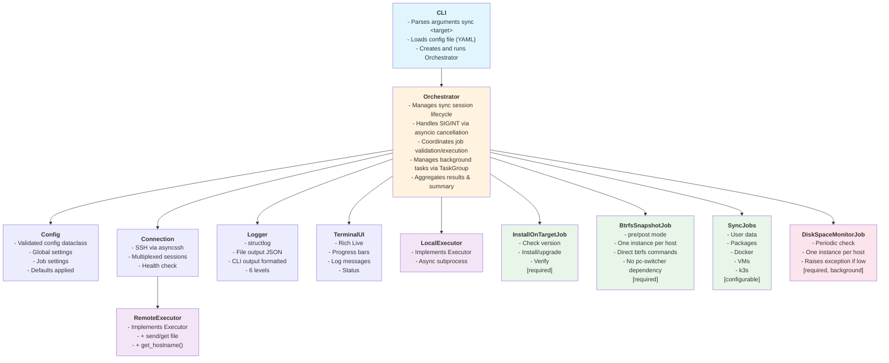

### Component Responsibilities

| Component | Responsibility |
|-----------|----------------|
| **CLI** | Entry point. Parses commands (`sync`, `logs`, `cleanup-snapshots`, `rollback`), loads config file (YAML), instantiates and runs Orchestrator |
| **Orchestrator** | Central coordinator. Validates config (schema + general config + (delegated) job configs), manages job lifecycle via TaskGroup, handles SIGINT via asyncio cancellation, produces final sync summary |
| **Config** | Validated configuration dataclass. Holds global settings, job enable/disable flags, and per-job settings after validation |
| **Connection** | Manages SSH connection via asyncssh. Provides multiplexed sessions (multiple concurrent commands over single connection) |
| **LocalExecutor** | Implements `Executor` interface for local async subprocess execution. Used by source-side jobs |
| **RemoteExecutor** | Implements `Executor` interface via Connection. Adds file transfer (`send_file`, `get_file`) and `get_hostname()` |
| **Logger** | Unified logging with 6 levels. Routes to file (JSON) and terminal (formatted). Resolves host→hostname internally |
| **TerminalUI** | Rich-based live display. Shows progress bars, log messages (filtered by cli_level), overall status |
| **Jobs** | Encapsulated sync operations. Each job validates their specific config, validates the system state, executes operations, reports progress, cleans up own resources on cancellation |

---

## Event Bus Architecture

All logging and progress events flow through an event bus with per-consumer queues for guaranteed delivery. This decouples producers from consumers and ensures the UI never blocks job execution.

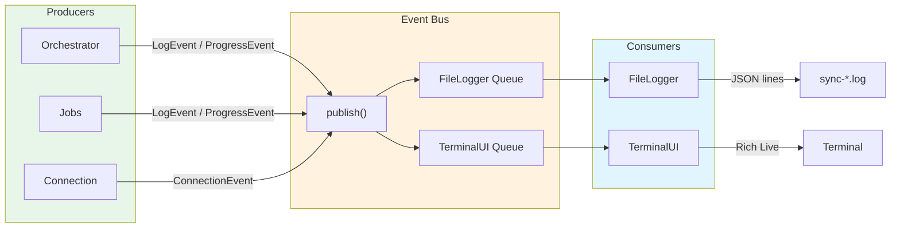

### Event Types

| Event | Fields | Description |
|-------|--------|-------------|
| `LogEvent` | level, job, host, message, context, timestamp | Log message from any component |
| `ProgressEvent` | job, update (ProgressUpdate), timestamp | Job progress update (update contains percent, current, total, item, heartbeat) |
| `ConnectionEvent` | status, latency | SSH connection status change |

### Properties

- **Fan-out delivery**: Each event is copied to all consumer queues
- **Non-blocking puts**: Producers use `put_nowait()`, never wait
- **Guaranteed delivery**: Per-consumer queues ensure no event loss even if one consumer is slow
- **Graceful shutdown**: `close()` signals consumers to drain queues and exit

---

## Class Diagram

### Job Classes

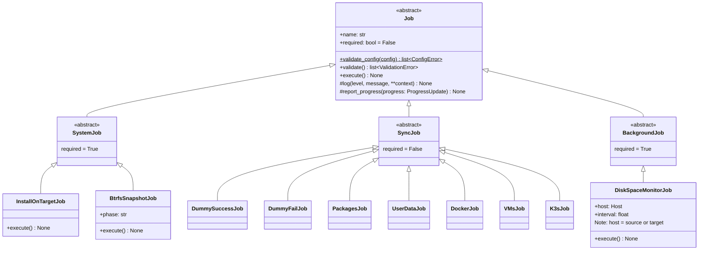

### Supporting Classes

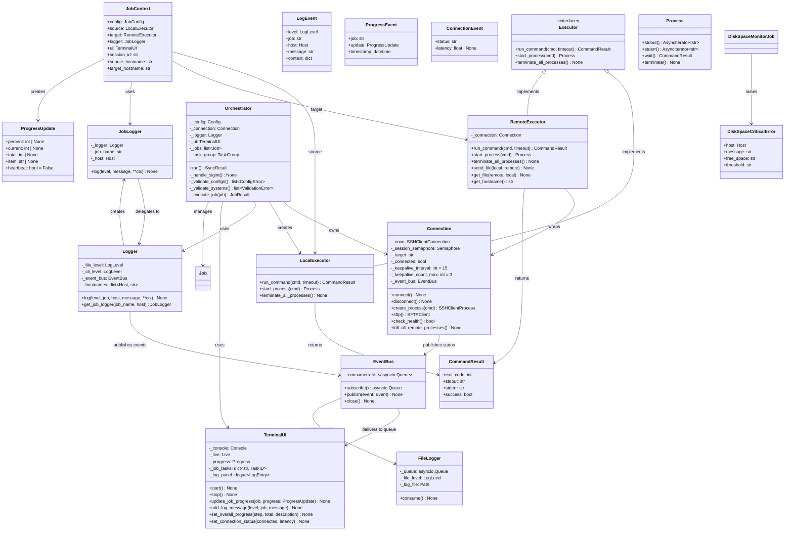

### Class Relationships

| Relationship | Description |
|--------------|-------------|
| Orchestrator → Connection | Owns and manages the SSH connection lifecycle |
| Orchestrator → LocalExecutor | Creates for local command execution |
| Orchestrator → Job[] | Creates, validates, and executes jobs; uses TaskGroup for background jobs |
| Orchestrator → EventBus | Creates and owns the event bus for logging/progress |
| Job → JobContext | Receives context at execution time (config, source, target, logger, ui, session_id) |
| JobContext → LocalExecutor | `source` field - for running commands on source machine |
| JobContext → RemoteExecutor | `target` field - for running commands on target machine + file transfers |
| JobContext → JobLogger | Jobs use this to log messages with pre-bound job name and host (role) |
| RemoteExecutor → Connection | Wraps Connection with job-friendly interface |
| RemoteExecutor → CommandResult | Returns structured result; Job interprets and logs |
| Logger → JobLogger | Creates bound logger instances for each job |
| Logger → EventBus | Publishes LogEvent for each log call |
| EventBus → FileLogger | Delivers events to FileLogger's dedicated queue |
| EventBus → TerminalUI | Delivers events to TerminalUI's dedicated queue |
| Connection → EventBus | Publishes ConnectionEvent on status changes |
| DiskSpaceMonitorJob → DiskSpaceCriticalError | Raises exception (with host and hostname) when space low; TaskGroup propagates |

---

## Validation Phases

Configuration and system validation happen in distinct phases with different error semantics:

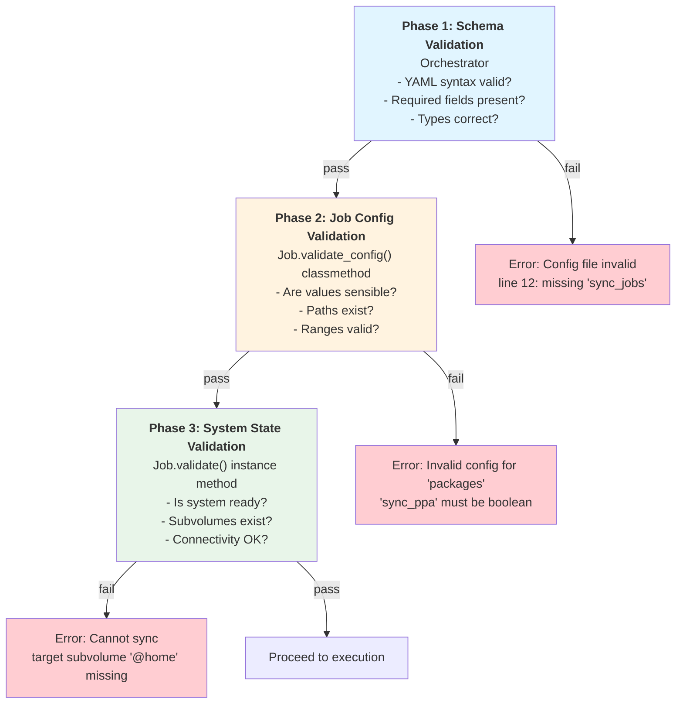

| Phase | Responsibility | Method | Error Message Style |
|-------|----------------|--------|---------------------|
| 1. Schema | Orchestrator | JSON Schema | Config file invalid: ... |
| 2. Job Config | Orchestrator | Job.validate_config() | Invalid config for 'job': ... |
| 3. System State | Jobs | Job.validate() | Cannot sync: ... |

### BtrfsSnapshotJob Validation (Phase 3)

Per FR-015, `BtrfsSnapshotJob.validate()` MUST verify subvolumes exist on **both** source and target:

```python
async def validate(self, context: JobContext) -> list[ValidationError]:
    errors = []
    subvolumes = context.config.get("subvolumes", ["@", "@home"])

    for subvol in subvolumes:
        # Check source
        result = await context.source.run_command(
            f"sudo btrfs subvolume show /{subvol} 2>/dev/null"
        )
        if not result.success:
            errors.append(ValidationError(
                job=self.name,
                host=Host.SOURCE,
                message=f"Subvolume '{subvol}' not found on source",
            ))

        # Check target (identical subvolume structure assumed)
        result = await context.target.run_command(
            f"sudo btrfs subvolume show /{subvol} 2>/dev/null"
        )
        if not result.success:
            errors.append(ValidationError(
                job=self.name,
                host=Host.TARGET,
                message=f"Subvolume '{subvol}' not found on target",
            ))

    return errors
```

**Important**: The configuration assumes identical subvolume names on source and target. If target has different subvolume structure, validation will fail with clear error messages before any sync operations begin.

---

## Sequence Diagrams

### 1. User Aborts with Ctrl+C

When the user presses Ctrl+C, asyncio's signal handler cancels the current task. The Job catches `CancelledError`, cleans up its own resources (including remote processes), and re-raises. After timeout, Orchestrator does a final safety sweep.

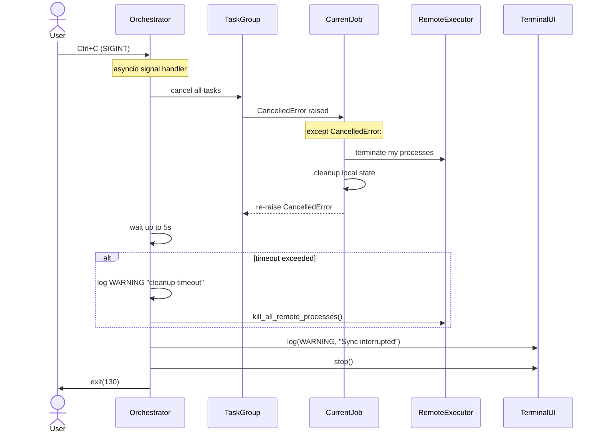

**Key points:**
- Uses native `asyncio.CancelledError` - no polling of flags
- Job owns cleanup of its own remote processes in its `except CancelledError` handler
- Orchestrator only does final safety sweep after timeout (belt-and-suspenders)
- Exit code 130 indicates SIGINT termination (128 + signal number 2)

### Double SIGINT (Force Terminate)

Per FR-026, if a second SIGINT arrives during cleanup, the system force-terminates immediately:

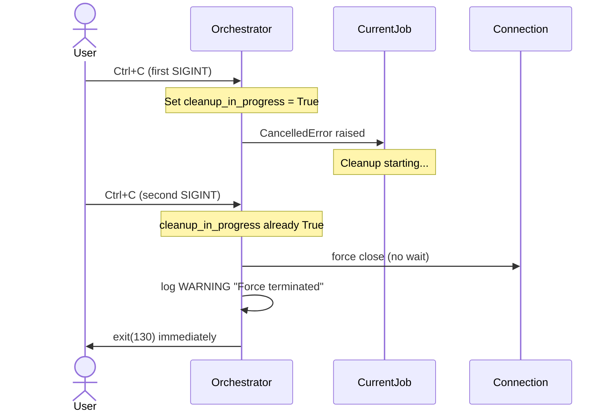

**Implementation note**: The signal handler checks a `_cleanup_in_progress` flag. On second SIGINT:
- Skip graceful cleanup entirely
- Close SSH connection immediately (kills remote processes)
- Exit with code 130

---

### 2. Job Raises Exception (Critical Failure)

When a job raises an unhandled exception, the TaskGroup catches it and cancels other tasks. The Orchestrator logs at CRITICAL level and offers rollback.

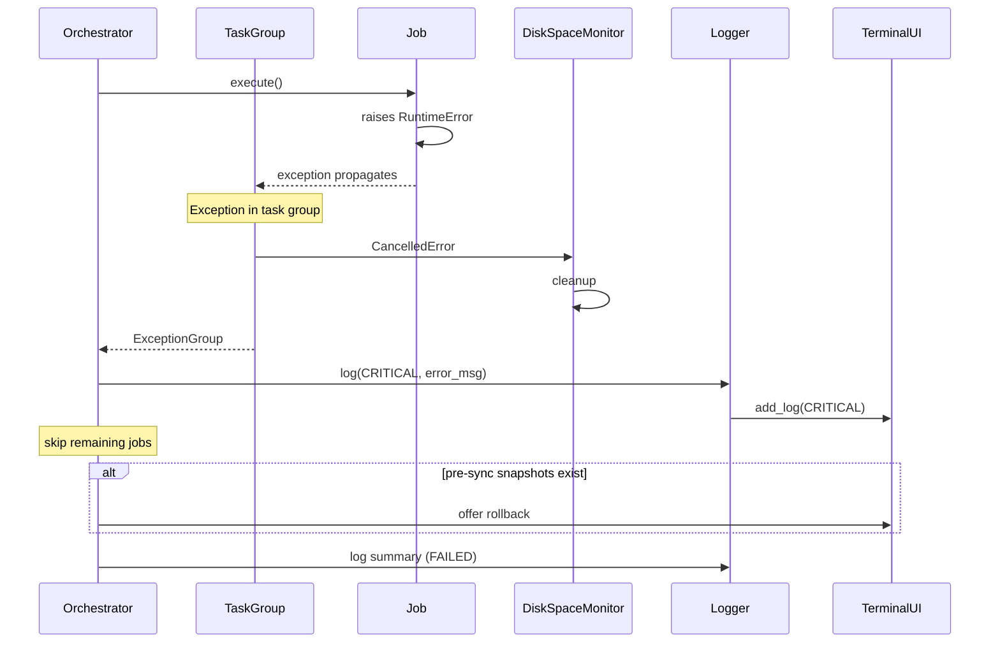

**Key points:**
- TaskGroup automatically cancels sibling tasks when one fails
- No manual `request_termination()` needed
- CRITICAL log entry written with full exception details
- Rollback offered if pre-sync snapshots exist

---

### 3. Remote Command Fails

When a command executed on the target machine fails, RemoteExecutor returns a `CommandResult`. The Job interprets the result and decides how to handle it, including what to log.

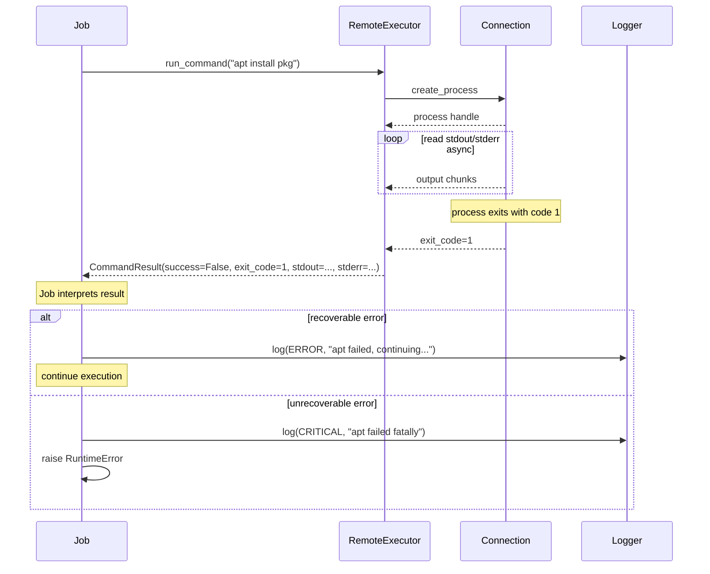

**Key points:**
- `CommandResult` contains: `success`, `exit_code`, `stdout`, `stderr`
- Job has full control over interpretation and logging
- Job decides log level based on context (same failure might be ERROR or CRITICAL)
- No mandatory output protocol - Job parses stdout/stderr as needed

---

### 4. Job Logs a Message

Jobs call the logger, which publishes events to the EventBus. Each consumer (FileLogger, TerminalUI) receives events in its own queue.

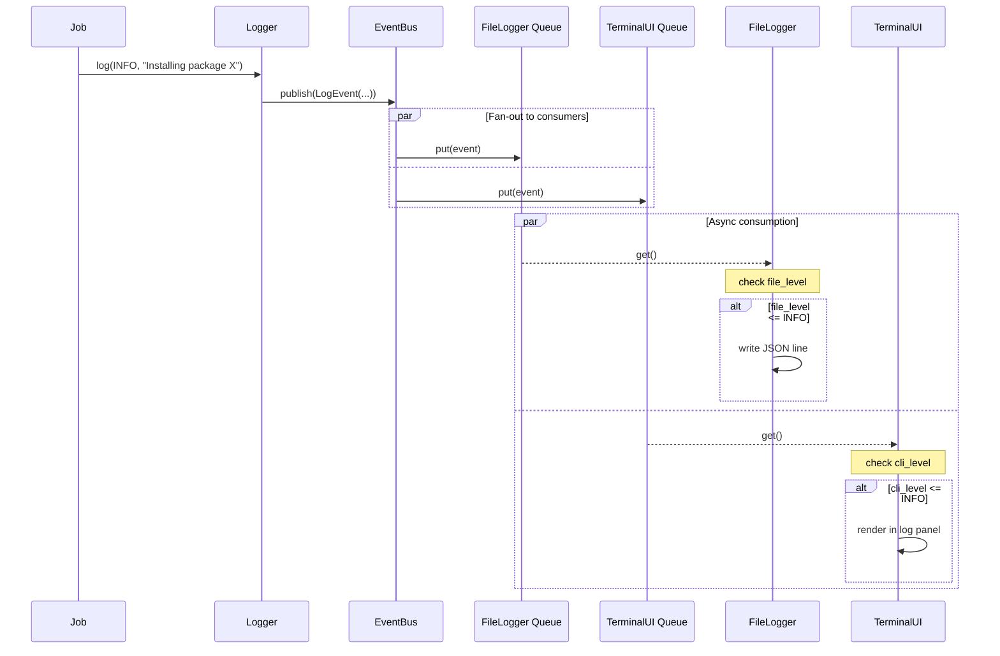

**Key points:**
- Jobs call `self.log(level, message, **context)` which publishes to EventBus
- EventBus fans out to per-consumer queues (guaranteed delivery)
- FileLogger and TerminalUI consume independently, never blocking each other
- Each consumer applies its own level filter (`file_level` / `cli_level`)
- File output uses structlog JSONRenderer (one JSON object per line)
- Terminal output uses Rich formatting with color-coded levels

---

### 5. Job Reports Progress

Progress updates support multiple formats: percentage, count-based, or heartbeat.

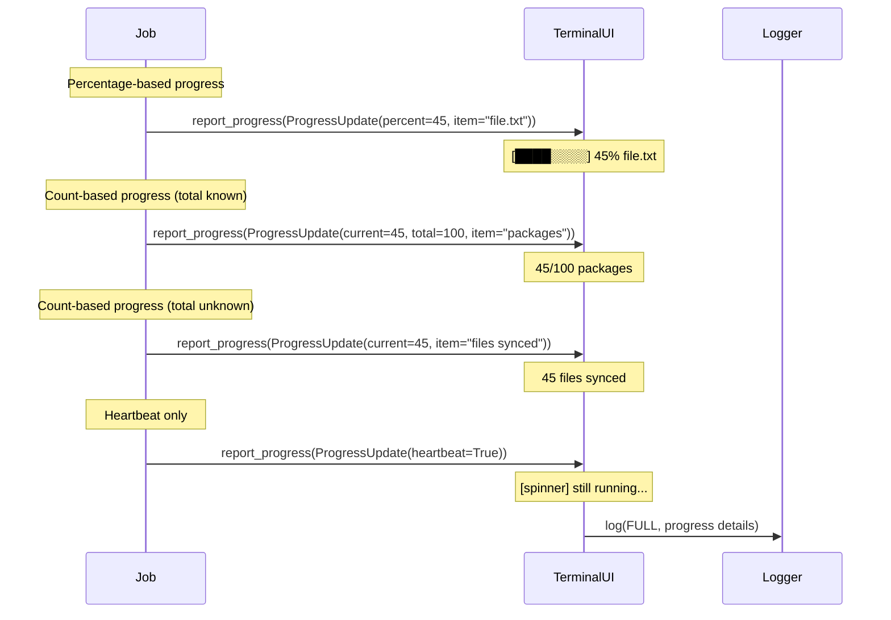

**Key points:**
- `ProgressUpdate` supports: `percent`, `current`, `total`, `item`, `heartbeat`
- UI renders appropriately based on which fields are set
- Progress logged at FULL level for audit trail
- UI updates are batched/throttled to prevent excessive redraws

---

### 6. DiskSpaceMonitor Detects Low Space

Two `DiskSpaceMonitorJob` instances run as background tasks: one for source (local), one for target (remote). When space falls below threshold on either host, the job raises `DiskSpaceCriticalError` with both `host` (role) and `hostname` (actual name). The TaskGroup catches this and cancels other tasks.

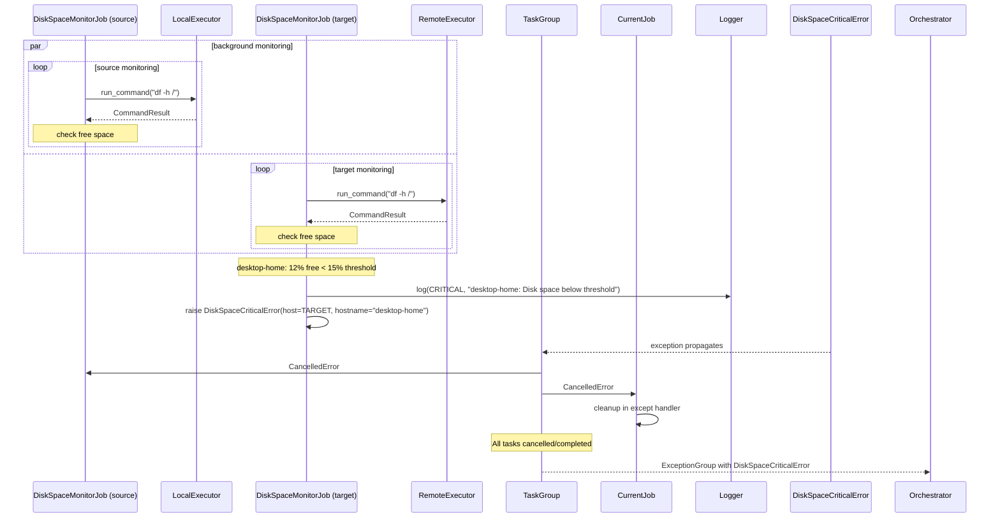

**Key points:**
- Two instances of same class, each with different `host` parameter
- Both instances receive same `JobContext` with `source` and `target` executors
- Job selects executor based on its `host` field (see code example in "Job Approaches")
- `DiskSpaceCriticalError` includes both `host` (role) and `hostname` (actual name)
- Either monitor can trigger sync abort - TaskGroup cancels all other tasks

---

## Streaming Output Architecture

Multiple concurrent sources produce output that flows through the EventBus to consumers.

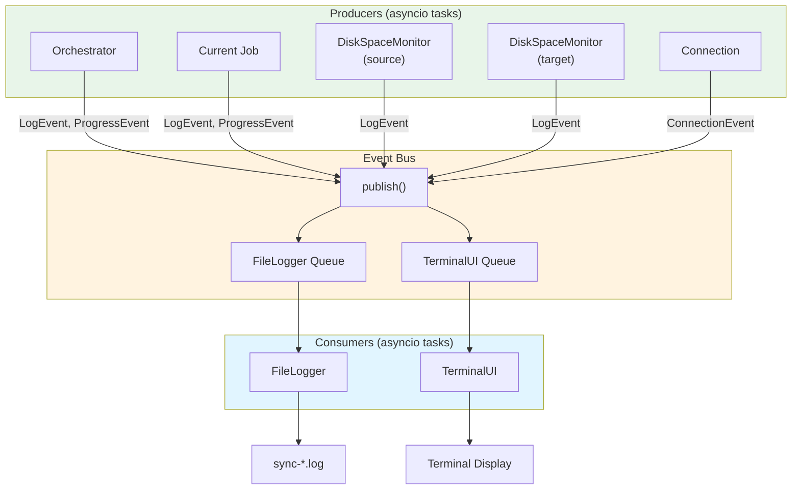

### Data Flow via EventBus

| Producer | Event Type | Fields |
|----------|------------|--------|
| Orchestrator | ProgressEvent | Overall progress (step N/M) |
| Jobs | LogEvent | Log messages at any level |
| Jobs | ProgressEvent | Job progress (%, count, heartbeat) |
| Connection | ConnectionEvent | Status changes, latency |

### Concurrency Model

- **Per-consumer queues**: Each consumer has dedicated queue, no blocking between consumers
- **Non-blocking puts**: Producers never wait; `put_nowait()` fans out to all consumer queues
- **UI Refresh Task**: TerminalUI consumes from its queue, renders at fixed interval (e.g., 100ms)
- **FileLogger Task**: FileLogger consumes from its queue, writes JSON lines to disk

### Target Log Aggregation (FR-023)

All logging happens on the **source machine**. Target-side operations do not run independent logging processes—instead:

1. **Command output**: Jobs run commands on target via `RemoteExecutor.run_command()`. The job receives `CommandResult` with stdout/stderr and decides what to log.

2. **Background processes**: Jobs can stream output via `RemoteExecutor.start_process()` with async iteration over stdout. The job parses output and emits LogEvents to the source-side EventBus.

3. **DiskSpaceMonitor (target)**: Runs on source, executes commands on target via RemoteExecutor. Logs are emitted from source-side code with `host=TARGET`.

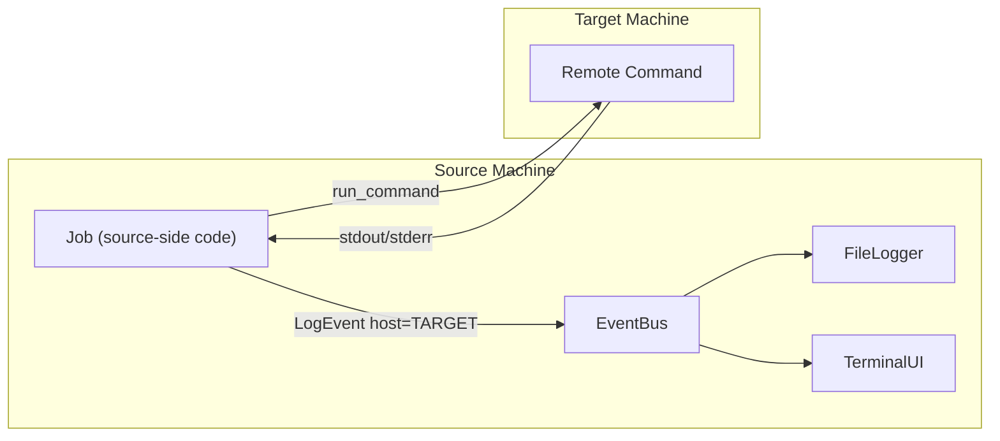

**Key point**: There is no target-side logging daemon. The `host` field in LogEvent indicates which machine the log *relates to*, not where the logging code runs. All logging code runs on source.

---

## Command Execution

Jobs have access to both `source` (LocalExecutor) and `target` (RemoteExecutor) via JobContext. They choose which to use based on the operation. There is **no mandatory output protocol** - Jobs interpret stdout/stderr as needed.

### Executor Interface

```python
class Executor(Protocol):
    """Common interface for command execution on source or target."""

    async def run_command(self, cmd: str, timeout: float | None = None) -> CommandResult:
        """Run command, wait for completion, return result."""

    async def start_process(self, cmd: str) -> Process:
        """Start command and return Process handle for streaming output."""

    async def terminate_all_processes(self) -> None:
        """Kill all processes started by this executor."""


class Process:
    """Handle for a running process with streaming output."""

    async def stdout(self) -> AsyncIterator[str]:
        """Yield stdout lines as they arrive."""

    async def stderr(self) -> AsyncIterator[str]:
        """Yield stderr lines as they arrive."""

    async def wait(self) -> CommandResult:
        """Wait for completion and return result."""

    async def terminate(self) -> None:
        """Send termination signal to process."""
```

### Implementations

| Implementation | Description |
|----------------|-------------|
| **LocalExecutor** | Runs commands via async subprocess on source machine |
| **RemoteExecutor** | Runs commands via SSH on target machine. Adds: `send_file()`, `get_file()`, `get_hostname()` |

### Job Approaches for Commands

Jobs choose their approach based on complexity:

**(a) Commands on source or target**:
```python
# Run on source machine
result = await self.source.run_command("df -h /")

# Run on target machine
result = await self.target.run_command("df -h /")
```

**(b) Jobs using both executors** (e.g., comparing source vs target):
```python
# Get package list from both machines
source_pkgs = await self.source.run_command("dpkg --get-selections")
target_pkgs = await self.target.run_command("dpkg --get-selections")
# Compare and sync differences...
```

**(c) Parameterized jobs** (DiskSpaceMonitorJob, BtrfsSnapshotJob):
```python
# Job has host: Host field, selects executor based on it
executor = self.source if self.host == Host.SOURCE else self.target
result = await executor.run_command("df -h /")
```

**(d) Streaming with AsyncIterator**: Process output as it arrives
```python
process = await self.target.start_process("btrfs subvolume snapshot ...")
lines = []
async for line in process.stdout():
    lines.append(line)
    self.report_progress(ProgressUpdate(current=len(lines), item=line))

result = await process.wait()
if not result.success:
    raise RuntimeError(f"snapshot failed: {result.stderr}")
```

**(e) File transfer + execution**:
```python
await self.target.send_file(local_script, "/tmp/sync-helper.py")
result = await self.target.run_command("python3 /tmp/sync-helper.py")
```

Jobs are responsible for:
- Interpreting command output and exit code
- Deciding appropriate log levels and error handling
- Reporting progress based on overall job state (not per-command)
- Checking `result.success` to determine next action

---

## Execution Flow Summary

```mermaid
graph TD
    Start["pc-switcher sync &lt;target&gt;"]

    CLI["<b>CLI</b><br/>- Parse arguments<br/>- Load config file (YAML)"]

    SchemaVal["<b>Schema Validation</b><br/>Orchestrator validates:<br/>- Required fields<br/>- Types"]

    JobConfigVal["<b>Job Config Validation</b><br/>Job.validate_config() for each job"]

    Connect["<b>Establish SSH Connection</b>"]

    SystemVal["<b>System State Validation</b><br/>Job.validate() for each job<br/>- Check subvolumes exist<br/>- Check connectivity"]

    SnapPre["<b>BtrfsSnapshotJob pre</b><br/>Direct btrfs commands<br/>No pc-switcher needed"]

    InstallTarget["<b>InstallOnTargetJob</b><br/>Check/install/upgrade<br/>pc-switcher on target"]

    StartDiskMon["<b>Start background</b><br/>DiskSpaceMonitorJob x2<br/>(source + target)"]

    SyncJobs["<b>Sequential job execution</b><br/>- SyncJob1.execute<br/>- SyncJob2.execute<br/>- ..."]

    SnapPost["<b>BtrfsSnapshotJob post</b><br/>Create post-sync snapshots"]

    CancelMon["<b>Cancel DiskSpaceMonitor</b>"]

    Disconnect["<b>Disconnect SSH</b>"]

    Result["<b>Return SyncResult</b><br/>success/failure,<br/>job summaries"]

    Start --> CLI
    CLI --> SchemaVal
    SchemaVal --> JobConfigVal
    JobConfigVal --> Connect
    Connect --> SystemVal
    SystemVal --> SnapPre
    SnapPre --> InstallTarget
    InstallTarget --> StartDiskMon
    StartDiskMon --> SyncJobs
    SyncJobs --> SnapPost
    SnapPost --> CancelMon
    CancelMon --> Disconnect
    Disconnect --> Result

    style Start fill:#fff3e0
    style CLI fill:#e1f5ff
    style SchemaVal fill:#fff3e0
    style JobConfigVal fill:#fff3e0
    style Connect fill:#f3e5f5
    style SystemVal fill:#e8f5e9
    style SnapPre fill:#e8f5e9
    style InstallTarget fill:#e8f5e9
    style StartDiskMon fill:#fce4ec
    style SyncJobs fill:#e8f5e9
    style SnapPost fill:#e8f5e9
    style CancelMon fill:#fce4ec
    style Disconnect fill:#f3e5f5
    style Result fill:#fff3e0
```

**Key ordering notes:**
1. **Snapshots BEFORE InstallOnTargetJob**: BtrfsSnapshotJob runs direct `btrfs` commands via SSH, no pc-switcher dependency. This ensures we have a rollback point before ANY system modifications.
2. **Three validation phases**: Schema → Job config → System state, with distinct error messages.
3. **DiskSpaceMonitor as background tasks**: Two instances run throughout sync - one monitors source (local commands), one monitors target (via `RemoteExecutor`). Either can abort sync on low space.

---

## Rollback Workflow

Per FR-013, the system provides rollback capability to restore from pre-sync snapshots. Rollback requires explicit user confirmation.

### CLI Command

```bash
# List available rollback points
pc-switcher rollback --list

# Rollback to most recent pre-sync snapshot
pc-switcher rollback

# Rollback to specific session
pc-switcher rollback --session abc12345
```

### Rollback Process

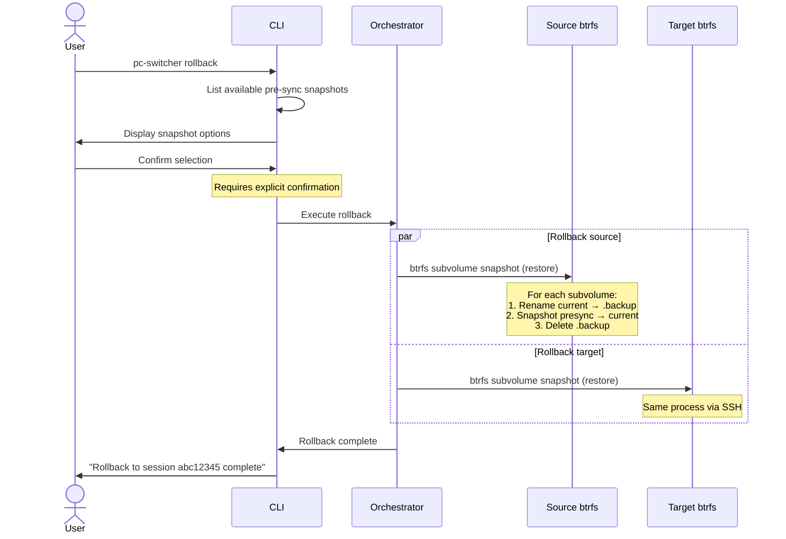

### Rollback Steps (per subvolume)

1. **Validate**: Verify pre-sync snapshot exists
2. **Rename current**: `mv /btrfs-root/@home /btrfs-root/@home.rollback-backup`
3. **Restore snapshot**: `btrfs subvolume snapshot /btrfs-root/@home-presync-... /btrfs-root/@home`
4. **Delete backup**: `btrfs subvolume delete /btrfs-root/@home.rollback-backup`

### Post-Sync Snapshots During Rollback

Post-sync snapshots (if they exist from a successful sync) are **retained** during rollback. They can be manually deleted via `pc-switcher cleanup-snapshots` if no longer needed.

### Error Handling

- If rollback fails mid-process, the `.rollback-backup` subvolumes are preserved for manual recovery
- Rollback logs all operations at INFO level for audit trail
- User must have sudo privileges for btrfs operations

---

## Setup and Default Configuration (FR-037)

The setup script creates a default configuration file with inline comments explaining each setting:

```yaml
# ~/.config/pc-switcher/config.yaml
# PC-Switcher Configuration

# Logging levels: DEBUG, FULL, INFO, WARNING, ERROR, CRITICAL
# DEBUG = most verbose (internal diagnostics)
# FULL = operational details (file-level operations)
# INFO = high-level operations (recommended for terminal)
log_file_level: FULL    # Written to ~/.local/share/pc-switcher/logs/
log_cli_level: INFO     # Displayed in terminal

# Enable/disable sync jobs (true = enabled, false = skipped)
# Required jobs (snapshots) cannot be disabled
sync_jobs:
  user_data: true       # Sync /home and /root
  packages: true        # Sync apt, snap, flatpak packages
  docker: false         # Sync Docker images, containers, volumes
  vms: false            # Sync KVM/virt-manager VMs
  k3s: false            # Sync k3s cluster state

# Disk space safety thresholds
disk:
  preflight_minimum: "20%"   # Minimum free space before sync starts
  runtime_minimum: "15%"     # Minimum during sync (abort if below)
  check_interval: 30         # Seconds between runtime checks

# Btrfs snapshot configuration (cannot be disabled)
btrfs_snapshots:
  subvolumes:           # Subvolume names to snapshot (must exist on both machines)
    - "@"               # Root filesystem
    - "@home"           # Home directories
  keep_recent: 3        # Always keep N most recent sync sessions
  max_age_days: null    # Delete snapshots older than N days (null = no age limit)
```

**Implementation**: The setup script generates this file by:
1. Loading the schema from `config-schema.yaml`
2. Extracting `description` fields from each property
3. Generating YAML with descriptions as inline comments
4. Writing to `~/.config/pc-switcher/config.yaml`
