# Foundation Architecture

This document describes the architecture for the pc-switcher foundation infrastructure, covering the core components, their relationships, and key interaction patterns.

## Navigation

**Documentation Hierarchy:**
- [High level requirements](../../docs/High%20level%20requirements.md) - Project vision and scope
- [Architecture Decision Records](../../docs/adr/_index.md) - Cross-cutting architectural decisions
- [Feature spec](spec.md) - Detailed requirements for this feature
- Architecture (this document) - Component design and interactions
- [Data model](data-model.md) - Data structures and schemas
- [Implementation plan](plan.md) - Implementation approach and phases
- [Tasks](tasks.md) - Actionable implementation tasks

## Design Principles

- **Asyncio-native**: All I/O operations are async; cancellation uses native `asyncio.CancelledError`
- **Single SSH connection**: Multiplexed sessions over one connection for efficiency
- **Job autonomy**: Jobs own their resources and are responsible for cleanup on cancellation
- **Clear separation**: Jobs are isolated units; orchestrator handles coordination
- **Fail-safe**: Graceful degradation and proper cleanup on errors/interrupts

---

## Terminology: Host vs Hostname

Throughout this document, two related but distinct concepts are used:

| Term | Type | Values | Description |
|------|------|--------|-------------|
| **host** | `Host` (enum) | `SOURCE`, `TARGET` | The logical role of a machine in the sync operation |
| **hostname** | `str` | e.g., `"laptop-work"`, `"desktop-home"` | The actual machine name |

**Resolution:**
- Source hostname: obtained from local machine (e.g., `socket.gethostname()`)
- Target hostname: provided via CLI argument `sync <target>`, resolved from SSH config if alias

**Usage:**
- All internal code uses `host` (role enum) exclusively
- Logger resolves `host` → `hostname` internally for output (UI and log files)

---

## Component Architecture

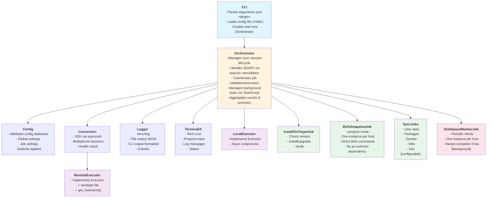
```mermaid
graph TD
    CLI["<b>CLI</b><br/>- Parses arguments sync &lt;target&gt;<br/>- Loads config file (YAML)<br/>- Creates and runs Orchestrator"]

    Orchestrator["<b>Orchestrator</b><br/>- Manages sync session lifecycle<br/>- Handles SIGINT via asyncio cancellation<br/>- Coordinates job validation/execution<br/>- Manages background tasks via TaskGroup<br/>- Aggregates results & summary"]

    Config["<b>Config</b><br/>- Validated config dataclass<br/>- Global settings<br/>- Job settings<br/>- Defaults applied"]

    Connection["<b>Connection</b><br/>- SSH via asyncssh<br/>- Multiplexed sessions<br/>- Health check"]

    Logger["<b>Logger</b><br/>- structlog<br/>- File output JSON<br/>- CLI output formatted<br/>- 6 levels"]

    TerminalUI["<b>TerminalUI</b><br/>- Rich Live<br/>- Progress bars<br/>- Log messages<br/>- Status"]

    LocalExecutor["<b>LocalExecutor</b><br/>- Implements Executor<br/>- Async subprocess"]

    RemoteExecutor["<b>RemoteExecutor</b><br/>- Implements Executor<br/>- + send/get file<br/>- + get_hostname()"]

    InstallOnTargetJob["<b>InstallOnTargetJob</b><br/>- Check version<br/>- Install/upgrade<br/>- Verify"]

    BtrfsSnapshotJob["<b>BtrfsSnapshotJob</b><br/>- pre/post mode<br/>- One instance per host<br/>- Direct btrfs commands<br/>- No pc-switcher dependency"]

    SyncJobs["<b>SyncJobs</b><br/>- User data<br/>- Packages<br/>- Docker<br/>- VMs<br/>- k3s<br/>[configurable]"]

    DiskSpaceMonitorJob["<b>DiskSpaceMonitorJob</b><br/>- Periodic check<br/>- One instance per host<br/>- Raises exception if low<br/>[background]"]

    CLI --> Orchestrator
    Orchestrator --> Config
    Orchestrator --> Connection
    Orchestrator --> Logger
    Orchestrator --> TerminalUI
    Orchestrator --> LocalExecutor
    Connection --> RemoteExecutor
    Orchestrator --> InstallOnTargetJob
    Orchestrator --> BtrfsSnapshotJob
    Orchestrator --> SyncJobs
    Orchestrator --> DiskSpaceMonitorJob

    style CLI fill:#e1f5ff
    style Orchestrator fill:#fff3e0
    style LocalExecutor fill:#f3e5f5
    style RemoteExecutor fill:#f3e5f5
    style InstallOnTargetJob fill:#e8f5e9
    style BtrfsSnapshotJob fill:#e8f5e9
    style SyncJobs fill:#e8f5e9
    style DiskSpaceMonitorJob fill:#fce4ec
```

### Component Responsibilities

| Component | Responsibility |
|-----------|----------------|
| **CLI** | Entry point. Parses commands (`sync`, `logs`, `cleanup-snapshots`, `rollback` (later)), loads config file (YAML), instantiates and runs Orchestrator |
| **Orchestrator** | Central coordinator. Validates config (schema + general config + (delegated) job configs), manages job lifecycle via TaskGroup, handles SIGINT via asyncio cancellation, produces final sync summary |
| **Config** | Validated configuration dataclass. Holds global settings, job enable/disable flags, and per-job settings after validation |
| **Connection** | Manages SSH connection via asyncssh. Provides multiplexed sessions (multiple concurrent commands over single connection) |
| **LocalExecutor** | Implements `Executor` interface for local async subprocess execution. Used by source-side jobs |
| **RemoteExecutor** | Implements `Executor` interface via Connection. Adds file transfer (`send_file`, `get_file`) and `get_hostname()` |
| **Logger** | Unified logging with 6 levels. Routes to file (JSON) and terminal (formatted). Resolves host→hostname internally |
| **TerminalUI** | Rich-based live display. Shows progress bars, log messages (filtered by cli_level), overall status |
| **Jobs** | Encapsulated sync operations. Each job validates their specific config, validates the system state, executes operations, reports progress, cleans up own resources on cancellation |

---

## Event Bus Architecture

All logging and progress events flow through an event bus with per-consumer queues. This decouples producers from consumers and ensures the UI never blocks job execution.

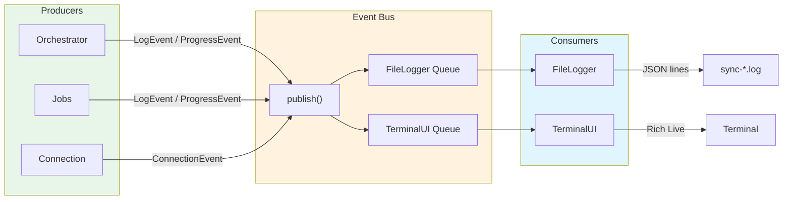
```mermaid
graph LR
    subgraph Producers
        Orch["Orchestrator"]
        Jobs["Jobs"]
        Conn["Connection"]
    end

    subgraph EventBus ["Event Bus"]
        Publish["publish()"]
        FLQ["FileLogger Queue"]
        UIQ["TerminalUI Queue"]
    end

    subgraph Consumers
        FL["FileLogger"]
        UI["TerminalUI"]
    end

    Orch -->|LogEvent / ProgressEvent| Publish
    Jobs -->|LogEvent / ProgressEvent| Publish
    Conn -->|ConnectionEvent| Publish

    Publish --> FLQ
    Publish --> UIQ

    FLQ --> FL
    UIQ --> UI

    FL -->|JSON lines| LogFile["sync-*.log"]
    UI -->|Rich Live| Terminal["Terminal"]

    style EventBus fill:#fff3e0
    style Producers fill:#e8f5e9
    style Consumers fill:#e1f5ff
```

### Event Types

| Event | Fields | Description |
|-------|--------|-------------|
| `LogEvent` | level, job, host, message, context, timestamp | Log message from any component |
| `ProgressEvent` | job, update (ProgressUpdate), timestamp | Job progress update (update contains percent, current, total, item, heartbeat) |
| `ConnectionEvent` | status, latency | SSH connection status change |

### Properties

- **Fan-out delivery**: Each event is copied to all consumer queues
- **Non-blocking puts**: Producers use `put_nowait()`, never wait
- **Per-consumer queues**: Each consumer has a dedicated queue to prevent blocking between consumers
- **Graceful shutdown**: `close()` signals consumers to drain queues and exit
- **Consumer failure is critical**: If a consumer (FileLogger, TerminalUI) raises an exception, it propagates through the TaskGroup and causes sync abort—same behavior as when a SyncJob raises an exception. This ensures logging/UI failures are not silently ignored.

---

## Class Diagram

### Job Classes

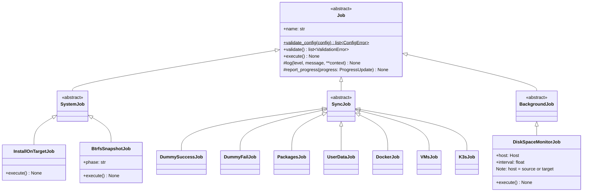
```mermaid
classDiagram
    class Job {
        <<abstract>>
        +name: str
        +validate_config(config)$ list~ConfigError~
        +validate() list~ValidationError~
        +execute() None
        #log(level, message, **context) None
        #report_progress(progress: ProgressUpdate) None
    }

    class SystemJob {
        <<abstract>>
    }

    class SyncJob {
        <<abstract>>
    }

    class BackgroundJob {
        <<abstract>>
    }

    class InstallOnTargetJob {
        +execute() None
    }

    class BtrfsSnapshotJob {
        +phase: str
        +execute() None
    }

    class DummySuccessJob {
    }

    class DummyFailJob {
    }

    class PackagesJob {
    }

    class UserDataJob {
    }

    class DockerJob {
    }

    class VMsJob {
    }

    class K3sJob {
    }

    class DiskSpaceMonitorJob {
        +host: Host
        +interval: float
        +execute() None
        Note: host = source or target
    }

    Job <|-- SystemJob
    Job <|-- SyncJob
    Job <|-- BackgroundJob
    SystemJob <|-- InstallOnTargetJob
    SystemJob <|-- BtrfsSnapshotJob
    SyncJob <|-- DummySuccessJob
    SyncJob <|-- DummyFailJob
    SyncJob <|-- PackagesJob
    SyncJob <|-- UserDataJob
    SyncJob <|-- DockerJob
    SyncJob <|-- VMsJob
    SyncJob <|-- K3sJob
    BackgroundJob <|-- DiskSpaceMonitorJob
```

### Supporting Classes

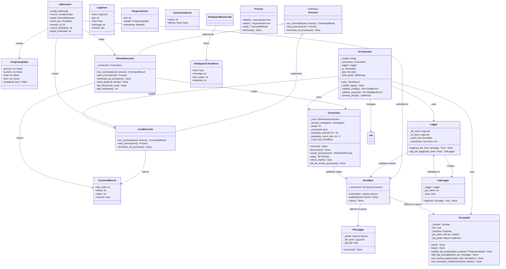
```mermaid
classDiagram
    class JobContext {
        +config: JobConfig
        +source: LocalExecutor
        +target: RemoteExecutor
        +event_bus: EventBus
        +session_id: str
        +source_hostname: str
        +target_hostname: str
    }

    class ProgressUpdate {
        +percent: int | None
        +current: int | None
        +total: int | None
        +item: str | None
        +heartbeat: bool = False
    }

    class CommandResult {
        +exit_code: int
        +stdout: str
        +stderr: str
        +success: bool
    }

    class EventBus {
        -_consumers: list~asyncio.Queue~
        +subscribe() asyncio.Queue
        +publish(event: Event) None
        +close() None
    }

    class LogEvent {
        +level: LogLevel
        +job: str
        +host: Host
        +message: str
        +context: dict
    }

    class ProgressEvent {
        +job: str
        +update: ProgressUpdate
        +timestamp: datetime
    }

    class ConnectionEvent {
        +status: str
        +latency: float | None
    }

    class FileLogger {
        -_queue: asyncio.Queue
        -_file_level: LogLevel
        -_log_file: Path
        +consume() None
    }

    class Executor {
        <<interface>>
        +run_command(cmd, timeout) CommandResult
        +start_process(cmd) Process
        +terminate_all_processes() None
    }

    class Process {
        +stdout() AsyncIterator~str~
        +stderr() AsyncIterator~str~
        +wait() CommandResult
        +terminate() None
    }

    class LocalExecutor {
        +run_command(cmd, timeout) CommandResult
        +start_process(cmd) Process
        +terminate_all_processes() None
    }

    class RemoteExecutor {
        -_connection: Connection
        +run_command(cmd, timeout) CommandResult
        +start_process(cmd) Process
        +terminate_all_processes() None
        +send_file(local, remote) None
        +get_file(remote, local) None
        +get_hostname() str
    }

    Executor <|-- LocalExecutor : implements
    Executor <|-- RemoteExecutor : implements

    class Connection {
        -_conn: SSHClientConnection
        -_session_semaphore: Semaphore
        -_target: str
        -_connected: bool
        -_keepalive_interval: int = 15
        -_keepalive_count_max: int = 3
        -_event_bus: EventBus
        +connect() None
        +disconnect() None
        +create_process(cmd) SSHClientProcess
        +sftp() SFTPClient
        +check_health() bool
        +kill_all_remote_processes() None
    }

    class Orchestrator {
        -_config: Config
        -_connection: Connection
        -_logger: Logger
        -_ui: TerminalUI
        -_jobs: list~Job~
        -_task_group: TaskGroup
        +run() SyncResult
        -_handle_sigint() None
        -_validate_configs() list~ConfigError~
        -_validate_systems() list~ValidationError~
        -_execute_job(job) JobResult
    }

    class Logger {
        -_file_level: LogLevel
        -_cli_level: LogLevel
        -_event_bus: EventBus
        -_hostnames: dict~Host, str~
        +log(level, job, host, message, **ctx) None
        +get_job_logger(job_name, host) JobLogger
    }

    class JobLogger {
        -_logger: Logger
        -_job_name: str
        -_host: Host
        +log(level, message, **ctx) None
    }

    class TerminalUI {
        -_console: Console
        -_live: Live
        -_progress: Progress
        -_job_tasks: dict~str, TaskID~
        -_log_panel: deque~LogEntry~
        +start() None
        +stop() None
        +update_job_progress(job, progress: ProgressUpdate) None
        +add_log_message(level, job, message) None
        +set_overall_progress(step, total, description) None
        +set_connection_status(connected, latency) None
    }

    class DiskSpaceCriticalError {
        +host: Host
        +message: str
        +free_space: str
        +threshold: str
    }

    JobContext --> LocalExecutor : source
    JobContext --> RemoteExecutor : target
    JobContext --> EventBus : publishes to
    JobContext --> ProgressUpdate : creates
    LocalExecutor --> CommandResult : returns
    RemoteExecutor --> Connection : wraps
    RemoteExecutor --> CommandResult : returns
    Orchestrator --> Connection : owns
    Orchestrator --> LocalExecutor : creates
    Orchestrator --> Logger : uses
    Orchestrator --> TerminalUI : uses
    Orchestrator --> Job : manages
    Logger --> JobLogger : creates
    JobLogger --> Logger : delegates to
    Logger --> EventBus : publishes events
    EventBus --> TerminalUI : delivers to queue
    EventBus --> FileLogger : delivers to queue
    Connection --> EventBus : publishes status
    DiskSpaceMonitorJob --> DiskSpaceCriticalError : raises
```

### Class Relationships

| Relationship | Description |
|--------------|-------------|
| Orchestrator → Connection | Owns and manages the SSH connection lifecycle |
| Orchestrator → LocalExecutor | Creates for local command execution |
| Orchestrator → Job[] | Creates, validates, and executes jobs; uses TaskGroup for background jobs |
| Orchestrator → EventBus | Creates and owns the event bus for logging/progress |
| Job → JobContext | Receives context at execution time (config, source, target, event_bus, session_id) |
| JobContext → LocalExecutor | `source` field - for running commands on source machine |
| JobContext → RemoteExecutor | `target` field - for running commands on target machine + file transfers |
| JobContext → EventBus | Jobs use `_log()` helper to publish LogEvents; `_report_progress()` for ProgressEvents |
| RemoteExecutor → Connection | Wraps Connection with job-friendly interface |
| RemoteExecutor → CommandResult | Returns structured result; Job interprets and logs |
| Logger → JobLogger | Creates bound logger instances for each job |
| Logger → EventBus | Publishes LogEvent for each log call |
| EventBus → FileLogger | Delivers events to FileLogger's dedicated queue |
| EventBus → TerminalUI | Delivers events to TerminalUI's dedicated queue |
| Connection → EventBus | Publishes ConnectionEvent on status changes |
| DiskSpaceMonitorJob → DiskSpaceCriticalError | Raises exception (with host and hostname) when space low; TaskGroup propagates |

---

## Validation Phases

Configuration and system validation happen in distinct phases with different error semantics:

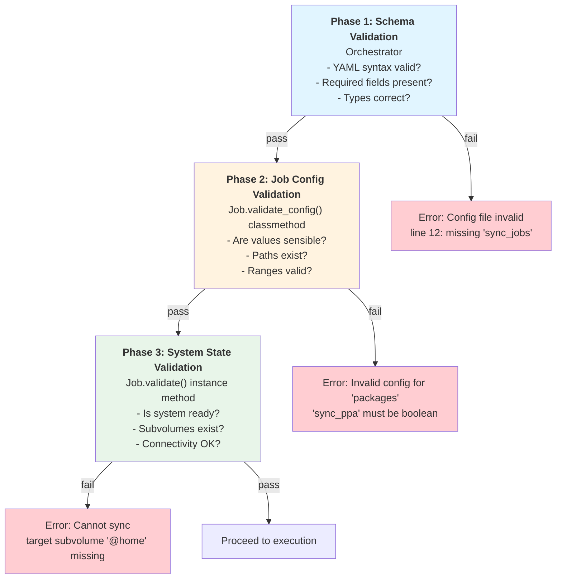
```mermaid
graph TD
    Phase1["<b>Phase 1: Schema Validation</b><br/>Orchestrator<br/>- YAML syntax valid?<br/>- Required fields present?<br/>- Types correct?"]

    Phase2["<b>Phase 2: Job Config Validation</b><br/>Job.validate_config() classmethod<br/>- Are values sensible?<br/>- Paths exist?<br/>- Ranges valid?"]

    Phase3["<b>Phase 3: System State Validation</b><br/>Job.validate() instance method<br/>- Is system ready?<br/>- Subvolumes exist?<br/>- Connectivity OK?"]

    Error1["Error: Config file invalid<br/>line 12: missing 'sync_jobs'"]
    Error2["Error: Invalid config for 'packages'<br/>'sync_ppa' must be boolean"]
    Error3["Error: Cannot sync<br/>target subvolume '@home' missing"]

    Phase1 -->|fail| Error1
    Phase1 -->|pass| Phase2
    Phase2 -->|fail| Error2
    Phase2 -->|pass| Phase3
    Phase3 -->|fail| Error3
    Phase3 -->|pass| Execute["Proceed to execution"]

    style Phase1 fill:#e1f5ff
    style Phase2 fill:#fff3e0
    style Phase3 fill:#e8f5e9
    style Error1 fill:#ffcdd2
    style Error2 fill:#ffcdd2
    style Error3 fill:#ffcdd2
```

| Phase | Responsibility | Method | Error Message Style |
|-------|----------------|--------|---------------------|
| 1. Schema | Orchestrator | JSON Schema | Config file invalid: ... |
| 2. Job Config | Orchestrator | Job.validate_config() | Invalid config for 'job': ... |
| 3. System State | Jobs | Job.validate() | Cannot sync: ... |

### BtrfsSnapshotJob Validation (Phase 3)

Per FR-015, `BtrfsSnapshotJob.validate()` MUST verify subvolumes exist on **both** source and target:

```python
async def validate(self, context: JobContext) -> list[ValidationError]:
    errors = []
    subvolumes = context.config.get("subvolumes", ["@", "@home"])

    for subvol in subvolumes:
        # Check source
        result = await context.source.run_command(
            f"sudo btrfs subvolume show /{subvol} 2>/dev/null"
        )
        if not result.success:
            errors.append(ValidationError(
                job=self.name,
                host=Host.SOURCE,
                message=f"Subvolume '{subvol}' not found on source",
            ))

        # Check target (identical subvolume structure assumed)
        result = await context.target.run_command(
            f"sudo btrfs subvolume show /{subvol} 2>/dev/null"
        )
        if not result.success:
            errors.append(ValidationError(
                job=self.name,
                host=Host.TARGET,
                message=f"Subvolume '{subvol}' not found on target",
            ))

    return errors
```

**Important**: The configuration assumes identical subvolume names on source and target. If target has different subvolume structure, validation will fail with clear error messages before any sync operations begin.

### Snapshot Location

Snapshots are stored in `/.snapshots/pc-switcher/<timestamp>-<session-id>/` on both source and target. Each sync session gets its own subfolder (named with timestamp for chronological sorting) to keep pre-sync and post-sync snapshots together:

```text
/.snapshots/
└── pc-switcher/                              # pc-switcher managed snapshots
    ├── 20251127T100000-def67890/             # Older session (sorted first)
    │   ├── pre-@-20251127T100000
    │   ├── pre-@home-20251127T100001
    │   ├── post-@-20251127T101500
    │   └── post-@home-20251127T101501
    └── 20251129T143022-abc12345/             # Newer session (sorted last)
        ├── pre-@-20251129T143022
        ├── pre-@home-20251129T143023
        ├── post-@-20251129T145510
        └── post-@home-20251129T145511
```

**Key design choices:**
- `pc-switcher/` subfolder distinguishes our snapshots from other tools' snapshots
- Folder name uses `<timestamp>-<session-id>` format for chronological sorting
- Snapshot name format: `<phase>-<subvolume>-<timestamp>` (e.g., `pre-@home-20251129T143022`)
- Phase prefix ensures `pre-*` sorts before `post-*` within a session
- Timestamp in filename allows quick inspection without checking btrfs metadata

### Snapshot Directory Validation

Before creating snapshots, the orchestrator MUST validate the `/.snapshots/` directory:

1. **If `/.snapshots/` does not exist:**
   - Create it as a btrfs subvolume: `sudo btrfs subvolume create /.snapshots`
   - Create `/.snapshots/pc-switcher/` directory inside it
   - Log INFO: "Created /.snapshots subvolume for snapshot storage"

2. **If `/.snapshots/` exists:**
   - Verify it is a btrfs subvolume (not a regular directory inside `/`)
   - If it's NOT a subvolume: Log CRITICAL error and abort
     - "/.snapshots exists but is not a btrfs subvolume. Snapshots would be included in / snapshots. Please convert it to a subvolume or remove it."
   - If it IS a subvolume: Create `/.snapshots/pc-switcher/` if needed

**Why this matters:** If `/.snapshots/` is a regular directory inside the `/` subvolume, then when we snapshot `/`, the snapshots themselves would be included - causing recursive snapshots and wasted space. The `/.snapshots/` directory MUST be a separate subvolume.

**Validation command:**
```bash
# Check if /.snapshots is a subvolume (returns 0 if true)
sudo btrfs subvolume show /.snapshots >/dev/null 2>&1
```

**Assumptions:**
- A single btrfs filesystem is used for all configured subvolumes
- The `/.snapshots/` subvolume is on the same btrfs filesystem
- Snapshots are created using `btrfs subvolume snapshot -r <source> <dest>`

---

## Sequence Diagrams

### 1. User Aborts with Ctrl+C

When the user presses Ctrl+C, asyncio's signal handler cancels the current task. The Job catches `CancelledError`, cleans up its own resources (including remote processes), and re-raises. After timeout, Orchestrator does a final safety sweep.

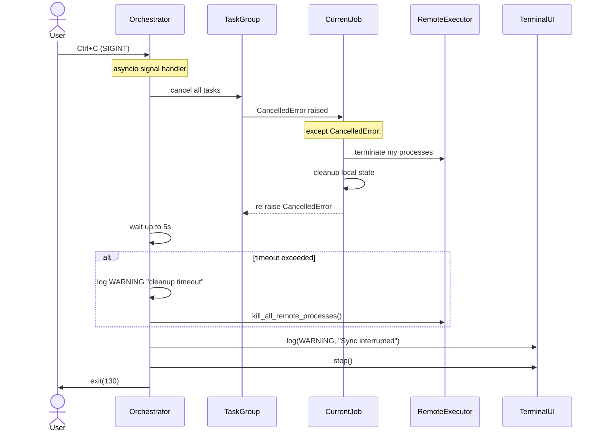
```mermaid
sequenceDiagram
    actor User
    participant Orchestrator
    participant TaskGroup
    participant CurrentJob
    participant RemoteExecutor
    participant TerminalUI

    User->>Orchestrator: Ctrl+C (SIGINT)
    Note over Orchestrator: asyncio signal handler
    Orchestrator->>TaskGroup: cancel all tasks
    TaskGroup->>CurrentJob: CancelledError raised

    Note over CurrentJob: except CancelledError:
    CurrentJob->>RemoteExecutor: terminate my processes
    CurrentJob->>CurrentJob: cleanup local state
    CurrentJob-->>TaskGroup: re-raise CancelledError

    Orchestrator->>Orchestrator: wait up to 5s

    alt timeout exceeded
        Orchestrator->>Orchestrator: log WARNING "cleanup timeout"
        Orchestrator->>RemoteExecutor: kill_all_remote_processes()
    end

    Orchestrator->>TerminalUI: log(WARNING, "Sync interrupted")
    Orchestrator->>TerminalUI: stop()
    Orchestrator->>User: exit(130)
```

**Key points:**
- Uses native `asyncio.CancelledError` - no polling of flags
- Job owns cleanup of its own remote processes in its `except CancelledError` handler
- Orchestrator only does final safety sweep after timeout (belt-and-suspenders)
- Exit code 130 indicates SIGINT termination (128 + signal number 2)

### Double SIGINT (Force Terminate)

Per FR-026, if a second SIGINT arrives during cleanup, the system force-terminates immediately:

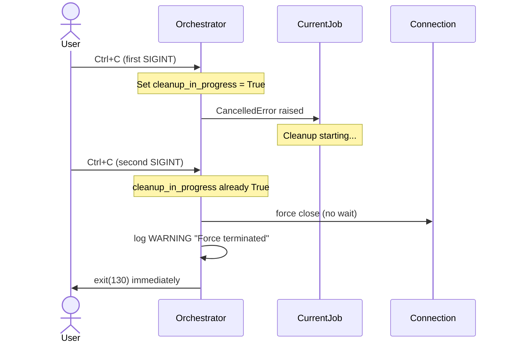
```mermaid
sequenceDiagram
    actor User
    participant Orchestrator
    participant CurrentJob
    participant Connection

    User->>Orchestrator: Ctrl+C (first SIGINT)
    Note over Orchestrator: Set cleanup_in_progress = True
    Orchestrator->>CurrentJob: CancelledError raised

    Note over CurrentJob: Cleanup starting...

    User->>Orchestrator: Ctrl+C (second SIGINT)
    Note over Orchestrator: cleanup_in_progress already True

    Orchestrator->>Connection: force close (no wait)
    Orchestrator->>Orchestrator: log WARNING "Force terminated"
    Orchestrator->>User: exit(130) immediately
```

**Implementation note**: The signal handler checks a `_cleanup_in_progress` flag. On second SIGINT:
- Skip graceful cleanup entirely
- Close SSH connection immediately (kills remote processes)
- Exit with code 130

---

### 2. Job Raises Exception (Critical Failure)

When a job raises an unhandled exception, the TaskGroup catches it and cancels other tasks. The Orchestrator logs at CRITICAL level and aborts the sync. (Rollback capability is a separate feature.)

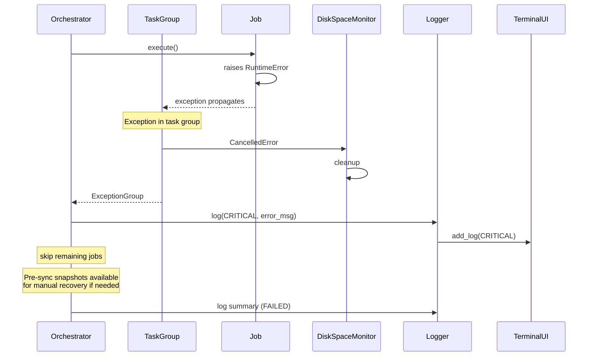
```mermaid
sequenceDiagram
    participant Orchestrator
    participant TaskGroup
    participant Job
    participant DiskSpaceMonitor
    participant Logger
    participant TerminalUI

    Orchestrator->>Job: execute()
    Job->>Job: raises RuntimeError
    Job-->>TaskGroup: exception propagates

    Note over TaskGroup: Exception in task group
    TaskGroup->>DiskSpaceMonitor: CancelledError
    DiskSpaceMonitor->>DiskSpaceMonitor: cleanup

    TaskGroup-->>Orchestrator: ExceptionGroup

    Orchestrator->>Logger: log(CRITICAL, error_msg)
    Logger->>TerminalUI: add_log(CRITICAL)

    Note over Orchestrator: skip remaining jobs

    Note over Orchestrator: Pre-sync snapshots available<br/>for manual recovery if needed

    Orchestrator->>Logger: log summary (FAILED)
```

**Key points:**
- TaskGroup automatically cancels sibling tasks when one fails
- No manual `request_termination()` needed
- CRITICAL log entry written with full exception details
- Pre-sync snapshots remain available for manual recovery (rollback command is a separate feature)

---

### 3. Remote Command Fails

When a command executed on the target machine fails, RemoteExecutor returns a `CommandResult`. The Job interprets the result and decides how to handle it, including what to log.

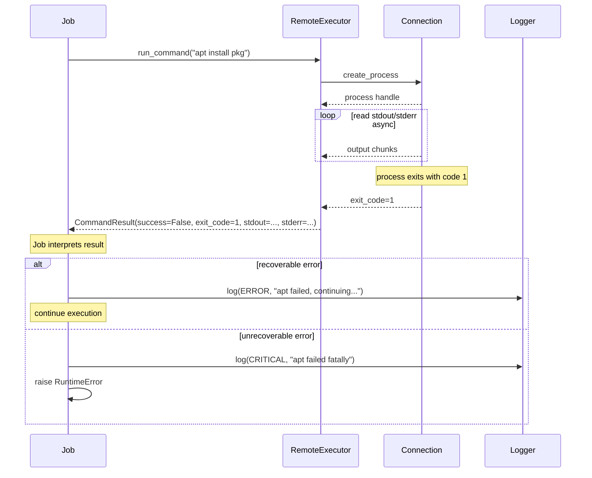
```mermaid
sequenceDiagram
    participant Job
    participant RemoteExecutor
    participant Connection
    participant Logger

    Job->>RemoteExecutor: run_command("apt install pkg")
    RemoteExecutor->>Connection: create_process
    Connection-->>RemoteExecutor: process handle

    loop read stdout/stderr async
        Connection-->>RemoteExecutor: output chunks
    end

    Note over Connection: process exits with code 1
    Connection-->>RemoteExecutor: exit_code=1

    RemoteExecutor-->>Job: CommandResult(success=False, exit_code=1, stdout=..., stderr=...)

    Note over Job: Job interprets result

    alt recoverable error
        Job->>Logger: log(ERROR, "apt failed, continuing...")
        Note over Job: continue execution
    else unrecoverable error
        Job->>Logger: log(CRITICAL, "apt failed fatally")
        Job->>Job: raise RuntimeError
    end
```

**Key points:**
- `CommandResult` contains: `success`, `exit_code`, `stdout`, `stderr`
- Job has full control over interpretation and logging
- Job decides log level based on context (same failure might be ERROR or CRITICAL)
- No mandatory output protocol - Job parses stdout/stderr as needed

---

### 4. Job Logs a Message

Jobs call the logger, which publishes events to the EventBus. Each consumer (FileLogger, TerminalUI) receives events in its own queue.

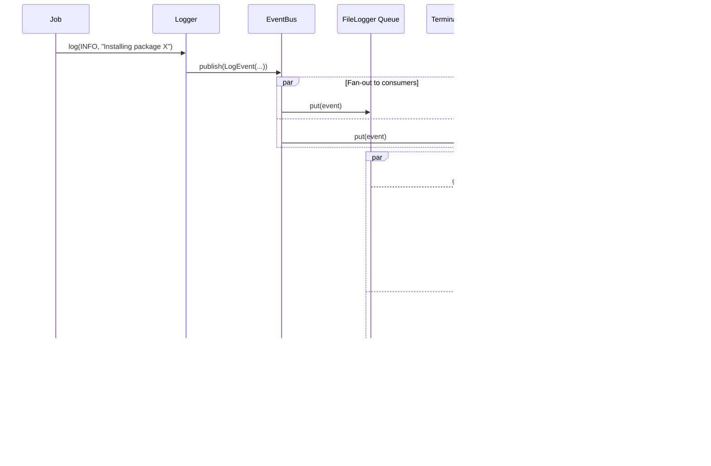
```mermaid
sequenceDiagram
    participant Job
    participant Logger
    participant EventBus
    participant FileLoggerQueue as FileLogger Queue
    participant TUIQueue as TerminalUI Queue
    participant FileLogger
    participant TerminalUI

    Job->>Logger: log(INFO, "Installing package X")
    Logger->>EventBus: publish(LogEvent(...))

    par Fan-out to consumers
        EventBus->>FileLoggerQueue: put(event)
    and
        EventBus->>TUIQueue: put(event)
    end

    par Async consumption
        FileLoggerQueue-->>FileLogger: get()
        Note over FileLogger: check file_level
        alt file_level <= INFO
            FileLogger->>FileLogger: write JSON line
        end
    and
        TUIQueue-->>TerminalUI: get()
        Note over TerminalUI: check cli_level
        alt cli_level <= INFO
            TerminalUI->>TerminalUI: render in log panel
        end
    end
```

**Key points:**
- Jobs call `self.log(level, message, **context)` which publishes to EventBus
- EventBus fans out to per-consumer queues (independent consumption)
- FileLogger and TerminalUI consume independently, never blocking each other
- Each consumer applies its own level filter (`file_level` / `cli_level`)
- File output uses structlog JSONRenderer (one JSON object per line)
- Terminal output uses Rich formatting with color-coded levels

---

### 5. Job Reports Progress

Progress updates support multiple formats: percentage, count-based, or heartbeat.

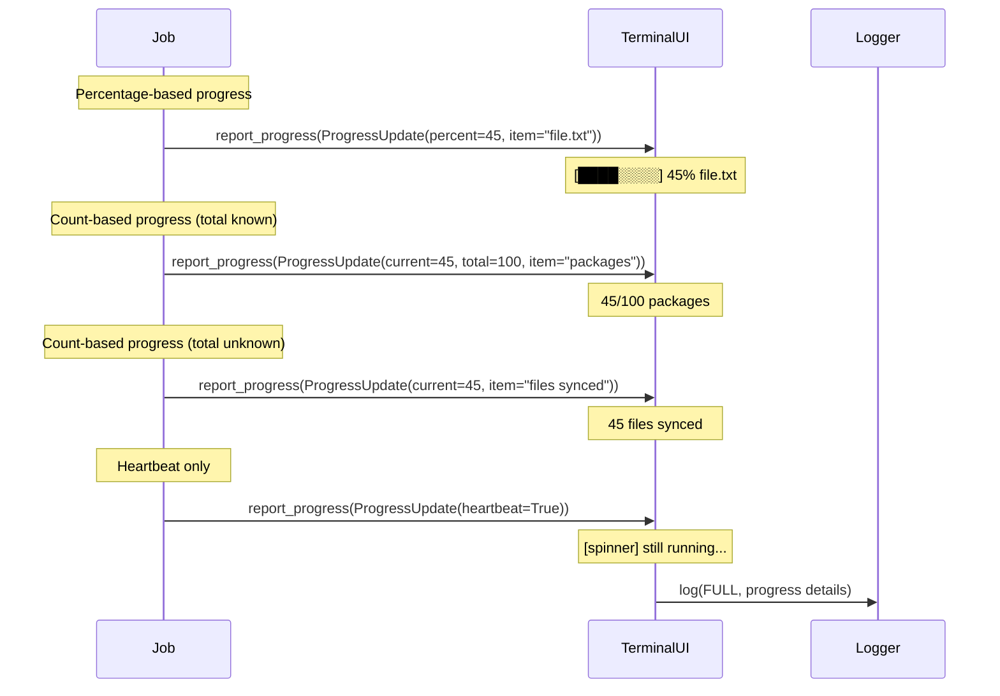
```mermaid
sequenceDiagram
    participant Job
    participant TerminalUI
    participant Logger

    Note over Job: Percentage-based progress
    Job->>TerminalUI: report_progress(ProgressUpdate(percent=45, item="file.txt"))
    Note over TerminalUI: [████░░░░] 45% file.txt

    Note over Job: Count-based progress (total known)
    Job->>TerminalUI: report_progress(ProgressUpdate(current=45, total=100, item="packages"))
    Note over TerminalUI: 45/100 packages

    Note over Job: Count-based progress (total unknown)
    Job->>TerminalUI: report_progress(ProgressUpdate(current=45, item="files synced"))
    Note over TerminalUI: 45 files synced

    Note over Job: Heartbeat only
    Job->>TerminalUI: report_progress(ProgressUpdate(heartbeat=True))
    Note over TerminalUI: [spinner] still running...

    TerminalUI->>Logger: log(FULL, progress details)
```

**Key points:**
- `ProgressUpdate` supports: `percent`, `current`, `total`, `item`, `heartbeat`
- UI renders appropriately based on which fields are set
- Progress logged at FULL level for audit trail
- UI updates are batched/throttled to prevent excessive redraws

---

### 6. DiskSpaceMonitor Detects Low Space

Two `DiskSpaceMonitorJob` instances run as background tasks: one for source (local), one for target (remote). When space falls below threshold on either host, the job raises `DiskSpaceCriticalError` with both `host` (role) and `hostname` (actual name). The TaskGroup catches this and cancels other tasks.

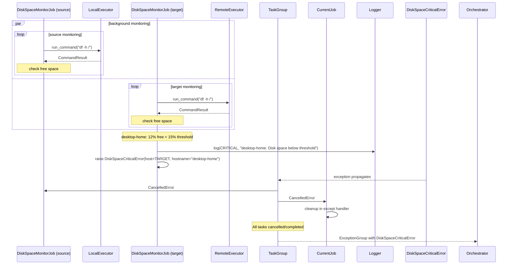
```mermaid
sequenceDiagram
    participant SourceMonitor as DiskSpaceMonitorJob (source)
    participant LocalExecutor
    participant TargetMonitor as DiskSpaceMonitorJob (target)
    participant RemoteExecutor
    participant TaskGroup
    participant CurrentJob
    participant Logger

    par background monitoring
        loop source monitoring
            SourceMonitor->>LocalExecutor: run_command("df -h /")
            LocalExecutor-->>SourceMonitor: CommandResult
            Note over SourceMonitor: check free space
        end
    and
        loop target monitoring
            TargetMonitor->>RemoteExecutor: run_command("df -h /")
            RemoteExecutor-->>TargetMonitor: CommandResult
            Note over TargetMonitor: check free space
        end
    end

    Note over TargetMonitor: desktop-home: 12% free < 15% threshold

    TargetMonitor->>Logger: log(CRITICAL, "desktop-home: Disk space below threshold")
    TargetMonitor->>TargetMonitor: raise DiskSpaceCriticalError(host=TARGET, hostname="desktop-home")

    DiskSpaceCriticalError-->>TaskGroup: exception propagates
    TaskGroup->>SourceMonitor: CancelledError
    TaskGroup->>CurrentJob: CancelledError
    CurrentJob->>CurrentJob: cleanup in except handler

    Note over TaskGroup: All tasks cancelled/completed
    TaskGroup-->>Orchestrator: ExceptionGroup with DiskSpaceCriticalError
```

**Key points:**
- Two instances of same class, each with different `host` parameter
- Both instances receive same `JobContext` with `source` and `target` executors
- Job selects executor based on its `host` field (see code example in "Job Approaches")
- `DiskSpaceCriticalError` includes both `host` (role) and `hostname` (actual name)
- Either monitor can trigger sync abort - TaskGroup cancels all other tasks

---

## Streaming Output Architecture

Multiple concurrent sources produce output that flows through the EventBus to consumers.

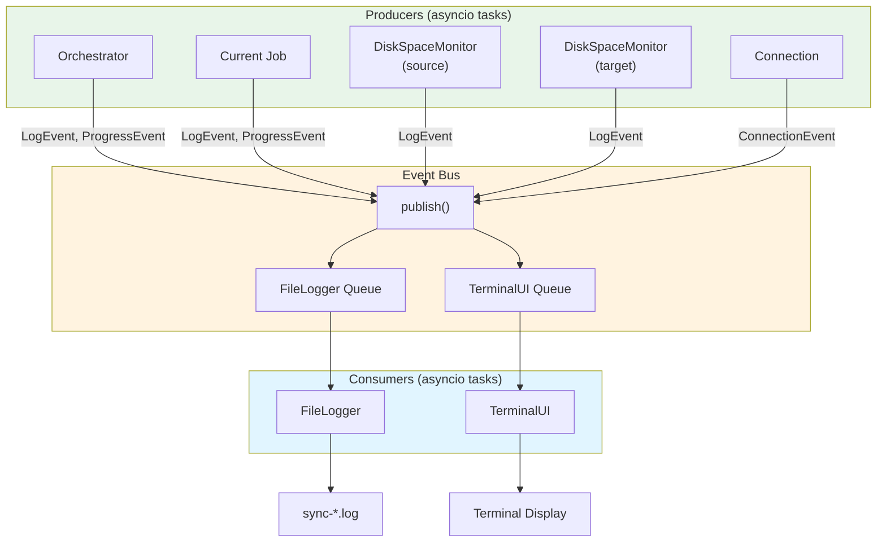
```mermaid
graph TD
    subgraph Producers ["Producers (asyncio tasks)"]
        OrchestratorTask["Orchestrator"]
        JobTask["Current Job"]
        DiskMonSourceTask["DiskSpaceMonitor<br/>(source)"]
        DiskMonTargetTask["DiskSpaceMonitor<br/>(target)"]
        ConnTask["Connection"]
    end

    subgraph EventBus ["Event Bus"]
        Publish["publish()"]
        FLQ["FileLogger Queue"]
        UIQ["TerminalUI Queue"]
    end

    subgraph Consumers ["Consumers (asyncio tasks)"]
        FileLogger["FileLogger"]
        TerminalUI["TerminalUI"]
    end

    OrchestratorTask -->|LogEvent, ProgressEvent| Publish
    JobTask -->|LogEvent, ProgressEvent| Publish
    DiskMonSourceTask -->|LogEvent| Publish
    DiskMonTargetTask -->|LogEvent| Publish
    ConnTask -->|ConnectionEvent| Publish

    Publish --> FLQ
    Publish --> UIQ

    FLQ --> FileLogger
    UIQ --> TerminalUI

    FileLogger --> LogFile["sync-*.log"]
    TerminalUI --> Terminal["Terminal Display"]

    style EventBus fill:#fff3e0
    style Producers fill:#e8f5e9
    style Consumers fill:#e1f5ff
```

### Data Flow via EventBus

| Producer | Event Type | Fields |
|----------|------------|--------|
| Orchestrator | ProgressEvent | Overall progress (step N/M) |
| Jobs | LogEvent | Log messages at any level |
| Jobs | ProgressEvent | Job progress (%, count, heartbeat) |
| Connection | ConnectionEvent | Status changes, latency |

### Concurrency Model

- **Per-consumer queues**: Each consumer has dedicated queue, no blocking between consumers
- **Non-blocking puts**: Producers never wait; `put_nowait()` fans out to all consumer queues
- **UI Refresh Task**: TerminalUI consumes from its queue, renders at fixed interval (e.g., 100ms)
- **FileLogger Task**: FileLogger consumes from its queue, writes JSON lines to disk

### Target Log Aggregation (FR-023)

All logging happens on the **source machine**. Target-side operations do not run independent logging processes—instead:

1. **Command output**: Jobs run commands on target via `RemoteExecutor.run_command()`. The job receives `CommandResult` with stdout/stderr and decides what to log.

2. **Background processes**: Jobs can stream output via `RemoteExecutor.start_process()` with async iteration over stdout. The job parses output and emits LogEvents to the source-side EventBus.

3. **DiskSpaceMonitor (target)**: Runs on source, executes commands on target via RemoteExecutor. Logs are emitted from source-side code with `host=TARGET`.

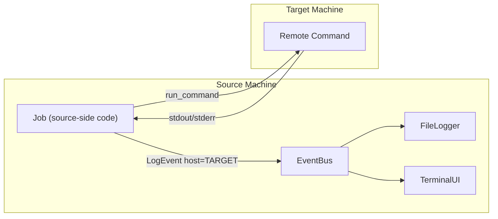
```mermaid
graph LR
    subgraph Source Machine
        Job["Job (source-side code)"]
        EventBus["EventBus"]
        FileLogger["FileLogger"]
        TerminalUI["TerminalUI"]
    end

    subgraph Target Machine
        RemoteCmd["Remote Command"]
    end

    Job -->|run_command| RemoteCmd
    RemoteCmd -->|stdout/stderr| Job
    Job -->|LogEvent host=TARGET| EventBus
    EventBus --> FileLogger
    EventBus --> TerminalUI
```

**Key point**: There is no target-side logging daemon. The `host` field in LogEvent indicates which machine the log *relates to*, not where the logging code runs. All logging code runs on source.

---

## Command Execution

Jobs have access to both `source` (LocalExecutor) and `target` (RemoteExecutor) via JobContext. They choose which to use based on the operation. There is **no mandatory output protocol** - Jobs interpret stdout/stderr as needed.

### Executor Interface

```python
class Executor(Protocol):
    """Common interface for command execution on source or target."""

    async def run_command(self, cmd: str, timeout: float | None = None) -> CommandResult:
        """Run command, wait for completion, return result."""

    async def start_process(self, cmd: str) -> Process:
        """Start command and return Process handle for streaming output."""

    async def terminate_all_processes(self) -> None:
        """Kill all processes started by this executor."""


class Process:
    """Handle for a running process with streaming output."""

    async def stdout(self) -> AsyncIterator[str]:
        """Yield stdout lines as they arrive."""

    async def stderr(self) -> AsyncIterator[str]:
        """Yield stderr lines as they arrive."""

    async def wait(self) -> CommandResult:
        """Wait for completion and return result."""

    async def terminate(self) -> None:
        """Send termination signal to process."""
```

### Implementations

| Implementation | Description |
|----------------|-------------|
| **LocalExecutor** | Runs commands via async subprocess on source machine |
| **RemoteExecutor** | Runs commands via SSH on target machine. Adds: `send_file()`, `get_file()`, `get_hostname()` |

### Job Approaches for Commands

Jobs choose their approach based on complexity:

**(a) Commands on source or target**:
```python
# Run on source machine
result = await self.source.run_command("df -h /")

# Run on target machine
result = await self.target.run_command("df -h /")
```

**(b) Jobs using both executors** (e.g., comparing source vs target):
```python
# Get package list from both machines
source_pkgs = await self.source.run_command("dpkg --get-selections")
target_pkgs = await self.target.run_command("dpkg --get-selections")
# Compare and sync differences...
```

**(c) Parameterized jobs** (DiskSpaceMonitorJob, BtrfsSnapshotJob):
```python
# Job has host: Host field, selects executor based on it
executor = self.source if self.host == Host.SOURCE else self.target
result = await executor.run_command("df -h /")
```

**(d) Streaming with AsyncIterator**: Process output as it arrives
```python
process = await self.target.start_process("btrfs subvolume snapshot ...")
lines = []
async for line in process.stdout():
    lines.append(line)
    self.report_progress(ProgressUpdate(current=len(lines), item=line))

result = await process.wait()
if not result.success:
    raise RuntimeError(f"snapshot failed: {result.stderr}")
```

**(e) File transfer + execution**:
```python
await self.target.send_file(local_script, "/tmp/sync-helper.py")
result = await self.target.run_command("python3 /tmp/sync-helper.py")
```

Jobs are responsible for:
- Interpreting command output and exit code
- Deciding appropriate log levels and error handling
- Reporting progress based on overall job state (not per-command)
- Checking `result.success` to determine next action

---

## Execution Flow Summary


```mermaid
graph TD
    Start["pc-switcher sync &lt;target&gt;"]

    CLI["<b>CLI</b><br/>- Parse arguments<br/>- Load config file (YAML)"]

    SchemaVal["<b>Schema Validation</b><br/>Orchestrator validates:<br/>- Required fields<br/>- Types"]

    JobConfigVal["<b>Job Config Validation</b><br/>Job.validate_config() for each job"]

    Connect["<b>Establish SSH Connection</b>"]

    AcquireLocks["<b>Acquire Locks</b><br/>- Source: ~/.local/share/pc-switcher/sync.lock<br/>- Target: ~/.local/share/pc-switcher/target.lock"]

    VersionCheck["<b>Version Check & Install</b><br/>- Get target pc-switcher version<br/>- If target newer → CRITICAL abort<br/>- If missing/outdated → install/upgrade<br/>- uv tool install from GitHub"]

    SubvolCheck["<b>Subvolume Validation</b><br/>- Verify all configured subvolumes<br/>  exist on source AND target"]

    DiskPreflight["<b>Disk Space Preflight</b><br/>- Check free space on source<br/>- Check free space on target<br/>- Abort if below preflight_minimum"]

    SnapPre["<b>Pre-sync Snapshots</b><br/>- Create read-only snapshots<br/>  on both source and target<br/>- Captures state with matching pc-switcher"]

    StartDiskMon["<b>Start DiskSpaceMonitor</b><br/>- Background task for source<br/>- Background task for target"]

    SyncJobs["<b>Sequential job execution</b><br/>- SyncJob1.execute<br/>- SyncJob2.execute<br/>- ..."]

    SnapPost["<b>Post-sync Snapshots</b><br/>- Create read-only snapshots<br/>  on both source and target"]

    Cleanup["<b>Cleanup</b><br/>- Stop DiskSpaceMonitor tasks<br/>- Release locks (auto on disconnect)<br/>- Close SSH connection"]

    Result["<b>Return SyncResult</b><br/>success/failure,<br/>job summaries"]

    Start --> CLI
    CLI --> SchemaVal
    SchemaVal --> JobConfigVal
    JobConfigVal --> Connect
    Connect --> AcquireLocks
    AcquireLocks --> VersionCheck
    VersionCheck --> SubvolCheck
    SubvolCheck --> DiskPreflight
    DiskPreflight --> SnapPre
    SnapPre --> StartDiskMon
    StartDiskMon --> SyncJobs
    SyncJobs --> SnapPost
    SnapPost --> Cleanup
    Cleanup --> Result

    style Start fill:#fff3e0
    style CLI fill:#e1f5ff
    style SchemaVal fill:#fff3e0
    style JobConfigVal fill:#fff3e0
    style Connect fill:#f3e5f5
    style AcquireLocks fill:#ffcdd2
    style VersionCheck fill:#e8f5e9
    style SubvolCheck fill:#e8f5e9
    style DiskPreflight fill:#e8f5e9
    style SnapPre fill:#e8f5e9
    style StartDiskMon fill:#fce4ec
    style SyncJobs fill:#e8f5e9
    style SnapPost fill:#e8f5e9
    style Cleanup fill:#f3e5f5
    style Result fill:#fff3e0
```

**Key ordering notes:**
1. **All checks before snapshots**: Locks → Version check/install → Subvolume validation → Disk preflight → Snapshots. If any check fails, we abort cleanly with no state changes (except version install which is idempotent).
2. **Version check and install before snapshots**: Per spec, version consistency is established before any sync operations. Pre-sync snapshots then capture the state with matching pc-switcher versions on both machines.
3. **Three validation phases**: Schema → Job config → System state, with distinct error messages.
4. **DiskSpaceMonitor as background tasks**: Two instances run throughout sync - one monitors source (local commands), one monitors target (via `RemoteExecutor`). Either can abort sync on low space.
5. **Lock acquisition**: Source lock prevents concurrent syncs from same machine. Target lock prevents A→B and C→B concurrent syncs.

---

## Lock Mechanism

Per FR-047, the system implements locking to prevent concurrent sync executions.

### Lock Files

| Lock | Location | Purpose |
|------|----------|---------|
| Source lock | `~/.local/share/pc-switcher/sync.lock` | Prevents concurrent syncs from the same source machine |
| Target lock | `~/.local/share/pc-switcher/target.lock` | Prevents concurrent syncs to the same target (A→B and C→B) |

### Target Lock Acquisition via SSH

The target lock must be held for the duration of the SSH connection. If the connection drops (crash, network issue), the lock must be automatically released to prevent stale locks requiring manual intervention.

**Implementation**: Use `flock` with the SSH session. The lock holder is a `flock` process that dies when the SSH connection is lost:

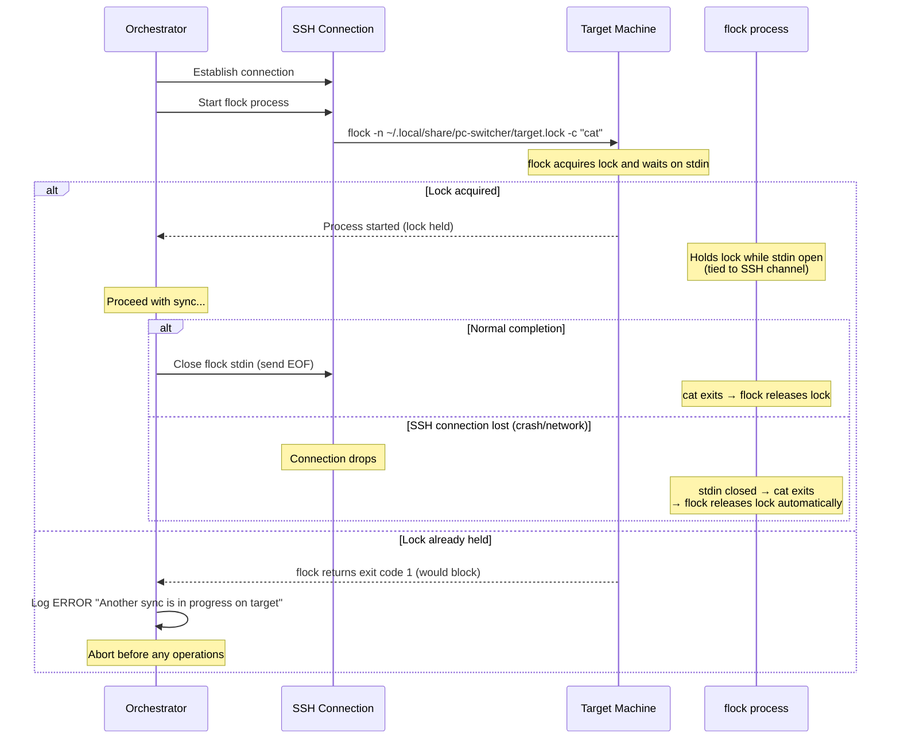
```mermaid
sequenceDiagram
    participant Orchestrator
    participant SSH as SSH Connection
    participant Target as Target Machine
    participant FlockProcess as flock process

    Orchestrator->>SSH: Establish connection
    Orchestrator->>SSH: Start flock process
    SSH->>Target: flock -n ~/.local/share/pc-switcher/target.lock -c "cat"
    Note over Target: flock acquires lock and waits on stdin

    alt Lock acquired
        Target-->>Orchestrator: Process started (lock held)
        Note over FlockProcess: Holds lock while stdin open<br/>(tied to SSH channel)

        Note over Orchestrator: Proceed with sync...

        alt Normal completion
            Orchestrator->>SSH: Close flock stdin (send EOF)
            Note over FlockProcess: cat exits → flock releases lock
        else SSH connection lost (crash/network)
            Note over SSH: Connection drops
            Note over FlockProcess: stdin closed → cat exits<br/>→ flock releases lock automatically
        end
    else Lock already held
        Target-->>Orchestrator: flock returns exit code 1 (would block)
        Orchestrator->>Orchestrator: Log ERROR "Another sync is in progress on target"
        Note over Orchestrator: Abort before any operations
    end
```

**Key properties:**
- Lock is tied to the SSH session lifetime, not a file on disk
- Crash or network disconnect automatically releases the lock
- No manual cleanup required for stale locks
- Uses `flock -n` (non-blocking) to fail fast if lock is held

**Implementation code:**
```python
async def acquire_target_lock(self) -> None:
    """Acquire target lock tied to SSH session lifetime."""
    lock_path = "~/.local/share/pc-switcher/target.lock"

    # Start flock process that holds lock while stdin is open
    # When SSH connection dies, stdin closes, cat exits, flock releases lock
    self._lock_process = await self._connection.create_process(
        f"mkdir -p ~/.local/share/pc-switcher && "
        f"flock -n {lock_path} -c 'cat' || exit 1"
    )

    # Check if we got the lock (process should be running)
    await asyncio.sleep(0.1)  # Brief wait for flock to acquire or fail
    if self._lock_process.exit_status is not None:
        raise LockError(
            f"Another sync is in progress on target (lock held: {lock_path})"
        )

    self.log(INFO, "Target lock acquired")

async def release_target_lock(self) -> None:
    """Release target lock by closing the flock process stdin."""
    if self._lock_process:
        self._lock_process.stdin.write_eof()
        await self._lock_process.wait()
        self.log(DEBUG, "Target lock released")
```

### Source Lock

Source lock uses standard file locking:

```python
async def acquire_source_lock(self) -> None:
    """Acquire source lock using fcntl."""
    lock_path = Path.home() / ".local/share/pc-switcher/sync.lock"
    lock_path.parent.mkdir(parents=True, exist_ok=True)

    self._lock_file = lock_path.open("w")
    try:
        fcntl.flock(self._lock_file.fileno(), fcntl.LOCK_EX | fcntl.LOCK_NB)
    except BlockingIOError:
        # Read PID from lock file for error message
        with lock_path.open() as f:
            pid = f.read().strip()
        raise LockError(f"Another sync is in progress (PID: {pid})")

    # Write our PID to lock file
    self._lock_file.write(str(os.getpid()))
    self._lock_file.flush()
```

---

## Self-Installation Flow

Per FR-005, FR-006, and FR-007, the orchestrator ensures version consistency before any sync operations.

### Version Check and Installation Sequence

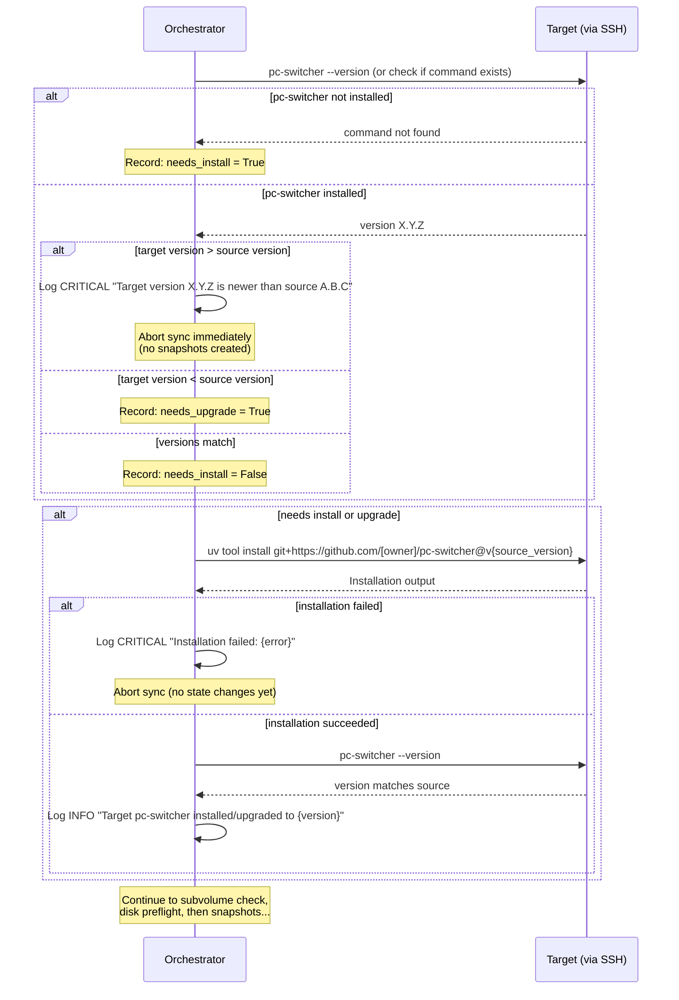
```mermaid
sequenceDiagram
    participant Orchestrator
    participant Target as Target (via SSH)

    Orchestrator->>Target: pc-switcher --version (or check if command exists)

    alt pc-switcher not installed
        Target-->>Orchestrator: command not found
        Note over Orchestrator: Record: needs_install = True
    else pc-switcher installed
        Target-->>Orchestrator: version X.Y.Z

        alt target version > source version
            Orchestrator->>Orchestrator: Log CRITICAL "Target version X.Y.Z is newer than source A.B.C"
            Note over Orchestrator: Abort sync immediately<br/>(no snapshots created)
        else target version < source version
            Note over Orchestrator: Record: needs_upgrade = True
        else versions match
            Note over Orchestrator: Record: needs_install = False
        end
    end

    alt needs install or upgrade
        Orchestrator->>Target: uv tool install git+https://github.com/[owner]/pc-switcher@v{source_version}
        Target-->>Orchestrator: Installation output

        alt installation failed
            Orchestrator->>Orchestrator: Log CRITICAL "Installation failed: {error}"
            Note over Orchestrator: Abort sync (no state changes yet)
        else installation succeeded
            Orchestrator->>Target: pc-switcher --version
            Target-->>Orchestrator: version matches source
            Orchestrator->>Orchestrator: Log INFO "Target pc-switcher installed/upgraded to {version}"
        end
    end

    Note over Orchestrator: Continue to subvolume check,<br/>disk preflight, then snapshots...
```

### Version Detection

```python
async def get_target_version(executor: RemoteExecutor) -> str | None:
    """Get pc-switcher version on target, or None if not installed."""
    result = await executor.run_command("pc-switcher --version 2>/dev/null")
    if result.success:
        # Parse "pc-switcher X.Y.Z" output
        match = re.search(r"(\d+\.\d+\.\d+)", result.stdout)
        return match.group(1) if match else None
    return None
```

### Installation Command

Per FR-005, installation uses `uv tool install` with Git URL:

```bash
uv tool install git+https://github.com/[owner]/pc-switcher@v0.4.0
```

- Uses `uv tool` (not `uv pip`) to install as a globally available CLI tool
- Git tag `v{version}` ensures exact version match
- No authentication required (public repository)
- Target timeout: 30 seconds (SC-004)

### Log Messages

| Scenario | Level | Message |
|----------|-------|---------|
| Not installed | INFO | "Target pc-switcher not found, will install version {version}" |
| Version match | INFO | "Target pc-switcher version matches source ({version}), skipping installation" |
| Outdated | INFO | "Target pc-switcher version {old} is outdated, will upgrade to {new}" |
| Newer on target | CRITICAL | "Target version {target} is newer than source {source}, this is unusual" |
| Install success | INFO | "Target pc-switcher installed/upgraded to {version}" |
| Install failed | CRITICAL | "Failed to install pc-switcher on target: {error}" |

---

## Disk Space Preflight Check

Per FR-016, the orchestrator checks free disk space on both source and target before creating snapshots.

### Preflight Flow

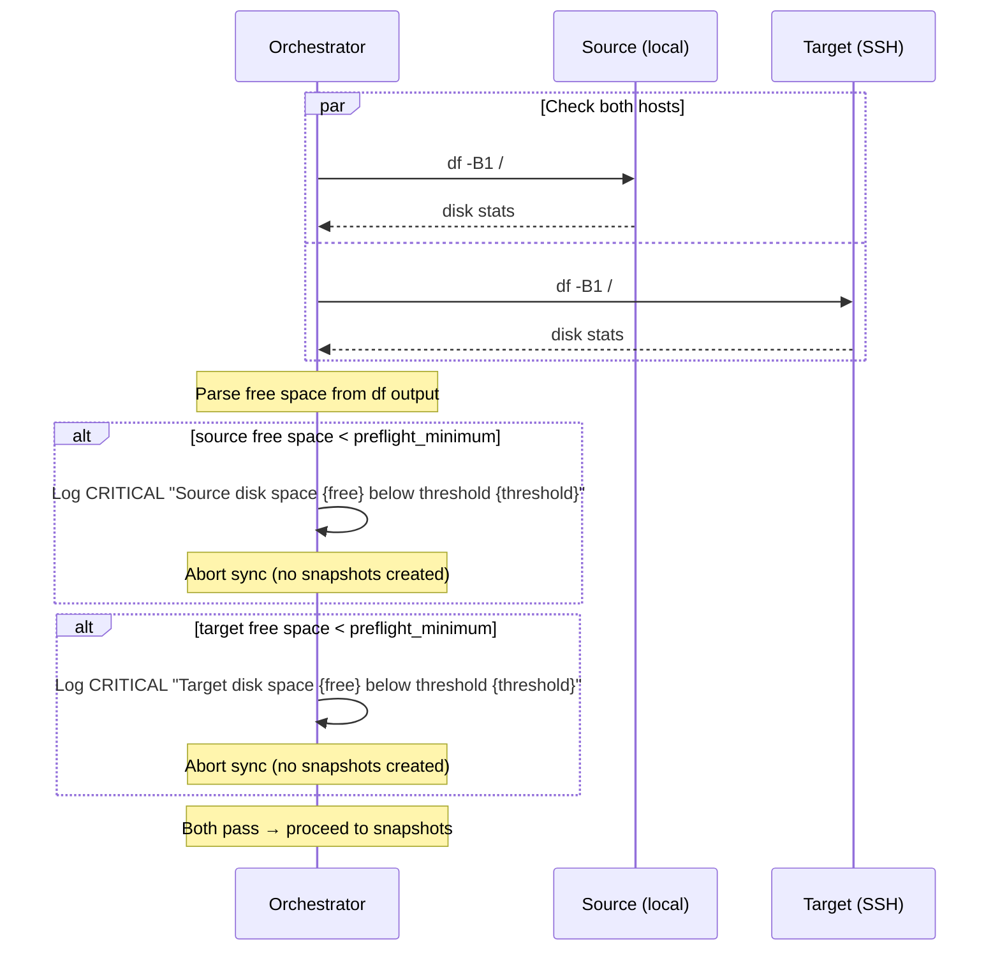
```mermaid
sequenceDiagram
    participant Orchestrator
    participant Source as Source (local)
    participant Target as Target (SSH)

    par Check both hosts
        Orchestrator->>Source: df -B1 /
        Source-->>Orchestrator: disk stats
    and
        Orchestrator->>Target: df -B1 /
        Target-->>Orchestrator: disk stats
    end

    Note over Orchestrator: Parse free space from df output

    alt source free space < preflight_minimum
        Orchestrator->>Orchestrator: Log CRITICAL "Source disk space {free} below threshold {threshold}"
        Note over Orchestrator: Abort sync (no snapshots created)
    end

    alt target free space < preflight_minimum
        Orchestrator->>Orchestrator: Log CRITICAL "Target disk space {free} below threshold {threshold}"
        Note over Orchestrator: Abort sync (no snapshots created)
    end

    Note over Orchestrator: Both pass → proceed to snapshots
```

### Threshold Configuration

From `config.yaml`:
```yaml
disk_space_monitor:
  preflight_minimum: "20%"   # or "50GiB"
  runtime_minimum: "15%"     # for DiskSpaceMonitorJob
  check_interval: 30
```

### Threshold Parsing

Supports percentage or absolute values (FR-016):

| Format | Example | Interpretation |
|--------|---------|----------------|
| Percentage | `"20%"` | 20% of total disk must be free |
| GiB | `"50GiB"` | 50 gibibytes must be free |
| MiB | `"500MiB"` | 500 mebibytes must be free |
| GB | `"50GB"` | 50 gigabytes must be free |
| MB | `"500MB"` | 500 megabytes must be free |

Values without units are **invalid** and will fail config validation.

---

## Snapshot Cleanup Algorithm

Per FR-014, the system provides snapshot cleanup with configurable retention policy.

**Note on separation of concerns**: The `cleanup-snapshots` CLI command is a **standalone operation** that directly uses the `snapshots.py` module. It is distinct from `BtrfsSnapshotJob`, which is used during sync for creating pre/post snapshots. The cleanup command does not use the Orchestrator or job infrastructure—it is a simple CLI → snapshots module flow.

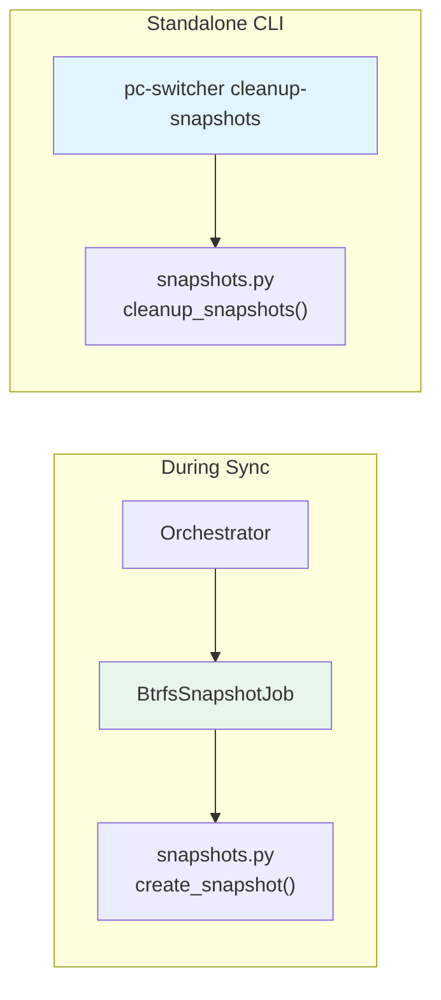
```mermaid
graph LR
    subgraph "During Sync"
        Orchestrator --> BtrfsSnapshotJob
        BtrfsSnapshotJob --> SnapshotsMod["snapshots.py<br/>create_snapshot()"]
    end

    subgraph "Standalone CLI"
        CleanupCmd["pc-switcher cleanup-snapshots"] --> SnapshotsMod2["snapshots.py<br/>cleanup_snapshots()"]
    end

    style BtrfsSnapshotJob fill:#e8f5e9
    style CleanupCmd fill:#e1f5ff
```

### CLI Command

```bash
# Cleanup with default retention (from config)
pc-switcher cleanup-snapshots

# Cleanup snapshots older than 7 days
pc-switcher cleanup-snapshots --older-than 7d

# Other human-readable formats supported: 2w (weeks), 1m (months)
pc-switcher cleanup-snapshots --older-than 2w

# Dry run (show what would be deleted)
pc-switcher cleanup-snapshots --dry-run
```

**Duration Parsing**: The `--older-than` flag accepts human-readable durations (e.g., `7d`, `2w`, `1m`). Use a duration parsing library (e.g., `pytimeparse2` or similar) rather than implementing custom parsing.

### Retention Policy

From `config.yaml`:
```yaml
btrfs_snapshots:
  keep_recent: 3           # Always keep N most recent sync sessions
  max_age_days: null       # Delete snapshots older than N days (null = no age limit)
```

### Cleanup Algorithm

```python
def identify_snapshots_to_delete(
    snapshots: list[Snapshot],
    keep_recent: int,
    max_age_days: int | None,
    older_than_override: int | None = None,  # From --older-than flag
) -> list[Snapshot]:
    """Identify snapshots eligible for deletion.

    Rules:
    1. Group snapshots by session_id
    2. Sort sessions by timestamp (newest first)
    3. Always keep the `keep_recent` most recent sessions
    4. From remaining sessions, delete if older than max_age_days (or older_than_override)

    Returns list of snapshots to delete.
    """
    # Group by session
    sessions: dict[str, list[Snapshot]] = {}
    for snap in snapshots:
        sessions.setdefault(snap.session_id, []).append(snap)

    # Sort sessions by newest snapshot timestamp
    sorted_sessions = sorted(
        sessions.items(),
        key=lambda x: max(s.timestamp for s in x[1]),
        reverse=True,
    )

    # Always keep the most recent N sessions
    protected_sessions = {sid for sid, _ in sorted_sessions[:keep_recent]}

    # Determine age threshold
    age_days = older_than_override or max_age_days
    if age_days is None:
        return []  # No age limit, only keep_recent applies

    cutoff = datetime.now() - timedelta(days=age_days)

    # Collect deletable snapshots
    to_delete = []
    for session_id, session_snaps in sorted_sessions:
        if session_id in protected_sessions:
            continue  # Protected by keep_recent

        session_time = max(s.timestamp for s in session_snaps)
        if session_time < cutoff:
            to_delete.extend(session_snaps)

    return to_delete
```

### Cleanup Output

```text
Analyzing snapshots...
Found 15 snapshots from 5 sync sessions.

Protected (keep_recent=3):
  - Session abc12345 (2025-11-28): 3 snapshots
  - Session def67890 (2025-11-27): 3 snapshots
  - Session ghi11111 (2025-11-26): 3 snapshots

To delete (older than 7 days):
  - Session jkl22222 (2025-11-20): 3 snapshots
  - Session mno33333 (2025-11-15): 3 snapshots

Delete 6 snapshots? [y/N]: y
Deleting pre-@-20251120T100000... done
Deleting pre-@home-20251120T100001... done
...
Cleanup complete. Deleted 6 snapshots.
```

---

## Installation Script

Per FR-035 and FR-036, an installation script (`install.sh`) handles initial installation and configuration. The installation logic is **shared with `InstallOnTargetJob`** to ensure DRY compliance.

### Installation Entry Point

The primary entry point for fresh machines is a `curl | sh` command that works without any prerequisites:

```bash
curl -LsSf https://raw.githubusercontent.com/[owner]/pc-switcher/main/install.sh | sh
```

This script:
1. Works on fresh Ubuntu 24.04 machines with no prerequisites
2. Installs `uv` if not present (via the official uv installer)
3. Installs required system packages (btrfs-progs)
4. Installs pc-switcher via `uv tool install`
5. Creates default configuration

**Note**: btrfs filesystem is a documented prerequisite (see README.md) and is checked at runtime by pc-switcher, not during installation. This avoids duplicate checks and allows installation on any system for development/testing purposes.

### Shared Installation Logic (DRY)

Both initial installation and target deployment use the **same `install.sh` script**. The script accepts a version parameter to install a specific version:

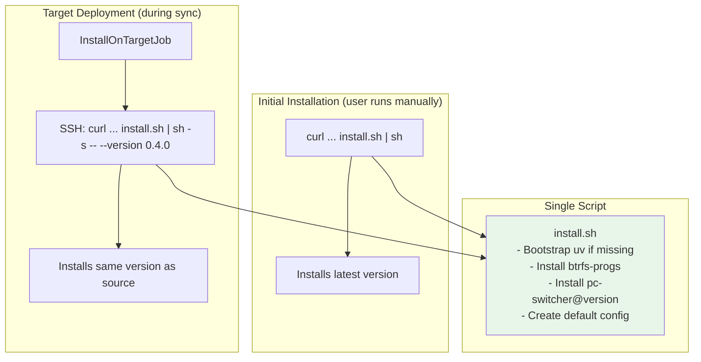
```mermaid
graph TD
    subgraph "Initial Installation (user runs manually)"
        UserCurl["curl ... install.sh | sh"]
        Note1["Installs latest version"]
    end

    subgraph "Target Deployment (during sync)"
        InstallJob["InstallOnTargetJob"]
        SSHCurl["SSH: curl ... install.sh | sh -s -- --version 0.4.0"]
        Note2["Installs same version as source"]
    end

    subgraph "Single Script"
        InstallSh["install.sh<br/>- Bootstrap uv if missing<br/>- Install btrfs-progs<br/>- Install pc-switcher@version<br/>- Create default config"]
    end

    UserCurl --> Note1
    InstallJob --> SSHCurl
    SSHCurl --> Note2

    UserCurl --> InstallSh
    SSHCurl --> InstallSh

    style InstallSh fill:#e8f5e9
```

### Installation Flow

```mermaid
graph TD
    Start["install.sh (curl | sh)"]

    CheckUV["Check if uv is installed"]
    InstallUV["Install uv via:<br/>curl -LsSf https://astral.sh/uv/install.sh | sh"]

    CheckBtrfsProgs["Check if btrfs-progs installed"]
    InstallBtrfsProgs["sudo apt-get install btrfs-progs"]

    InstallPCSwitcher["uv tool install pc-switcher"]

    CreateConfig["Create ~/.config/pc-switcher/config.yaml<br/>with defaults and comments"]

    CreateDirs["Create ~/.local/share/pc-switcher/logs/"]

    Success["Setup complete!<br/>Run: pc-switcher sync &lt;target&gt;"]

    Start --> CheckUV
    CheckUV -->|not installed| InstallUV
    CheckUV -->|installed| CheckBtrfsProgs
    InstallUV --> CheckBtrfsProgs
    CheckBtrfsProgs -->|not installed| InstallBtrfsProgs
    CheckBtrfsProgs -->|installed| InstallPCSwitcher
    InstallBtrfsProgs --> InstallPCSwitcher
    InstallPCSwitcher --> CreateConfig
    CreateConfig --> CreateDirs
    CreateDirs --> Success

    style Success fill:#c8e6c9
```

### Dependency Installation

| Dependency | Check Command | Install Command |
|------------|---------------|-----------------|
| uv | `command -v uv` | `curl -LsSf https://astral.sh/uv/install.sh \| sh` |
| btrfs-progs | `command -v btrfs` | `sudo apt-get install -y btrfs-progs` |

### Default Config Generation

The installation script generates `~/.config/pc-switcher/config.yaml` with:
- All settings at their default values
- Inline comments explaining each setting (extracted from schema descriptions)

See [Setup and Default Configuration](#setup-and-default-configuration-fr-036) section for the generated file content.

### InstallOnTargetJob Implementation

`InstallOnTargetJob` simply runs the same `install.sh` script on the target, passing the source version:

```python
from packaging.version import Version

async def execute(self) -> None:
    source_version = Version(get_current_version())  # e.g., "0.4.0"

    # Check target version first
    result = await self.target.run_command("pc-switcher --version 2>/dev/null")
    if result.success:
        # Parse version string from output (e.g., "pc-switcher 0.4.0" -> "0.4.0")
        target_version = Version(parse_version_string(result.stdout))
        if target_version == source_version:
            self.log(INFO, f"Target pc-switcher version matches source ({source_version})")
            return
        if target_version > source_version:
            raise RuntimeError(
                f"Target version {target_version} is newer than source {source_version}"
            )
        self.log(INFO, f"Upgrading target from {target_version} to {source_version}")
    else:
        self.log(INFO, f"Installing pc-switcher {source_version} on target")

    # Run the same install.sh script used for initial installation
    # The script handles: uv bootstrap, dependencies, pc-switcher install
    install_url = f"https://raw.githubusercontent.com/[owner]/pc-switcher/v{source_version}/install.sh"
    result = await self.target.run_command(
        f"curl -LsSf {install_url} | sh -s -- --version {source_version}"
    )
    if not result.success:
        raise RuntimeError(f"Failed to install pc-switcher on target: {result.stderr}")

    # Verify installation
    result = await self.target.run_command("pc-switcher --version")
    if not result.success or source_version not in result.stdout:
        raise RuntimeError("Installation verification failed")

    self.log(INFO, f"Target pc-switcher installed/upgraded to {source_version}")
```

**Key points:**
- Uses versioned URL to fetch the script matching the source version
- Script handles all prerequisites (uv, btrfs-progs) internally
- No separate Python installation module needed - single `install.sh` for everything

---

## Rollback Workflow

**Note**: Rollback capability is deferred to a separate feature after foundation infrastructure. Pre-sync snapshots created during sync operations can be used for manual rollback if needed, and the full rollback command (`pc-switcher rollback`) will be implemented in a later feature.

---

## Setup and Default Configuration (FR-036)

The setup script creates a default configuration file with inline comments explaining each setting:

```yaml
# ~/.config/pc-switcher/config.yaml
# PC-Switcher Configuration

# Logging levels: DEBUG, FULL, INFO, WARNING, ERROR, CRITICAL
# DEBUG = most verbose (internal diagnostics)
# FULL = operational details (file-level operations)
# INFO = high-level operations (recommended for terminal)
log_file_level: FULL    # Written to ~/.local/share/pc-switcher/logs/
log_cli_level: INFO     # Displayed in terminal

# Enable/disable sync jobs (true = enabled, false = skipped)
sync_jobs:
  # Jobs implemented in 001-foundation (for testing the sync infrastructure):
  dummy_success: true   # Test job that completes successfully
  dummy_fail: false     # Test job that fails at configurable progress %
  # Future sync jobs (not yet implemented - add when features 5-10 are built):
  # user_data: true     # Sync /home and /root
  # packages: true      # Sync apt, snap, flatpak packages
  # docker: false       # Sync Docker images, containers, volumes
  # vms: false          # Sync KVM/virt-manager VMs
  # k3s: false          # Sync k3s cluster state

# Disk space safety thresholds (DiskSpaceMonitorJob)
disk_space_monitor:
  preflight_minimum: "20%"   # Minimum free space before sync starts
  runtime_minimum: "15%"     # Minimum during sync (abort if below)
  check_interval: 30         # Seconds between runtime checks

# Btrfs snapshot configuration (cannot be disabled)
btrfs_snapshots:
  # IMPORTANT: Configure these to match YOUR system's btrfs subvolume layout.
  # These are examples - adjust based on your actual subvolume names.
  subvolumes:
    - "@"               # Example: root filesystem subvolume
    - "@home"           # Example: home directories subvolume
  keep_recent: 3        # Always keep N most recent sync sessions
  max_age_days: null    # Delete snapshots older than N days (null = no age limit)
```

**Implementation**: The setup script generates this file by:
1. Loading the schema from `config-schema.yaml`
2. Extracting `description` fields from each property
3. Generating YAML with descriptions as inline comments
4. Writing to `~/.config/pc-switcher/config.yaml`

### Config Key Naming Convention (Developer Note)

**All job configuration MUST use a top-level key that exactly matches the job's `name` class attribute** (which should match the module filename). This ensures:

1. **Predictable config location**: Developers know where to find/add config for any job
2. **Automatic config routing**: Orchestrator can route config to jobs by name
3. **Clear correspondence**: Easy to trace from config file to code module

| Job Class | Module File | Job Name | Config Key |
|-----------|-------------|----------|------------|
| DiskSpaceMonitorJob | disk_space_monitor.py | `disk_space_monitor` | `disk_space_monitor:` |
| BtrfsSnapshotJob | btrfs_snapshots.py | `btrfs_snapshots` | `btrfs_snapshots:` |
| DummySuccessJob | dummy.py | `dummy_success` | `dummy_success:` |
| UserDataJob (future) | user_data.py | `user_data` | `user_data:` |

When implementing new jobs, follow this convention by:
1. Setting `name: ClassVar[str] = "module_name"` in the job class
2. Adding the corresponding config section to `config-schema.yaml` as a top-level key
