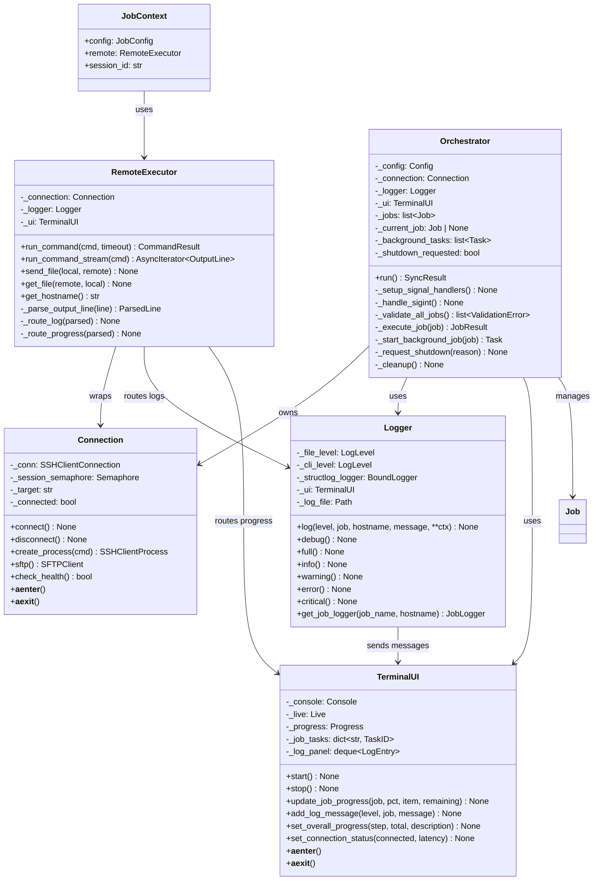

# Foundation Architecture

This document describes the architecture for the pc-switcher foundation infrastructure, covering the core components, their relationships, and key interaction patterns.

## Design Principles

- **Asyncio-native**: All I/O operations are async, enabling concurrent execution without threads
- **Single SSH connection**: Multiplexed sessions over one connection for efficiency
- **Structured communication**: JSONL protocol for target-side output parsing
- **Clear separation**: Jobs are isolated units; orchestrator handles coordination
- **Fail-safe**: Graceful degradation and proper cleanup on errors/interrupts

---

## Component Architecture


### Component Responsibilities

| Component | Responsibility |
|-----------|----------------|
| **CLI** | Entry point. Parses commands (`sync`, `logs`, `cleanup-snapshots`), loads config, instantiates and runs Orchestrator |
| **Orchestrator** | Central coordinator. Manages job lifecycle, signal handling, background tasks, and produces final sync summary |
| **Config** | Loads `~/.config/pc-switcher/config.yaml`, validates against JSON schemas, applies defaults |
| **Connection** | Manages SSH connection via asyncssh. Provides multiplexed sessions (multiple concurrent commands over single connection) |
| **RemoteExecutor** | Job-facing interface to Connection. Runs commands, transfers files, parses JSONL output from target |
| **Logger** | Unified logging with 6 levels. Routes to file (JSON) and terminal (formatted). Aggregates source + target logs |
| **TerminalUI** | Rich-based live display. Shows progress bars, log messages (filtered by cli_level), overall status |
| **Jobs** | Encapsulated sync operations. Each job validates config, executes operations, reports progress, handles termination |

---

## Class Diagram


### Supporting Classes



### Class Relationships

| Relationship | Description |
|--------------|-------------|
| Orchestrator → Connection | Owns and manages the SSH connection lifecycle |
| Orchestrator → Job[] | Creates, validates, and executes jobs in order |
| Job → JobContext | Receives context at execution time (config, remote, session_id) |
| JobContext → RemoteExecutor | Jobs use this to run commands on target |
| RemoteExecutor → Connection | Wraps Connection with job-friendly interface |
| RemoteExecutor → Logger | Routes parsed target output to logging |
| RemoteExecutor → TerminalUI | Routes progress updates to UI |
| Logger → TerminalUI | Sends log messages for display (if level >= cli_level) |

---

## Sequence Diagrams

### 1. User Aborts with Ctrl+C

When the user presses Ctrl+C, the orchestrator catches SIGINT, requests the current job to terminate gracefully, and performs cleanup. A second Ctrl+C forces immediate termination.


**Key points:**
- SIGINT handler sets `_shutdown_requested` flag and calls `request_termination()` on current job
- Job checks `termination_requested` property in its execution loop
- Grace period of 5 seconds for cleanup; force-kill after second SIGINT
- Exit code 130 indicates SIGINT termination (128 + signal number 2)

---

### 2. Job Raises Exception (Critical Failure)

When a job raises an unhandled exception, the orchestrator wraps it as a SyncError, logs at CRITICAL level, requests termination, and aborts the sync.


**Key points:**
- Any unhandled exception is caught and wrapped as `SyncError`
- CRITICAL log entry written with full exception details
- Job receives termination request for cleanup opportunity
- Remaining jobs are skipped; rollback offered if pre-sync snapshots exist
- Final summary shows which jobs succeeded/failed

---

### 3. Remote Command Fails

When a command executed on the target machine fails (non-zero exit code), RemoteExecutor returns a failure result. The job decides how to handle it.


**Key points:**
- `CommandResult` contains: `success`, `exit_code`, `stdout`, `stderr`
- Job has full control over error handling strategy
- Recoverable errors: log at ERROR level, continue execution
- Unrecoverable errors: raise `SyncError`, triggers critical failure flow

---

### 4. Job Logs a Message

Jobs log messages via their context. The Logger routes to file (JSON) and terminal (if level >= cli_level).


**Key points:**
- Jobs call `self.log(level, message, **context)` which delegates to JobContext
- Logger applies two independent filters: `file_level` and `cli_level`
- File output uses structlog JSONRenderer (one JSON object per line)
- Terminal output uses Rich formatting with color-coded levels

---

### 5. Job Reports Progress

Progress updates are displayed in the terminal UI and logged at FULL level.


**Key points:**
- Progress is optional but recommended for long-running operations
- UI shows per-job progress bar with percentage, current item, and ETA
- Progress also logged at FULL level for audit trail
- UI updates are batched/throttled to prevent excessive redraws

---

### 6. DiskSpaceMonitor Detects Low Space

The DiskSpaceMonitor runs as a background task, periodically checking disk space. When space falls below threshold, it triggers shutdown.


**Key points:**
- DiskSpaceMonitor checks both source and target at configurable interval
- Thresholds: `disk.preflight_minimum` (before sync) and `disk.runtime_minimum` (during sync)
- Values support percentage ("15%") or absolute ("40GiB")
- On detection, logs CRITICAL and calls `orchestrator.request_shutdown()`
- Current job receives termination request; remaining jobs skipped

---

## Streaming Output Architecture

Multiple concurrent sources produce output that must be displayed coherently in the terminal.


### Data Flow

| Source | Data Type | Destination |
|--------|-----------|-------------|
| Orchestrator | Overall progress (step N/M) | TerminalUI.set_overall_progress() |
| Jobs | Progress updates (%, item, ETA) | TerminalUI.update_job_progress() |
| Logger | Log messages (level >= cli_level) | TerminalUI.add_log_message() |
| Connection | Health status | TerminalUI.set_connection_status() |

### Concurrency Model

- **UI Refresh Task**: Runs at fixed interval (e.g., 100ms), renders current state
- **No locks needed**: Each component updates its own state; UI reads atomically during render
- **Backpressure**: Progress updates can be dropped if UI can't keep up (latest value wins)

---

## Target Communication Protocol (JSONL)

Target-side scripts output structured JSON Lines to stdout. Each line is a complete JSON object.

### Message Types

```json
{"type": "log", "level": "INFO", "message": "Starting file copy", "ts": "2025-11-27T10:30:00Z"}
{"type": "progress", "percent": 25, "item": "/home/user/docs/file.txt", "remaining_seconds": 45}
{"type": "log", "level": "DEBUG", "message": "Copied 1024 bytes", "ts": "2025-11-27T10:30:01Z"}
{"type": "progress", "percent": 50, "item": "/home/user/docs/other.txt", "remaining_seconds": 30}
{"type": "result", "success": true, "files_copied": 42, "bytes_transferred": 1048576}
```

### Schema

| Field | Type | Required | Description |
|-------|------|----------|-------------|
| `type` | string | yes | One of: `log`, `progress`, `result` |
| `level` | string | for log | Log level: DEBUG, FULL, INFO, WARNING, ERROR, CRITICAL |
| `message` | string | for log | Log message text |
| `ts` | string | for log | ISO 8601 timestamp |
| `percent` | int | for progress | 0-100 completion percentage |
| `item` | string | for progress | Current item being processed |
| `remaining_seconds` | int | for progress | Estimated seconds remaining |
| `success` | bool | for result | Whether operation succeeded |
| `*` | any | for result | Additional result data (job-specific) |

### Fallback Format

For simple shell scripts, a prefixed line format is also supported:

```text
[INFO] Starting file copy
[PROGRESS:25] /home/user/docs/file.txt
[DEBUG] Copied 1024 bytes
```

The RemoteExecutor parser handles both formats transparently.

---

## Execution Flow Summary


