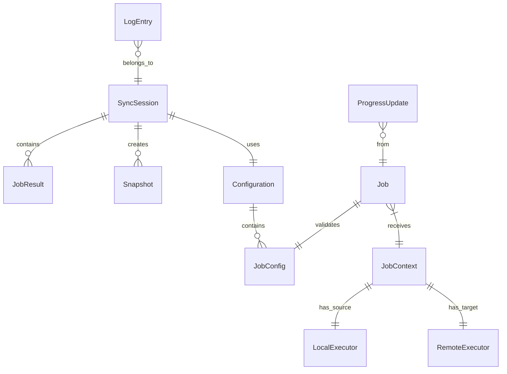
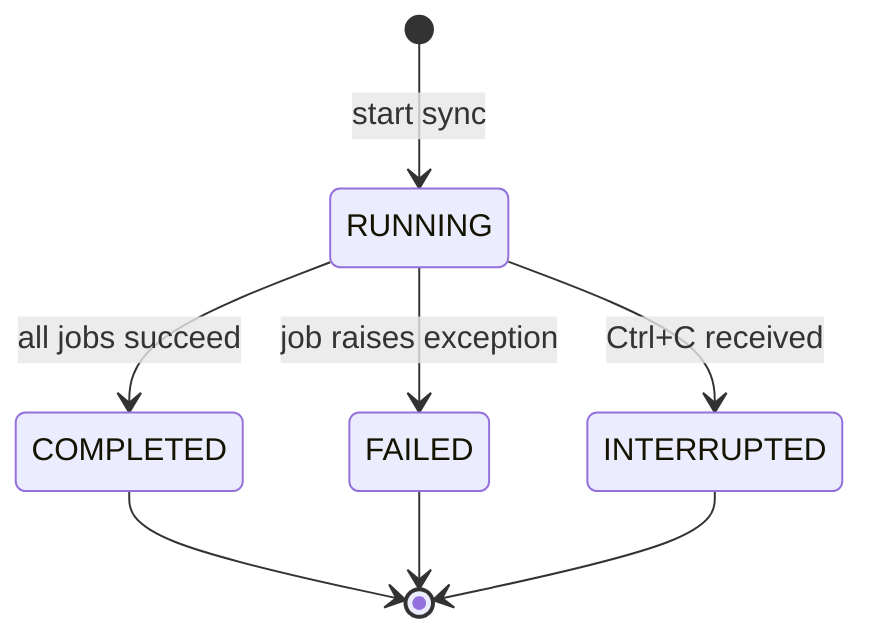
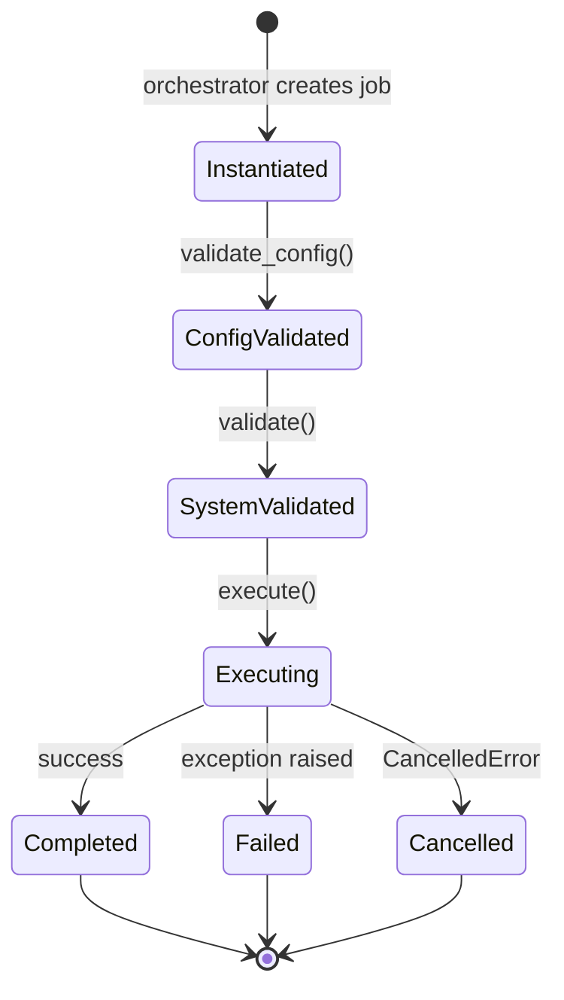

# Data Model: Foundation Infrastructure

**Feature**: 001-foundation
**Date**: 2025-11-29

This document defines the core entities, their relationships, and validation rules for the foundation infrastructure. Types are expressed in Python 3.14 syntax with modern annotations.

## Entity Overview



## Core Entities

### Host (Enum)

Represents the logical role of a machine in the sync operation.

```python
from enum import StrEnum

class Host(StrEnum):
    SOURCE = "source"
    TARGET = "target"
```

**Usage**: All internal code uses `Host` enum. Logger resolves to actual hostname for display.

---

### LogLevel (Enum)

Six-level logging hierarchy with explicit ordering.

```python
from enum import IntEnum

class LogLevel(IntEnum):
    DEBUG = 0     # Most verbose, internal diagnostics
    FULL = 1      # Operational details (file-level)
    INFO = 2      # High-level operations
    WARNING = 3   # Unexpected but non-fatal
    ERROR = 4     # Recoverable errors
    CRITICAL = 5  # Unrecoverable, sync must abort
```

**Ordering**: Lower value = more verbose. Level N includes all messages at level N and above.

---

### CommandResult

Result of executing a command via LocalExecutor or RemoteExecutor.

```python
from dataclasses import dataclass

@dataclass(frozen=True)
class CommandResult:
    exit_code: int
    stdout: str
    stderr: str

    @property
    def success(self) -> bool:
        return self.exit_code == 0
```

**Validation**: `exit_code` is non-negative integer. `stdout`/`stderr` may be empty strings.

---

### ProgressUpdate

Progress information emitted by jobs.

```python
from dataclasses import dataclass

@dataclass(frozen=True)
class ProgressUpdate:
    percent: int | None = None      # 0-100 if known
    current: int | None = None      # Current item count
    total: int | None = None        # Total items if known
    item: str | None = None         # Current item description
    heartbeat: bool = False         # True for activity indication only

    def __post_init__(self) -> None:
        if self.percent is not None:
            if not 0 <= self.percent <= 100:
                raise ValueError(f"percent must be 0-100, got {self.percent}")
```

**Rendering Logic**:
- `percent` set → progress bar with percentage
- `current` + `total` set → "45/100 items"
- `current` only → "45 items processed"
- `heartbeat=True` → spinner/activity indicator

---

### LogEvent

Event published to EventBus for logging.

```python
from dataclasses import dataclass, field
from datetime import datetime
from typing import Any

@dataclass(frozen=True)
class LogEvent:
    level: LogLevel
    job: str                        # Job name or "orchestrator"
    host: Host
    message: str
    context: dict[str, Any] = field(default_factory=dict)
    timestamp: datetime = field(default_factory=datetime.now)

    def to_dict(self) -> dict[str, Any]:
        """Convert to dict for JSON serialization via structlog."""
        return {
            "timestamp": self.timestamp.isoformat(),
            "level": self.level.name,
            "job": self.job,
            "host": self.host.value,
            "event": self.message,
            **self.context,
        }
```

**JSON Serialization** (file output via structlog JSONRenderer per FR-022):
```json
{
  "timestamp": "2025-11-29T14:30:22.123456",
  "level": "INFO",
  "job": "packages",
  "host": "source",
  "event": "Starting package list comparison",
  "package_count": 1523
}
```

**Note**: File logging uses structlog's `JSONRenderer` to produce one JSON object per line. The `to_dict()` method provides the data structure; structlog handles the actual JSON serialization. Context fields are merged into the top-level JSON object (not nested under "context").

---

### ProgressEvent

Event published to EventBus for progress updates.

```python
@dataclass(frozen=True)
class ProgressEvent:
    job: str
    update: ProgressUpdate
    timestamp: datetime = field(default_factory=datetime.now)
```

---

### ConnectionEvent

Event published when SSH connection status changes.

```python
from dataclasses import dataclass

@dataclass(frozen=True)
class ConnectionEvent:
    status: str               # "connected", "disconnected", "reconnecting"
    latency: float | None     # Round-trip time in ms, None if disconnected
```

---

### SyncSession

Represents a single sync operation from start to finish.

```python
from dataclasses import dataclass, field
from datetime import datetime
from enum import StrEnum
from pathlib import Path

class SessionStatus(StrEnum):
    RUNNING = "running"
    COMPLETED = "completed"
    FAILED = "failed"
    INTERRUPTED = "interrupted"

@dataclass
class SyncSession:
    session_id: str                          # 8-char hex, e.g., "abc12345"
    started_at: datetime
    source_hostname: str
    target_hostname: str
    config: Configuration
    status: SessionStatus = SessionStatus.RUNNING
    ended_at: datetime | None = None
    job_results: list[JobResult] = field(default_factory=list)
    error_message: str | None = None
    log_file: Path | None = None

    def __post_init__(self) -> None:
        if len(self.session_id) != 8:
            raise ValueError(f"session_id must be 8 chars, got {len(self.session_id)}")
```

**Session ID Generation**: `secrets.token_hex(4)` produces 8 hex characters.

---

### JobResult

Result of executing a single job.

```python
from dataclasses import dataclass
from datetime import datetime, timedelta
from enum import StrEnum

class JobStatus(StrEnum):
    SUCCESS = "success"
    SKIPPED = "skipped"       # Disabled in config
    FAILED = "failed"         # Raised exception

@dataclass(frozen=True)
class JobResult:
    job_name: str
    status: JobStatus
    started_at: datetime
    ended_at: datetime
    error_message: str | None = None

    @property
    def duration(self) -> timedelta:
        return self.ended_at - self.started_at
```

---

### Snapshot

Represents a btrfs snapshot.

```python
from dataclasses import dataclass
from datetime import datetime
from enum import StrEnum

class SnapshotPhase(StrEnum):
    PRESYNC = "presync"
    POSTSYNC = "postsync"

@dataclass(frozen=True)
class Snapshot:
    subvolume: str            # e.g., "@home"
    phase: SnapshotPhase
    timestamp: datetime
    session_id: str
    host: Host
    path: str                 # Full path on filesystem

    @property
    def name(self) -> str:
        """Snapshot name per FR-010: @home-presync-20251129T143022-abc12345"""
        ts = self.timestamp.strftime("%Y%m%dT%H%M%S")
        return f"{self.subvolume}-{self.phase.value}-{ts}-{self.session_id}"
```

---

### Configuration

Parsed and validated configuration from YAML file.

```python
from dataclasses import dataclass, field
from pathlib import Path
from typing import Any

@dataclass
class DiskConfig:
    preflight_minimum: str = "20%"      # Percentage or absolute (e.g., "50GiB")
    runtime_minimum: str = "15%"
    check_interval: int = 30            # Seconds

@dataclass
class BtrfsConfig:
    subvolumes: list[str] = field(default_factory=lambda: ["@", "@home"])
    keep_recent: int = 3
    max_age_days: int | None = None     # None = no age limit

@dataclass
class Configuration:
    log_file_level: LogLevel = LogLevel.FULL
    log_cli_level: LogLevel = LogLevel.INFO
    sync_jobs: dict[str, bool] = field(default_factory=dict)  # job_name -> enabled
    disk: DiskConfig = field(default_factory=DiskConfig)
    btrfs_snapshots: BtrfsConfig = field(default_factory=BtrfsConfig)
    job_configs: dict[str, dict[str, Any]] = field(default_factory=dict)

    @classmethod
    def from_yaml(cls, path: Path) -> Configuration:
        """Load and validate configuration from YAML file."""
        ...

    def get_job_config(self, job_name: str) -> dict[str, Any]:
        """Get job-specific config, returning empty dict if not specified."""
        return self.job_configs.get(job_name, {})
```

---

### JobContext

Context provided to jobs at execution time.

```python
from dataclasses import dataclass

@dataclass(frozen=True)
class JobContext:
    config: dict[str, Any]        # Job-specific config (validated)
    source: LocalExecutor
    target: RemoteExecutor
    event_bus: EventBus           # For logging and progress (jobs use _log() helper)
    session_id: str
    source_hostname: str
    target_hostname: str
```

---

### ConfigError / ValidationError

Error types for validation phases.

```python
from dataclasses import dataclass

@dataclass(frozen=True)
class ConfigError:
    """Error from Phase 1 (schema) or Phase 2 (job config) validation."""
    job: str | None     # None for global config errors
    path: str           # JSON path to invalid value
    message: str

@dataclass(frozen=True)
class ValidationError:
    """Error from Phase 3 (system state) validation."""
    job: str
    host: Host
    message: str
```

---

### DiskSpaceCriticalError

Exception raised by DiskSpaceMonitorJob.

```python
class DiskSpaceCriticalError(Exception):
    def __init__(
        self,
        host: Host,
        hostname: str,
        free_space: str,
        threshold: str,
    ) -> None:
        self.host = host
        self.hostname = hostname
        self.free_space = free_space
        self.threshold = threshold
        super().__init__(
            f"{hostname}: Disk space {free_space} below threshold {threshold}"
        )
```

---

## Interface Contracts

### Executor Protocol

```python
from typing import Protocol, AsyncIterator

class Process(Protocol):
    """Handle for a running process with streaming output.

    Note: stdin is intentionally not supported. All commands must be
    non-interactive. This is a design constraint to ensure reliable
    automated execution without prompts or user input requirements.
    Commands that require input should be invoked with appropriate
    flags (e.g., apt-get -y, rm -f) or have input pre-configured.
    """
    async def stdout(self) -> AsyncIterator[str]: ...
    async def stderr(self) -> AsyncIterator[str]: ...
    async def wait(self) -> CommandResult: ...
    async def terminate(self) -> None: ...

class Executor(Protocol):
    async def run_command(
        self,
        cmd: str,
        timeout: float | None = None,
    ) -> CommandResult: ...

    async def start_process(self, cmd: str) -> Process: ...

    async def terminate_all_processes(self) -> None: ...
```

### RemoteExecutor Extensions

```python
class RemoteExecutor(Executor):
    async def send_file(self, local: Path, remote: str) -> None: ...
    async def get_file(self, remote: str, local: Path) -> None: ...
    async def get_hostname(self) -> str: ...
```

---

### Job Abstract Base Class

```python
from abc import ABC, abstractmethod
from typing import Any, ClassVar

class Job(ABC):
    name: ClassVar[str]
    required: ClassVar[bool] = False
    CONFIG_SCHEMA: ClassVar[dict[str, Any]] = {}

    @classmethod
    def validate_config(cls, config: dict[str, Any]) -> list[ConfigError]:
        """Validate job-specific configuration. Returns list of errors."""
        ...

    @abstractmethod
    async def validate(self, context: JobContext) -> list[ValidationError]:
        """Validate system state before execution."""
        ...

    @abstractmethod
    async def execute(self, context: JobContext) -> None:
        """Execute job logic. Raises exception on failure."""
        ...

    def _log(
        self,
        context: JobContext,
        host: Host,
        level: LogLevel,
        message: str,
        **extra: Any,
    ) -> None:
        """Log a message through EventBus.

        Args:
            host: Which machine this log relates to (SOURCE or TARGET)
        """
        ...

    def _report_progress(
        self,
        context: JobContext,
        update: ProgressUpdate,
    ) -> None:
        """Report progress through EventBus."""
        ...
```

### Job Hierarchy

```python
class SystemJob(Job):
    """Required infrastructure jobs (snapshots, installation)."""
    required: ClassVar[bool] = True

class SyncJob(Job):
    """Optional user-facing sync jobs."""
    required: ClassVar[bool] = False

class BackgroundJob(Job):
    """Jobs that run concurrently (disk monitoring)."""
    required: ClassVar[bool] = True
```

---

### EventBus

```python
import asyncio

type Event = LogEvent | ProgressEvent | ConnectionEvent

class EventBus:
    def __init__(self) -> None:
        self._consumers: list[asyncio.Queue[Event]] = []
        self._closed = False

    def subscribe(self) -> asyncio.Queue[Event]:
        """Create and return a new consumer queue."""
        queue: asyncio.Queue[Event] = asyncio.Queue()
        self._consumers.append(queue)
        return queue

    def publish(self, event: Event) -> None:
        """Publish event to all consumer queues (non-blocking)."""
        if self._closed:
            return
        for queue in self._consumers:
            queue.put_nowait(event)

    def close(self) -> None:
        """Signal consumers to drain and exit."""
        self._closed = True
        for queue in self._consumers:
            queue.put_nowait(None)  # Sentinel value
```

---

## State Transitions

### SyncSession State Machine



### Job Lifecycle



---

## Validation Rules Summary

| Entity | Field | Rule |
|--------|-------|------|
| ProgressUpdate | percent | 0-100 if set |
| SyncSession | session_id | Exactly 8 hex characters |
| Configuration | log_*_level | Valid LogLevel enum |
| Configuration | disk.preflight_minimum | Pattern: `\d+%` or `\d+(GiB\|MiB\|GB\|MB)` |
| BtrfsConfig | subvolumes | Non-empty list, each starts with `@` |
| Snapshot | name | Pattern: `<subvol>-<phase>-<timestamp>-<session_id>` |
