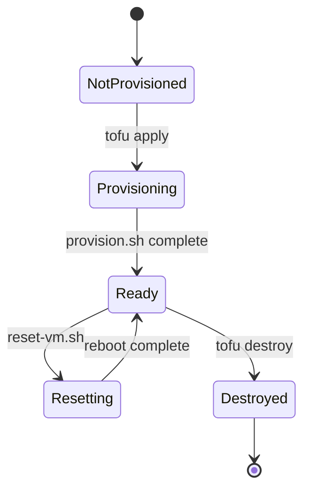
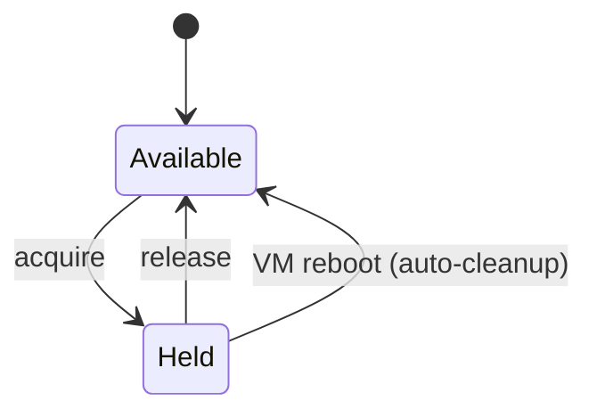

# Testing Framework Data Model

**Feature**: 002-testing-framework
**Date**: 2025-12-05

## Overview

This feature is primarily infrastructure and configuration-focused. The data model captures the key entities involved in test execution, VM management, and CI/CD coordination.

---

## Entities

### TestVM

Represents a Hetzner Cloud VM used for integration testing.

| Field | Type | Description |
|-------|------|-------------|
| name | string | VM name (e.g., "pc-switcher-pc1") |
| ipv4_address | string | Public IPv4 address |
| server_type | string | Hetzner server type (e.g., "cx23") |
| location | string | Datacenter location (e.g., "fsn1") |
| ssh_user | string | SSH user for test access ("testuser") |
| baseline_snapshot_root | string | Path to baseline @ snapshot (`/.snapshots/baseline/@`) |
| baseline_snapshot_home | string | Path to baseline @home snapshot (`/.snapshots/baseline/@home`) |

**State Transitions**:

**Relationships**:
- Has one baseline snapshot set (@ + @home)
- May have one active test session (via lock)

---

### TestLock

Represents the concurrency control mechanism preventing simultaneous test runs.

| Field | Type | Description |
|-------|------|-------------|
| holder | string | Lock holder identity (CI job ID or username) |
| acquired | datetime | ISO 8601 timestamp when lock was acquired |
| hostname | string | Machine that acquired the lock |

**Storage**: JSON file at `/tmp/pc-switcher-integration-test.lock` on pc1 VM

**Validation Rules**:
- Lock can only be acquired if not currently held
- Lock times out after 5 minutes of waiting (fail with error)
- Lock file cleared on VM reboot

**State Transitions**:

---

### TestSession

Represents a single integration test run.

| Field | Type | Description |
|-------|------|-------------|
| session_id | string | Unique identifier (CI job ID or local timestamp) |
| holder | string | Same as TestLock.holder |
| vm_reset_status | enum | pending, in_progress, completed, failed |
| lock_acquired | boolean | Whether lock was successfully acquired |
| test_results | object | pytest exit code and summary |

**State Transitions**:

---

### BtrfsSnapshot

Represents a btrfs subvolume snapshot on a test VM.

| Field | Type | Description |
|-------|------|-------------|
| path | string | Absolute path (e.g., `/.snapshots/baseline/@`) |
| subvol_id | integer | btrfs subvolume ID |
| readonly | boolean | Whether snapshot is read-only |
| created | datetime | Creation timestamp |
| parent | string | Parent subvolume path (for derived snapshots) |

**Types**:
- **Baseline**: Read-only, created at provisioning, never deleted. Located at `/.snapshots/baseline/@` and `/.snapshots/baseline/@home`
- **Active**: Writable root subvolumes `@` and `@home` at btrfs top level. Replaced from baseline on reset.
- **Test artifact**: Created by tests in `/.snapshots/pc-switcher/test-*`

---

### CIWorkflow

Represents a GitHub Actions workflow configuration.

| Field | Type | Description |
|-------|------|-------------|
| name | string | Workflow file name (e.g., "ci.yml") |
| trigger | enum | push, pull_request, workflow_dispatch |
| target_branches | string[] | Branches that trigger the workflow |
| concurrency_group | string | Concurrency group identifier |
| cancel_in_progress | boolean | Whether to cancel queued runs |

**Instances**:
- `ci.yml`: Unit tests on every push (no concurrency restriction)
- `integration.yml`: Integration tests on PR to main (shared concurrency group)

---

## Environment Variables

### Required for Integration Tests

| Variable | Description | Default |
|----------|-------------|---------|
| PC_SWITCHER_TEST_PC1_HOST | PC1 VM hostname/IP | - |
| PC_SWITCHER_TEST_PC2_HOST | PC2 VM hostname/IP | - |
| PC_SWITCHER_TEST_USER | SSH user on VMs | testuser |

### Required for Infrastructure Management

| Variable | Description | Default |
|----------|-------------|---------|
| HCLOUD_TOKEN | Hetzner Cloud API token | - |
| SSH_PUBLIC_KEY | Path to SSH public key | ~/.ssh/id_ed25519.pub |
| STORAGE_BOX_HOST | Hetzner Storage Box hostname | - |
| STORAGE_BOX_USER | Storage Box SSH user (sub-account) | - |
| STORAGE_BOX_PATH | Path to tfstate on Storage Box | pc-switcher/test-infrastructure |

### CI-Specific

| Variable | Description | Default |
|----------|-------------|---------|
| CI_JOB_ID | CI job identifier for lock | $USER |
| CI | Indicates CI environment | - |

---

## File Artifacts

### Infrastructure State

| File | Location | Purpose |
|------|----------|---------|
| terraform.tfstate | tests/infrastructure/ | OpenTofu state (gitignored) |
| terraform.tfvars | tests/infrastructure/ | Variable overrides (gitignored) |

### Test Artifacts

| File | Location | Purpose |
|------|----------|---------|
| pytest output | CI artifacts | Test logs for debugging |
| coverage reports | tests/htmlcov/ | Coverage HTML report (gitignored) |

---

## Validation Rules

### VM Reset Preconditions
1. Lock must be held by current session
2. Both VMs must be reachable via SSH
3. Baseline snapshots must exist and be read-only

### Integration Test Preconditions
1. Environment variables must be set (or tests skip)
2. VMs must be in "Ready" state
3. Lock must be acquired

### Baseline Snapshot Invariants
1. Baseline snapshots are never modified after creation
2. Baseline snapshots contain clean OS + testuser + SSH keys
3. Baseline paths are consistent: `/.snapshots/baseline/@` and `/.snapshots/baseline/@home`
